# 20C114291 内容识别

整页 PNG：`outputs/20C114291_assets/images/page_1.png`

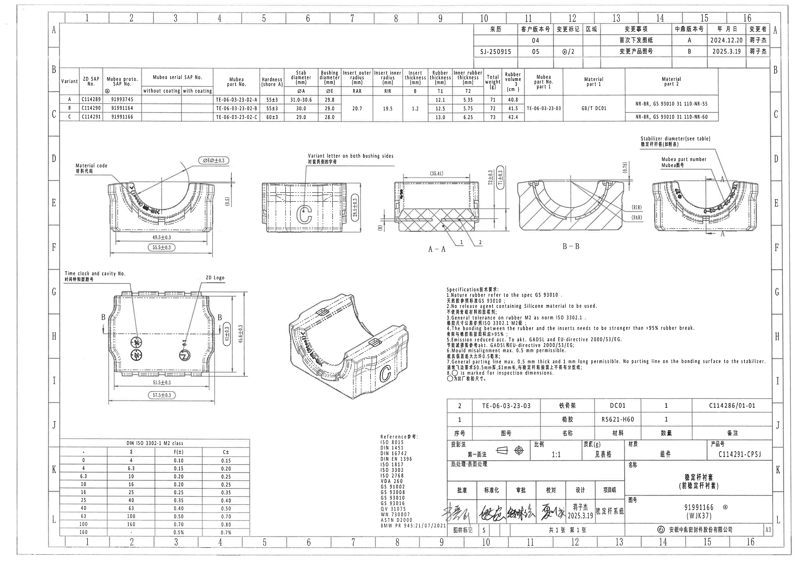

页面：1；整页图像尺寸：4959 x 3505 px。以下按原图从上到下、从左到右的结构列出裁切对象。括号内尺寸按原图保留为参考尺寸；圆圈/圆角框标出的尺寸按 NOTES 第 8 条理解为出厂检验尺寸。

## object_1：修订履历表

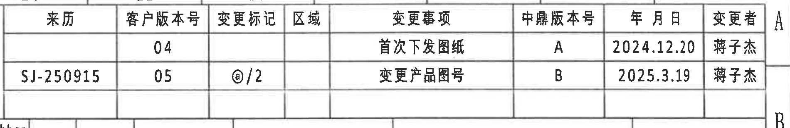

原图位置/视图名称：页 1 右上角修订履历表，bbox `[2920, 135, 4820, 445]`。

原表还原：

| 来历 | 客户版本号 | 变更标记 | 区域 | 变更事项 | 中鼎版本号 | 年月日 | 变更者 |
|---|---:|---|---|---|---|---|---|
|  | 04 |  |  | 首次下发图纸 | A | 2024.12.20 | 蒋子杰 |
| SJ-250915 | 05 | ⓐ/2 |  | 变更产品图号 | B | 2025.3.19 | 蒋子杰 |

提取表格：

| 提取项 | 原图数值或文本 | 含义说明 |
|---|---|---|
| 客户版本 04 | 首次下发图纸；中鼎版本号 A；2024.12.20；蒋子杰 | 初次发行记录。 |
| 客户版本 05 | 来历 SJ-250915；变更标记 ⓐ/2；变更产品图号；中鼎版本号 B；2025.3.19；蒋子杰 | 产品图号变更记录，变更标记与图中 ⓐ 标识相关。 |

边界归属说明：裁切仅包含修订履历表及其表格边框；下方参数表的上边框有少量相邻线条进入，但未把参数表字段归入本对象。

## object_2：变型参数表

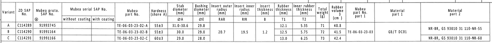

原图位置/视图名称：页 1 上方横向参数表，bbox `[360, 400, 4460, 765]`。原图中 RAR/RIR/B、Mubea part No. part 1、Material part 1 等字段显示为纵向合并单元；下表以“合并”标明。

原表还原：

| Variant | ZD SAP No. | Mubea proto. SAP No. | Mubea serial SAP No. without coating | Mubea serial SAP No. with coating | Mubea part No. | Hardness (shore A) | Stab diameter ØA (mm) | Bushing diameter ØE (mm) | Insert outer radius RAR (mm) | Insert inner radius RIR (mm) | Insert thickness B (mm) | Rubber thickness T1 (mm) | Inner rubber thickness T2 (mm) | Total weight (g) | Rubber volume (cm³) | Mubea part No. part 1 | Material part 1 | Material part 2 |
|---|---|---|---|---|---|---|---|---|---|---|---|---|---|---:|---:|---|---|---|
| A | C114289 | 91993745 |  |  | TE-06-03-23-02-A | 55±3 | 31.0-30.6 | 29.8 | 合并：20.7 | 合并：19.5 | 合并：1.2 | 12.1 | 5.35 | 71 | 40.8 | 合并：TE-06-03-23-03 | 合并：GB/T DC01 | NR-BR, GS 93010 31 110-NR-55 |
| B | C114290 | 91991164 |  |  | TE-06-03-23-02-B | 55±3 | 30.0 | 29.0 | 合并：20.7 | 合并：19.5 | 合并：1.2 | 12.5 | 5.75 | 72 | 41.5 | 合并：TE-06-03-23-03 | 合并：GB/T DC01 | NR-BR, GS 93010 31 110-NR-55 |
| C | C114291 | 91991166 |  |  | TE-06-03-23-02-C | 60±3 | 29.0 | 28.0 | 合并：20.7 | 合并：19.5 | 合并：1.2 | 13.0 | 6.25 | 73 | 42.4 | 合并：TE-06-03-23-03 | 合并：GB/T DC01 | NR-BR, GS 93010 31 110-NR-60 |

提取表格：

| 提取项 | 原图数值或文本 | 含义说明 |
|---|---|---|
| 当前产品对应行 | Variant C；ZD SAP No. C114291；Mubea proto. SAP No. 91991166；Mubea part No. TE-06-03-23-02-C | 与标题栏产品号 C114291-CPSJ、图号 91991166 对应。 |
| ØA 稳定杆杆径 | A: 31.0-30.6；B: 30.0；C: 29.0 | object_7 中 “Stabilizer diameter (see table)” 引用此列。 |
| ØE 衬套孔径 | A: 29.8；B: 29.0；C: 28.0 | object_3 中 ØE 标注引用此列。 |
| RAR/RIR/B | RAR 20.7；RIR 19.5；B 1.2 | 插入件外半径、内半径、厚度的表格变量，object_5/object_6 中以括号变量引用。 |
| T1/T2 | A: T1 12.1、T2 5.35；B: T1 12.5、T2 5.75；C: T1 13.0、T2 6.25 | 橡胶厚度/内橡胶厚度变量，object_5 中带 ±0.3 标注。 |
| 材料 | part 1: GB/T DC01；part 2: A/B 为 NR-BR, GS 93010 31 110-NR-55，C 为 NR-BR, GS 93010 31 110-NR-60 | 金属件和橡胶材料对应。 |

边界归属说明：裁切完整包含表头、三行 A/B/C 数据及右侧材料列；下方加工视图未进入裁切区域。

## object_3：左上正面加工视图

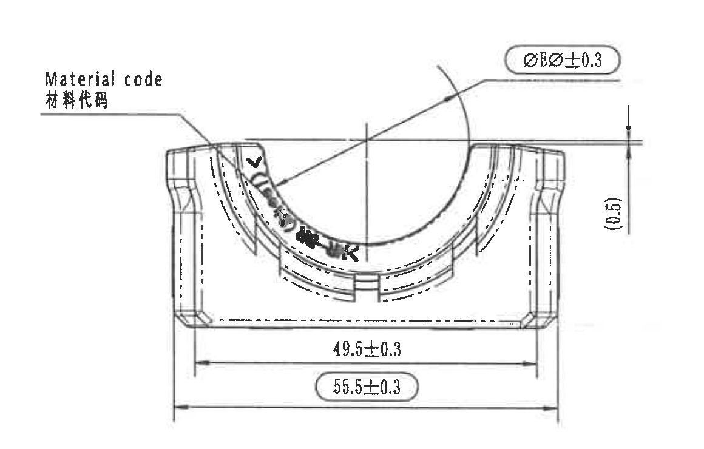

原图位置/视图名称：页 1 左上正面视图，bbox `[395, 895, 1555, 1635]`。

| 提取项 | 原图数值或文本 | 含义说明 |
|---|---|---|
| 材料代码位置 | Material code / 材料代码 | 引出线指向左侧内弧区域的材料代码标识；弧面文字因扫描和弯曲排布无法可靠逐字确认。 |
| 孔径变量检验尺寸 | ØEر0.3 | 原图圆角框内标注，表示 ØE 相关孔径/衬套直径检验尺寸，ØE 数值见 object_2 参数表。 |
| 内侧宽度 | 49.5±0.3 | 下方内侧横向尺寸。 |
| 总宽度检验尺寸 | 55.5±0.3 | 下方圆角框内横向尺寸，按 NOTES 第 8 条为出厂检验尺寸。 |
| 参考间隙 | (0.5) | 右侧竖向括号参考尺寸，表示边缘/高度方向的参考间隙，不作为独立公差控制尺寸。 |
| 角度/弧向尺寸 | 未见独立角度数值；弧形轮廓由 ØE 及图形控制 | 本视图有圆弧轮廓，但未见单独角度或弧长标注。 |

边界归属说明：裁切完整包含正面视图、所有横向/竖向尺寸线、箭头、材料代码引出线及 ØE 标注；未混入 A-A/B-B 剖视尺寸。

## object_4：中上侧面加工视图

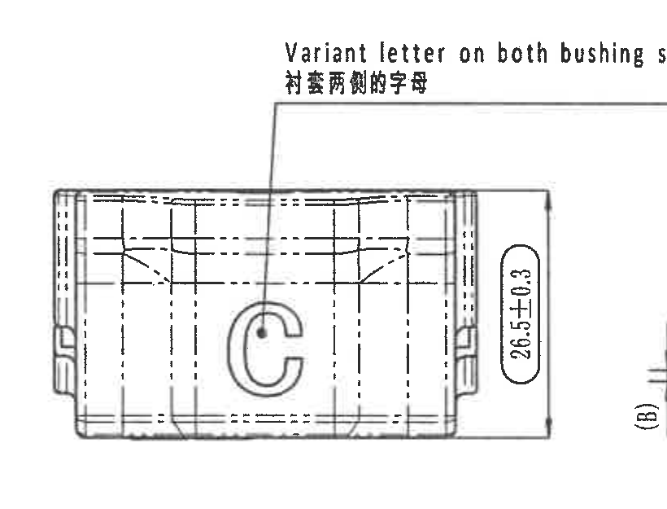

原图位置/视图名称：页 1 中上侧面视图，bbox `[1555, 900, 2375, 1525]`。

| 提取项 | 原图数值或文本 | 含义说明 |
|---|---|---|
| 两侧变型字母说明 | Variant letter on both bushing sides / 衬套两侧的字母 | 引出线指向侧面大写字母位置，说明变型字母需在衬套两侧出现。 |
| 变型字母 | C | 当前视图中显示 Variant C。 |
| 高度检验尺寸 | 26.5±0.3 | 右侧圆角框内竖向尺寸，按 NOTES 第 8 条为出厂检验尺寸。 |
| 内部结构线 | 虚线、中心线、插入件轮廓 | 表示侧向内部结构和隐藏边。 |

边界归属说明：裁切为了保留完整引出说明，右下边缘可见相邻 A-A 区域的 `(B)` 标注一角；该 `(B)` 不归入本侧面视图，未在本对象提取表中作为本视图尺寸记录。

## object_5：A-A 剖面视图

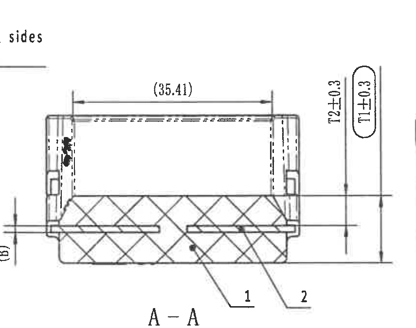

原图位置/视图名称：页 1 中上 A-A 剖视，bbox `[2345, 890, 3200, 1565]`。

| 提取项 | 原图数值或文本 | 含义说明 |
|---|---|---|
| 剖面名称 | A-A | 与 object_7 的 A-A 剖切标记对应。 |
| 横向参考尺寸 | (35.41) | 顶部括号参考尺寸，表示剖视上方横向参考距离。 |
| 内橡胶厚度 | T2±0.3 | 右侧竖向尺寸；T2 数值见 object_2 参数表。 |
| 橡胶厚度检验尺寸 | T1±0.3 | 右侧圆角框内竖向尺寸，按 NOTES 第 8 条为出厂检验尺寸；T1 数值见 object_2 参数表。 |
| 插入件厚度参考 | (B) | 左侧括号变量尺寸，引用 object_2 参数表中的 Insert thickness B=1.2 mm。 |
| 零件序号 1 | 1 | 引出线指向橡胶主体；对应 object_13 明细表序号 1“橡胶”。 |
| 零件序号 2 | 2 | 引出线指向金属骨架/插入件；对应 object_13 明细表序号 2“铁骨架”。 |
| 弧度/半径 | 未见单独数值；截面曲面与 RIR/RAR 变量相关 | 弧形结构的变量半径在 object_6 和 object_2 中给出。 |

边界归属说明：裁切完整包含 A-A 剖面、(35.41)、T2±0.3、T1±0.3、(B)、项目号 1/2 和剖面名；左上角残留侧面说明末尾字符，不归入 A-A 提取内容。

## object_6：B-B 剖面视图

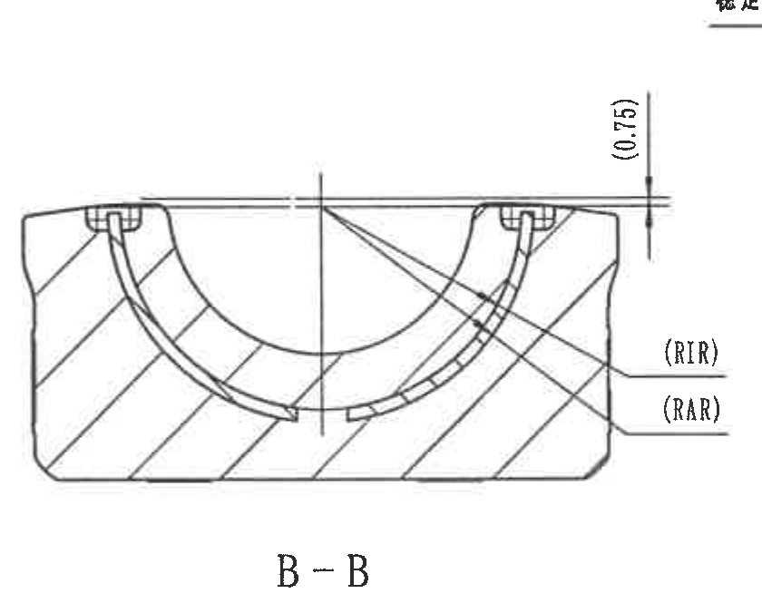

原图位置/视图名称：页 1 右上 B-B 剖视，bbox `[3175, 895, 4015, 1560]`。

| 提取项 | 原图数值或文本 | 含义说明 |
|---|---|---|
| 剖面名称 | B-B | 与 object_8 的 B-B 剖切标记对应。 |
| 顶部参考尺寸 | (0.75) | 右上竖向括号参考尺寸。 |
| 内半径变量 | (RIR) | 右侧引出线指向内侧插入件半径，数值见 object_2：RIR=19.5 mm。 |
| 外半径变量 | (RAR) | 右侧引出线指向外侧插入件半径，数值见 object_2：RAR=20.7 mm。 |
| 剖面结构 | 斜剖线、中心线、弧形橡胶/骨架轮廓 | 表示 B-B 截面结构。 |

边界归属说明：裁切完整包含 B-B 剖面和 `(0.75)/(RIR)/(RAR)` 标注；右上方有其他区域文字残影，未归入 B-B 内容。

## object_7：右上正面局部/标识视图

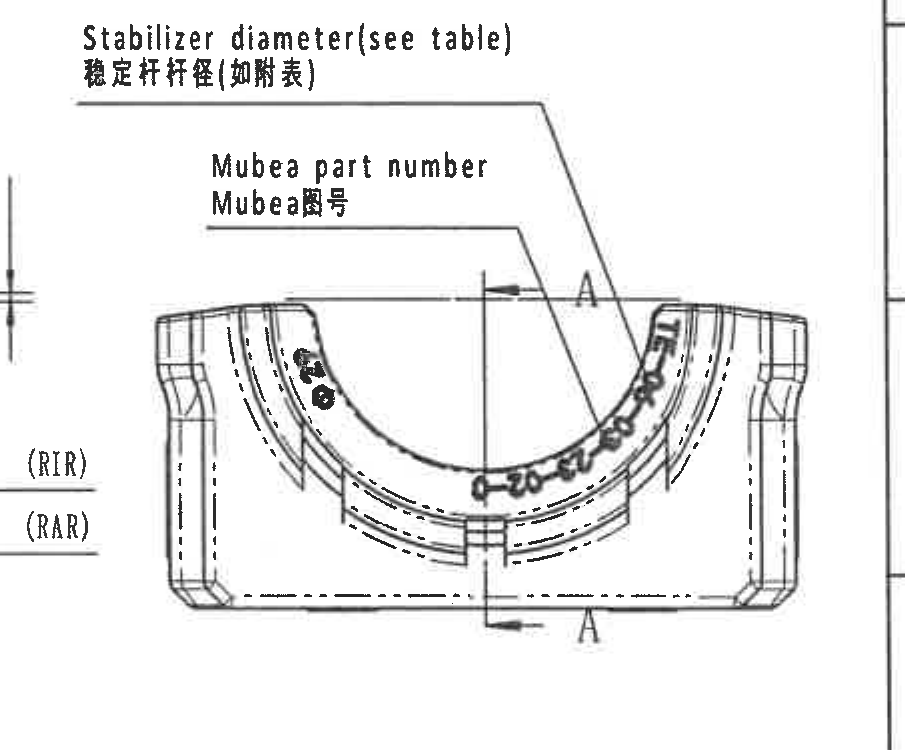

原图位置/视图名称：页 1 右上正面局部/标识视图，bbox `[3880, 820, 4785, 1570]`。

| 提取项 | 原图数值或文本 | 含义说明 |
|---|---|---|
| 稳定杆杆径说明 | Stabilizer diameter (see table) / 稳定杆杆径(如附表) | 引出线指向上部开口/稳定杆接触区域；对应 object_2 的 ØA 列。 |
| Mubea 件号位置 | Mubea part number / Mubea番号 | 引出线指向内弧上的 Mubea 件号标记区域；弧面印字受扫描影响，具体字符以 object_2 的 Mubea part No. 表字段为准。 |
| A-A 剖切标记 | A（上、下各一处） | 上下箭头及字母 A 指示 A-A 剖切位置，对应 object_5。 |
| 弧面标识 | 弧面上可见弯曲字符 | 用于零件标识/件号位置说明，原图模糊未逐字转写。 |

边界归属说明：为完整保留 Stabilizer diameter 和 Mubea part number 引出线，左侧带入 B-B 的 `(RIR)/(RAR)` 残留；这些残留已归入 object_6，不在本对象提取。

## object_8：左下俯视/底视加工视图

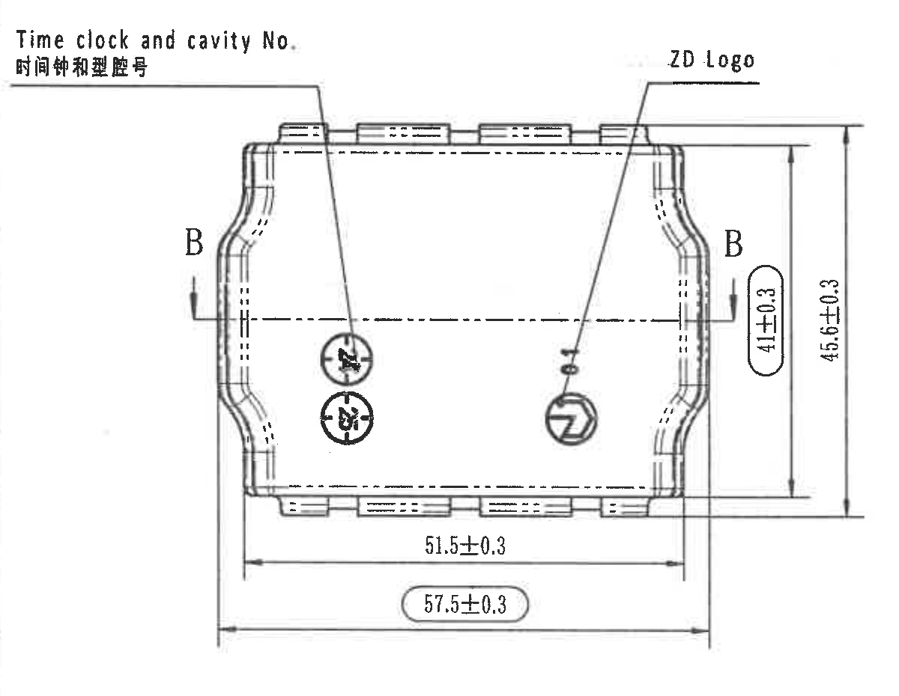

原图位置/视图名称：页 1 左下俯视/底视，bbox `[380, 1640, 1580, 2570]`。

| 提取项 | 原图数值或文本 | 含义说明 |
|---|---|---|
| 时间钟和型腔号 | Time clock and cavity No. / 时间钟和型腔号 | 引出线指向左中两个圆形标记。 |
| ZD Logo | ZD Logo | 引出线指向右中圆形 ZD 标识。 |
| B-B 剖切标记 | B、B | 左右两侧剖切标记，对应 object_6。 |
| 内部高度检验尺寸 | 41±0.3 | 右侧圆角框内竖向尺寸，按 NOTES 第 8 条为出厂检验尺寸。 |
| 总高度 | 45.6±0.3 | 最右侧竖向总高度尺寸。 |
| 内侧横向尺寸 | 51.5±0.3 | 下方内侧横向尺寸。 |
| 总宽度检验尺寸 | 57.5±0.3 | 下方圆角框内横向总宽度，按 NOTES 第 8 条为出厂检验尺寸。 |
| 角度/弧向尺寸 | 未见独立角度或弧长数值 | 本视图仅给出线性高度/宽度尺寸和标识位置。 |

边界归属说明：裁切完整包含本视图外形、B-B 剖切标记、时间钟/型腔号、ZD Logo 及全部尺寸线和箭头；未混入右侧轴测图或下方表格。

## object_9：中下轴测视图

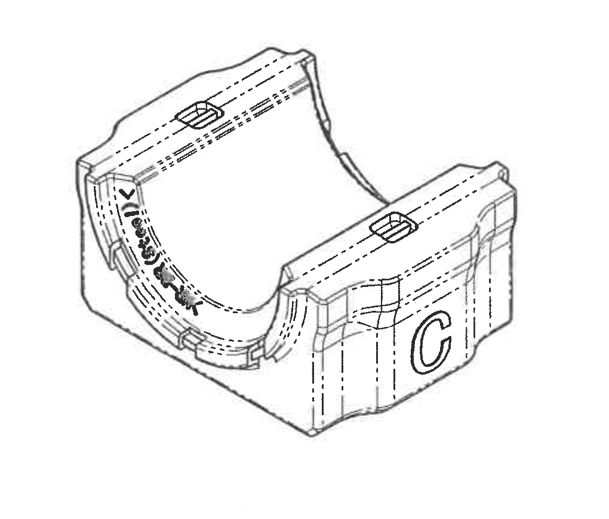

原图位置/视图名称：页 1 中下轴测图，bbox `[1660, 1740, 2680, 2610]`。

| 提取项 | 原图数值或文本 | 含义说明 |
|---|---|---|
| 立体结构 | 轴测零件外形、上部插入件/凸台、内弧、侧壁 | 用于展示零件三维结构，不给出独立尺寸。 |
| 变型字母 | C | 侧面可见 Variant C 标识，与 object_4 一致。 |
| 弧面标识 | 内弧有弯曲字符，扫描模糊 | 表示内弧标识位置；不可靠转写具体字符。 |
| 尺寸 | 未见尺寸数值 | 本对象无可提取线性尺寸、角度、半径或公差标注。 |

边界归属说明：裁切只包含轴测图主体，未带入右侧 NOTES 或左侧俯视图尺寸。

## object_10：NOTES / Specification 技术要求

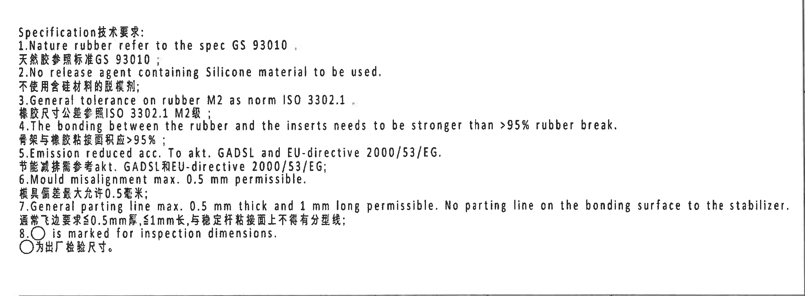

原图位置/视图名称：页 1 右中 NOTES，bbox `[2715, 1710, 4775, 2470]`。

| 提取项 | 原图数值或文本 | 含义说明 |
|---|---|---|
| 标题 | Specification技术要求: | 技术要求区标题。 |
| 1 | Nature rubber refer to the spec GS 93010. / 天然胶参照标准GS 93010; | 天然胶材料按 GS 93010。 |
| 2 | No release agent containing Silicone material to be used. / 不使用含硅材料的脱模剂; | 禁止使用含硅脱模剂。 |
| 3 | General tolerance on rubber M2 as norm ISO 3302.1 / 橡胶尺寸公差参照ISO 3302.1 M2级; | 橡胶通用公差等级 M2。 |
| 4 | The bonding between the rubber and the inserts needs to be stronger than >95% rubber break. / 骨架与橡胶粘接面积应>95%; | 橡胶与插入件粘接要求。 |
| 5 | Emission reduced acc. To akt. GADSL and EU-directive 2000/53/EG. / 节能减排需参考akt. GADSL和EU-directive 2000/53/EG; | 排放/环保法规要求。 |
| 6 | Mould misalignment max. 0.5 mm permissible. / 模具偏差最大允许0.5毫米; | 模具错位允许上限。 |
| 7 | General parting line max. 0.5 mm thick and 1 mm long permissible. No parting line on the bonding surface to the stabilizer. / 通常飞边要求≤0.5mm厚, ≤1mm长，与稳定杆粘接面上不得有分型线; | 飞边/分型线要求。 |
| 8 | ○ is marked for inspection dimensions. / ○为出厂检验尺寸。 | 圆圈/圆角框标出的尺寸为出厂检验尺寸。 |

边界归属说明：裁切完整包含 1-8 条 NOTES 文本；底部邻近标题栏上边线进入裁切，但没有标题栏字段进入本对象提取。

## object_11：DIN ISO 3302-1 M2 class 公差表

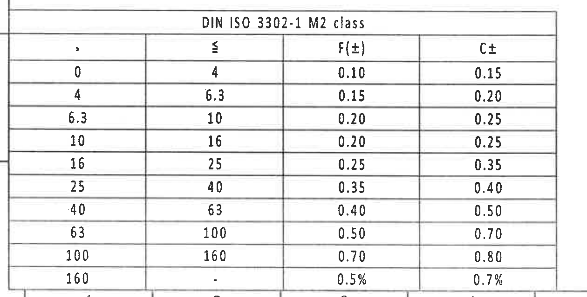

原图位置/视图名称：页 1 左下公差表，bbox `[350, 2695, 1610, 3335]`。

原表还原：

| > | ≤ | F(±) | C± |
|---:|---:|---:|---:|
| 0 | 4 | 0.10 | 0.15 |
| 4 | 6.3 | 0.15 | 0.20 |
| 6.3 | 10 | 0.20 | 0.25 |
| 10 | 16 | 0.20 | 0.25 |
| 16 | 25 | 0.25 | 0.35 |
| 25 | 40 | 0.35 | 0.40 |
| 40 | 63 | 0.40 | 0.50 |
| 63 | 100 | 0.50 | 0.70 |
| 100 | 160 | 0.70 | 0.80 |
| 160 | - | 0.5% | 0.7% |

提取表格：

| 提取项 | 原图数值或文本 | 含义说明 |
|---|---|---|
| 表名 | DIN ISO 3302-1 M2 class | 与 NOTES 第 3 条橡胶通用公差 ISO 3302.1 M2 关联。 |
| F(±)/C± | 见上表各尺寸范围 | 按尺寸范围给出 F 和 C 公差。 |

边界归属说明：裁切完整包含表名、表头和全部 10 行范围；底部有图框线，不属于表格数据。

## object_12：Reference 参考标准列表

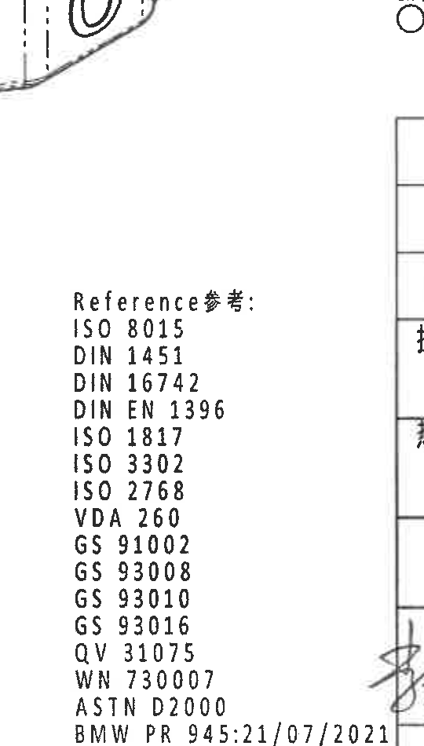

原图位置/视图名称：页 1 中下参考标准列表，bbox `[2260, 2320, 2800, 3270]`。

| 提取项 | 原图数值或文本 | 含义说明 |
|---|---|---|
| 标题 | Reference参考: | 参考标准列表标题。 |
| 标准 1 | ISO 8015 | 引用标准。 |
| 标准 2 | DIN 1451 | 引用标准。 |
| 标准 3 | DIN 16742 | 引用标准。 |
| 标准 4 | DIN EN 1396 | 引用标准。 |
| 标准 5 | ISO 1817 | 引用标准。 |
| 标准 6 | ISO 3302 | 引用标准。 |
| 标准 7 | ISO 2768 | 引用标准。 |
| 标准 8 | VDA 260 | 引用标准。 |
| 标准 9 | GS 91002 | 引用标准。 |
| 标准 10 | GS 93008 | 引用标准。 |
| 标准 11 | GS 93010 | 引用标准。 |
| 标准 12 | GS 93016 | 引用标准。 |
| 标准 13 | QV 31075 | 引用标准。 |
| 标准 14 | WN 730007 | 引用标准。 |
| 标准 15 | ASTM D2000 | 引用标准。 |
| 标准 16 | BMW PR 945:21/07/2021 | 引用标准/文件编号。 |

边界归属说明：裁切为保留底部 BMW PR 945:21/07/2021，右侧带入标题栏边线和局部签名残影；这些残影不属于参考列表，未提取为本对象内容。

## object_13：右下明细表与基本信息行

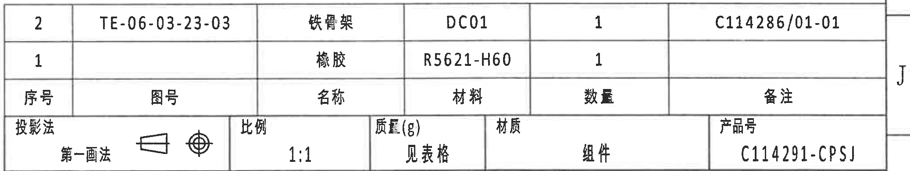

原图位置/视图名称：页 1 右下明细表与基本信息行，bbox `[2755, 2460, 4830, 2852]`。

原表还原：明细表

| 序号 | 图号 | 名称 | 材料 | 数量 | 备注 |
|---:|---|---|---|---:|---|
| 2 | TE-06-03-23-03 | 铁骨架 | DC01 | 1 | C114286/01-01 |
| 1 |  | 橡胶 | R5621-H60 | 1 |  |

原表还原：基本信息行

| 投影法 | 比例 | 质量(g) | 材质 | 产品号 |
|---|---|---|---|---|
| 第一画法（含投影符号） | 1:1 | 见表格 | 组件 | C114291-CPSJ |

提取表格：

| 提取项 | 原图数值或文本 | 含义说明 |
|---|---|---|
| 零件 2 | TE-06-03-23-03；铁骨架；DC01；数量 1；备注 C114286/01-01 | 与 object_5 的项目号 2 对应。 |
| 零件 1 | 橡胶；R5621-H60；数量 1 | 与 object_5 的项目号 1 对应。 |
| 比例 | 1:1 | 图样比例。 |
| 质量 | 见表格 | 质量见 object_2 Total weight 列。 |
| 产品号 | C114291-CPSJ | 标题/产品识别号。 |

边界归属说明：裁切完整包含明细表两行、表头和基本信息行；右边图框坐标字母 J 属于图框边界，不作为表格字段提取。

## object_14：标题栏、签名栏与图号栏

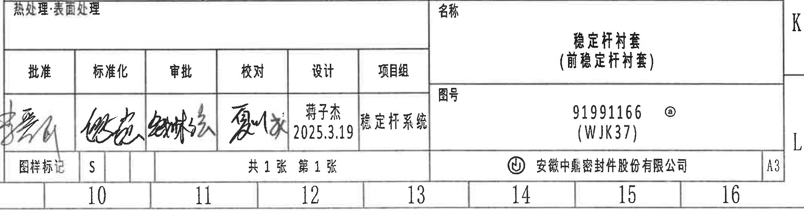

原图位置/视图名称：页 1 右下标题栏，bbox `[2755, 2850, 4830, 3395]`。

| 提取项 | 原图数值或文本 | 含义说明 |
|---|---|---|
| 热处理/表面处理 | 热处理·表面处理 | 字段标题可见，内容栏为空白。 |
| 名称 | 稳定杆衬套（前稳定杆衬套） | 零件名称。 |
| 图号 | 91991166 ⓐ (WJK37) | 图纸/零件图号及标记。 |
| 批准 | 手写签名，无法可靠转写 | 审签栏。 |
| 标准化 | 手写签名，无法可靠转写 | 审签栏。 |
| 审批 | 手写签名，无法可靠转写 | 审签栏。 |
| 校对 | 手写签名，无法可靠转写 | 审签栏。 |
| 设计 | 蒋子杰；2025.3.19 | 设计者和日期。 |
| 项目组 | 稳定杆系统 | 项目组字段。 |
| 图样标记 | S | 图样标记。 |
| 页数 | 共 1 张 第 1 张 | 页数信息。 |
| 公司 | 安徽中鼎密封件股份有限公司 | 出图单位。 |
| 图幅 | A3 | 图纸幅面。 |

边界归属说明：裁切包含标题栏完整字段、签名栏、公司栏和图幅 A3；底部图框坐标 10-16、右侧 K/L 坐标属于外框索引，不作为标题栏业务字段提取。

## 裁切检查记录

| 对象 | 检查结果 | 是否完整包含尺寸线和文字 | 边界处理 |
|---|---|---|---|
| object_1 修订履历表 | 表头和两行记录完整 | 是 | 少量下方表格边线未提取为内容。 |
| object_2 变型参数表 | 表头、A/B/C 三行和材料列完整 | 是 | 未混入下方视图。 |
| object_3 左上正面视图 | 49.5±0.3、55.5±0.3、ØEر0.3、(0.5) 均完整 | 是 | 无相邻视图尺寸混入。 |
| object_4 侧面视图 | 26.5±0.3 和变型字母说明完整 | 是 | 右下 `(B)` 为相邻 A-A 残留，已排除。 |
| object_5 A-A 剖视 | (35.41)、T2±0.3、T1±0.3、(B)、1/2 和 A-A 完整 | 是 | 左上侧面说明残字已排除。 |
| object_6 B-B 剖视 | (0.75)、(RIR)、(RAR)、B-B 完整 | 是 | 右上文字残影已排除。 |
| object_7 右上局部/标识视图 | 两条引出说明、A-A 标记完整 | 是 | 左侧 B-B 残留已排除。 |
| object_8 俯视/底视图 | 41±0.3、45.6±0.3、51.5±0.3、57.5±0.3 及标识说明完整 | 是 | 未混入轴测图或表格。 |
| object_9 轴测图 | 轴测主体和 C 标识完整 | 是 | 无尺寸文字。 |
| object_10 NOTES | 1-8 条完整，重裁后第 7 条英文尾部完整 | 是 | 底部边线不提取。 |
| object_11 公差表 | 表名、表头和 10 行完整 | 是 | 底部图框线不提取。 |
| object_12 Reference 列表 | 重裁后包含 ISO 8015 至 BMW PR 945:21/07/2021 全部项目 | 是 | 右侧标题栏残影已排除。 |
| object_13 明细表/基本信息 | 明细两行、表头、基本信息行完整 | 是 | 右侧 J 坐标不提取。 |
| object_14 标题栏 | 标题、图号、签名栏、公司、A3 完整 | 是 | 外框坐标 10-16、K/L 不作为业务字段。 |
