# 20C114294.pdf 内容识别与裁切提取

## 整页渲染

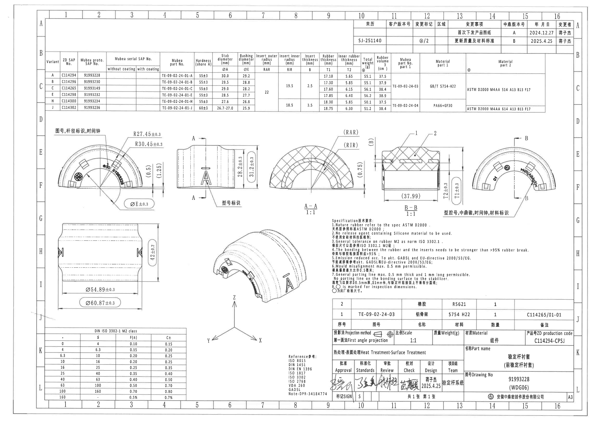

- 原 PDF：`input/20C114294.pdf`
- 整页 PNG：`outputs/20C114294_assets/images/page_1.png`
- 页面尺寸：4959 x 3505 px
- 说明：先按 PDF 渲染为整页 PNG，再按加工视图、剖面视图、表格、NOTES、标题栏分别裁切。bbox 格式为 `[x, y, width, height]`。

## object_1 - 左上端面主视图：图号、杆径标识、时间钟

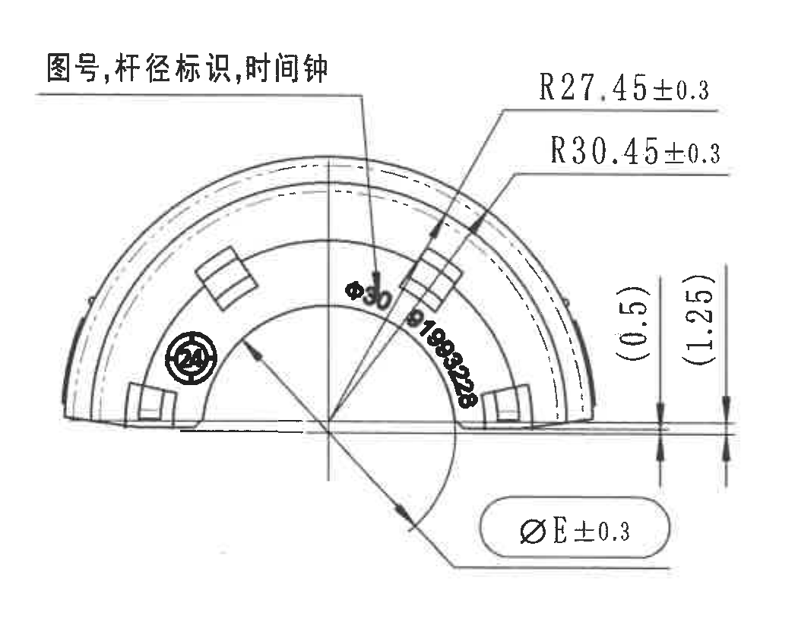

- 原图位置/视图名称：page 1，中左 E-F 区，左上端面主视图
- bbox：`[400, 1000, 1050, 815]`

| 提取项 | 原图数值或文本 | 含义说明 |
|---|---|---|
| 视图说明 | 图号,杆径标识,时间钟 | 引出线指向端面上的图号、杆径标识和时间钟位置。 |
| 半径尺寸 | R27.45±0.3 | 本端面一条圆弧半径，公差 ±0.3。 |
| 半径尺寸 | R30.45±0.3 | 本端面另一条圆弧半径，公差 ±0.3。 |
| 弧面标识 | Ø30 | 端面弧形标识，扫描可见。 |
| 弧面标识 | B198828 | 端面弧形标识，扫描字形局部模糊；按可见字符记录。 |
| 参考尺寸 | (0.5) | 括号内参考尺寸，位于右侧端部层厚/台阶附近，用于参考结构关系。 |
| 参考尺寸 | (1.25) | 括号内参考尺寸，位于右侧端部层厚/台阶附近，用于参考结构关系。 |
| 直径/参数尺寸 | ØE±0.3 | 与参数表中 Bushing diameter ØE 对应，带 ±0.3 公差；图中以圆角框/检验标识显示。 |
| 检验标识 | 圆圈标识 | 与 NOTES 第 8 条相呼应，表示检验尺寸/检验标识位置。 |

边界归属说明：裁切包含本端面轮廓、完整半径引出线、参考尺寸和 ØE 尺寸线；右侧相邻侧视图主体已排除，未将相邻侧视图尺寸归入本对象。

## object_2 - 中上侧视图：A-A 剖切位置与型号标识

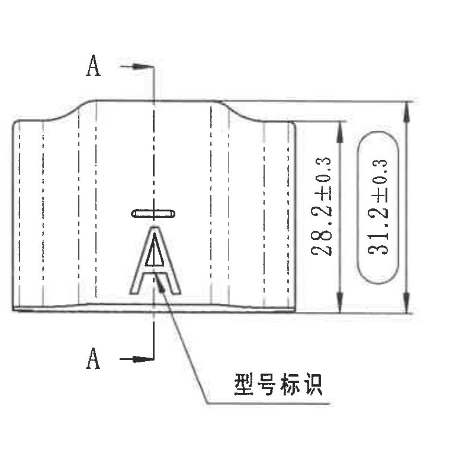

- 原图位置/视图名称：page 1，中部 E-F 区，A-A 剖切前的侧视图
- bbox：`[1450, 1040, 770, 760]`

| 提取项 | 原图数值或文本 | 含义说明 |
|---|---|---|
| 剖切标识 | A / A | 上下两个 A 与剖切线对应，指向 A-A 剖面。 |
| 高度尺寸 | 28.2±0.3 | 侧视图内侧高度/局部高度尺寸，公差 ±0.3。 |
| 总高度尺寸 | 31.2±0.3 | 侧视图外侧总高度尺寸，公差 ±0.3。 |
| 标识说明 | 型号标识 | 引出线指向大写 A 型号标识。 |

边界归属说明：右侧高度尺寸线完整包含；未将右侧 A-A 剖面的剖面线、RAR/RIR 标注并入本侧视图。

## object_3 - 剖面 A-A 1:1

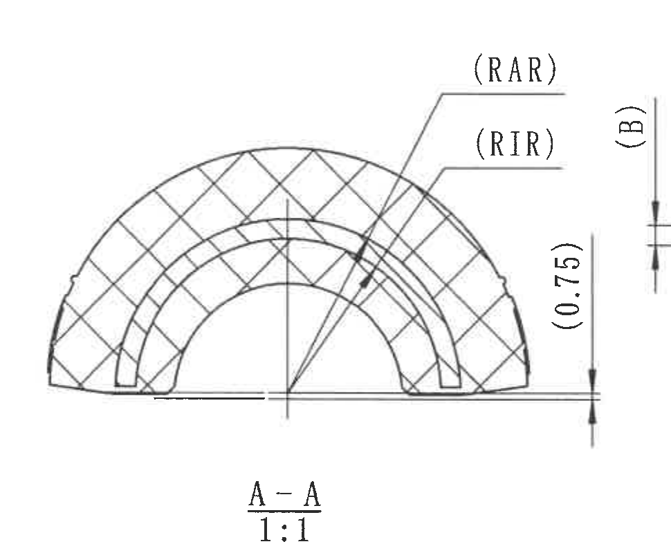

- 原图位置/视图名称：page 1，中部 E-F 区，剖面 A-A
- bbox：`[2170, 1000, 970, 800]`

| 提取项 | 原图数值或文本 | 含义说明 |
|---|---|---|
| 剖面名称 | A-A | 由 object_2 中 A-A 剖切位置得到的剖面。 |
| 比例 | 1:1 | 剖面绘图比例。 |
| 参数参考 | (RAR) | 括号内参数代号，指向 insert outer radius；具体数值见变体参数表 RAR 列。 |
| 参数参考 | (RIR) | 括号内参数代号，指向 insert inner radius；具体数值见变体参数表 RIR 列。 |
| 参数参考 | (B) | 括号内参数代号，对应 insert thickness B；具体数值见变体参数表 B 列。 |
| 参考尺寸 | (0.75) | 括号内参考尺寸，位于底部基准线附近，说明局部高度/间隙参考。 |

边界归属说明：裁切完整包含 A-A 剖面、(RAR)、(RIR)、(B)、(0.75) 和剖面名称/比例。右侧 B-B 剖面的尺寸线未提取为本对象内容。

## object_4 - 剖面 B-B 1:1

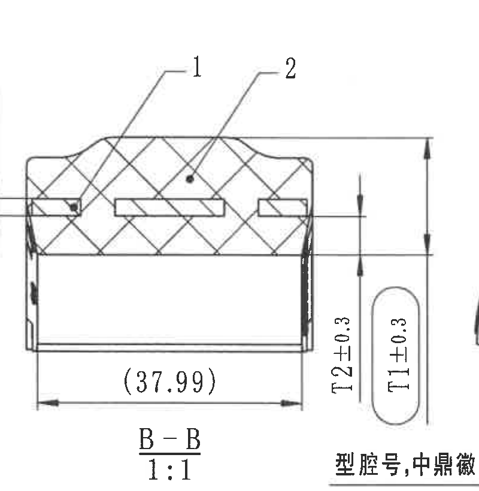

- 原图位置/视图名称：page 1，中右 E-F 区，剖面 B-B
- bbox：`[3130, 995, 800, 820]`

| 提取项 | 原图数值或文本 | 含义说明 |
|---|---|---|
| 物料序号 | 1 | 引出线指向左侧嵌件/组成位置，与 BOM 序号关联。 |
| 物料序号 | 2 | 引出线指向橡胶主体/组成位置，与 BOM 序号关联。 |
| 参考尺寸 | (37.99) | 括号内参考宽度尺寸，位于底部水平尺寸线。 |
| 厚度尺寸 | T2±0.3 | 内橡胶厚度参数 T2，公差 ±0.3；具体变体数值见参数表 T2 列。 |
| 厚度尺寸 | T1±0.3 | 橡胶厚度参数 T1，公差 ±0.3；具体变体数值见参数表 T1 列。 |
| 剖面名称 | B-B | 由右端视图 B-B 剖切位置得到的剖面。 |
| 比例 | 1:1 | 剖面绘图比例。 |

边界归属说明：裁切为保证 `B-B 1:1` 与右侧 T 尺寸完整，右下角露出少量相邻右端视图说明文字；该文字不作为 B-B 内容提取。`T2±0.3`、`T1±0.3` 归属 B-B 剖面，不归属右端视图。

## object_5 - 右上端面视图：型腔号、中鼎徽、时间钟、材料标识

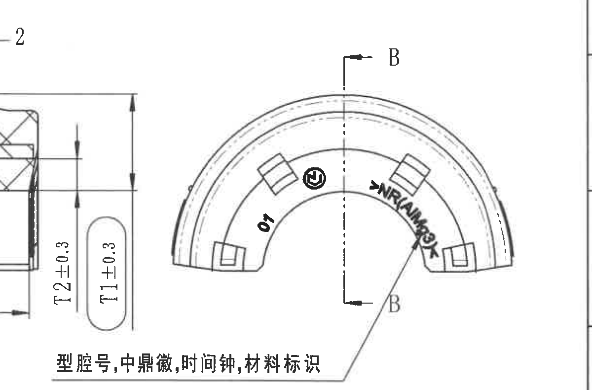

- 原图位置/视图名称：page 1，右侧 E-F 区，右端面视图
- bbox：`[3575, 1035, 1200, 790]`

| 提取项 | 原图数值或文本 | 含义说明 |
|---|---|---|
| 剖切标识 | B / B | 端面视图上的 B-B 剖切位置，指向 object_4。 |
| 型腔号 | 01 | 端面内可见型腔号。 |
| 标识 | 中鼎徽 | 端面中部圆形徽标位置。 |
| 标识 | 时间钟 | 端面上时间钟位置。 |
| 材料标识 | >NR(... )< | 材料标识位于右侧弧面，扫描局部模糊；按可见形态记录。 |
| 引出说明 | 型腔号,中鼎徽,时间钟,材料标识 | 引出线说明本端面内各标识的含义。 |

边界归属说明：由于引出说明横向跨近左侧 B-B 剖面，矩形裁切左侧可见 B-B 的 `T2±0.3/T1±0.3` 和剖面片段；这些尺寸属于 object_4，不归入本右端视图。

## object_6 - 左下展开/侧向尺寸视图

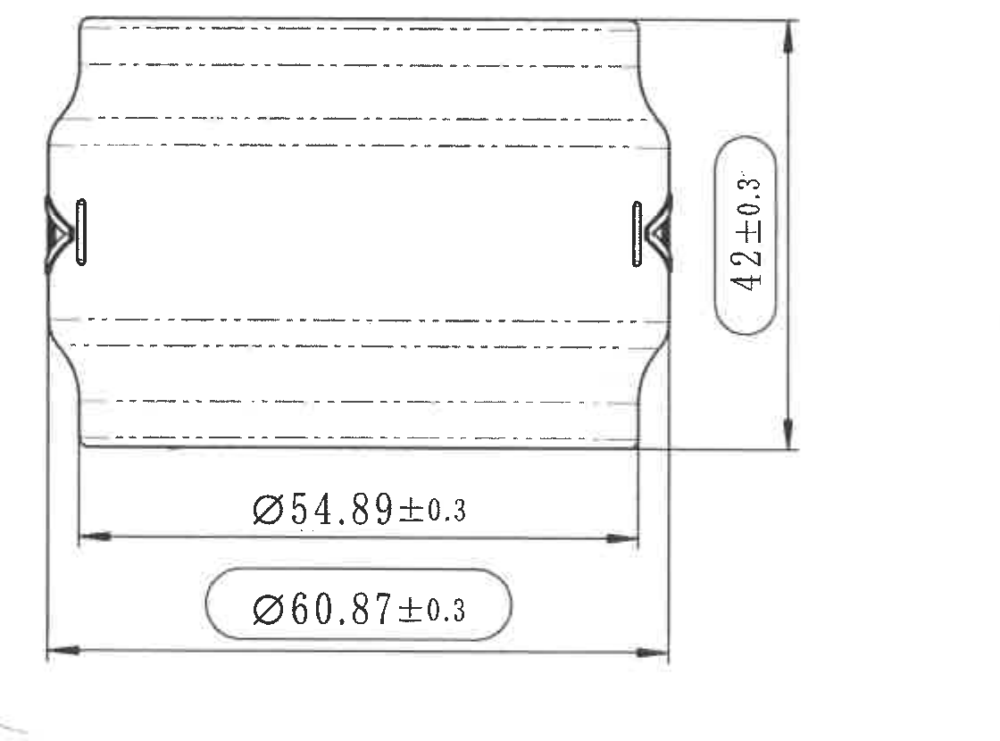

- 原图位置/视图名称：page 1，左下 H-I 区，展开/侧向尺寸视图
- bbox：`[430, 1840, 1120, 830]`

| 提取项 | 原图数值或文本 | 含义说明 |
|---|---|---|
| 总高度/宽度尺寸 | 42±0.3 | 右侧竖向总尺寸，公差 ±0.3。 |
| 直径尺寸 | Ø54.89±0.3 | 下方内侧直径尺寸，公差 ±0.3。 |
| 直径尺寸 | Ø60.87±0.3 | 下方外侧直径尺寸，公差 ±0.3；图中以圆角框/检验标识显示。 |

边界归属说明：裁切完整包含三条尺寸线和箭头；下方公差表未混入该视图。

## object_7 - 等轴测视图与 X/Y/Z 方向

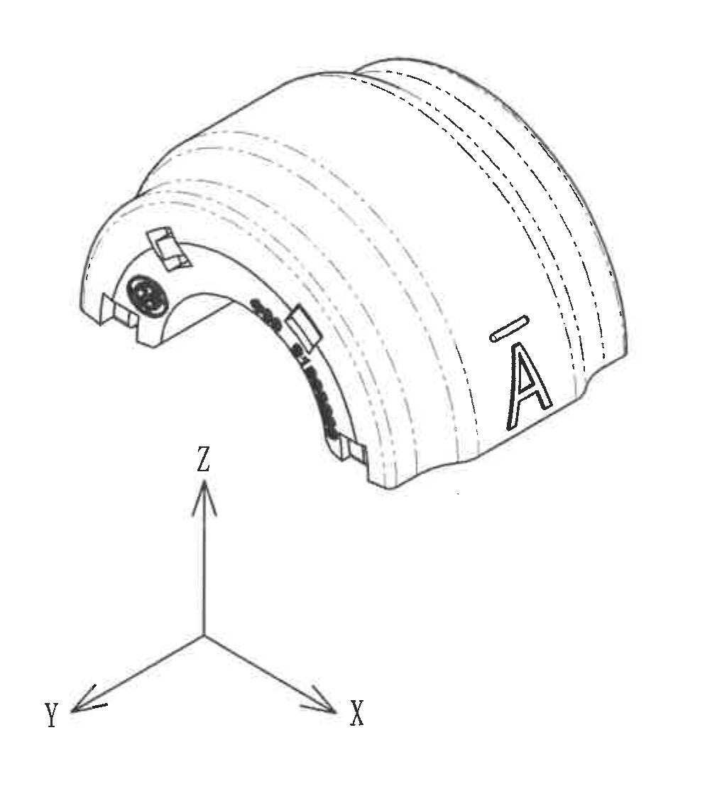

- 原图位置/视图名称：page 1，下中部 H-J 区，等轴测视图
- bbox：`[1660, 1830, 1010, 1110]`

| 提取项 | 原图数值或文本 | 含义说明 |
|---|---|---|
| 标识 | A | 零件外表面型号标识位置。 |
| 标识 | 中鼎徽、弧形材料/时间标识 | 等轴测视图中可见端面标识，局部扫描较糊。 |
| 坐标方向 | X / Y / Z | 图中方向指示轴。 |

边界归属说明：该视图无独立尺寸数值；裁切下扩后完整包含 X/Y/Z 坐标轴，未混入 NOTES 或标题栏。

## object_8 - 变体参数表 / Variant dimension and material table

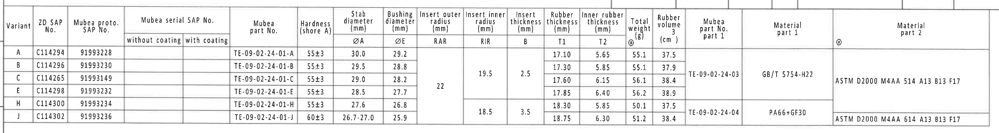

- 原图位置/视图名称：page 1，上方 B-C 区，变体参数表
- bbox：`[360, 405, 4210, 560]`

| Variant | ZD SAP No. | Mubea proto. SAP No. | Mubea serial SAP No. without coating | Mubea serial SAP No. with coating | Mubea part No. | Hardness (shore A) | Stab diameter ØA (mm) | Bushing diameter ØE (mm) | Insert outer radius RAR (mm) | Insert inner radius RIR (mm) | Insert thickness B (mm) | Rubber thickness T1 (mm) | Inner rubber thickness T2 (mm) | Total weight (g) | Rubber volume (cm3) | Mubea part No. part 1 | Material part 1 | Material part 2 |
|---|---|---|---|---|---|---|---|---|---|---|---|---|---|---|---|---|---|---|
| A | C114294 | 91993228 |  |  | TE-09-02-24-01-A | 55±3 | 30.0 | 29.2 |  |  |  | 17.10 | 5.65 | 55.1 | 37.5 |  |  |  |
| B | C114296 | 91993230 |  |  | TE-09-02-24-01-B | 55±3 | 29.5 | 28.8 |  | 19.5 | 2.5 | 17.30 | 5.85 | 55.1 | 37.9 | TE-09-02-24-03 | GB/T 5754-H22 | ASTM D2000 M4AA 514 A13 B13 F17 |
| C | C114265 | 91993149 |  |  | TE-09-02-24-01-C | 55±3 | 29.0 | 28.2 | 22 | 19.5 | 2.5 | 17.60 | 6.15 | 56.1 | 38.4 | TE-09-02-24-03 | GB/T 5754-H22 | ASTM D2000 M4AA 514 A13 B13 F17 |
| E | C114298 | 91993232 |  |  | TE-09-02-24-01-E | 55±3 | 28.5 | 27.7 | 22 |  |  | 17.85 | 6.40 | 56.2 | 38.9 | TE-09-02-24-03 | GB/T 5754-H22 | ASTM D2000 M4AA 514 A13 B13 F17 |
| H | C114300 | 91993234 |  |  | TE-09-02-24-01-H | 55±3 | 27.6 | 26.8 |  | 18.5 | 3.5 | 18.30 | 5.85 | 50.1 | 37.5 | TE-09-02-24-04 | PA66+GF30 | ASTM D2000 M4AA 614 A13 B13 F17 |
| J | C114302 | 91993236 |  |  | TE-09-02-24-01-J | 60±3 | 26.7-27.0 | 25.9 |  | 18.5 | 3.5 | 18.75 | 6.30 | 51.2 | 38.4 | TE-09-02-24-04 | PA66+GF30 | ASTM D2000 M4AA 614 A13 B13 F17 |

| 提取项 | 原图数值或文本 | 含义说明 |
|---|---|---|
| ØA | Stab diameter (mm) | 稳定杆直径，对应视图中的杆径/稳定杆配合尺寸。 |
| ØE | Bushing diameter (mm) | 衬套直径，对应 object_1 中 `ØE±0.3`。 |
| RAR | Insert outer radius (mm) | 嵌件外半径，对应 A-A 剖面 `(RAR)`。 |
| RIR | Insert inner radius (mm) | 嵌件内半径，对应 A-A 剖面 `(RIR)`。 |
| B | Insert thickness (mm) | 嵌件厚度，对应 A-A 剖面 `(B)`。 |
| T1 | Rubber thickness (mm) | 橡胶厚度，对应 B-B 剖面 `T1±0.3`。 |
| T2 | Inner rubber thickness (mm) | 内橡胶厚度，对应 B-B 剖面 `T2±0.3`。 |

边界归属说明：该裁切完整包含参数表主体和表头；顶部少量图框线不是表格字段。材料、半径、厚度存在合并单元格，表格中按可见跨行范围展开填写。

## object_9 - 修订履历表

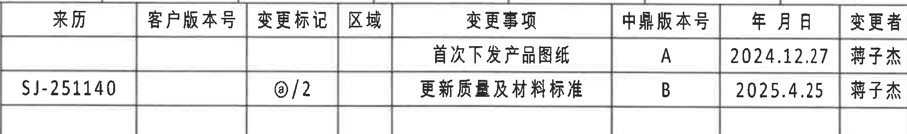

- 原图位置/视图名称：page 1，右上 A-B 区，修订履历表
- bbox：`[2935, 160, 1820, 270]`

| 来历 | 客户版本号 | 变更标记 | 区域 | 变更事项 | 中鼎版本号 | 年月日 | 变更者 |
|---|---|---|---|---|---|---|---|
|  |  |  |  | 首次下发产品图纸 | A | 2024.12.27 | 蒋子杰 |
| SJ-251140 |  | @/2 |  | 更新质量及材料标准 | B | 2025.4.25 | 蒋子杰 |

| 提取项 | 原图数值或文本 | 含义说明 |
|---|---|---|
| 中鼎版本号 | A / B | 图纸版本记录。 |
| 日期 | 2024.12.27 / 2025.4.25 | 对应版本变更日期。 |
| 变更者 | 蒋子杰 | 两条记录均为蒋子杰。 |

边界归属说明：正式裁切包含修订履历表列和行；右侧图框坐标 A/B 未作为表格字段提取，底部参数表内容未归入本对象。

## object_10 - Specification 技术要求 / NOTES

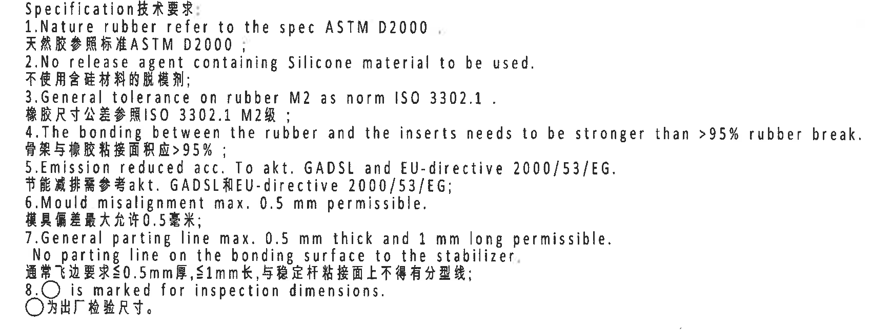

- 原图位置/视图名称：page 1，右中下 G-I 区，技术要求
- bbox：`[2710, 1820, 1740, 645]`

| 提取项 | 原图数值或文本 | 含义说明 |
|---|---|---|
| 1 | Nature rubber refer to the spec ASTM D2000. / 天然胶参照标准 ASTM D2000； | 天然橡胶材料参照 ASTM D2000。 |
| 2 | No release agent containing Silicone material to be used. / 不使用含硅材料的脱模剂； | 禁止使用含硅脱模剂。 |
| 3 | General tolerance on rubber M2 as norm ISO 3302.1. / 橡胶尺寸公差参照 ISO 3302.1 M2级； | 橡胶一般公差引用 DIN/ISO 3302-1 M2 公差表。 |
| 4 | The bonding between the rubber and the inserts needs to be stronger than >95% rubber break. / 骨架与橡胶粘接面积应 >95%； | 橡胶与嵌件粘接强度要求。 |
| 5 | Emission reduced acc. To akt. GADSL and EU-directive 2000/53/EG. / 节能减排需参考 akt. GADSL 和 EU-directive 2000/53/EG； | 环保法规/清单要求。 |
| 6 | Mould misalignment max. 0.5 mm permissible. / 模具偏差最大允许 0.5 毫米； | 模具错位最大允许值。 |
| 7 | General parting line max. 0.5 mm thick and 1 mm long permissible. No parting line on the bonding surface to the stabilizer. / 通常飞边要求 ≤0.5mm 厚, ≤1mm 长, 与稳定杆粘接面上不得有分型线； | 分型线/飞边限制及粘接面限制。 |
| 8 | ○ is marked for inspection dimensions. / ○为出厂检验尺寸。 | 圆圈标记表示出厂检验尺寸。 |

边界归属说明：裁切完整包含 1-8 条技术要求；顶部未提取相邻视图标注，底部未混入 BOM 或标题栏。

## object_11 - DIN ISO 3302-1 M2 class 公差表

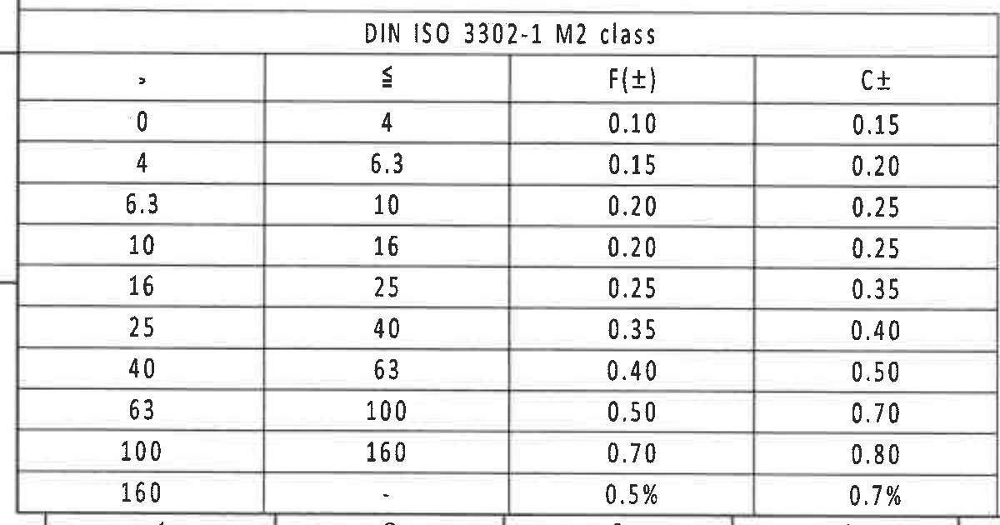

- 原图位置/视图名称：page 1，左下 J-K 区，公差表
- bbox：`[350, 2715, 1200, 630]`

| > | ≤ | F(±) | C± |
|---|---|---|---|
| 0 | 4 | 0.10 | 0.15 |
| 4 | 6.3 | 0.15 | 0.20 |
| 6.3 | 10 | 0.20 | 0.25 |
| 10 | 16 | 0.20 | 0.25 |
| 16 | 25 | 0.25 | 0.35 |
| 25 | 40 | 0.35 | 0.40 |
| 40 | 63 | 0.40 | 0.50 |
| 63 | 100 | 0.50 | 0.70 |
| 100 | 160 | 0.70 | 0.80 |
| 160 | - | 0.5% | 0.7% |

| 提取项 | 原图数值或文本 | 含义说明 |
|---|---|---|
| 表题 | DIN ISO 3302-1 M2 class | 橡胶尺寸一般公差等级表。 |
| F(±) / C± | 见表格各行 | 对不同尺寸范围给出的公差。 |

边界归属说明：裁切完整包含表头、全部 10 行和底线；底部极少外图框线不作为表格字段。

## object_12 - BOM / 明细表

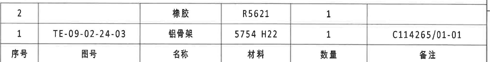

- 原图位置/视图名称：page 1，右下 I-J 区，BOM 明细表
- bbox：`[2760, 2475, 2020, 260]`

| 序号 | 图号 | 名称 | 材料 | 数量 | 备注 |
|---|---|---|---|---|---|
| 2 |  | 橡胶 | R5621 | 1 |  |
| 1 | TE-09-02-24-03 | 铝骨架 | 5754 H22 | 1 | C114265/01-01 |

| 提取项 | 原图数值或文本 | 含义说明 |
|---|---|---|
| 序号 1 | TE-09-02-24-03 / 铝骨架 / 5754 H22 / 1 / C114265/01-01 | 铝骨架明细，与剖面引出序号 1 对应。 |
| 序号 2 | 橡胶 / R5621 / 1 | 橡胶明细，与剖面引出序号 2 对应。 |

边界归属说明：裁切仅包含 BOM 表格，底部标题栏字段已排除。

## object_13 - 标题栏 / Title block

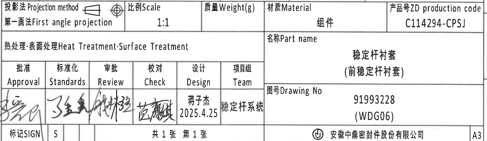

- 原图位置/视图名称：page 1，右下 J-L 区，标题栏
- bbox：`[2755, 2740, 2025, 590]`

| 提取项 | 原图数值或文本 | 含义说明 |
|---|---|---|
| 投影法 | 第一画法 First angle projection | 图纸投影方法。 |
| 比例 | 1:1 | 图纸比例。 |
| 质量 | Weight(g) 空白 | 标题栏中未填质量。 |
| 材质 | 组件 | 标题栏材质/装配属性。 |
| 产品号 | C114294-CPSJ | ZD production code。 |
| 热处理/表面处理 | 空白 | Heat Treatment / Surface Treatment 未填具体内容。 |
| 名称 | 稳定杆衬套（前稳定杆衬套） | Part name。 |
| 图号 | 91993228 (WDG06) | Drawing No。 |
| 批准 | 签名 | Approval 栏手写签名。 |
| 标准化 | 签名 | Standards 栏手写签名。 |
| 审批 | 签名 | Review 栏手写签名。 |
| 校对 | 签名 | Check 栏手写签名。 |
| 设计 | 蒋子杰 2025.4.25 | Design 栏姓名与日期。 |
| 项目组 | 稳定杆系统 | Team。 |
| 标记 | SIGN / S | 标记栏。 |
| 张数 | 共1张 第1张 | 图纸页数。 |
| 公司 | 安徽中鼎密封件股份有限公司 | 出图公司。 |
| 图幅 | A3 | 图纸幅面。 |

边界归属说明：裁切包含完整标题栏主体；底部外图框坐标数字已排除。左侧签名区紧贴边缘但签名和字段完整可见。

## object_14 - 参考标准列表

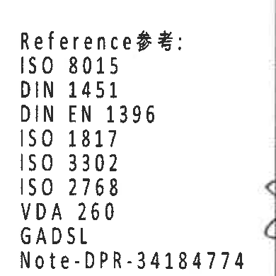

- 原图位置/视图名称：page 1，下中右 K-L 区，参考标准
- bbox：`[2370, 2910, 390, 390]`

| 提取项 | 原图数值或文本 | 含义说明 |
|---|---|---|
| Reference参考 | ISO 8015 | 参考标准。 |
| Reference参考 | DIN 1451 | 参考标准。 |
| Reference参考 | DIN EN 1396 | 参考标准。 |
| Reference参考 | ISO 1817 | 参考标准。 |
| Reference参考 | ISO 3302 | 参考标准，与公差表相关。 |
| Reference参考 | ISO 2768 | 参考标准。 |
| Reference参考 | VDA 260 | 参考标准。 |
| Reference参考 | GADSL | 参考清单/法规，与 NOTES 第 5 条相关。 |
| Reference参考 | Note-DPR-34184774 | 内部/备注参考号。 |

边界归属说明：裁切收窄后仅包含参考标准文字，未将右侧标题栏审批栏并入该对象。

## 裁切检查记录

| 对象 | 检查结果 | 是否完整包含尺寸线和文字 | 边界/归属复核 |
|---|---|---|---|
| page_1 | 整页 PNG 渲染成功，4959 x 3505 px。 | 是 | 整页作为所有裁切来源。 |
| object_1 | R27.45±0.3、R30.45±0.3、(0.5)、(1.25)、ØE±0.3 和标识完整。 | 是 | 右侧侧视图主体已排除。 |
| object_2 | A-A 剖切标识、型号标识、28.2±0.3、31.2±0.3 完整。 | 是 | 未混入 A-A 剖面。 |
| object_3 | A-A、1:1、(RAR)、(RIR)、(B)、(0.75) 完整。 | 是 | 右侧 B-B 尺寸未提取为本对象内容。 |
| object_4 | B-B、1:1、(37.99)、T2±0.3、T1±0.3、序号 1/2 完整。 | 是 | 右下少量相邻说明文字露出，已明确不归属 B-B。 |
| object_5 | B-B 剖切线、01、中鼎徽、时间钟/材料标识引出说明完整。 | 是 | 左侧可见 B-B 尺寸片段，仅作为邻近非归属内容，不提取。 |
| object_6 | 42±0.3、Ø54.89±0.3、Ø60.87±0.3 尺寸线和箭头完整。 | 是 | 未混入公差表。 |
| object_7 | 等轴测视图和 X/Y/Z 坐标轴完整。 | 是 | 无独立尺寸；未混入 NOTES。 |
| object_8 | 参数表主体、表头和全部变体行完整。 | 是 | 顶部少量图框线不是表格字段。 |
| object_9 | 修订履历表表头和两条修订记录完整。 | 是 | 右侧图框坐标和下方参数表未作为表格字段提取。 |
| object_10 | Specification 技术要求 1-8 条完整。 | 是 | 未混入相邻视图和标题栏。 |
| object_11 | 公差表表头和全部 10 行完整。 | 是 | 底部少量外图框线不是表格字段。 |
| object_12 | BOM 表头和两条明细完整。 | 是 | 下方标题栏字段已排除。 |
| object_13 | 标题栏投影法、比例、产品号、名称、图号、签审、公司、A3 完整。 | 是 | 底部图框坐标数字已排除。 |
| object_14 | 参考标准清单完整。 | 是 | 未混入右侧审批栏。 |
