# 20C114295 PDF 内容识别

整页渲染图：`outputs/20C114295_assets/images/page_1.png`  
页面尺寸：4959 x 3505 px。以下裁切对象均来自第 1 页。

## object_1 - 顶部修订履历表

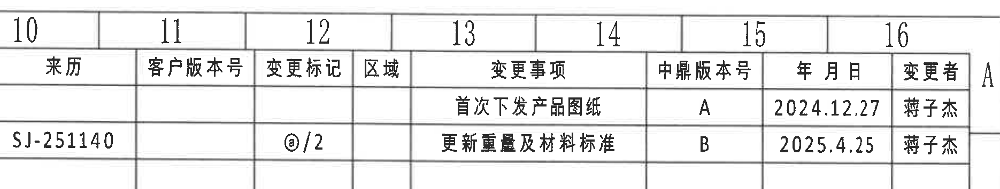

原图位置/视图名称：页面上方 10-16 栏，修订履历表。

| 来历 | 客户版本号 | 变更标记 | 区域 | 变更事项 | 中鼎版本号 | 年月日 | 变更者 |
|---|---|---|---|---|---|---|---|
|  |  |  |  | 首次下发产品图纸 | A | 2024.12.27 | 薄子杰 |
| SJ-251140 |  | @/2 |  | 更新重量及材料标准 | B | 2025.4.25 | 薄子杰 |

| 提取项 | 原图数值或文本 | 含义说明 |
|---|---|---|
| 修订 A | 首次下发产品图纸 / A / 2024.12.27 / 薄子杰 | 首次发布记录。 |
| 修订 B | SJ-251140 / @/2 / 更新重量及材料标准 / B / 2025.4.25 / 薄子杰 | 第二次修订记录；变更标记为 @/2。 |

边界归属说明：裁切包含完整表头和两行修订记录；上边缘带入图纸坐标数字 10-16，属于图框坐标，不作为修订履历字段。

## object_2 - 顶部产品参数/材料表

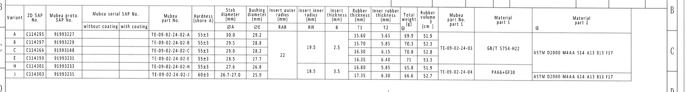

原图位置/视图名称：页面上方 B-C 区，Variant/尺寸/材料总表。

| Variant | ZD SAP No. | Mubea proto. SAP No. | Mubea serial SAP No. without coating | Mubea serial SAP No. with coating | Mubea part No. | Hardness (shore A) | Stab diameter ØA (mm) | Bushing diameter ØE (mm) | Insert outer radius RAR (mm) | Insert inner radius RIR (mm) | Insert thickness B (mm) | Rubber thickness T1 (mm) | Inner rubber thickness T2 (mm) | Total weight @ (g) | Rubber volume (cm³) | Mubea part No. part 1 | Material part 1 | Material part 2 |
|---|---|---|---|---|---|---|---|---|---|---|---|---|---|---|---|---|---|---|
| A | C114295 | 91993227 |  |  | TE-09-02-24-02-A | 55±3 | 30.0 | 29.2 |  |  |  | 15.60 | 5.65 | 69.9 | 51.9 |  |  |  |
| B | C114297 | 91993229 |  |  | TE-09-02-24-02-B | 55±3 | 29.5 | 28.8 |  | 19.5 | 2.5 | 15.70 | 5.85 | 70.3 | 52.3 | rowspan B/C/E: TE-09-02-24-03 | rowspan B/C/E: GB/T 5754-H22 | rowspan B/C/E: ASTM D2000 M4AA 514 A13 B13 F17 |
| C | C114266 | 91993148 |  |  | TE-09-02-24-02-C | 55±3 | 29.0 | 28.2 | 22 |  |  | 16.30 | 6.15 | 70.8 | 52.8 | 同上 | 同上 | 同上 |
| E | C114299 | 91993231 |  |  | TE-09-02-24-02-E | 55±3 | 28.5 | 27.7 | 22 |  |  | 16.35 | 6.40 | 71 | 53.3 | 同上 | 同上 | 同上 |
| H | C114301 | 91993233 |  |  | TE-09-02-24-02-H | 55±3 | 27.6 | 26.8 |  | 18.5 | 3.5 | 16.80 | 5.85 | 65.8 | 51.9 | rowspan H/J: TE-09-02-24-04 | rowspan H/J: PA66+GF30 | rowspan H/J: ASTM D2000 M4AA 614 A13 B13 F17 |
| J | C114303 | 91993235 |  |  | TE-09-02-24-02-J | 60±3 | 26.7-27.0 | 25.9 |  | 18.5 | 3.5 | 17.35 | 6.30 | 66.6 | 52.7 | 同上 | 同上 | 同上 |

| 提取项 | 原图数值或文本 | 含义说明 |
|---|---|---|
| Variant | A, B, C, E, H, J | 变体/规格行。 |
| 直径尺寸 | ØA、ØE | 分别为 Stab diameter 与 Bushing diameter，单位 mm。 |
| 弧度/半径尺寸 | RAR=22 或空白；RIR=19.5/18.5 或空白 | RAR 为外插入件圆弧半径，RIR 为内插入件圆弧半径。 |
| 厚度尺寸 | B=2.5 或 3.5；T1/T2 逐行列出 | B 为嵌件厚度，T1 为橡胶厚度，T2 为内橡胶厚度。 |
| 公差 | Hardness 55±3 或 60±3；尺寸列按表给定 | 表中直接给出材料硬度公差和多项尺寸。 |
| 材料 | GB/T 5754-H22、PA66+GF30、ASTM D2000 M4AA 514/614 A13 B13 F17 | part 1 和 part 2 的材料标准/牌号。 |

边界归属说明：裁切包含完整参数表主体；左侧图框行字母和底部邻近线条不属于表格数据。合并单元格按原图跨行含义以 `rowspan` 文本还原。

## object_3 - 左端加工视图

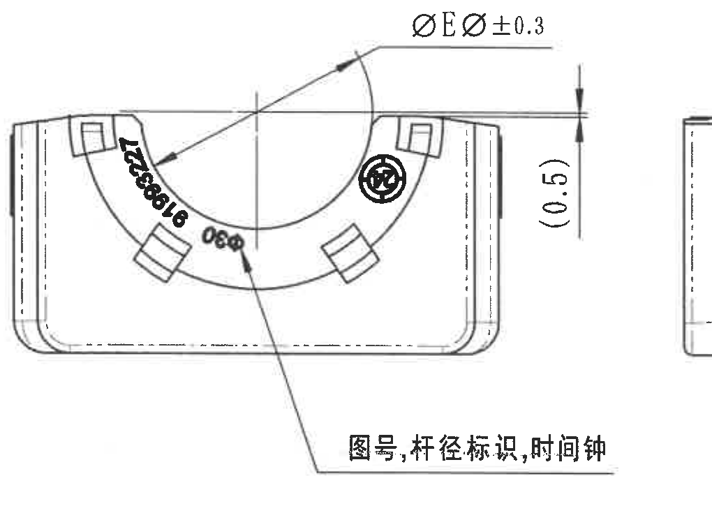

原图位置/视图名称：页面左上 E-F 区，端面加工视图。

| 提取项 | 原图数值或文本 | 含义说明 |
|---|---|---|
| 直径尺寸 | ØEØ ±0.3 | 上方引线指向弧形/孔径相关位置；原图文字显示为 ØEØ，带 ±0.3 公差。 |
| 参考尺寸 | (0.5) | 右侧竖向括号尺寸；括号表示参考尺寸，不作为直接控制尺寸，但用于说明该处边缘/高度位置关系。 |
| 标识说明 | 图号, 杆径标识, 时间钟 | 引线指向端面弧带与标记区，说明此视图中的图号、杆径标识和时间钟位置。 |
| 可见标识 | B100862?、Ø? 等弧面字符 | 扫描图弧面字符局部模糊，作为标记外观识别，不作为尺寸。 |

边界归属说明：裁切保留完整引线、尺寸箭头和中文说明；不提取邻近 A 视图或下方视图内容。

## object_4 - A 剖切线所在侧视图

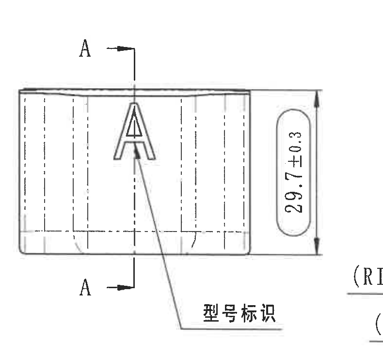

原图位置/视图名称：页面中上 E-F 区，带 A-A 剖切线的侧视图。

| 提取项 | 原图数值或文本 | 含义说明 |
|---|---|---|
| 剖切基准 | A / A | 上下两个 A 字母和箭头表示 A-A 剖切位置与观察方向。 |
| 尺寸 | 29.7±0.3 | 右侧竖向总高度/宽度尺寸，带 ±0.3 公差。 |
| 标识说明 | 型号标识 | 引线指向大写 A 标识位置，说明该面用于型号标识。 |

边界归属说明：裁切中的 A-A 剖切线属于本侧视图；右侧 A-A 剖面的 RIR/RAR 文字不归入本对象，已在 object_5 提取。

## object_5 - A-A 剖面视图

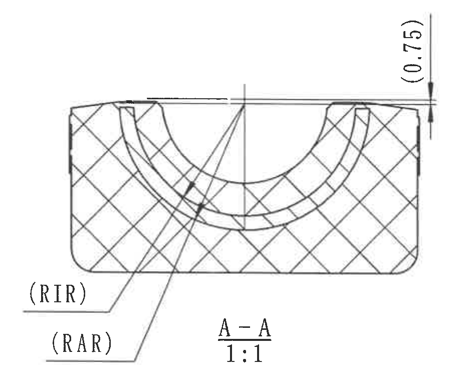

原图位置/视图名称：页面中上 E-F 区，剖面 A-A，比例 1:1。

| 提取项 | 原图数值或文本 | 含义说明 |
|---|---|---|
| 剖面名称 | A-A | 由 object_4 的 A 剖切线形成的剖面。 |
| 比例 | 1:1 | 剖面按 1:1 表示。 |
| 参考尺寸 | (0.75) | 右上竖向括号尺寸，表示参考厚度/高度关系，括号内为参考尺寸。 |
| 半径标识 | (RIR) | 引线指向内橡胶半径相关圆弧；括号表示标识/参考属性。 |
| 半径标识 | (RAR) | 引线指向外插入件半径相关圆弧；括号表示标识/参考属性。 |

边界归属说明：重裁后完整包含 RIR/RAR 引线、(0.75) 尺寸线和 A-A 1:1 标注；右侧 B-B 尺寸片段已排除。

## object_6 - B-B 剖面视图

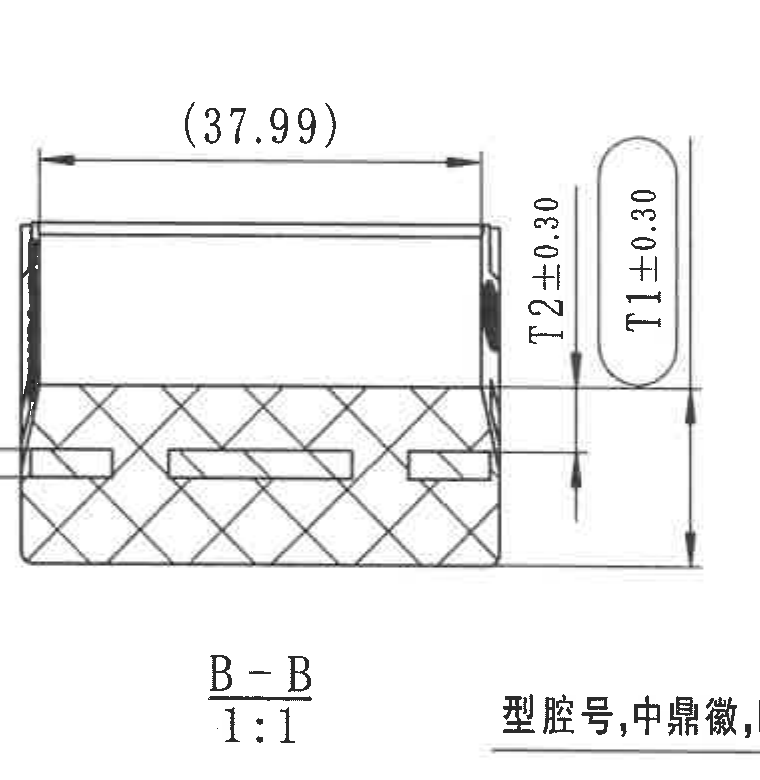

原图位置/视图名称：页面右上 E-F 区，剖面 B-B，比例 1:1。

| 提取项 | 原图数值或文本 | 含义说明 |
|---|---|---|
| 剖面名称 | B-B | 由右端视图 B 剖切线形成的剖面。 |
| 比例 | 1:1 | 剖面按 1:1 表示。 |
| 参考尺寸 | (37.99) | 上方水平括号尺寸，表示参考总长/跨距。 |
| 尺寸 | T2±0.30 | 右侧竖向厚度尺寸，T2 带 ±0.30 公差。 |
| 尺寸 | T1±0.30 | 右侧竖向厚度尺寸，T1 带 ±0.30 公差。 |
| 参考标识 | (B) | 左侧局部竖向标识，指向嵌件厚度 B 的对应位置。 |

边界归属说明：裁切为保留 `B-B 1:1` 完整，下方带入右端视图中文引线开头；该中文引线不归属 B-B，未作为 B-B 内容提取。

## object_7 - 右端加工视图/B 剖切线视图

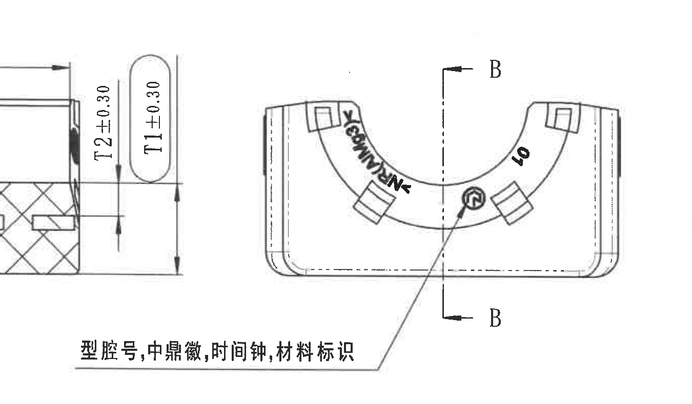

原图位置/视图名称：页面右上 E-F 区，端面加工视图，含 B-B 剖切线。

| 提取项 | 原图数值或文本 | 含义说明 |
|---|---|---|
| 剖切基准 | B / B | 竖向中心线和上下 B 箭头表示 B-B 剖切位置与方向。 |
| 标识说明 | 型腔号, 中鼎徽, 时间钟, 材料标识 | 引线指向端面中部标记区，说明型腔号、公司徽、时间钟和材料标识位置。 |
| 可见标识 | ZHONGDING、40、圆形徽标等 | 弧带和端面上的标识内容；其中 40 为可见标识文本，不作为尺寸提取。 |

边界归属说明：为保留完整中文引线说明，裁切左侧包含 B-B 剖面局部 T1/T2 尺寸片段；该片段归属 object_6，不在本视图表中提取。

## object_8 - 下方外形/平面加工视图

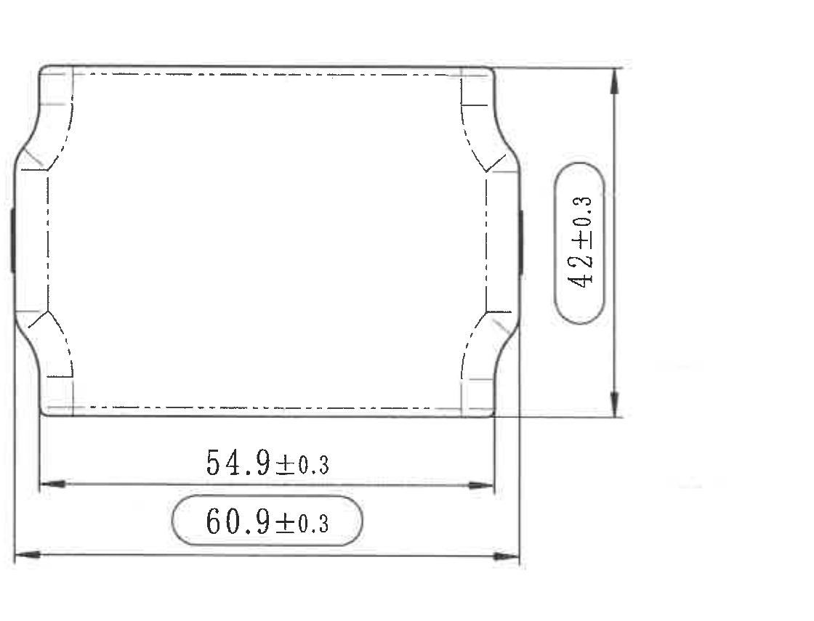

原图位置/视图名称：页面左下 G-I 区，外形/平面视图。

| 提取项 | 原图数值或文本 | 含义说明 |
|---|---|---|
| 总高度/宽度 | 42±0.3 | 右侧竖向外形尺寸，带 ±0.3 公差。 |
| 内部水平尺寸 | 54.9±0.3 | 下方较短水平尺寸，带 ±0.3 公差。 |
| 总水平尺寸 | 60.9±0.3 | 下方外侧水平总尺寸，带 ±0.3 公差。 |

边界归属说明：裁切完整包含三项尺寸的尺寸线、箭头和文字；未混入其它视图。

## object_9 - 等轴测视图

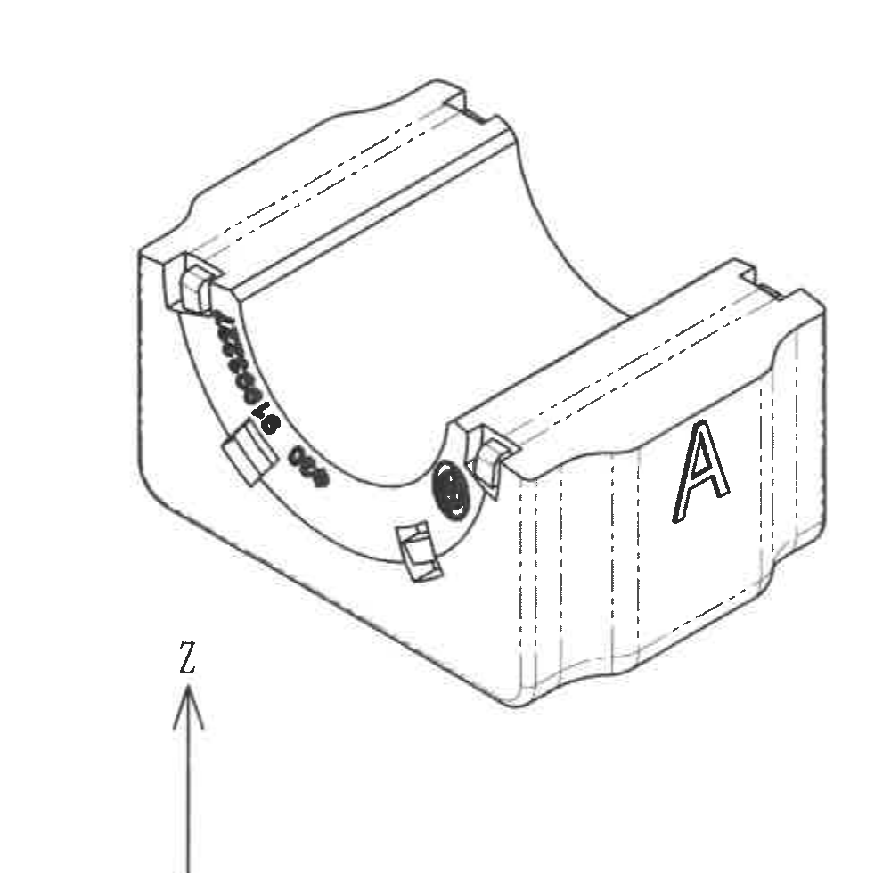

原图位置/视图名称：页面中下 G-I 区，等轴测视图和坐标方向局部。

| 提取项 | 原图数值或文本 | 含义说明 |
|---|---|---|
| 标识 | A | 右侧立面大写 A，为型号/变体标识位置示意。 |
| 标识 | Z | 下方坐标轴可见 Z 方向，说明三维视图方向。 |
| 可见标记 | 弧面标识、圆形徽标、矩形嵌件位置 | 用于展示端面标识和嵌件在三维零件上的位置。 |

边界归属说明：该对象仅提取等轴测视图信息；右侧 NOTES 和下方标题栏在独立对象中提取。

## object_10 - Specification 技术要求/NOTES

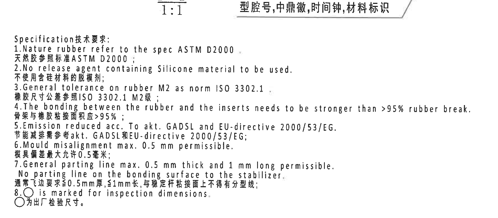

原图位置/视图名称：页面中右 G-I 区，Specification 技术要求。

| 提取项 | 原图数值或文本 | 含义说明 |
|---|---|---|
| 标题 | Specification 技术要求 | 技术要求标题。 |
| 1 | Nature rubber refer to the spec ASTM D2000. / 天然胶参照标准 ASTM D2000； | 天然橡胶标准要求。 |
| 2 | No release agent containing Silicone material to be used. / 不使用含硅材料的脱模剂； | 脱模剂限制。 |
| 3 | General tolerance on rubber M2 as norm ISO 3302.1 / 橡胶尺寸公差参照 ISO 3302.1 M2级； | 橡胶一般公差等级。 |
| 4 | The bonding between the rubber and the inserts needs to be stronger than >95% rubber break. / 骨架与橡胶粘接面积应 >95%； | 橡胶与嵌件粘接强度要求。 |
| 5 | Emission reduced acc. To akt. GADSL and EU-directive 2000/53/EG. / 节能减排需参考 akt. GADSL 和 EU-directive 2000/53/EG； | 排放/材料法规要求。 |
| 6 | Mould misalignment max. 0.5 mm permissible. / 模具偏差最大允许 0.5 毫米； | 模具错位允许值。 |
| 7 | General parting line max. 0.5 mm thick and 1 mm long permissible. No parting line on the bonding surface to the stabilizer. / 通常飞边要求 ≤0.5mm 厚, ≤1mm 长, 与稳定杆粘接面上不得有分型线； | 飞边和分型线要求。 |
| 8 | ○ is marked for inspection dimensions. / ○为出厂检验尺寸。 | 圆圈标记代表出厂检验尺寸。 |

边界归属说明：裁切完整包含 1-8 条 NOTES；上方邻近 B-B 标注和右端视图说明不作为 NOTES 内容。

## object_11 - DIN ISO 3302-1 M2 class 公差表

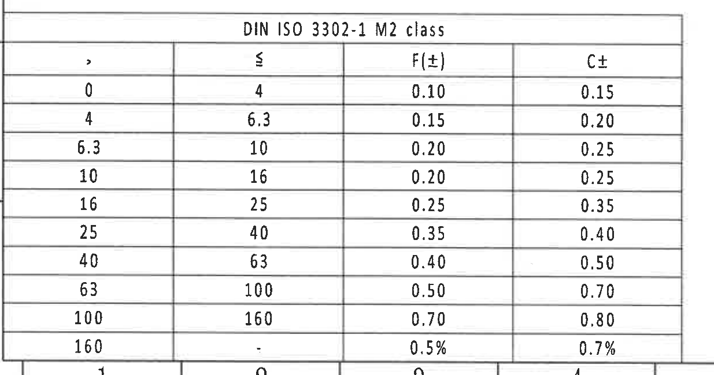

原图位置/视图名称：页面左下 J-L 区，DIN ISO 3302-1 M2 class 公差表。

| DIN ISO 3302-1 M2 class |  | F(±) | C± |
|---|---|---|---|
| > | ≤ |  |  |
| 0 | 4 | 0.10 | 0.15 |
| 4 | 6.3 | 0.15 | 0.20 |
| 6.3 | 10 | 0.20 | 0.25 |
| 10 | 16 | 0.20 | 0.25 |
| 16 | 25 | 0.25 | 0.35 |
| 25 | 40 | 0.35 | 0.40 |
| 40 | 63 | 0.40 | 0.50 |
| 63 | 100 | 0.50 | 0.70 |
| 100 | 160 | 0.70 | 0.80 |
| 160 | . | 0.5% | 0.7% |

| 提取项 | 原图数值或文本 | 含义说明 |
|---|---|---|
| 标准 | DIN ISO 3302-1 M2 class | 橡胶尺寸公差表，配合 NOTES 第 3 条使用。 |
| F(±) | 0.10 到 0.70；160 以上为 0.5% | F 类公差列。 |
| C± | 0.15 到 0.80；160 以上为 0.7% | C 类公差列。 |

边界归属说明：表格外框完整；底部因贴近图框带入坐标编号局部，不属于公差表内容。

## object_12 - Reference 参考标准列表

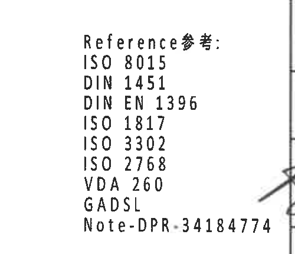

原图位置/视图名称：页面中下 K-L 区，Reference 参考标准。

| 提取项 | 原图数值或文本 | 含义说明 |
|---|---|---|
| 标题 | Reference 参考: | 参考文件/标准列表标题。 |
| 标准 | ISO 8015 | 参考标准。 |
| 标准 | DIN 1451 | 参考标准。 |
| 标准 | DIN EN 1396 | 参考标准。 |
| 标准 | ISO 1817 | 参考标准。 |
| 标准 | ISO 3302 | 参考标准。 |
| 标准 | ISO 2768 | 参考标准。 |
| 标准 | VDA 260 | 参考标准。 |
| 标准 | GADSL | 参考标准/清单。 |
| 注记 | Note-DPR-34184774 | 参考注记编号。 |

边界归属说明：重裁后仅包含参考标准文本；标题栏签审表格不归属本对象。

## object_13 - 标题栏/明细栏

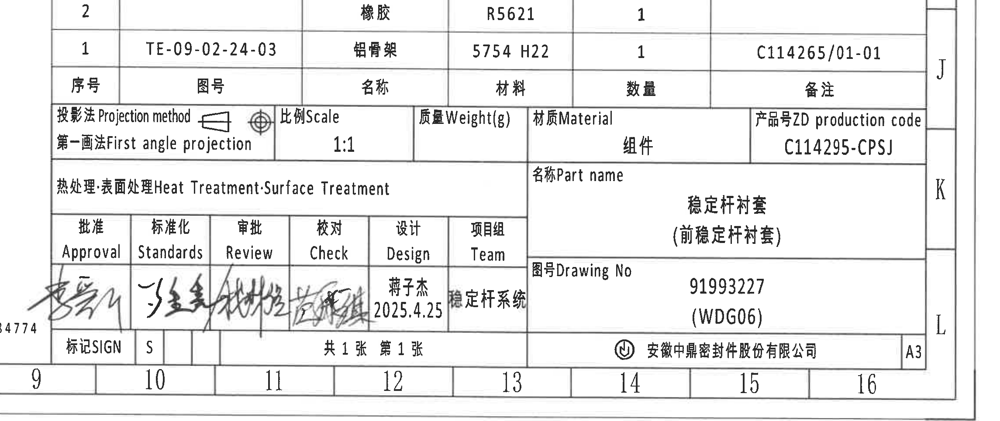

原图位置/视图名称：页面右下 J-L 区，标题栏、明细栏和签审区。

### 明细栏

| 序号 | 图号 | 名称 | 材料 | 数量 | 备注 |
|---|---|---|---|---|---|
| 2 |  | 橡胶 | R5621 | 1 |  |
| 1 | TE-09-02-24-03 | 铝骨架 | 5754 H22 | 1 | C114265/01-01 |

### 标题栏字段

| 提取项 | 原图数值或文本 | 含义说明 |
|---|---|---|
| 投影法 | 第一画法 First angle projection | 图纸采用第一角投影。 |
| 比例 | 1:1 | 图纸比例。 |
| 质量 | Weight(g) | 单元格标题，数值未填写。 |
| 材质 | Material / 组件 | 标题栏材料/组件字段。 |
| 产品号 | ZD production code C114295-CPSJ | 产品号/生产代码。 |
| 热处理/表面处理 | Heat Treatment; Surface Treatment | 字段标题，未见具体处理值。 |
| 名称 | 稳定杆衬套（前稳定杆衬套） | 零件名称/Part name。 |
| 图号 | 91993227 (WDG06) | Drawing No。 |
| 设计 | 薄子杰 2025.4.25 | 设计栏签署信息。 |
| 项目组 | 稳定杆系统 | 项目组。 |
| 标记 | SIGN / S | 标记栏。 |
| 页数 | 共 1 张 第 1 张 | 图纸页数。 |
| 公司 | 安徽中鼎密封件股份有限公司 | 出图单位。 |
| 图幅 | A3 | 图纸幅面。 |

边界归属说明：裁切包含完整标题栏和签审区；左下角有图框坐标/邻近编号残边，不作为标题栏字段。

## 裁切检查记录

| 对象 | 检查结果 |
|---|---|
| object_1 | 完整包含修订履历表头和两行记录；图框坐标数字带入但不提取。 |
| object_2 | 完整包含产品参数/材料表；左侧图框行字母和底部邻线不提取。 |
| object_3 | 完整包含端面视图尺寸线、箭头、引线和中文说明。 |
| object_4 | 完整包含 A-A 剖切线、29.7±0.3 尺寸和型号标识引线。 |
| object_5 | 重裁后完整包含 A-A 剖面、(0.75)、RIR/RAR 引线和比例标注。 |
| object_6 | 完整包含 B-B 剖面、(37.99)、T1/T2 尺寸和比例标注；下方相邻中文引线开头不提取。 |
| object_7 | 完整包含右端视图主体、B 剖切线和中文引线说明；左侧 B-B 尺寸片段只作边界说明，不提取。 |
| object_8 | 完整包含 42±0.3、54.9±0.3、60.9±0.3 的尺寸线和文字。 |
| object_9 | 完整包含等轴零件主体和 Z 坐标轴局部；右侧 NOTES 已排除并独立裁切。 |
| object_10 | 重裁后完整包含 Specification/NOTES 1-8 条。 |
| object_11 | 重裁后完整包含 DIN ISO 3302-1 M2 class 表格和各行公差；底部图框编号不提取。 |
| object_12 | 重裁后仅包含 Reference 参考标准列表。 |
| object_13 | 重裁后完整包含标题栏、明细栏、签审区和公司/图幅信息。 |
