# 20C114296 PDF 内容识别与裁切提取

坐标说明：bbox 使用 `[x, y, width, height]`，单位为像素，坐标基于 300dpi 渲染的整页 PNG。整页渲染图：`outputs/20C114296_assets/images/page_1.png`，尺寸 `4959 x 3505`。

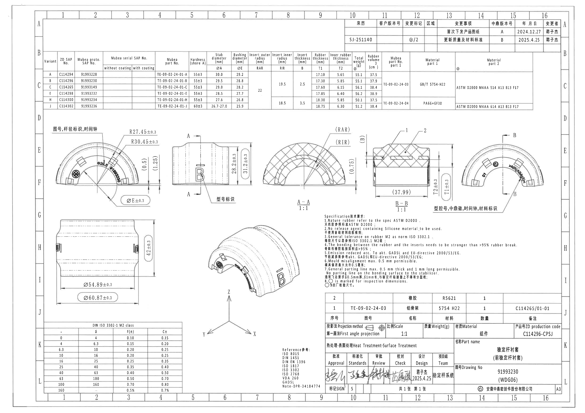

## object_2 - 右上角修订履历表

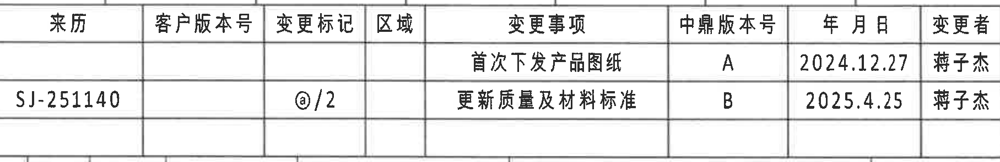

- 原图位置/视图名称：右上角修订履历表；page 1；bbox `[2935, 155, 1815, 295]`；object_kind `table`。

原表还原：

| 来源 | 客户版本号 | 变更标记 | 区域 | 变更事项 | 中鼎版本号 | 年 月 日 | 变更者 |
| --- | --- | --- | --- | --- | --- | --- | --- |
|  |  |  |  | 首次下发产品图纸 | A | 2024.12.27 | 蒋子杰 |
| SJ-251140 |  | @/2 |  | 更新质量及材料标准 | B | 2025.4.25 | 蒋子杰 |

提取表格：

| 提取项 | 原图数值或文本 | 含义说明 |
| --- | --- | --- |
| 表头 | 来源 / 客户版本号 / 变更标记 / 区域 / 变更事项 / 中鼎版本号 / 年 月 日 / 变更者 | 修订履历字段。 |
| 修订记录 A | 首次下发产品图纸；中鼎版本号 A；2024.12.27；蒋子杰 | 首次下发产品图纸的版本记录。 |
| 修订记录 B | 来源 SJ-251140；变更标记 @/2；更新质量及材料标准；中鼎版本号 B；2025.4.25；蒋子杰 | 当前修订更新质量及材料标准。 |

边界归属说明：下边界贴近参数表上边线，但裁切未包含参数表文字；右侧不取图框字母 A/B。

## object_1 - 上方变型/物料/尺寸参数表

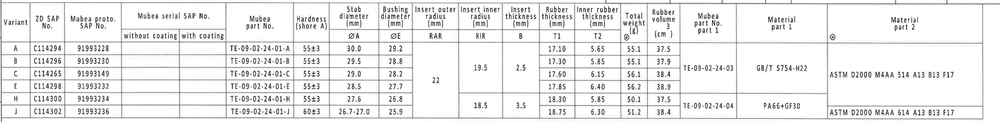

- 原图位置/视图名称：上方变型/物料/尺寸参数表；page 1；bbox `[360, 425, 4230, 520]`；object_kind `table`。

原表还原：

| Variant | ZD SAP No. | Mubea proto. SAP No. | Mubea serial SAP No. without coating | Mubea serial SAP No. with coating | Mubea part No. | Hardness (shore A) | Stab diameter ØA (mm) | Bushing diameter ØE (mm) | Insert outer radius RAR (mm) | Insert inner radius RIR (mm) | Insert thickness B (mm) | Rubber thickness T1 (mm) | Inner rubber thickness T2 (mm) | Total weight @ (g) | Rubber volume (cm^3) | Mubea part No. part 1 | Material part 1 | Material part 2 |
| --- | --- | --- | --- | --- | --- | --- | --- | --- | --- | --- | --- | --- | --- | --- | --- | --- | --- | --- |
| A | C114294 | 91993228 |  |  | TE-09-02-24-01-A | 55±3 | 30.0 | 29.2 | 22 | 19.5 | 2.5 | 17.10 | 5.65 | 55.1 | 37.5 | TE-09-02-24-03 | GB/T 5754-H22 | ASTM D2000 M4AA 514 A13 B13 F17 |
| B | C114296 | 91993230 |  |  | TE-09-02-24-01-B | 55±3 | 29.5 | 28.8 | 22 | 19.5 | 2.5 | 17.30 | 5.85 | 55.1 | 37.9 | TE-09-02-24-03 | GB/T 5754-H22 | ASTM D2000 M4AA 514 A13 B13 F17 |
| C | C114265 | 91993149 |  |  | TE-09-02-24-01-C | 55±3 | 29.0 | 28.2 | 22 | 19.5 | 2.5 | 17.60 | 6.15 | 56.1 | 38.4 | TE-09-02-24-03 | GB/T 5754-H22 | ASTM D2000 M4AA 514 A13 B13 F17 |
| E | C114298 | 91993232 |  |  | TE-09-02-24-01-E | 55±3 | 28.5 | 27.7 | 22 | 19.5 | 2.5 | 17.85 | 6.40 | 56.2 | 38.9 | TE-09-02-24-03 | GB/T 5754-H22 | ASTM D2000 M4AA 514 A13 B13 F17 |
| H | C114300 | 91993234 |  |  | TE-09-02-24-01-H | 55±3 | 27.6 | 26.8 | 22 | 18.5 | 3.5 | 18.30 | 5.85 | 50.1 | 37.5 | TE-09-02-24-04 | PA66+GF30 | ASTM D2000 M4AA 614 A13 B13 F17 |
| J | C114302 | 91993236 |  |  | TE-09-02-24-01-J | 60±3 | 26.7-27.0 | 25.9 | 22 | 18.5 | 3.5 | 18.75 | 6.30 | 51.2 | 38.4 | TE-09-02-24-04 | PA66+GF30 | ASTM D2000 M4AA 614 A13 B13 F17 |

提取表格：

| 提取项 | 原图数值或文本 | 含义说明 |
| --- | --- | --- |
| 变型行 A | C114294 / 91993228 / TE-09-02-24-01-A / 55±3 / ØA 30.0 / ØE 29.2 / RAR 22 / RIR 19.5 / B 2.5 / T1 17.10 / T2 5.65 / 55.1g / 37.5cm^3 | A 变型的物料、硬度、直径、半径、厚度、重量和体积参数。 |
| 变型行 B | C114296 / 91993230 / TE-09-02-24-01-B / 55±3 / ØA 29.5 / ØE 28.8 / RAR 22 / RIR 19.5 / B 2.5 / T1 17.30 / T2 5.85 / 55.1g / 37.9cm^3 | B 变型参数；标题栏产品号 C114296-CPSJ 对应该变型。 |
| 变型行 C | C114265 / 91993149 / TE-09-02-24-01-C / 55±3 / ØA 29.0 / ØE 28.2 / RAR 22 / RIR 19.5 / B 2.5 / T1 17.60 / T2 6.15 / 56.1g / 38.4cm^3 | C 变型参数。 |
| 变型行 E | C114298 / 91993232 / TE-09-02-24-01-E / 55±3 / ØA 28.5 / ØE 27.7 / RAR 22 / RIR 19.5 / B 2.5 / T1 17.85 / T2 6.40 / 56.2g / 38.9cm^3 | E 变型参数。 |
| 变型行 H | C114300 / 91993234 / TE-09-02-24-01-H / 55±3 / ØA 27.6 / ØE 26.8 / RAR 22 / RIR 18.5 / B 3.5 / T1 18.30 / T2 5.85 / 50.1g / 37.5cm^3 | H 变型参数，RIR/B 合并组切换为 18.5/3.5。 |
| 变型行 J | C114302 / 91993236 / TE-09-02-24-01-J / 60±3 / ØA 26.7-27.0 / ØE 25.9 / RAR 22 / RIR 18.5 / B 3.5 / T1 18.75 / T2 6.30 / 51.2g / 38.4cm^3 | J 变型参数，硬度 60±3，ØA 为范围值。 |
| 合并单元格 | RAR=22；A/B/C/E 组 RIR=19.5、B=2.5；H/J 组 RIR=18.5、B=3.5 | 表中半径/厚度参数的共享关系，供 A-A/B-B 等剖面参考。 |
| 材料组 1 | TE-09-02-24-03 / GB/T 5754-H22 / ASTM D2000 M4AA 514 A13 B13 F17 | A/B/C/E 组的 part 1 与材料。 |
| 材料组 2 | TE-09-02-24-04 / PA66+GF30 / ASTM D2000 M4AA 614 A13 B13 F17 | H/J 组的 part 1 与材料。 |

边界归属说明：裁切覆盖到 Material part 2 最右列，未截断表格文字；上方图框分区线可见但不属于表格字段。

## object_3 - 左上半圆正视图，图号/杆径标识/时间钟视图

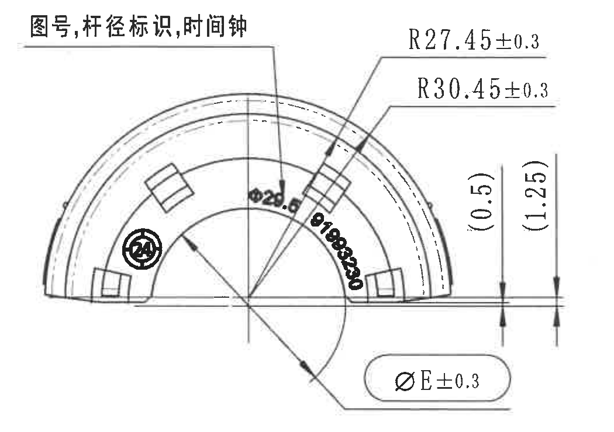

- 原图位置/视图名称：左上半圆正视图，图号/杆径标识/时间钟视图；page 1；bbox `[400, 1050, 1050, 740]`；object_kind `view`。

提取表格：

| 提取项 | 原图数值或文本 | 含义说明 |
| --- | --- | --- |
| 说明文字 | 图号,杆径标识,时间钟 | 指示该视图内标识内容的类别。 |
| 圆弧半径 | R27.45±0.3 | 半圆外/内轮廓相关圆弧半径，带 ±0.3 公差。 |
| 圆弧半径 | R30.45±0.3 | 另一组圆弧半径，带 ±0.3 公差。 |
| 参考尺寸 | (0.5) | 括号内参考尺寸，位于右侧竖向尺寸线旁；仅作参考，不作为控制尺寸。 |
| 参考尺寸 | (1.25) | 括号内参考尺寸，位于右侧竖向尺寸线旁；仅作参考，不作为控制尺寸。 |
| 直径尺寸 | ØE±0.3 | 直径 E 尺寸，带直径符号和 ±0.3 公差；数值 E 由参数表 ØE 列按变型确定。 |
| 弧形标识 | Ø20.6 | 视图内沿弧排布的标识文本，属于图号/杆径标识区域，不作为加工尺寸。 |
| 弧形标识 | 另一串粗体弧形标识字符扫描压黑，未作尺寸值读取 | 与说明文字对应的标识内容，因扫描清晰度不足仅按标识记录。 |

边界归属说明：右边界在相邻 A 向视图前截断，R/ØE/参考尺寸的文字、引线和箭头完整；内部粗黑弧形字符属于本视图标识，不归作加工尺寸。

## object_4 - 中上 A 向侧视图，带 A-A 剖切指示

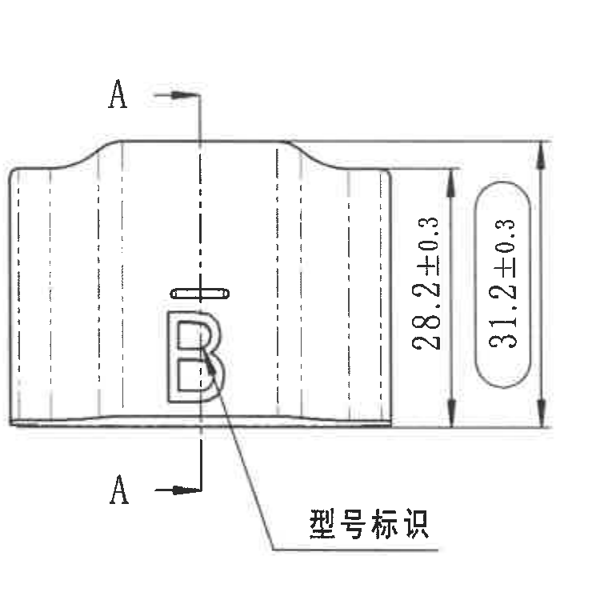

- 原图位置/视图名称：中上 A 向侧视图，带 A-A 剖切指示；page 1；bbox `[1450, 1035, 760, 760]`；object_kind `view`。

提取表格：

| 提取项 | 原图数值或文本 | 含义说明 |
| --- | --- | --- |
| 剖切/基准字母 | A（上、下两处） | A-A 剖切位置和观察方向标识。 |
| 高度尺寸 | 28.2±0.3 | 内侧或局部竖向尺寸，带 ±0.3 公差。 |
| 总高度尺寸 | 31.2±0.3 | 外侧总高度尺寸，带 ±0.3 公差。 |
| 型号标识 | B；型号标识 | 零件型号标识所在位置的引线说明。 |

边界归属说明：右侧尺寸线、箭头和 28.2±0.3/31.2±0.3 文字完整；未将右侧 A-A 剖面内容归入本对象。

## object_5 - A-A 剖面图，比例 1:1

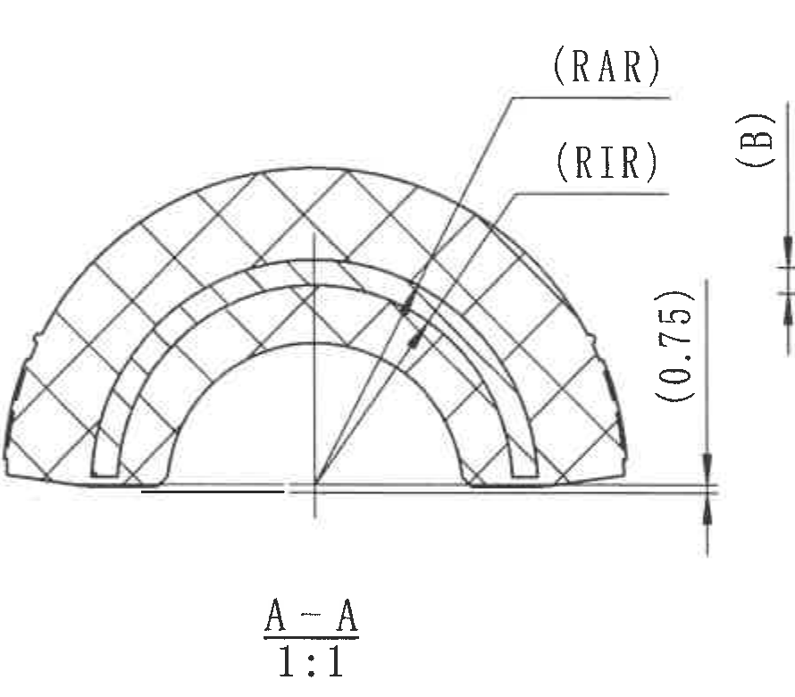

- 原图位置/视图名称：A-A 剖面图，比例 1:1；page 1；bbox `[2225, 1025, 890, 780]`；object_kind `section`。

提取表格：

| 提取项 | 原图数值或文本 | 含义说明 |
| --- | --- | --- |
| 剖面名称 | A-A | 由 object_4 的 A 剖切线得到的剖面视图。 |
| 比例 | 1:1 | 剖面图比例。 |
| 参考半径 | (RAR) | 括号参考项，对应参数表 Insert outer radius；数值 RAR=22。 |
| 参考半径 | (RIR) | 括号参考项，对应参数表 Insert inner radius；A/B/C/E 为 19.5，H/J 为 18.5。 |
| 参考尺寸 | (0.75) | 括号参考厚度/间距，位于 A-A 剖面右侧。 |

边界归属说明：A-A 剖面轮廓、剖线、RAR/RIR 引线和 (0.75) 尺寸线完整；右侧的 (B) 属于相邻 B-B 剖面边界，不归入 A-A。

## object_6 - B-B 剖面图，比例 1:1

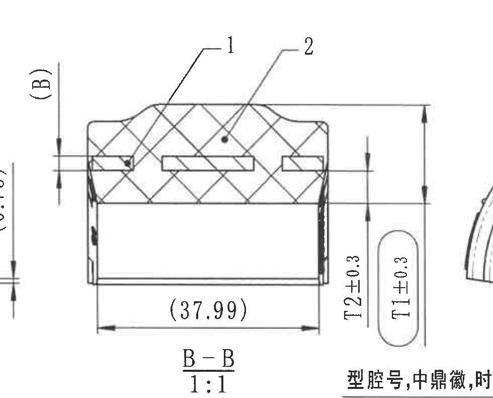

- 原图位置/视图名称：B-B 剖面图，比例 1:1；page 1；bbox `[2990, 1015, 980, 790]`；object_kind `section`。

提取表格：

| 提取项 | 原图数值或文本 | 含义说明 |
| --- | --- | --- |
| 剖面名称 | B-B | 由右上视图 B 剖切线得到的剖面视图。 |
| 比例 | 1:1 | 剖面图比例。 |
| 物料序号 | 1 | 引线指向内嵌骨架，对应明细表序号 1：铝骨架。 |
| 物料序号 | 2 | 引线指向橡胶主体，对应明细表序号 2：橡胶。 |
| 参考厚度 | (B) | 括号参考尺寸；实际 B 值由参数表确定，A/B/C/E 为 2.5，H/J 为 3.5。 |
| 参考长度 | (37.99) | 括号参考长度尺寸，位于剖面底部水平尺寸线。 |
| 厚度尺寸 | T2±0.3 | 内橡胶厚度尺寸，带 ±0.3 公差；具体 T2 数值由参数表按变型确定。 |
| 厚度尺寸 | T1±0.3 | 橡胶厚度尺寸，带 ±0.3 公差；具体 T1 数值由参数表按变型确定。 |

边界归属说明：本裁切完整包含 B-B 横向尺寸线和 T1/T2 尺寸线；左缘可见 A-A 的 (0.75) 残段，右缘可见相邻右上视图边缘，均不纳入 B-B 提取。

## object_7 - 右上半圆正视图，型腔号/中鼎徽/时间钟/材料标识

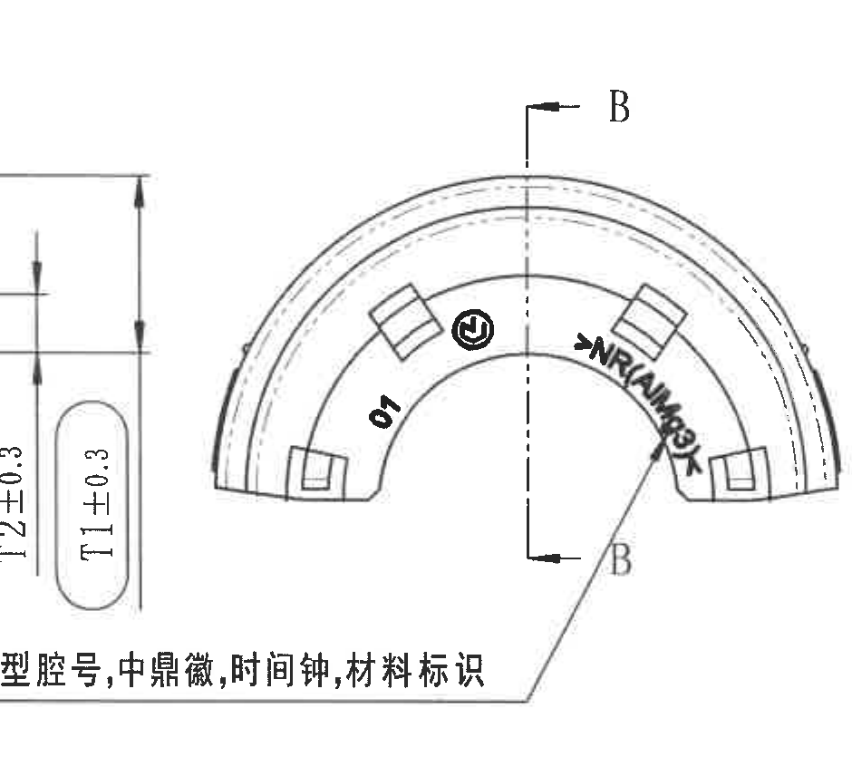

- 原图位置/视图名称：右上半圆正视图，型腔号/中鼎徽/时间钟/材料标识；page 1；bbox `[3680, 1030, 940, 835]`；object_kind `view`。

提取表格：

| 提取项 | 原图数值或文本 | 含义说明 |
| --- | --- | --- |
| 说明文字 | 型腔号,中鼎徽,时间钟,材料标识 | 底部引线说明该视图内标识内容。 |
| 剖切/基准字母 | B（上、下两处） | B-B 剖切位置和观察方向标识。 |
| 型腔号 | 01 | 零件型腔号标识。 |
| 中鼎徽 | 圆形中鼎徽标 | 商标/厂标位置。 |
| 材料标识 | >NR/AIM<（按图面近似读取） | 沿弧排布的材料标识；扫描及弧排文字导致末尾字符不完全清晰。 |
| 尺寸 | 未见本视图独立尺寸 | 左缘 T1/T2 属于 object_6 B-B 剖面，不计入本视图。 |

边界归属说明：底部说明引线完整；左侧贴近 B-B 剖面并带入 T1/T2 尺寸边缘，这些尺寸归属 object_6；右侧未纳入图框字母。

## object_8 - 左下长向视图

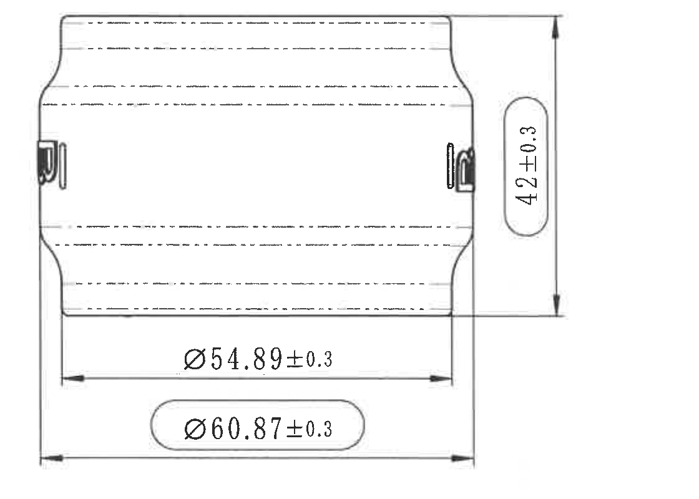

- 原图位置/视图名称：左下长向视图；page 1；bbox `[415, 1840, 1120, 800]`；object_kind `view`。

提取表格：

| 提取项 | 原图数值或文本 | 含义说明 |
| --- | --- | --- |
| 总高度/宽度 | 42±0.3 | 竖向尺寸，带 ±0.3 公差。 |
| 直径尺寸 | Ø54.89±0.3 | 内侧直径尺寸，带直径符号和 ±0.3 公差。 |
| 直径尺寸 | Ø60.87±0.3 | 外侧直径尺寸，带直径符号和 ±0.3 公差。 |

边界归属说明：所有竖向和横向尺寸线、箭头、圆角框文字完整；左边界避开图框，未混入下方公差表。

## object_9 - 中心等轴测视图与 X/Y/Z 坐标三轴

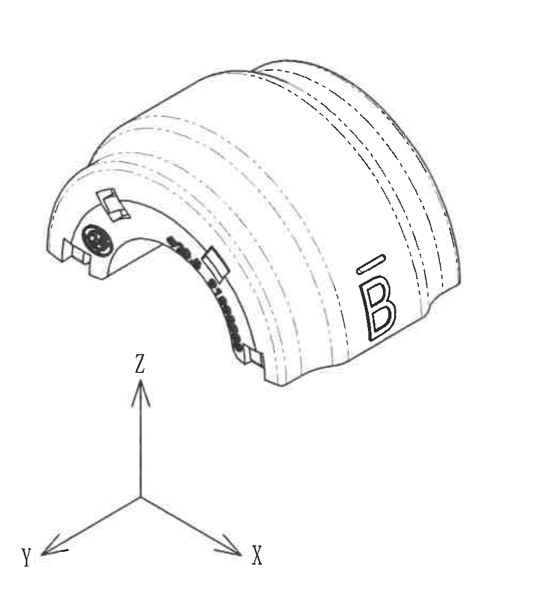

- 原图位置/视图名称：中心等轴测视图与 X/Y/Z 坐标三轴；page 1；bbox `[1680, 1800, 1000, 1100]`；object_kind `view`。

提取表格：

| 提取项 | 原图数值或文本 | 含义说明 |
| --- | --- | --- |
| 三维外观 | 等轴测零件图 | 表达零件外形、槽、嵌件和标识布置。 |
| 型号标识 | B | 零件外侧型号标识。 |
| 坐标三轴 | X / Y / Z | 方向参考坐标；非尺寸。 |
| 尺寸 | 未见尺寸或公差 | 本对象不提取加工尺寸。 |

边界归属说明：重裁后未包含右侧 NOTES 或标题栏；X/Y/Z 三轴和文字完整。

## object_10 - Specification 技术要求 NOTES

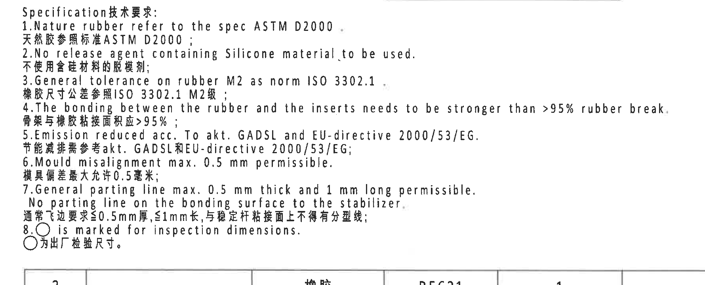

- 原图位置/视图名称：Specification 技术要求 NOTES；page 1；bbox `[2695, 1805, 1780, 720]`；object_kind `notes`。

提取表格：

| 提取项 | 原图数值或文本 | 含义说明 |
| --- | --- | --- |
| 标题 | Specification 技术要求 | 技术要求区域标题。 |
| 1 | Nature rubber refer to the spec ASTM D2000. / 天然胶参照标准 ASTM D2000 | 天然橡胶材料规范。 |
| 2 | No release agent containing Silicone material to be used. / 不使用含硅材料的脱模剂 | 脱模剂限制。 |
| 3 | General tolerance on rubber M2 as norm ISO 3302.1. / 橡胶尺寸公差参照 ISO 3302.1 M2级 | 橡胶通用公差要求。 |
| 4 | The bonding between the rubber and the inserts needs to be stronger than >95% rubber break. / 骨架与橡胶粘接面积应>95% | 粘接强度/破坏方式要求。 |
| 5 | Emission reduced acc. To akt. GADSL and EU-directive 2000/53/EG. / 节能减排需参考 akt. GADSL 和 EU-directive 2000/53/EG | 法规和减排要求。 |
| 6 | Mould misalignment max. 0.5 mm permissible. / 模具偏差最大允许0.5毫米 | 模具错位最大允许值。 |
| 7 | General parting line max. 0.5 mm thick and 1 mm long permissible. No parting line on the bonding surface to the stabilizer. / 通常飞边要求≤0.5mm厚,≤1mm长,与稳定杆粘接面上不得有分型线 | 飞边/分型线要求。 |
| 8 | ○ is marked for inspection dimensions. / ○为出厂检验尺寸 | 圆圈标记表示出厂检验尺寸。 |

边界归属说明：标题、编号 1-8 与中英文行完整；底部可见明细表上边线，非 NOTES 内容。

## object_11 - 左下 DIN ISO 3302-1 M2 class 公差表

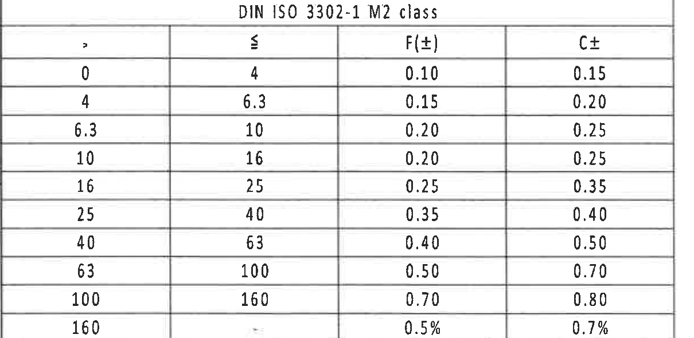

- 原图位置/视图名称：左下 DIN ISO 3302-1 M2 class 公差表；page 1；bbox `[370, 2740, 1210, 590]`；object_kind `table`。

原表还原：

| DIN ISO 3302-1 M2 class: > | ≤ | F(±) | C± |
| --- | --- | --- | --- |
| 0 | 4 | 0.10 | 0.15 |
| 4 | 6.3 | 0.15 | 0.20 |
| 6.3 | 10 | 0.20 | 0.25 |
| 10 | 16 | 0.20 | 0.25 |
| 16 | 25 | 0.25 | 0.35 |
| 25 | 40 | 0.35 | 0.40 |
| 40 | 63 | 0.40 | 0.50 |
| 63 | 100 | 0.50 | 0.70 |
| 100 | 160 | 0.70 | 0.80 |
| 160 | - | 0.5% | 0.7% |

提取表格：

| 提取项 | 原图数值或文本 | 含义说明 |
| --- | --- | --- |
| 表题 | DIN ISO 3302-1 M2 class | 橡胶尺寸通用公差等级。 |
| 公差区间 | 0-4 到 160 以上 | 按尺寸范围给出 F(±) 与 C± 公差。 |
| 末行百分比 | >160: F=0.5%, C=0.7% | 大尺寸范围采用百分比公差。 |

边界归属说明：表头、全部十行和表格线完整；底部图框分区数字未纳入表格字段。

## object_12 - 参考标准清单

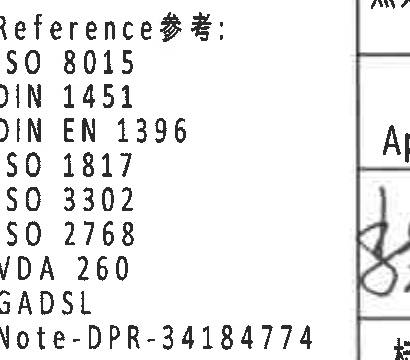

- 原图位置/视图名称：参考标准清单；page 1；bbox `[2400, 2940, 410, 360]`；object_kind `notes`。

提取表格：

| 提取项 | 原图数值或文本 | 含义说明 |
| --- | --- | --- |
| 标题 | Reference 参考 | 参考标准清单标题。 |
| 标准 | ISO 8015 | 参考标准。 |
| 标准 | DIN 1451 | 参考标准。 |
| 标准 | DIN EN 1396 | 参考标准。 |
| 标准 | ISO 1817 | 参考标准。 |
| 标准 | ISO 3302 | 参考标准。 |
| 标准 | ISO 2768 | 参考标准。 |
| 标准 | VDA 260 | 参考标准。 |
| 标准 | GADSL | 参考清单/法规要求。 |
| 文件 | Note-DPR-34184774 | 参考文件编号。 |

边界归属说明：清单文字完整；右侧标题栏线框和底部分区数字不作为本对象内容。

## object_13 - 右下明细表/BOM 表

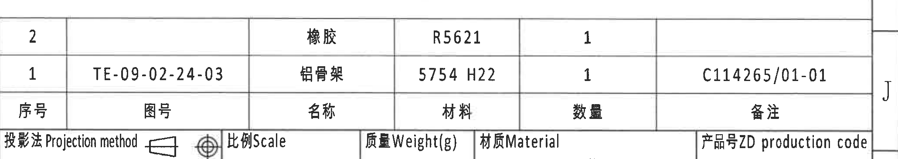

- 原图位置/视图名称：右下明细表/BOM 表；page 1；bbox `[2760, 2445, 2060, 365]`；object_kind `table`。

原表还原（原图表头位于底行，以下用表头列名还原字段）：

| 序号 | 图号 | 名称 | 材料 | 数量 | 备注 |
| --- | --- | --- | --- | --- | --- |
| 2 |  | 橡胶 | R5621 | 1 |  |
| 1 | TE-09-02-24-03 | 铝骨架 | 5754 H22 | 1 | C114265/01-01 |

提取表格：

| 提取项 | 原图数值或文本 | 含义说明 |
| --- | --- | --- |
| 表头 | 序号 / 图号 / 名称 / 材料 / 数量 / 备注 | 明细表字段；表头在原图底行。 |
| 序号 2 | 名称 橡胶；材料 R5621；数量 1 | 橡胶件，与 B-B 剖面标号 2 对应。 |
| 序号 1 | 图号 TE-09-02-24-03；名称 铝骨架；材料 5754 H22；数量 1；备注 C114265/01-01 | 铝骨架件，与 B-B 剖面标号 1 对应。 |

边界归属说明：上下表格线完整；右侧图框字母 J 贴近但不属于表格内容。

## object_14 - 右下标题栏

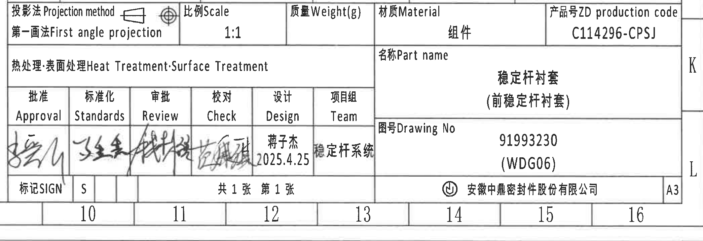

- 原图位置/视图名称：右下标题栏；page 1；bbox `[2735, 2735, 2090, 720]`；object_kind `title_block`。

提取表格：

| 提取项 | 原图数值或文本 | 含义说明 |
| --- | --- | --- |
| Projection method | 第一画法 First angle projection | 投影方法，图中含第一角投影符号。 |
| Scale | 1:1 | 图纸比例。 |
| Weight(g) | 空 | 标题栏质量栏未填写。 |
| Material | 组件 | 标题栏材质/材料字段。 |
| ZD production code | C114296-CPSJ | 产品号。 |
| Heat Treatment;Surface Treatment | 空 | 热处理/表面处理栏未填写。 |
| Part name | 稳定杆衬套（前稳定杆衬套） | 零件名称。 |
| Approval | 手写签名 | 批准签署。 |
| Standards | 手写签名 | 标准化签署。 |
| Review | 手写签名 | 审批签署。 |
| Check | 手写签名 | 校对签署。 |
| Design | 蒋子杰；2025.4.25 | 设计人员和日期。 |
| Team | 稳定杆系统 | 项目组。 |
| SIGN | S | 标记栏。 |
| Sheet | 共1张 第1张 | 页数信息。 |
| Drawing No | 91993230 (WDG06) | 图号。 |
| Company | 安徽中鼎密封件股份有限公司 | 出图单位。 |
| Format | A3 | 图纸幅面。 |

边界归属说明：标题栏外框完整；底部图框分区数字 10-16 和右侧 K/L 字母贴近但不作为标题栏字段。

## 裁切检查记录

| 对象 | 图片路径 | 检查结论 | 边界/完整性记录 |
| --- | --- | --- | --- |
| page_1 | outputs/20C114296_assets/images/page_1.png | 完整 | 整页 PNG 由 PDF 300dpi 渲染，尺寸 4959 x 3505。 |
| object_2 | outputs/20C114296_assets/images/object_2.png | 完整 | 下边界贴近参数表上边线，但裁切未包含参数表文字；右侧不取图框字母 A/B。 |
| object_1 | outputs/20C114296_assets/images/object_1.png | 完整 | 裁切覆盖到 Material part 2 最右列，未截断表格文字；上方图框分区线可见但不属于表格字段。 |
| object_3 | outputs/20C114296_assets/images/object_3.png | 完整 | 右边界在相邻 A 向视图前截断，R/ØE/参考尺寸的文字、引线和箭头完整；内部粗黑弧形字符属于本视图标识，不归作加工尺寸。 |
| object_4 | outputs/20C114296_assets/images/object_4.png | 完整 | 右侧尺寸线、箭头和 28.2±0.3/31.2±0.3 文字完整；未将右侧 A-A 剖面内容归入本对象。 |
| object_5 | outputs/20C114296_assets/images/object_5.png | 完整，含边界归属说明 | A-A 剖面轮廓、剖线、RAR/RIR 引线和 (0.75) 尺寸线完整；右侧的 (B) 属于相邻 B-B 剖面边界，不归入 A-A。 |
| object_6 | outputs/20C114296_assets/images/object_6.png | 完整，含边界归属说明 | 本裁切完整包含 B-B 横向尺寸线和 T1/T2 尺寸线；左缘可见 A-A 的 (0.75) 残段，右缘可见相邻右上视图边缘，均不纳入 B-B 提取。 |
| object_7 | outputs/20C114296_assets/images/object_7.png | 完整，含边界归属说明 | 底部说明引线完整；左侧贴近 B-B 剖面并带入 T1/T2 尺寸边缘，这些尺寸归属 object_6；右侧未纳入图框字母。 |
| object_8 | outputs/20C114296_assets/images/object_8.png | 完整 | 所有竖向和横向尺寸线、箭头、圆角框文字完整；左边界避开图框，未混入下方公差表。 |
| object_9 | outputs/20C114296_assets/images/object_9.png | 完整，含边界归属说明 | 重裁后未包含右侧 NOTES 或标题栏；X/Y/Z 三轴和文字完整。 |
| object_10 | outputs/20C114296_assets/images/object_10.png | 完整 | 标题、编号 1-8 与中英文行完整；底部可见明细表上边线，非 NOTES 内容。 |
| object_11 | outputs/20C114296_assets/images/object_11.png | 完整 | 表头、全部十行和表格线完整；底部图框分区数字未纳入表格字段。 |
| object_12 | outputs/20C114296_assets/images/object_12.png | 完整 | 清单文字完整；右侧标题栏线框和底部分区数字不作为本对象内容。 |
| object_13 | outputs/20C114296_assets/images/object_13.png | 完整 | 上下表格线完整；右侧图框字母 J 贴近但不属于表格内容。 |
| object_14 | outputs/20C114296_assets/images/object_14.png | 完整，含边界归属说明 | 标题栏外框完整；底部图框分区数字 10-16 和右侧 K/L 字母贴近但不作为标题栏字段。 |

