# 20C114297 内容识别结果

整页渲染图：`outputs/20C114297_assets/images/page_1.png`  
页面尺寸：4959 x 3505 px。以下对象按原图大致从上到下、从左到右排列；每个对象的边界归属以裁切图内完整尺寸线、箭头、标注文字和相邻视图间距为准。

## object_8 - 右上变更/下发表

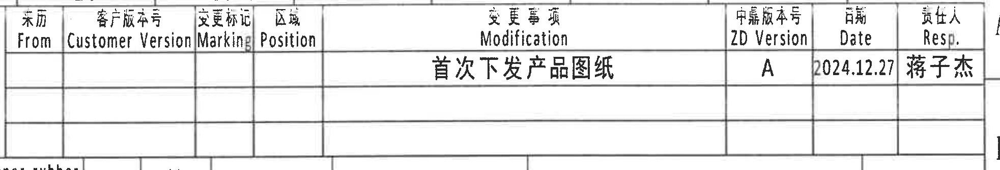

原图位置/视图名称：右上角变更/下发表，bbox `[2805,165,4770,500]`。

| From | Customer Version | Marking | Position | Modification | ZD Version | Date | Resp. |
|---|---|---|---|---|---|---|---|
|  |  |  |  | 首次下发产品图纸 | A | 2024.12.27 | 蒋子杰 |
|  |  |  |  |  |  |  |  |
|  |  |  |  |  |  |  |  |

| 提取项 | 原图数值或文本 | 含义说明 |
|---|---|---|
| Modification | 首次下发产品图纸 | 表示本次为首次下发产品图纸。 |
| ZD Version | A | 中鼎版本号为 A。 |
| Date | 2024.12.27 | 下发/记录日期。 |
| Resp. | 蒋子杰 | 责任人。 |

边界归属说明：裁切仅包含右上变更表本体，未带入下方参数表的数据行。

## object_9 - 顶部变型参数表

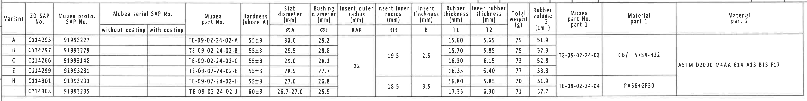

原图位置/视图名称：顶部横向变型参数表，bbox `[340,460,4520,990]`。

| Variant | ZD SAP No. | Mubea proto. SAP No. | Mubea serial SAP No. without coating | Mubea serial SAP No. with coating | Mubea part No. | Hardness (shore A) | Stab diameter ØA (mm) | Bushing diameter ØE (mm) | Insert outer radius RAR (mm) | Insert inner radius RIR (mm) | Insert thickness B (mm) | Rubber thickness T1 (mm) | Inner rubber thickness T2 (mm) | Total weight (g) | Rubber volume (cm³) | Mubea part No. part 1 | Material part 1 | Material part 2 |
|---|---|---|---|---|---|---|---:|---:|---:|---:|---:|---:|---:|---:|---:|---|---|---|
| A | C114295 | 91993227 |  |  | TE-09-02-24-02-A | 55±3 | 30.0 | 29.2 | 22 | 19.5 | 2.5 | 15.60 | 5.65 | 75 | 51.9 |  |  |  |
| B | C114297 | 91993229 |  |  | TE-09-02-24-02-B | 55±3 | 29.5 | 28.8 | 22 | 19.5 | 2.5 | 15.70 | 5.85 | 75 | 52.3 | TE-09-02-24-03 | GB/T 5754-H22 | ASTM D2000 M4AA 614 A13 B13 F17 |
| C | C114266 | 91993148 |  |  | TE-09-02-24-02-C | 55±3 | 29.0 | 28.2 | 22 | 19.5 | 2.5 | 16.30 | 6.15 | 73 | 52.8 | TE-09-02-24-03 | GB/T 5754-H22 | ASTM D2000 M4AA 614 A13 B13 F17 |
| E | C114299 | 91993231 |  |  | TE-09-02-24-02-E | 55±3 | 28.5 | 27.7 | 22 | 19.5 | 2.5 | 16.35 | 6.40 | 77 | 53.3 | TE-09-02-24-03 | GB/T 5754-H22 | ASTM D2000 M4AA 614 A13 B13 F17 |
| H | C114301 | 91993233 |  |  | TE-09-02-24-02-H | 55±3 | 27.6 | 26.8 | 22 | 18.5 | 3.5 | 16.80 | 5.85 | 70 | 51.9 | TE-09-02-24-04 | PA66+GF30 |  |
| J | C114303 | 91993235 |  |  | TE-09-02-24-02-J | 60±3 | 26.7-27.0 | 25.9 | 22 | 18.5 | 3.5 | 17.35 | 6.30 | 71 | 52.7 | TE-09-02-24-04 | PA66+GF30 |  |

| 提取项 | 原图数值或文本 | 含义说明 |
|---|---|---|
| ØA | 30.0 / 29.5 / 29.0 / 28.5 / 27.6 / 26.7-27.0 | 稳定杆直径变量，按 Variant 选择。 |
| ØE | 29.2 / 28.8 / 28.2 / 27.7 / 26.8 / 25.9 | 轴套孔径/衬套直径变量，对应左上正视图 `ØEر0.3`。 |
| RAR | 22 | 插入件外半径变量，对应 A-A 剖面 `(RAR)`。 |
| RIR | 19.5 或 18.5 | 插入件内半径变量，对应 A-A 剖面 `(RIR)`。 |
| B | 2.5 或 3.5 | 插入件厚度变量，对应 B-B 剖面 `(B)`。 |
| T1 | 15.60 / 15.70 / 16.30 / 16.35 / 16.80 / 17.35 | 橡胶厚度变量，对应 B-B 剖面 `T1±0.30`。 |
| T2 | 5.65 / 5.85 / 6.15 / 6.40 / 5.85 / 6.30 | 内橡胶厚度变量，对应 B-B 剖面 `T2±0.30`。 |
| Hardness | 55±3；J 行为 60±3 | 橡胶硬度，shore A。 |
| Materials | GB/T 5754-H22；ASTM D2000 M4AA 614 A13 B13 F17；PA66+GF30 | 材料字段按表中合并单元格展开到对应变型。 |

边界归属说明：裁切包含参数表完整外框、表头和数据行；没有带入下方加工视图。表内合并单元格已按其覆盖的变型行展开。

## object_1 - 左上正视图

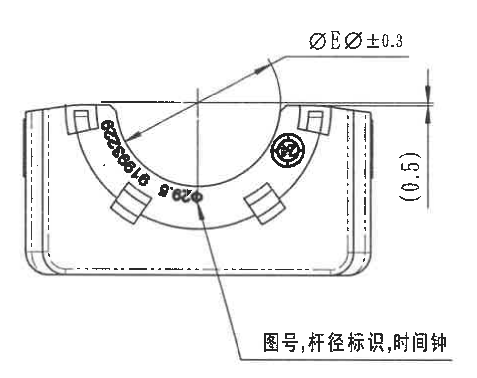

原图位置/视图名称：左上正面加工视图，bbox `[390,980,1350,1740]`。

| 提取项 | 原图数值或文本 | 含义说明 |
|---|---|---|
| 直径变量 | ØEر0.3 | 与参数表 `Bushing diameter ØE` 对应；具体 ØE 数值随 Variant 变化，公差 ±0.3。 |
| 参考尺寸 | (0.5) | 右侧括号参考竖向尺寸，不作为独立加工控制尺寸；仍需用于理解边界/间隙。 |
| 标识说明 | 图号,杆径标识,时间钟 | 引出至弧面标识区域，说明该视图包含图号、杆径标识和时间钟。 |
| 标识 | 中鼎圆形徽标、弧面局部字符 | 视图中可见圆形徽标和弧向布置的标识内容。 |

边界归属说明：右边界已避开中间侧视图；`ØEر0.3` 和 `(0.5)` 的尺寸线、箭头、文字完整在本裁切内。该对象不提取侧视图的 `29.7±0.3`。

## object_2 - 中间侧视图

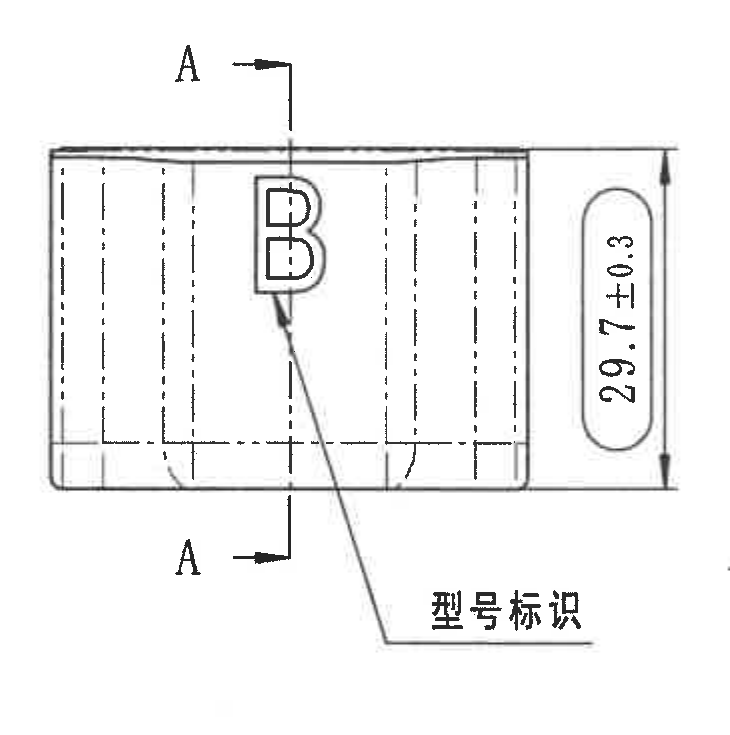

原图位置/视图名称：中间侧面加工视图，bbox `[1350,1045,2080,1780]`。

| 提取项 | 原图数值或文本 | 含义说明 |
|---|---|---|
| 剖切标识 | A-A | 表示 A-A 剖面位置，箭头方向指向剖切方向。 |
| 尺寸 | 29.7±0.3 | 右侧竖向尺寸，带 ±0.3 公差。 |
| 标识说明 | 型号标识 | 引出线指向视图中的字母 B 型号标识。 |
| 标识 | B | 型号标识字符。 |

边界归属说明：裁切包含完整 `29.7±0.3` 尺寸线和文字；右侧未带入 A-A 剖面中的 `(RAR)/(RIR)` 标注。

## object_3 - A-A 剖面

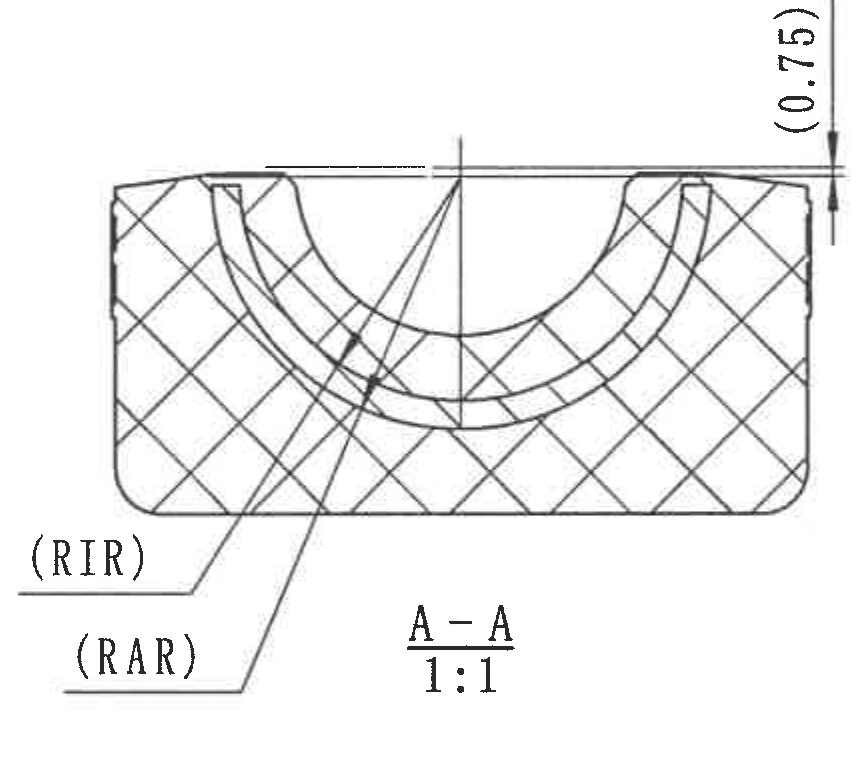

原图位置/视图名称：A-A 剖面视图，bbox `[2060,1020,2920,1785]`。

| 提取项 | 原图数值或文本 | 含义说明 |
|---|---|---|
| 剖面名称/比例 | A-A 1:1 | A-A 剖切后的剖面图，比例 1:1。 |
| 参考尺寸 | (0.75) | 位于剖面右上侧的括号参考尺寸。 |
| 半径变量 | (RIR) | 插入件内半径，数值由参数表 `RIR` 给出：19.5 或 18.5。 |
| 半径变量 | (RAR) | 插入件外半径，数值由参数表 `RAR` 给出：22。 |
| 剖面填充 | 交叉剖面线 | 表示被剖切的材料区域。 |

边界归属说明：左下 `(RIR)`、`(RAR)` 引出线和文字完整；右上 `(0.75)` 完整。未将相邻 B-B 剖面尺寸归入 A-A。

## object_4 - B-B 剖面

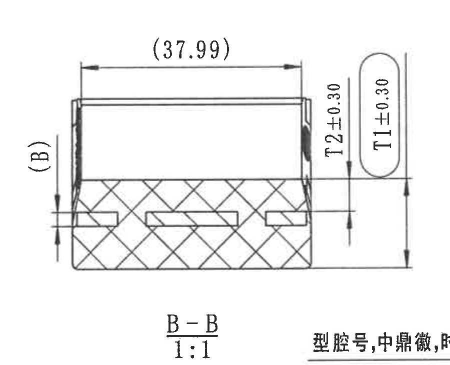

原图位置/视图名称：B-B 剖面视图，bbox `[2915,1010,3815,1740]`。

| 提取项 | 原图数值或文本 | 含义说明 |
|---|---|---|
| 剖面名称/比例 | B-B 1:1 | B-B 剖切后的剖面图，比例 1:1。 |
| 参考尺寸 | (37.99) | 顶部水平括号参考尺寸。 |
| 参考变量 | (B) | 左侧括号变量，对应参数表 `Insert thickness B`，值为 2.5 或 3.5。 |
| 厚度尺寸 | T2±0.30 | 内橡胶厚度变量，数值由参数表 T2 给出，公差 ±0.30。 |
| 厚度尺寸 | T1±0.30 | 橡胶厚度变量，数值由参数表 T1 给出，公差 ±0.30。 |

边界归属说明：`(37.99)`、`(B)`、`T2±0.30`、`T1±0.30` 和 `B-B 1:1` 完整保留。右下角有相邻右上正视图引出说明的边缘文字，未提取为 B-B 内容。

## object_5 - 右上正视图

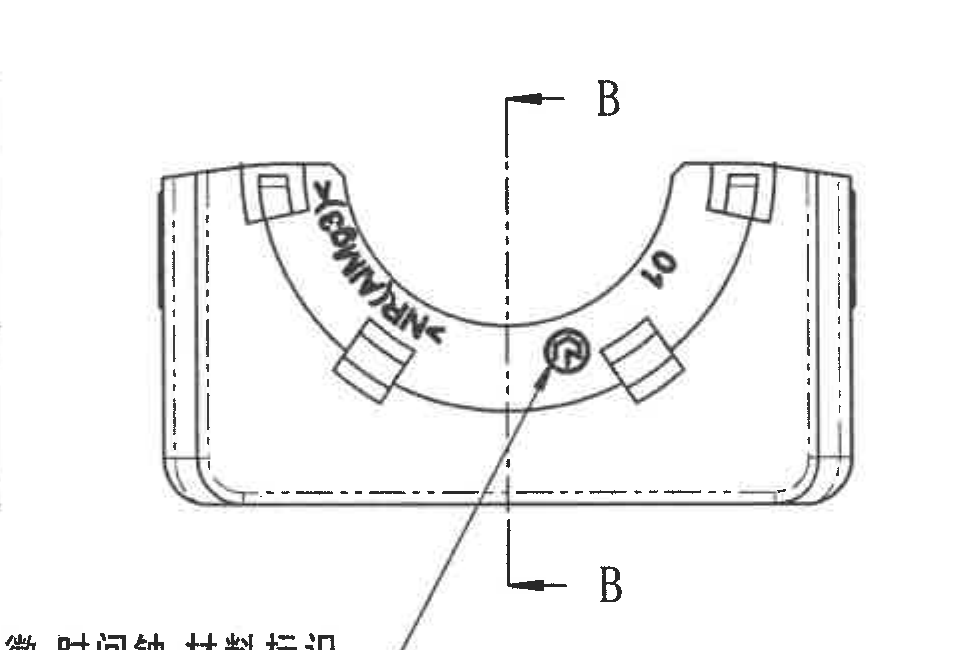

原图位置/视图名称：右上正面加工视图，bbox `[3740,1040,4720,1690]`。

| 提取项 | 原图数值或文本 | 含义说明 |
|---|---|---|
| 剖切标识 | B-B | 表示 B-B 剖面位置，剖切结果见 object_4。 |
| 弧面标识 | ZONGDING | 弧向布置的品牌/厂商标识。 |
| 数字标识 | 10 | 弧面上的数字标识。 |
| 圆形标识 | 中鼎圆形徽标 | 正面弧面区域内的圆形徽标。 |

边界归属说明：本对象保留正视图本体和 B-B 剖切线；下方完整引出说明另见 object_16。左下边缘残字来自该引出说明，不作为独立提取项。

## object_16 - 右上正视图引出说明局部

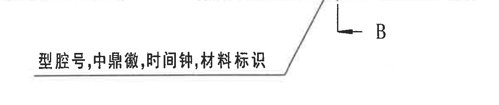

原图位置/视图名称：右上正视图下方引出说明局部，bbox `[3450,1550,4630,1800]`。

| 提取项 | 原图数值或文本 | 含义说明 |
|---|---|---|
| 引出说明 | 型腔号,中鼎徽,时间钟,材料标识 | 说明右上正视图弧面/徽标区域需要包含型腔号、中鼎徽、时间钟和材料标识。 |
| 相邻线条 | B-B 剖切线底部 | 因原图位置接近，被裁入作为定位参照；不作为尺寸提取。 |

边界归属说明：该对象是 object_5 的配套局部，用于完整保留被主裁切边界截断的说明文字；不归入 B-B 剖面尺寸。

## object_6 - 底部左侧视图

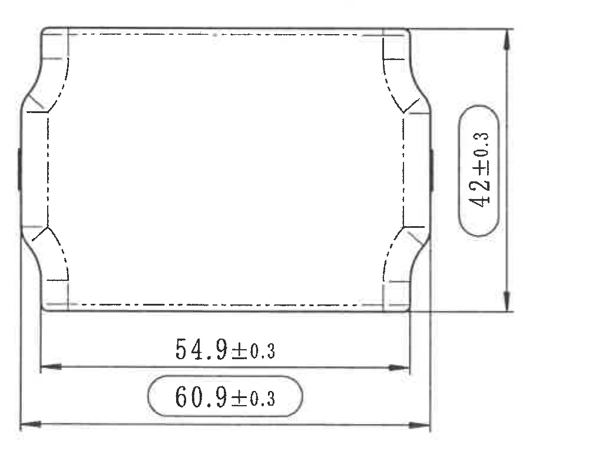

原图位置/视图名称：底部左侧俯视/底视图，bbox `[405,1830,1405,2635]`。

| 提取项 | 原图数值或文本 | 含义说明 |
|---|---|---|
| 竖向尺寸 | 42±0.3 | 右侧竖向总尺寸，公差 ±0.3。 |
| 水平尺寸 | 54.9±0.3 | 下方内侧水平尺寸，公差 ±0.3。 |
| 水平总长 | 60.9±0.3 | 下方外侧水平总尺寸，圆角框内标注，公差 ±0.3。 |

边界归属说明：三个尺寸的尺寸线、箭头和文字均完整；未带入下方公差表内容。

## object_7 - 等轴测视图

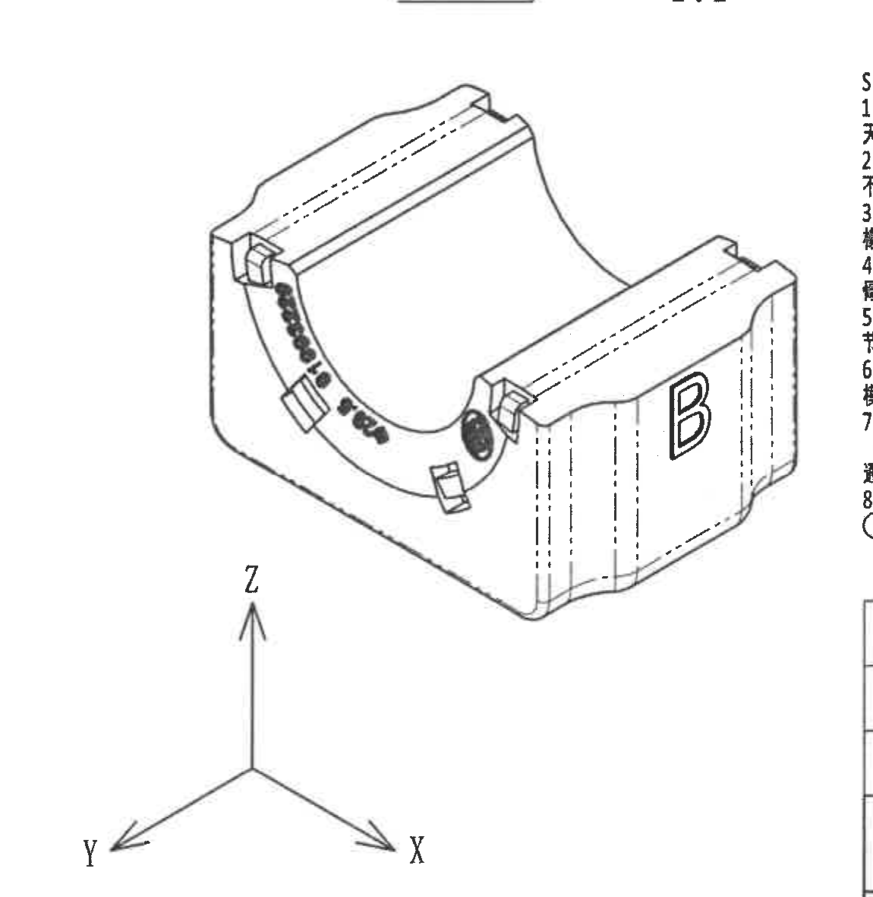

原图位置/视图名称：等轴测视图，bbox `[1600,1710,2750,2890]`。

| 提取项 | 原图数值或文本 | 含义说明 |
|---|---|---|
| 三维方向 | X / Y / Z | 坐标方向标识，用于说明零件方向。 |
| 型号标识 | B | 右侧面可见型号字母。 |
| 弧面标识 | 中鼎圆形徽标及弧向文字 | 表示零件表面标识位置。 |
| 数值尺寸 | 无 | 等轴测图不含独立尺寸标注。 |

边界归属说明：三轴坐标完整保留。右边缘有 NOTES 区域局部残字，不作为本视图内容提取。

## object_10 - Specification 技术要求

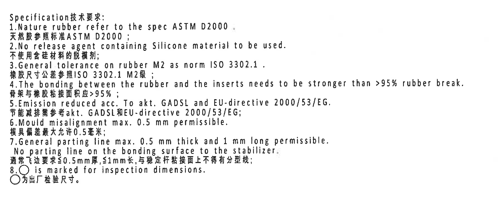

原图位置/视图名称：右中下 NOTES/Specification 技术要求，bbox `[2700,1755,4500,2475]`。

| 提取项 | 原图数值或文本 | 含义说明 |
|---|---|---|
| 1 | Nature rubber refer to the spec ASTM D2000. / 天然胶参照标准ASTM D2000； | 天然橡胶标准要求。 |
| 2 | No release agent containing Silicone material to be used. / 不使用含硅材料的脱模剂； | 脱模剂限制。 |
| 3 | General tolerance on rubber M2 as norm ISO 3302.1. / 橡胶尺寸公差参照ISO 3302.1 M2级； | 橡胶一般公差等级。 |
| 4 | The bonding between the rubber and the inserts needs to be stronger than >95% rubber break. / 骨架与橡胶粘接面积应>95%； | 橡胶与骨架粘接强度要求。 |
| 5 | Emission reduced acc. To akt. GADSL and EU-directive 2000/53/EG. / 节能减排需参考akt. GADSL和EU-directive 2000/53/EG； | 排放/环保法规要求。 |
| 6 | Mould misalignment max. 0.5 mm permissible. / 模具偏差最大允许0.5毫米； | 模具错位最大允许值。 |
| 7 | General parting line max. 0.5 mm thick and 1 mm long permissible. No parting line on the bonding surface to the stabilizer. / 通常飞边要求≤0.5mm厚,≤1mm长,与稳定杆粘接面上不得有分型线； | 飞边和粘接面分型线要求。 |
| 8 | ○ is marked for inspection dimensions. / ○为出厂检验尺寸。 | 圆圈标识代表出厂检验尺寸。 |

边界归属说明：NOTES 是独立文本区，不属于任何加工视图；未提取右下标题栏表格内容。

## object_11 - Reference 参考标准

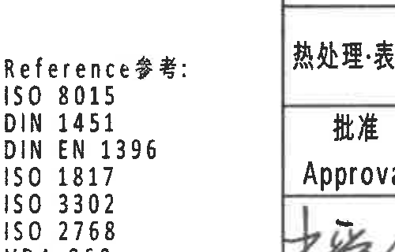

原图位置/视图名称：等轴测右下方 Reference 参考列表，bbox `[2380,2875,2880,3195]`。

| 提取项 | 原图数值或文本 | 含义说明 |
|---|---|---|
| Reference参考 | ISO 8015；DIN 1451；DIN EN 1396；ISO 1817；ISO 3302；ISO 2768；VDA 260；GADSL；Note-DPR-34184774 | 图纸引用标准和备注文件编号。 |

边界归属说明：裁切仅包含参考标准列表，不归入等轴测或标题栏。

## object_12 - DIN ISO 3302-1 M2 class 公差表

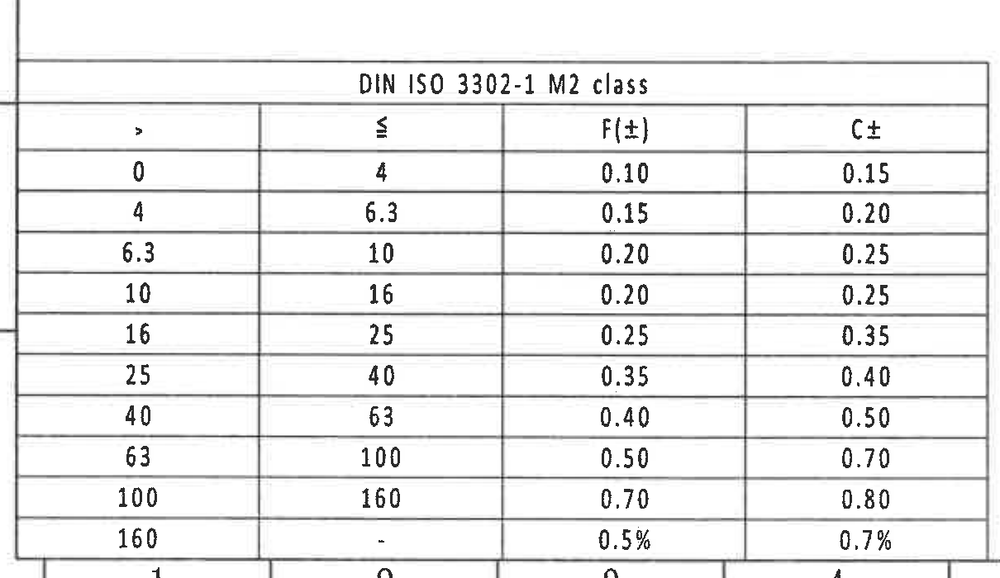

原图位置/视图名称：左下角公差表，bbox `[325,2675,1535,3375]`。

| > | ≤ | F(±) | C± |
|---:|---:|---:|---:|
| 0 | 4 | 0.10 | 0.15 |
| 4 | 6.3 | 0.15 | 0.20 |
| 6.3 | 10 | 0.20 | 0.25 |
| 10 | 16 | 0.20 | 0.25 |
| 16 | 25 | 0.25 | 0.35 |
| 25 | 40 | 0.35 | 0.40 |
| 40 | 63 | 0.40 | 0.50 |
| 63 | 100 | 0.50 | 0.70 |
| 100 | 160 | 0.70 | 0.80 |
| 160 | - | 0.5% | 0.7% |

| 提取项 | 原图数值或文本 | 含义说明 |
|---|---|---|
| 表题 | DIN ISO 3302-1 M2 class | 橡胶尺寸一般公差等级。 |
| F(±) | 0.10 到 0.70，末行 0.5% | F 类公差。 |
| C± | 0.15 到 0.80，末行 0.7% | C 类公差。 |

边界归属说明：表格外框、表题和所有行列完整；左侧少量图框线不属于公差表内容。

## object_14 - 物料明细/BOM 表

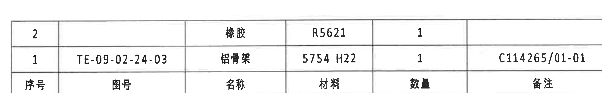

原图位置/视图名称：标题栏上部物料明细表，bbox `[2700,2430,4700,2740]`。

| 序号 | 图号 | 名称 | 材料 | 数量 | 备注 |
|---|---|---|---|---:|---|
| 2 |  | 橡胶 | R5621 | 1 |  |
| 1 | TE-09-02-24-03 | 铝骨架 | 5754 H22 | 1 | C114265/01-01 |

| 提取项 | 原图数值或文本 | 含义说明 |
|---|---|---|
| 橡胶 | R5621，数量 1 | 零件材料明细中的橡胶项。 |
| 铝骨架 | TE-09-02-24-03，5754 H22，数量 1，备注 C114265/01-01 | 零件材料明细中的铝骨架项。 |

边界归属说明：BOM 表位于标题栏上部，按原表行列还原；下方投影比例区不并入本表。

## object_13 - 右下标题栏完整区域

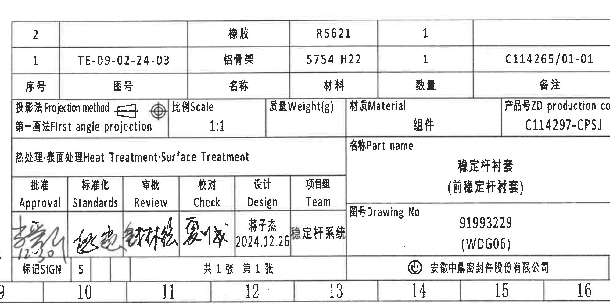

原图位置/视图名称：右下完整标题栏，bbox `[2700,2430,4700,3430]`。

| 提取项 | 原图数值或文本 | 含义说明 |
|---|---|---|
| Projection method | First angle projection | 第一角法投影。 |
| Scale | 1:1 | 图样比例。 |
| Weight(g) | 空 | 质量字段未填数值。 |
| Material | 组件 | 材质/组成字段。 |
| ZD production code | C114297-CPSJ | 产品号。 |
| Part name | 稳定杆衬套（前稳定杆衬套） | 零件名称。 |
| Drawing No | 91993229 (WDG06) | 图号。 |
| Heat Treatment/Surface Treatment | 空 | 热处理/表面处理字段未填具体值。 |
| Design | 蒋子杰 2024.12.26 | 设计人员与日期。 |
| Team | 稳定杆系统 | 项目组。 |
| Sheet | 共1张 第1张 | 页数信息。 |
| Company | 安徽中鼎密封件股份有限公司 | 图纸所属公司。 |

边界归属说明：标题栏完整包含 BOM、投影比例、名称、图号和签审信息；BOM 和审批表另以 object_14、object_15 单独还原。

## object_15 - 审批/签审表

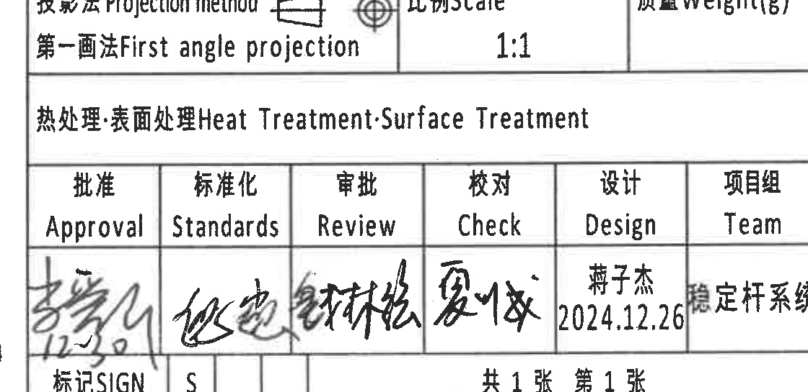

原图位置/视图名称：标题栏左下签审表，bbox `[2700,2780,3820,3325]`。

| 批准 Approval | 标准化 Standards | 审批 Review | 校对 Check | 设计 Design | 项目组 Team |
|---|---|---|---|---|---|
| 手写签名 | 手写签名 | 手写签名 | 手写签名 | 蒋子杰 / 2024.12.26 | 稳定杆系统 |

| 下栏字段 | 原图数值或文本 | 含义说明 |
|---|---|---|
| 标记 | 标记SIGN | 签名/标记栏。 |
| 标准化下栏 | S | 标准化栏下方标记。 |
| 页数 | 共1张 第1张 | 当前图纸页数。 |

边界归属说明：签审表为标题栏内独立表格，手写签名不做姓名推断；右侧名称/图号栏不并入本裁切。

## 裁切检查记录

| 对象 | 检查结果 | 边界/归属记录 |
|---|---|---|
| object_1 | 通过 | `ØEر0.3`、`(0.5)` 和中文引出说明完整；右侧未提取中间侧视图尺寸。 |
| object_2 | 通过 | `29.7±0.3`、A-A 剖切符号和“型号标识”完整；未混入 A-A 剖面内容。 |
| object_3 | 通过 | `(0.75)`、`(RIR)`、`(RAR)`、`A-A 1:1` 完整；未提取相邻视图尺寸。 |
| object_4 | 通过，带边缘残字 | B-B 剖面尺寸和标题完整；右下角相邻正视图说明残字不提取。 |
| object_5 | 通过，说明拆分 | 正视图本体和 B-B 剖切线完整；完整引出说明在 object_16。 |
| object_6 | 通过 | `42±0.3`、`54.9±0.3`、`60.9±0.3` 的尺寸线、箭头、文字完整。 |
| object_7 | 通过，带边缘残字 | 零件等轴测和 X/Y/Z 坐标完整；右侧 NOTES 残字不提取。 |
| object_8 | 通过 | 右上变更表表头、有效记录行和空白行完整。 |
| object_9 | 通过 | 参数表表头、合并单元格和全部变型行完整；未带入下方视图。 |
| object_10 | 通过 | NOTES 1-8 条完整，右侧长句未截断。 |
| object_11 | 通过 | Reference 列表完整。 |
| object_12 | 通过 | 公差表表题、表头和全部行完整；左侧图框线不作为表格内容。 |
| object_13 | 通过 | 标题栏完整区域包含 BOM、投影、名称、图号、签审和公司信息。 |
| object_14 | 通过 | BOM 表头和两行物料完整。 |
| object_15 | 通过 | 审批/签审表主要行列完整，手写签名保留为图像并文字标注为手写签名。 |
| object_16 | 通过 | 右上正视图引出说明完整；B-B 剖切线底部残段仅作定位，不提取为尺寸。 |
