# 20C114298 PDF 内容识别

源文件: `input/20C114298.pdf`  
整页 PNG: `outputs/20C114298_assets/images/page_1.png`  
页数: 1; 渲染尺寸: 4959 x 3505 px。

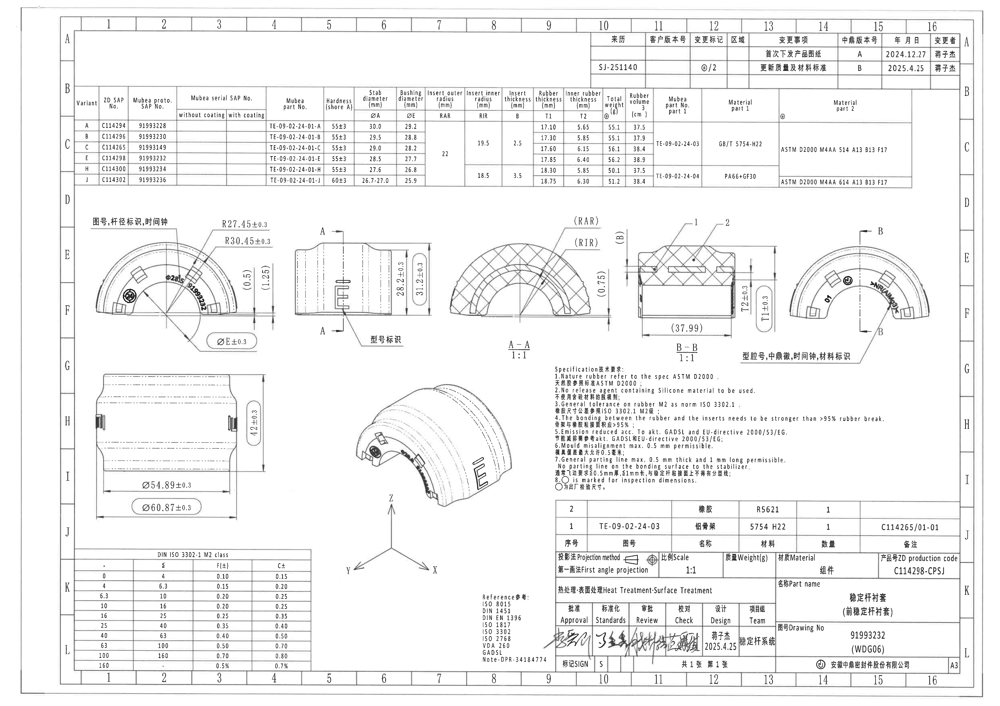

说明: 本 PDF 为扫描图, 无可提取文本层。以下内容按整页 PNG 的图面结构逐块裁切、放大检查后转写。括号内尺寸按参考尺寸记录, 未忽略。

## object_1 - 上方右侧修订履历表

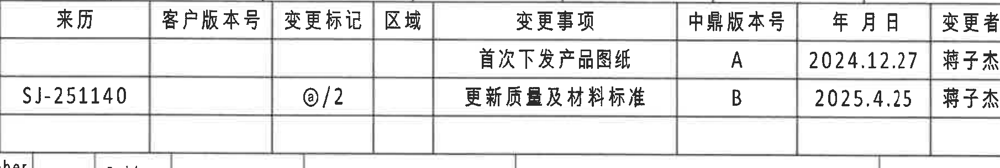

- 原图位置/视图名称: page 1, bbox `[2930, 160, 4740, 465]`, 上方右侧修订履历表。

原表还原:

| 来源 | 客户版本号 | 变更标记 | 区域 | 变更事项 | 中鼎版本号 | 年 月 日 | 变更者 |
| --- | --- | --- | --- | --- | --- | --- | --- |
|  |  |  |  | 首次下发产品图纸 | A | 2024.12.27 | 蒋子杰 |
| SJ-251140 |  | @/2 |  | 更新质量及材料标准 | B | 2025.4.25 | 蒋子杰 |

提取表格:

| 提取项 | 原图数值或文本 | 含义说明 |
| --- | --- | --- |
| 变更事项 / A版 | 首次下发产品图纸; A; 2024.12.27; 蒋子杰 | 首次发布产品图纸的修订记录。 |
| 来源与变更标记 / B版 | SJ-251140; @/2; 更新质量及材料标准; B; 2025.4.25; 蒋子杰 | 第二条记录, 标明按来源 SJ-251140 更新质量及材料标准。 |

边界归属说明: 右边界收至变更者列右侧, 排除图框坐标 A/B; 下方参数表线残片不属于本表。

## object_2 - 上方产品/变体参数明细表

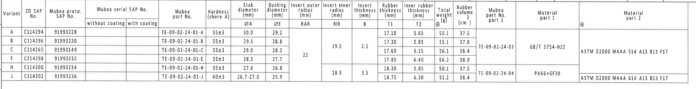

- 原图位置/视图名称: page 1, bbox `[360, 430, 4570, 970]`, 横向产品/变体参数明细表。

原表还原:

| Variant | ZD SAP No. | Mubea proto. SAP No. | Mubea serial SAP No. without coating | Mubea serial SAP No. with coating | Mubea part No. | Hardness (shore A) | Stab diameter ØA (mm) | Bushing diameter ØE (mm) | Insert outer radius RAR (mm) | Insert inner radius RIR (mm) | Insert thickness B (mm) | Rubber thickness T1 (mm) | Inner rubber thickness T2 (mm) | Total weight @ (g) | Rubber volume (cm³) | Mubea part No. part 1 | Material part 1 | Material part 2 @ |
| --- | --- | --- | --- | --- | --- | --- | --- | --- | --- | --- | --- | --- | --- | --- | --- | --- | --- | --- |
| A | C114294 | 91993228 |  |  | TE-09-02-24-01-A | 55±3 | 30.0 | 29.2 | 22 | 19.5 | 2.5 | 17.10 | 5.65 | 55.1 | 37.5 | TE-09-02-24-03 | GB/T 5754-H22 | ASTM D2000 M4AA 514 A13 B13 F17 |
| B | C114296 | 91993230 |  |  | TE-09-02-24-01-B | 55±3 | 29.5 | 28.8 | 22 | 19.5 | 2.5 | 17.30 | 5.85 | 55.1 | 37.9 | TE-09-02-24-03 | GB/T 5754-H22 | ASTM D2000 M4AA 514 A13 B13 F17 |
| C | C114265 | 91993149 |  |  | TE-09-02-24-01-C | 55±3 | 29.0 | 28.2 | 22 | 19.5 | 2.5 | 17.60 | 6.15 | 56.1 | 38.4 | TE-09-02-24-03 | GB/T 5754-H22 | ASTM D2000 M4AA 514 A13 B13 F17 |
| E | C114298 | 91993232 |  |  | TE-09-02-24-01-E | 55±3 | 28.5 | 27.7 | 22 | 19.5 | 2.5 | 17.85 | 6.40 | 56.2 | 38.9 | TE-09-02-24-03 | GB/T 5754-H22 | ASTM D2000 M4AA 514 A13 B13 F17 |
| H | C114300 | 91993234 |  |  | TE-09-02-24-01-H | 55±3 | 27.6 | 26.8 | 22 | 18.5 | 3.5 | 18.30 | 5.85 | 50.1 | 37.5 | TE-09-02-24-04 | PA66+GF30 | ASTM D2000 M4AA 614 A13 B13 F17 |
| J | C114302 | 91993236 |  |  | TE-09-02-24-01-J | 60±3 | 26.7-27.0 | 25.9 | 22 | 18.5 | 3.5 | 18.75 | 6.30 | 51.2 | 38.4 | TE-09-02-24-04 | PA66+GF30 | ASTM D2000 M4AA 614 A13 B13 F17 |

提取表格:

| 提取项 | 原图数值或文本 | 含义说明 |
| --- | --- | --- |
| ØA | A 30.0; B 29.5; C 29.0; E 28.5; H 27.6; J 26.7-27.0 | 稳定杆杆径/杆径标识对应的变体值。 |
| ØE | A 29.2; B 28.8; C 28.2; E 27.7; H 26.8; J 25.9 | 衬套直径符号, 在端面主视图中以 ØE±0.3 标出。 |
| RAR / RIR | RAR 22; RIR A/B/C/E=19.5, H/J=18.5 | 插入件外半径与内半径, 在 A-A 剖面以 (RAR)/(RIR) 标出。 |
| B | A/B/C/E=2.5; H/J=3.5 | Insert thickness, 在 A-A 剖面以 (B) 标出。 |
| T1 / T2 | T1 17.10/17.30/17.60/17.85/18.30/18.75; T2 5.65/5.85/6.15/6.40/5.85/6.30 | 橡胶厚度与内橡胶厚度, 在 B-B 剖面以 T1±0.3/T2±0.3 标出。 |
| 材料 | part 1: GB/T 5754-H22 或 PA66+GF30; part 2: ASTM D2000 M4AA 514 A13 B13 F17 或 ASTM D2000 M4AA 614 A13 B13 F17 | 按变体分组给出的材料字段。 |

边界归属说明: 裁切包含完整表头、所有变体行和右侧材料列; 周围图框坐标和下方视图不属于本表。

## object_3 - 左中端面主视图

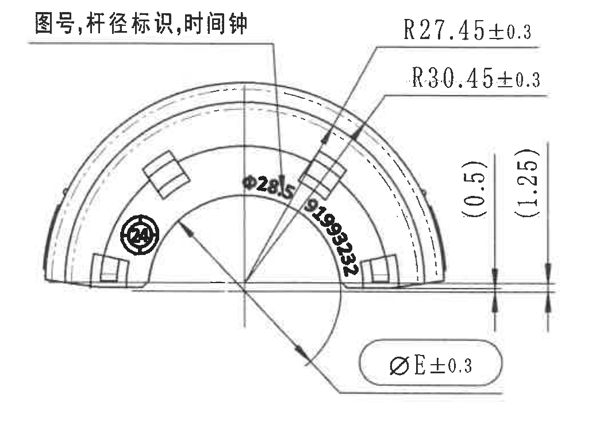

- 原图位置/视图名称: page 1, bbox `[400, 1060, 1430, 1800]`, 端面主视图: 图号、杆径标识、时间钟。

| 提取项 | 原图数值或文本 | 含义说明 |
| --- | --- | --- |
| 半径尺寸 | R27.45±0.3 | 内侧/局部圆弧半径控制尺寸。 |
| 半径尺寸 | R30.45±0.3 | 外侧圆弧半径控制尺寸。 |
| 参考尺寸 | (0.5) | 括号参考尺寸, 位于右侧竖向尺寸线内侧。 |
| 参考尺寸 | (1.25) | 括号参考尺寸, 位于右侧竖向尺寸线外侧。 |
| 直径符号尺寸 | ØE±0.3 | 衬套直径; 实际 ØE 值见 object_2 变体表。 |
| 标识 | Ø28.5 | 杆径标识; 对应本图 C114298/E 变体的 ØA=28.5。 |
| 标识 | 91993232 | 图号/曲面标识, 与标题栏 Drawing No 对应。 |
| 标识 | 时间钟符号 | 用于模具时间/生产追溯标识。 |

边界归属说明: 右侧未纳入 object_4 侧视图; 底部 ØE 引出线完整保留, 仅提取本端面视图的尺寸和标识。

## object_4 - 中部侧视图

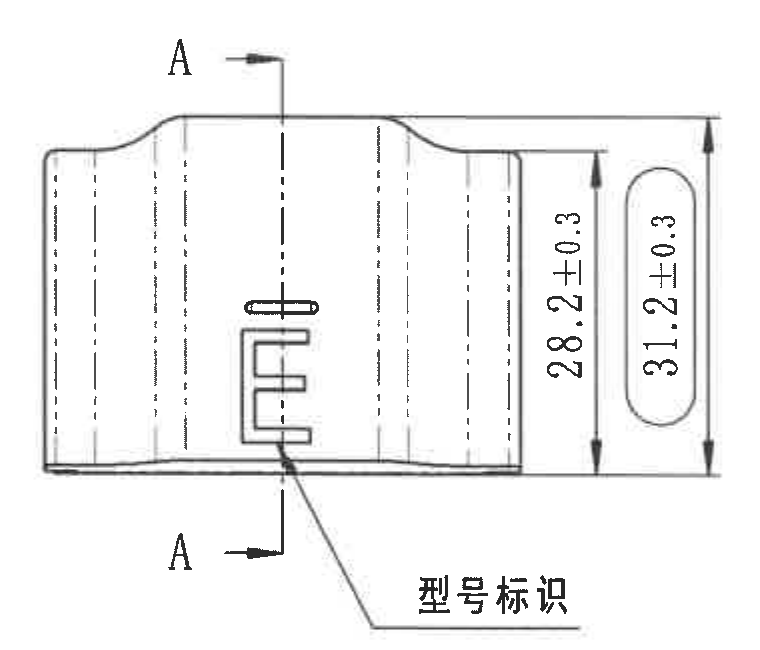

- 原图位置/视图名称: page 1, bbox `[1420, 1090, 2180, 1740]`, 侧视图及 A-A 剖切位置。

| 提取项 | 原图数值或文本 | 含义说明 |
| --- | --- | --- |
| 高度尺寸 | 28.2±0.3 | 侧视图局部高度/内侧高度尺寸。 |
| 总高度尺寸 | 31.2±0.3 | 侧视图外包络总高度尺寸。 |
| 剖切基准 | A-A | 上下箭头标出 A-A 剖切位置, 对应 object_5。 |
| 标识 | 型号标识 | 引出线指向侧面型号标识位置。 |

边界归属说明: 右侧已重裁去掉 A-A 剖面弧边; 本对象只提取侧视图内的尺寸、A-A 剖切线和型号标识。

## object_5 - 剖面 A-A 1:1

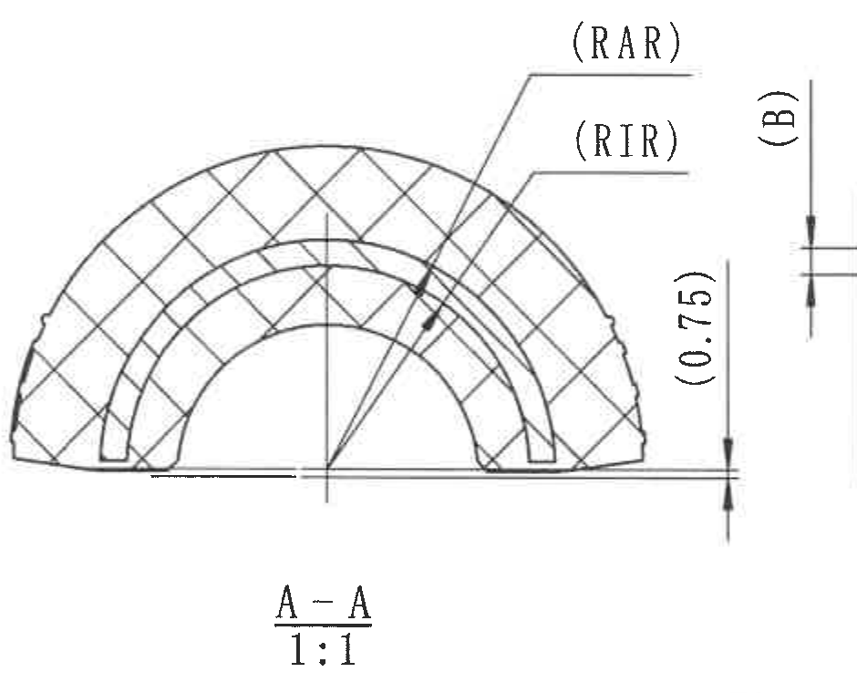

- 原图位置/视图名称: page 1, bbox `[2220, 1050, 3160, 1810]`, A-A 剖面。

| 提取项 | 原图数值或文本 | 含义说明 |
| --- | --- | --- |
| 剖面标识 | A-A; 1:1 | 剖面 A-A, 比例 1:1。 |
| 参考/符号半径 | (RAR) | Insert outer radius, 实际值按 object_2: RAR=22。 |
| 参考/符号半径 | (RIR) | Insert inner radius, 实际值按 object_2: A/B/C/E=19.5, H/J=18.5。 |
| 参考/符号厚度 | (B) | Insert thickness, 实际值按 object_2: A/B/C/E=2.5, H/J=3.5。 |
| 参考尺寸 | (0.75) | 括号参考尺寸, 位于右侧竖向尺寸线上。 |

边界归属说明: 右缘短水平线为邻接 B-B 尺寸线残片, 不归入 A-A; (B) 与 (0.75) 完整保留。

## object_6 - 剖面 B-B 1:1

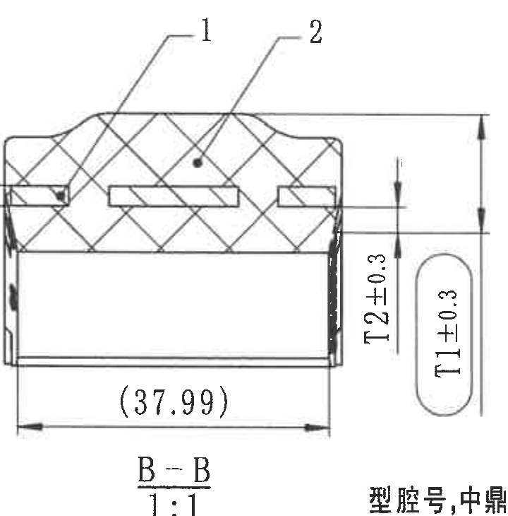

- 原图位置/视图名称: page 1, bbox `[3160, 1060, 3880, 1790]`, B-B 剖面。

| 提取项 | 原图数值或文本 | 含义说明 |
| --- | --- | --- |
| 剖面标识 | B-B; 1:1 | 剖面 B-B, 比例 1:1。 |
| 零件序号 | 1 | 引出至剖面中的插入/骨架件; 对应 BOM 序号 1: TE-09-02-24-03, 铝骨架。 |
| 零件序号 | 2 | 引出至橡胶体; 对应 BOM 序号 2: 橡胶 R5621。 |
| 厚度尺寸 | T2±0.3 | Inner rubber thickness; 实际值按 object_2: A 5.65, B 5.85, C 6.15, E 6.40, H 5.85, J 6.30。 |
| 厚度尺寸 | T1±0.3 | Rubber thickness; 实际值按 object_2: A 17.10, B 17.30, C 17.60, E 17.85, H 18.30, J 18.75。 |
| 参考长度 | (37.99) | 括号参考尺寸, 表示横向长度参考值。 |

边界归属说明: 右下中文残片来自 object_7 端面说明, 不提取到 B-B; T1/T2 和 (37.99) 的尺寸线与文字完整。

## object_7 - 右中端面视图

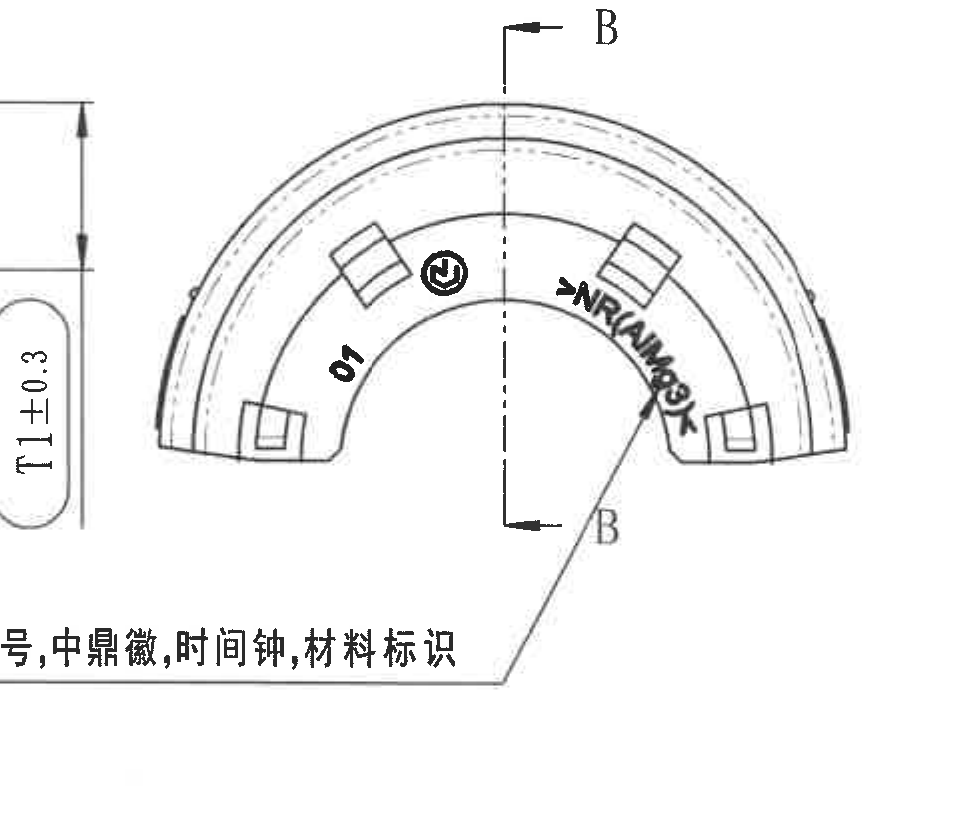

- 原图位置/视图名称: page 1, bbox `[3760, 1120, 4740, 1950]`, 端面视图: 型腔号、中鼎徽、时间钟、材料标识。

| 提取项 | 原图数值或文本 | 含义说明 |
| --- | --- | --- |
| 剖切基准 | B-B | 上下 B 标识和箭头, 对应 object_6。 |
| 型腔号 | 01 | 端面型腔号/腔位标识。 |
| 标识 | 中鼎徽 | 圆形中鼎徽标。 |
| 标识 | 时间钟符号 | 用于生产时间追溯。 |
| 材料标识 | >NR/AM69K | 按高分辨率放大读取的曲面材料标识。 |
| 引出说明 | 型腔号,中鼎徽,时间钟,材料标识 | 说明引出线所指标识类型。 |

边界归属说明: 左侧可见 B-B 的 T1±0.3 残片, 归属 object_6; 本视图不提取该残片。

## object_8 - 左下展开/纵向视图

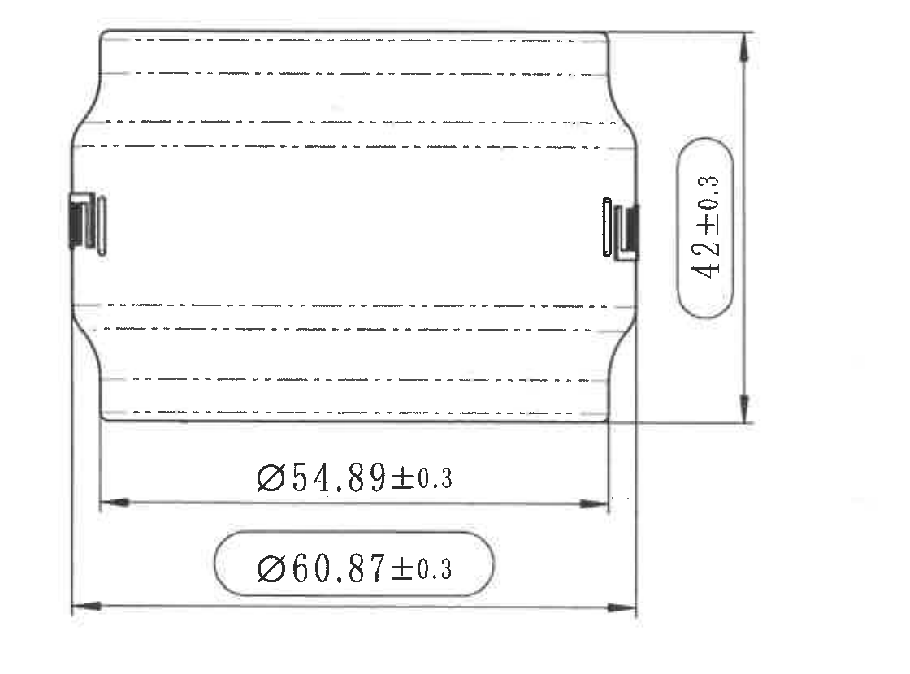

- 原图位置/视图名称: page 1, bbox `[390, 1820, 1510, 2650]`, 左下展开/纵向视图。

| 提取项 | 原图数值或文本 | 含义说明 |
| --- | --- | --- |
| 总高度 | 42±0.3 | 竖向总高度控制尺寸。 |
| 直径尺寸 | Ø54.89±0.3 | 内侧直径/宽度控制尺寸。 |
| 直径尺寸 | Ø60.87±0.3 | 外侧直径/总宽度控制尺寸。 |

边界归属说明: 视图三组尺寸线和文字完整; 未混入下方 DIN 公差表或中部等轴测视图。

## object_9 - 中下等轴测视图

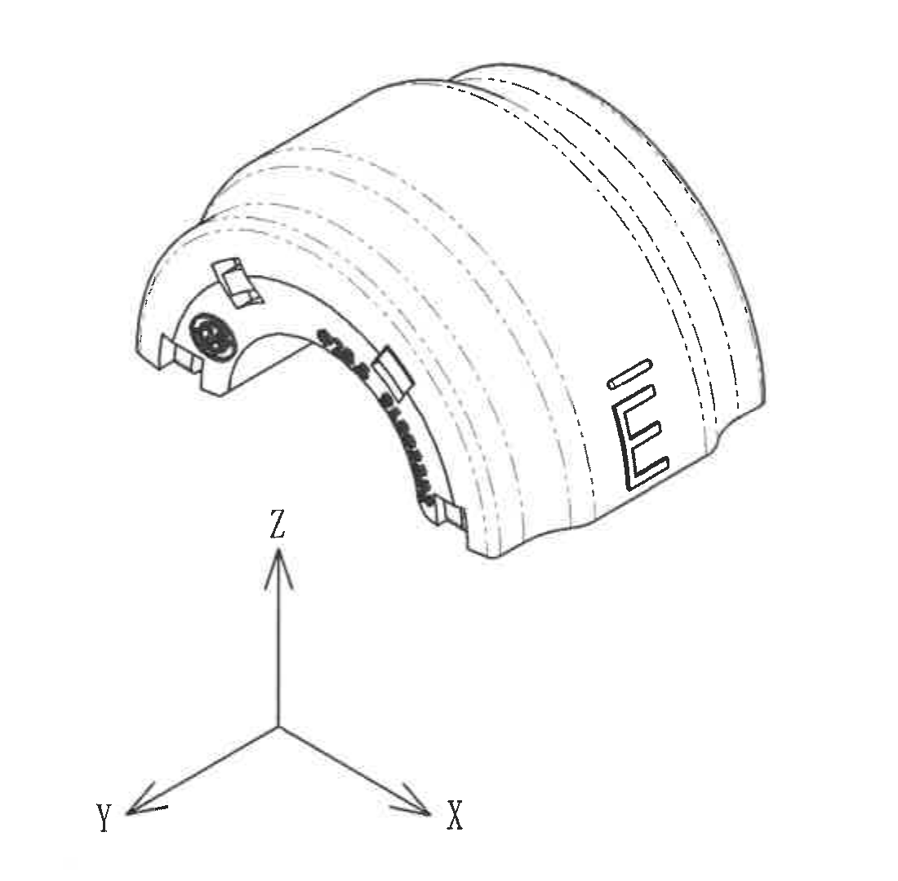

- 原图位置/视图名称: page 1, bbox `[1600, 1830, 2700, 2910]`, 等轴测视图与坐标方向。

| 提取项 | 原图数值或文本 | 含义说明 |
| --- | --- | --- |
| 坐标方向 | X, Y, Z | 零件三维方向指示。 |
| 可见标识 | 中鼎徽、曲面材料/图号标识、侧面型号标识 | 展示标识在三维外形上的分布。 |
| 尺寸数值 | 无独立尺寸数值 | 该视图用于表达形状和方向, 未给出单独尺寸。 |

边界归属说明: 已排除上方 B-B 比例标注和右侧 NOTES; 坐标轴属于本等轴测视图。

## object_10 - Specification 技术要求 NOTES

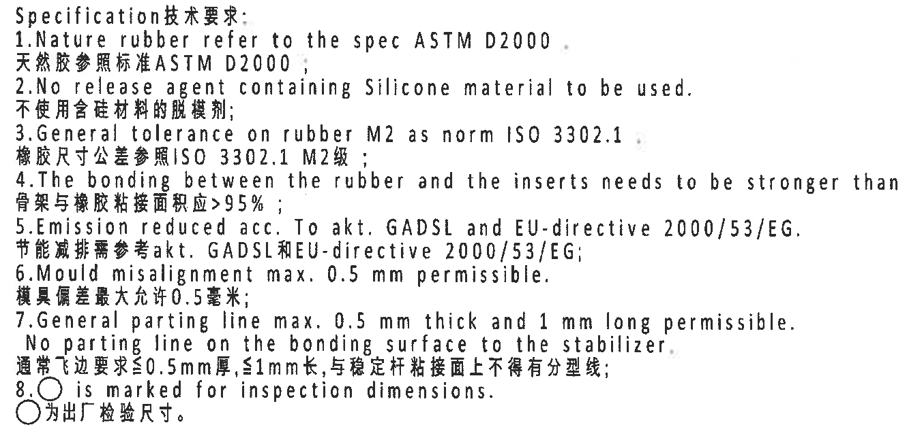

- 原图位置/视图名称: page 1, bbox `[2730, 1810, 4060, 2460]`, Specification 技术要求。

| 序号 | 原图文本 | 含义说明 |
| --- | --- | --- |
| 1 | Nature rubber refer to the spec ASTM D2000. / 天然胶参照标准ASTM D2000； | 天然橡胶材料标准依据 ASTM D2000。 |
| 2 | No release agent containing Silicone material to be used. / 不使用含硅材料的脱模剂； | 禁止使用含硅脱模剂。 |
| 3 | General tolerance on rubber M2 as norm ISO 3302.1. / 橡胶尺寸公差参照ISO 3302.1 M2级； | 橡胶一般公差采用 ISO 3302.1 M2。 |
| 4 | The bonding between the rubber and the inserts needs to be stronger than 95% rubber break. / 骨架与橡胶粘接面积应>95%； | 骨架与橡胶粘接破坏/覆盖要求大于 95%。 |
| 5 | Emission reduced acc. To akt. GADSL and EU-directive 2000/53/EG. / 节能减排需参考akt. GADSL和EU-directive 2000/53/EG； | 排放/材料法规参考 GADSL 与 EU 2000/53/EG。 |
| 6 | Mould misalignment max. 0.5 mm permissible. / 模具偏差最大允许0.5毫米； | 模具错位最大允许 0.5 mm。 |
| 7 | General parting line max. 0.5 mm thick and 1 mm long permissible. No parting line on the bonding surface to the stabilizer. / 通常飞边要求≤0.5mm厚,≤1mm长,与稳定杆粘接面上不得有分型线； | 飞边/分型线限制及粘接面不得有分型线。 |
| 8 | ○ is marked for inspection dimensions. / ○为出厂检验尺寸。 | 圆圈标识表示出厂检验尺寸。 |

边界归属说明: 下边界已排除 BOM 表, 左侧不包含等轴测视图。

## object_11 - 左下 DIN ISO 3302-1 M2 class 公差表

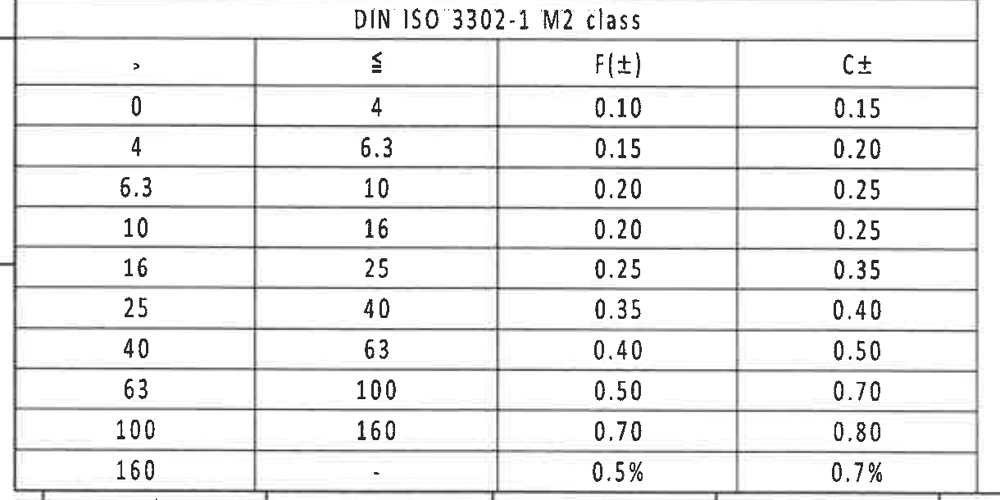

- 原图位置/视图名称: page 1, bbox `[350, 2730, 1570, 3340]`, DIN ISO 3302-1 M2 class 橡胶公差表。

原表还原:

| > | ≤ | F(±) | C± |
| --- | --- | --- | --- |
| 0 | 4 | 0.10 | 0.15 |
| 4 | 6.3 | 0.15 | 0.20 |
| 6.3 | 10 | 0.20 | 0.25 |
| 10 | 16 | 0.20 | 0.25 |
| 16 | 25 | 0.25 | 0.35 |
| 25 | 40 | 0.35 | 0.40 |
| 40 | 63 | 0.40 | 0.50 |
| 63 | 100 | 0.50 | 0.70 |
| 100 | 160 | 0.70 | 0.80 |
| 160 | - | 0.5% | 0.7% |

提取表格:

| 提取项 | 原图数值或文本 | 含义说明 |
| --- | --- | --- |
| 表名 | DIN ISO 3302-1 M2 class | 橡胶一般尺寸公差等级。 |
| 列 | >, ≤, F(±), C± | 按尺寸区间给出 F 与 C 类允许偏差。 |
| 最后一行 | 160 -; F(±)=0.5%; C±=0.7% | 大于 160 的百分比公差。 |

边界归属说明: 包含表格完整外框和最后一行; 底部图框线/坐标痕迹不作为表内容。

## object_12 - Reference 参考标准列表

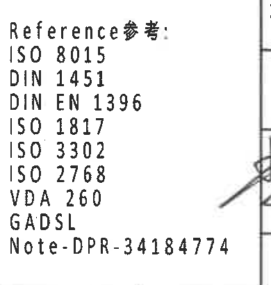

- 原图位置/视图名称: page 1, bbox `[2380, 2920, 2770, 3330]`, Reference 参考。

| 提取项 | 原图数值或文本 | 含义说明 |
| --- | --- | --- |
| 标题 | Reference参考: | 参考标准列表标题。 |
| 标准 | ISO 8015 | 参考标准。 |
| 标准 | DIN 1451 | 参考标准。 |
| 标准 | DIN EN 1396 | 参考标准。 |
| 标准 | ISO 1817 | 参考标准。 |
| 标准 | ISO 3302 | 参考标准。 |
| 标准 | ISO 2768 | 参考标准。 |
| 标准 | VDA 260 | 参考标准。 |
| 法规/清单 | GADSL | 参考法规/清单。 |
| 备注 | Note-DPR-34184774 | 图面备注编号。 |

边界归属说明: 右侧竖线和签名笔迹残片属于标题栏邻接区域, 不纳入参考标准列表。

## object_13 - 右下 BOM/明细表

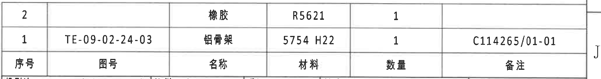

- 原图位置/视图名称: page 1, bbox `[2750, 2475, 4810, 2750]`, BOM/明细表。原图中表头位于数据行下方, 下表按原图从上到下的数据行顺序列出。

原表还原:

| 序号 | 图号 | 名称 | 材料 | 数量 | 备注 |
| --- | --- | --- | --- | --- | --- |
| 2 |  | 橡胶 | R5621 | 1 |  |
| 1 | TE-09-02-24-03 | 铝骨架 | 5754 H22 | 1 | C114265/01-01 |

提取表格:

| 提取项 | 原图数值或文本 | 含义说明 |
| --- | --- | --- |
| 序号 2 | 橡胶; R5621; 数量 1 | 橡胶件物料。 |
| 序号 1 | TE-09-02-24-03; 铝骨架; 5754 H22; 数量 1; C114265/01-01 | 铝骨架物料及备注。 |

边界归属说明: 下方标题栏已另裁为 object_14; 右侧图框坐标 J 不作为 BOM 字段。

## object_14 - 右下标题栏

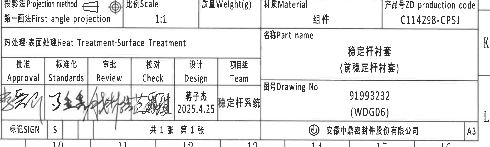

- 原图位置/视图名称: page 1, bbox `[2750, 2750, 4810, 3370]`, 标题栏。

标题栏字段还原:

| 字段 | 原图文本/数值 |
| --- | --- |
| 投影法 Projection method | 第一画法 First angle projection |
| 比例 Scale | 1:1 |
| 质量 Weight(g) |  |
| 材质 Material | 组件 |
| 产品号 ZD production code | C114298-CPSJ |
| 热处理:表面处理 Heat Treatment·Surface Treatment |  |
| 名称 Part name | 稳定杆衬套 (前稳定杆衬套) |
| 图号 Drawing No | 91993232 (WDG06) |
| 批准 Approval | 签名 |
| 标准化 Standards | 签名 |
| 审批 Review | 签名 |
| 校对 Check | 签名 |
| 设计 Design | 蒋子杰 2025.4.25 |
| 项目组 Team | 稳定杆系统 |
| 标记 SIGN | S |
| 张数 | 共 1 张 第 1 张 |
| 公司 | 安徽中鼎密封件股份有限公司 |
| 图幅 | A3 |

提取表格:

| 提取项 | 原图数值或文本 | 含义说明 |
| --- | --- | --- |
| 图纸号 | 91993232 (WDG06) | 标题栏 Drawing No。 |
| 产品号 | C114298-CPSJ | ZD production code。 |
| 零件名称 | 稳定杆衬套 (前稳定杆衬套) | Part name。 |
| 比例 | 1:1 | 图纸比例。 |
| 投影法 | 第一画法 First angle projection | 投影方式。 |
| 设计 | 蒋子杰 2025.4.25 | 设计签署信息。 |
| 图幅 | A3 | 图纸幅面。 |

边界归属说明: 上方 BOM 为 object_13; 底部图框坐标数字边缘为邻接图框残片, 不作为标题栏字段。

## 裁切检查记录

| 对象 | 检查对象 | 完整性/边界检查结论 |
| --- | --- | --- |
| page_1 | outputs/20C114298_assets/images/page_1.png | 完整整页 PNG, 4959x3505。 |
| object_1 | 修订履历表 | 表头、两条记录完整; 右侧图框坐标已排除, 下方参数表线残片不提取。 |
| object_2 | 产品/变体参数表 | 表头、所有变体行、材料列完整; 未混入下方视图。 |
| object_3 | 端面主视图 | R27.45/R30.45、(0.5)/(1.25)、ØE±0.3、标识文字完整; 未混入侧视图。 |
| object_4 | 侧视图 | 28.2±0.3、31.2±0.3、A-A 剖切线和型号标识完整; 已重裁去掉相邻 A-A 剖面片段。 |
| object_5 | A-A 剖面 | (RAR)/(RIR)/(B)/(0.75) 和 A-A 1:1 完整; 右侧相邻尺寸线残片不提取。 |
| object_6 | B-B 剖面 | T1±0.3、T2±0.3、(37.99)、零件序号和 B-B 1:1 完整; 右下端面说明残片不提取。 |
| object_7 | 右端面视图 | B-B 剖切线、01、中鼎徽、时间钟、材料标识和引出说明完整; 左侧 T1±0.3 残片归属 object_6。 |
| object_8 | 左下视图 | 42±0.3、Ø54.89±0.3、Ø60.87±0.3 尺寸线和文字完整。 |
| object_9 | 等轴测视图 | 零件外形与 X/Y/Z 坐标轴完整; 已排除 NOTES。 |
| object_10 | NOTES | 1-8 条中英文技术要求完整; 未带入下方 BOM。 |
| object_11 | DIN ISO 3302-1 M2 公差表 | 表格外框、表头和最后一行完整; 底部图框线不提取。 |
| object_12 | Reference 参考 | 标题、所有参考标准和 Note-DPR-34184774 完整; 右侧签名残片不提取。 |
| object_13 | BOM 明细表 | 两条物料行和表头完整; 下方标题栏另归 object_14。 |
| object_14 | 标题栏 | 投影法、比例、产品号、名称、图号、签名栏、公司和 A3 行完整; 底部图框坐标残片不提取。 |
