# 20C114299 图纸内容识别

PDF 已渲染为整页 PNG：`outputs/20C114299_assets/images/page_1.png`。以下按原图从上到下、从左到右的结构列出裁切对象；尺寸、参考尺寸、T 编号、公差、表格字段和边界归属均按各裁切对象分别记录。

## object_1 修订履历表

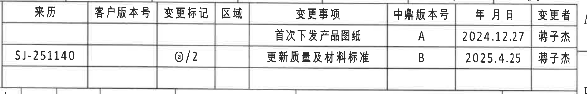

- 原图位置/视图名称：第 1 页上方右侧修订履历表，bbox `[2920, 160, 4790, 460]`。

### 表格还原

| 来历 | 客户版本号 | 变更标记 | 区域 | 变更事项 | 中鼎版本号 | 年 月 日 | 变更者 |
|---|---|---|---|---|---|---|---|
|  |  |  |  | 首次下发产品图纸 | A | 2024.12.27 | 蒋子杰 |
| SJ-251140 |  | @/2 |  | 更新质量及材料标准 | B | 2025.4.25 | 蒋子杰 |

### 提取表格

| 提取项 | 原图数值或文本 | 含义说明 |
|---|---|---|
| 首次发布记录 | 首次下发产品图纸 / A / 2024.12.27 / 蒋子杰 | 图纸首次下发版本为中鼎版本 A。 |
| 更新记录 | SJ-251140 / @/2 / 更新质量及材料标准 / B / 2025.4.25 / 蒋子杰 | 本次更新与质量及材料标准有关，版本升为 B。 |

### 边界归属说明

裁切只包含右上角修订表外框及其行列内容；下方参数表、右侧图框坐标字母不作为本对象内容提取。

## object_2 变量/参数表

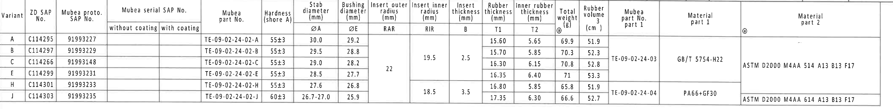

- 原图位置/视图名称：第 1 页上方横向变量、尺寸和材料参数表，bbox `[370, 440, 4580, 955]`。

### 表格还原

| Variant | ZD SAP No. | Mubea proto. SAP No. | Mubea serial SAP No. without coating | Mubea serial SAP No. with coating | Mubea part No. | Hardness (shore A) | Stab diameter ØA (mm) | Bushing diameter ØE (mm) | Insert outer radius RAR (mm) | Insert inner radius RIR (mm) | Insert thickness B (mm) | Rubber thickness T1 (mm) | Inner rubber thickness T2 (mm) | Total weight (g) | Rubber volume (cm3) | Mubea part No. part 1 | Material part 1 | Material part 2 |
|---|---|---|---|---|---|---|---:|---:|---:|---:|---:|---:|---:|---:|---:|---|---|---|
| A | C114295 | 91993227 |  |  | TE-09-02-24-02-A | 55±3 | 30.0 | 29.2 | 22 | 19.5 | 2.5 | 15.60 | 5.65 | 69.9 | 51.9 |  |  | -- |
| B | C114297 | 91993229 |  |  | TE-09-02-24-02-B | 55±3 | 29.5 | 28.8 | 22 | 19.5 | 2.5 | 15.70 | 5.85 | 70.3 | 52.3 | TE-09-02-24-03 | GB/T 5754-H22 | ASTM D2000 M4AA 514 A13 B13 F17 |
| C | C114266 | 91993148 |  |  | TE-09-02-24-02-C | 55±3 | 29.0 | 28.2 | 22 | 19.5 | 2.5 | 16.30 | 6.15 | 70.8 | 52.8 | TE-09-02-24-03 | GB/T 5754-H22 | ASTM D2000 M4AA 514 A13 B13 F17 |
| E | C114299 | 91993231 |  |  | TE-09-02-24-02-E | 55±3 | 28.5 | 27.7 | 22 | 19.5 | 2.5 | 16.35 | 6.40 | 71 | 53.3 | TE-09-02-24-03 | GB/T 5754-H22 | ASTM D2000 M4AA 514 A13 B13 F17 |
| H | C114301 | 91993233 |  |  | TE-09-02-24-02-H | 55±3 | 27.6 | 26.8 | 22 | 18.5 | 3.5 | 16.80 | 5.85 | 65.8 | 51.9 | TE-09-02-24-04 | PA66+GF30 | ASTM D2000 M4AA 614 A13 B13 F17 |
| J | C114303 | 91993235 |  |  | TE-09-02-24-02-J | 60±3 | 26.7-27.0 | 25.9 | 22 | 18.5 | 3.5 | 17.35 | 6.30 | 66.6 | 52.7 | TE-09-02-24-04 | PA66+GF30 | ASTM D2000 M4AA 614 A13 B13 F17 |

### 提取表格

| 提取项 | 原图数值或文本 | 含义说明 |
|---|---|---|
| 本图对应变型 | Variant E / ZD SAP No. C114299 / Mubea proto. SAP No. 91993231 / Mubea part No. TE-09-02-24-02-E | 标题栏产品号 C114299-CPSJ 与参数表 E 行对应。 |
| 硬度 | 55±3 shore A | E 行橡胶硬度公差。 |
| ØA | 28.5 mm | 稳定杆直径；与左端视图中的杆径标识 28.5 对应。 |
| ØE | 27.7 mm | 衬套内径/孔径相关尺寸；左端视图以 ØE 标注。 |
| RAR | 22 mm | Insert outer radius，A-A 剖面中外侧插入件圆弧半径。 |
| RIR | 19.5 mm | Insert inner radius，A-A 剖面中内侧插入件圆弧半径。 |
| B | 2.5 mm | Insert thickness，B-B 剖面中的 B 变量厚度。 |
| T1 | 16.35 mm | Rubber thickness，B-B 剖面中 T1 尺寸的 E 行名义值。 |
| T2 | 6.40 mm | Inner rubber thickness，B-B 剖面中 T2 尺寸的 E 行名义值。 |
| 总重 | 71 g | E 行总重量。 |
| 橡胶体积 | 53.3 cm3 | E 行橡胶体积。 |
| part 1 | TE-09-02-24-03 / GB/T 5754-H22 | E 行骨架/材料 part 1。 |
| part 2 | ASTM D2000 M4AA 514 A13 B13 F17 | E 行橡胶材料标准。 |

### 边界归属说明

该对象为上方完整参数表；表内 ØA、ØE、RAR、RIR、B、T1、T2 是后续视图标注的变量来源。下方各加工视图的线条不属于本表。

## object_3 左端主视图

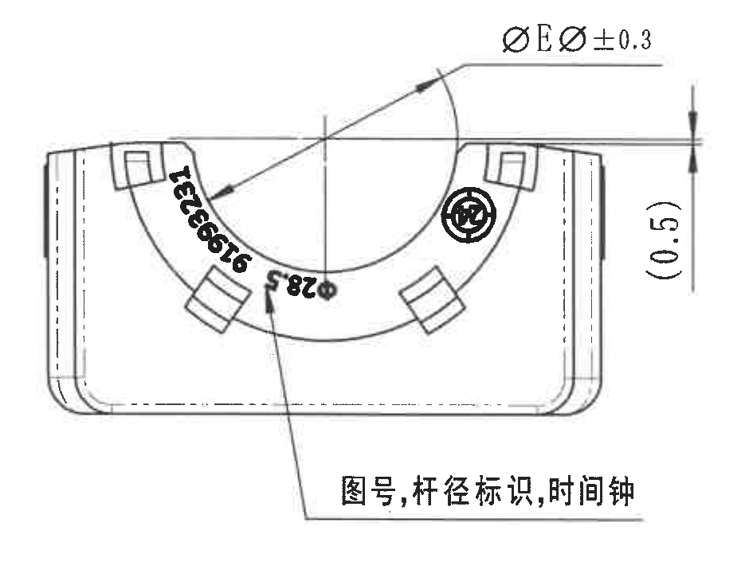

- 原图位置/视图名称：第 1 页中部左侧端面主视图，bbox `[400, 990, 1340, 1710]`。

### 提取表格

| 提取项 | 原图数值或文本 | 含义说明 |
|---|---|---|
| 直径标注 | ØEر0.3 | 以直径符号标注的孔/衬套内径尺寸，E 值来自参数表；±0.3 为该视图给出的尺寸公差。 |
| 参考尺寸 | (0.5) | 括号尺寸为参考尺寸，用于说明上边缘附近局部高度/间隙，不作为直接控制尺寸。 |
| 图号标识 | 91993231 | 模压或刻印在弧面上的图号标识。 |
| 杆径标识 | 28.5 | 与参数表 E 行 ØA=28.5 对应，用于标识适配稳定杆直径。 |
| 时间钟/徽标 | 圆形钟形标识 | 图面引出说明为“图号,杆径标识,时间钟”，该圆形符号用于时间钟或识别标识。 |
| 引出文字 | 图号,杆径标识,时间钟 | 说明弧面文字和圆形符号的功能。 |

### 边界归属说明

该裁切包含左端主视图完整外形、圆弧、直径尺寸线、箭头及右侧 `(0.5)` 参考尺寸。左端视图右侧的侧视图和 A-A 剖面标注不归入本对象。

## object_4 侧视图及 A-A 剖切位置

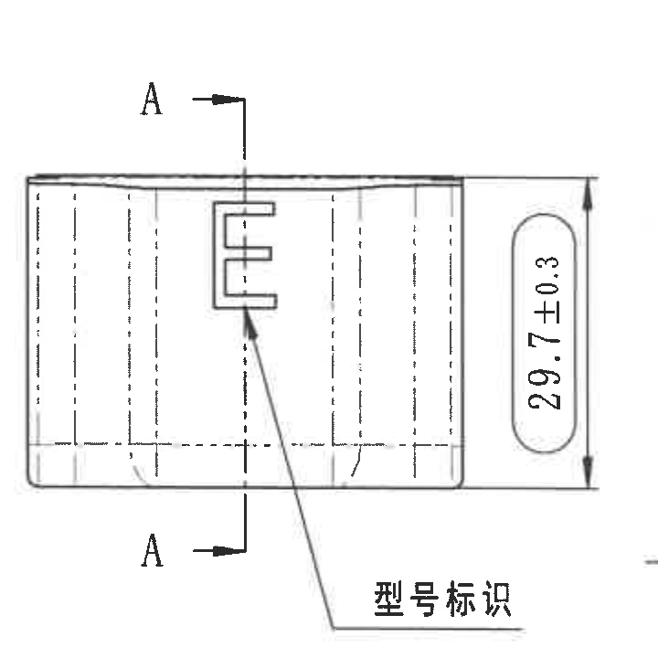

- 原图位置/视图名称：第 1 页中部偏左侧视图，bbox `[1390, 980, 2110, 1700]`。

### 提取表格

| 提取项 | 原图数值或文本 | 含义说明 |
|---|---|---|
| 总高度/宽向尺寸 | 29.7±0.3 | 侧视图右侧竖向尺寸，带 ±0.3 公差。 |
| 剖切标记 | A-A | 上下箭头和字母 A 指示 A-A 剖面位置，剖面见 object_5。 |
| 型号标识 | 型号标识 | 引出线指向侧面凸起/字符区域，用于说明型号标识位置。 |
| 侧面字符 | E | 侧面大写 E，为该产品变型/型号标识的可见字符。 |

### 边界归属说明

该裁切只提取侧视图的 29.7±0.3、A-A 剖切标记和“型号标识”。左侧端面视图的 ØE 标注、右侧 A-A 剖面中的 RIR/RAR 标注均不归入本对象。

## object_5 A-A 剖面视图

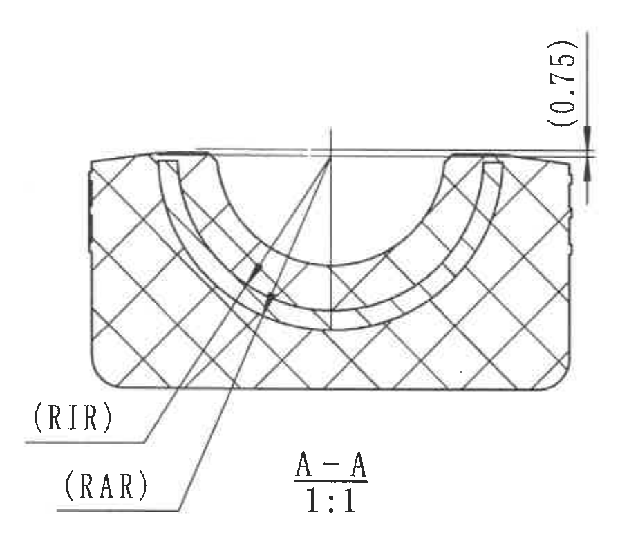

- 原图位置/视图名称：第 1 页中部 A-A 剖面，比例 1:1，bbox `[2060, 955, 2970, 1755]`。

### 提取表格

| 提取项 | 原图数值或文本 | 含义说明 |
|---|---|---|
| 剖面名称 | A-A | 与 object_4 中 A-A 剖切标记对应。 |
| 比例 | 1:1 | 剖面图比例。 |
| 参考尺寸 | (0.75) | 括号尺寸为参考尺寸，位于剖面右上方，说明上表面附近局部高度/间隙。 |
| RIR | (RIR) | 引出线指向内侧圆弧；数值来自参数表。E 行 RIR=19.5 mm。 |
| RAR | (RAR) | 引出线指向外侧圆弧；数值来自参数表。E 行 RAR=22 mm。 |
| 剖面线 | 交叉剖面线 | 表示剖切材料区域。 |

### 边界归属说明

该对象为 A-A 剖面本体、RIR/RAR 引出线和 `(0.75)` 参考尺寸。右侧 B-B 剖面及其 `(B)`、T1/T2 标注不归入本对象。

## object_6 B-B 剖面视图

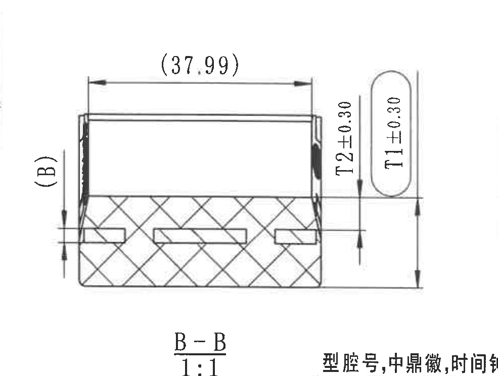

- 原图位置/视图名称：第 1 页中部偏右 B-B 剖面，比例 1:1，bbox `[2920, 970, 3905, 1715]`。

### 提取表格

| 提取项 | 原图数值或文本 | 含义说明 |
|---|---|---|
| 剖面名称 | B-B | 与 object_7 中 B-B 剖切标记对应。 |
| 比例 | 1:1 | 剖面图比例。 |
| 参考长度 | (37.99) | 括号尺寸为参考尺寸，位于 B-B 剖面上方，表示上部横向参考长度。 |
| 参考/变量尺寸 | (B) | 括号内 B 为变量/参考厚度标注；E 行 B=2.5 mm。 |
| T2 尺寸 | T2±0.30 | 内橡胶厚度尺寸，带 ±0.30 公差；E 行名义值 T2=6.40 mm。 |
| T1 尺寸 | T1±0.30 | 橡胶厚度尺寸，带 ±0.30 公差；E 行名义值 T1=16.35 mm。 |
| 插入件/剖面结构 | 横向插入件槽与剖面线 | 剖面展示内部槽和材料剖切关系。 |

### 边界归属说明

为完整保留 `(B)`、`(37.99)`、T1/T2 尺寸线、箭头和 `B-B 1:1` 标题，裁切下缘带入了右端视图引出文字的上部边缘；该文字属于 object_7，不在本对象提取表内归属。

## object_7 右端主视图及 B-B 剖切位置

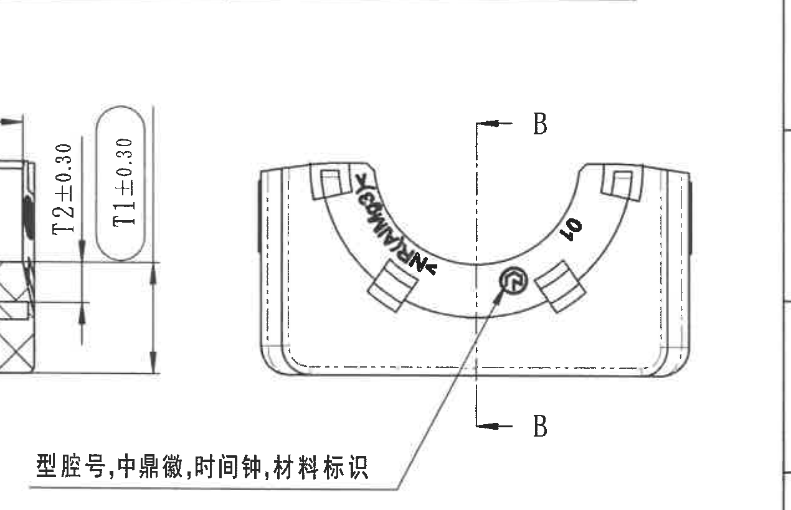

- 原图位置/视图名称：第 1 页中部右侧端面主视图，bbox `[3500, 940, 4770, 1760]`。

### 提取表格

| 提取项 | 原图数值或文本 | 含义说明 |
|---|---|---|
| 剖切标记 | B-B | 竖向剖切线和上下 B 箭头，指示 B-B 剖面位置，剖面见 object_6。 |
| 型腔号/字符 | 40 | 弧面上的可见数字，归入型腔号或模腔识别信息。 |
| 材料标识 | N-RMAQ-N（原图可辨读） | 弧面材料标识，扫描件字形略模糊；按原图可辨内容记录。 |
| 中鼎徽/时间钟 | 圆形徽标/时间钟 | 中部圆形标识，由下方引出线说明。 |
| 引出文字 | 型腔号,中鼎徽,时间钟,材料标识 | 说明该视图中的模腔号、徽标、时间钟和材料标识位置。 |

### 边界归属说明

该裁切向左扩展以完整包含右端视图的引出说明；左侧带入的 B-B 剖面 T1/T2 尺寸属于 object_6，不归入本对象。

## object_8 底视图

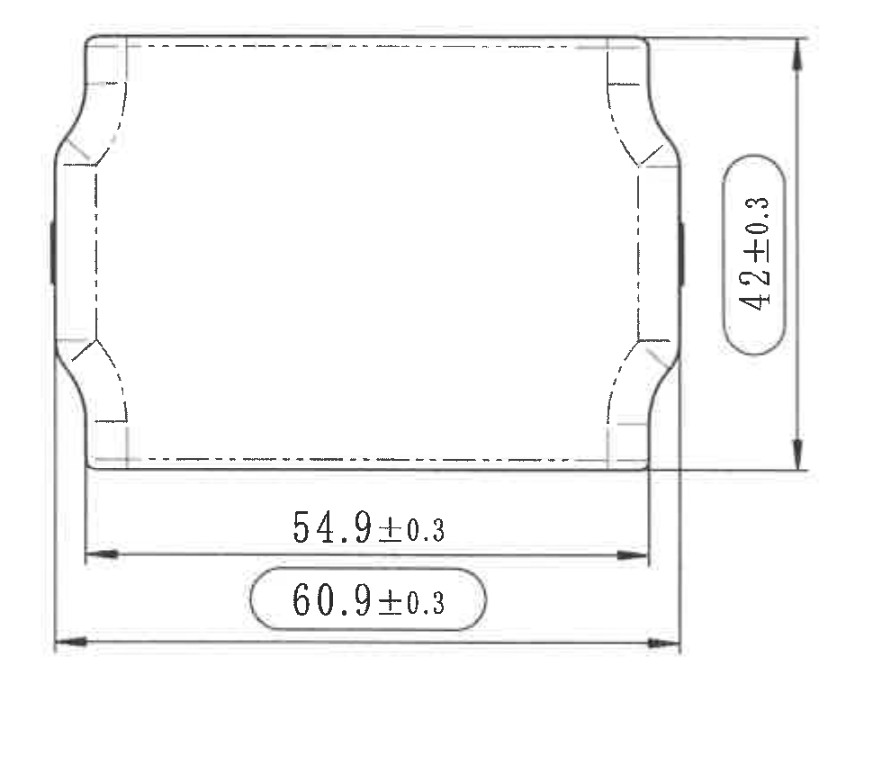

- 原图位置/视图名称：第 1 页左下方底视图，bbox `[400, 1815, 1380, 2665]`。

### 提取表格

| 提取项 | 原图数值或文本 | 含义说明 |
|---|---|---|
| 竖向尺寸 | 42±0.3 | 底视图右侧竖向尺寸，带 ±0.3 公差；尺寸文字置于圆角框内，按 notes 为出厂检验尺寸标记。 |
| 内部横向尺寸 | 54.9±0.3 | 底部内侧横向尺寸，带 ±0.3 公差。 |
| 总横向尺寸 | 60.9±0.3 | 底部总宽尺寸，带 ±0.3 公差；尺寸文字置于圆角框内，按 notes 为出厂检验尺寸标记。 |
| 隐线/轮廓 | 虚线轮廓 | 表示底视图中不可见边或内侧结构。 |

### 边界归属说明

该对象完整包含底视图外形、三组尺寸线、箭头和文字。下方公差表、右侧等轴测图均不归入本对象。

## object_9 等轴测视图

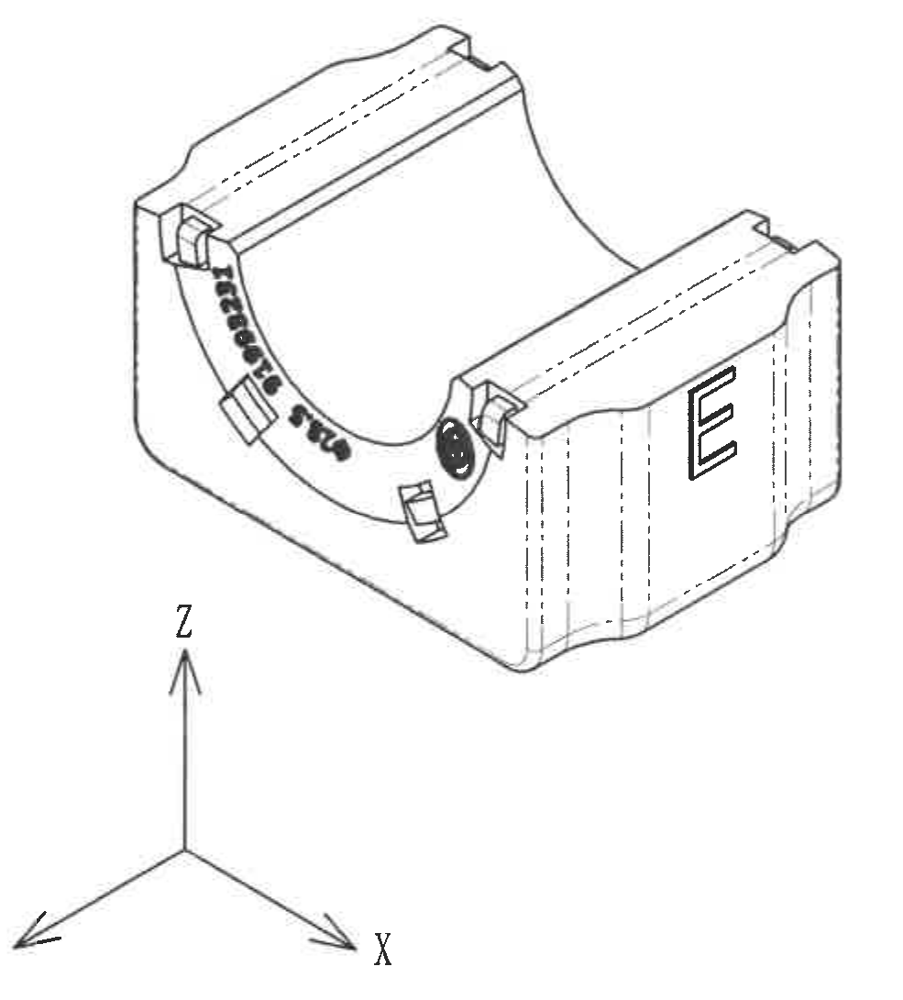

- 原图位置/视图名称：第 1 页中下部等轴测图及坐标方向，bbox `[1750, 1775, 2735, 2865]`。

### 提取表格

| 提取项 | 原图数值或文本 | 含义说明 |
|---|---|---|
| 视图类型 | 等轴测视图 | 展示零件三维外形、开口圆弧、侧面凸起和标识位置。 |
| 坐标方向 | X、Y、Z | 坐标箭头给出视图方向。 |
| 图号/杆径标识 | 91993231、28.5 | 与左端主视图中的弧面标识一致。 |
| 侧面字符 | E | 右侧端面型号字符。 |
| 时间钟/徽标 | 圆形标识 | 位于开口弧面附近。 |

### 边界归属说明

该裁切只包含等轴测图和 X/Y/Z 坐标箭头；右侧 NOTES 文本和下方标题栏不归入本对象。

## object_10 NOTES / Specification 技术要求

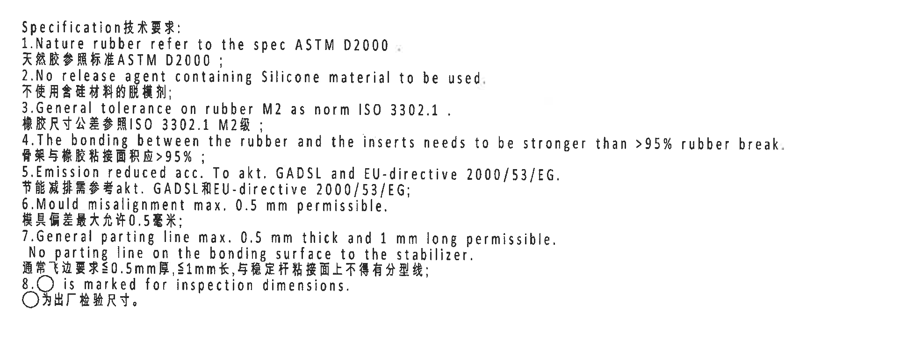

- 原图位置/视图名称：第 1 页右中下 NOTES / Specification 技术要求，bbox `[2705, 1745, 4645, 2475]`。

### 提取表格

| 提取项 | 原图数值或文本 | 含义说明 |
|---|---|---|
| 标题 | Specification技术要求: | 技术要求区域标题。 |
| 1 | Nature rubber refer to the spec ASTM D2000. / 天然胶参照标准ASTM D2000; | 天然橡胶按 ASTM D2000。 |
| 2 | No release agent containing Silicone material to be used. / 不使用含硅材料的脱模剂; | 禁止使用含硅脱模剂。 |
| 3 | General tolerance on rubber M2 as norm ISO 3302.1. / 橡胶尺寸公差参照ISO 3302.1 M2级; | 橡胶通用公差按 ISO 3302.1 M2。 |
| 4 | The bonding between the rubber and the inserts needs to be stronger than >95% rubber break. / 骨架与橡胶粘接面积应>95%; | 橡胶与骨架粘接要求，橡胶破坏比例大于 95%。 |
| 5 | Emission reduced acc. To akt. GADSL and EU-directive 2000/53/EG. / 节能减排需参考akt. GADSL和EU-directive 2000/53/EG; | 排放/禁限物质要求。 |
| 6 | Mould misalignment max. 0.5 mm permissible. / 模具偏差最大允许0.5毫米; | 模具错位最大 0.5 mm。 |
| 7 | General parting line max. 0.5 mm thick and 1 mm long permissible. No parting line on the bonding surface to the stabilizer. / 通常飞边要求≤0.5mm厚,≤1mm长,与稳定杆粘接面上不得有分型线; | 飞边和分型线要求。 |
| 8 | ○ is marked for inspection dimensions. / ○为出厂检验尺寸。 | 圆圈/圆角框标记为检验尺寸。 |

### 边界归属说明

该裁切只包含技术要求文字块。左侧等轴测图、下方 BOM 表格和标题栏均不归入本对象。

## object_11 DIN ISO 3302-1 M2 公差表

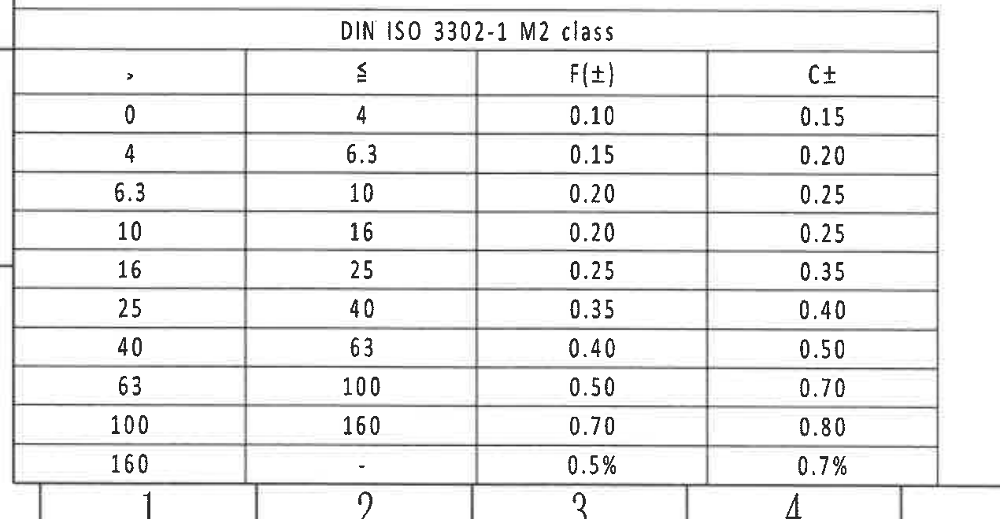

- 原图位置/视图名称：第 1 页左下方 DIN ISO 3302-1 M2 class 公差表，bbox `[350, 2715, 1620, 3375]`。

### 表格还原

| DIN ISO 3302-1 M2 class: > | ≤ | F(±) | C± |
|---:|---:|---:|---:|
| 0 | 4 | 0.10 | 0.15 |
| 4 | 6.3 | 0.15 | 0.20 |
| 6.3 | 10 | 0.20 | 0.25 |
| 10 | 16 | 0.20 | 0.25 |
| 16 | 25 | 0.25 | 0.35 |
| 25 | 40 | 0.35 | 0.40 |
| 40 | 63 | 0.40 | 0.50 |
| 63 | 100 | 0.50 | 0.70 |
| 100 | 160 | 0.70 | 0.80 |
| 160 | - | 0.5% | 0.7% |

### 提取表格

| 提取项 | 原图数值或文本 | 含义说明 |
|---|---|---|
| 标准 | DIN ISO 3302-1 M2 class | 与 NOTES 第 3 条橡胶尺寸通用公差对应。 |
| F(±) | 0.10 到 0.70，160 以上为 0.5% | F 类公差列。 |
| C± | 0.15 到 0.80，160 以上为 0.7% | C 类公差列。 |

### 边界归属说明

该裁切完整包含公差表标题、表头和所有行列；上方底视图、右侧参考标准文字不归入本对象。

## object_12 Reference 参考

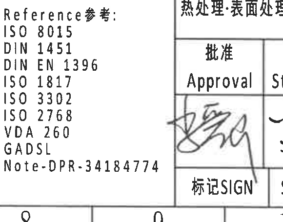

- 原图位置/视图名称：第 1 页下方中部 Reference 参考标准列表，bbox `[2395, 2915, 2975, 3370]`。

### 提取表格

| 提取项 | 原图数值或文本 | 含义说明 |
|---|---|---|
| 标题 | Reference参考: | 参考标准区域标题。 |
| 参考标准 | ISO 8015 | 几何产品规范/公差原则参考。 |
| 参考标准 | DIN 1451 | 字体/标识参考。 |
| 参考标准 | DIN EN 1396 | 材料/铝材相关参考。 |
| 参考标准 | ISO 1817 | 橡胶性能相关参考。 |
| 参考标准 | ISO 3302 | 橡胶公差参考。 |
| 参考标准 | ISO 2768 | 通用公差参考。 |
| 参考标准 | VDA 260 | 材料标识参考。 |
| 参考标准 | GADSL | 汽车禁限物质清单参考。 |
| 参考编号 | Note-DPR-34184774 | 图纸备注/内部参考编号。 |

### 边界归属说明

该对象只包含参考标准列表；左侧公差表、右侧标题栏不归入本对象。

## object_13 BOM / 零件明细表

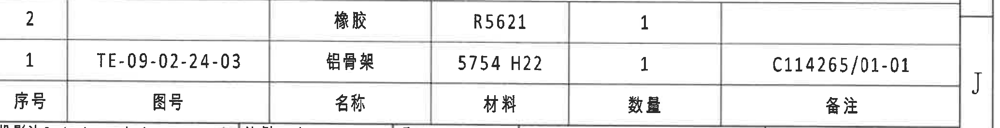

- 原图位置/视图名称：第 1 页右下方标题栏上方 BOM 明细表，bbox `[2770, 2490, 4840, 2755]`。

### 表格还原

| 序号 | 图号 | 名称 | 材料 | 数量 | 备注 |
|---:|---|---|---|---:|---|
| 2 |  | 橡胶 | R5621 | 1 |  |
| 1 | TE-09-02-24-03 | 铝骨架 | 5754 H22 | 1 | C114265/01-01 |

### 提取表格

| 提取项 | 原图数值或文本 | 含义说明 |
|---|---|---|
| 序号 2 | 橡胶 / R5621 / 数量 1 | 组件中的橡胶件。 |
| 序号 1 | TE-09-02-24-03 / 铝骨架 / 5754 H22 / 数量 1 / 备注 C114265/01-01 | 组件中的铝骨架件。 |

### 边界归属说明

BOM 表格与标题栏紧邻；该裁切只到“备注”表头行，不包含下方投影法、比例、产品号等标题栏字段。

## object_14 标题栏

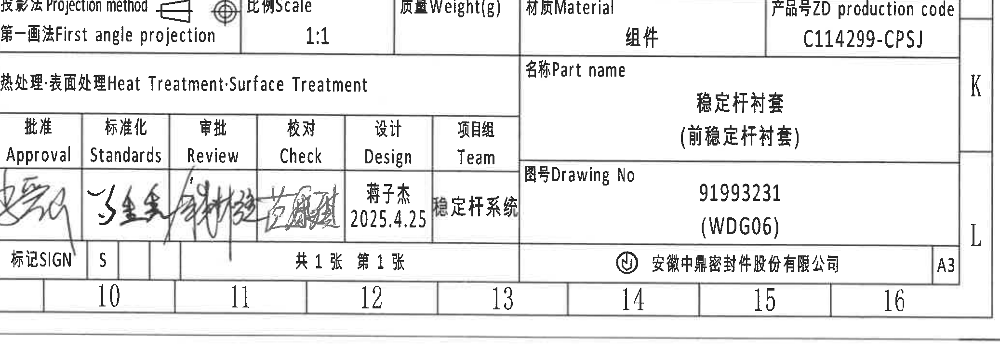

- 原图位置/视图名称：第 1 页右下角标题栏，bbox `[2765, 2760, 4840, 3505]`。

### 表格还原

| 字段 | 原图内容 |
|---|---|
| 投影法 Projection method | 第一画法 First angle projection |
| 比例 Scale | 1:1 |
| 质量 Weight(g) |  |
| 材质 Material | 组件 |
| 产品号 ZD production code | C114299-CPSJ |
| 热处理;表面处理 Heat Treatment;Surface Treatment |  |
| 名称 Part name | 稳定杆衬套（前稳定杆衬套） |
| 图号 Drawing No | 91993231 (WDG06) |
| 批准 Approval | 手写签名 |
| 标准化 Standards | 手写签名 |
| 审批 Review | 手写签名 |
| 校对 Check | 手写签名 |
| 设计 Design | 蒋子杰 / 2025.4.25 |
| 项目组 Team | 稳定杆系统 |
| 标记 SIGN | S |
| 图纸张数 | 共 1 张 第 1 张 |
| 公司 | 安徽中鼎密封件股份有限公司 |
| 图幅 | A3 |

### 提取表格

| 提取项 | 原图数值或文本 | 含义说明 |
|---|---|---|
| 产品号 | C114299-CPSJ | 图纸对应产品代码。 |
| 图号 | 91993231 (WDG06) | 标题栏主图号；与参数表 E 行和视图标识一致。 |
| 名称 | 稳定杆衬套（前稳定杆衬套） | 零件/组件名称。 |
| 材质 | 组件 | 标题栏材质栏说明为组件。 |
| 比例 | 1:1 | 图纸比例。 |
| 投影法 | 第一画法 First angle projection | 投影视图采用第一角法。 |

### 边界归属说明

标题栏裁切从投影法行开始，到公司、A3 图幅和图框底边结束；上方 BOM 明细表不归入本对象。

## 裁切检查记录

| object_id | 图片路径 | 检查结果 |
|---|---|---|
| object_1 | outputs/20C114299_assets/images/object_1.png | 修订表表头、两条记录和外框完整；无边缘文字截断。 |
| object_2 | outputs/20C114299_assets/images/object_2.png | 参数表表头、所有行列、跨行 RAR/RIR/B、T1/T2、材料字段完整；无视图尺寸线混入。 |
| object_3 | outputs/20C114299_assets/images/object_3.png | 左端视图外形、ØE 尺寸线、箭头、`(0.5)`、引出文字完整；未归入相邻侧视图内容。 |
| object_4 | outputs/20C114299_assets/images/object_4.png | 侧视图、A-A 剖切标记、29.7±0.3 和“型号标识”完整；未提取相邻 A-A 剖面 RIR/RAR。 |
| object_5 | outputs/20C114299_assets/images/object_5.png | A-A 剖面、RIR/RAR 引出线、`(0.75)`、剖面标题完整；右侧 B-B 标注已排除。 |
| object_6 | outputs/20C114299_assets/images/object_6.png | B-B 剖面、`(37.99)`、`(B)`、T1/T2 尺寸线和标题完整；下缘少量右端视图引出文字边缘仅为相邻对象，不提取到 B-B。 |
| object_7 | outputs/20C114299_assets/images/object_7.png | 右端视图、B-B 剖切标记、弧面文字、圆形标识和引出文字完整；左侧带入的 B-B T1/T2 尺寸不归入本视图。 |
| object_8 | outputs/20C114299_assets/images/object_8.png | 底视图三组尺寸 42±0.3、54.9±0.3、60.9±0.3 及箭头完整。 |
| object_9 | outputs/20C114299_assets/images/object_9.png | 等轴测图与 X/Y/Z 坐标完整；已排除右侧 NOTES 和下方标题栏。 |
| object_10 | outputs/20C114299_assets/images/object_10.png | NOTES 1-8 条中英文文本完整；未带入 BOM 表格。 |
| object_11 | outputs/20C114299_assets/images/object_11.png | DIN ISO 3302-1 M2 公差表标题、表头和全部行完整。 |
| object_12 | outputs/20C114299_assets/images/object_12.png | Reference 参考标题和全部标准条目完整。 |
| object_13 | outputs/20C114299_assets/images/object_13.png | BOM 明细表两条物料记录、表头和外框完整；未带入标题栏字段。 |
| object_14 | outputs/20C114299_assets/images/object_14.png | 标题栏投影法、比例、产品号、名称、图号、签核栏、公司和 A3 完整；上方 BOM 不归入标题栏。 |
