# 20C114300.pdf 内容识别

PDF 已先渲染为整页 PNG：`outputs/20C114300_assets/images/page_1.png`，页面尺寸 4959 x 3505 px。以下对象按原图位置拆分，裁切图均位于 `outputs/20C114300_assets/images/`。

## object_1 - 修订履历表

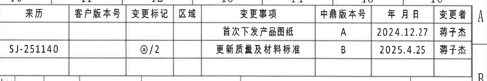

原图位置/视图名称：第 1 页右上角修订履历表，bbox `[2935, 145, 4820, 460]`。

原表还原：

| 来历 | 客户版本号 | 变更标记 | 区域 | 变更事项 | 中鼎版本号 | 年 月 日 | 变更者 |
|---|---|---|---|---|---|---|---|
|  |  |  |  | 首次下发产品图纸 | A | 2024.12.27 | 蒋子杰 |
| SJ-251140 |  | @/2 |  | 更新质量及材料标准 | B | 2025.4.25 | 蒋子杰 |

提取表：

| 提取项 | 原图数值或文本 | 含义说明 |
|---|---|---|
| 版本 A 记录 | 首次下发产品图纸；中鼎版本号 A；日期 2024.12.27；变更者 蒋子杰 | 图纸首次发布记录。 |
| 版本 B 记录 | 来历 SJ-251140；变更标记 @/2；更新质量及材料标准；中鼎版本号 B；日期 2025.4.25；变更者 蒋子杰 | 当前扫描图包含的更新记录，关联质量及材料标准更新。 |

边界归属说明：裁切包含完整表头、两条变更记录及表格线；右侧图框字母 A/B 边缘不作为表格字段提取。

## object_2 - 顶部变型参数表

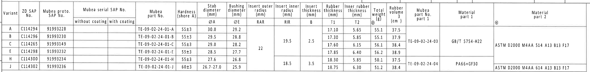

原图位置/视图名称：第 1 页上部跨 C 区域的产品变型参数表，bbox `[360, 420, 4550, 935]`。

原表还原：

| Variant | ZD SAP No. | Mubea proto. SAP No. | Mubea serial SAP No. without coating | Mubea serial SAP No. with coating | Mubea part No. | Hardness (shore A) | Stab diameter ØA (mm) | Bushing diameter ØE (mm) | Insert outer radius RAR (mm) | Insert inner radius RIR (mm) | Insert thickness B (mm) | Rubber thickness T1 (mm) | Inner rubber thickness T2 (mm) | Total weight ○ (g) | Rubber volume (cm³) | Mubea part No. part 1 | Material part 1 | Material part 2 |
|---|---|---|---|---|---|---|---|---|---|---|---|---|---|---|---|---|---|---|
| A | C114294 | 91993228 |  |  | TE-09-02-24-01-A | 55±3 | 30.0 | 29.2 | 22 | 19.5 | 2.5 | 17.10 | 5.65 | 55.1 | 37.5 | TE-09-02-24-03 | GB/T 5754-H22 | ASTM D2000 M4AA 514 A13 B13 F17 |
| B | C114296 | 91993230 |  |  | TE-09-02-24-01-B | 55±3 | 29.5 | 28.8 | 22 | 19.5 | 2.5 | 17.30 | 5.85 | 55.1 | 37.9 | TE-09-02-24-03 | GB/T 5754-H22 | ASTM D2000 M4AA 514 A13 B13 F17 |
| C | C114265 | 91993149 |  |  | TE-09-02-24-01-C | 55±3 | 29.0 | 28.2 | 22 | 19.5 | 2.5 | 17.60 | 6.15 | 56.1 | 38.4 | TE-09-02-24-03 | GB/T 5754-H22 | ASTM D2000 M4AA 514 A13 B13 F17 |
| E | C114298 | 91993232 |  |  | TE-09-02-24-01-E | 55±3 | 28.5 | 27.7 | 22 | 19.5 | 2.5 | 17.85 | 6.40 | 56.2 | 38.9 | TE-09-02-24-03 | GB/T 5754-H22 | ASTM D2000 M4AA 514 A13 B13 F17 |
| H | C114300 | 91993234 |  |  | TE-09-02-24-01-H | 55±3 | 27.6 | 26.8 | 22 | 18.5 | 3.5 | 18.30 | 5.85 | 50.1 | 37.5 | TE-09-02-24-04 | PA66+GF30 | ASTM D2000 M4AA 614 A13 B13 F17 |
| J | C114302 | 91993236 |  |  | TE-09-02-24-01-J | 60±3 | 26.7-27.0 | 25.9 | 22 | 18.5 | 3.5 | 18.75 | 6.30 | 51.2 | 38.4 | TE-09-02-24-04 | PA66+GF30 | ASTM D2000 M4AA 614 A13 B13 F17 |

提取表：

| 提取项 | 原图数值或文本 | 含义说明 |
|---|---|---|
| 当前图纸对应变型 | H；ZD SAP No. C114300；Mubea proto. SAP No. 91993234 | 与标题栏 Drawing No. 91993234 对应。 |
| H 变型杆径 | ØA 27.6 mm | 稳定杆直径字段，见表格 `Stab diameter ØA`。 |
| H 变型衬套内径/配合直径 | ØE 26.8 mm | 与视图中的 `ØE±0.3` 关联。 |
| H 变型半径字段 | RAR 22 mm；RIR 18.5 mm | 与 A-A 剖面中的 `(RAR)`、`(RIR)` 引线关联。 |
| H 变型厚度字段 | B 3.5 mm；T1 18.30 mm；T2 5.85 mm | B-B 剖面中的 `T1±0.3`、`T2±0.3` 使用该表字段取值。 |
| H 变型重量/体积 | Total weight 50.1 g；Rubber volume 37.5 cm³ | 表内总重与橡胶体积。 |
| H/J 材料组 | Mubea part No. part 1: TE-09-02-24-04；Material part 1: PA66+GF30；Material part 2: ASTM D2000 M4AA 614 A13 B13 F17 | 与 BOM 中铝骨架及右端材料标识对应。 |

边界归属说明：裁切覆盖完整参数表。上方修订表与下方加工视图未进入本对象；表中合并单元格按其跨行范围复制到对应变型行，便于机器读取。

## object_3 - 左上半圆主视图

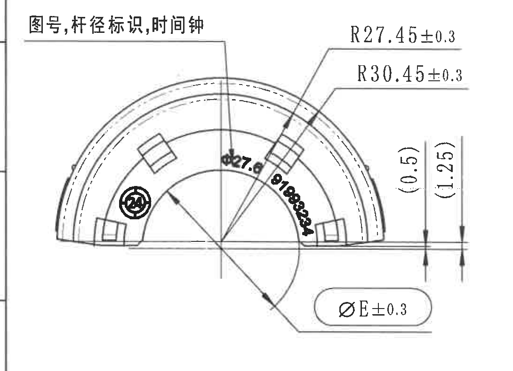

原图位置/视图名称：第 1 页左上半圆端面主视图，bbox `[360, 1040, 1450, 1830]`。

提取表：

| 提取项 | 原图数值或文本 | 含义说明 |
|---|---|---|
| 标识说明 | 图号,杆径标识,时间钟 | 引线指向端面上的图号、杆径和时间钟标识位置。 |
| 外侧弧半径 | R27.45±0.3 | 指向上部弧形轮廓的一条半径尺寸，公差 ±0.3。 |
| 外侧弧半径 | R30.45±0.3 | 指向另一条同心弧形轮廓的半径尺寸，公差 ±0.3。 |
| 参考台阶尺寸 | (0.5) | 括号内参考尺寸，位于视图右侧竖向标注，表示相邻轮廓间参考高度/偏移。 |
| 参考台阶尺寸 | (1.25) | 括号内参考尺寸，位于视图右侧竖向标注，表示较外侧参考高度/偏移。 |
| 衬套直径字段 | ØE±0.3 | 带直径符号的尺寸框，数值 E 由顶部参数表按变型确定；H 变型为 ØE 26.8，公差 ±0.3。 |
| 弧形标识 | 可见 `Ø27.6`、`91993234` | 属于产品表面标识文本；`Ø27.6` 对应 H 变型 ØA，`91993234` 对应图号/客户号。 |

边界归属说明：右侧 `(0.5)`、`(1.25)` 与 `ØE±0.3` 的箭头和引线完整保留；底部已收边，不提取下方展开视图中的尺寸。

## object_4 - 中上侧视图及 A-A 剖切位置

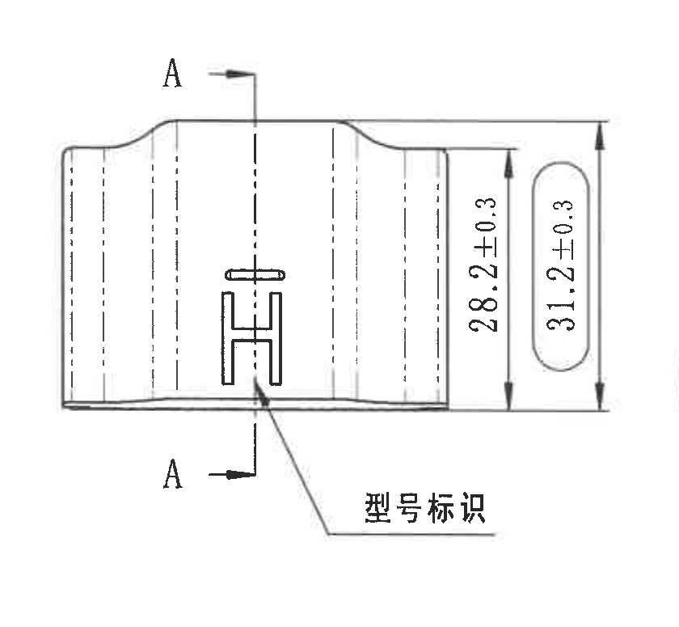

原图位置/视图名称：第 1 页中上侧视图，bbox `[1390, 1060, 2230, 1835]`。

提取表：

| 提取项 | 原图数值或文本 | 含义说明 |
|---|---|---|
| 剖切基准 | A / A | 上下两个 A 箭头标出 A-A 剖切位置。 |
| 总高度/内侧高度 | 28.2±0.3 | 右侧竖向尺寸，指向内侧高度，公差 ±0.3。 |
| 总高度/外侧高度 | 31.2±0.3 | 右侧带圆角框的竖向尺寸，公差 ±0.3。 |
| 型号标识 | 型号标识 | 引线指向侧面 H 形标识位置。 |

边界归属说明：右侧没有纳入 A-A 剖面尺寸；底部完整包含型号标识引线和文字，不与下方对象混用。

## object_5 - A-A 剖面视图

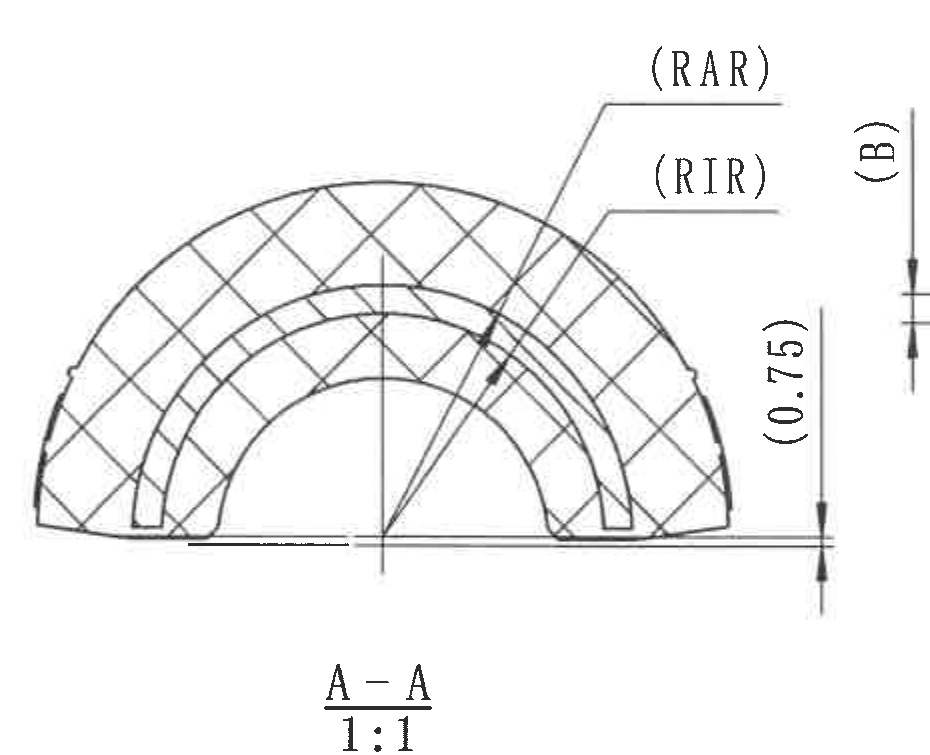

原图位置/视图名称：第 1 页中部 A-A 剖面，bbox `[2200, 1030, 3130, 1785]`。

提取表：

| 提取项 | 原图数值或文本 | 含义说明 |
|---|---|---|
| 剖面名称和比例 | A-A；1:1 | 表示该剖面由 object_4 的 A-A 剖切得到，比例 1:1。 |
| 插件外半径字段 | (RAR) | 参考/字段标注，指向外侧嵌件半径；H 变型参数表取值 RAR 22 mm。 |
| 插件内半径字段 | (RIR) | 参考/字段标注，指向内侧嵌件半径；H 变型参数表取值 RIR 18.5 mm。 |
| 参考厚度/间隙 | (0.75) | 括号内参考尺寸，位于右侧竖向尺寸线上，表示该剖面局部参考厚度/间隙。 |

边界归属说明：为保留 `(0.75)` 的完整尺寸线，右边缘可见相邻 B-B 区域的 `(B)` 标注边缘；`(B)` 不归入 A-A 提取项。底部未提取技术要求文字。

## object_6 - B-B 剖面视图

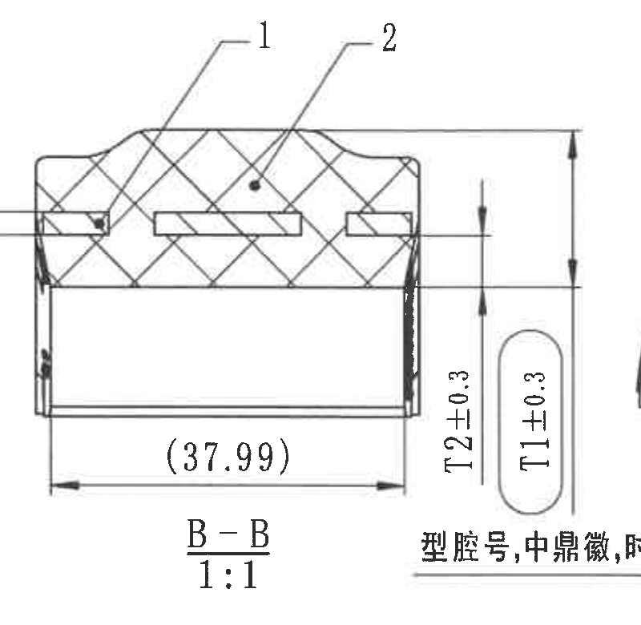

原图位置/视图名称：第 1 页中右 B-B 剖面，bbox `[3125, 1060, 3925, 1840]`。

提取表：

| 提取项 | 原图数值或文本 | 含义说明 |
|---|---|---|
| 剖面名称和比例 | B-B；1:1 | 表示该剖面由右端视图的 B-B 剖切得到，比例 1:1。 |
| 零件序号 | 1、2 | 剖面上方引线编号，对应 BOM 中序号 1 铝骨架、序号 2 橡胶。 |
| 参考宽度 | (37.99) | 括号内参考尺寸，位于底部水平尺寸线上。 |
| 内橡胶厚度字段 | T2±0.3 | 右侧竖向尺寸，T2 值由参数表确定；H 变型为 5.85 mm，公差 ±0.3。 |
| 橡胶厚度字段 | T1±0.3 | 右侧带圆角框竖向尺寸，T1 值由参数表确定；H 变型为 18.30 mm，公差 ±0.3。 |

边界归属说明：右侧可见相邻右端半圆视图边缘，是为了保留 T1/T2 尺寸线完整；该弧线不作为 B-B 视图提取内容。底部仅包含与 B-B 关联的剖面名、比例和局部标识文字边缘。

## object_7 - 右上半圆端面视图及 B-B 剖切位置

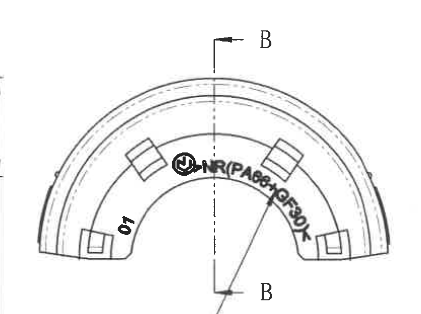

原图位置/视图名称：第 1 页右上半圆端面视图，bbox `[3845, 1070, 4675, 1690]`。

提取表：

| 提取项 | 原图数值或文本 | 含义说明 |
|---|---|---|
| 剖切基准 | B / B | 上下两个 B 箭头标出 B-B 剖切位置。 |
| 腔号/位置标识 | 01 | 端面内侧可见的腔号或位置编号。 |
| 弧形材料标识 | 可见 `NR(PA66+GF30)` | 端面弧形材料/结构标识，和 H/J 材料组 `PA66+GF30` 对应。 |
| 中鼎徽/时间钟 | 圆形徽标和时间钟图形 | 端面上的制造/追溯标识。 |

边界归属说明：左下角局部标识引线文字另作 object_8 处理；B-B 剖面的 `T1/T2` 尺寸不归入本端面视图。

## object_8 - 局部标识引线

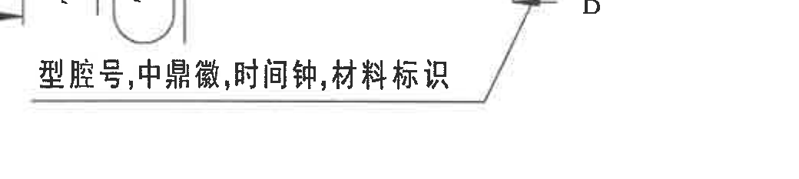

原图位置/视图名称：第 1 页右上视图下方局部引线标识，bbox `[3600, 1645, 4640, 1880]`。

提取表：

| 提取项 | 原图数值或文本 | 含义说明 |
|---|---|---|
| 标识说明 | 型腔号,中鼎徽,时间钟,材料标识 | 引线指向右上半圆端面视图中的腔号、徽标、时间钟和材料标识。 |
| 引线归属 | 指向 object_7 端面内侧标识区 | 属于右端端面视图的说明性局部标注，不是尺寸。 |

边界归属说明：顶部可见 B-B 尺寸/剖切边缘，不作为本对象提取项；本对象只提取引线和标识说明文字。

## object_9 - 左下展开/侧向视图

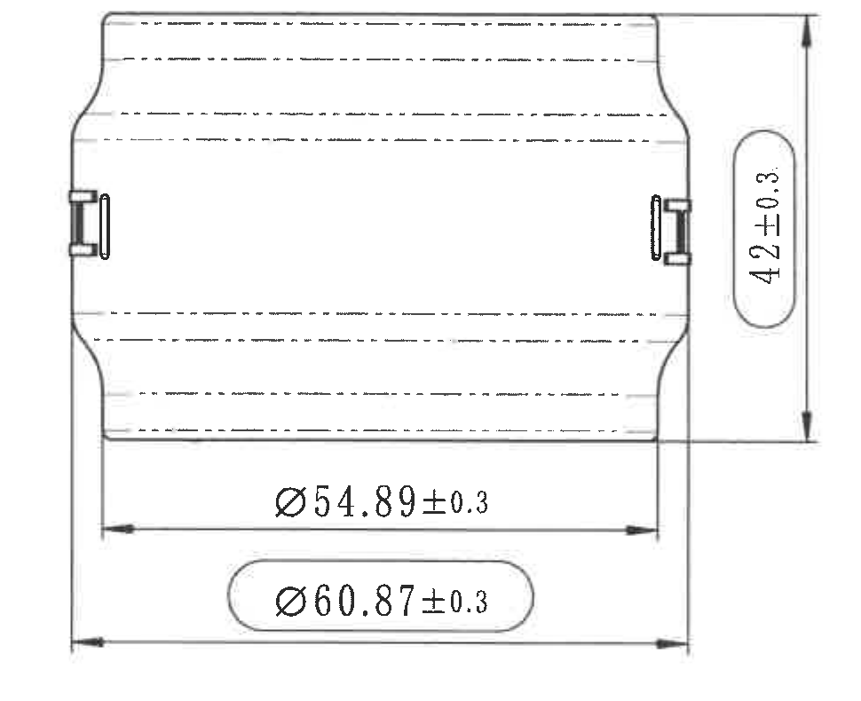

原图位置/视图名称：第 1 页左下展开/侧向视图，bbox `[400, 1845, 1370, 2635]`。

提取表：

| 提取项 | 原图数值或文本 | 含义说明 |
|---|---|---|
| 总高度 | 42±0.3 | 右侧竖向总高度尺寸，公差 ±0.3。 |
| 内侧直径/宽度 | Ø54.89±0.3 | 底部上方水平尺寸，带直径符号，公差 ±0.3。 |
| 外侧直径/宽度 | Ø60.87±0.3 | 底部带圆角框水平尺寸，带直径符号，公差 ±0.3。 |

边界归属说明：裁切包含完整上下端轮廓、左右箭头和三个尺寸文字；未纳入左下公差表。

## object_10 - 轴测视图

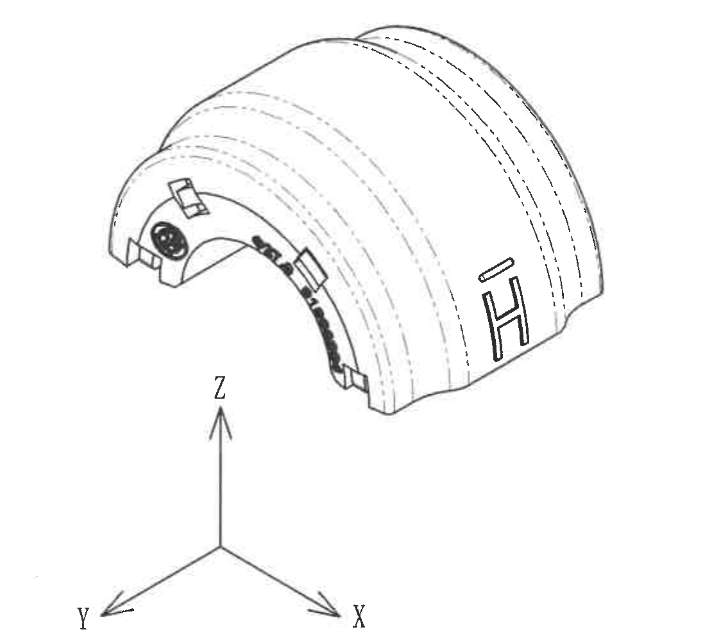

原图位置/视图名称：第 1 页中下部轴测视图，bbox `[1600, 1870, 2710, 2870]`。

提取表：

| 提取项 | 原图数值或文本 | 含义说明 |
|---|---|---|
| 坐标方向 | X、Y、Z | 图中三轴方向指示。 |
| 外观标识 | H 形标识、端面弧形标识、圆形徽标 | 用于说明产品表面标识在三维外观上的位置。 |
| 尺寸 | 未见尺寸数值 | 该对象为外观轴测图，不含独立加工尺寸。 |

边界归属说明：裁切已收掉右侧技术要求和下方参考标准，只保留轴测图及坐标轴。

## object_11 - DIN ISO 3302-1 M2 公差表

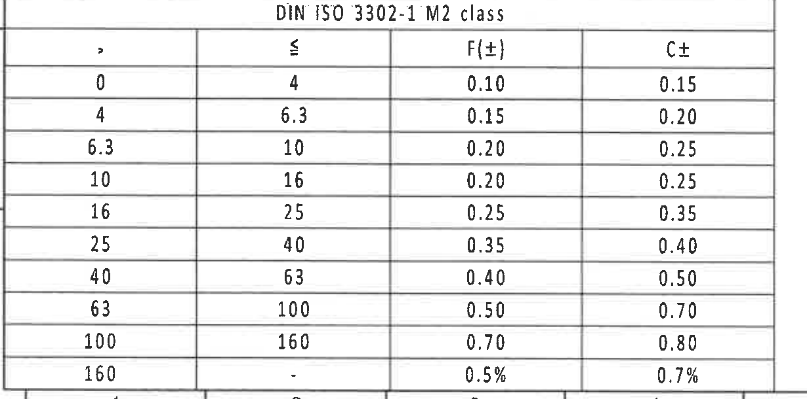

原图位置/视图名称：第 1 页左下 DIN ISO 3302-1 M2 class 公差表，bbox `[365, 2735, 1595, 3345]`。

原表还原：

| > | ≤ | F(±) | C± |
|---:|---:|---:|---:|
| 0 | 4 | 0.10 | 0.15 |
| 4 | 6.3 | 0.15 | 0.20 |
| 6.3 | 10 | 0.20 | 0.25 |
| 10 | 16 | 0.20 | 0.25 |
| 16 | 25 | 0.25 | 0.35 |
| 25 | 40 | 0.35 | 0.40 |
| 40 | 63 | 0.40 | 0.50 |
| 63 | 100 | 0.50 | 0.70 |
| 100 | 160 | 0.70 | 0.80 |
| 160 | - | 0.5% | 0.7% |

提取表：

| 提取项 | 原图数值或文本 | 含义说明 |
|---|---|---|
| 表名 | DIN ISO 3302-1 M2 class | 橡胶件尺寸的一般公差等级。 |
| F(±) 列 | 0.10 至 0.70，末行 0.5% | F 类尺寸对应公差。 |
| C± 列 | 0.15 至 0.80，末行 0.7% | C 类尺寸对应公差。 |

边界归属说明：底部可见图框坐标数字 1-4 的边缘，不属于公差表字段，未提取。

## object_12 - Specification 技术要求

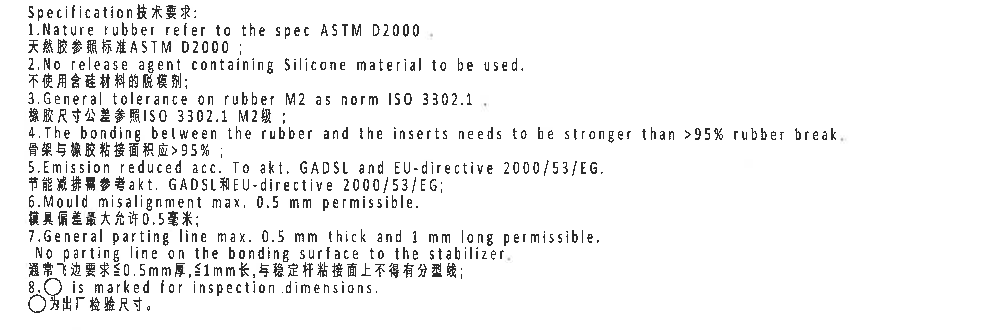

原图位置/视图名称：第 1 页右中下技术要求，bbox `[2700, 1810, 4700, 2470]`。

提取表：

| 提取项 | 原图数值或文本 | 含义说明 |
|---|---|---|
| 标题 | Specification技术要求: | 技术要求标题。 |
| 1 | Nature rubber refer to the spec ASTM D2000；天然胶参照标准ASTM D2000； | 天然胶材料参照 ASTM D2000。 |
| 2 | No release agent containing Silicone material to be used.；不使用含硅材料的脱模剂； | 禁止使用含硅脱模剂。 |
| 3 | General tolerance on rubber M2 as norm ISO 3302.1；橡胶尺寸公差参照ISO 3302.1 M2级； | 橡胶尺寸一般公差按 ISO 3302.1 M2。 |
| 4 | The bonding between the rubber and the inserts needs to be stronger than >95% rubber break.；骨架与橡胶粘接面积应>95%； | 橡胶与嵌件粘接要求，橡胶破坏/粘接面积要求大于 95%。 |
| 5 | Emission reduced acc. To akt. GADSL and EU-directive 2000/53/EG.；节能减排需参考akt. GADSL和EU-directive 2000/53/EG； | 排放/法规要求。 |
| 6 | Mould misalignment max. 0.5 mm permissible.；模具偏差最大允许0.5毫米； | 模具错位最大允许 0.5 mm。 |
| 7 | General parting line max. 0.5 mm thick and 1 mm long permissible. No parting line on the bonding surface to the stabilizer.；通常飞边要求≤0.5mm厚,≤1mm长,与稳定杆粘接面上不得有分型线； | 飞边和分型线要求；稳定杆粘接面不得有分型线。 |
| 8 | ○ is marked for inspection dimensions.；○为出厂检验尺寸。 | 圆圈符号表示检验尺寸。 |

边界归属说明：裁切完整覆盖 1-8 条中英文要求；上方 A-A/B-B 比例文字和下方 BOM 表未作为本对象内容提取。

## object_13 - 参考标准列表

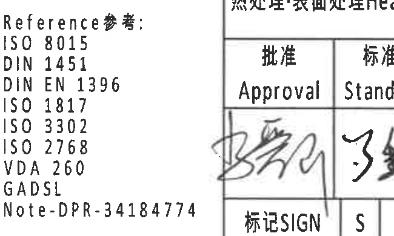

原图位置/视图名称：第 1 页下中参考标准，bbox `[2390, 2930, 3040, 3320]`。

提取表：

| 提取项 | 原图数值或文本 | 含义说明 |
|---|---|---|
| 标题 | Reference参考: | 参考标准列表标题。 |
| 标准 | ISO 8015 | 参考标准。 |
| 标准 | DIN 1451 | 参考标准。 |
| 标准 | DIN EN 1396 | 参考标准。 |
| 标准 | ISO 1817 | 参考标准。 |
| 标准 | ISO 3302 | 参考标准。 |
| 标准 | ISO 2768 | 参考标准。 |
| 标准 | VDA 260 | 参考标准。 |
| 标准 | GADSL | 参考标准。 |
| 备注 | Note-DPR-34184774 | 参考备注编号。 |

边界归属说明：裁切只包含参考标准列表；未将轴测视图或标题栏字段归入本对象。

## object_14 - BOM/明细表

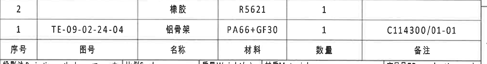

原图位置/视图名称：第 1 页右下标题栏上方 BOM/明细表，bbox `[2760, 2490, 4790, 2760]`。

原表还原：

| 序号 | 图号 | 名称 | 材料 | 数量 | 备注 |
|---|---|---|---|---|---|
| 2 |  | 橡胶 | R5621 | 1 |  |
| 1 | TE-09-02-24-04 | 铝骨架 | PA66+GF30 | 1 | C114300/01-01 |

提取表：

| 提取项 | 原图数值或文本 | 含义说明 |
|---|---|---|
| 序号 2 | 名称 橡胶；材料 R5621；数量 1 | 橡胶件明细。 |
| 序号 1 | 图号 TE-09-02-24-04；名称 铝骨架；材料 PA66+GF30；数量 1；备注 C114300/01-01 | 铝骨架明细，与 B-B 剖面编号 1 及参数表材料组对应。 |

边界归属说明：裁切包含 BOM 两行和表头；下方标题栏另作 object_15，不把标题栏字段作为 BOM 内容提取。

## object_15 - 标题栏

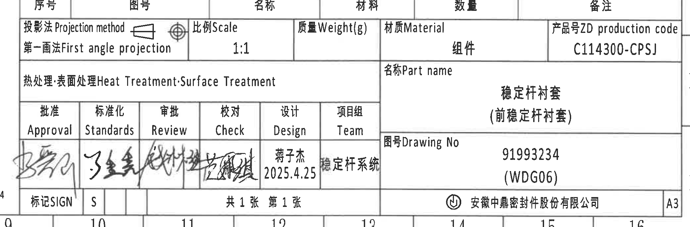

原图位置/视图名称：第 1 页右下标题栏，bbox `[2700, 2685, 4790, 3375]`。

提取表：

| 提取项 | 原图数值或文本 | 含义说明 |
|---|---|---|
| 投影法 | Projection method；第一画法 First angle projection | 投影方式为第一角法。 |
| 比例 | Scale 1:1 | 图纸比例。 |
| 质量 | Weight(g) | 原图该栏未填写数值。 |
| 材质 | Material；组件 | 标题栏材质/对象类型为组件。 |
| 产品号 | ZD production code；C114300-CPSJ | 产品生产代码。 |
| 热处理/表面处理 | Heat Treatment;Surface Treatment | 原图该栏未填写具体处理内容。 |
| 名称 | Part name；稳定杆衬套（前稳定杆衬套） | 零件名称。 |
| 审签栏 | Approval、Standards、Review、Check、Design、Team | 审批/标准化/审查/校对/设计/项目组栏位。 |
| 设计 | 蒋子杰；2025.4.25 | 设计人员及日期。 |
| 项目组 | 稳定杆系统 | 项目组名称。 |
| 图号 | Drawing No；91993234；(WDG06) | 图纸编号。 |
| 标记/签名 | 标记SIGN；S | 标记栏。 |
| 张数 | 共 1 张 第 1 张 | 图纸页数。 |
| 公司 | 安徽中鼎密封件股份有限公司 | 出图公司。 |
| 图幅 | A3 | 图幅规格。 |

边界归属说明：裁切顶部与 BOM 表头相邻，标题栏字段从投影法行开始提取；BOM 两行明细只在 object_14 中提取。

## 裁切检查记录

| 对象 | 检查结果 |
|---|---|
| object_1 | 完整包含修订履历表头、两条记录和表格线；无尺寸线。 |
| object_2 | 完整包含顶部变型参数表所有列、行和合并单元格内容；未混入下方视图。 |
| object_3 | 完整包含 R27.45±0.3、R30.45±0.3、(0.5)、(1.25)、ØE±0.3 的文字、引线和箭头；未提取下方视图线段。 |
| object_4 | 完整包含 A-A 剖切箭头、28.2±0.3、31.2±0.3、型号标识引线和文字。 |
| object_5 | 完整包含 A-A、1:1、(RAR)、(RIR)、(0.75) 的引线和文字；右边缘可见相邻 `(B)` 标注边缘，已排除归属。 |
| object_6 | 完整包含 B-B、1:1、1/2 引线、(37.99)、T2±0.3、T1±0.3 的尺寸线和文字；右侧弧线边缘不归属本对象。 |
| object_7 | 完整包含右端半圆视图、B-B 剖切箭头、01、弧形材料标识和徽标；不提取 B-B 尺寸。 |
| object_8 | 完整包含局部标识说明和引线；顶部相邻尺寸边缘不作为本对象内容。 |
| object_9 | 完整包含 42±0.3、Ø54.89±0.3、Ø60.87±0.3 的文字、箭头和延长线。 |
| object_10 | 完整包含轴测图和 X/Y/Z 坐标指示；无加工尺寸文字。 |
| object_11 | 完整包含 DIN ISO 3302-1 M2 class 公差表表头和 10 行数据；底部图框编号不提取。 |
| object_12 | 完整包含 Specification 技术要求 1-8 条中英文文本；未混入 BOM 字段。 |
| object_13 | 完整包含 Reference 参考标准列表及 Note 编号。 |
| object_14 | 完整包含 BOM 表头及序号 1、2 两行记录。 |
| object_15 | 完整包含标题栏主要字段、签名栏、图号、公司和 A3 图幅；BOM 明细不归属标题栏。 |
