# 20C114301 PDF 内容识别

源文件：`input/20C114301.pdf`  
整页渲染图：`outputs/20C114301_assets/images/page_1.png`  
整页尺寸：4959 x 3505 px

## object_1 - 上方规格/尺寸/材料表

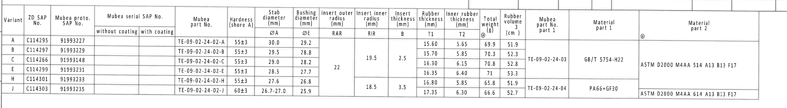

原图位置/视图名称：第 1 页，上方横向规格表，bbox `[370, 395, 4690, 995]`。  
object_kind：table

| Variant | ZD SAP No. | Mubea proto. SAP No. | Mubea serial SAP No. without coating | Mubea serial SAP No. with coating | Mubea part No. | Hardness (shore A) | Stab diameter ØA (mm) | Bushing diameter ØE (mm) | Insert outer radius RAR (mm) | Insert inner radius RIR (mm) | Insert thickness B (mm) | Rubber thickness T1 (mm) | Inner rubber thickness T2 (mm) | Total weight (g) @ | Rubber volume (cm³) | Mubea part No. part 1 | Material part 1 | Material part 2 @ |
|---|---|---|---|---|---|---|---:|---:|---:|---:|---:|---:|---:|---:|---:|---|---|---|
| A | C114295 | 91993227 |  |  | TE-09-02-24-02-A | 55±3 | 30.0 | 29.2 | 22 | 19.5 | 2.5 | 15.60 | 5.65 | 69.9 | 51.9 | TE-09-02-24-03 | GB/T 5754-H22 | ASTM D2000 M4AA 514 A13 B13 F17 |
| B | C114297 | 91993229 |  |  | TE-09-02-24-02-B | 55±3 | 29.5 | 28.8 | 22 | 19.5 | 2.5 | 15.70 | 5.85 | 70.3 | 52.3 | TE-09-02-24-03 | GB/T 5754-H22 | ASTM D2000 M4AA 514 A13 B13 F17 |
| C | C114266 | 91993148 |  |  | TE-09-02-24-02-C | 55±3 | 29.0 | 28.2 | 22 | 19.5 | 2.5 | 16.30 | 6.15 | 70.8 | 52.8 | TE-09-02-24-03 | GB/T 5754-H22 | ASTM D2000 M4AA 514 A13 B13 F17 |
| E | C114299 | 91993231 |  |  | TE-09-02-24-02-E | 55±3 | 28.5 | 27.7 | 22 | 19.5 | 2.5 | 16.35 | 6.40 | 71 | 53.3 | TE-09-02-24-03 | GB/T 5754-H22 | ASTM D2000 M4AA 514 A13 B13 F17 |
| H | C114301 | 91993233 |  |  | TE-09-02-24-02-H | 55±3 | 27.6 | 26.8 | 22 | 18.5 | 3.5 | 16.80 | 5.85 | 65.8 | 51.9 | TE-09-02-24-04 | PA66+GF30 | ASTM D2000 M4AA 614 A13 B13 F17 |
| J | C114303 | 91993235 |  |  | TE-09-02-24-02-J | 60±3 | 26.7-27.0 | 25.9 | 22 | 18.5 | 3.5 | 17.35 | 6.30 | 66.6 | 52.7 | TE-09-02-24-04 | PA66+GF30 | ASTM D2000 M4AA 614 A13 B13 F17 |

| 提取项 | 原图数值或文本 | 含义说明 |
|---|---|---|
| 本图对应行 | Variant H / ZD SAP No. C114301 / Mubea proto. SAP No. 91993233 | 与标题栏图号 91993233 对应，是本 PDF 的零件配置行。 |
| Mubea part No. | TE-09-02-24-02-H | H 变型的 Mubea 主零件号。 |
| Hardness | 55±3 shore A | 橡胶硬度，肖氏 A，允许范围 52 至 58。 |
| ØA | 27.6 mm | 稳定杆直径参数，H 行标称值。 |
| ØE | 26.8 mm | 衬套孔径/配合直径参数，H 行标称值。 |
| RAR | 22 mm | Insert outer radius，外侧嵌件半径；该列为合并单元格，H 行沿用 22。 |
| RIR | 18.5 mm | Insert inner radius，内侧嵌件半径；H/J 行合并。 |
| B | 3.5 mm | Insert thickness，嵌件厚度；H/J 行合并。 |
| T1 | 16.80 mm | Rubber thickness，橡胶厚度参数，在 B-B 剖面有对应标注 T1±0.30。 |
| T2 | 5.85 mm | Inner rubber thickness，内侧橡胶厚度参数，在 B-B 剖面有对应标注 T2±0.30。 |
| Total weight | 65.8 g | H 行总重量。 |
| Rubber volume | 51.9 cm³ | H 行橡胶体积。 |
| Mubea part No. part 1 | TE-09-02-24-04 | H/J 行铝骨架/嵌件零件号。 |
| Material part 1 | PA66+GF30 | H/J 行 part 1 材料。 |
| Material part 2 | ASTM D2000 M4AA 614 A13 B13 F17 | H/J 行橡胶材料标准。 |

边界归属说明：裁切包含完整规格表列、合并单元格和材料字段；表格上方少量图框网格线不作为表格内容。RAR、RIR、B 的合并单元格按其跨越的行归属到对应 Variant。

## object_2 - 修订履历表

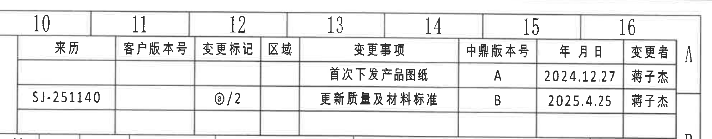

原图位置/视图名称：第 1 页，右上角修订履历，bbox `[2895, 70, 4875, 460]`。  
object_kind：table

| 来历 | 客户版本号 | 变更标记 | 区域 | 变更事项 | 中鼎版本号 | 年月日 | 变更者 |
|---|---|---|---|---|---|---|---|
|  |  |  |  | 首次下发产品图纸 | A | 2024.12.27 | 蒋子杰 |
| SJ-251140 |  | @/2 |  | 更新质量及材料标准 | B | 2025.4.25 | 蒋子杰 |

| 提取项 | 原图数值或文本 | 含义说明 |
|---|---|---|
| 首次版本 | A / 2024.12.27 / 首次下发产品图纸 | 初始发布记录。 |
| 最新修订 | B / 2025.4.25 / SJ-251140 / @/2 / 更新质量及材料标准 | 当前图纸修订记录，变更标记为 @/2。 |

边界归属说明：裁切为完整修订履历表；右侧出现的图框坐标字母 A/B 属外部图框，不属于表格字段。

## object_3 - 左侧正视图/标识视图

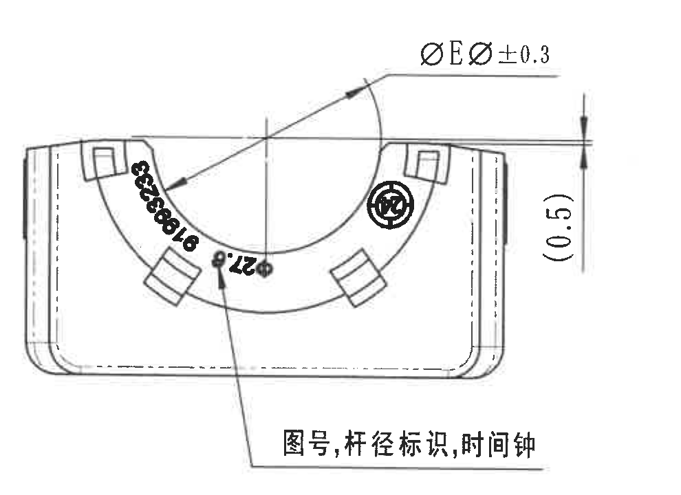

原图位置/视图名称：第 1 页，中左正视图，bbox `[430, 960, 1420, 1680]`。  
object_kind：view

| 提取项 | 原图数值或文本 | 含义说明 |
|---|---|---|
| 直径尺寸 | ØEر0.3 | 指向半圆内孔/衬套配合直径的直径 E 尺寸公差标注；具体 ØE 数值由上方规格表按 Variant H 取 26.8 mm，因此本图对应 ØE 26.8±0.3 mm。 |
| 参考尺寸 | (0.5) | 括号内参考尺寸，位于右侧竖向尺寸线处，说明该局部高度/偏移仅供参考，不作为直接检验控制尺寸。 |
| 标识说明 | 图号, 杆径标识, 时间钟 | 引线指向圆弧面上的凸字/模压标识区域，要求包含图号、杆径标识和时间钟。 |
| 圆弧凸字 | C114301、91993233 等沿弧面排列 | 为零件图号/标识类内容，不是弧度或半径尺寸。 |

边界归属说明：裁切已收紧右边界，未纳入相邻侧视图；`(0.5)` 的尺寸线、箭头和文字完整保留。弧面黑色数字为标识文本，不按几何尺寸提取。

## object_4 - 中间侧视图/A-A 剖切位置

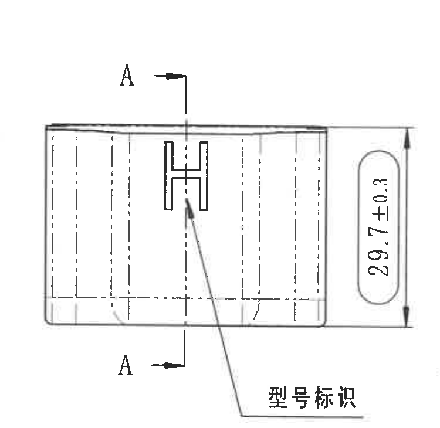

原图位置/视图名称：第 1 页，中部侧视图，bbox `[1350, 960, 2100, 1690]`。  
object_kind：view

| 提取项 | 原图数值或文本 | 含义说明 |
|---|---|---|
| 剖切标识 | A / A | 上下两个 A 剖切箭头标出 A-A 剖面的位置和观察方向。 |
| 总高度 | 29.7±0.3 | 侧视图右侧竖向总高度尺寸，控制该方向外形高度。 |
| 标识说明 | 型号标识 | 引线指向侧面 H 形标识，表示该面设置型号标识。 |

边界归属说明：裁切包含侧视图主体、A-A 剖切箭头、完整 29.7±0.3 尺寸线和“型号标识”引线；未包含左侧正视图或 A-A 剖面区域。

## object_5 - A-A 剖面视图

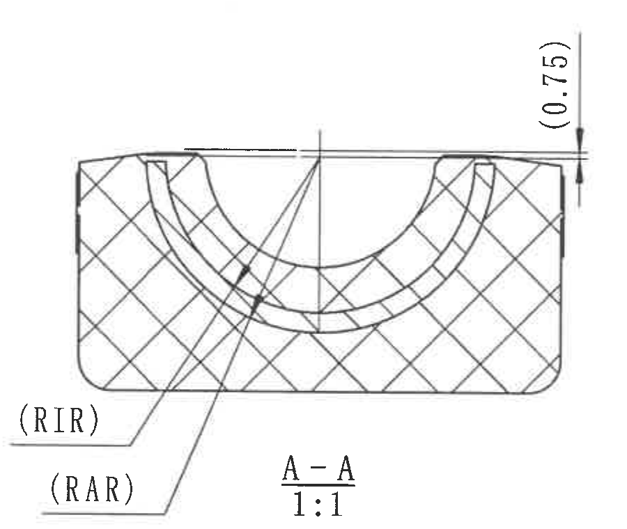

原图位置/视图名称：第 1 页，中部 A-A 剖面，bbox `[2090, 960, 2990, 1720]`。  
object_kind：section

| 提取项 | 原图数值或文本 | 含义说明 |
|---|---|---|
| 剖面名称/比例 | A-A / 1:1 | 表示该裁切为 A-A 剖面，绘图比例 1:1。 |
| 参考尺寸 | (0.75) | 位于右上竖向尺寸线，为括号内参考尺寸，说明顶部局部厚度/间距仅供参考。 |
| 参考半径标识 | (RIR) | 指向内侧嵌件半径位置；括号表示该处用规格表参数 RIR 表达，本图 H 行 RIR=18.5 mm。 |
| 参考半径标识 | (RAR) | 指向外侧嵌件半径位置；括号表示该处用规格表参数 RAR 表达，本图 H 行 RAR=22 mm。 |
| 剖面填充 | 交叉剖面线 | 表示剖切到的橡胶/材料截面区域。 |

边界归属说明：裁切已去除右侧 B-B 剖面片段；`(0.75)`、`(RIR)`、`(RAR)` 的引线和文字完整保留，均归属于 A-A 剖面。

## object_6 - B-B 剖面视图

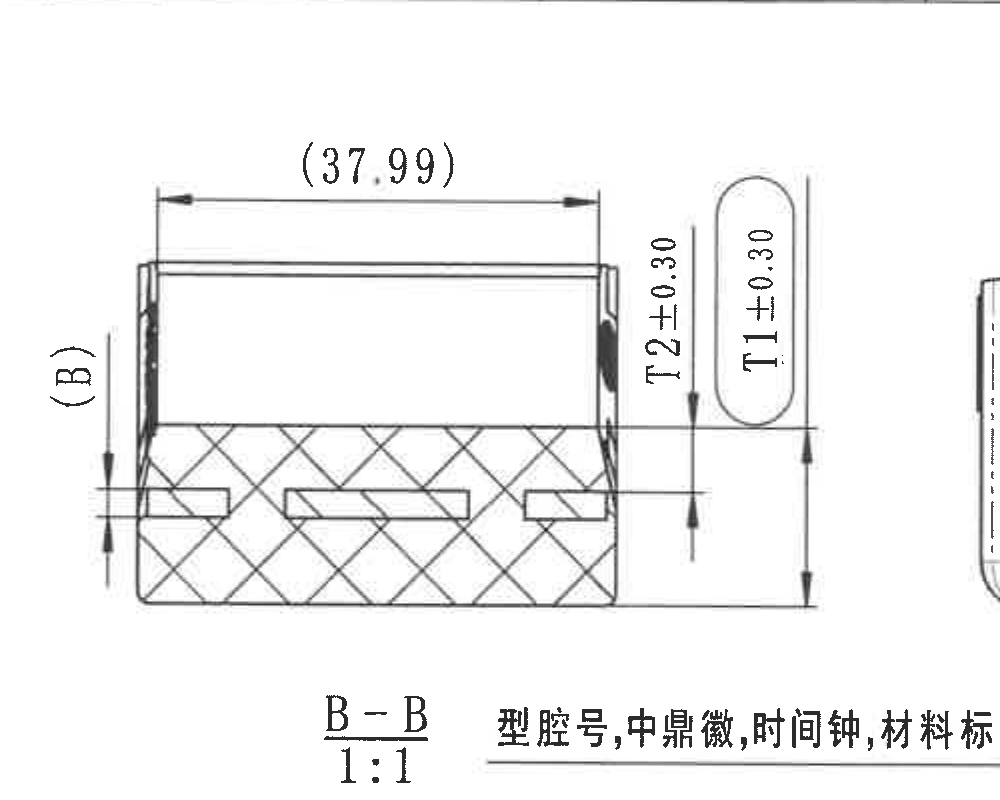

原图位置/视图名称：第 1 页，中右 B-B 剖面，bbox `[2950, 940, 3950, 1740]`。  
object_kind：section

| 提取项 | 原图数值或文本 | 含义说明 |
|---|---|---|
| 剖面名称/比例 | B-B / 1:1 | 表示该裁切为 B-B 剖面，绘图比例 1:1。 |
| 参考总长 | (37.99) | 顶部水平尺寸，括号内为参考长度，不作为直接检验控制尺寸。 |
| 参考厚度 | (B) | 左侧竖向参考标注，指向嵌件厚度 B；本图 H 行规格表 B=3.5 mm。 |
| 橡胶厚度 | T2±0.30 | 右侧竖向尺寸，控制内侧橡胶厚度；本图 H 行规格表 T2=5.85 mm，因此对应 5.85±0.30 mm。 |
| 橡胶厚度 | T1±0.30 | 右侧椭圆框竖向尺寸，控制橡胶厚度；本图 H 行规格表 T1=16.80 mm，因此对应 16.80±0.30 mm。 |
| 标识说明 | 型腔号, 中鼎徽, 时间钟, 材料标识 | 位于剖面标题右侧的引线文字，说明相邻正视图/标识区需要包含这些模压标识。 |

边界归属说明：为完整保留 `(B)`、`(37.99)`、`T2±0.30`、`T1±0.30` 和 B-B 标题，右缘不可避免带入右侧正视图边缘一小段；该片段不提取为 B-B 内容。标题右侧中文引线说明归到标识视图语义，不作为 B-B 几何尺寸。

## object_7 - 右侧正视图/B-B 剖切位置

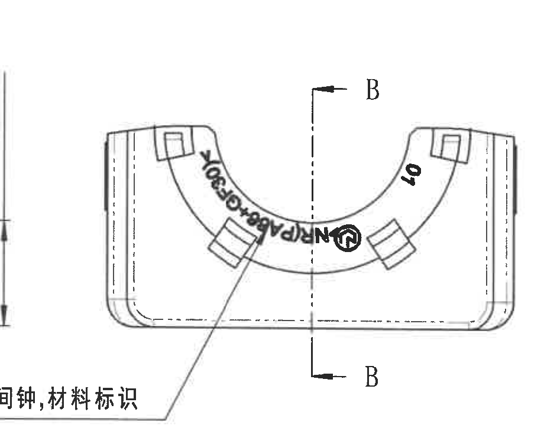

原图位置/视图名称：第 1 页，右侧正视图，bbox `[3750, 995, 4670, 1715]`。  
object_kind：view

| 提取项 | 原图数值或文本 | 含义说明 |
|---|---|---|
| 剖切标识 | B / B | 上下两个 B 剖切箭头标出 B-B 剖面的位置和观察方向。 |
| 标识说明 | 型腔号, 中鼎徽, 时间钟, 材料标识 | 引线指向圆弧面上的凸字/模压标识区域。 |
| 弧面凸字/标识 | PA66+GF30、40、中鼎徽等 | 代表材料、型腔/编号和徽标标识，不作为尺寸。 |

边界归属说明：裁切排除了左侧 B-B 的 T1/T2 尺寸链；左下中文说明因引线跨越相邻区域，裁切内仅保留归属到该正视图的部分文字和引线。

## object_8 - 下方平面/底视尺寸视图

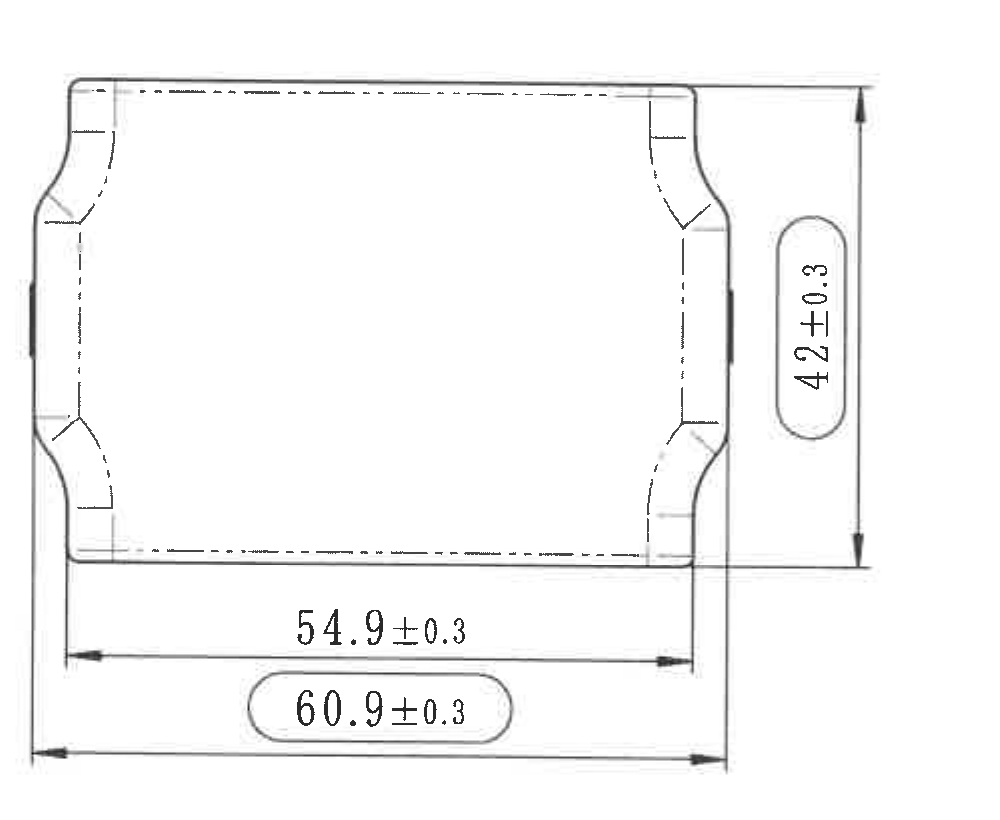

原图位置/视图名称：第 1 页，左下外形尺寸视图，bbox `[430, 1770, 1430, 2590]`。  
object_kind：view

| 提取项 | 原图数值或文本 | 含义说明 |
|---|---|---|
| 总宽/外形尺寸 | 60.9±0.3 | 底部椭圆框内水平总尺寸，控制最大外形宽度。 |
| 内部宽度/台阶距离 | 54.9±0.3 | 底部上方水平尺寸，控制内侧边界或台阶间距。 |
| 总高度/外形尺寸 | 42±0.3 | 右侧竖向外形尺寸，控制该视图方向总高度。 |

边界归属说明：裁切完整包含三条尺寸线、箭头和文字；未混入等轴视图或公差表内容。

## object_9 - 等轴测辅助视图

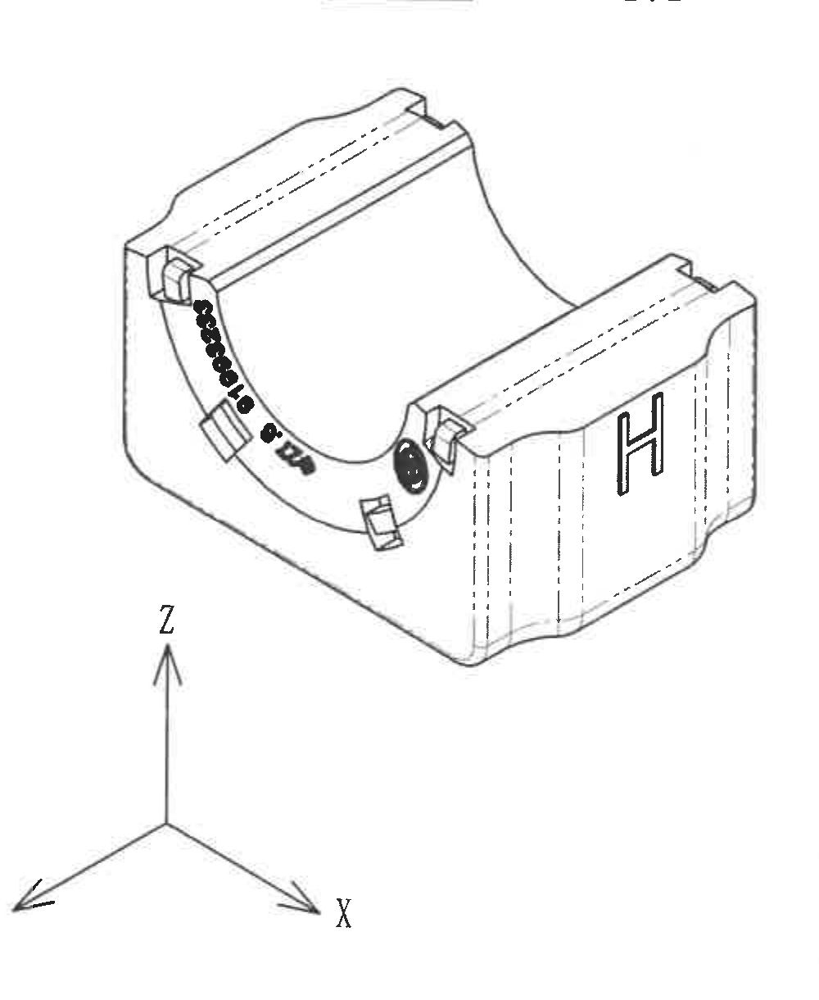

原图位置/视图名称：第 1 页，中下等轴测视图及坐标轴，bbox `[1750, 1700, 2750, 2920]`。  
object_kind：view

| 提取项 | 原图数值或文本 | 含义说明 |
|---|---|---|
| 辅助三维视图 | 等轴测零件外形 | 展示零件开口、端部、弧面标识和侧面 H 标识的三维关系。 |
| 坐标方向 | X / Y / Z | 图中坐标轴说明视图方向。 |
| 标识 | H、弧面图号/时间钟/徽标 | 说明零件表面标识位置；该视图未给出独立几何尺寸。 |

边界归属说明：裁切已排除右侧 NOTES 和下方 BOM 表；顶部少量相邻剖面残线不作为等轴视图内容，等轴主体和 X/Y/Z 坐标轴完整。

## object_10 - Specification 技术要求/NOTES

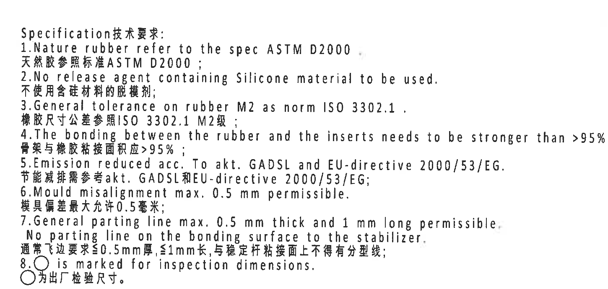

原图位置/视图名称：第 1 页，右中技术要求，bbox `[2710, 1730, 4160, 2420]`。  
object_kind：notes

| 提取项 | 原图数值或文本 | 含义说明 |
|---|---|---|
| 标题 | Specification 技术要求: | 技术要求列表标题。 |
| 1 | Nature rubber refer to the spec ASTM D2000. / 天然胶参照标准 ASTM D2000; | 天然橡胶材料按 ASTM D2000。 |
| 2 | No release agent containing Silicone material to be used. / 不使用含硅材料的脱模剂; | 禁用含硅脱模剂。 |
| 3 | General tolerance on rubber M2 as norm ISO 3302.1. / 橡胶尺寸公差参照 ISO 3302.1 M2级; | 未单独标注的橡胶尺寸按 ISO 3302-1 M2 级公差。 |
| 4 | The bonding between the rubber and the inserts needs to be stronger than >95% rubber break. / 骨架与橡胶粘接面积应 >95%; | 橡胶与嵌件粘接强度/破坏模式要求。 |
| 5 | Emission reduced acc. To akt. GADSL and EU-directive 2000/53/EG. / 节能减排需参考 akt. GADSL 和 EU-directive 2000/53/EG; | 材料/排放法规要求。 |
| 6 | Mould misalignment max. 0.5 mm permissible. / 模具偏差最大允许 0.5 毫米; | 模具错位最大允许值。 |
| 7 | General parting line max. 0.5 mm thick and 1 mm long permissible. No parting line on the bonding surface to the stabilizer. / 通常飞边要求 ≤0.5mm 厚 ≤1mm 长, 与稳定杆粘接面上不得有分型线; | 飞边/分型线控制要求。 |
| 8 | ○ is marked for inspection dimensions. / ○ 为出厂检验尺寸。 | 圆圈标记表示出厂检验尺寸。 |

边界归属说明：裁切完整包含 NOTES 1-8 的中英文内容；未纳入右下 BOM 表字段。

## object_11 - DIN ISO 3302-1 M2 公差表

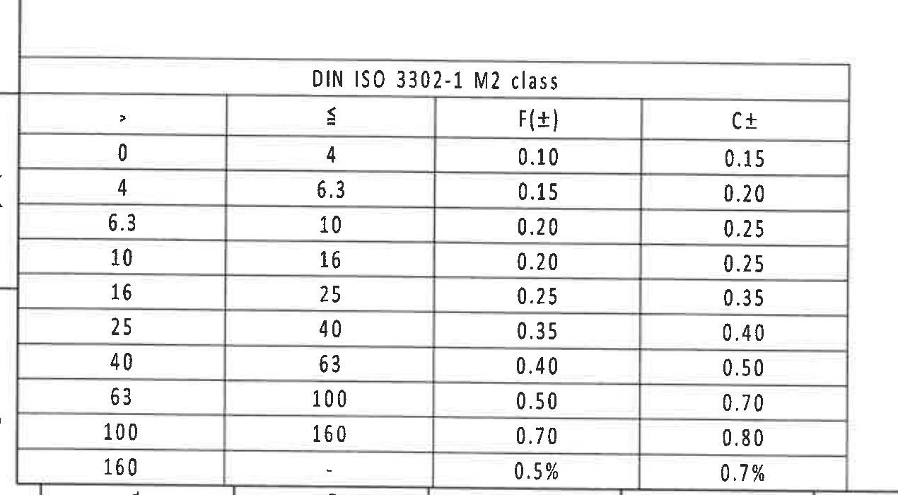

原图位置/视图名称：第 1 页，左下 DIN ISO 3302-1 M2 class 公差表，bbox `[340, 2640, 1610, 3340]`。  
object_kind：table

| DIN ISO 3302-1 M2 class |  | F(±) | C± |
|---:|---:|---:|---:|
| > | ≤ |  |  |
| 0 | 4 | 0.10 | 0.15 |
| 4 | 6.3 | 0.15 | 0.20 |
| 6.3 | 10 | 0.20 | 0.25 |
| 10 | 16 | 0.20 | 0.25 |
| 16 | 25 | 0.25 | 0.35 |
| 25 | 40 | 0.35 | 0.40 |
| 40 | 63 | 0.40 | 0.50 |
| 63 | 100 | 0.50 | 0.70 |
| 100 | 160 | 0.70 | 0.80 |
| 160 | - | 0.5% | 0.7% |

| 提取项 | 原图数值或文本 | 含义说明 |
|---|---|---|
| 标准 | DIN ISO 3302-1 M2 class | 橡胶件未注尺寸公差参考表，与 NOTES 第 3 条一致。 |
| F(±) | 0.10 至 0.70，160 以上为 0.5% | F 类尺寸公差。 |
| C± | 0.15 至 0.80，160 以上为 0.7% | C 类尺寸公差。 |

边界归属说明：重裁后底部 100-160 和 160 以上百分比行完整；左侧少量图框线不属于表格字段。

## object_12 - Reference 参考标准

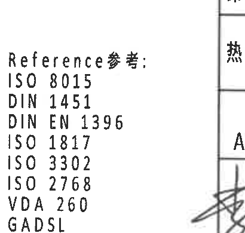

原图位置/视图名称：第 1 页，中下 Reference 参考标准，bbox `[2390, 2850, 2800, 3240]`。  
object_kind：notes

| 提取项 | 原图数值或文本 | 含义说明 |
|---|---|---|
| 标题 | Reference参考: | 参考标准列表标题。 |
| 标准 | ISO 8015 | 参考标准。 |
| 标准 | DIN 1451 | 参考标准。 |
| 标准 | DIN EN 1396 | 参考标准。 |
| 标准 | ISO 1817 | 参考标准。 |
| 标准 | ISO 3302 | 参考标准。 |
| 标准 | ISO 2768 | 参考标准。 |
| 标准 | VDA 260 | 参考标准。 |
| 标准 | GADSL | 参考法规/清单。 |

边界归属说明：右侧少量标题栏竖线为相邻边界，不属于 Reference 列表；全部参考文本完整。

## object_13 - BOM/明细表

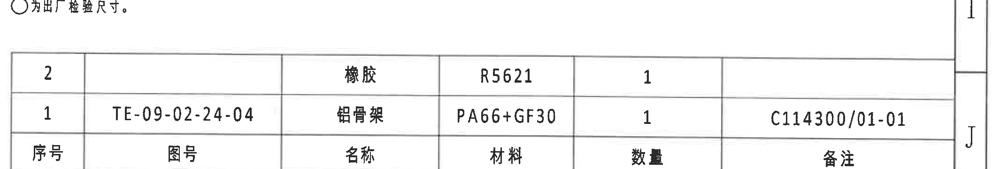

原图位置/视图名称：第 1 页，右下明细表，bbox `[2735, 2380, 4865, 2740]`。  
object_kind：table

| 序号 | 图号 | 名称 | 材料 | 数量 | 备注 |
|---:|---|---|---|---:|---|
| 2 |  | 橡胶 | R5621 | 1 |  |
| 1 | TE-09-02-24-04 | 铝骨架 | PA66+GF30 | 1 | C114300/01-01 |

| 提取项 | 原图数值或文本 | 含义说明 |
|---|---|---|
| 明细 2 | 橡胶 / R5621 / 数量 1 | 橡胶件材料或材料牌号为 R5621。 |
| 明细 1 | TE-09-02-24-04 / 铝骨架 / PA66+GF30 / 数量 1 / C114300/01-01 | 铝骨架/嵌件件号和材料，与上方规格表 H/J 行 part 1 一致。 |

边界归属说明：裁切完整包含 BOM 表头和两行；上缘带入 NOTES 最后一行局部、右缘带入图框坐标 J，均不属于 BOM 字段。

## object_14 - 标题栏

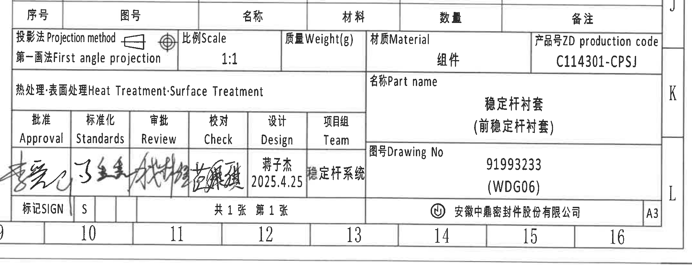

原图位置/视图名称：第 1 页，右下标题栏，bbox `[2720, 2660, 4860, 3480]`。  
object_kind：title_block

| 字段 | 原图数值或文本 | 含义说明 |
|---|---|---|
| Projection method | 第一画法 First angle projection | 投影方法，第一角法。 |
| Scale | 1:1 | 图纸比例。 |
| Weight(g) |  | 标题栏质量栏为空；具体重量见上方规格表 H 行 65.8 g。 |
| Material | 组件 | 材质栏写“组件”，表示装配/组件图。 |
| ZD production code | C114301-CPSJ | 产品号/生产代码。 |
| Heat Treatment; Surface Treatment |  | 热处理/表面处理栏无具体处理内容。 |
| Part name | 稳定杆衬套（前稳定杆衬套） | 零件名称。 |
| Drawing No | 91993233 (WDG06) | 图号。 |
| Approval | 手签 | 批准签名。 |
| Standards | 手签 | 标准化签名。 |
| Review | 手签 | 审批/评审签名。 |
| Check | 手签 | 校对签名。 |
| Design | 蒋子杰 / 2025.4.25 | 设计者和日期。 |
| Team | 稳定杆系统 | 项目组。 |
| SIGN | S | 标记栏。 |
| Sheet | 共 1 张 第 1 张 | 图纸页数。 |
| Company | 安徽中鼎密封件股份有限公司 | 出图公司。 |
| Size | A3 | 图幅。 |

边界归属说明：裁切完整包含标题栏主体、公司名和 A3 图幅；顶部带入上方 BOM 表头一行，右侧带入图框坐标 J/K/L，底部带入图框坐标数字 10-16，这些均为图框/相邻表格内容，不作为标题栏字段。

## 裁切检查记录

| 对象 | 图片路径 | 检查结论 |
|---|---|---|
| object_1 | outputs/20C114301_assets/images/object_1.png | 完整包含规格表所有列、行、材料字段和合并单元格；无尺寸文字被裁。 |
| object_2 | outputs/20C114301_assets/images/object_2.png | 完整包含修订履历字段和两条记录；右缘图框坐标不提取。 |
| object_3 | outputs/20C114301_assets/images/object_3.png | 完整包含 ØEر0.3、(0.5)、标识引线和文字；无相邻视图片段。 |
| object_4 | outputs/20C114301_assets/images/object_4.png | 完整包含 A-A 剖切标识、29.7±0.3、型号标识引线。 |
| object_5 | outputs/20C114301_assets/images/object_5.png | 完整包含 A-A、1:1、(0.75)、(RIR)、(RAR) 及引线；已重裁排除 B-B 片段。 |
| object_6 | outputs/20C114301_assets/images/object_6.png | 完整包含 B-B、1:1、(37.99)、(B)、T2±0.30、T1±0.30；右缘右视图片段仅作边界残留，不提取。 |
| object_7 | outputs/20C114301_assets/images/object_7.png | 完整包含右侧正视图主体和 B-B 剖切标识；已排除 B-B 尺寸链，左下说明文字因跨界只保留归属部分。 |
| object_8 | outputs/20C114301_assets/images/object_8.png | 完整包含 42±0.3、54.9±0.3、60.9±0.3 的尺寸线、箭头和文字。 |
| object_9 | outputs/20C114301_assets/images/object_9.png | 完整包含等轴主体和 X/Y/Z 坐标轴；无 NOTES/BOM 文字混入。 |
| object_10 | outputs/20C114301_assets/images/object_10.png | 完整包含 Specification 技术要求 1-8。 |
| object_11 | outputs/20C114301_assets/images/object_11.png | 完整包含 DIN ISO 3302-1 M2 公差表所有行，包括 160 以上百分比行。 |
| object_12 | outputs/20C114301_assets/images/object_12.png | 完整包含 Reference 参考列表；右侧少量标题栏边界不提取。 |
| object_13 | outputs/20C114301_assets/images/object_13.png | 完整包含 BOM 表头和两行记录；上缘 NOTES 残留、右缘图框坐标不提取。 |
| object_14 | outputs/20C114301_assets/images/object_14.png | 完整包含标题栏主体、签名区、公司名和 A3；相邻 BOM 表头及图框坐标不提取。 |
