# 20C114302.pdf 内容识别与裁切提取

坐标基准：PDF 已先渲染为整页 PNG `outputs/20C114302_assets/images/page_1.png`，尺寸 4959 × 3505 px；以下 bbox 均为该整页 PNG 上的 `[x0, y0, x1, y1]`。

## object_1 - 修订履历表

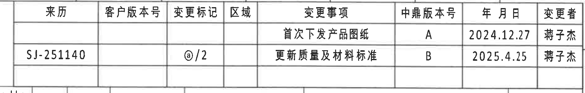

- 原图位置/视图名称：修订履历表；object_kind=`table`；bbox=[2885, 160, 4765, 460]

### 原表格还原
| 来源 | 客户版本号 | 变更标记 | 区域 | 变更事项 | 中鼎版本号 | 年 月 日 | 变更者 |
| --- | --- | --- | --- | --- | --- | --- | --- |
|  |  |  |  | 首次下发产品图纸 | A | 2024.12.27 | 蒋子杰 |
| SJ-251140 |  | @/2 |  | 更新质量及材料标准 | B | 2025.4.25 | 蒋子杰 |

### 提取表格
| 提取项 | 原图数值或文本 | 含义说明 |
| --- | --- | --- |
| 表头 | 来源 / 客户版本号 / 变更标记 / 区域 / 变更事项 / 中鼎版本号 / 年 月 日 / 变更者 | 修订履历字段。 |
| A版记录 | 首次下发产品图纸；中鼎版本号 A；2024.12.27；蒋子杰 | 首次下发图纸记录。 |
| B版记录 | 来源 SJ-251140；变更标记 @/2；更新质量及材料标准；中鼎版本号 B；2025.4.25；蒋子杰 | 更新质量及材料标准记录。 |

### 边界归属说明
位于图纸右上角 A-B 网格附近；裁切只包含修订履历表，不提取其下方参数表内容。

## object_2 - Variant 参数总表

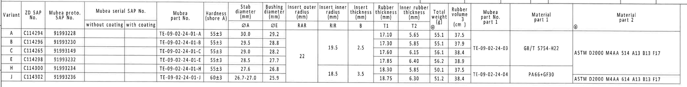

- 原图位置/视图名称：Variant 参数总表；object_kind=`table`；bbox=[360, 420, 4560, 955]

### 原表格还原
| Variant | ZD SAP No. | Mubea proto. SAP No. | Mubea serial SAP No. without coating | Mubea serial SAP No. with coating | Mubea part No. | Hardness (shore A) | Stab diameter ØA (mm) | Bushing diameter ØE (mm) | Insert outer radius RAR (mm) | Insert inner radius RIR (mm) | Insert thickness B (mm) | Rubber thickness T1 (mm) | Inner rubber thickness T2 (mm) | Total weight @ (g) | Rubber volume (cm³) | Mubea part No. part 1 | Material part 1 | Material part 2 |
| --- | --- | --- | --- | --- | --- | --- | --- | --- | --- | --- | --- | --- | --- | --- | --- | --- | --- | --- |
| A | C114294 | 91993228 |  |  | TE-09-02-24-01-A | 55±3 | 30.0 | 29.2 | 22（合并单元格判读） | 19.5（合并单元格判读） | 2.5（合并单元格判读） | 17.10 | 5.65 | 55.1 | 37.5 | TE-09-02-24-03（合并单元格） | GB/T 5754-H22（合并单元格） | ASTM D2000 M4AA 514 A13 B13 F17（合并单元格） |
| B | C114296 | 91993230 |  |  | TE-09-02-24-01-B | 55±3 | 29.5 | 28.8 | 22（合并单元格判读） | 19.5（合并单元格判读） | 2.5（合并单元格判读） | 17.30 | 5.85 | 55.1 | 37.9 | TE-09-02-24-03（合并单元格） | GB/T 5754-H22（合并单元格） | ASTM D2000 M4AA 514 A13 B13 F17（合并单元格） |
| C | C114265 | 91993149 |  |  | TE-09-02-24-01-C | 55±3 | 29.0 | 28.2 | 22（合并单元格判读） | 19.5（合并单元格判读） | 2.5（合并单元格判读） | 17.60 | 6.15 | 56.1 | 38.4 | TE-09-02-24-03（合并单元格） | GB/T 5754-H22（合并单元格） | ASTM D2000 M4AA 514 A13 B13 F17（合并单元格） |
| E | C114298 | 91993232 |  |  | TE-09-02-24-01-E | 55±3 | 28.5 | 27.7 | 22（合并单元格判读） | 19.5（合并单元格判读） | 2.5（合并单元格判读） | 17.85 | 6.40 | 56.2 | 38.9 | TE-09-02-24-03（合并单元格） | GB/T 5754-H22（合并单元格） | ASTM D2000 M4AA 514 A13 B13 F17（合并单元格） |
| H | C114300 | 91993234 |  |  | TE-09-02-24-01-H | 55±3 | 27.6 | 26.8 |  | 18.5（合并单元格） | 3.5（合并单元格） | 18.30 | 5.85 | 50.1 | 37.5 | TE-09-02-24-04（合并单元格） | PA66+GF30（合并单元格） | ASTM D2000 M4AA 614 A13 B13 F17（合并单元格） |
| J | C114302 | 91993236 |  |  | TE-09-02-24-01-J | 60±3 | 26.7-27.0 | 25.9 |  | 18.5（合并单元格） | 3.5（合并单元格） | 18.75 | 6.30 | 51.2 | 38.4 | TE-09-02-24-04（合并单元格） | PA66+GF30（合并单元格） | ASTM D2000 M4AA 614 A13 B13 F17（合并单元格） |

说明：原图存在跨行合并单元格。Markdown 无合并单元格语法，表中以“合并单元格/合并单元格判读”标记其原图跨行适用关系；空白字段保持为空。

### 提取表格
| 提取项 | 原图数值或文本 | 含义说明 |
| --- | --- | --- |
| 适用变体 | Variant J / C114302 / 91993236 | 标题栏图号对应当前图纸的 Variant J。 |
| 关键尺寸字段 | ØA、ØE、RAR、RIR、B、T1、T2、总重、体积 | 该表给出加工视图中代号尺寸的数值来源。 |
| Variant J 尺寸 | Hardness 60±3；ØA 26.7-27.0；ØE 25.9；RIR 18.5；B 3.5；T1 18.75；T2 6.30；Weight 51.2 g；Volume 38.4 cm³ | 当前产品的尺寸与参数。 |

### 边界归属说明
位于图纸上方 B-C 网格；裁切为完整参数表，未提取下方加工视图内容。合并单元格在 Markdown 与 entities 中以“合并单元格/合并单元格判读”说明。

## object_3 - 左上正视加工视图

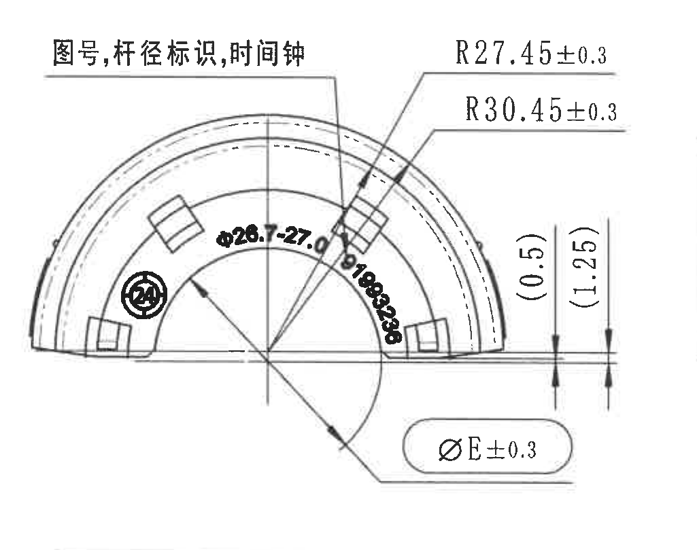

- 原图位置/视图名称：左上正视加工视图；object_kind=`view`；bbox=[430, 1035, 1455, 1845]

### 提取表格
| 提取项 | 原图数值或文本 | 含义说明 |
| --- | --- | --- |
| 视图文字 | 图号,杆径标识,时间钟 | 标注该正视图上的图号、杆径和时间钟类永久标识位置。 |
| 半径 | R27.45±0.3 | 上方引线指向内侧弧形轮廓的半径尺寸，公差±0.3。 |
| 半径 | R30.45±0.3 | 上方引线指向外侧弧形轮廓的半径尺寸，公差±0.3。 |
| 直径/杆径 | φ26.7-27.0 | 半圆内侧沿弧标注的杆径范围；与参数表 Variant J 的 ØA 对应。 |
| 参考尺寸 | (0.5) | 右侧小台阶/间隙的参考尺寸，括号表示参考值，不作为主要制造控制尺寸。 |
| 参考尺寸 | (1.25) | 右侧相邻高度/间隙参考尺寸，括号表示参考值。 |
| 直径 | ØE±0.3 | 底部椭圆框内的衬套直径尺寸，按参数表选择 ØE；圆/椭圆框表示出厂检验尺寸。 |
| 标识 | 圆内24 | 视图内圆形标识，与时间钟/检验标识区域相关。 |

### 边界归属说明
位于 D-F 网格左侧；边界保留所有半圆外形、弧向引线、右侧参考尺寸和底部 ØE 标注，不包含中间侧视图内容。

## object_4 - 中上侧视加工视图

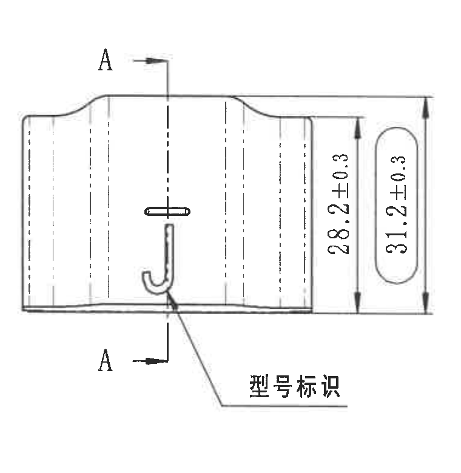

- 原图位置/视图名称：中上侧视加工视图；object_kind=`view`；bbox=[1425, 1050, 2185, 1830]

### 提取表格
| 提取项 | 原图数值或文本 | 含义说明 |
| --- | --- | --- |
| 剖切标记 | A-A | 上下箭头给出 A-A 剖切位置，剖面见 object_5。 |
| 高度 | 28.2±0.3 | 侧视图右侧竖向尺寸，表示局部高度/外形高度，公差±0.3。 |
| 总高度/检验尺寸 | 31.2±0.3 | 右侧椭圆框竖向总高度，公差±0.3，按图示为检验尺寸。 |
| 文字说明 | 型号标识 | 引线指向侧面 J 形/型号标识区域。 |

### 边界归属说明
位于 D-F 网格中左；右边界在 A-A 剖面之前结束，未提取 A-A 剖面内容。

## object_5 - A-A 剖面视图

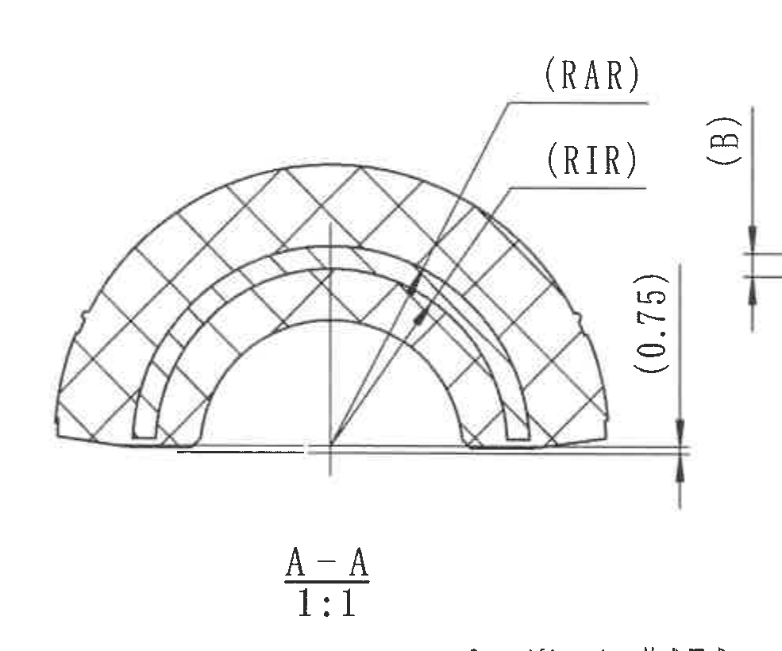

- 原图位置/视图名称：A-A 剖面视图；object_kind=`section`；bbox=[2160, 1005, 3145, 1825]

### 提取表格
| 提取项 | 原图数值或文本 | 含义说明 |
| --- | --- | --- |
| 剖面名 | A-A 1:1 | A-A 剖面，比例1:1。 |
| 弧向尺寸代号 | (RAR) | 外侧嵌件半径代号，数值由顶部参数表按 Variant 选择；括号表示参考/代号标注。 |
| 弧向尺寸代号 | (RIR) | 内侧嵌件半径代号，Variant J 在参数表中 RIR=18.5（合并单元格）。 |
| 参考厚度代号 | (B) | 嵌件厚度代号，Variant J 在参数表中 B=3.5（合并单元格）。 |
| 参考尺寸 | (0.75) | 右侧竖向参考尺寸，括号表示参考值。 |

### 边界归属说明
位于 D-F 网格中部；右侧 (B)/(0.75) 参考尺寸线完整保留，极右侧相邻线段仅作为该参考尺寸边界附近的残边，不归入 B-B 剖面提取。

## object_6 - B-B 剖面视图

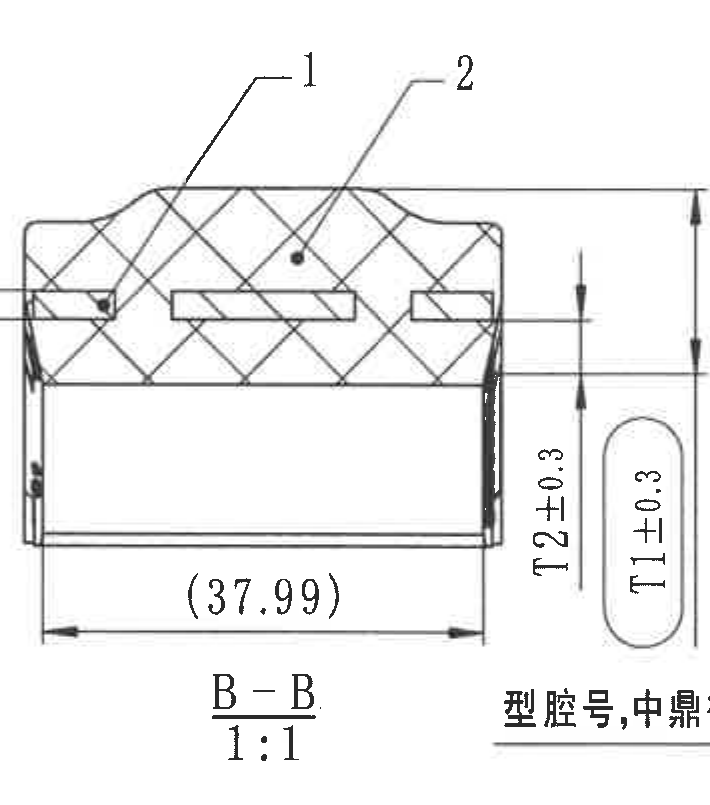

- 原图位置/视图名称：B-B 剖面视图；object_kind=`section`；bbox=[3140, 1035, 3850, 1840]

### 提取表格
| 提取项 | 原图数值或文本 | 含义说明 |
| --- | --- | --- |
| 剖面名 | B-B 1:1 | B-B 剖面，比例1:1。 |
| 件号引出 | 1 | 引线指向骨架/嵌件区域，对应 BOM 序号1。 |
| 件号引出 | 2 | 引线指向橡胶区域，对应 BOM 序号2。 |
| 参考长度 | (37.99) | 剖面底部横向参考尺寸，括号表示参考值。 |
| 厚度 | T2±0.3 | 内橡胶厚度代号，Variant J 在参数表中 T2=6.30，图示公差±0.3。 |
| 厚度/检验尺寸 | T1±0.3 | 橡胶厚度代号，Variant J 在参数表中 T1=18.75，椭圆框表示检验尺寸，公差±0.3。 |

### 边界归属说明
位于 D-F 网格中右；为保留 T1±0.3 完整椭圆框，底部右侧不可避免接近右正视说明文字，文字片段不作为 B-B 内容提取。

## object_7 - 右上正视加工视图

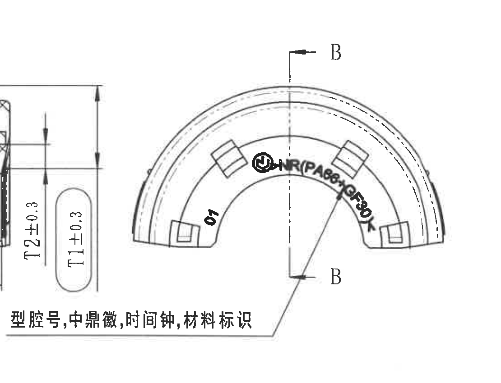

- 原图位置/视图名称：右上正视加工视图；object_kind=`view`；bbox=[3620, 1035, 4730, 1885]

### 提取表格
| 提取项 | 原图数值或文本 | 含义说明 |
| --- | --- | --- |
| 剖切标记 | B-B | 上下 B 标记给出 B-B 剖切位置，剖面见 object_6。 |
| 标识文字 | NR(PA66+GF30) | 弧形区域的材料/组合标识，表示天然橡胶与 PA66+GF30 骨架材料信息。 |
| 标识文字 | 01 | 视图左内侧的型腔/版本类标识。 |
| 文字说明 | 型号,中鼎徽,时间钟,材料标识 | 底部说明文字与引线指向该正视图内的标识区域。 |

### 边界归属说明
位于 D-F 网格右侧；底部说明文字与引线完整保留。左侧可见的 T1/T2 标注残片属于相邻 B-B 剖面，仅作为边缘残片排除。

## object_8 - 左下展开/俯视加工视图

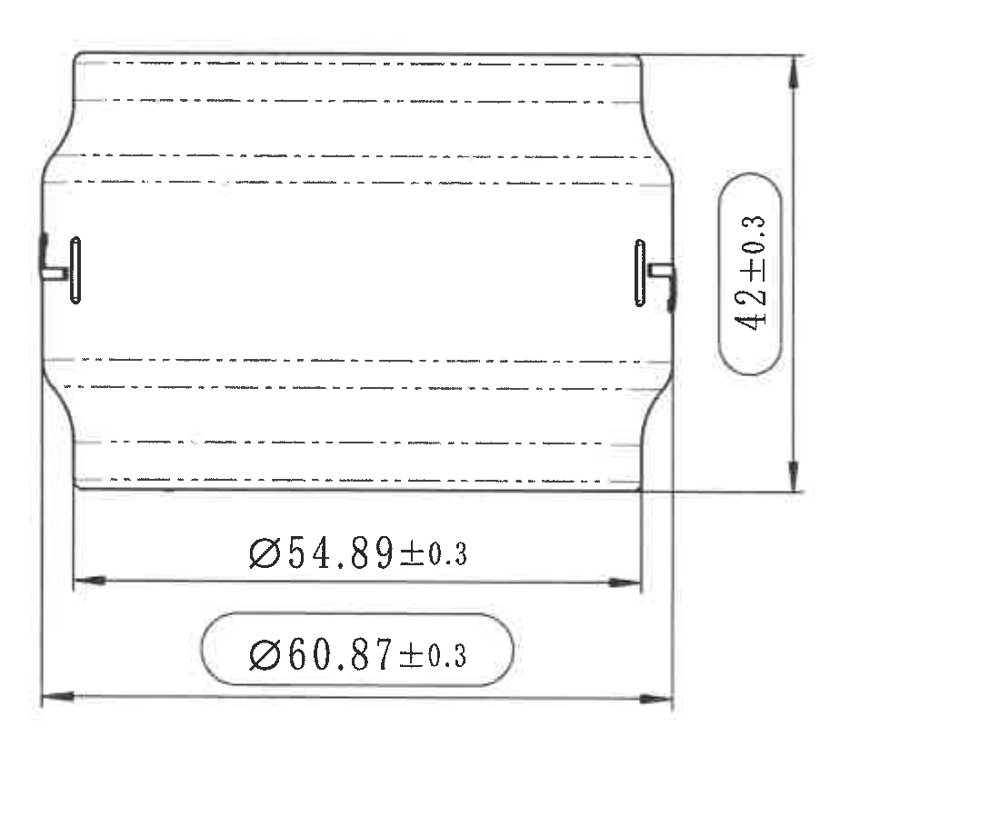

- 原图位置/视图名称：左下展开/俯视加工视图；object_kind=`view`；bbox=[430, 1800, 1530, 2720]

### 提取表格
| 提取项 | 原图数值或文本 | 含义说明 |
| --- | --- | --- |
| 宽度/高度 | 42±0.3 | 右侧竖向总宽度/高度尺寸，公差±0.3。 |
| 直径 | Ø54.89±0.3 | 下方内侧横向直径尺寸，公差±0.3。 |
| 直径/检验尺寸 | Ø60.87±0.3 | 下方椭圆框内外侧直径尺寸，公差±0.3，按注释为检验尺寸。 |

### 边界归属说明
位于 G-J 网格左侧；完整包含左右外形边、竖向和横向尺寸线，不包含左下公差表。

## object_9 - 等轴测外观视图

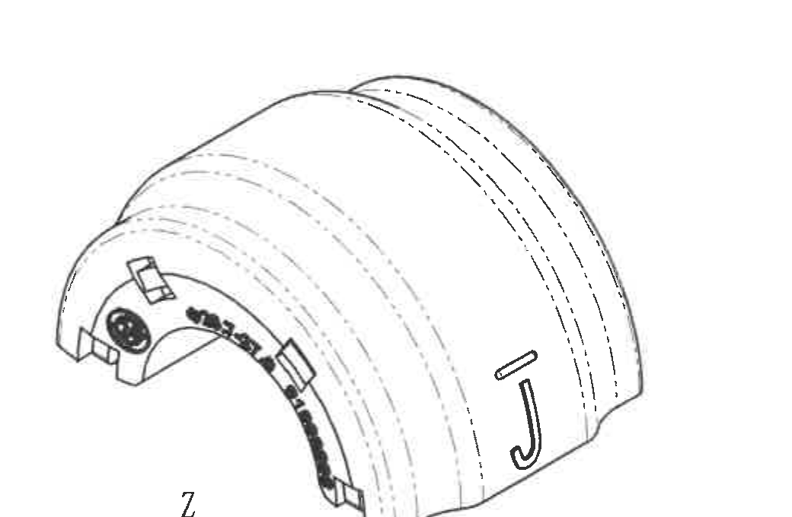

- 原图位置/视图名称：等轴测外观视图；object_kind=`view`；bbox=[1690, 1810, 2730, 2490]

### 提取表格
| 提取项 | 原图数值或文本 | 含义说明 |
| --- | --- | --- |
| 视图类型 | 等轴测外观视图 | 显示零件三维外形、弧面、槽孔和 J 形标识位置。 |
| 尺寸 | 无独立尺寸标注 | 该裁切中未出现新的尺寸线、箭头或数值；尺寸由相邻正视/剖视图控制。 |

### 边界归属说明
位于 G-I 网格中部；裁切仅保留零件三维外观，不包含右侧 NOTES 与下方坐标轴。

## object_10 - Specification 技术要求

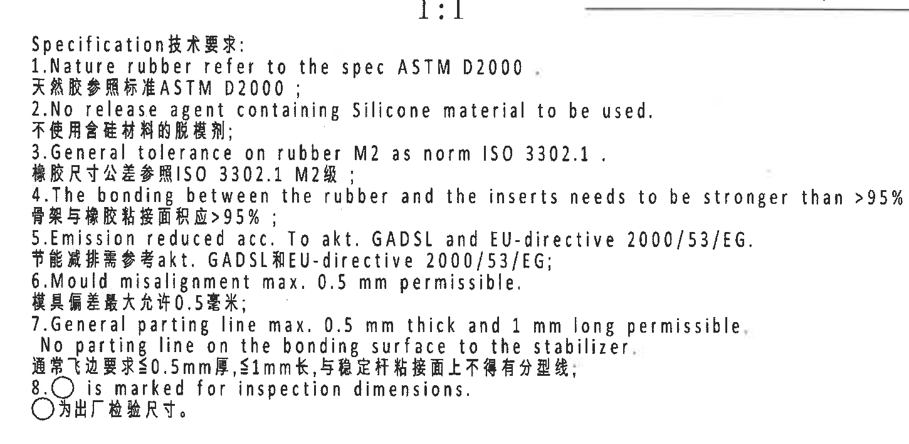

- 原图位置/视图名称：Specification 技术要求；object_kind=`notes`；bbox=[2700, 1765, 4150, 2475]

### 提取表格
| 提取项 | 原图数值或文本 | 含义说明 |
| --- | --- | --- |
| 技术要求1 | Specification技术要求: | 按原图中英双语顺序转录。 |
| 技术要求2 | 1.Nature rubber refer to the spec ASTM D2000. / 天然胶参照标准ASTM D2000; | 按原图中英双语顺序转录。 |
| 技术要求3 | 2.No release agent containing Silicone material to be used. / 不使用含硅材料的脱模剂; | 按原图中英双语顺序转录。 |
| 技术要求4 | 3.General tolerance on rubber M2 as norm ISO 3302.1. / 橡胶尺寸公差参照ISO 3302.1 M2级; | 按原图中英双语顺序转录。 |
| 技术要求5 | 4.The bonding between the rubber and the inserts needs to be stronger than >95% rubber break. / 骨架与橡胶粘接面积应>95%; | 按原图中英双语顺序转录。 |
| 技术要求6 | 5.Emission reduced acc. To akt. GADSL and EU-directive 2000/53/EG. / 节能减排需参考akt. GADSL和EU-directive 2000/53/EG; | 按原图中英双语顺序转录。 |
| 技术要求7 | 6.Mould misalignment max. 0.5 mm permissible. / 模具偏差最大允许0.5毫米; | 按原图中英双语顺序转录。 |
| 技术要求8 | 7.General parting line max. 0.5 mm thick and 1 mm long permissible. No parting line on the bonding surface to the stabilizer. / 通常飞边要求≤0.5mm厚,≤1mm长,与稳定杆粘接面上不得有分型线; | 按原图中英双语顺序转录。 |
| 技术要求9 | 8.○ is marked for inspection dimensions. / ○为出厂检验尺寸。 | 按原图中英双语顺序转录。 |

### 边界归属说明
位于 G-I 网格右中；裁切停在第8条技术要求之后，不提取下方 BOM 表。

## object_11 - DIN ISO 3302-1 M2 class 公差表

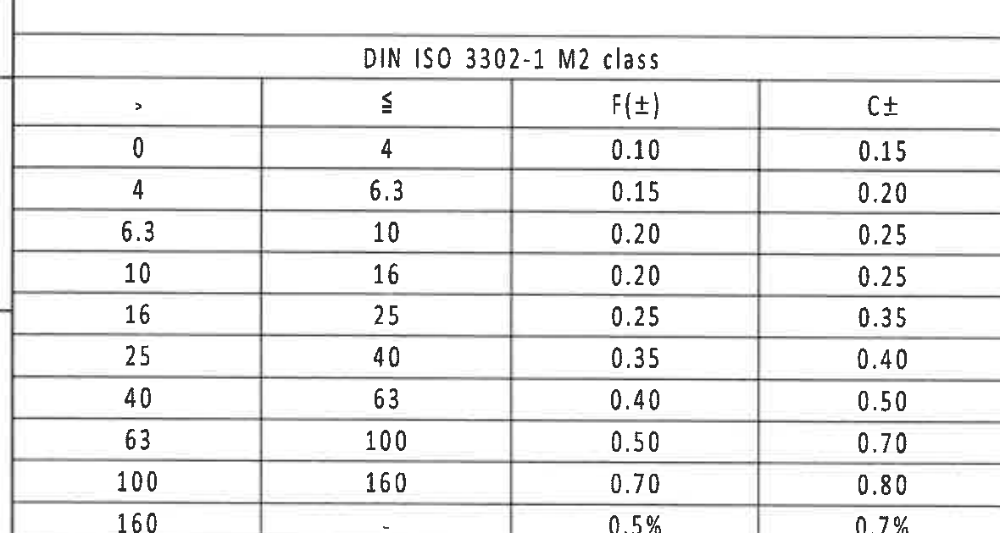

- 原图位置/视图名称：DIN ISO 3302-1 M2 class 公差表；object_kind=`table`；bbox=[350, 2685, 1530, 3315]

### 原表格还原
| > | ≤ | F(±) | C± |
| --- | --- | --- | --- |
| 0 | 4 | 0.10 | 0.15 |
| 4 | 6.3 | 0.15 | 0.20 |
| 6.3 | 10 | 0.20 | 0.25 |
| 10 | 16 | 0.20 | 0.25 |
| 16 | 25 | 0.25 | 0.35 |
| 25 | 40 | 0.35 | 0.40 |
| 40 | 63 | 0.40 | 0.50 |
| 63 | 100 | 0.50 | 0.70 |
| 100 | 160 | 0.70 | 0.80 |
| 160 | - | 0.5% | 0.7% |

### 提取表格
| 提取项 | 原图数值或文本 | 含义说明 |
| --- | --- | --- |
| 表名 | DIN ISO 3302-1 M2 class | 橡胶尺寸一般公差标准表。 |
| 列 | > / ≤ / F(±) / C± | 尺寸范围下限、上限及 F/C 两类公差。 |
| 最后一行 | >160；≤ -；F(±)=0.5%；C±=0.7% | 大于160的尺寸按百分比公差。 |

### 边界归属说明
位于 J-L 网格左下；裁切完整包含表头、外框和全部 10 行公差数据。

## object_12 - BOM 明细表

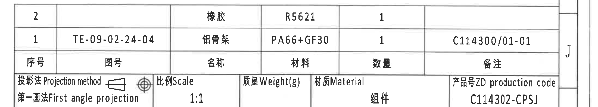

- 原图位置/视图名称：BOM 明细表；object_kind=`table`；bbox=[2700, 2470, 4900, 2865]

### 原表格还原
| 序号 | 图号 | 名称 | 材料 | 数量 | 备注 |
| --- | --- | --- | --- | --- | --- |
| 2 |  | 橡胶 | R5621 | 1 |  |
| 1 | TE-09-02-24-04 | 铝骨架 | PA66+GF30 | 1 | C114300/01-01 |

### 提取表格
| 提取项 | 原图数值或文本 | 含义说明 |
| --- | --- | --- |
| BOM 表头 | 序号 / 图号 / 名称 / 材料 / 数量 / 备注 | 零件明细字段。 |
| 序号2 | 橡胶；R5621；数量1 | 橡胶件。 |
| 序号1 | TE-09-02-24-04；铝骨架；PA66+GF30；数量1；备注 C114300/01-01 | 骨架件。 |

### 边界归属说明
位于 I-J 网格右下；裁切仅包含 BOM 明细表，不包含上方 NOTES 与下方标题栏字段。

## object_13 - 标题栏

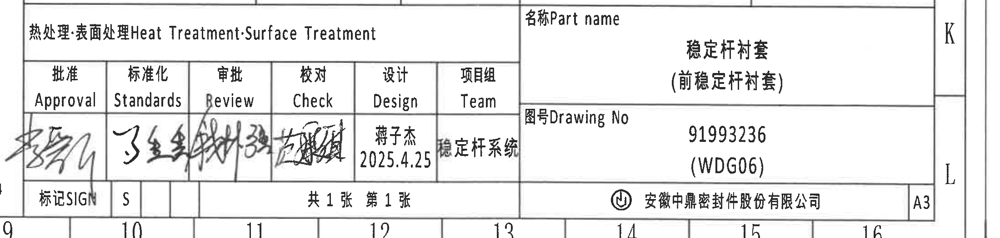

- 原图位置/视图名称：标题栏；object_kind=`title_block`；bbox=[2700, 2860, 4900, 3385]

### 原表格还原
| 字段 | 原图文本 |
| --- | --- |
| 投影法 / Projection method | 第一画法 / First angle projection |
| 比例 / Scale | 1:1 |
| 质量 / Weight(g) |  |
| 材质 / Material | 组件 |
| 产品号 / ZD production code | C114302-CPSJ |
| 热处理;表面处理 / Heat Treatment;Surface Treatment |  |
| 名称 / Part name | 稳定杆衬套（前稳定杆衬套） |
| 图号 / Drawing No | 91993236 (WDG06) |
| 批准 / Approval | 手签名 |
| 标准化 / Standards | 手签名 |
| 审批 / Review | 手签名 |
| 校对 / Check | 手签名 |
| 设计 / Design | 蒋子杰 2025.4.25 |
| 项目组 / Team | 稳定杆系统 |
| 标记 / SIGN | S |
| 页数 | 共1张 第1张 |
| 公司 | 安徽中鼎密封件股份有限公司 |
| 图幅 | A3 |

### 提取表格
| 提取项 | 原图数值或文本 | 含义说明 |
| --- | --- | --- |
| 投影法 | 第一画法 First angle projection | 图纸投影方式。 |
| 比例 | 1:1 | 标题栏比例。 |
| 产品号 | C114302-CPSJ | ZD production code。 |
| 名称 | 稳定杆衬套（前稳定杆衬套） | Part name。 |
| 图号 | 91993236 (WDG06) | Drawing No。 |
| 设计 | 蒋子杰 2025.4.25 | 设计者与日期。 |
| 公司/图幅 | 安徽中鼎密封件股份有限公司 / A3 | 出图公司与图幅。 |

### 边界归属说明
位于 J-L 网格右下；裁切从投影法/比例栏到公司和 A3 栏，未包含上方 BOM 行。

## object_14 - Reference 参考清单

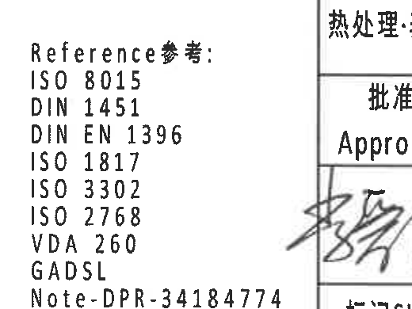

- 原图位置/视图名称：Reference 参考清单；object_kind=`notes`；bbox=[2350, 2900, 2870, 3290]

### 提取表格
| 提取项 | 原图数值或文本 | 含义说明 |
| --- | --- | --- |
| Reference参考 | ISO 8015; DIN 1451; DIN EN 1396; ISO 1817; ISO 3302; ISO 2768; VDA 260; GADSL; Note-DPR-34184774 | 图纸引用标准/参考文件清单。 |

### 边界归属说明
位于 K-L 网格中下；裁切只包含参考标准清单。

## object_15 - 局部坐标方向视图

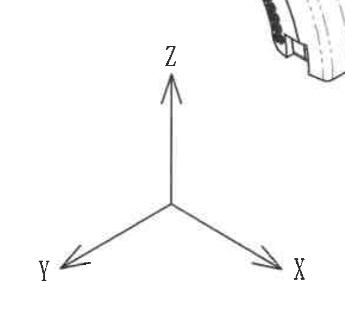

- 原图位置/视图名称：局部坐标方向视图；object_kind=`detail`；bbox=[1650, 2380, 2230, 2940]

### 提取表格
| 提取项 | 原图数值或文本 | 含义说明 |
| --- | --- | --- |
| 坐标轴 | Z | 局部方向指示，Z 轴向上。 |
| 坐标轴 | Y | 局部方向指示，Y 轴向左下。 |
| 坐标轴 | X | 局部方向指示，X 轴向右下。 |

### 边界归属说明
位于 I-K 网格中部；裁切仅保留三向坐标箭头，不包含等轴测图和标题栏。

## 裁切检查记录

| 对象 | 图片 | 检查结论 |
| --- | --- | --- |
| page_1 | outputs/20C114302_assets/images/page_1.png | 整页 PNG 完整，4959×3505 px，作为全部 bbox 坐标基准。 |
| object_1 | outputs/20C114302_assets/images/object_1.png | 修订履历表外框、表头和两条记录完整；未混入参数表。 |
| object_2 | outputs/20C114302_assets/images/object_2.png | 参数表外框、全部列头和 A/B/C/E/H/J 行完整；不含下方视图。 |
| object_3 | outputs/20C114302_assets/images/object_3.png | 左上正视图完整包含半圆外形、R27.45、R30.45、φ26.7-27.0、(0.5)、(1.25)、ØE±0.3。 |
| object_4 | outputs/20C114302_assets/images/object_4.png | 侧视图完整包含 A-A 剖切标记、28.2±0.3、31.2±0.3、型号标识；未混入 A-A 剖面。 |
| object_5 | outputs/20C114302_assets/images/object_5.png | A-A 剖面完整包含 (RAR)、(RIR)、(B)、(0.75) 和剖面名；右边缘的微小线段不提取为 B-B 内容。 |
| object_6 | outputs/20C114302_assets/images/object_6.png | B-B 剖面完整包含件号1/2、(37.99)、T2±0.3、T1±0.3 和剖面名；底部右侧相邻说明文字残片不提取。 |
| object_7 | outputs/20C114302_assets/images/object_7.png | 右上正视图完整包含 B-B 标记、弧形材料/徽标文字和底部说明；左侧 T1/T2 残片属于相邻 B-B，已在归属中排除。 |
| object_8 | outputs/20C114302_assets/images/object_8.png | 展开/俯视图完整包含 42±0.3、Ø54.89±0.3、Ø60.87±0.3 及箭头。 |
| object_9 | outputs/20C114302_assets/images/object_9.png | 等轴测视图本体完整；未带入右侧 NOTES 和下方坐标轴。 |
| object_10 | outputs/20C114302_assets/images/object_10.png | 技术要求第1-8条完整；未带入下方 BOM 表。 |
| object_11 | outputs/20C114302_assets/images/object_11.png | DIN ISO 3302-1 M2 公差表完整包含表头、外框和全部行。 |
| object_12 | outputs/20C114302_assets/images/object_12.png | BOM 明细表完整包含两条物料行和表头；未混入标题栏。 |
| object_13 | outputs/20C114302_assets/images/object_13.png | 标题栏完整包含投影法、比例、名称、图号、签署栏、公司栏和 A3。 |
| object_14 | outputs/20C114302_assets/images/object_14.png | Reference 参考清单文字完整。 |
| object_15 | outputs/20C114302_assets/images/object_15.png | X/Y/Z 坐标方向箭头完整；不含等轴测本体。 |
