# 20C114303 PDF 内容识别结果

源文件: `input/20C114303.pdf`  
整页渲染 PNG: `outputs/20C114303_assets/images/page_1.png`  
整页像素尺寸: 4959 x 3505  
说明: bbox 使用整页 PNG 像素坐标 `[x0, y0, x1, y1]`。本文件按原图从上到下、从左到右的结构顺序列出裁切对象。

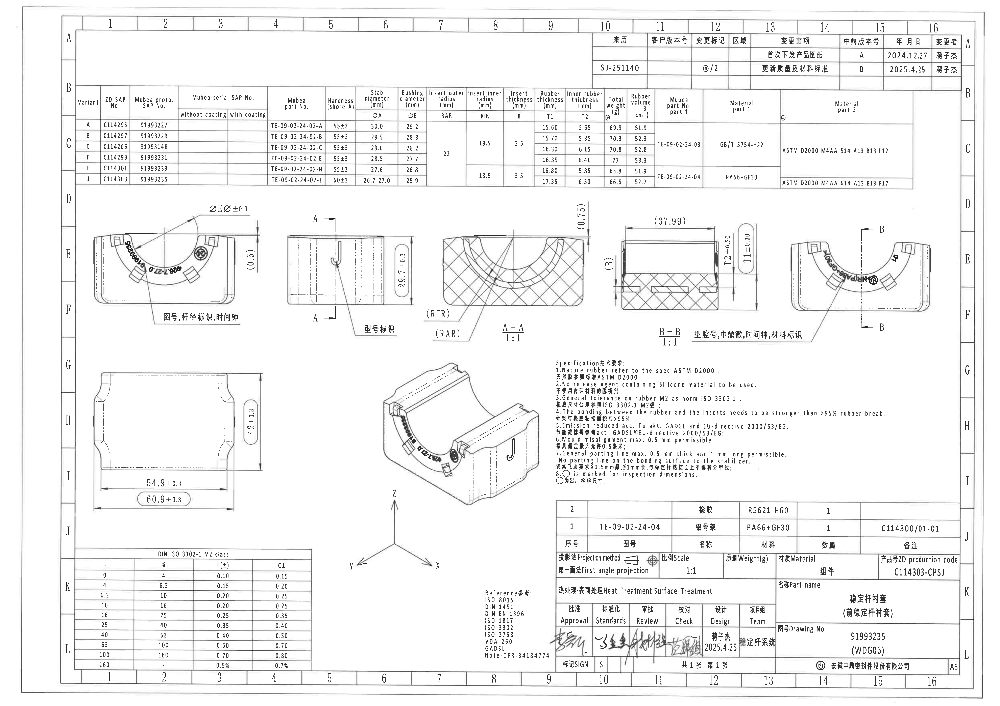

## 裁切对象与提取内容

### object_1 - 修订履历表 / 变更记录

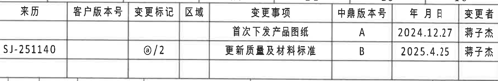

- 原图位置/视图名称: 页 1 上方右侧，图框坐标约 A10-A16 / B10-B16；bbox `[2968, 157, 4763, 452]`。
- object_kind: `table`

| 来历 | 客户版本号 | 变更标记 | 区域 | 变更事项 | 中鼎版本号 | 年 月 日 | 变更者 |
|---|---|---|---|---|---|---|---|
|  |  |  |  | 首次下发产品图纸 | A | 2024.12.27 | 蒋子杰 |
| SJ-251140 |  | @/2 |  | 更新质量及材料标准 | B | 2025.4.25 | 蒋子杰 |

| 提取项 | 原图数值或文本 | 含义说明 |
|---|---|---|
| 中鼎版本号 A | 首次下发产品图纸 / 2024.12.27 / 蒋子杰 | 首次发布版本记录。 |
| 中鼎版本号 B | SJ-251140 / @/2 / 更新质量及材料标准 / 2025.4.25 / 蒋子杰 | 当前修订记录，说明质量及材料标准更新。 |

边界归属说明: 本裁切只归属修订履历表；下边界可见的相邻横线不作为下一张参数表内容提取。

### object_2 - 产品变型参数表

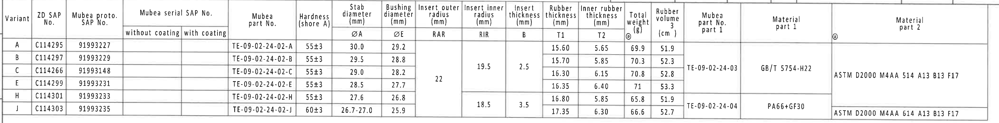

- 原图位置/视图名称: 页 1 上方横向主参数表，图框坐标约 B1-C16 / D1-D16；bbox `[365, 430, 4575, 950]`。
- object_kind: `table`

| Variant | ZD SAP No. | Mubea proto. SAP No. | Mubea serial SAP No. without coating | Mubea serial SAP No. with coating | Mubea part No. | Hardness (shore A) | ØA Stab diameter (mm) | ØE Bushing diameter (mm) | RAR Insert outer radius (mm) | RIR Insert inner radius (mm) | B Insert thickness (mm) | T1 Rubber thickness (mm) | T2 Inner rubber thickness (mm) | Total weight @ (g) | Rubber volume (cm³) | Mubea part No. part 1 | Material part 1 @ | Material part 2 |
|---|---|---|---|---|---|---|---:|---:|---|---|---|---:|---:|---:|---:|---|---|---|
| A | C114295 | 91993227 |  |  | TE-09-02-24-02-A | 55±3 | 30.0 | 29.2 | 22 (合并 A-E) | 19.5 (合并 A-E) | 2.5 (合并 A-E) | 15.60 | 5.65 | 69.9 | 51.9 | TE-09-02-24-03 (合并 A-E) | GB/T 5754-H22 (合并 A-E) | ASTM D2000 M4AA 514 A13 B13 F17 (合并 A-E) |
| B | C114297 | 91993229 |  |  | TE-09-02-24-02-B | 55±3 | 29.5 | 28.8 | 同上合并 | 同上合并 | 同上合并 | 15.70 | 5.85 | 70.3 | 52.3 | 同上合并 | 同上合并 | 同上合并 |
| C | C114266 | 91993148 |  |  | TE-09-02-24-02-C | 55±3 | 29.0 | 28.2 | 同上合并 | 同上合并 | 同上合并 | 16.30 | 6.15 | 70.8 | 52.8 | 同上合并 | 同上合并 | 同上合并 |
| E | C114299 | 91993231 |  |  | TE-09-02-24-02-E | 55±3 | 28.5 | 27.7 | 同上合并 | 同上合并 | 同上合并 | 16.35 | 6.40 | 71 | 53.3 | 同上合并 | 同上合并 | 同上合并 |
| H | C114301 | 91993233 |  |  | TE-09-02-24-02-H | 55±3 | 27.6 | 26.8 |  | 18.5 (合并 H-J) | 3.5 (合并 H-J) | 16.80 | 5.85 | 65.8 | 51.9 | TE-09-02-24-04 (合并 H-J) | PA66+GF30 (合并 H-J) | ASTM D2000 M4AA 614 A13 B13 F17 (合并 H-J) |
| J | C114303 | 91993235 |  |  | TE-09-02-24-02-J | 60±3 | 26.7-27.0 | 25.9 |  | 同上合并 | 同上合并 | 17.35 | 6.30 | 66.6 | 52.7 | 同上合并 | 同上合并 | 同上合并 |

| 提取项 | 原图数值或文本 | 含义说明 |
|---|---|---|
| 当前图纸对应行 | Variant J / ZD SAP No. C114303 / Mubea proto. SAP No. 91993235 | 与标题栏 Drawing No. 91993235 对应，是本页图纸当前物料行。 |
| ØA | 26.7-27.0 (J 行) | 稳定杆/杆径直径范围，亦在视图标识中出现。 |
| ØE | 25.9 (J 行) | 衬套/套筒直径代号；左上视图用 ØE 引出。 |
| T1 | 17.35 (J 行), 视图中以 T1±0.30 标注 | 橡胶厚度代号，B-B 剖面给出 ±0.30 公差。 |
| T2 | 6.30 (J 行), 视图中以 T2±0.30 标注 | 内橡胶厚度代号，B-B 剖面给出 ±0.30 公差。 |
| RIR | 18.5 (H-J 合并单元格) | 插入件内半径；A-A 剖面用 RIR 引出。 |
| RAR | 22 (A-E 合并单元格) | 插入件外半径；A-A 剖面有 RAR 引出，但 J 行未显示独立 RAR 数值，需按表格合并边界核对适用性。 |
| B | 3.5 (H-J 合并单元格) | 插入件厚度；当前 J 行沿用 H-J 合并单元格。 |
| Hardness | 60±3 (J 行) | 邵氏 A 硬度公差。 |
| Material | PA66+GF30 / ASTM D2000 M4AA 614 A13 B13 F17 (H-J 合并单元格) | 材料 part 1 和 part 2，J 行使用 H-J 合并材料。 |

边界归属说明: 本裁切只归属产品变型参数表；上方修订履历和中部视图均未进入本对象。合并单元格已在表格中以“合并 A-E / 合并 H-J / 同上合并”标注。

### object_3 - 左上主视图 / 标识面视图

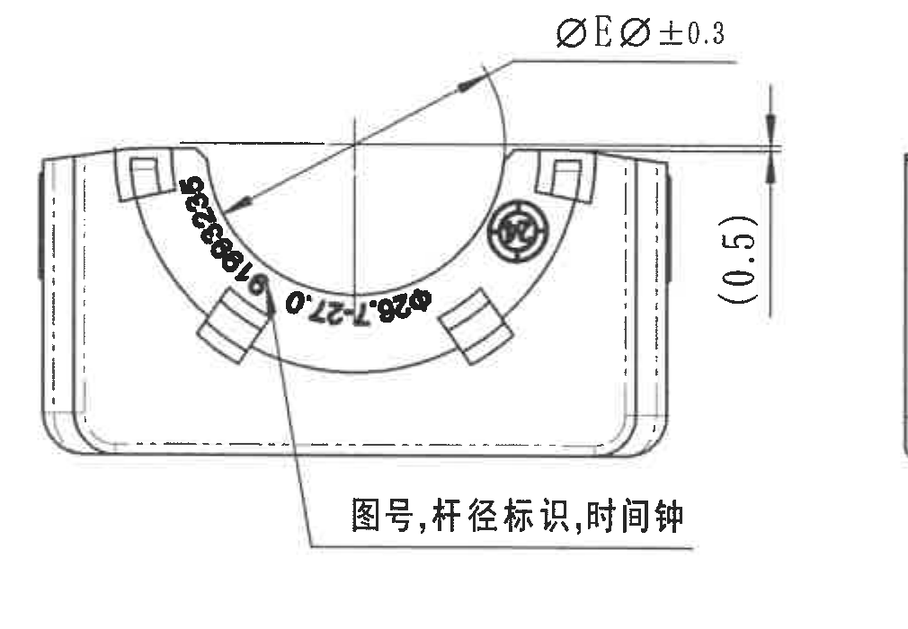

- 原图位置/视图名称: 页 1 中部左侧，图框坐标约 D1-F5；bbox `[420, 1000, 1430, 1700]`。
- object_kind: `view`

| 提取项 | 原图数值或文本 | 含义说明 |
|---|---|---|
| 半圆槽直径代号 | ØE ر0.3 | 引出线指向上部半圆槽，ØE 的具体值由参数表按变型读取；当前 J 行 ØE=25.9。标注带 ±0.3 公差。 |
| 右侧参考高度 | (0.5) | 括号内参考尺寸，位于视图右侧上缘附近，表示上缘局部高度/偏移参考，不作为独立带公差加工尺寸。 |
| 标识内容 | 图号,杆径标识,时间钟 | 引出线指向弧面标识区域，说明该处需包含图号、杆径标识和时间钟。 |
| 弧面杆径/图号标识 | Ø26.7-27.0 / 91993235 | 弧面黑字为标识内容；Ø26.7-27.0 对应参数表 J 行 ØA 范围，91993235 对应标题栏 Drawing No.。 |
| 星号关键尺寸 | 未见星号 | 本裁切内未见带星号的关键尺寸标注。 |

边界归属说明: 右侧靠近相邻中间侧视图，但裁切未包含其尺寸线；本区域只提取左上主视图的 ØE、(0.5) 和标识说明。

### object_4 - 中部侧视图 / A-A 剖切位置

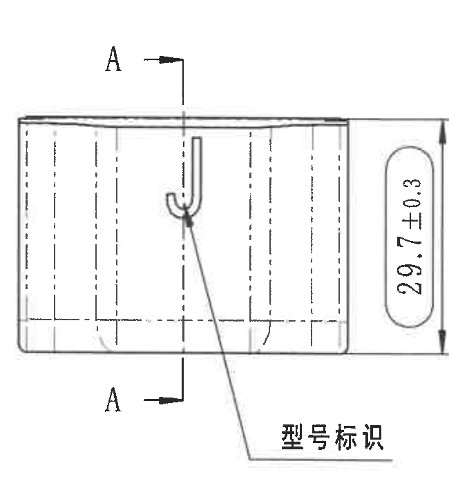

- 原图位置/视图名称: 页 1 中部，左上主视图右侧，图框坐标约 D5-F7；bbox `[1400, 1000, 2050, 1710]`。
- object_kind: `view`

| 提取项 | 原图数值或文本 | 含义说明 |
|---|---|---|
| 剖切字母 | A / A | 上下两个 A 和箭头定义 A-A 剖切位置，剖面图见 object_5。 |
| 侧向总高 | 29.7±0.3 | 右侧竖向尺寸线，表示侧视状态整体高度；带 ±0.3 公差。 |
| 标识内容 | 型号标识 | 引出线指向前侧局部标识，表示该处需设置型号标识。 |
| 角度/弧度 | 未见独立角度或弧度数值 | 本裁切未标注角度；弧面半径由 A-A 剖面及参数表 RIR/RAR 表达。 |

边界归属说明: 本裁切只归属中部侧视图。右侧 A-A 剖面的 RIR/RAR 引出标注未计入本对象；左上主视图也未进入本对象。

### object_5 - A-A 剖面图 1:1

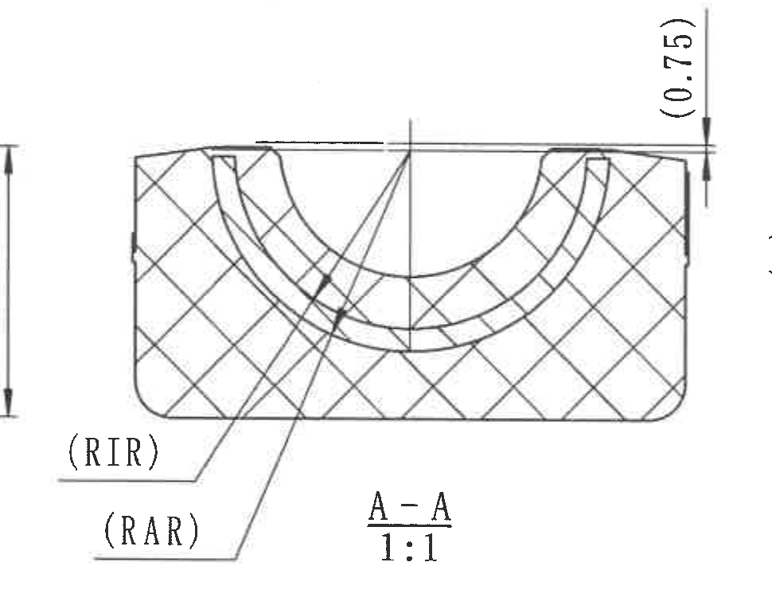

- 原图位置/视图名称: 页 1 中部，图框坐标约 D7-F10；bbox `[2030, 990, 3000, 1750]`。
- object_kind: `section`

| 提取项 | 原图数值或文本 | 含义说明 |
|---|---|---|
| 剖面名称 | A-A | 与 object_4 中 A 剖切线对应。 |
| 比例 | 1:1 | 剖面图按 1:1 绘制。 |
| 顶部参考尺寸 | (0.75) | 括号内参考尺寸，位于右上竖向尺寸线处，用于说明顶面局部相对高度/偏移。 |
| 插入件内半径 | RIR | 引出线指向内侧弧面；当前 J 行参数表为 RIR=18.5。 |
| 插入件外半径 | RAR | 引出线指向外侧弧面；参数表中 RAR=22 显示在 A-E 合并区域，J 行未见独立 RAR 数值，归属需按参数表合并边界核对。 |
| 剖面材料表现 | 交叉剖面线 | 表示剖切到的橡胶/主体区域。 |

边界归属说明: 左边缘有相邻侧视的尺寸线片段，为保证 RIR/RAR 引出线完整而保留，不将该片段提取为 A-A 尺寸。B-B 剖面和右上视图不属于本对象。

### object_6 - B-B 剖面图 1:1

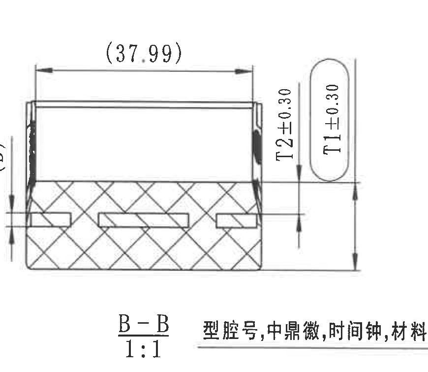

- 原图位置/视图名称: 页 1 中部偏右，图框坐标约 D10-F13；bbox `[3030, 990, 3900, 1745]`。
- object_kind: `section`

| 提取项 | 原图数值或文本 | 含义说明 |
|---|---|---|
| 剖面名称 | B-B | 与 object_7 中 B 剖切线对应。 |
| 比例 | 1:1 | 剖面图按 1:1 绘制。 |
| 上方水平参考尺寸 | (37.99) | 括号内参考尺寸，位于剖面上方水平尺寸线，表示剖面上部宽度/距离参考。 |
| 内橡胶厚度 | T2±0.30 | 竖向尺寸线标注；T2 具体值由参数表读取，当前 J 行 T2=6.30，视图公差为 ±0.30。 |
| 橡胶厚度 | T1±0.30 | 胶囊框内竖向尺寸标注；当前 J 行 T1=17.35，视图公差为 ±0.30。 |
| 标识内容 | 型腔号,中鼎徽,时间钟,材料标识 | 下方引出说明指向剖面/相邻视图标识区域，说明需标记型腔号、中鼎徽、时间钟和材料标识。 |

边界归属说明: 右侧相邻 object_7 右上视图，为保留 T1/T2 尺寸线和下方引出文字，裁切与 object_7 有少量重叠；本对象只提取 B-B 剖面、T1/T2 和 (37.99)。

### object_7 - 右上主视图 / B-B 剖切位置

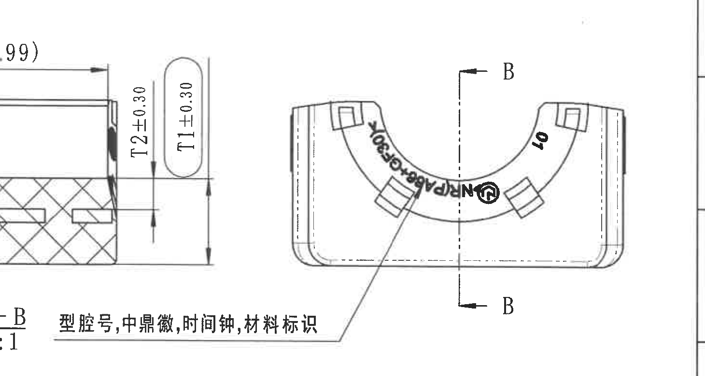

- 原图位置/视图名称: 页 1 中部右侧，图框坐标约 D13-F16；bbox `[3320, 990, 4780, 1770]`。
- object_kind: `view`

| 提取项 | 原图数值或文本 | 含义说明 |
|---|---|---|
| 剖切字母 | B / B | 上下两个 B 和箭头定义 B-B 剖切位置，剖面图见 object_6。 |
| 标识内容 | 型腔号,中鼎徽,时间钟,材料标识 | 下方引出线指向弧面标识区域，说明需设置型腔号、中鼎徽、时间钟和材料标识。 |
| 材料标识 | PA66+GF30 | 弧面黑字标识之一，与参数表 H-J 合并材料 part 1 对应。 |
| 型腔号/编号 | 10 | 弧面局部黑字，属于型腔号或编号标识。 |
| 数值尺寸 | 未见独立尺寸线 | 本裁切不包含属于右上视图自身的数值尺寸；左侧 T1/T2 片段归 object_6。 |

边界归属说明: 左边缘与 B-B 剖面重叠，为保留完整标识引出线而裁切较宽。T1±0.30、T2±0.30 和 (37.99) 均归 object_6，不归本右上视图。右侧图框线不作为内容提取。

### object_8 - 底部左侧俯视/平面视图

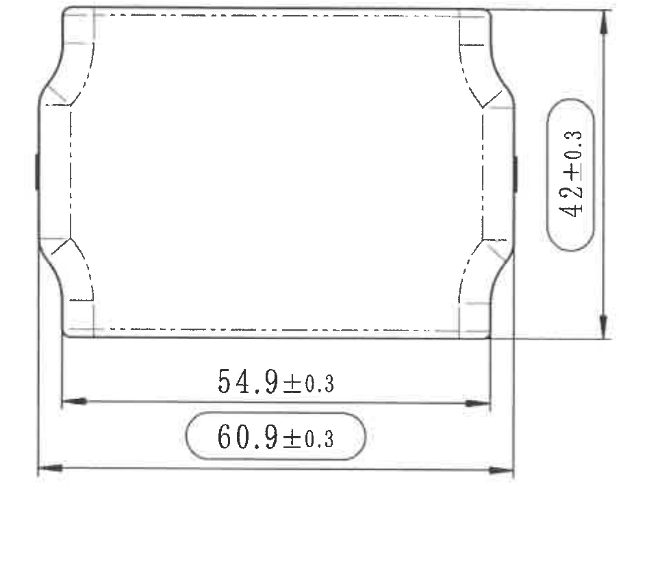

- 原图位置/视图名称: 页 1 左下中部，图框坐标约 G1-I5；bbox `[410, 1840, 1390, 2690]`。
- object_kind: `view`

| 提取项 | 原图数值或文本 | 含义说明 |
|---|---|---|
| 竖向总高度 | 42±0.3 | 右侧竖向尺寸线，表示该平面视图方向的总高度/外形高度，带 ±0.3 公差。 |
| 内侧水平距离 | 54.9±0.3 | 中部下方水平尺寸线，表示两侧内侧基准之间的宽度，带 ±0.3 公差。 |
| 外侧总宽 | 60.9±0.3 | 最下方水平尺寸线，胶囊框标出；按 notes 第 8 条，该圈/框标识为检验尺寸。 |
| 隐藏轮廓 | 虚线/点划线 | 表示内部或背面不可见轮廓。 |
| 星号关键尺寸 | 未见星号 | 本裁切未见星号关键尺寸。 |

边界归属说明: 裁切保留 42±0.3、54.9±0.3、60.9±0.3 的完整尺寸线和箭头；未包含下方 DIN ISO 3302-1 公差表。

### object_9 - 轴测图 / 三维示意

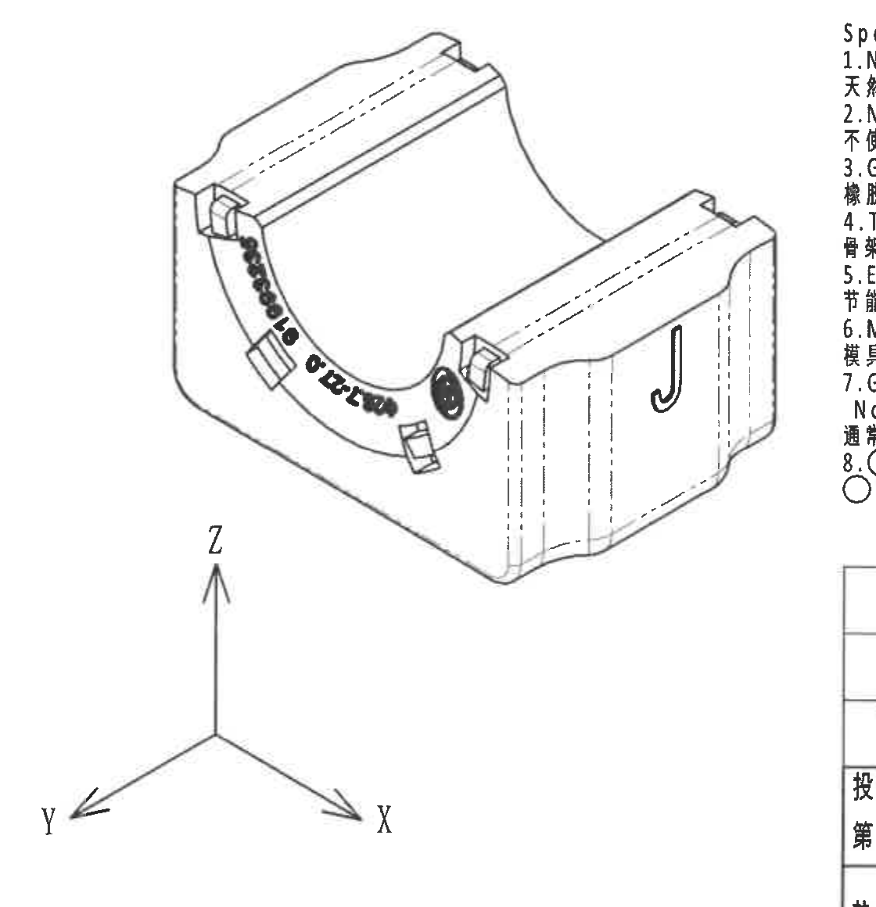

- 原图位置/视图名称: 页 1 下方中部，图框坐标约 G6-J9；bbox `[1680, 1760, 2800, 2920]`。
- object_kind: `view`

| 提取项 | 原图数值或文本 | 含义说明 |
|---|---|---|
| 坐标方向 | X / Y / Z | 三轴方向示意，说明轴测图方向。 |
| 弧面标识 | 图号/杆径/时间钟相关黑字标识 | 与左上主视图标识说明一致，用于展示标识实际位置。 |
| 前侧标识 | J | 右前侧面可见 J 形标识。 |
| 数值尺寸 | 未见独立尺寸线 | 轴测图没有新增尺寸，尺寸读取应回到相应正投影/剖面视图和参数表。 |

边界归属说明: 右侧可见 notes 的边缘文字和右下标题栏边缘，均为相邻区域，不在本轴测图对象中提取。

### object_10 - Specification 技术要求 / NOTES

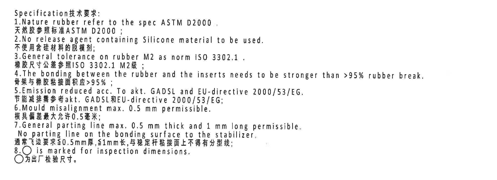

- 原图位置/视图名称: 页 1 中下偏右，图框坐标约 G9-I15；bbox `[2700, 1750, 4680, 2470]`。
- object_kind: `notes`

| 提取项 | 原图数值或文本 | 含义说明 |
|---|---|---|
| 标题 | Specification技术要求: | 技术要求区域标题。 |
| 1 | Nature rubber refer to the spec ASTM D2000. / 天然胶参照标准ASTM D2000; | 天然橡胶按 ASTM D2000 标准。 |
| 2 | No release agent containing Silicone material to be used. / 不使用含硅材料的脱模剂; | 禁用含硅脱模剂。 |
| 3 | General tolerance on rubber M2 as norm ISO 3302.1. / 橡胶尺寸公差参照ISO 3302.1 M2级; | 橡胶通用公差按 ISO 3302.1 M2。 |
| 4 | The bonding between the rubber and the inserts needs to be stronger than >95% rubber break. / 骨架与橡胶粘接面积应>95%; | 橡胶与骨架粘接强度/破坏面积要求。 |
| 5 | Emission reduced acc. To akt. GADSL and EU-directive 2000/53/EG. / 节能减排需参考akt. GADSL和EU-directive 2000/53/EG; | 排放/环保要求参考 GADSL 与 EU 2000/53/EG。 |
| 6 | Mould misalignment max. 0.5 mm permissible. / 模具偏差最大允许0.5毫米; | 模具错位最大 0.5 mm。 |
| 7 | General parting line max. 0.5 mm thick and 1 mm long permissible. No parting line on the bonding surface to the stabilizer. / 通常飞边要求≤0.5mm厚,≤1mm长,与稳定杆粘接面上不得有分型线; | 飞边/分型线限制；稳定杆粘接面不得有分型线。 |
| 8 | ○ is marked for inspection dimensions. / ○为出厂检验尺寸。 | 被圆圈或胶囊框标识的尺寸为出厂检验尺寸，例如 60.9±0.3、T1±0.30 等。 |

边界归属说明: 本裁切只归属 NOTES 技术要求；下方 BOM/标题栏未进入本对象。

### object_11 - DIN ISO 3302-1 M2 class 公差表

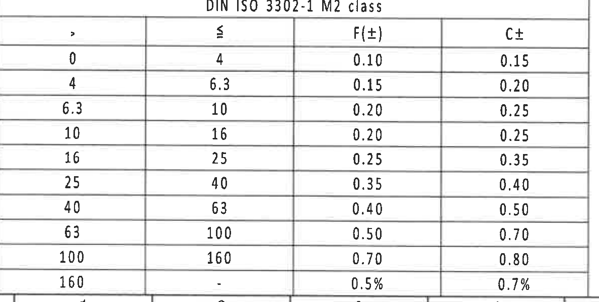

- 原图位置/视图名称: 页 1 左下角，图框坐标约 J1-L4；bbox `[375, 2740, 1565, 3340]`。
- object_kind: `table`

| DIN ISO 3302-1 M2 class | ≤ | F(±) | C± |
|---:|---:|---:|---:|
| 0 | 4 | 0.10 | 0.15 |
| 4 | 6.3 | 0.15 | 0.20 |
| 6.3 | 10 | 0.20 | 0.25 |
| 10 | 16 | 0.20 | 0.25 |
| 16 | 25 | 0.25 | 0.35 |
| 25 | 40 | 0.35 | 0.40 |
| 40 | 63 | 0.40 | 0.50 |
| 63 | 100 | 0.50 | 0.70 |
| 100 | 160 | 0.70 | 0.80 |
| 160 | - | 0.5% | 0.7% |

| 提取项 | 原图数值或文本 | 含义说明 |
|---|---|---|
| 表题 | DIN ISO 3302-1 M2 class | 与 NOTES 第 3 条通用橡胶公差对应。 |
| F(±) | 0.10 至 0.70、>160 为 0.5% | F 类公差列。 |
| C± | 0.15 至 0.80、>160 为 0.7% | C 类公差列。 |

边界归属说明: 本裁切只归属公差表；底部图框坐标编号未作为表格内容提取。

### object_12 - Reference 参考清单

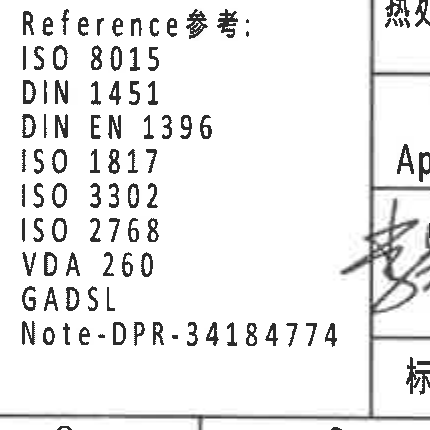

- 原图位置/视图名称: 页 1 下部中右，图框坐标约 K8-L10；bbox `[2385, 2920, 2815, 3350]`。
- object_kind: `notes`

| 提取项 | 原图数值或文本 | 含义说明 |
|---|---|---|
| 标题 | Reference参考: | 参考标准/文件清单标题。 |
| 参考标准 | ISO 8015 | 参考标准。 |
| 参考标准 | DIN 1451 | 参考标准。 |
| 参考标准 | DIN EN 1396 | 参考标准。 |
| 参考标准 | ISO 1817 | 参考标准。 |
| 参考标准 | ISO 3302 | 参考标准。 |
| 参考标准 | ISO 2768 | 参考标准。 |
| 参考标准 | VDA 260 | 参考标准。 |
| 参考标准 | GADSL | 参考标准/清单。 |
| 参考文件 | Note-DPR-34184774 | 参考文件编号。 |

边界归属说明: 右侧可见标题栏边线和签名区一角，但不归本参考清单对象。

### object_13 - BOM / 零件明细表

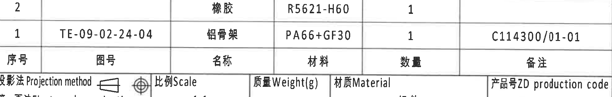

- 原图位置/视图名称: 页 1 右下标题栏上方，图框坐标约 I10-J16；bbox `[2780, 2505, 4760, 2820]`。
- object_kind: `table`

| 序号 | 图号 | 名称 | 材料 | 数量 | 备注 |
|---:|---|---|---|---:|---|
| 2 |  | 橡胶 | R5621-H60 | 1 |  |
| 1 | TE-09-02-24-04 | 铝骨架 | PA66+GF30 | 1 | C114300/01-01 |

| 提取项 | 原图数值或文本 | 含义说明 |
|---|---|---|
| 序号 2 | 橡胶 / R5621-H60 / 数量 1 | 橡胶件材料和数量。 |
| 序号 1 | TE-09-02-24-04 / 铝骨架 / PA66+GF30 / 数量 1 / C114300/01-01 | 铝骨架零件图号、材料、数量和备注。 |

边界归属说明: 本裁切只归属 BOM 表；下方投影法/比例/材料等标题栏字段归 object_14。

### object_14 - 标题栏 / 图纸信息栏

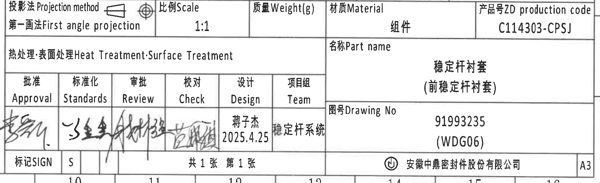

- 原图位置/视图名称: 页 1 右下角，图框坐标约 J10-L16；bbox `[2740, 2745, 4780, 3370]`。
- object_kind: `title_block`

| 字段 | 原图数值或文本 | 含义说明 |
|---|---|---|
| 投影法 Projection method | 第一画法 First angle projection | 第一角法投影，旁有投影符号。 |
| 比例 Scale | 1:1 | 全图/标题栏比例。 |
| 质量 Weight(g) | 空白 | 标题栏未填写质量。 |
| 材质 Material | 组件 | 图纸对象为组件。 |
| 产品号 ZD production code | C114303-CPSJ | 产品号/生产代码。 |
| 热处理/表面处理 Heat Treatment; Surface Treatment | 空白 | 未填写热处理或表面处理要求。 |
| 名称 Part name | 稳定杆衬套（前稳定杆衬套） | 零件/组件名称。 |
| 图号 Drawing No | 91993235 (WDG06) | 图纸编号；与参数表 J 行 Mubea proto. SAP No. 对应。 |
| Approval | 手写签名 | 批准栏签名图形，原图未给印刷姓名。 |
| Standards | 手写签名 | 标准化栏签名图形。 |
| Review | 手写签名 | 审批/Review 栏签名图形。 |
| Check | 手写签名 | 校对栏签名图形。 |
| Design | 蒋子杰 / 2025.4.25 | 设计者和日期。 |
| Team | 稳定杆系统 | 项目组/团队。 |
| 标记 SIGN | S | 签名/标记栏字母。 |
| 页数 | 共 1 张 第 1 张 | 图纸总张数和当前张。 |
| 公司 | 安徽中鼎密封件股份有限公司 | 出图公司。 |
| 图幅 | A3 | 图纸幅面。 |

边界归属说明: 上方 BOM 表归 object_13；本裁切只归属标题栏字段。底部坐标格编号部分进入画面边缘，不作为标题栏字段提取。

## 裁切检查记录

| 对象 | 名称 | 检查结果 |
|---|---|---|
| object_1 | 修订履历表 | 完整包含表头、两行记录和表格外框；右侧图框字母已排除，下边界相邻横线不提取。 |
| object_2 | 产品变型参数表 | 完整包含表头、A/B/C/E/H/J 全部行及材料合并单元格；未带入中部视图。 |
| object_3 | 左上主视图 | 完整包含 ØE 引出线、(0.5)、图号/杆径/时间钟说明；右侧未带入中部侧视尺寸。 |
| object_4 | 中部侧视图 | 完整包含 A-A 剖切符号、29.7±0.3 尺寸线和型号标识；右侧 RIR/RAR 未归入本对象。 |
| object_5 | A-A 剖面图 | 完整包含剖面、(0.75)、RIR/RAR 引出线和 A-A 1:1；左边缘相邻尺寸线片段不提取。 |
| object_6 | B-B 剖面图 | 完整包含 (37.99)、T2±0.30、T1±0.30、B-B 1:1 和下方标识说明；与右上视图少量重叠但归属已区分。 |
| object_7 | 右上主视图 | 完整包含 B-B 剖切符号、弧面标识和材料/型腔说明；左侧 T1/T2 片段归 object_6。 |
| object_8 | 底部左侧平面视图 | 完整包含 42±0.3、54.9±0.3、60.9±0.3 及全部箭头；未带入公差表。 |
| object_9 | 轴测图 | 完整包含轴测本体和 X/Y/Z 坐标；右侧 notes 和标题栏边缘不提取。 |
| object_10 | Specification 技术要求 | 完整包含 1-8 条中英文 notes；未带入下方 BOM/标题栏。 |
| object_11 | DIN ISO 3302-1 M2 class 公差表 | 完整包含表题、表头和 10 行公差；底部图框编号未提取。 |
| object_12 | Reference 参考清单 | 完整包含全部参考标准/文件；右侧签名区边线不提取。 |
| object_13 | BOM / 零件明细表 | 完整包含表头及序号 2、1 两行；下方标题栏归 object_14。 |
| object_14 | 标题栏 | 重裁后完整包含投影法、比例、材料、产品号、名称、图号、签批、公司和 A3 图幅；上方 BOM 不归本对象。 |

## 归属总说明

- 中部 B-B 剖面与右上主视图在原图中距离很近；object_6 和 object_7 为保留完整尺寸线/引出线存在少量重叠，但尺寸归属严格按标注终点和剖面标题区分。
- 括号内尺寸 `(0.5)`、`(0.75)`、`(37.99)` 均按参考尺寸提取，不因参考性质忽略。
- 未见星号关键尺寸；被圆圈/胶囊框标识的尺寸按 NOTES 第 8 条解释为出厂检验尺寸。
