# 20C114305 PDF 内容识别

整页渲染图：`outputs/20C114305_assets/images/page_1.png`  
页面像素尺寸：4959 x 3505。以下所有 bbox 坐标均为整页 PNG 像素坐标 `[x1, y1, x2, y2]`。

## object_1 - 修订履历表

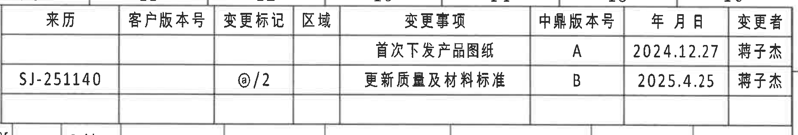

原图位置/视图名称：页 1，上方右侧修订履历表，bbox `[2930, 150, 4780, 465]`。

原表还原：

| 来历 | 客户版本号 | 变更标记 | 区域 | 变更事项 | 中鼎版本号 | 年 月 日 | 变更者 |
|---|---|---|---|---|---|---|---|
|  |  |  |  | 首次下发产品图纸 | A | 2024.12.27 | 蒋子杰 |
| SJ-251140 |  | @/2 |  | 更新质量及材料标准 | B | 2025.4.25 | 蒋子杰 |

提取表格：

| 提取项 | 原图数值或文本 | 含义说明 |
|---|---|---|
| 修订记录 A | 首次下发产品图纸；中鼎版本号 A；2024.12.27；蒋子杰 | 初次发行产品图纸。 |
| 修订记录 B | SJ-251140；@/2；更新质量及材料标准；中鼎版本号 B；2025.4.25；蒋子杰 | 第二次版本记录，说明质量及材料标准更新。 |

边界归属说明：裁切仅覆盖上方右侧修订履历表；下缘接近零件参数表顶部边线，但没有把参数表字段归入本对象。

## object_2 - 零件参数表

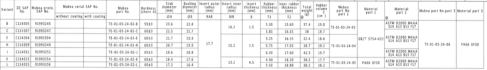

原图位置/视图名称：页 1，上方主参数表，bbox `[375, 430, 4565, 1040]`。

原表还原：

| Variant | ZD SAP No. | Mubea proto. SAP No. | Mubea serial SAP No. without coating | Mubea serial SAP No. with coating | Mubea part No. | Hardness (shore A) | Stab diameter ØA (mm) | Bushing diameter ØE (mm) | Insert outer radius RAR (mm) | Insert inner radius RIR (mm) | Insert thickness B (mm) | Rubber thickness T1 (mm) | Inner rubber thickness T2 (mm) | Total weight (g) | Rubber volume (cm3) | Mubea part No. part 1 | Material part 1 | Material part 2 | Mubea part No.part 3 | Material part 3 |
|---|---|---|---|---|---|---|---:|---:|---:|---:|---:|---:|---:|---:|---:|---|---|---|---|---|
| B | C114305 | 91993245 |  |  | TE-01-03-24-02-B | 55±3 | 23.6 | 22.8 | 17.7 | 16.2 | 1.5 | 5.30 | 15.60 | 37.4 | 19.0 | TE-01-03-24-03 |  | ASTM D2000 M4AA 514 A13 B13 F17 | TE-01-03-24-06 | PA66 GF30 |
| C | C114307 | 91993247 |  |  | TE-01-03-24-02-C | 60±3 | 22.5 | 21.7 | 17.7 | 16.2 | 1.5 | 5.85 | 16.15 | 38 | 19.7 | TE-01-03-24-03 |  | ASTM D2000 M4AA 514 A13 B13 F17 | TE-01-03-24-06 | PA66 GF30 |
| E | C114264 | 91991594 |  |  | TE-01-03-24-02-E | 60±3 | 21.7 | 20.9 | 17.7 | 15.2 | 2.5 | 5.25 | 16.55 | 32.4 | 18.6 | TE-01-03-24-04 | GB/T 5754-H22 | ASTM D2000 M4AA 614 A13 B13 F17 | TE-01-03-24-06 | PA66 GF30 |
| H | C114309 | 91993249 |  |  | TE-01-03-24-02-H | 60±3 | 20.7 | 19.9 | 17.7 | 15.2 | 2.5 | 5.75 | 17.05 | 38.7 | 19.2 | TE-01-03-24-04 | GB/T 5754-H22 | ASTM D2000 M4AA 614 A13 B13 F17 | TE-01-03-24-06 | PA66 GF30 |
| J | C114311 | 91993252 |  |  | TE-01-03-24-02-J | 65±3 | 19.6 | 18.8 | 17.7 | 15.2 | 2.5 | 6.30 | 17.60 | 42.5 | 19.7 | TE-01-03-24-04 | GB/T 5754-H22 | ASTM D2000 M4AA 614 A13 B13 F17 | TE-01-03-24-06 | PA66 GF30 |
| K | C114313 | 91993254 |  |  | TE-01-03-24-02-K | 60±3 | 18.4 | 17.6 | 17.7 | 13.2 | 4.5 | 4.90 | 18.20 | 38.5 | 17.7 | TE-01-03-24-05 | PA66 GF30 | ASTM D2000 M4AA 614 A13 B13 F17 | TE-01-03-24-06 | PA66 GF30 |
| L | C114315 | 91993256 |  |  | TE-01-03-24-02-L | 60±3 | 17.2 | 16.4 | 17.7 | 13.2 | 4.5 | 5.50 | 18.80 | 38.5 | 18.2 | TE-01-03-24-05 | PA66 GF30 | ASTM D2000 M4AA 614 A13 B13 F17 | TE-01-03-24-06 | PA66 GF30 |

提取表格：

| 提取项 | 原图数值或文本 | 含义说明 |
|---|---|---|
| 变型与 SAP | B/C/E/H/J/K/L；ZD SAP No. C114305 等；Mubea proto. SAP No. 91993245 等 | 图纸按不同杆径/衬套尺寸列出多个变型。 |
| 硬度 | 55±3、60±3、65±3 shore A | 橡胶硬度公差。 |
| ØA | 23.6、22.5、21.7、20.7、19.6、18.4、17.2 mm | 稳定杆直径，对应视图中的杆径标识。 |
| ØE | 22.8、21.7、20.9、19.9、18.8、17.6、16.4 mm | 衬套孔/套筒直径，对应正视图 `ØE` 标注。 |
| RAR | 17.7 mm | Insert outer radius，A-A 剖面中以 `(RAR)` 引出。 |
| RIR | 16.2、15.2、13.2 mm | Insert inner radius，A-A 剖面中以 `(RIR)` 引出。 |
| B | 1.5、2.5、4.5 mm | Insert thickness，B-B 剖面中以 `(B)` 引出。 |
| T1/T2 | T1 = 4.90 至 6.30；T2 = 15.60 至 18.80 | B-B 剖面中的橡胶厚度和内橡胶厚度，视图给出 `±0.30` 公差。 |
| 重量/体积 | Total weight 32.4 至 42.5 g；Rubber volume 17.7 至 19.7 cm3 | 单件重量和橡胶体积。 |
| 材料与部件号 | TE-01-03-24-03/04/05/06；5754 H22；PA66 GF30；ASTM D2000 M4AA 等 | 表中 1/2/3 号材料和部件号，对应 B-B 剖面编号 1、2、3。 |

边界归属说明：裁切覆盖整个主参数表及表头/底线；上方仅露出少量修订表边线，不抽取为本表字段。

## object_3 - 左侧正视图（材料标识侧）

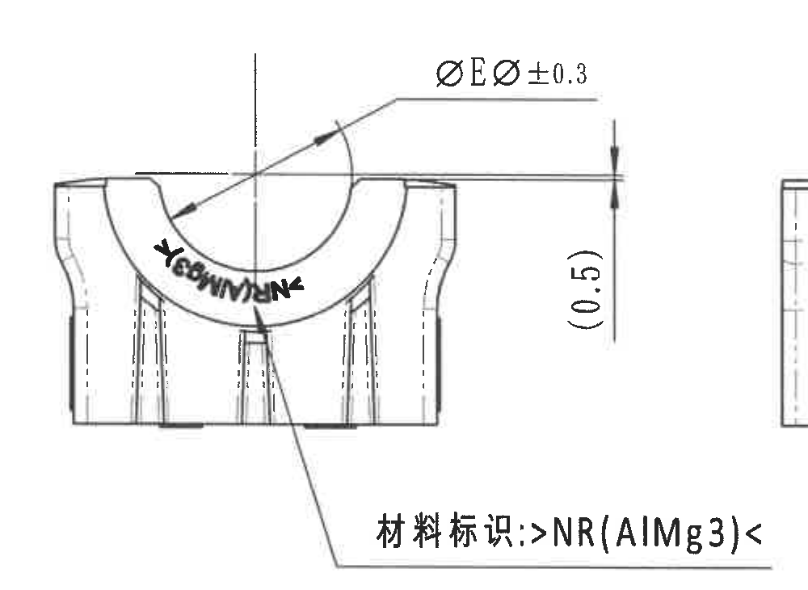

原图位置/视图名称：页 1，中部左侧正视图，bbox `[500, 1040, 1500, 1770]`。

提取表格：

| 提取项 | 原图数值或文本 | 含义说明 |
|---|---|---|
| 直径标注 | ØEر0.3 | 与参数表 `Bushing diameter ØE` 对应，表示衬套孔/套筒直径按 ØE 值并带 ±0.3 公差。 |
| 参考尺寸 | (0.5) | 括号内尺寸，为该视图右侧高度方向的参考尺寸。 |
| 材料标识 | 材料标识: >NR(AlMg3)< | 指示零件表面需有材料标识，内容为 `NR(AlMg3)`。 |
| 弧形文字 | 弧形 MUBEA/NR 类标识 | 位于内圆弧面上的标识，和材料/供应商标识相关。 |

边界归属说明：右边可见相邻侧视图一条边线残片，但未包含其尺寸文字；本区域只提取正视图中的 ØE、(0.5)、材料标识和弧面标识。

## object_4 - 侧视图与 A-A 剖切位置

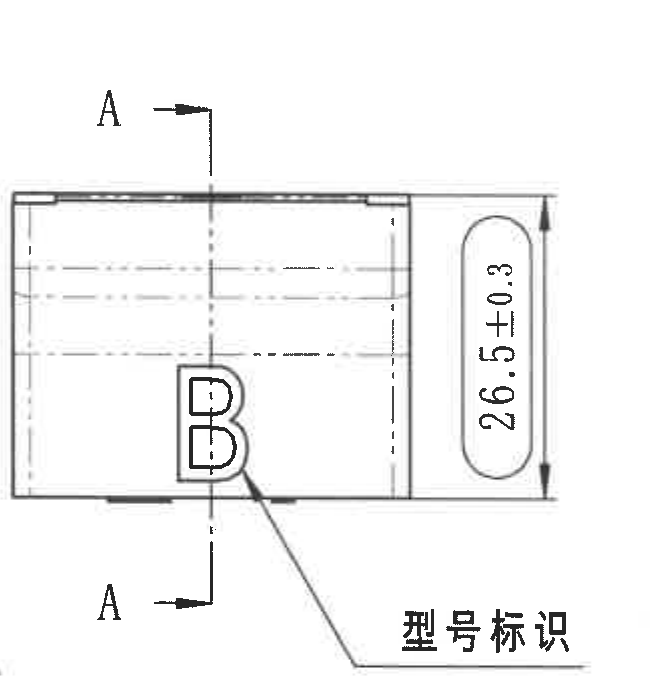

原图位置/视图名称：页 1，中部侧视图，bbox `[1455, 1070, 2105, 1760]`。

提取表格：

| 提取项 | 原图数值或文本 | 含义说明 |
|---|---|---|
| 剖切基准 | A - A | 侧视图中两处 A 箭头给出 A-A 剖面的剖切位置和方向。 |
| 总高度尺寸 | 26.5±0.3 | 侧视图右侧高度方向尺寸，公差 ±0.3。 |
| 型号标识 | 型号标识 | 引出线指向侧面大写 `B` 标识，表示该处为型号标识位置。 |

边界归属说明：裁切右边界已收紧，未抽取 A-A 剖面的 `(RIR)/(RAR)`；左下仅有相邻材料标识引出线末端，不归入本侧视图。

## object_5 - A-A 剖面视图

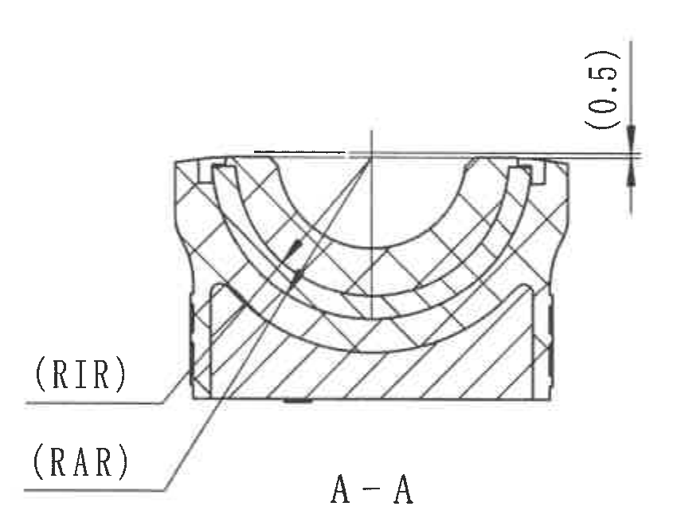

原图位置/视图名称：页 1，中部 A-A 剖面，bbox `[2080, 1070, 2930, 1725]`。

提取表格：

| 提取项 | 原图数值或文本 | 含义说明 |
|---|---|---|
| 剖面名称 | A-A | 来自 object_4 的 A-A 剖切位置。 |
| 参考尺寸 | (0.5) | 剖面右侧上方括号尺寸，为剖面局部参考厚度/高度。 |
| 内半径标注 | (RIR) | Insert inner radius，引出到内侧弧面；具体数值见参数表 RIR 列。 |
| 外半径标注 | (RAR) | Insert outer radius，引出到外侧弧面；具体数值见参数表 RAR 列。 |
| 剖面材料表示 | 剖面线/交叉剖面线 | 用不同剖面线表示橡胶和嵌件结构的截面关系。 |

边界归属说明：裁切包含完整 A-A 剖面、剖面名、`(0.5)`、`(RIR)` 和 `(RAR)` 引出线；未把右侧 B-B 剖面或下方 NOTES 字段归入。

## object_6 - B-B 剖面视图

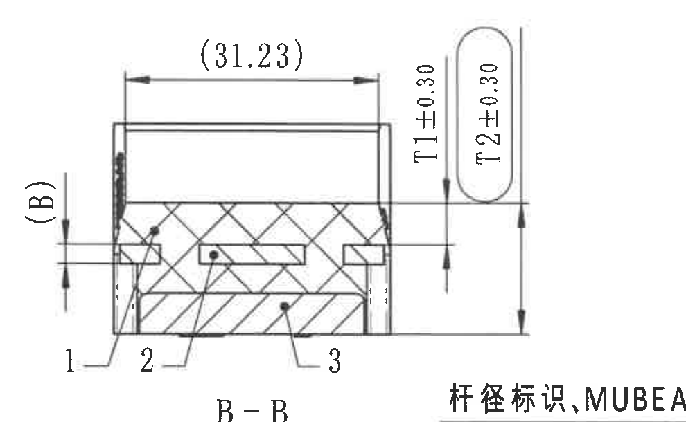

原图位置/视图名称：页 1，中部 B-B 剖面，bbox `[2960, 1080, 3950, 1690]`。

提取表格：

| 提取项 | 原图数值或文本 | 含义说明 |
|---|---|---|
| 剖面名称 | B-B | 来自 object_7 的 B-B 剖切位置。 |
| 参考长度 | (31.23) | 剖面上方总宽/参考长度，括号表示参考尺寸。 |
| 参考厚度 | (B) | 左侧括号标注，对应参数表 `Insert thickness B`。 |
| 橡胶厚度 | T1±0.30 | 对应参数表 `Rubber thickness T1` 的名义值，视图给出 ±0.30 公差。 |
| 内橡胶厚度 | T2±0.30 | 对应参数表 `Inner rubber thickness T2` 的名义值，视图给出 ±0.30 公差。 |
| 部件序号 | 1、2、3 | 剖面内材料/部件编号，对应 BOM 表序号 1 橡胶、2 铝骨架、3 塑料底座。 |

边界归属说明：左侧 `(B)` 和上下箭头完整保留；底部右侧可见“杆径标识,MUBEA图号”局部文字残片，该文字不属于 B-B 剖面，已单独放入 object_8，不在本对象提取项中使用。

## object_7 - 右侧正视图（B-B 剖切位置）

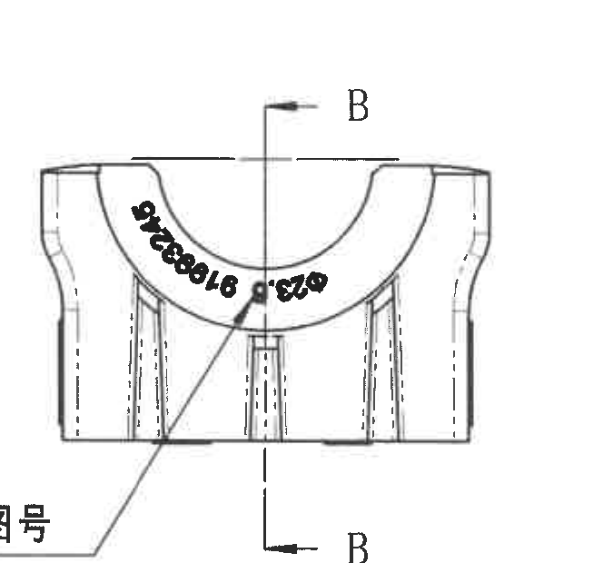

原图位置/视图名称：页 1，中部右侧正视图，bbox `[3980, 1080, 4655, 1700]`。

提取表格：

| 提取项 | 原图数值或文本 | 含义说明 |
|---|---|---|
| 剖切基准 | B - B | 上下两处 B 箭头给出 B-B 剖面剖切位置和方向。 |
| 弧面标识 | 弧形 MUBEA/图号类标识 | 位于内圆弧外侧，用于杆径标识/MUBEA 图号相关标记。 |
| 局部几何 | U 形开口、侧壁、肋/槽线 | 该正视图展示与 B-B 剖面关联的零件外形。 |

边界归属说明：裁切只覆盖右侧正视图及 B-B 剖切线；完整中文引出文字另裁为 object_8，本对象不抽取 B-B 剖面尺寸。

## object_8 - 局部标识：杆径标识、MUBEA 图号

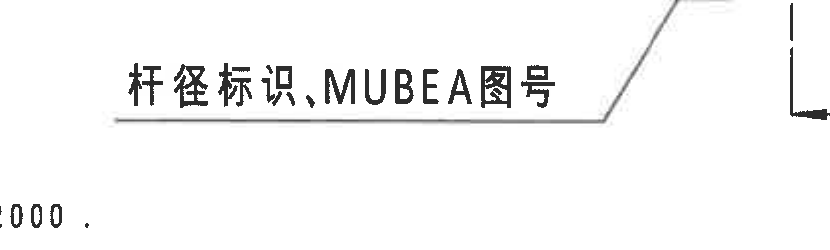

原图位置/视图名称：页 1，中部右侧局部引出标识，bbox `[3480, 1570, 4310, 1820]`。

提取表格：

| 提取项 | 原图数值或文本 | 含义说明 |
|---|---|---|
| 局部文字 | 杆径标识,MUBEA图号 | 引出线指向右侧正视图的弧面标识，说明该处需标注杆径和 MUBEA 图号。 |
| 引出线 | 文字下方水平线及斜向引线 | 表示文字归属于右侧正视图弧面标识，而不是 B-B 剖面。 |

边界归属说明：右缘保留少量 B 剖切线端部，左下保留 NOTES 残点，但均非本对象内容；本对象只抽取“杆径标识,MUBEA图号”和其引出线。

## object_9 - 底视图

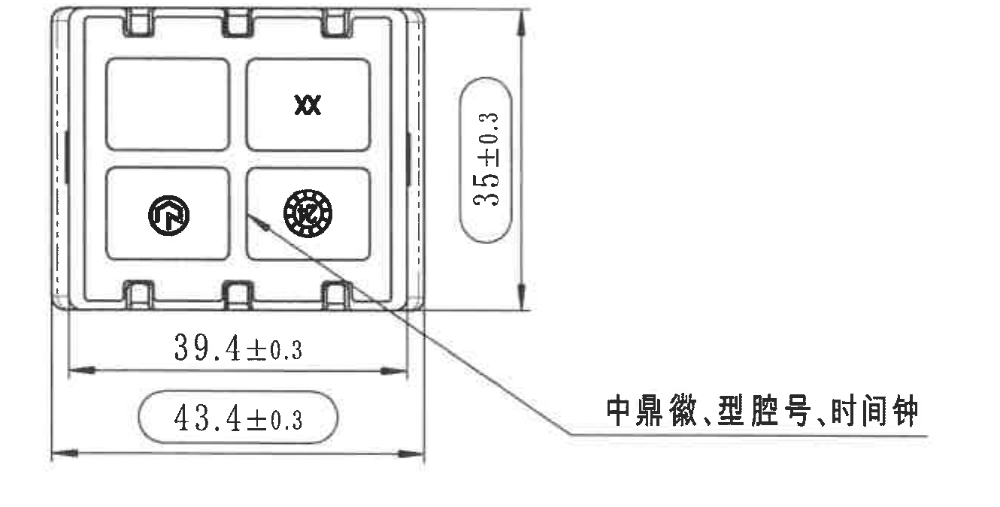

原图位置/视图名称：页 1，左下底视图，bbox `[500, 1885, 1830, 2560]`。

提取表格：

| 提取项 | 原图数值或文本 | 含义说明 |
|---|---|---|
| 垂直外形尺寸 | 35±0.3 | 底视图右侧高度方向尺寸，带 ±0.3 公差，并以圆角框标示。 |
| 内部宽度 | 39.4±0.3 | 底部上方水平尺寸，表示内侧/主要宽度尺寸。 |
| 总宽/检验尺寸 | 43.4±0.3 | 底部下方水平尺寸，圆角框标示；结合 NOTES 8，圆圈/框选标识为出厂检验尺寸。 |
| 局部标志 | XX、圆形中鼎徽、时间钟/型腔类圆标 | 四格区域内的标识内容。 |
| 引出文字 | 中鼎徽, 型腔号, 时间钟 | 引出线指向底视图内圆形标志，说明标志内容。 |

边界归属说明：裁切包含底视图全部尺寸线、箭头和引出文字；右侧坐标轴已排除。

## object_10 - 立体视图

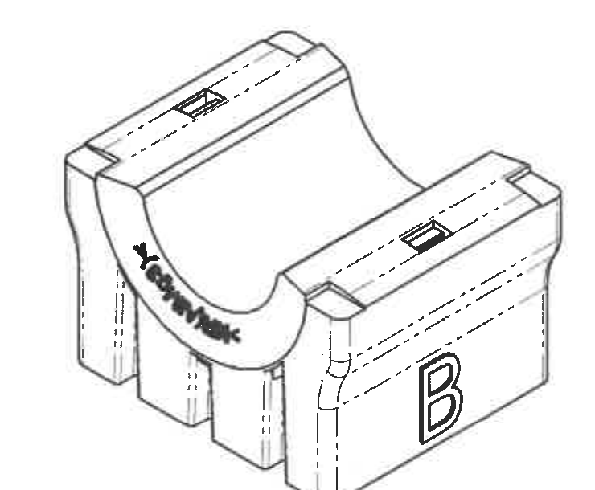

原图位置/视图名称：页 1，中下部立体示意图，bbox `[1900, 1810, 2640, 2420]`。

提取表格：

| 提取项 | 原图数值或文本 | 含义说明 |
|---|---|---|
| 型号标识 | B | 立体图右侧外壁大写 `B`，与侧视图“型号标识”一致。 |
| 弧形标识 | 弧面 MUBEA/NR 类标识 | 位于内圆弧外侧，用于展示标识实际布置位置。 |
| 顶部局部特征 | 两处顶部矩形槽/标记 | 显示零件顶部嵌件或槽位外观。 |

边界归属说明：裁切已排除右侧 NOTES 和下方坐标轴；本视图无新增数值尺寸，只说明外观与标识位置。

## object_11 - 坐标轴示意

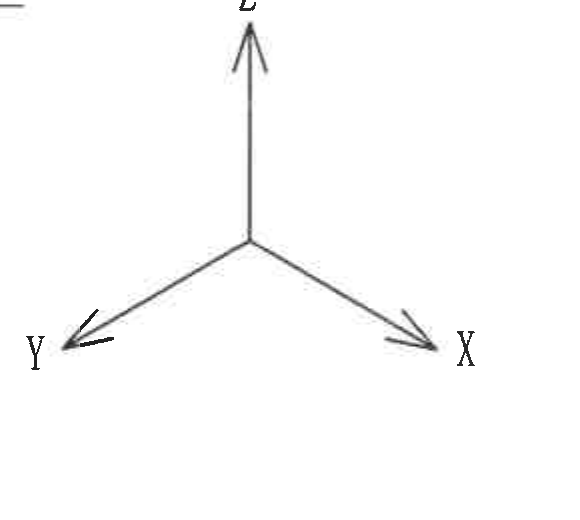

原图位置/视图名称：页 1，底部中间坐标轴示意，bbox `[1710, 2460, 2290, 2980]`。

提取表格：

| 提取项 | 原图数值或文本 | 含义说明 |
|---|---|---|
| 坐标轴 | X、Y、Z | 图纸空间方向示意。 |

边界归属说明：裁切仅包含坐标轴，无尺寸线或零件视图内容。

## object_12 - NOTES / Specification 技术要求

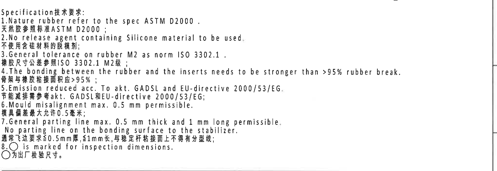

原图位置/视图名称：页 1，中右部 NOTES，bbox `[2755, 1700, 4785, 2400]`。

原文本还原：

| 序号 | 原图文本 |
|---|---|
| 标题 | Specification技术要求: |
| 1 | Nature rubber refer to the spec ASTM D2000. / 天然胶参照标准 ASTM D2000； |
| 2 | No release agent containing Silicone material to be used. / 不使用含硅材料的脱模剂； |
| 3 | General tolerance on rubber M2 as norm ISO 3302.1. / 橡胶尺寸公差参照 ISO 3302.1 M2级； |
| 4 | The bonding between the rubber and the inserts needs to be stronger than >95% rubber break. / 骨架与橡胶粘接面积应 >95%； |
| 5 | Emission reduced acc. To akt. GADSL and EU-directive 2000/53/EG. / 节能减排需参考 akt. GADSL 和 EU-directive 2000/53/EG； |
| 6 | Mould misalignment max. 0.5 mm permissible. / 模具偏差最大允许 0.5 毫米； |
| 7 | General parting line max. 0.5 mm thick and 1 mm long permissible. No parting line on the bonding surface to the stabilizer. / 通常飞边要求 ≤0.5mm 厚, ≤1mm 长, 与稳定杆粘接面上不得有分型线； |
| 8 | ○ is marked for inspection dimensions. / ○ 为出厂检验尺寸。 |

提取表格：

| 提取项 | 原图数值或文本 | 含义说明 |
|---|---|---|
| 天然胶标准 | ASTM D2000 | 天然橡胶材料参考标准。 |
| 禁用材料 | No release agent containing Silicone material | 脱模剂不得含硅。 |
| 橡胶通用公差 | ISO 3302.1 M2 | 橡胶尺寸通用公差等级。 |
| 粘接要求 | >95% rubber break | 橡胶与嵌件粘接破坏面积要求。 |
| 排放/法规 | GADSL；EU-directive 2000/53/EG | 环保/减排合规要求。 |
| 模具偏差 | max. 0.5 mm | 允许的模具错位上限。 |
| 分型线 | max. 0.5 mm thick and 1 mm long | 飞边/分型线限制，并禁止在与稳定杆粘接面出现分型线。 |
| 检验尺寸标识 | ○ | 被圆圈/圆角框标示的尺寸为出厂检验尺寸。 |

边界归属说明：裁切完整包含 NOTES 1-8 条及中英文文本；右侧只有图框线，不包含其他视图尺寸。

## object_13 - DIN ISO 3302-1 M2 公差表

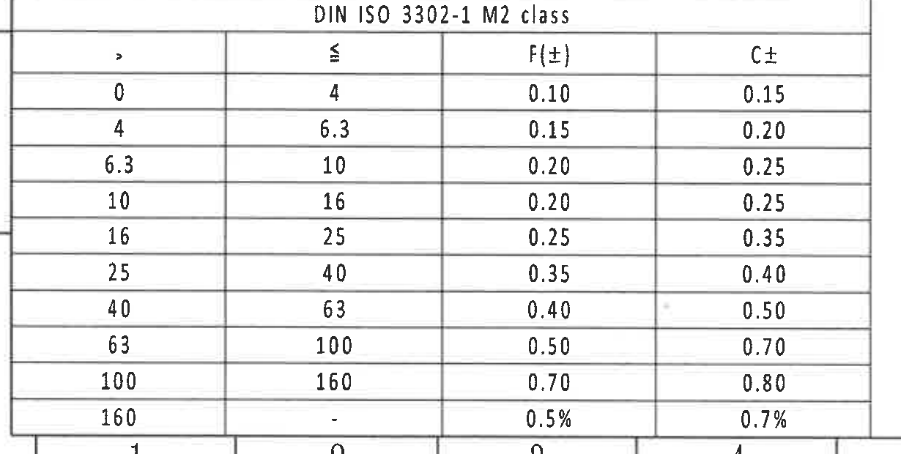

原图位置/视图名称：页 1，左下角公差表，bbox `[360, 2735, 1590, 3355]`。

原表还原：

| DIN ISO 3302-1 M2 class |  | F(±) | C± |
|---:|---:|---:|---:|
| > | ≤ |  |  |
| 0 | 4 | 0.10 | 0.15 |
| 4 | 6.3 | 0.15 | 0.20 |
| 6.3 | 10 | 0.20 | 0.25 |
| 10 | 16 | 0.20 | 0.25 |
| 16 | 25 | 0.25 | 0.35 |
| 25 | 40 | 0.35 | 0.40 |
| 40 | 63 | 0.40 | 0.50 |
| 63 | 100 | 0.50 | 0.70 |
| 100 | 160 | 0.70 | 0.80 |
| 160 | - | 0.5% | 0.7% |

提取表格：

| 提取项 | 原图数值或文本 | 含义说明 |
|---|---|---|
| 标准 | DIN ISO 3302-1 M2 class | 橡胶件通用尺寸公差等级。 |
| F(±) 列 | 0.10 至 0.70；末行 0.5% | F 类尺寸公差。 |
| C± 列 | 0.15 至 0.80；末行 0.7% | C 类尺寸公差。 |

边界归属说明：裁切包含完整公差表和最后一行 `160 - 0.5% / 0.7%`；底部图框分区数字残留不属于公差表，不抽取。

## object_14 - Reference 参考标准

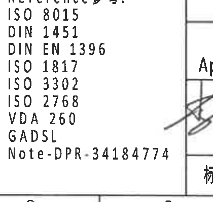

原图位置/视图名称：页 1，下方中右侧参考标准列表，bbox `[2395, 2950, 2815, 3350]`。

提取表格：

| 提取项 | 原图数值或文本 | 含义说明 |
|---|---|---|
| 标题 | Reference参考: | 参考标准清单标题。 |
| 标准 1 | ISO 8015 | 参考标准。 |
| 标准 2 | DIN 1451 | 参考标准。 |
| 标准 3 | DIN EN 1396 | 参考标准。 |
| 标准 4 | ISO 1817 | 参考标准。 |
| 标准 5 | ISO 3302 | 参考标准。 |
| 标准 6 | ISO 2768 | 参考标准。 |
| 标准 7 | VDA 260 | 参考标准。 |
| 标准 8 | GADSL | 参考标准。 |
| 备注 | Note-DPR-34184774 | 图纸备注/参考文件号。 |

边界归属说明：裁切仅覆盖参考标准列表；右侧签字栏斜线残片不属于该列表。

## object_15 - BOM / 零件明细表

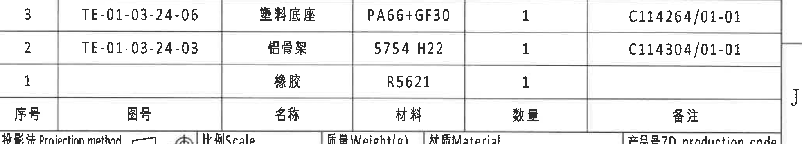

原图位置/视图名称：页 1，右下上部 BOM 表，bbox `[2770, 2405, 4820, 2775]`。

原表还原（原图表头位于明细行下方，以下行顺序保持原图自上而下 3/2/1）：

| 序号 | 图号 | 名称 | 材料 | 数量 | 备注 |
|---|---|---|---|---:|---|
| 3 | TE-01-03-24-06 | 塑料底座 | PA66+GF30 | 1 | C114264/01-01 |
| 2 | TE-01-03-24-03 | 铝骨架 | 5754 H22 | 1 | C114304/01-01 |
| 1 |  | 橡胶 | R5621 | 1 |  |

提取表格：

| 提取项 | 原图数值或文本 | 含义说明 |
|---|---|---|
| 序号 1 | 橡胶；R5621；数量 1 | B-B 剖面编号 1 对应橡胶。 |
| 序号 2 | TE-01-03-24-03；铝骨架；5754 H22；数量 1；C114304/01-01 | B-B 剖面编号 2 对应铝骨架。 |
| 序号 3 | TE-01-03-24-06；塑料底座；PA66+GF30；数量 1；C114264/01-01 | B-B 剖面编号 3 对应塑料底座。 |

边界归属说明：裁切包含完整 BOM 三行和表头；下缘轻微露出标题栏顶部文字，不归入 BOM 表字段。

## object_16 - 标题栏

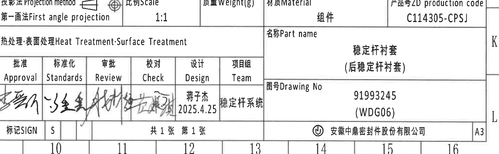

原图位置/视图名称：页 1，右下标题栏，bbox `[2770, 2760, 4820, 3395]`。

标题栏字段还原：

| 字段 | 原图文本 |
|---|---|
| 投影法 Projection method | 第一画法 First angle projection |
| 比例 Scale | 1:1 |
| 质量 Weight(g) |  |
| 材质 Material | 组件 |
| 产品号 ZD production code | C114305-CPSJ |
| 热处理/表面处理 Heat Treatment/Surface Treatment |  |
| 名称 Part name | 稳定杆衬套（后稳定杆衬套） |
| 批准 Approval | 手写签名 |
| 标准化 Standards | 手写签名 |
| 审批 Review | 手写签名 |
| 校对 Check | 手写签名 |
| 设计 Design | 蒋子杰 / 2025.4.25 |
| 项目组 Team | 稳定杆系统 |
| 图号 Drawing No | 91993245 (WDG06) |
| 标记 SIGN | S |
| 页数 | 共 1 张 第 1 张 |
| 公司 | 安徽中鼎密封件股份有限公司 |
| 图幅 | A3 |

提取表格：

| 提取项 | 原图数值或文本 | 含义说明 |
|---|---|---|
| 产品号 | C114305-CPSJ | 标题栏产品生产代码。 |
| 图号 | 91993245 (WDG06) | 本图纸号。 |
| 零件名称 | 稳定杆衬套（后稳定杆衬套） | 图纸描述的组件名称。 |
| 投影法 | First angle projection | 第一角法投影。 |
| 比例 | 1:1 | 图纸比例。 |
| 材质 | 组件 | 标题栏材料/材质字段。 |
| 设计信息 | 蒋子杰；2025.4.25 | 设计人员和日期。 |
| 项目组 | 稳定杆系统 | 所属项目组。 |
| 公司/图幅 | 安徽中鼎密封件股份有限公司；A3 | 出图公司和图幅。 |

边界归属说明：裁切完整覆盖标题栏主要字段、签字栏、图号栏和公司栏；底部图框分区数字 10-16 不是标题栏字段，不抽取。

## 裁切检查记录

| 对象 | 检查结果 |
|---|---|
| object_1 | 修订履历表边框、表头和两行记录完整；无边缘文字裁断。 |
| object_2 | 参数表全宽裁切，列头、合并单元格、所有 Variant 行完整；上缘少量邻表边线不抽取。 |
| object_3 | 正视图尺寸线、箭头、`ØEر0.3`、`(0.5)` 和材料标识完整；右侧邻视图边线残片不抽取。 |
| object_4 | 侧视图、A-A 剖切箭头、`26.5±0.3` 和型号标识完整；未混入 A-A 剖面数值。 |
| object_5 | A-A 剖面、`(RIR)`、`(RAR)`、`(0.5)` 和剖面名完整；下方 NOTES 已排除。 |
| object_6 | B-B 剖面、`(31.23)`、`(B)`、`T1±0.30`、`T2±0.30`、1/2/3 编号完整；底部邻近局部标识文字不抽取。 |
| object_7 | 右侧正视图和 B-B 剖切线完整；完整中文引出文字单独归入 object_8。 |
| object_8 | “杆径标识,MUBEA图号”文字和引出线完整；边缘残留 B 剖切线/NOTES 点号不抽取。 |
| object_9 | 底视图三处尺寸、箭头和“中鼎徽,型腔号,时间钟”引出文字完整；坐标轴已排除。 |
| object_10 | 立体图几何、`B` 标识和弧面标识完整；无 NOTES 或坐标轴混入。 |
| object_11 | X/Y/Z 坐标轴完整。 |
| object_12 | NOTES 1-8 条和中英文本完整；右侧仅图框线。 |
| object_13 | DIN ISO 3302-1 M2 公差表标题、表头和全部行完整；底部图框分区数字不抽取。 |
| object_14 | Reference 参考标准列表完整；右侧签字栏斜线残片不抽取。 |
| object_15 | BOM 三行、表头和边框完整；下缘标题栏文字残片不抽取。 |
| object_16 | 标题栏字段、签名栏、图号栏、公司栏完整；底部图框分区数字不抽取。 |
