# 20C114306 PDF 内容识别

原 PDF：`input/20C114306.pdf`  
整页 PNG：`outputs/20C114306_assets/images/page_1.png`  
页面：1 页，整页 PNG 尺寸 4959 x 3505 px。

## object_1 修订履历表 / Revision history

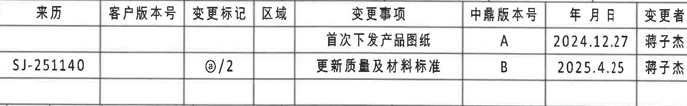

原图位置/视图名称：第 1 页右上角 A-B 区域，修订履历表。

| 来历 | 客户版本号 | 变更标记 | 区域 | 变更事项 | 中鼎版本号 | 年 月 日 | 变更者 |
|---|---|---|---|---|---|---|---|
|  |  |  |  | 首次下发产品图纸 | A | 2024.12.27 | 蒋子杰 |
| SJ-251140 |  | @/2 |  | 更新质量及材料标准 | B | 2025.4.25 | 蒋子杰 |

| 提取项 | 原图数值或文本 | 含义说明 |
|---|---|---|
| 修订版本 A | 首次下发产品图纸；2024.12.27；蒋子杰 | 首次发布产品图纸。 |
| 修订版本 B | SJ-251140；@/2；更新质量及材料标准；2025.4.25；蒋子杰 | 更新质量及材料标准，变更标记为 @/2。 |

边界归属说明：裁切仅包含修订履历表主体，右侧图框坐标字母未作为表格内容提取。

## object_2 变体参数总表 / Variant parameter table

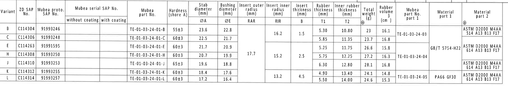

原图位置/视图名称：第 1 页上方 B-D 区域，变体参数总表。当前标题栏产品号 `C114306-CPSJ`、图号 `91993248` 对应本表 Variant `C` 行。

| Variant | ZD SAP No. | Mubea proto. SAP No. | Mubea serial SAP No. without coating | Mubea serial SAP No. with coating | Mubea part No. | Hardness (shore A) | ØA Stab diameter (mm) | ØE Bushing diameter (mm) | RAR Insert outer radius (mm) | RIR Insert inner radius (mm) | B Insert thickness (mm) | T1 Rubber thickness (mm) | T2 Inner rubber thickness (mm) | Total weight (g) | Rubber volume (cm³) | Mubea part No. part 1 | Material part 1 | Material part 2 |
|---|---|---|---|---|---|---|---:|---:|---:|---:|---:|---:|---:|---:|---:|---|---|---|
| B | C114304 | 91993246 |  |  | TE-01-03-24-01-B | 55±3 | 23.6 | 22.8 | 17.7 | 16.2 | 1.5 | 5.30 | 10.80 | 23 | 16.1 | TE-01-03-24-03 |  | ASTM D2000 M4AA 514 A13 B13 F17 |
| C | C114306 | 91993248 |  |  | TE-01-03-24-01-C | 60±3 | 22.5 | 21.7 | 17.7 | 16.2 | 1.5 | 5.85 | 11.35 | 23.7 | 16.8 | TE-01-03-24-03 |  | ASTM D2000 M4AA 514 A13 B13 F17 |
| E | C114263 | 91991595 |  |  | TE-01-03-24-01-E | 60±3 | 21.7 | 20.9 | 17.7 | 15.2 | 2.5 | 5.25 | 11.75 | 26.6 | 15.8 |  | GB/T 5754-H22 | ASTM D2000 M4AA 614 A13 B13 F17 |
| H | C114308 | 91993250 |  |  | TE-01-03-24-01-H | 60±3 | 20.7 | 19.9 | 17.7 | 15.2 | 2.5 | 5.75 | 12.25 | 27.2 | 16.3 | TE-01-03-24-04 | GB/T 5754-H22 | ASTM D2000 M4AA 614 A13 B13 F17 |
| J | C114310 | 91993253 |  |  | TE-01-03-24-01-J | 65±3 | 19.6 | 18.8 | 17.7 | 15.2 | 2.5 | 6.30 | 12.80 | 28.1 | 16.8 | TE-01-03-24-04 | GB/T 5754-H22 | ASTM D2000 M4AA 614 A13 B13 F17 |
| K | C114312 | 91993255 |  |  | TE-01-03-24-01-K | 60±3 | 18.4 | 17.6 |  | 13.2 | 4.5 | 4.90 | 13.40 | 24.1 | 14.8 | TE-01-03-24-05 | PA66 GF30 | ASTM D2000 M4AA 614 A13 B13 F17 |
| L | C114314 | 91993257 |  |  | TE-01-03-24-01-L | 60±3 | 17.2 | 16.4 |  | 13.2 | 4.5 | 5.50 | 14.00 | 24.6 | 15.3 | TE-01-03-24-05 | PA66 GF30 | ASTM D2000 M4AA 614 A13 B13 F17 |

| 提取项 | 原图数值或文本 | 含义说明 |
|---|---|---|
| 当前变体 | C；ZD SAP No. C114306；Mubea proto. SAP No. 91993248 | 与标题栏产品号/图号对应的当前图纸对象。 |
| 当前硬度 | 60±3 shore A | Variant C 橡胶硬度。 |
| 当前 ØA | 22.5 mm | 稳定杆直径参数。 |
| 当前 ØE | 21.7 mm | 衬套直径参数，用于端面视图 ØE±0.3 和正视图 21.7±0.3。 |
| 当前 RAR | 17.7 mm | 外嵌件半径参数，A-A 剖面以 `(RAR)` 引用。 |
| 当前 RIR | 16.2 mm | 内嵌件半径参数，A-A 剖面以 `(RIR)` 引用。 |
| 当前 B | 1.5 mm | 嵌件厚度参数，B-B 剖面以 `(B)` 引用。 |
| 当前 T1 | 5.85 mm | 橡胶厚度参数，B-B 剖面以 `T1±0.3` 引用。 |
| 当前 T2 | 11.35 mm | 内橡胶厚度参数，B-B 剖面以 `T2±0.3` 引用。 |
| 当前重量/体积 | 23.7 g；16.8 cm³ | Variant C 总重量和橡胶体积。 |

边界归属说明：该裁切只包含参数总表。RAR/RIR/B 列存在纵向合并单元格，按原图合并范围解释；不能把表下方视图尺寸归入表格。

## object_3 左上端面视图 / front end view

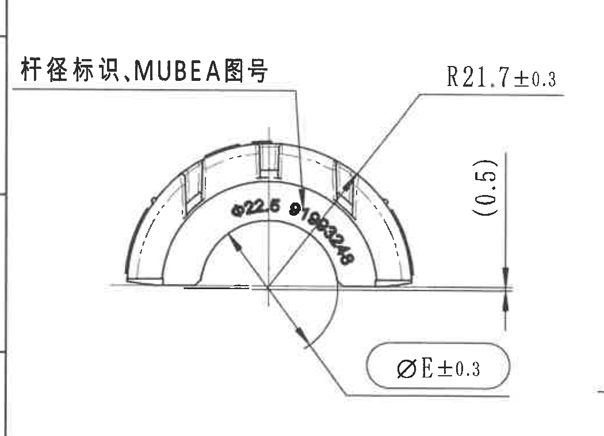

原图位置/视图名称：第 1 页左上绘图区 E-F 附近，左侧端面视图。

| 提取项 | 原图数值或文本 | 含义说明 |
|---|---|---|
| 标识说明 | 杆径标识、MUBEA图号 | 引线指向弧面标识区域。 |
| 外弧半径 | R21.7±0.3 | 外侧弧形半径尺寸，带 ±0.3 公差。 |
| 参考尺寸 | (0.5) | 括号内参考尺寸，位于视图右侧竖向小尺寸线上，用于说明边缘/台阶参考距离。 |
| 衬套直径 | ØE±0.3 | 直径符号尺寸；当前 Variant C 的 ØE=21.7，因此为 21.7±0.3。 |
| 弧面标识 | Ø22.6 91993248 | 弧向文字标识，包含杆径标识和图号；91993248 与标题栏 Drawing No. 一致。 |

边界归属说明：右侧相邻正视图的“型号标识”残边不可完全矩形剔除，未提取到本对象；本对象只提取端面视图内完整尺寸线、箭头和引线对应内容。

## object_4 中上正视图 / longitudinal view with A-A cutting plane

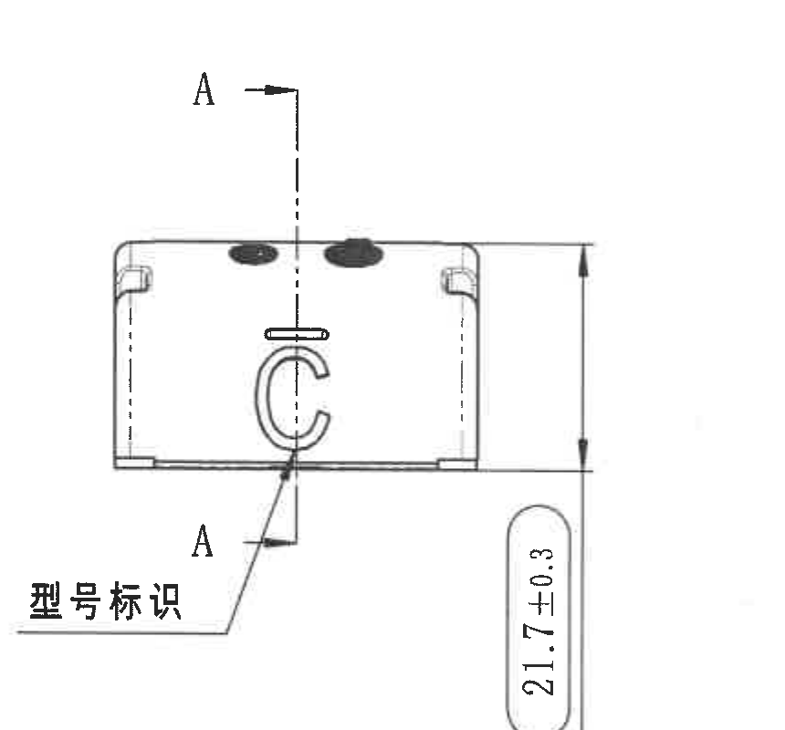

原图位置/视图名称：第 1 页中上绘图区 E-G 附近，带 A-A 剖切线的纵向视图。

| 提取项 | 原图数值或文本 | 含义说明 |
|---|---|---|
| 剖切线 | A-A | 指示 A-A 剖面位置和方向，对应 object_5。 |
| 总高度/外径相关尺寸 | 21.7±0.3 | 竖向尺寸，当前与 Variant C 的 ØE=21.7 对应，带 ±0.3 公差。 |
| 标识说明 | 型号标识 | 引线指向正面 C 型号标识区域。 |

边界归属说明：只提取正视图中的 A-A 剖切标记、型号标识和 21.7±0.3；A-A 剖面中的 RAR/RIR/(0.5) 不归入本视图。

## object_5 A-A 剖面 1:1 / section A-A

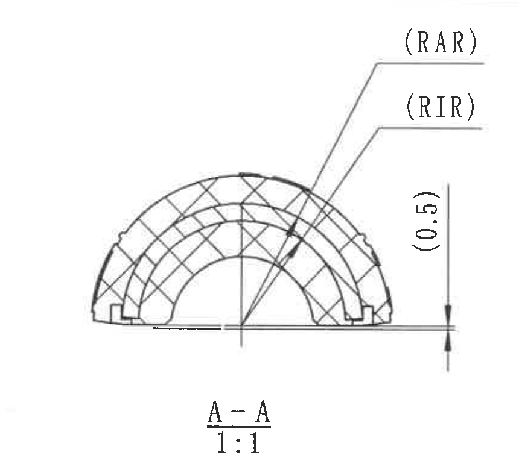

原图位置/视图名称：第 1 页中部 F-G 附近，A-A 剖面，比例 1:1。

| 提取项 | 原图数值或文本 | 含义说明 |
|---|---|---|
| 剖面名称/比例 | A-A；1:1 | 来自 object_4 的 A-A 剖切位置。 |
| 外嵌件半径参数 | (RAR) | 括号内参数引用/参考标注；当前 Variant C 的 RAR=17.7 mm。 |
| 内嵌件半径参数 | (RIR) | 括号内参数引用/参考标注；当前 Variant C 的 RIR=16.2 mm。 |
| 参考尺寸 | (0.5) | 括号内参考尺寸，位于剖面右侧竖向小尺寸线上。 |

边界归属说明：右侧可见 `(B)` 的完整归属为 B-B/嵌件厚度参数，不提取到 A-A；A-A 只包含剖面线、剖面名称和 RAR/RIR/(0.5)。

## object_6 B-B 剖面 1:1 / section B-B

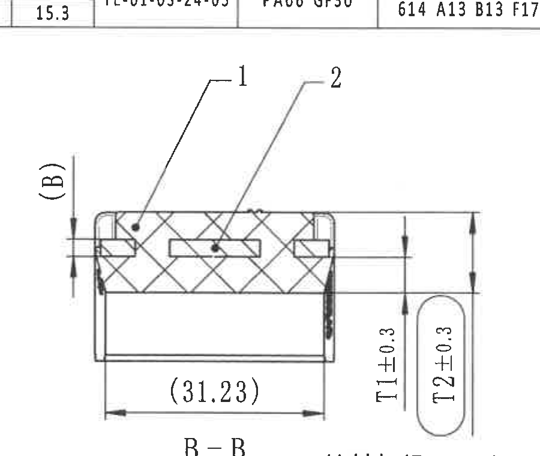

原图位置/视图名称：第 1 页右中部 E-G 附近，B-B 剖面，比例 1:1。

| 提取项 | 原图数值或文本 | 含义说明 |
|---|---|---|
| 剖面名称/比例 | B-B；1:1 | 来自 object_7 的 B-B 剖切位置。 |
| BOM 序号 | 1 | 指向橡胶，对应 BOM 序号 1。 |
| BOM 序号 | 2 | 指向铝骨架，对应 BOM 序号 2。 |
| 参考宽度 | (31.23) | 括号内参考尺寸，位于剖面下方水平尺寸线。 |
| 橡胶厚度 | T1±0.3 | 当前 Variant C 的 T1=5.85，因此为 5.85±0.3。 |
| 内橡胶厚度 | T2±0.3 | 当前 Variant C 的 T2=11.35，因此为 11.35±0.3。 |
| 嵌件厚度参数 | (B) | 参数引用/参考标注；当前 Variant C 的 B=1.5 mm。 |

边界归属说明：B-B 裁切底部可见材料标识文字边缘，这是相邻右端面视图引线文字，未在本对象提取；本对象只提取 B-B 剖面内部的序号、参考尺寸和 T1/T2/(B)。

## object_7 右侧端面视图 / end view with B-B cutting plane and material mark

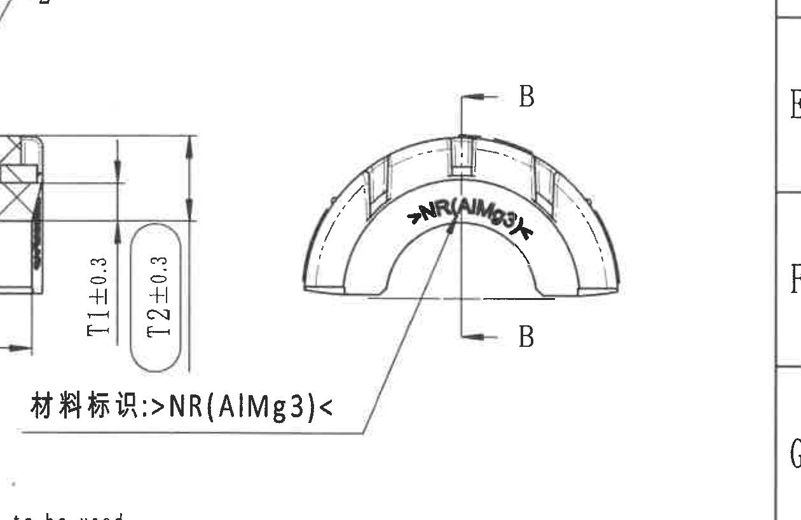

原图位置/视图名称：第 1 页右侧 E-G 附近，端面视图和 B-B 剖切标记。

| 提取项 | 原图数值或文本 | 含义说明 |
|---|---|---|
| 剖切标记 | B-B | 指示 B-B 剖面位置，对应 object_6。 |
| 材料标识 | 材料标识: >NR(AIMg3)< | 引线指向弧面材料标记。 |

边界归属说明：左侧靠近的 T1/T2 尺寸和 B-B 剖面边缘属于 object_6；本对象只提取端面视图的剖切标记和材料标识。

## object_8 左下俯视图 / top view

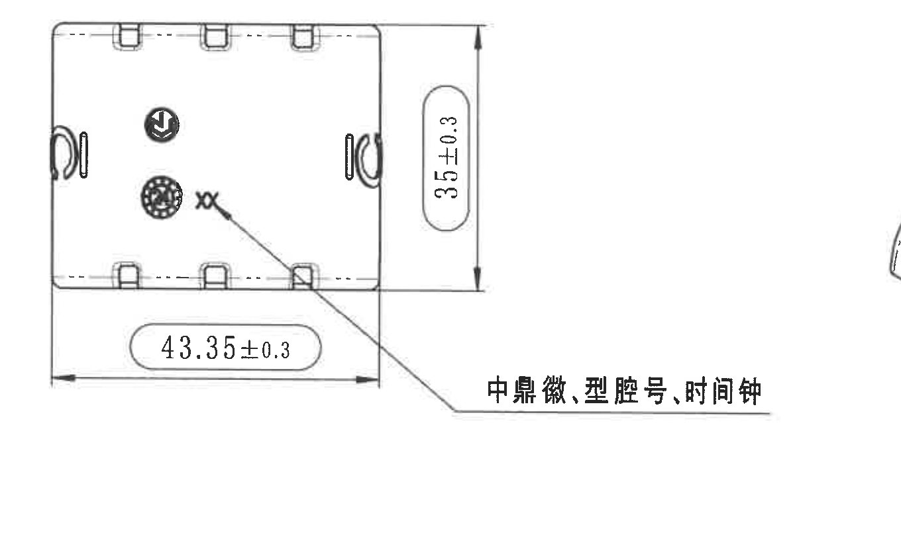

原图位置/视图名称：第 1 页左下 H-I 附近，俯视图。

| 提取项 | 原图数值或文本 | 含义说明 |
|---|---|---|
| 竖向尺寸 | 35±0.3 | 视图右侧竖向尺寸，带 ±0.3 公差。 |
| 水平总长 | 43.35±0.3 | 视图底部水平尺寸，带 ±0.3 公差。 |
| 表面标识说明 | 中鼎徽、型腔号、时间钟 | 引线指向零件表面对应标识区。 |
| 表面文字 | XX | 位于表面标识附近的字符。 |

边界归属说明：该裁切只包含俯视图、两个尺寸线和标识引线；不包含中部等轴测或标准公差表内容。

## object_9 等轴测视图及坐标方向 / isometric view and axes

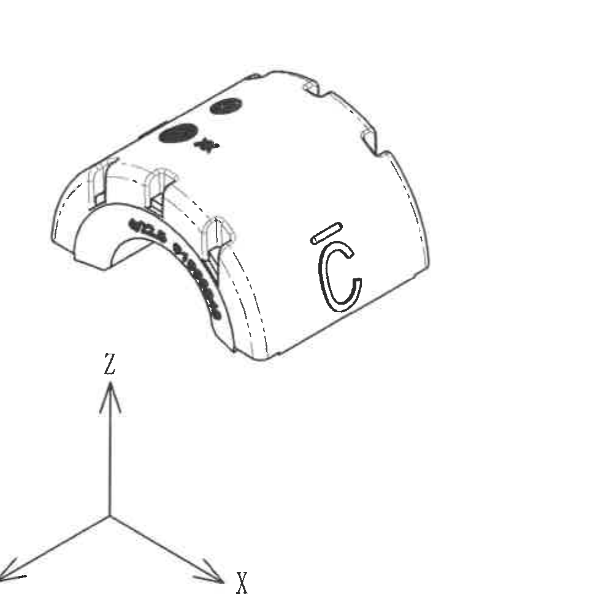

原图位置/视图名称：第 1 页下中部 H-K 附近，等轴测视图和坐标方向。

| 提取项 | 原图数值或文本 | 含义说明 |
|---|---|---|
| 等轴测图 | 零件立体外观 | 显示弧形套、标识、卡槽和凸台的空间关系。 |
| 坐标方向 | Z、Y、X | 图中方向参考。 |

边界归属说明：该视图未标独立尺寸；仅作为外观和方向参考。右侧 NOTES 和标题栏不归入本对象。

## object_10 Specification 技术要求 / notes

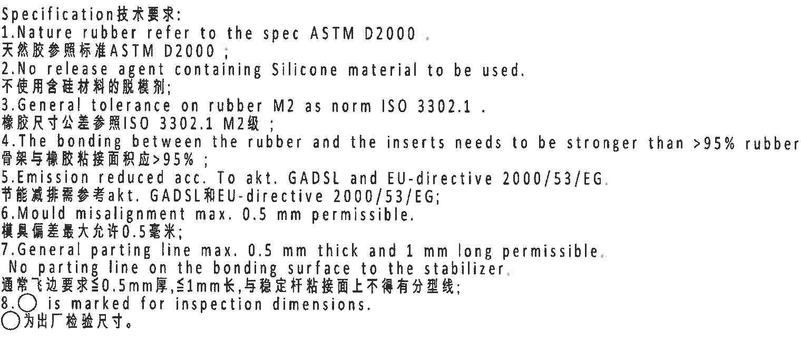

原图位置/视图名称：第 1 页中右下 G-I 附近，Specification 技术要求。

| 提取项 | 原图数值或文本 | 含义说明 |
|---|---|---|
| 1 | Nature rubber refer to the spec ASTM D2000. / 天然胶参照标准 ASTM D2000； | 天然橡胶材料标准。 |
| 2 | No release agent containing Silicone material to be used. / 不使用含硅材料的脱模剂； | 脱模剂限制。 |
| 3 | General tolerance on rubber M2 as norm ISO 3302.1. / 橡胶尺寸公差参照 ISO 3302.1 M2级； | 橡胶通用公差等级。 |
| 4 | The bonding between the rubber and the inserts needs to be stronger than >95% rubber break. / 骨架与橡胶粘接面积应 >95%； | 橡胶与嵌件粘接强度要求。 |
| 5 | Emission reduced acc. To akt. GADSL and EU-directive 2000/53/EG. / 节能减排需参考 akt. GADSL 和 EU-directive 2000/53/EG； | 环保法规/清单要求。 |
| 6 | Mould misalignment max. 0.5 mm permissible. / 模具偏差最大允许 0.5 毫米； | 模具错位允许值。 |
| 7 | General parting line max. 0.5 mm thick and 1 mm long permissible. No parting line on the bonding surface to the stabilizer. / 通常飞边要求 ≤0.5 mm 厚，≤1 mm 长，与稳定杆粘接面上不得有分型线； | 飞边/分型线限制。 |
| 8 | ○ is marked for inspection dimensions. / ○ 为出厂检验尺寸。 | 圆圈标识的尺寸为检验尺寸。 |

边界归属说明：该裁切只包含技术要求文本；下方 BOM 和标题栏不归入本对象。

## object_11 DIN ISO 3302-1 M2 class 标准公差表

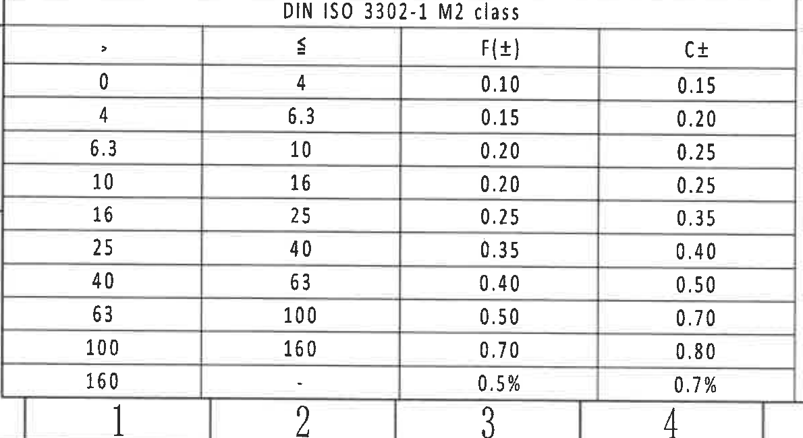

原图位置/视图名称：第 1 页左下 K-L 附近，标准公差表。

| > | ≤ | F(±) | C± |
|---:|---:|---:|---:|
| 0 | 4 | 0.10 | 0.15 |
| 4 | 6.3 | 0.15 | 0.20 |
| 6.3 | 10 | 0.20 | 0.25 |
| 10 | 16 | 0.20 | 0.25 |
| 16 | 25 | 0.25 | 0.35 |
| 25 | 40 | 0.35 | 0.40 |
| 40 | 63 | 0.40 | 0.50 |
| 63 | 100 | 0.50 | 0.70 |
| 100 | 160 | 0.70 | 0.80 |
| 160 | - | 0.5% | 0.7% |

| 提取项 | 原图数值或文本 | 含义说明 |
|---|---|---|
| 表名 | DIN ISO 3302-1 M2 class | 与技术要求第 3 条的橡胶通用公差对应。 |
| 列定义 | `>`、`≤`、`F(±)`、`C±` | 按尺寸范围给出 F 和 C 类公差。 |

边界归属说明：裁切包含完整表头和所有行；底部图框编号不是表格数据，未提取。

## object_12 BOM / parts list

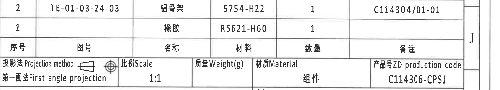

原图位置/视图名称：第 1 页右下标题栏上方 J 附近，BOM/零件明细表。

| 序号 | 图号 | 名称 | 材料 | 数量 | 备注 |
|---:|---|---|---|---:|---|
| 2 | TE-01-03-24-03 | 铝骨架 | 5754-H22 | 1 | C114304/01-01 |
| 1 |  | 橡胶 | R5621-H60 | 1 |  |

| 提取项 | 原图数值或文本 | 含义说明 |
|---|---|---|
| 序号 2 | TE-01-03-24-03；铝骨架；5754-H22；数量 1；备注 C114304/01-01 | 对应 B-B 剖面中序号 2。 |
| 序号 1 | 橡胶；R5621-H60；数量 1 | 对应 B-B 剖面中序号 1。 |

边界归属说明：该裁切只包含 BOM 表；下方投影法/比例/标题栏字段归入 object_13。

## object_13 标题栏 / title block

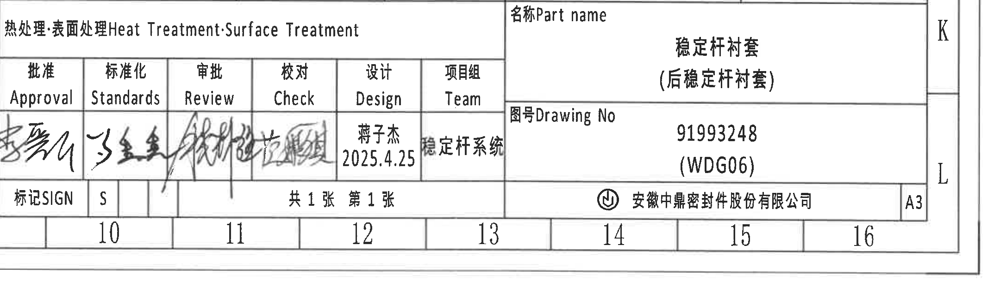

原图位置/视图名称：第 1 页右下 K-L 区域，标题栏。

| 字段 | 原图数值或文本 | 含义说明 |
|---|---|---|
| Projection method 投影法 | 第一画法 First angle projection | 图纸投影法。 |
| Scale 比例 | 1:1 | 图纸比例。 |
| Weight(g) 质量 | 空 | 标题栏未填写质量。 |
| Material 材质 | 组件 | 材质栏标为组件。 |
| ZD production code 产品号 | C114306-CPSJ | 与参数表 Variant C 的 ZD SAP No. C114306 对应。 |
| Heat Treatment·Surface Treatment 热处理·表面处理 | 空 | 未填写热处理/表面处理。 |
| Part name 名称 | 稳定杆衬套（后稳定杆衬套） | 零件名称。 |
| Drawing No 图号 | 91993248 (WDG06) | 与参数表 Variant C 的 Mubea proto. SAP No. 91993248 和左上端面弧面标识一致。 |
| Approval 批准 | 签名 | 签审栏。 |
| Standards 标准化 | 签名 | 签审栏。 |
| Review 审批 | 签名 | 签审栏。 |
| Check 校对 | 签名 | 签审栏。 |
| Design 设计 | 蒋子杰 2025.4.25 | 设计者和日期。 |
| Team 项目组 | 稳定杆系统 | 项目组。 |
| SIGN 标记 | S | 标记字段。 |
| 页码 | 共1张 第1张 | 页码/总页数。 |
| 公司 | 安徽中鼎密封件股份有限公司 | 出图单位。 |
| 图幅 | A3 | 图幅。 |

边界归属说明：裁切从 BOM 下方开始，包含标题栏主体和底部图框；上方 BOM 表归入 object_12，左侧 Reference 参考标准归入 object_14。

## object_14 Reference 参考标准 / reference list

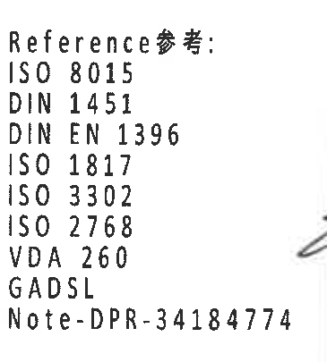

原图位置/视图名称：第 1 页下中偏右 K-L 附近，标题栏左侧 Reference 参考块。

| 提取项 | 原图数值或文本 | 含义说明 |
|---|---|---|
| Reference参考 | ISO 8015 | 引用标准。 |
| Reference参考 | DIN 1451 | 引用标准。 |
| Reference参考 | DIN EN 1396 | 引用标准。 |
| Reference参考 | ISO 1817 | 引用标准。 |
| Reference参考 | ISO 3302 | 引用标准。 |
| Reference参考 | ISO 2768 | 引用标准。 |
| Reference参考 | VDA 260 | 引用标准。 |
| Reference参考 | GADSL | 引用清单/要求。 |
| Reference参考 | Note-DPR-34184774 | 图纸备注/规范编号。 |

边界归属说明：裁切只包含参考标准清单；右侧标题栏签审表未作为本对象内容提取。

## 裁切检查记录

| 对象 | 图片路径 | 检查结果 |
|---|---|---|
| object_1 | outputs/20C114306_assets/images/object_1.png | 完整包含修订表行列和文字；右侧图框坐标字母已排除。 |
| object_2 | outputs/20C114306_assets/images/object_2.png | 完整包含参数表表头、行列、合并单元格和所有可见文字；未包含下方视图尺寸。 |
| object_3 | outputs/20C114306_assets/images/object_3.png | 完整包含 R21.7±0.3、(0.5)、ØE±0.3、弧面文字和引线；右侧相邻“型号标识”有残边，未提取为本视图内容。 |
| object_4 | outputs/20C114306_assets/images/object_4.png | 完整包含 A-A 剖切线、型号标识引线和 21.7±0.3；未混入 A-A 剖面尺寸。 |
| object_5 | outputs/20C114306_assets/images/object_5.png | 完整包含 A-A、1:1、(RAR)、(RIR)、(0.5) 及尺寸线；右侧 (B) 属 B-B/嵌件厚度参数，未作为本对象提取。 |
| object_6 | outputs/20C114306_assets/images/object_6.png | 完整包含 B-B、1:1、序号 1/2、(31.23)、T1±0.3、T2±0.3、(B)；底部可见材料标识边缘属 object_7，未提取。 |
| object_7 | outputs/20C114306_assets/images/object_7.png | 完整包含右侧端面、B-B 剖切标记和材料标识引线；左侧 T1/T2 和 B-B 剖面边缘属 object_6。 |
| object_8 | outputs/20C114306_assets/images/object_8.png | 完整包含 35±0.3、43.35±0.3、标识引线和文字；未包含等轴测图或公差表。 |
| object_9 | outputs/20C114306_assets/images/object_9.png | 完整包含等轴测视图和 X/Y/Z 坐标方向；未包含右侧 NOTES/标题栏。 |
| object_10 | outputs/20C114306_assets/images/object_10.png | 完整包含 Specification 技术要求 1-8 条文字；未包含 BOM。 |
| object_11 | outputs/20C114306_assets/images/object_11.png | 完整包含 DIN ISO 3302-1 M2 class 表头和全部行；底部图框编号未作为表格数据提取。 |
| object_12 | outputs/20C114306_assets/images/object_12.png | 完整包含 BOM 两行和表头；未包含下方标题栏字段。 |
| object_13 | outputs/20C114306_assets/images/object_13.png | 完整包含标题栏主体、签审栏、产品号、名称、图号、公司和图幅；不含上方 BOM。 |
| object_14 | outputs/20C114306_assets/images/object_14.png | 完整包含 Reference 参考标准清单；右侧标题栏签名区域已排除。 |
