# 20C114307.pdf 内容识别

整页渲染图：

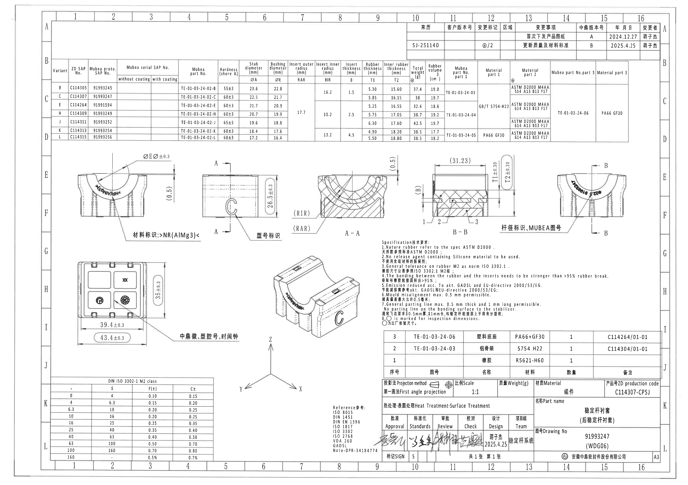

PDF 为 1 页 A3 扫描图，已先渲染为整页 PNG，再按修订履历表、规格参数表、加工视图、剖面视图、底视图、等轴测图、NOTES、公差表、参考标准、BOM、标题栏、方向坐标分别裁切。以下对象顺序按原图从上到下、从左到右排列。尺寸单位按原图默认单位 mm，重量 g，体积 cm³。

## object_1 修订履历表

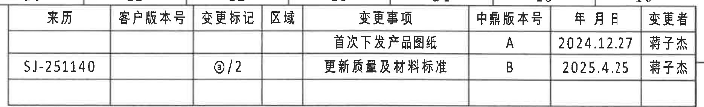

原图位置/视图名称：页 1 右上角修订履历表。

原表还原：

| 来历 | 客户版本号 | 变更标记 | 区域 | 变更事项 | 中鼎版本号 | 年月日 | 变更者 |
|---|---|---|---|---|---|---|---|
|  |  |  |  | 首次下发产品图纸 | A | 2024.12.27 | 蒋子杰 |
| SJ-251140 |  | @/2 |  | 更新质量及材料标准 | B | 2025.4.25 | 蒋子杰 |
|  |  |  |  |  |  |  |  |

提取表格：

| 提取项 | 原图数值或文本 | 含义说明 |
|---|---|---|
| 修订 A | 首次下发产品图纸；中鼎版本号 A；2024.12.27；蒋子杰 | 首版产品图纸下发记录。 |
| 修订 B | 来历 SJ-251140；变更标记 @/2；更新质量及材料标准；中鼎版本号 B；2025.4.25；蒋子杰 | 本图当前版本相关的质量及材料标准更新记录。 |
| 空白单元格 | 客户版本号、区域等空白 | 原图对应单元格为空，未补填。 |

边界归属说明：裁切区域只提取修订履历表；上边缘可见图框坐标线，不属于表格内容，未作为修订信息提取。

## object_2 规格参数表

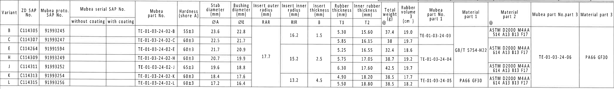

原图位置/视图名称：页 1 上部横向规格参数表。

原表还原：

| Variant | ZD SAP No. | Mubea proto. SAP No. | Mubea serial SAP No. without coating | Mubea serial SAP No. with coating | Mubea part No. | Hardness (shore A) | Stab diameter ØA (mm) | Bushing diameter ØE (mm) | Insert outer radius RAR (mm) | Insert inner radius RIR (mm) | Insert thickness B (mm) | Rubber thickness T1 (mm) | Inner rubber thickness T2 (mm) | Total weight (g) | Rubber volume (cm³) | Mubea part No. part 1 | Material part 1 | Material part 2 | Mubea part No. part 3 | Material part 3 |
|---|---|---|---|---|---|---|---:|---:|---:|---:|---:|---:|---:|---:|---:|---|---|---|---|---|
| B | C114305 | 91993245 |  |  | TE-01-03-24-02-B | 55±3 | 23.6 | 22.8 |  | 16.2 | 1.5 | 5.30 | 15.60 | 37.4 | 19.0 | TE-01-03-24-03 |  | ASTM D2000 M4AA 514 A13 B13 F17 |  |  |
| C | C114307 | 91993247 |  |  | TE-01-03-24-02-C | 60±3 | 22.5 | 21.7 |  | 16.2 | 1.5 | 5.85 | 16.15 | 38 | 19.7 | TE-01-03-24-03 |  | ASTM D2000 M4AA 514 A13 B13 F17 |  |  |
| E | C114264 | 91991594 |  |  | TE-01-03-24-02-E | 60±3 | 21.7 | 20.9 | 17.7 | 15.2 | 2.5 | 5.25 | 16.55 | 32.4 | 18.6 | TE-01-03-24-04 | GB/T 5754-H22 | ASTM D2000 M4AA 614 A13 B13 F17 | TE-01-03-24-06 | PA66 GF30 |
| H | C114309 | 91993249 |  |  | TE-01-03-24-02-H | 60±3 | 20.7 | 19.9 | 17.7 | 15.2 | 2.5 | 5.75 | 17.05 | 38.7 | 19.2 | TE-01-03-24-04 | GB/T 5754-H22 | ASTM D2000 M4AA 614 A13 B13 F17 | TE-01-03-24-06 | PA66 GF30 |
| J | C114311 | 91993252 |  |  | TE-01-03-24-02-J | 65±3 | 19.6 | 18.8 | 17.7 | 15.2 | 2.5 | 6.30 | 17.60 | 42.5 | 19.7 | TE-01-03-24-04 | GB/T 5754-H22 | ASTM D2000 M4AA 614 A13 B13 F17 | TE-01-03-24-06 | PA66 GF30 |
| K | C114313 | 91993254 |  |  | TE-01-03-24-02-K | 60±3 | 18.4 | 17.6 |  | 13.2 | 4.5 | 4.90 | 18.20 | 38.5 | 17.7 | TE-01-03-24-05 | PA66 GF30 | ASTM D2000 M4AA 614 A13 B13 F17 |  |  |
| L | C114315 | 91993256 |  |  | TE-01-03-24-02-L | 60±3 | 17.2 | 16.4 |  | 13.2 | 4.5 | 5.50 | 18.80 | 38.5 | 18.2 | TE-01-03-24-05 | PA66 GF30 | ASTM D2000 M4AA 614 A13 B13 F17 |  |  |

提取表格：

| 提取项 | 原图数值或文本 | 含义说明 |
|---|---|---|
| 当前图纸对应 Variant | C；ZD SAP No. C114307；Mubea proto. SAP No. 91993247 | 与标题栏 Drawing No. 91993247 对应。 |
| ØA | 23.6, 22.5, 21.7, 20.7, 19.6, 18.4, 17.2 | 稳定杆直径变量；具体值随 Variant 变化。 |
| ØE | 22.8, 21.7, 20.9, 19.9, 18.8, 17.6, 16.4 | 衬套孔/衬套直径变量；与前视图的 ØE 标注关联。 |
| RAR | 17.7（E/H/J 合并单元格）；B/C、K/L 空白 | Insert outer radius 外侧嵌件半径变量；A-A 剖面中以 (RAR) 标出。 |
| RIR | 16.2（B/C）；15.2（E/H/J）；13.2（K/L） | Insert inner radius 内侧嵌件半径变量；A-A 剖面中以 (RIR) 标出。 |
| B | 1.5（B/C）；2.5（E/H/J）；4.5（K/L） | Insert thickness 嵌件厚度变量；B-B 剖面左侧以 (B) 标出。 |
| T1 | 5.30, 5.85, 5.25, 5.75, 6.30, 4.90, 5.50 | 橡胶厚度变量；B-B 剖面中以 T1±0.30 标出。 |
| T2 | 15.60, 16.15, 16.55, 17.05, 17.60, 18.20, 18.80 | 内侧橡胶厚度变量；B-B 剖面中以 T2±0.30 标出。 |
| 硬度 | 55±3、60±3、65±3 | 橡胶 Shore A 硬度规格；J 为 65±3，其余按表。 |
| 材料字段 | ASTM D2000 M4AA 514 A13 B13 F17；ASTM D2000 M4AA 614 A13 B13 F17；GB/T 5754-H22；PA66 GF30 | 组件材料标准与子件材料，合并单元格按原图跨行适用。 |
| 重量与体积 | Total weight 32.4-42.5 g；Rubber volume 17.7-19.7 cm³ | Variant 对应重量和橡胶体积。 |

边界归属说明：该裁切为完整规格参数表，顶部轻微包含图框线；所有表头、列线、合并单元格和行值归属于本对象。未把下方加工视图中的尺寸提取到本表。

## object_3 左前视图

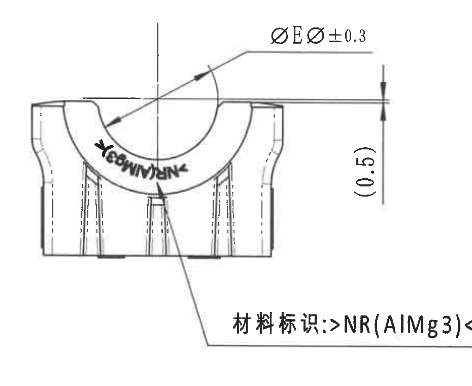

原图位置/视图名称：页 1 中左部左前视图，含材料标识引出线。

提取表格：

| 提取项 | 原图数值或文本 | 含义说明 |
|---|---|---|
| 直径尺寸 | ØEر0.3 | 前视图上方弧口相关直径标注；E 值由规格表 ØE 列确定，公差 ±0.3。原图中直径符号位于 E 字母前后。 |
| 参考尺寸 | (0.5) | 右侧竖向括号尺寸，表示参考/检查用的 0.5 尺寸；括号表明非直接控制尺寸，但仍属于本前视图。 |
| 材料标识 | 材料标识: >NR(AlMg3)< | 指向前视图下部标识位置；标注材料/标识内容。 |
| 弧形印字 | MUBEA/标识类弧形印字 | 位于弧口外侧，作为外观标识；未作为尺寸数值。 |
| 角度/弧向尺寸 | 未见角度数值或弧长数值 | 本视图只有弧形轮廓和直径/参考尺寸，没有角度或弧长数字。 |

边界归属说明：右侧边缘为保留完整 (0.5) 参考尺寸线而带有相邻侧视图的一小段轮廓线，该线不属于左前视图提取内容；本对象只提取 ØE、(0.5)、材料标识和本视图弧形印字。

## object_4 侧视图及 A-A 剖切位置

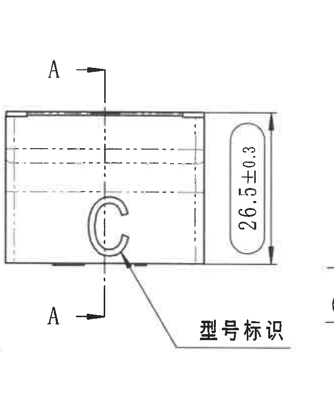

原图位置/视图名称：页 1 中部偏左侧视图，含 A-A 剖切线和型号标识。

提取表格：

| 提取项 | 原图数值或文本 | 含义说明 |
|---|---|---|
| 总高度 | 26.5±0.3 | 侧视图右侧竖向外形高度尺寸，公差 ±0.3。 |
| 剖切标识 | A-A | 竖向剖切线和上下箭头指示 A-A 剖面位置；对应 object_5。 |
| 型号标识 | 型号标识 | 引出线指向侧面 C 形标识区域。 |
| 隐藏线 | 多条横向虚线 | 表示内部结构或不可见边线。 |
| 弧度/角度 | 未见角度或半径数值 | 本侧视图不提取 A-A 剖面的 RIR/RAR；这些归属于 object_5。 |

边界归属说明：左边缘未提取上一前视图的材料标识尾线；右边缘可见 A-A 剖面尺寸线端部灰影但无完整文字，未归入本侧视图。完整的 (RIR)/(RAR) 位于 object_5。

## object_5 A-A 剖面视图

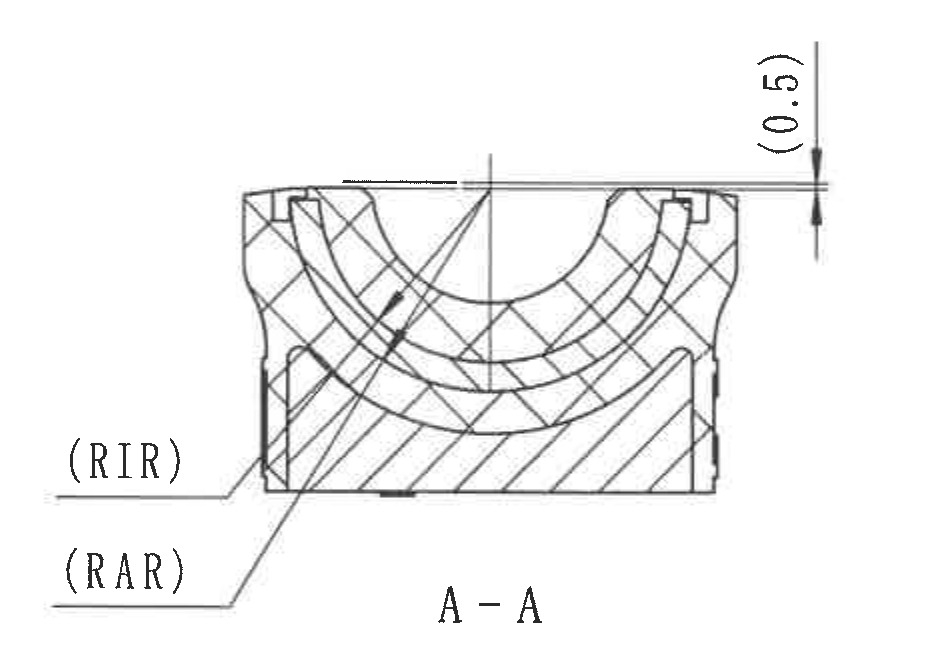

原图位置/视图名称：页 1 中部 A-A 剖面。

提取表格：

| 提取项 | 原图数值或文本 | 含义说明 |
|---|---|---|
| 剖面名称 | A-A | 与 object_4 的 A-A 剖切线对应。 |
| 参考尺寸 | (0.5) | 剖面上方右侧竖向括号尺寸；为参考/检查含义，仍属于 A-A 剖面。 |
| 内侧半径 | (RIR) | Insert inner radius，括号表示参数/参考标注；具体数值由规格表 RIR 列按 Variant 确定。 |
| 外侧半径 | (RAR) | Insert outer radius，括号表示参数/参考标注；具体数值由规格表 RAR 列按 Variant 确定。 |
| 剖面材料表示 | 交叉剖线和斜剖线 | 表示不同材料/构件在剖面中的实体区域。 |
| 角度/弧向尺寸 | 未见角度或弧长数值 | 只有半径参数 RIR/RAR，没有角度值。 |

边界归属说明：裁切完整包含 (0.5)、(RIR)、(RAR) 的箭头、引出线和文字；未包含 B-B 剖面尺寸，未带入 NOTES 正文。

## object_6 B-B 剖面视图

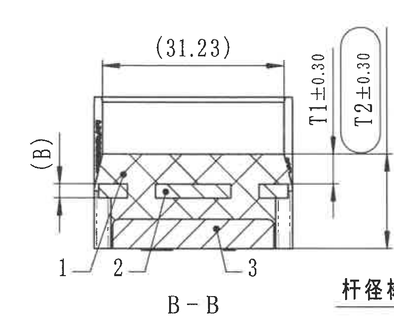

原图位置/视图名称：页 1 中部偏右 B-B 剖面。

提取表格：

| 提取项 | 原图数值或文本 | 含义说明 |
|---|---|---|
| 剖面名称 | B-B | 与 object_7 的 B-B 剖切线对应。 |
| 水平参考尺寸 | (31.23) | B-B 上方水平尺寸，括号表示参考尺寸；用于说明剖面宽度关系。 |
| 左侧厚度参数 | (B) | 左侧竖向括号参数，关联规格表 Insert thickness B 列。 |
| 橡胶厚度 | T1±0.30 | B-B 右侧竖向厚度尺寸；T1 具体值由规格表 T1 列确定，公差 ±0.30。 |
| 内侧橡胶厚度 | T2±0.30 | B-B 右侧竖向厚度尺寸；T2 具体值由规格表 T2 列确定，公差 ±0.30。 |
| 构件编号 | 1、2、3 | 剖面下方引出编号；对应 BOM：1 橡胶，2 铝骨架，3 塑料底座。 |
| 剖面材料表示 | 交叉剖线、斜剖线、空白矩形嵌件区 | 表示橡胶、金属/塑料嵌件和空腔/嵌入区域的相对位置。 |

边界归属说明：为完整包含 T2±0.30 的尺寸线，右下角保留了右前视说明“杆径标识”开头的少量片段；该片段不属于 B-B，不在本对象中提取。B-B 的 (31.23)、(B)、T1、T2、1/2/3 均完整。

## object_7 右前视图及 B-B 剖切位置

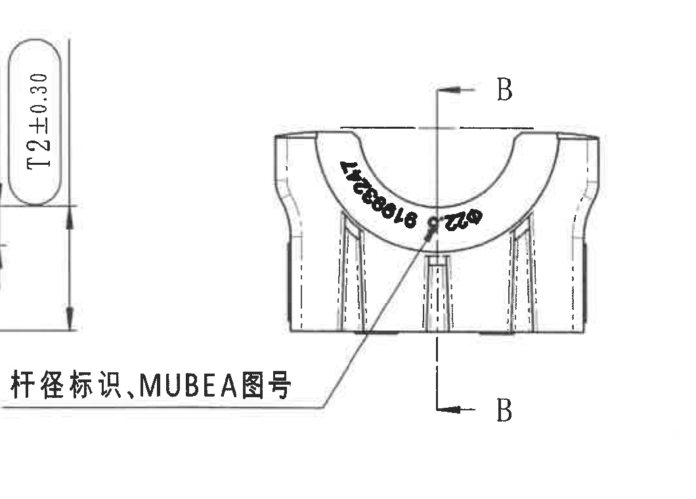

原图位置/视图名称：页 1 中右部右前视图，含 B-B 剖切线和杆径/MUBEA 图号标识说明。

提取表格：

| 提取项 | 原图数值或文本 | 含义说明 |
|---|---|---|
| 剖切标识 | B-B | 竖向剖切线和上下箭头指示 B-B 剖面位置；对应 object_6。 |
| 标识说明 | 杆径标识,MUBEA图号 | 引出线指向弧口外侧黑色弧形标识，表示该处包含杆径标识和 MUBEA 图号。 |
| 弧形印字 | 黑色弧形印字 | 扫描件中弧形小字局部重叠，按引出说明归类为杆径标识/MUBEA 图号，不作为尺寸数值。 |
| 角度/尺寸 | 未见独立角度或尺寸数值 | 本视图只给出 B-B 剖切位置和标识说明，尺寸归属于 B-B 或规格表。 |

边界归属说明：左侧可见 B-B 剖面 T2±0.30 的残片，这是相邻剖面尺寸，不归入右前视图；本对象只提取 B-B 剖切线、右前视本体和“杆径标识,MUBEA图号”引出说明。

## object_8 底视图

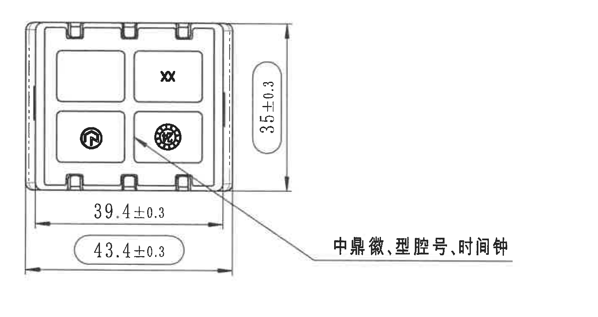

原图位置/视图名称：页 1 左下部底视图，含中鼎徽、型腔号、时间轴说明。

提取表格：

| 提取项 | 原图数值或文本 | 含义说明 |
|---|---|---|
| 竖向总尺寸 | 35±0.3 | 底视图右侧竖向尺寸；椭圆框标出，按 NOTES 第 8 条为检验尺寸标记。 |
| 横向内侧尺寸 | 39.4±0.3 | 底部上方水平尺寸，表示内部/基准宽度。 |
| 横向总尺寸 | 43.4±0.3 | 底部下方水平尺寸；椭圆框标出，按 NOTES 第 8 条为检验尺寸标记。 |
| 标识说明 | 中鼎徽, 型腔号, 时间轴 | 引出线指向底面标识区域，包含中鼎徽、型腔号和时间轴/日期轮标记。 |
| 内部标识 | XX、圆形中鼎徽、圆形时间轴图案 | 位于底视图四格区域内；属于外观/模具标识。 |
| 角度/弧向尺寸 | 未见角度或弧长数值 | 本视图无角度或弧向尺寸。 |

边界归属说明：裁切完整包含 35±0.3、39.4±0.3、43.4±0.3 的尺寸线、箭头和文字；右侧只到“中鼎徽, 型腔号, 时间轴”完整文本，未带入等轴测图或坐标轴。

## object_9 等轴测视图

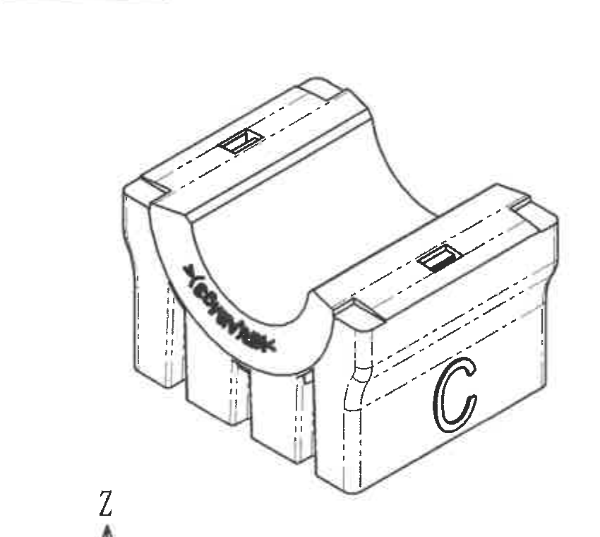

原图位置/视图名称：页 1 中下部等轴测视图。

提取表格：

| 提取项 | 原图数值或文本 | 含义说明 |
|---|---|---|
| 视图类型 | 等轴测外形视图 | 显示零件三维外观、槽口、弧口、侧面 C 形标识和上表面矩形标识。 |
| 弧形标识 | MUBEA/外观标识 | 位于弧口外侧；用于外观识别，不是尺寸。 |
| 侧面标识 | C | 侧面大写 C 形标识，与侧视/右前视的型号标识区域相关。 |
| 隐藏线 | 多条虚线 | 表示内部或背面不可见结构。 |
| 尺寸/角度 | 未见尺寸数值 | 等轴测图未标注尺寸、公差、角度或半径。 |

边界归属说明：右边界已避开 NOTES；底部只可见方向坐标 Z 的顶端残片，不属于等轴测图提取内容，完整方向坐标另见 object_15。

## object_10 NOTES / Specification 技术要求

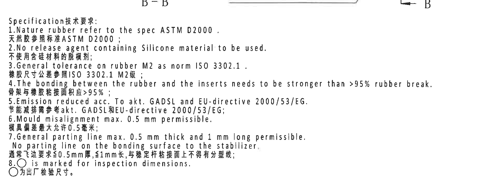

原图位置/视图名称：页 1 中右下 NOTES 技术要求。

原文还原：

| 行号 | 原图文本 |
|---|---|
| 标题 | Specification技术要求: |
| 1 | Nature rubber refer to the spec ASTM D2000, |
| 1 中文 | 天然胶参照标准ASTM D2000； |
| 2 | No release agent containing Silicone material to be used. |
| 2 中文 | 不使用含硅材料的脱模剂； |
| 3 | General tolerance on rubber M2 as norm ISO 3302.1 . |
| 3 中文 | 橡胶尺寸公差参照ISO 3302.1 M2级； |
| 4 | The bonding between the rubber and the inserts needs to be stronger than >95% rubber break. |
| 4 中文 | 骨架与橡胶粘接面积应>95%； |
| 5 | Emission reduced acc. To akt. GADSL and EU-directive 2000/53/EG. |
| 5 中文 | 节能减排需参考akt. GADSL和EU-directive 2000/53/EG； |
| 6 | Mould misalignment max. 0.5 mm permissible. |
| 6 中文 | 模具偏差最大允许0.5毫米； |
| 7 | General parting line max. 0.5 mm thick and 1 mm long permissible. |
| 7 续 | No parting line on the bonding surface to the stabilizer. |
| 7 中文 | 通常飞边要求≤0.5mm厚,≤1mm长,与稳定杆粘接面上不得有分型线； |
| 8 | ○ is marked for inspection dimensions. |
| 8 中文 | ○为出厂检验尺寸。 |

提取表格：

| 提取项 | 原图数值或文本 | 含义说明 |
|---|---|---|
| 材料标准 | ASTM D2000 | 天然胶参照标准。 |
| 禁用材料 | Silicone material | 脱模剂不得含硅材料。 |
| 通用公差 | ISO 3302.1 M2 | 橡胶尺寸通用公差等级；对应 object_11 公差表。 |
| 粘接要求 | >95% rubber break / 骨架与橡胶粘接面积应>95% | 橡胶与嵌件粘接强度/破坏面积要求。 |
| 排放法规 | GADSL；EU-directive 2000/53/EG | 节能减排/法规符合性要求。 |
| 模具偏差 | max. 0.5 mm | 模具错位最大允许 0.5 mm。 |
| 飞边限制 | max. 0.5 mm thick and 1 mm long | 飞边厚度 ≤0.5 mm、长度 ≤1 mm，稳定杆粘接面不得有分型线。 |
| 检验尺寸标记 | ○ | 圆/椭圆标记表示出厂检验尺寸；与 object_8 的 35±0.3、43.4±0.3 等框选尺寸相关。 |

边界归属说明：顶部可见 B-B/右前视底部少量残片，但 NOTES 正文从 “Specification技术要求:” 起完整；顶部残片未作为 NOTES 内容提取。

## object_11 DIN ISO 3302-1 M2 公差表

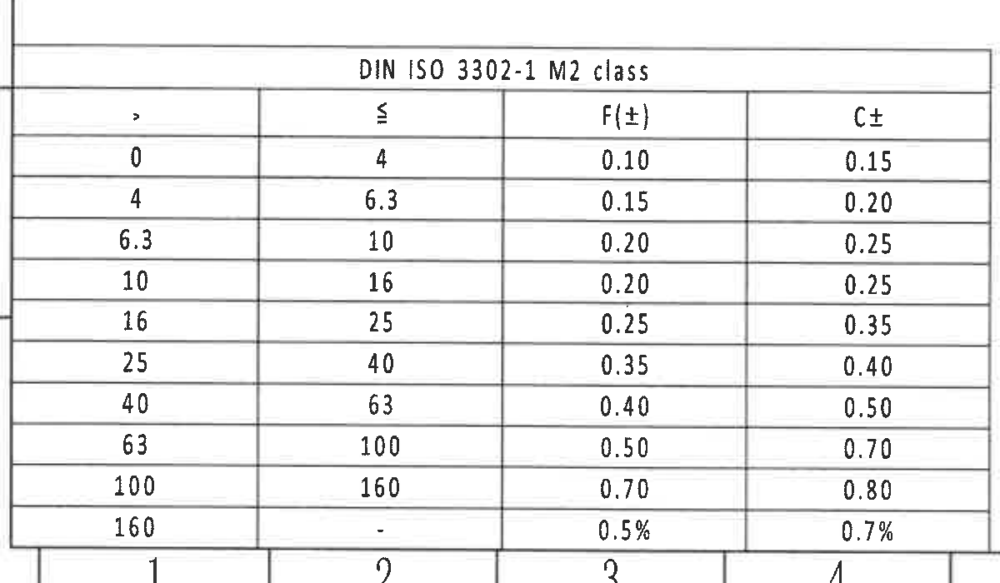

原图位置/视图名称：页 1 左下角 DIN ISO 3302-1 M2 class 公差表。

原表还原：

| DIN ISO 3302-1 M2 class：> | ≤ | F(±) | C± |
|---:|---:|---:|---:|
| 0 | 4 | 0.10 | 0.15 |
| 4 | 6.3 | 0.15 | 0.20 |
| 6.3 | 10 | 0.20 | 0.25 |
| 10 | 16 | 0.20 | 0.25 |
| 16 | 25 | 0.25 | 0.35 |
| 25 | 40 | 0.35 | 0.40 |
| 40 | 63 | 0.40 | 0.50 |
| 63 | 100 | 0.50 | 0.70 |
| 100 | 160 | 0.70 | 0.80 |
| 160 | - | 0.5% | 0.7% |

提取表格：

| 提取项 | 原图数值或文本 | 含义说明 |
|---|---|---|
| 公差等级 | DIN ISO 3302-1 M2 class | NOTES 第 3 条所引用的橡胶尺寸通用公差等级。 |
| F(±) 列 | 0.10、0.15、0.20、0.20、0.25、0.35、0.40、0.50、0.70、0.5% | F 类公差，按尺寸范围选取。 |
| C± 列 | 0.15、0.20、0.25、0.25、0.35、0.40、0.50、0.70、0.80、0.7% | C 类公差，按尺寸范围选取。 |
| 范围列 | > 0 到 160；最后一行为 >160 到 - | 尺寸范围分段。 |

边界归属说明：表格主体完整；底边可见图框坐标数字 1-4，不属于公差表，未作为表格字段提取。

## object_12 Reference 参考标准

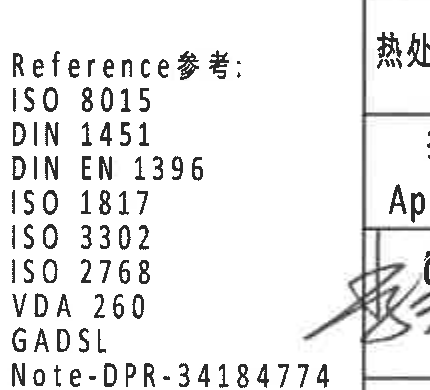

原图位置/视图名称：页 1 下部偏中右 Reference 参考标准块。

提取表格：

| 提取项 | 原图数值或文本 | 含义说明 |
|---|---|---|
| 标题 | Reference参考: | 标准引用清单标题。 |
| 标准 | ISO 8015 | 引用标准。 |
| 标准 | DIN 1451 | 引用标准。 |
| 标准 | DIN EN 1396 | 引用标准。 |
| 标准 | ISO 1817 | 引用标准。 |
| 标准 | ISO 3302 | 引用标准，与橡胶公差相关。 |
| 标准 | ISO 2768 | 引用标准。 |
| 标准 | VDA 260 | 引用标准。 |
| 标准 | GADSL | 引用法规/材料清单。 |
| 备注 | Note-DPR-34184774 | 备注/内部规范编号。 |

边界归属说明：右侧少量带入标题栏签名区边框和签名笔迹边缘；Reference 文本完整且独立提取，右侧残片不归入本对象。

## object_13 BOM / 明细表

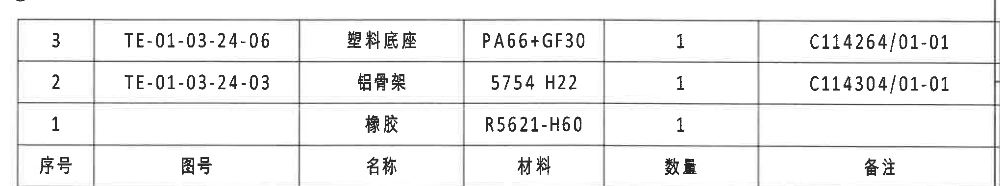

原图位置/视图名称：页 1 右下方标题栏上方 BOM 明细表。原图表头位于表格底行；Markdown 为表格语法将表头置顶，数据行顺序保持原图自上而下 3、2、1。

原表还原：

| 序号 | 图号 | 名称 | 材料 | 数量 | 备注 |
|---:|---|---|---|---:|---|
| 3 | TE-01-03-24-06 | 塑料底座 | PA66+GF30 | 1 | C114264/01-01 |
| 2 | TE-01-03-24-03 | 铝骨架 | 5754 H22 | 1 | C114304/01-01 |
| 1 |  | 橡胶 | R5621-H60 | 1 |  |

提取表格：

| 提取项 | 原图数值或文本 | 含义说明 |
|---|---|---|
| BOM 3 | TE-01-03-24-06；塑料底座；PA66+GF30；数量 1；备注 C114264/01-01 | 对应 B-B 剖面编号 3。 |
| BOM 2 | TE-01-03-24-03；铝骨架；5754 H22；数量 1；备注 C114304/01-01 | 对应 B-B 剖面编号 2。 |
| BOM 1 | 橡胶；R5621-H60；数量 1 | 对应 B-B 剖面编号 1，图号和备注单元格为空。 |

边界归属说明：表格主体和底部表头完整；上边缘有 NOTES/空白区域边线，不属于 BOM 字段。

## object_14 标题栏

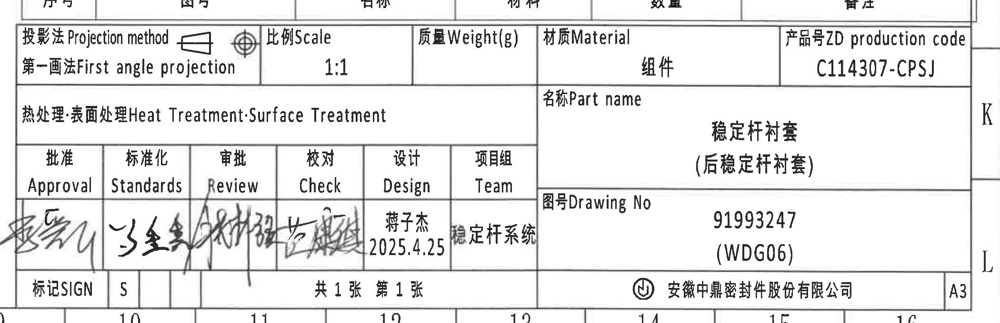

原图位置/视图名称：页 1 右下角标题栏。

原表字段还原：

| 字段 | 原图文本 |
|---|---|
| 投影法 Projection method | 第一画法 First angle projection |
| 比例 Scale | 1:1 |
| 质量 Weight(g) |  |
| 材质 Material | 组件 |
| 产品号 ZD production code | C114307-CPSJ |
| 热处理:表面处理 Heat Treatment:Surface Treatment |  |
| 名称 Part name | 稳定杆衬套（后稳定杆衬套） |
| 图号 Drawing No | 91993247（WDG06） |
| 批准 Approval | 手写签名 |
| 标准化 Standards | 手写签名 |
| 审批 Review | 手写签名 |
| 校对 Check | 手写签名 |
| 设计 Design | 蒋子杰；2025.4.25 |
| 项目组 Team | 稳定杆系统 |
| 标记 SIGN | S |
| 页数 | 共 1 张 第 1 张 |
| 公司 | 安徽中鼎密封件股份有限公司 |
| 图幅 | A3 |

提取表格：

| 提取项 | 原图数值或文本 | 含义说明 |
|---|---|---|
| 产品号 | C114307-CPSJ | 标题栏产品号。 |
| 图号 | 91993247 (WDG06) | 标题栏图号，与规格表 Variant C 的 Mubea proto. SAP No. 91993247 对应。 |
| 零件名称 | 稳定杆衬套（后稳定杆衬套） | 图纸零件/组件名称。 |
| 比例 | 1:1 | 绘图比例。 |
| 投影法 | First angle projection / 第一画法 | 图纸投影方法。 |
| 材质 | 组件 | 标题栏材质字段。 |
| 设计 | 蒋子杰 2025.4.25 | 设计人员和日期。 |
| 项目组 | 稳定杆系统 | 所属项目组。 |

边界归属说明：标题栏完整包含主要字段、签名区、页号、公司名和 A3 幅面；上边缘带入 BOM 表头下线，底部可见图框坐标数字，均不作为标题栏业务字段以外内容重复提取。

## object_15 方向坐标局部视图

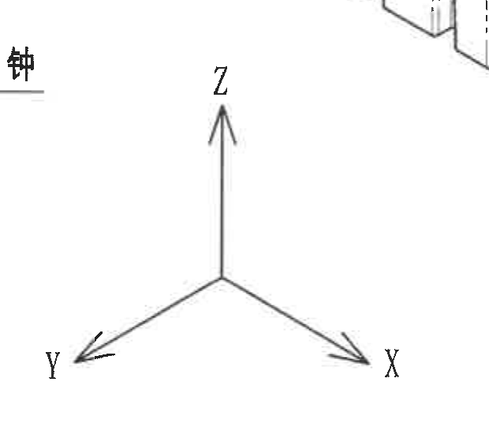

原图位置/视图名称：页 1 下部中间 X/Y/Z 方向坐标局部视图。

提取表格：

| 提取项 | 原图数值或文本 | 含义说明 |
|---|---|---|
| Z 方向 | Z，箭头向上 | 坐标方向指示。 |
| Y 方向 | Y，箭头指向左下 | 坐标方向指示。 |
| X 方向 | X，箭头指向右下 | 坐标方向指示。 |
| 尺寸/角度 | 未见尺寸数值 | 该局部图仅说明方向，不含尺寸、公差或角度。 |

边界归属说明：左上角可见底视图说明文字末端，右上角可见等轴测视图底部小片段；两者均不属于坐标局部视图，未作为坐标内容提取。

## 裁切检查记录

| 对象 | 图片路径 | 检查结论 |
|---|---|---|
| page_1 | outputs/20C114307_assets/images/page_1.png | 整页 4959×3505 PNG，页面完整。 |
| object_1 | outputs/20C114307_assets/images/object_1.png | 修订表完整包含表头、行线和两条修订记录；顶部图框线不提取。 |
| object_2 | outputs/20C114307_assets/images/object_2.png | 规格参数表完整包含全部列、合并单元格和所有 Variant 行。 |
| object_3 | outputs/20C114307_assets/images/object_3.png | 左前视图的 ØE、(0.5)、材料标识引出线完整；右缘相邻轮廓不提取。 |
| object_4 | outputs/20C114307_assets/images/object_4.png | 侧视图 A-A 剖切线、26.5±0.3、型号标识完整；未提取相邻 A-A 半径文字残影。 |
| object_5 | outputs/20C114307_assets/images/object_5.png | A-A 剖面的 (0.5)、(RIR)、(RAR)、A-A 标识完整，无 B-B 或 NOTES 混入。 |
| object_6 | outputs/20C114307_assets/images/object_6.png | B-B 剖面的 (31.23)、(B)、T1、T2、1/2/3 完整；右下相邻文字片段不提取。 |
| object_7 | outputs/20C114307_assets/images/object_7.png | 右前视图 B-B 剖切线和“杆径标识,MUBEA图号”完整；左侧 T2 残片不提取。 |
| object_8 | outputs/20C114307_assets/images/object_8.png | 底视图 35±0.3、39.4±0.3、43.4±0.3 和引出文字完整；未混入等轴测图。 |
| object_9 | outputs/20C114307_assets/images/object_9.png | 等轴测视图外形完整；底部方向坐标残片不提取。 |
| object_10 | outputs/20C114307_assets/images/object_10.png | NOTES 正文 1-8 条完整；顶部相邻视图底部残片不提取。 |
| object_11 | outputs/20C114307_assets/images/object_11.png | DIN ISO 3302-1 M2 表格完整包含最后一行；底部图框坐标不提取。 |
| object_12 | outputs/20C114307_assets/images/object_12.png | Reference 标准清单完整；右侧标题栏签名区残片不提取。 |
| object_13 | outputs/20C114307_assets/images/object_13.png | BOM 表格完整包含 3、2、1 三行和底部表头。 |
| object_14 | outputs/20C114307_assets/images/object_14.png | 标题栏字段完整；上缘 BOM 边线和底部图框坐标不重复提取。 |
| object_15 | outputs/20C114307_assets/images/object_15.png | X/Y/Z 方向标识完整；左上和右上相邻片段不提取。 |
