# 20C114308 PDF 内容识别

整页渲染图：

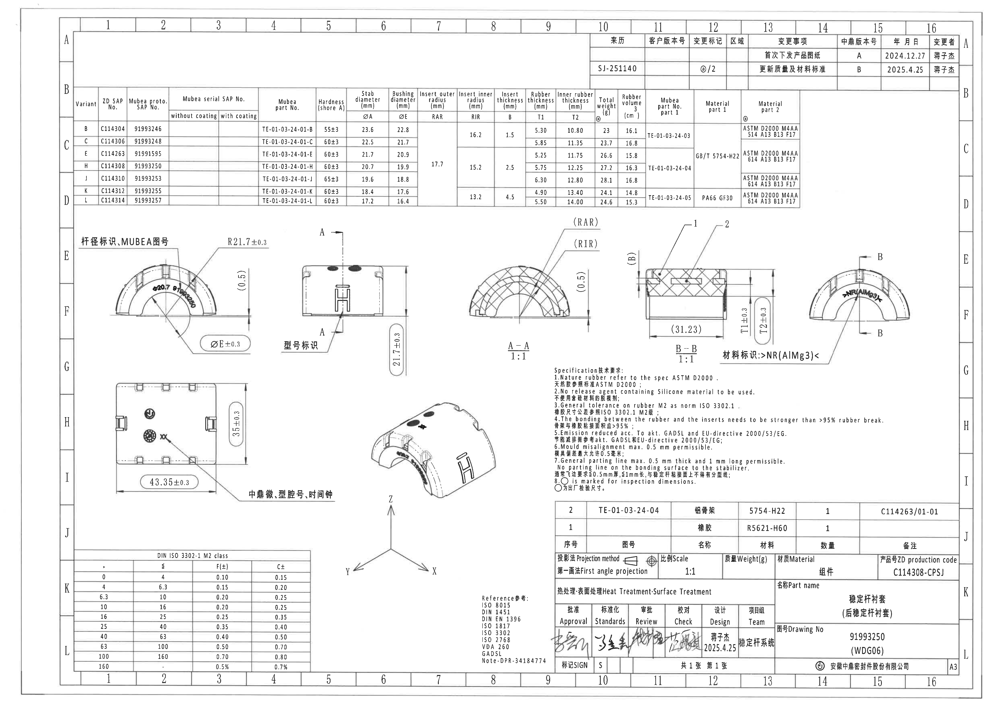

页面信息：第 1 页，整页 PNG 尺寸 4959 x 3505 px，bbox `[0, 0, 4959, 3505]`。

## object_1 | table | 修订履历表

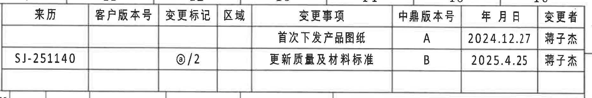

原图位置/视图名称：页面右上方修订履历表，bbox `[2920, 155, 4780, 465]`。

### 原表还原

| 来历 | 客户版本号 | 变更标记 | 区域 | 变更事项 | 中鼎版本号 | 年月日 | 变更者 |
|---|---|---|---|---|---|---|---|
|  |  |  |  | 首次下发产品图纸 | A | 2024.12.27 | 蒋子杰 |
| SJ-251140 |  | @/2 |  | 更新质量及材料标准 | B | 2025.4.25 | 蒋子杰 |

### 提取表格

| 提取项 | 原图数值或文本 | 含义说明 |
|---|---|---|
| 修订记录 1 | 首次下发产品图纸；中鼎版本号 A；2024.12.27；蒋子杰 | 初版发放记录。 |
| 修订记录 2 | SJ-251140；变更标记 @/2；更新质量及材料标准；中鼎版本号 B；2025.4.25；蒋子杰 | 当前图纸版本更新质量和材料标准。 |

边界归属说明：该裁切只包含右上修订履历表。上方和下方表格边线完整，未截断文字；下边界靠近下方参数表，但未把参数表内容作为本对象提取。

## object_2 | table | 变型参数、材料与尺寸参数表

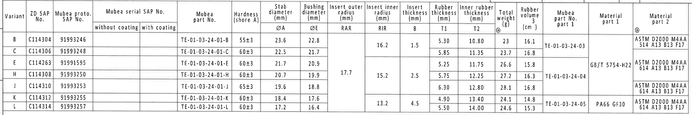

原图位置/视图名称：页面上部主参数表，bbox `[350, 430, 3985, 1040]`。

### 原表还原

合并单元格在 Markdown 中按可读性展开到对应行；展开值仍保持原表字段归属。

| Variant | ZD SAP No. | Mubea proto. SAP No. | Mubea serial SAP No. without coating | Mubea serial SAP No. with coating | Mubea part No. | Hardness (shore A) | Stab diameter ØA (mm) | Bushing diameter ØE (mm) | Insert outer radius RAR (mm) | Insert inner radius RIR (mm) | Insert thickness B (mm) | Rubber thickness T1 (mm) | Inner rubber thickness T2 (mm) | Total weight @ (g) | Rubber volume (cm3) | Mubea part No. part 1 | Material part 1 | Material part 2 @ |
|---|---|---|---|---|---|---|---:|---:|---:|---:|---:|---:|---:|---:|---:|---|---|---|
| B | C114304 | 91993246 |  |  | TE-01-03-24-01-B | 55±3 | 23.6 | 22.8 | 17.7 | 16.2 | 1.5 | 5.30 | 10.80 | 23 | 16.1 | TE-01-03-24-03 | GB/T 5754-H22 | ASTM D2000 M4AA 514 A13 B13 F17 |
| C | C114306 | 91993248 |  |  | TE-01-03-24-01-C | 60±3 | 22.5 | 21.7 | 17.7 | 16.2 | 1.5 | 5.85 | 11.35 | 23.7 | 16.8 | TE-01-03-24-03 | GB/T 5754-H22 | ASTM D2000 M4AA 514 A13 B13 F17 |
| E | C114263 | 91991595 |  |  | TE-01-03-24-01-E | 60±3 | 21.7 | 20.9 | 17.7 | 15.2 | 2.5 | 5.25 | 11.75 | 26.6 | 15.8 | TE-01-03-24-04 | GB/T 5754-H22 | ASTM D2000 M4AA 614 A13 B13 F17 |
| H | C114308 | 91993250 |  |  | TE-01-03-24-01-H | 60±3 | 20.7 | 19.9 | 17.7 | 15.2 | 2.5 | 5.75 | 12.25 | 27.2 | 16.3 | TE-01-03-24-04 | GB/T 5754-H22 | ASTM D2000 M4AA 614 A13 B13 F17 |
| J | C114310 | 91993253 |  |  | TE-01-03-24-01-J | 65±3 | 19.6 | 18.8 | 17.7 | 15.2 | 2.5 | 6.30 | 12.80 | 28.1 | 16.8 | TE-01-03-24-04 | GB/T 5754-H22 | ASTM D2000 M4AA 614 A13 B13 F17 |
| K | C114312 | 91993255 |  |  | TE-01-03-24-01-K | 60±3 | 18.4 | 17.6 | 17.7 | 13.2 | 4.5 | 4.90 | 13.40 | 24.1 | 14.8 | TE-01-03-24-05 | PA66 GF30 | ASTM D2000 M4AA 614 A13 B13 F17 |
| L | C114314 | 91993257 |  |  | TE-01-03-24-01-L | 60±3 | 17.2 | 16.4 | 17.7 | 13.2 | 4.5 | 5.50 | 14.00 | 24.6 | 15.3 | TE-01-03-24-05 | PA66 GF30 | ASTM D2000 M4AA 614 A13 B13 F17 |

### 提取表格

| 提取项 | 原图数值或文本 | 含义说明 |
|---|---|---|
| 当前图纸对应行 | Variant H；ZD SAP No. C114308；Mubea proto. SAP No. 91993250；Mubea part No. TE-01-03-24-01-H | 与标题栏图号 91993250 和产品号 C114308-CPSJ 对应。 |
| H 行硬度 | 60±3 shore A | 橡胶硬度要求。 |
| H 行 ØA | 20.7 mm | 稳定杆直径/杆径参数。 |
| H 行 ØE | 19.9 mm | 衬套内径参数，视图中以 `ØE±0.3` 表示检验尺寸。 |
| H 行 RAR | 17.7 mm | 插入件外侧半径参数；A-A 剖面以 `(RAR)` 引出。 |
| H 行 RIR | 15.2 mm | 插入件内侧半径参数；A-A 剖面以 `(RIR)` 引出。 |
| H 行 B | 2.5 mm | 插入件厚度参数；B-B 剖面以 `(B)` 引出。 |
| H 行 T1 | 5.75 mm | 橡胶厚度参数；B-B 剖面以 `T1±0.3` 表示。 |
| H 行 T2 | 12.25 mm | 内侧橡胶厚度参数；B-B 剖面以 `T2±0.3` 表示。 |
| H 行重量/体积 | 27.2 g；16.3 cm3 | 总重量和橡胶体积。 |
| H 行材料 | Material part 1: GB/T 5754-H22；Material part 2: ASTM D2000 M4AA 614 A13 B13 F17 | 骨架和橡胶材料标准。 |

边界归属说明：该裁切为上部整张参数表，所有尺寸符号 `ØA`、`ØE`、`RAR`、`RIR`、`B`、`T1`、`T2` 的数值归属本表。表格下方邻近加工视图不在本对象中提取。

## object_3 | view | 左上半圆视图：杆径标识、MUBEA 图号

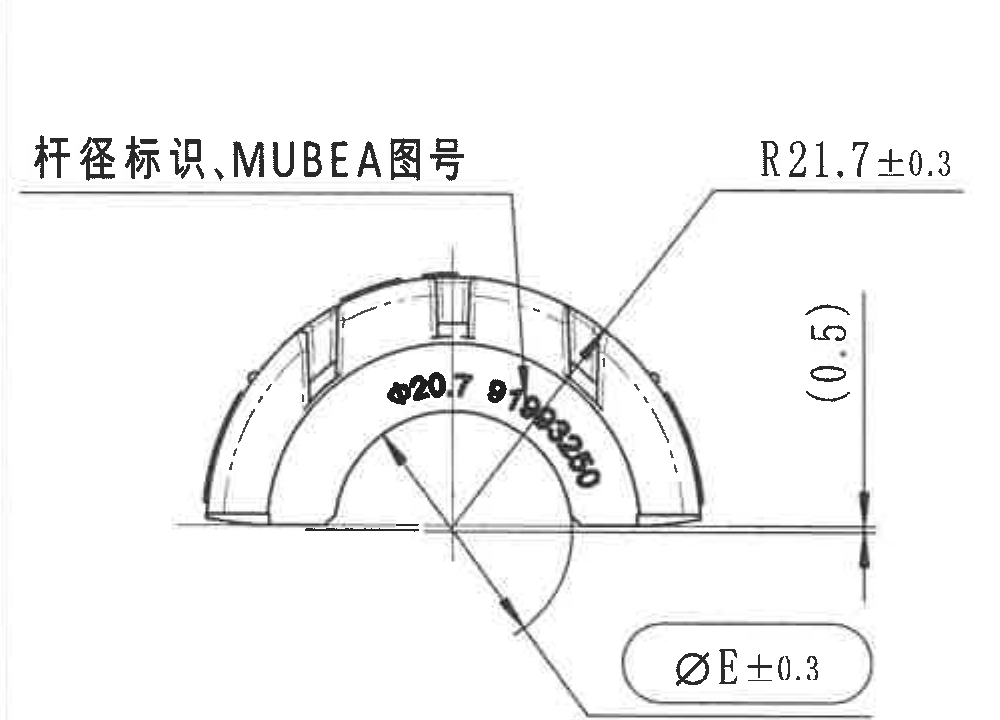

原图位置/视图名称：页面中左上半圆正向视图，bbox `[370, 1040, 1370, 1760]`。

| 提取项 | 原图数值或文本 | 含义说明 |
|---|---|---|
| 视图标注 | 杆径标识,MUBEA图号 | 指向半圆外表面的标识内容。 |
| 弧面半径 | R21.7±0.3 | 外侧弧面半径尺寸，公差 ±0.3。 |
| 参考尺寸 | (0.5) | 括号内参考尺寸，表示该处小偏移/边缘高度参考，不作为独立公差控制尺寸。 |
| 直径尺寸 | ØE±0.3 | 衬套内径 E 的检验尺寸，具体 E 值来自参数表；当前 H 行 ØE=19.9 mm。 |
| 弧向标识文字 | Ø20.7 91993250 | 半圆内弧处的杆径和 MUBEA 图号标识；20.7 对应参数表 H 行 ØA。 |

边界归属说明：裁切保留 `R21.7±0.3` 引出线、`(0.5)` 尺寸线、`ØE±0.3` 引出线和弧向标识文字。下方俯视图已排除，不把下方总长/总高尺寸归入本视图。

## object_4 | view | 正视图：A-A 剖切位置与型号标识

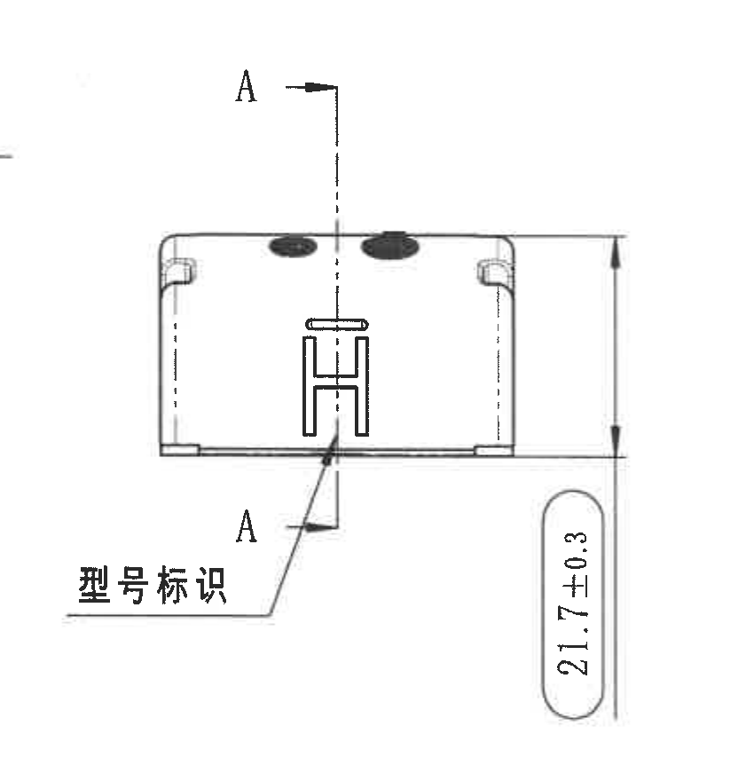

原图位置/视图名称：页面中部偏左正视图，bbox `[1320, 1055, 2170, 1935]`。

| 提取项 | 原图数值或文本 | 含义说明 |
|---|---|---|
| 剖切基准 | A ... A | 表示 A-A 剖面切割位置和方向。 |
| 总高度/弧高尺寸 | 21.7±0.3 | 正视方向的高度尺寸，带 ±0.3 公差。 |
| 型号标识 | 型号标识 | 引线指向产品外表面型号标识位置。 |
| 可见型号图形 | H 形标识 | 产品型号标记的图形表现。 |

边界归属说明：该对象包含 A-A 剖切线、正视图、`21.7±0.3` 高度尺寸和型号标识引线。左下角相邻引线残端不作为本对象提取项；左侧半圆视图尺寸不归入本对象。

## object_5 | section | A-A 剖面视图

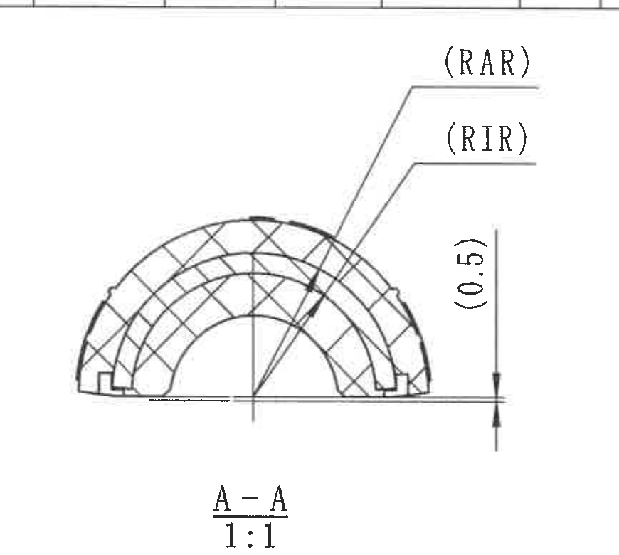

原图位置/视图名称：页面中部 A-A 剖面，bbox `[2220, 1015, 3090, 1795]`。

| 提取项 | 原图数值或文本 | 含义说明 |
|---|---|---|
| 剖面名称 | A-A | 与 object_4 中 A-A 剖切线对应。 |
| 比例 | 1:1 | 剖面按 1:1 显示。 |
| 外半径参考 | (RAR) | 括号内参考/表驱动半径，指插入件外半径；当前 H 行 RAR=17.7 mm。 |
| 内半径参考 | (RIR) | 括号内参考/表驱动半径，指插入件内半径；当前 H 行 RIR=15.2 mm。 |
| 参考尺寸 | (0.5) | 括号内参考尺寸，表示剖面右侧局部小偏移/边缘高度参考。 |

边界归属说明：该裁切只提取 A-A 剖面及其 `(RAR)`、`(RIR)`、`(0.5)` 标注。下方 NOTES 已排除；左侧正视图和右侧 B-B 剖面尺寸不归入本对象。

## object_6 | section | B-B 剖面视图

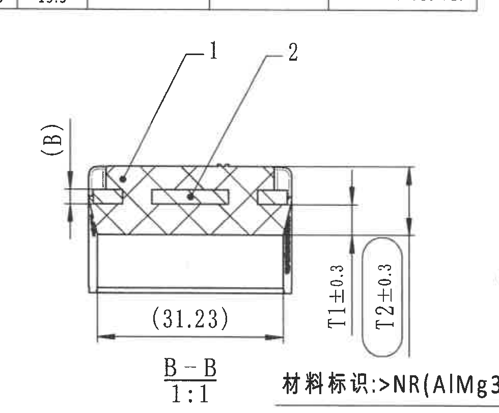

原图位置/视图名称：页面中部偏右 B-B 剖面，bbox `[3030, 1010, 4010, 1820]`。

| 提取项 | 原图数值或文本 | 含义说明 |
|---|---|---|
| 剖面名称 | B-B | 与右侧半圆视图中的 B 剖切线对应。 |
| 比例 | 1:1 | 剖面按 1:1 显示。 |
| 零件序号 | 1；2 | 剖面中的引出序号，分别对应 BOM 中橡胶和铝骨架。 |
| 厚度参考 | (B) | 括号内表驱动尺寸，指插入件厚度 B；当前 H 行 B=2.5 mm。 |
| 参考长度 | (31.23) | 括号内参考长度，作为剖面底部横向参考尺寸。 |
| 橡胶厚度 | T1±0.3 | 橡胶厚度尺寸，当前 H 行 T1=5.75 mm，图示公差 ±0.3。 |
| 内侧橡胶厚度 | T2±0.3 | 内侧橡胶厚度尺寸，当前 H 行 T2=12.25 mm，图示公差 ±0.3。 |

边界归属说明：B-B 剖面与右侧材料标识视图贴近，裁切左/下侧可见相邻材料标识文字边缘；本对象只提取完整落在 B-B 尺寸线和剖面内的 `(B)`、`(31.23)`、`T1±0.3`、`T2±0.3`、序号 1/2 和 `B-B 1:1`。

## object_7 | view | 右侧半圆视图：材料标识与 B-B 剖切位置

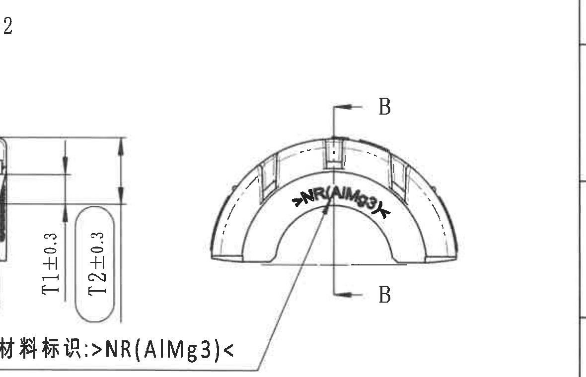

原图位置/视图名称：页面右中半圆视图，bbox `[3590, 1060, 4770, 1820]`。

| 提取项 | 原图数值或文本 | 含义说明 |
|---|---|---|
| 剖切基准 | B ... B | 表示 B-B 剖面切割位置和方向。 |
| 材料标识引线 | 材料标识:>NR(AlMg3)< | 指向半圆内弧处材料标记。 |
| 弧向材料文字 | >NR(AlMg3)< | 产品表面材料标识，表示橡胶/铝镁材料组合标记。 |

边界归属说明：该视图左侧邻近 B-B 剖面，裁切中可见 `T1±0.3`、`T2±0.3` 的边缘，这些尺寸归 object_6，不在本对象提取。右侧图框边栏不作为零件信息提取。

## object_8 | view | 俯视图：总长、总高和制造标识

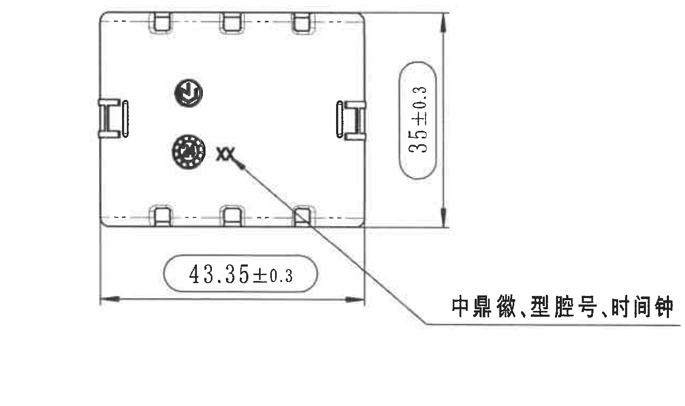

原图位置/视图名称：页面左下俯视图，bbox `[390, 1880, 1670, 2640]`。

| 提取项 | 原图数值或文本 | 含义说明 |
|---|---|---|
| 总宽/总高尺寸 | 35±0.3 | 俯视方向右侧竖向尺寸，带 ±0.3 公差。 |
| 总长尺寸 | 43.35±0.3 | 俯视方向底部横向总长，带 ±0.3 公差。 |
| 制造标识说明 | 中鼎徽、型腔号、时间钟 | 引线指向俯视图内部的徽标、型腔号和时间钟位置。 |
| 可见型腔/时间标识 | XX | 图中示意的型腔号/时间标记位置。 |

边界归属说明：裁切完整包含 `35±0.3`、`43.35±0.3` 尺寸线和右侧引线文字。上方半圆视图和右侧轴测图未归入本对象。

## object_9 | view | 轴测视图与坐标方向

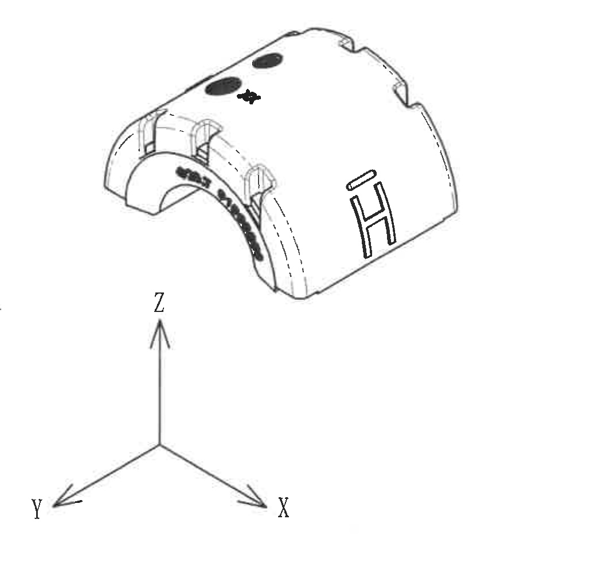

原图位置/视图名称：页面中下轴测视图，bbox `[1660, 1950, 2710, 2930]`。

| 提取项 | 原图数值或文本 | 含义说明 |
|---|---|---|
| 三维方向 | X、Y、Z | 坐标方向三叉标识，用于说明轴测视图方向。 |
| 外观标识 | H 形标识 | 轴测图表面型号标识。 |
| 外观材料/杆径标识 | 弧向黑色标识 | 轴测图显示半圆内侧弧向标识位置，具体文字由 object_3/object_7 局部视图读取。 |
| 尺寸 | 无新增尺寸 | 该轴测图用于外观和方向展示，不单独给出尺寸线。 |

边界归属说明：裁切包含轴测零件和 X/Y/Z 坐标轴。右侧 NOTES 已排除；底部参考标准不归入本对象。

## object_10 | notes | Specification 技术要求

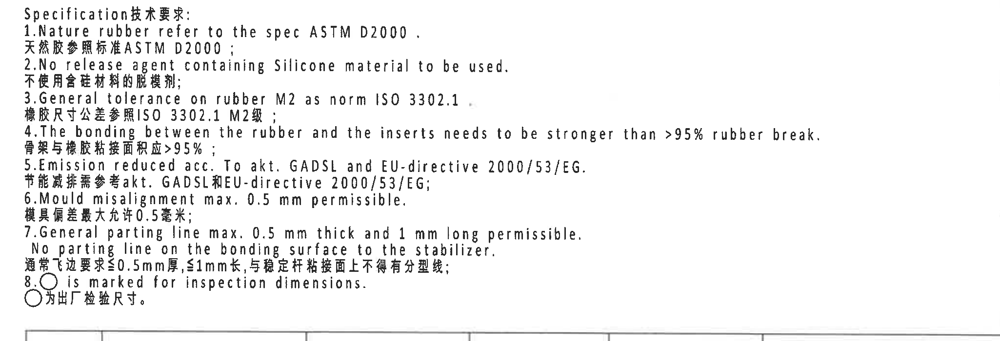

原图位置/视图名称：页面右中下 NOTES/技术要求，bbox `[2700, 1810, 4750, 2510]`。

| 提取项 | 原图数值或文本 | 含义说明 |
|---|---|---|
| 标题 | Specification技术要求: | 技术要求列表标题。 |
| 1 | Nature rubber refer to the spec ASTM D2000. / 天然胶参照标准ASTM D2000； | 天然胶材料标准要求。 |
| 2 | No release agent containing Silicone material to be used. / 不使用含硅材料的脱模剂； | 禁用含硅脱模剂。 |
| 3 | General tolerance on rubber M2 as norm ISO 3302.1 / 橡胶尺寸公差参照ISO 3302.1 M2级； | 橡胶通用尺寸公差等级。 |
| 4 | The bonding between the rubber and the inserts needs to be stronger than >95% rubber break. / 骨架与橡胶粘接面积应>95%； | 橡胶与骨架粘接强度/破坏面积要求。 |
| 5 | Emission reduced acc. To akt. GADSL and EU-directive 2000/53/EG. / 节能减排需参考akt. GADSL和EU-directive 2000/53/EG; | 排放和环保法规要求。 |
| 6 | Mould misalignment max. 0.5 mm permissible. / 模具偏差最大允许0.5毫米； | 模具错位最大允许值。 |
| 7 | General parting line max. 0.5 mm thick and 1 mm long permissible. No parting line on the bonding surface to the stabilizer. / 通常飞边要求≤0.5mm厚,≤1mm长,与稳定杆粘接面上不得有分型线; | 分型线/飞边限制，粘接面不得有分型线。 |
| 8 | ○ is marked for inspection dimensions. / ○为出厂检验尺寸。 | 圆圈标记表示出厂检验尺寸。 |

边界归属说明：裁切完整包含 NOTES 第 1 至第 8 条及中英文内容。底部仅保留下一表格上边线，不提取 BOM 内容。

## object_11 | table | DIN ISO 3302-1 M2 class 公差表

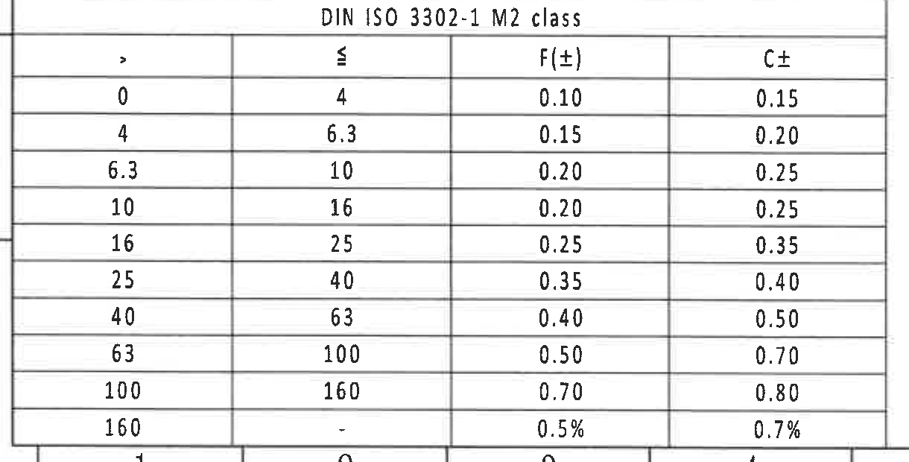

原图位置/视图名称：页面左下公差表，bbox `[350, 2735, 1570, 3355]`。

### 原表还原

| DIN ISO 3302-1 M2 class |  |  |  |
|---:|---:|---:|---:|
| > | ≤ | F(±) | C± |
| 0 | 4 | 0.10 | 0.15 |
| 4 | 6.3 | 0.15 | 0.20 |
| 6.3 | 10 | 0.20 | 0.25 |
| 10 | 16 | 0.20 | 0.25 |
| 16 | 25 | 0.25 | 0.35 |
| 25 | 40 | 0.35 | 0.40 |
| 40 | 63 | 0.40 | 0.50 |
| 63 | 100 | 0.50 | 0.70 |
| 100 | 160 | 0.70 | 0.80 |
| 160 | - | 0.5% | 0.7% |

### 提取表格

| 提取项 | 原图数值或文本 | 含义说明 |
|---|---|---|
| 公差标准 | DIN ISO 3302-1 M2 class | NOTES 第 3 条所引用的橡胶通用尺寸公差。 |
| F(±) 列 | 0.10 至 0.70；160 以上为 0.5% | F 等级双向公差。 |
| C± 列 | 0.15 至 0.80；160 以上为 0.7% | C 等级双向公差。 |

边界归属说明：裁切完整包含公差表标题、表头和所有范围行。底部图框坐标数字靠近表格外边界，不作为表格内容提取。

## object_12 | table | BOM/明细表

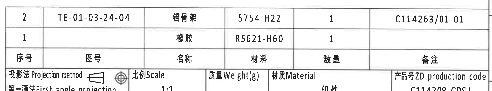

原图位置/视图名称：页面右下标题栏上方 BOM 明细表，bbox `[2730, 2460, 4770, 2840]`。

### 原表还原

| 序号 | 图号 | 名称 | 材料 | 数量 | 备注 |
|---:|---|---|---|---:|---|
| 2 | TE-01-03-24-04 | 铝骨架 | 5754-H22 | 1 | C114263/01-01 |
| 1 |  | 橡胶 | R5621-H60 | 1 |  |

### 提取表格

| 提取项 | 原图数值或文本 | 含义说明 |
|---|---|---|
| 序号 2 | TE-01-03-24-04；铝骨架；5754-H22；数量 1；备注 C114263/01-01 | 铝骨架部件，对应 B-B 剖面中的序号 2。 |
| 序号 1 | 橡胶；R5621-H60；数量 1 | 橡胶部件，对应 B-B 剖面中的序号 1。 |

边界归属说明：裁切上部完整包含 BOM 两条明细和表头。下方可见标题栏起始行，但标题栏字段归 object_13，不在本对象重复提取。

## object_13 | title_block | 标题栏

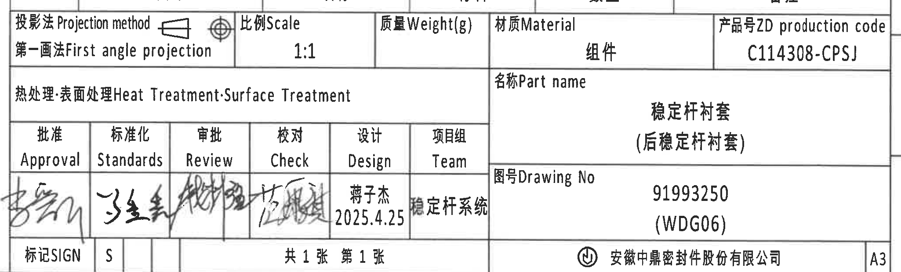

原图位置/视图名称：页面右下标题栏，bbox `[2730, 2720, 4780, 3340]`。

| 提取项 | 原图数值或文本 | 含义说明 |
|---|---|---|
| 投影法 | 投影法 Projection method；第一画法 First angle projection | 图纸采用第一角法投影。 |
| 比例 | Scale 1:1 | 图纸比例。 |
| 质量 | Weight(g) | 标题栏中保留字段，未填写具体数值。 |
| 材质 | Material 组件 | 成品/组件属性。 |
| 产品号 | ZD production code C114308-CPSJ | 产品号/生产代码。 |
| 热处理/表面处理 | Heat Treatment·Surface Treatment | 标题栏字段，未填写具体处理内容。 |
| 名称 | Part name 稳定杆衬套（后稳定杆衬套） | 零件名称。 |
| 图号 | Drawing No 91993250 (WDG06) | 图纸编号。 |
| 审签栏 | Approval、Standards、Review、Check、Design、Team | 审批/标准化/审核/校对/设计/项目组栏。 |
| 设计 | 蒋子杰 2025.4.25 | 设计者与日期。 |
| 项目组 | 稳定杆系统 | 项目组名称。 |
| 标记/页码 | 标记SIGN；S；共1张 第1张 | 图纸标记和页数信息。 |
| 公司/幅面 | 安徽中鼎密封件股份有限公司；A3 | 公司名和图幅。 |

边界归属说明：裁切完整包含标题栏主体、产品号、零件名称、图号、签名栏、公司名和 A3 幅面。上缘可见 BOM 底边/列线残影，但 BOM 明细归 object_12。

## object_14 | notes | Reference 参考标准

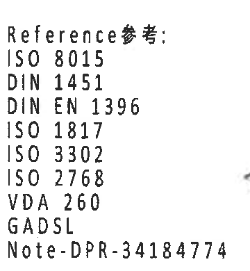

原图位置/视图名称：页面中下偏右参考标准列表，bbox `[2380, 2920, 2740, 3310]`。

| 提取项 | 原图数值或文本 | 含义说明 |
|---|---|---|
| 标题 | Reference参考: | 参考标准列表标题。 |
| 标准 1 | ISO 8015 | 引用标准。 |
| 标准 2 | DIN 1451 | 引用标准。 |
| 标准 3 | DIN EN 1396 | 引用标准。 |
| 标准 4 | ISO 1817 | 引用标准。 |
| 标准 5 | ISO 3302 | 引用标准。 |
| 标准 6 | ISO 2768 | 引用标准。 |
| 标准 7 | VDA 260 | 引用标准。 |
| 标准 8 | GADSL | 引用标准。 |
| 备注 | Note-DPR-34184774 | 参考备注编号。 |

边界归属说明：裁切只包含 Reference 参考列表和 Note 编号，右侧标题栏片段已排除。

## 裁切检查记录

| 对象 | 图片路径 | 完整性检查 | 边界/归属检查 |
|---|---|---|---|
| page_1 | outputs/20C114308_assets/images/page_1.png | 整页 PNG 已渲染，页面完整。 | 页面尺寸 4959 x 3505 px。 |
| object_1 | outputs/20C114308_assets/images/object_1.png | 表头、两条修订记录、外框完整。 | 未提取下方参数表内容。 |
| object_2 | outputs/20C114308_assets/images/object_2.png | 参数表所有列、所有变型行完整。 | 下方加工视图未归入本对象。 |
| object_3 | outputs/20C114308_assets/images/object_3.png | `R21.7±0.3`、`(0.5)`、`ØE±0.3` 和弧向文字完整。 | 下方俯视图已排除。 |
| object_4 | outputs/20C114308_assets/images/object_4.png | A-A 剖切线、`21.7±0.3`、型号标识完整。 | 左下邻近引线残端不提取。 |
| object_5 | outputs/20C114308_assets/images/object_5.png | `(RAR)`、`(RIR)`、`(0.5)`、`A-A 1:1` 完整。 | NOTES 未归入本对象。 |
| object_6 | outputs/20C114308_assets/images/object_6.png | `(B)`、`(31.23)`、`T1±0.3`、`T2±0.3`、`B-B 1:1` 完整。 | 右下邻近材料标识文字不作为 B-B 尺寸提取。 |
| object_7 | outputs/20C114308_assets/images/object_7.png | B 剖切线和 `材料标识:>NR(AlMg3)<` 完整。 | 左侧可见 B-B 尺寸边缘，尺寸归 object_6。 |
| object_8 | outputs/20C114308_assets/images/object_8.png | `35±0.3`、`43.35±0.3` 和制造标识文字完整。 | 未混入轴测图。 |
| object_9 | outputs/20C114308_assets/images/object_9.png | 轴测图和 X/Y/Z 坐标完整。 | NOTES 和参考标准已排除。 |
| object_10 | outputs/20C114308_assets/images/object_10.png | 技术要求 1-8 条完整，右侧长句未截断。 | 底部仅有表格上边线，不提取 BOM。 |
| object_11 | outputs/20C114308_assets/images/object_11.png | 公差表标题、表头和全部范围行完整。 | 底部图框坐标不作为表格内容。 |
| object_12 | outputs/20C114308_assets/images/object_12.png | BOM 两条记录、表头、备注列完整。 | 下方标题栏字段归 object_13。 |
| object_13 | outputs/20C114308_assets/images/object_13.png | 标题栏字段、签名栏、图号、公司名、A3 完整。 | 上缘 BOM 残影不提取。 |
| object_14 | outputs/20C114308_assets/images/object_14.png | Reference 列表和 Note 编号完整。 | 右侧标题栏片段已排除。 |
