# 20C114309 PDF 内容识别与裁切提取

源文件：`input/20C114309.pdf`。先渲染为整页 PNG：`outputs/20C114309_assets/images/page_1.png`，页面尺寸 4959 x 3505 px。以下内容按原图结构从上到下、从左到右排列；括号尺寸按参考尺寸处理但不忽略。

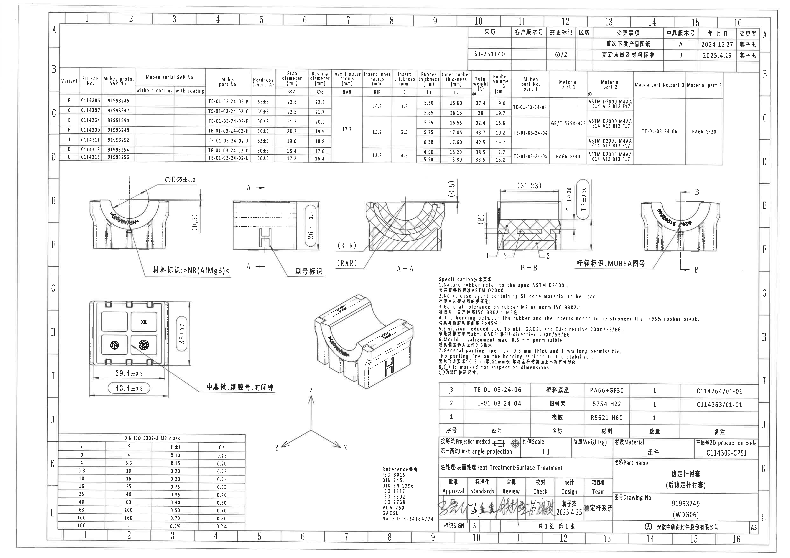

## 对象 1：变更履历表

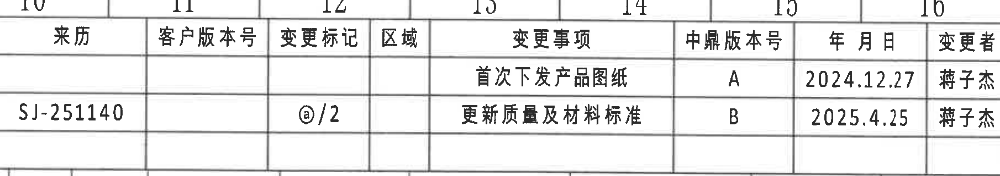

- 原图位置/视图名称：变更履历表 / Change history；page 1；bbox `[2945, 135, 4755, 455]`。
- 边界归属说明：位于整页右上方，裁切包含完整表头、两行履历和左右边框；未提取下方规格表内容。

原表格还原：

| 来历 | 客户版本号 | 变更标记 | 区域 | 变更事项 | 中鼎版本号 | 年 月 日 | 变更者 |
| --- | --- | --- | --- | --- | --- | --- | --- |
|  |  |  |  | 首次下发产品图纸 | A | 2024.12.27 | 蒋子杰 |
| SJ-251140 |  | ◎/2 |  | 更新质量及材料标准 | B | 2025.4.25 | 蒋子杰 |

提取表格：

| 提取项 | 原图数值或文本 | 含义说明 |
| --- | --- | --- |
| 来历 | SJ-251140 | 第二条变更来源/来历编号；第一条该栏为空。 |
| 变更标记 | ◎/2 | 表示第二条变更的标记；与图中带圈检查标识有关。 |
| 变更事项 A | 首次下发产品图纸 | 版本 A 的变更事项。 |
| 变更事项 B | 更新质量及材料标准 | 版本 B 的变更事项。 |
| 日期/变更者 | 2024.12.27 / 2025.4.25；蒋子杰 | 记录版本 A、B 的日期和责任人。 |

## 对象 2：变型规格与材料表

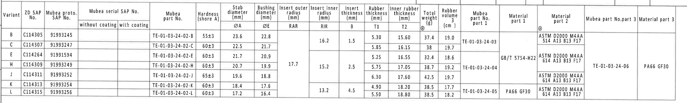

- 原图位置/视图名称：变型规格与材料表 / Variant specification table；page 1；bbox `[365, 415, 4610, 1055]`。
- 边界归属说明：位于上方大表格区域，裁切包含完整表头、B/C/E/H/J/K/L 七行和右侧材料列；未把下方视图尺寸归入表格。

原表格还原：

| Variant | ZD SAP No. | Mubea proto. SAP No. | Mubea serial SAP No. without coating | Mubea serial SAP No. with coating | Mubea part No. | Hardness (shore A) | Stab diameter ØA (mm) | Bushing diameter ØE (mm) | Insert outer radius RAR (mm) | Insert inner radius RIR (mm) | Insert thickness B (mm) | Rubber thickness T1 (mm) | Inner rubber thickness T2 (mm) | Total weight (g) ◎ | Rubber volume (cm^3) | Mubea part No. part 1 | Material part 1 | Material part 2 ◎ | Mubea part No. part 3 | Material part 3 |
| --- | --- | --- | --- | --- | --- | --- | --- | --- | --- | --- | --- | --- | --- | --- | --- | --- | --- | --- | --- | --- |
| B | C114305 | 91993245 |  |  | TE-01-03-24-02-B | 55±3 | 23.6 | 22.8 |  | 16.2 | 1.5 | 5.30 | 15.60 | 37.4 | 19.0 | TE-01-03-24-03 |  | ASTM D2000 M4AA 514 A13 B13 F17 |  |  |
| C | C114307 | 91993247 |  |  | TE-01-03-24-02-C | 60±3 | 22.5 | 21.7 |  | 16.2 | 1.5 | 5.85 | 16.15 | 38 | 19.7 | TE-01-03-24-03 |  | ASTM D2000 M4AA 514 A13 B13 F17 |  |  |
| E | C114264 | 91991594 |  |  | TE-01-03-24-02-E | 60±3 | 21.7 | 20.9 | 17.7 | 15.2 | 2.5 | 5.25 | 16.55 | 32.4 | 18.6 | TE-01-03-24-04 | GB/T 5754-H22 | ASTM D2000 M4AA 614 A13 B13 F17 | TE-01-03-24-06 | PA66 GF30 |
| H | C114309 | 91993249 |  |  | TE-01-03-24-02-H | 60±3 | 20.7 | 19.9 | 17.7 | 15.2 | 2.5 | 5.75 | 17.05 | 38.7 | 19.2 | TE-01-03-24-04 | GB/T 5754-H22 | ASTM D2000 M4AA 614 A13 B13 F17 | TE-01-03-24-06 | PA66 GF30 |
| J | C114311 | 91993252 |  |  | TE-01-03-24-02-J | 65±3 | 19.6 | 18.8 | 17.7 | 15.2 | 2.5 | 6.30 | 17.60 | 42.5 | 19.7 | TE-01-03-24-04 | GB/T 5754-H22 | ASTM D2000 M4AA 614 A13 B13 F17 | TE-01-03-24-06 | PA66 GF30 |
| K | C114313 | 91993254 |  |  | TE-01-03-24-02-K | 60±3 | 18.4 | 17.6 |  | 13.2 | 4.5 | 4.90 | 18.20 | 38.5 | 17.7 | TE-01-03-24-05 | PA66 GF30 | ASTM D2000 M4AA 614 A13 B13 F17 |  |  |
| L | C114315 | 91993256 |  |  | TE-01-03-24-02-L | 60±3 | 17.2 | 16.4 |  | 13.2 | 4.5 | 5.50 | 18.80 | 38.5 | 18.2 | TE-01-03-24-05 | PA66 GF30 | ASTM D2000 M4AA 614 A13 B13 F17 |  |  |

提取表格：

| 提取项 | 原图数值或文本 | 含义说明 |
| --- | --- | --- |
| 当前图纸对应行 | Variant H / ZD SAP No. C114309 / Drawing No. 91993249 | 表中 H 行与标题栏图号 91993249 对应，是本图主要变型。 |
| H 行尺寸 | ØA 20.7, ØE 19.9, RAR 17.7, RIR 15.2, B 2.5, T1 5.75, T2 17.05 | 分别对应稳定杆直径、衬套直径、外嵌件半径、内嵌件半径、嵌件厚度、橡胶厚度、内橡胶厚度；单位 mm。 |
| H 行硬度 | 60±3 shore A | 橡胶邵氏 A 硬度公差。 |
| H 行重量/体积 | 38.7 g / 19.2 cm^3 | 零件总重量和橡胶体积。 |
| H 行材料/部件 | part 1: TE-01-03-24-04, GB/T 5754-H22; part 2: ASTM D2000 M4AA 614 A13 B13 F17; part 3: TE-01-03-24-06, PA66 GF30 | 定义铝骨架、橡胶和塑料底座/嵌件相关材料。 |
| ◎ 标记 | Total weight (g) 与 Material part 2 列标题下方可见 ◎ | 按 NOTES 第 8 条，◎ 为出厂检验尺寸/项目标记。 |

## 对象 3：左上正视图 - 材料标识

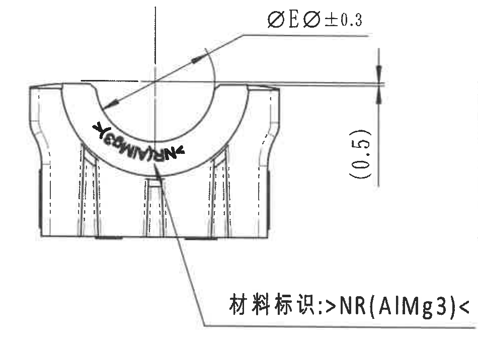

- 原图位置/视图名称：左上正视图：材料标识视图；page 1；bbox `[505, 1090, 1455, 1780]`。
- 边界归属说明：裁切覆盖左上正视图、ØE 相关尺寸线、(0.5) 参考尺寸和材料标识引出线；右侧相邻侧视图未纳入提取，边缘可见的相邻线不归属本视图。

提取表格：

| 提取项 | 原图数值或文本 | 含义说明 |
| --- | --- | --- |
| 直径/弧形口尺寸 | ØEر0.3 | 标注指向上方半圆槽/衬套开口区域；表示与 ØE 相关的直径尺寸，公差 ±0.3 mm。原图字符显示为 ØE 后跟 ر0.3。 |
| 参考高度 | (0.5) | 右侧竖向括号尺寸，为参考尺寸，表示顶部台阶/边缘高度参考值，不作为制造控制主尺寸。 |
| 材料标识 | >NR(AlMg3)< | 引出线指向零件下部标识区，表示材料/嵌件标识内容：天然橡胶 NR 与 AlMg3。 |
| 弧面文字 | Y / GOMM… / NR | 弧面上存在成型/材料相关文字，沿圆弧布置；作为表面标识内容。 |

## 对象 4：中左侧视图 - A-A 剖切位置与型号标识

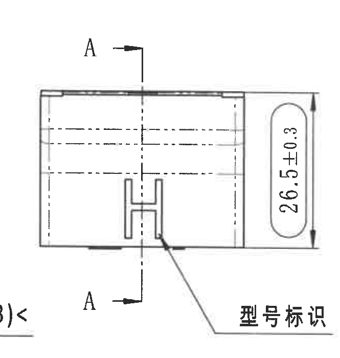

- 原图位置/视图名称：中左侧视图：A-A 剖切位置与型号标识；page 1；bbox `[1385, 1085, 2050, 1785]`。
- 边界归属说明：裁切包含完整 26.5±0.3 尺寸线、箭头、椭圆框、A-A 剖切线和型号标识引出线；右侧 A-A 剖面 RIR/RAR 标注不归属本对象。

提取表格：

| 提取项 | 原图数值或文本 | 含义说明 |
| --- | --- | --- |
| 总高度 | 26.5±0.3 | 右侧竖向尺寸，表示该侧视方向零件总高度，公差 ±0.3 mm；标注外有椭圆检查框。 |
| 剖切基准 | A / A | 上下两个 A 与竖向剖切线、箭头组成 A-A 剖切位置，指向对象 5 的 A-A 剖面。 |
| 型号标识 | 型号标识 | 引出线指向正面 H 形标记区域，说明此处为型号标识位置。 |
| 隐藏轮廓 | 多条虚线 | 表示内部/背面结构轮廓，与 A-A 剖面对应。 |

## 对象 5：剖面 A-A

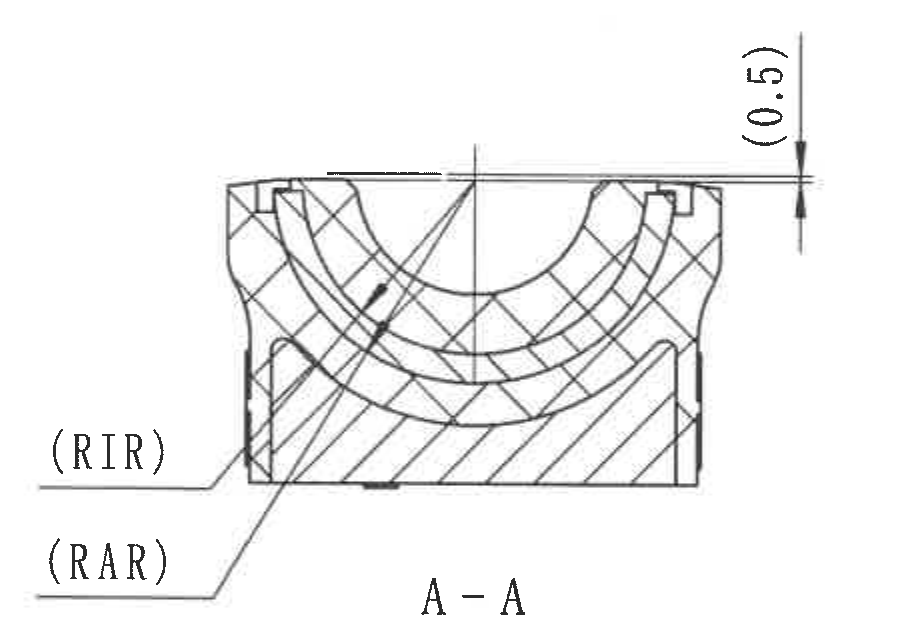

- 原图位置/视图名称：剖面 A-A；page 1；bbox `[2070, 1090, 2970, 1730]`。
- 边界归属说明：裁切包含 A-A 剖面主体、RIR/RAR 引出线与 (0.5) 参考尺寸；下方 NOTES 表头边缘不属于本剖面内容。

提取表格：

| 提取项 | 原图数值或文本 | 含义说明 |
| --- | --- | --- |
| 剖面名 | A-A | 由对象 4 的 A-A 剖切线生成的剖视图。 |
| 参考高度 | (0.5) | 右上竖向括号参考尺寸，表示剖面顶部局部高度/台阶参考值。 |
| Insert inner radius | (RIR) | 左侧引出线指向内侧嵌件半径；具体数值由规格表 RIR 列给出，H 行为 15.2 mm。括号表示该处为代号/参考说明。 |
| Insert outer radius | (RAR) | 左侧引出线指向外侧嵌件半径；具体数值由规格表 RAR 列给出，H 行为 17.7 mm。括号表示该处为代号/参考说明。 |
| 剖面材料 | 交叉剖面线与斜剖面线 | 不同剖面线区分橡胶、嵌件/骨架等材料区域。 |

## 对象 6：剖面 B-B

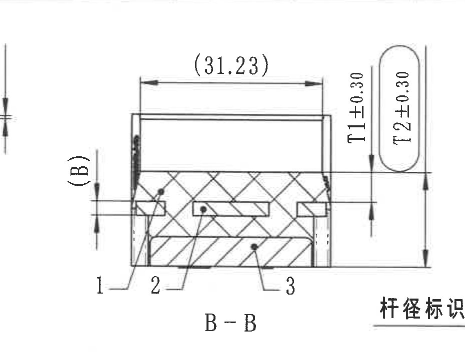

- 原图位置/视图名称：剖面 B-B；page 1；bbox `[2860, 1035, 3790, 1740]`。
- 边界归属说明：裁切包含 B-B 剖面主体、(31.23)、(B)、T1±0.30、T2±0.30 及 1/2/3 引出编号；左边缘可能可见 A-A 的 (0.5) 标注残边，不归入本对象。

提取表格：

| 提取项 | 原图数值或文本 | 含义说明 |
| --- | --- | --- |
| 剖面名 | B-B | 由对象 7 的 B-B 剖切线生成的剖视图。 |
| 参考长度 | (31.23) | 顶部水平括号尺寸，为参考尺寸，表示剖面上方总宽/长度参考值。 |
| 厚度 T1 | T1±0.30 | 右侧竖向尺寸，表示橡胶厚度 T1 的公差带；H 行名义值见规格表为 5.75 mm。 |
| 内橡胶厚度 T2 | T2±0.30 | 右侧椭圆框内竖向尺寸，表示内橡胶厚度 T2 的公差带；H 行名义值见规格表为 17.05 mm。 |
| 嵌件厚度代号 | (B) | 左侧竖向括号尺寸，代号 B；H 行名义值见规格表为 2.5 mm。 |
| 部件编号 | 1 / 2 / 3 | 剖面引出数字对应 BOM：1 橡胶，2 铝骨架，3 塑料底座。 |

## 对象 7：右上正视图 - B-B 剖切位置与杆径标识

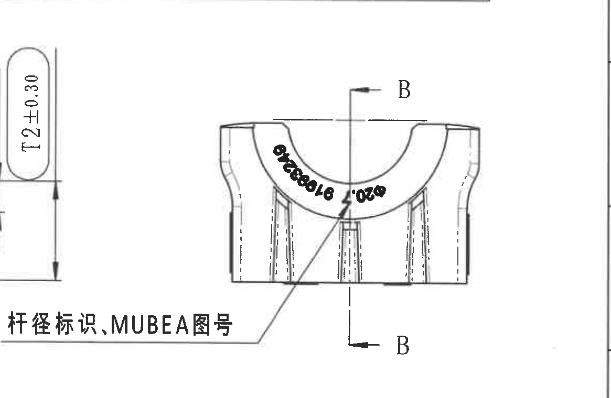

- 原图位置/视图名称：右上正视图：B-B 剖切位置与杆径/MUBEA 图号标识；page 1；bbox `[3605, 1035, 4770, 1795]`。
- 边界归属说明：裁切包含右上 B 视图主体、B-B 剖切标记和完整杆径/MUBEA 图号引出文字；左侧若可见 B-B 剖面尺寸残线，仅作相邻视图边缘，不提取为本视图尺寸。

提取表格：

| 提取项 | 原图数值或文本 | 含义说明 |
| --- | --- | --- |
| 剖切基准 | B / B | 上下两个 B 与竖向剖切线、箭头组成 B-B 剖切位置，指向对象 6 的 B-B 剖面。 |
| 杆径标识、MUBEA图号 | 杆径标识, MUBEA图号 | 引出线指向弧面黑色印字区域，说明该处标注稳定杆直径及 MUBEA 图号。 |
| 弧面印字 | Ø20.7 / 91993249 | 弧形文字包含 H 行稳定杆直径 ØA=20.7 与图号/编号 91993249。 |
| 局部结构 | 中心下方小矩形凸台/标识区 | 与引出线终点和杆径/MUBEA 图号标识相关。 |

## 对象 8：左下底视图 - 外形尺寸与铭文位置

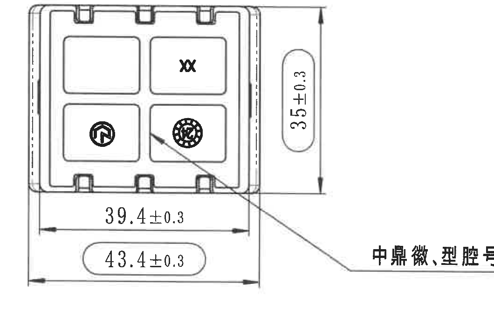

- 原图位置/视图名称：左下底视/俯视图：外形尺寸与铭文位置；page 1；bbox `[500, 1880, 1560, 2590]`。
- 边界归属说明：裁切包含底视图完整外框、39.4±0.3、43.4±0.3、35±0.3 尺寸线和右侧标识引出文字；未把下方公差表纳入本视图。

提取表格：

| 提取项 | 原图数值或文本 | 含义说明 |
| --- | --- | --- |
| 内部宽度 | 39.4±0.3 | 底部上方水平尺寸，表示内侧或功能区域宽度，公差 ±0.3 mm。 |
| 外部总宽 | 43.4±0.3 | 最下方水平尺寸，带椭圆检查框，表示外轮廓总宽，公差 ±0.3 mm。 |
| 总高度 | 35±0.3 | 右侧竖向尺寸，带椭圆检查框，表示该视图方向总高度，公差 ±0.3 mm。 |
| 标识引出 | 中鼎徽、型腔号、时间钟 | 引出线指向右下标识区，说明该位置包含中鼎徽标、型腔号与日期/时间钟。 |
| 局部符号 | XX、圆形徽标、时间钟图案 | 底视面上的成型标记位置。 |

## 对象 9：等轴测图

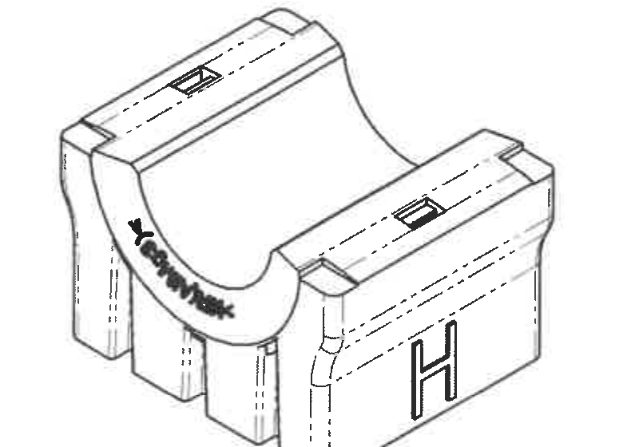

- 原图位置/视图名称：等轴测图；page 1；bbox `[1900, 1840, 2690, 2400]`。
- 边界归属说明：裁切仅覆盖等轴测零件主体；右侧 NOTES 文本未纳入，底部坐标轴不归属该对象。

提取表格：

| 提取项 | 原图数值或文本 | 含义说明 |
| --- | --- | --- |
| 三维外观 | 等轴测零件图 | 展示稳定杆衬套组件立体外形、半圆槽、侧壁、底部支脚和表面标识位置。 |
| 外表面标识 | 弧面黑色标识、侧面 H | 弧面与侧面均有标识，辅助理解对象 3/7/8 中标识位置。 |
| 尺寸 | 无独立尺寸数值 | 该图为形状说明视图，未标注独立尺寸线。 |

## 对象 10：Specification 技术要求

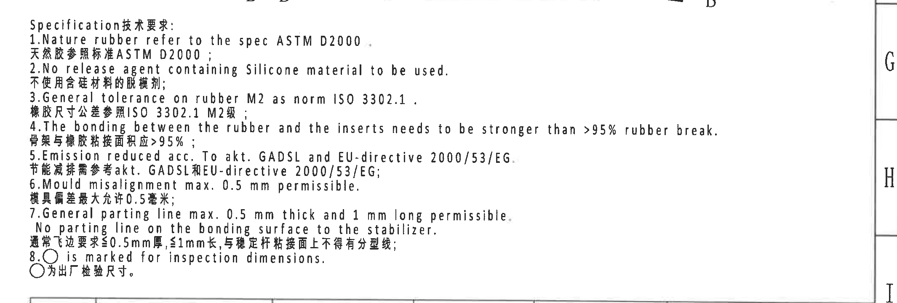

- 原图位置/视图名称：Specification 技术要求 / NOTES；page 1；bbox `[2685, 1695, 4815, 2415]`。
- 边界归属说明：裁切包含 Specification/技术要求标题和 1-8 条中英文内容；上边缘有 B-B/B 标记残边但不属于 NOTES 内容。

提取表格：

| 提取项 | 原图数值或文本 | 含义说明 |
| --- | --- | --- |
| 1 | Nature rubber refer to the spec ASTM D2000. / 天然胶参照标准 ASTM D2000； | 天然橡胶按 ASTM D2000 规范。 |
| 2 | No release agent containing Silicone material to be used. / 不使用含硅材料的脱模剂； | 禁止使用含硅脱模剂。 |
| 3 | General tolerance on rubber M2 as norm ISO 3302.1. / 橡胶尺寸公差参照 ISO 3302.1 M2级； | 橡胶件一般尺寸公差按 ISO 3302.1 M2。 |
| 4 | The bonding between the rubber and the inserts needs to be stronger than >95% rubber break. / 骨架与橡胶粘接面积应 >95%； | 橡胶与嵌件/骨架粘接强度要求。 |
| 5 | Emission reduced acc. To akt. GADSL and EU-directive 2000/53/EG. / 节能减排需参考 akt. GADSL 和 EU-directive 2000/53/EG； | 排放/环保法规符合性要求。 |
| 6 | Mould misalignment max. 0.5 mm permissible. / 模具偏差最大允许 0.5 毫米； | 模具错位最大允许值。 |
| 7 | General parting line max. 0.5 mm thick and 1 mm long permissible. No parting line on the bonding surface to the stabilizer. / 通常飞边要求 ≤0.5mm厚，≤1mm长，与稳定杆粘接面上不得有分型线； | 飞边/分型线限制。 |
| 8 | ◎ is marked for inspection dimensions. / ◎为出厂检验尺寸。 | 带圈标记表示检验尺寸或检验项目。 |

## 对象 11：DIN ISO 3302-1 M2 class 公差表

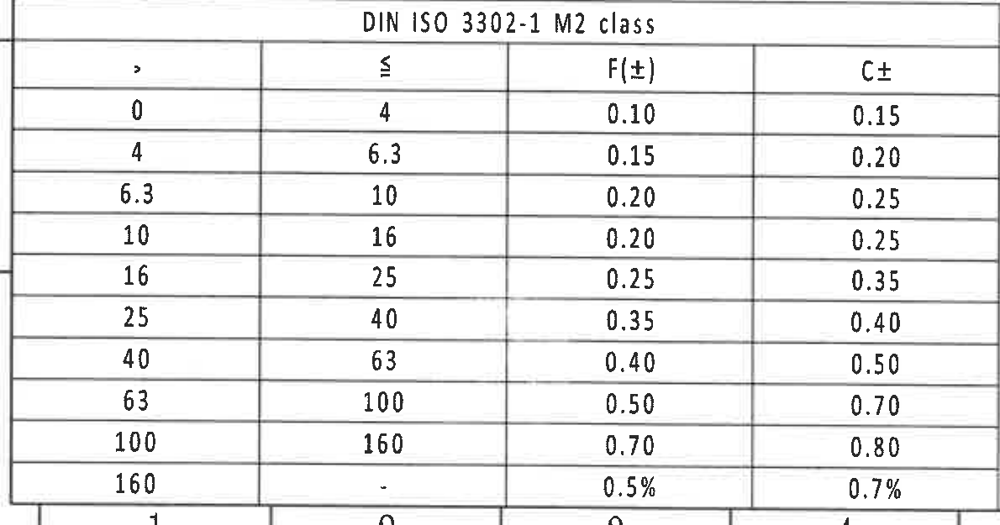

- 原图位置/视图名称：DIN ISO 3302-1 M2 class 公差表；page 1；bbox `[350, 2725, 1540, 3350]`。
- 边界归属说明：裁切包含完整公差表标题、表头和全部 10 行；未包含下方图框坐标编号作为表格内容。

原表格还原：

| > | ≤ | F(±) | C± |
| --- | --- | --- | --- |
| 0 | 4 | 0.10 | 0.15 |
| 4 | 6.3 | 0.15 | 0.20 |
| 6.3 | 10 | 0.20 | 0.25 |
| 10 | 16 | 0.20 | 0.25 |
| 16 | 25 | 0.25 | 0.35 |
| 25 | 40 | 0.35 | 0.40 |
| 40 | 63 | 0.40 | 0.50 |
| 63 | 100 | 0.50 | 0.70 |
| 100 | 160 | 0.70 | 0.80 |
| 160 | - | 0.5% | 0.7% |

提取表格：

| 提取项 | 原图数值或文本 | 含义说明 |
| --- | --- | --- |
| 标准 | DIN ISO 3302-1 M2 class | 橡胶尺寸一般公差等级表，对应 NOTES 第 3 条。 |
| 列 F(±) | 0.10 到 0.70，160 以上为 0.5% | F 类尺寸公差。 |
| 列 C± | 0.15 到 0.80，160 以上为 0.7% | C 类尺寸公差。 |

## 对象 12：坐标轴与参考标准

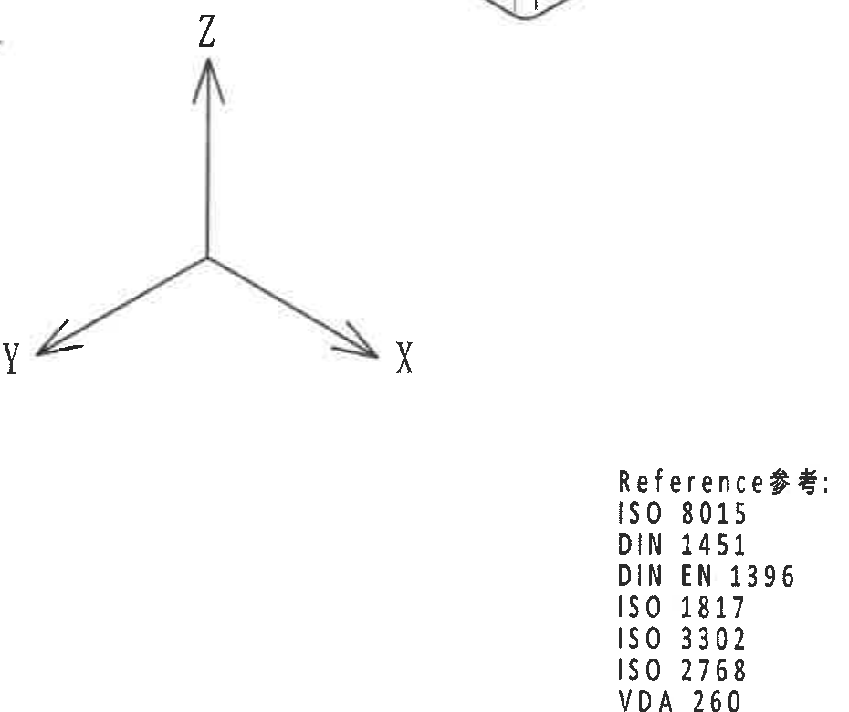

- 原图位置/视图名称：坐标轴与参考标准；page 1；bbox `[1725, 2420, 2655, 3200]`。
- 边界归属说明：裁切包含坐标轴和右侧 Reference 参考标准列表；上方等轴测图的局部边缘不作为本对象内容。

提取表格：

| 提取项 | 原图数值或文本 | 含义说明 |
| --- | --- | --- |
| 坐标轴 | X / Y / Z | 图纸方向坐标；Z 向上，X 向右下，Y 向左下。 |
| Reference 参考 | ISO 8015; DIN 1451; DIN EN 1396; ISO 1817; ISO 3302; ISO 2768; VDA 260; GADSL; Note-DPR-34184774 | 参考标准清单，用于图纸解释、字体/标注、材料/环境和公差要求。 |
| 尺寸 | 无独立尺寸数值 | 该对象为方向和参考标准说明，不含尺寸线。 |

## 对象 13：BOM 明细表

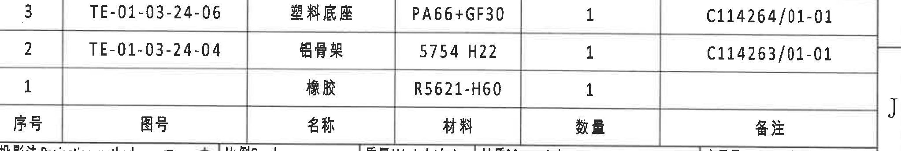

- 原图位置/视图名称：BOM 明细表；page 1；bbox `[2770, 2420, 4815, 2765]`。
- 边界归属说明：裁切包含 BOM 三行和表头；下方标题栏字段不归入 BOM。

原表格还原：

| 序号 | 图号 | 名称 | 材料 | 数量 | 备注 |
| --- | --- | --- | --- | --- | --- |
| 3 | TE-01-03-24-06 | 塑料底座 | PA66+GF30 | 1 | C114264/01-01 |
| 2 | TE-01-03-24-04 | 铝骨架 | 5754 H22 | 1 | C114263/01-01 |
| 1 |  | 橡胶 | R5621-H60 | 1 |  |

提取表格：

| 提取项 | 原图数值或文本 | 含义说明 |
| --- | --- | --- |
| 序号 1 | 橡胶 / R5621-H60 / 数量 1 | 对应 B-B 剖面中的 1 号引出部件。 |
| 序号 2 | TE-01-03-24-04 / 铝骨架 / 5754 H22 / 数量 1 / C114263/01-01 | 对应 B-B 剖面中的 2 号引出部件。 |
| 序号 3 | TE-01-03-24-06 / 塑料底座 / PA66+GF30 / 数量 1 / C114264/01-01 | 对应 B-B 剖面中的 3 号引出部件。 |

## 对象 14：标题栏

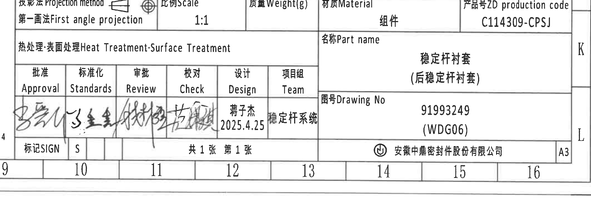

- 原图位置/视图名称：标题栏；page 1；bbox `[2700, 2765, 4830, 3495]`。
- 边界归属说明：裁切包含右下标题栏完整主要字段、审批签名栏和公司/幅面信息；上方 BOM 表格不归入标题栏。

提取表格：

| 提取项 | 原图数值或文本 | 含义说明 |
| --- | --- | --- |
| Projection method | 第一画法 First angle projection | 投影法为第一角法，图中有第一角投影符号。 |
| Scale | 1:1 | 图纸比例。 |
| Material | 组件 | 材料栏显示组件。 |
| ZD production code | C114309-CPSJ | 产品号/生产代码。 |
| Part name | 稳定杆衬套（后稳定杆衬套） | 零件名称。 |
| Drawing No | 91993249 (WDG06) | 图号，与规格表 H 行 Mubea proto SAP No. 对应。 |
| Heat Treatment/Surface Treatment | 热处理·表面处理 Heat Treatment·Surface Treatment | 该栏标题可见，具体处理内容为空。 |
| 审批栏 | Approval / Standards / Review / Check / Design / Team | 含手写签名；Design 栏为蒋子杰，日期 2025.4.25；Team 栏为稳定杆系统。 |
| 图纸张数 | 共1张 第1张 | 总页数和当前页。 |
| 公司/幅面 | 安徽中鼎密封件股份有限公司 / A3 | 公司名称和图幅。 |

## 裁切检查记录

| 对象 | 名称 | 图片路径 | 检查结论 | 逐张检查说明 |
| --- | --- | --- | --- | --- |
| object_1 | 变更履历表 / Change history | outputs/20C114309_assets/images/object_1.png | 完整 | 位于整页右上方，裁切包含完整表头、两行履历和左右边框；未提取下方规格表内容。 已检查尺寸线、箭头、文字和表格边框；若裁切中可见相邻对象残边，已在归属说明中排除。 |
| object_2 | 变型规格与材料表 / Variant specification table | outputs/20C114309_assets/images/object_2.png | 完整 | 位于上方大表格区域，裁切包含完整表头、B/C/E/H/J/K/L 七行和右侧材料列；未把下方视图尺寸归入表格。 已检查尺寸线、箭头、文字和表格边框；若裁切中可见相邻对象残边，已在归属说明中排除。 |
| object_3 | 左上正视图：材料标识视图 | outputs/20C114309_assets/images/object_3.png | 完整 | 裁切覆盖左上正视图、ØE 相关尺寸线、(0.5) 参考尺寸和材料标识引出线；右侧相邻侧视图未纳入提取，边缘可见的相邻线不归属本视图。 已检查尺寸线、箭头、文字和表格边框；若裁切中可见相邻对象残边，已在归属说明中排除。 |
| object_4 | 中左侧视图：A-A 剖切位置与型号标识 | outputs/20C114309_assets/images/object_4.png | 完整 | 裁切包含完整 26.5±0.3 尺寸线、箭头、椭圆框、A-A 剖切线和型号标识引出线；右侧 A-A 剖面 RIR/RAR 标注不归属本对象。 已检查尺寸线、箭头、文字和表格边框；若裁切中可见相邻对象残边，已在归属说明中排除。 |
| object_5 | 剖面 A-A | outputs/20C114309_assets/images/object_5.png | 完整 | 裁切包含 A-A 剖面主体、RIR/RAR 引出线与 (0.5) 参考尺寸；下方 NOTES 表头边缘不属于本剖面内容。 已检查尺寸线、箭头、文字和表格边框；若裁切中可见相邻对象残边，已在归属说明中排除。 |
| object_6 | 剖面 B-B | outputs/20C114309_assets/images/object_6.png | 完整 | 裁切包含 B-B 剖面主体、(31.23)、(B)、T1±0.30、T2±0.30 及 1/2/3 引出编号；左边缘可能可见 A-A 的 (0.5) 标注残边，不归入本对象。 已检查尺寸线、箭头、文字和表格边框；若裁切中可见相邻对象残边，已在归属说明中排除。 |
| object_7 | 右上正视图：B-B 剖切位置与杆径/MUBEA 图号标识 | outputs/20C114309_assets/images/object_7.png | 完整 | 裁切包含右上 B 视图主体、B-B 剖切标记和完整杆径/MUBEA 图号引出文字；左侧若可见 B-B 剖面尺寸残线，仅作相邻视图边缘，不提取为本视图尺寸。 已检查尺寸线、箭头、文字和表格边框；若裁切中可见相邻对象残边，已在归属说明中排除。 |
| object_8 | 左下底视/俯视图：外形尺寸与铭文位置 | outputs/20C114309_assets/images/object_8.png | 完整 | 裁切包含底视图完整外框、39.4±0.3、43.4±0.3、35±0.3 尺寸线和右侧标识引出文字；未把下方公差表纳入本视图。 已检查尺寸线、箭头、文字和表格边框；若裁切中可见相邻对象残边，已在归属说明中排除。 |
| object_9 | 等轴测图 | outputs/20C114309_assets/images/object_9.png | 完整 | 裁切仅覆盖等轴测零件主体；右侧 NOTES 文本未纳入，底部坐标轴不归属该对象。 已检查尺寸线、箭头、文字和表格边框；若裁切中可见相邻对象残边，已在归属说明中排除。 |
| object_10 | Specification 技术要求 / NOTES | outputs/20C114309_assets/images/object_10.png | 完整 | 裁切包含 Specification/技术要求标题和 1-8 条中英文内容；上边缘有 B-B/B 标记残边但不属于 NOTES 内容。 已检查尺寸线、箭头、文字和表格边框；若裁切中可见相邻对象残边，已在归属说明中排除。 |
| object_11 | DIN ISO 3302-1 M2 class 公差表 | outputs/20C114309_assets/images/object_11.png | 完整 | 裁切包含完整公差表标题、表头和全部 10 行；未包含下方图框坐标编号作为表格内容。 已检查尺寸线、箭头、文字和表格边框；若裁切中可见相邻对象残边，已在归属说明中排除。 |
| object_12 | 坐标轴与参考标准 | outputs/20C114309_assets/images/object_12.png | 完整 | 裁切包含坐标轴和右侧 Reference 参考标准列表；上方等轴测图的局部边缘不作为本对象内容。 已检查尺寸线、箭头、文字和表格边框；若裁切中可见相邻对象残边，已在归属说明中排除。 |
| object_13 | BOM 明细表 | outputs/20C114309_assets/images/object_13.png | 完整 | 裁切包含 BOM 三行和表头；下方标题栏字段不归入 BOM。 已检查尺寸线、箭头、文字和表格边框；若裁切中可见相邻对象残边，已在归属说明中排除。 |
| object_14 | 标题栏 | outputs/20C114309_assets/images/object_14.png | 完整 | 裁切包含右下标题栏完整主要字段、审批签名栏和公司/幅面信息；上方 BOM 表格不归入标题栏。 已检查尺寸线、箭头、文字和表格边框；若裁切中可见相邻对象残边，已在归属说明中排除。 |
