# 20C114310 PDF 内容识别与裁切提取

整页渲染图：`20C114310_assets/images/page_1.png`，尺寸 4959 x 3505 px。  
坐标格式：`bbox = [x, y, width, height]`，坐标基于整页 PNG 左上角。

## object_1 - 修订履历表

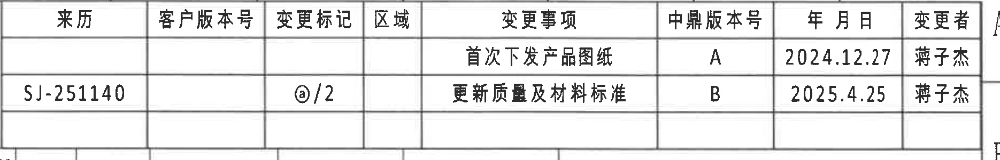

原图位置/视图名称：页 1，右上修订履历表，bbox `[2920, 175, 1870, 300]`。

原表还原：

| 来源 | 客户版本号 | 变更标记 | 区域 | 变更事项 | 中鼎版本号 | 年 月 日 | 变更者 |
|---|---|---|---|---|---|---|---|
|  |  |  |  | 首次下发产品图纸 | A | 2024.12.27 | 蒋子杰 |
| SJ-251140 |  | @/2 |  | 更新质量及材料标准 | B | 2025.4.25 | 蒋子杰 |

提取表格：

| 提取项 | 原图数值或文本 | 含义说明 |
|---|---|---|
| 中鼎版本号 A | A；2024.12.27；蒋子杰 | 首次下发产品图纸的版本记录。 |
| 中鼎版本号 B | B；2025.4.25；蒋子杰 | 更新质量及材料标准的版本记录。 |
| 变更来源 | SJ-251140 | 第二行变更来源编号。 |
| 变更标记 | @/2 | 第二行变更标记，原图为圈注样式加 `/2`。 |

边界归属说明：裁切只包含修订履历表；右侧图框字母贴近表格边界但未作为表格字段提取。

## object_2 - 上方规格参数表

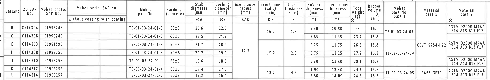

原图位置/视图名称：页 1，上方主规格参数表，bbox `[335, 445, 3660, 600]`。

原表还原：

| Variant | ZD SAP No. | Mubea proto. SAP No. | Mubea serial SAP No. without coating | Mubea serial SAP No. with coating | Mubea part No. | Hardness (shore A) | Stab diameter ØA (mm) | Bushing diameter ØE (mm) | Insert outer radius RAR (mm) | Insert inner radius RIR (mm) | Insert thickness B (mm) | Rubber thickness T1 (mm) | Inner rubber thickness T2 (mm) | Total weight @ (g) | Rubber volume (cm3) | Mubea part No. part 1 | Material part 1 | Material part 2 @ |
|---|---|---|---|---|---|---|---:|---:|---:|---:|---:|---:|---:|---:|---:|---|---|---|
| B | C114304 | 91993246 |  |  | TE-01-03-24-01-B | 55±3 | 23.6 | 22.8 |  | 16.2 | 1.5 | 5.30 | 10.80 | 23 | 16.1 | TE-01-03-24-03 |  | ASTM D2000 M4AA 514 A13 B13 F17 |
| C | C114306 | 91993248 |  |  | TE-01-03-24-01-C | 60±3 | 22.5 | 21.7 |  | 16.2 | 1.5 | 5.85 | 11.35 | 23.7 | 16.8 | TE-01-03-24-03 |  | ASTM D2000 M4AA 614 A13 B13 F17 |
| E | C114263 | 91991595 |  |  | TE-01-03-24-01-E | 60±3 | 21.7 | 20.9 | 17.7 | 15.2 | 2.5 | 5.25 | 11.75 | 26.6 | 15.8 | TE-01-03-24-04 | GB/T 5754-H22 | ASTM D2000 M4AA 614 A13 B13 F17 |
| H | C114308 | 91993250 |  |  | TE-01-03-24-01-H | 60±3 | 20.7 | 19.9 | 17.7 | 15.2 | 2.5 | 5.75 | 12.25 | 27.2 | 16.3 | TE-01-03-24-04 | GB/T 5754-H22 | ASTM D2000 M4AA 614 A13 B13 F17 |
| J | C114310 | 91993253 |  |  | TE-01-03-24-01-J | 65±3 | 19.6 | 18.8 | 17.7 | 15.2 | 2.5 | 6.30 | 12.80 | 28.1 | 16.8 | TE-01-03-24-04 | GB/T 5754-H22 | ASTM D2000 M4AA 614 A13 B13 F17 |
| K | C114312 | 91993255 |  |  | TE-01-03-24-01-K | 60±3 | 18.4 | 17.6 |  | 13.2 | 4.5 | 4.90 | 13.40 | 24.1 | 14.8 | TE-01-03-24-05 | PA66 GF30 | ASTM D2000 M4AA 614 A13 B13 F17 |
| L | C114314 | 91993257 |  |  | TE-01-03-24-01-L | 60±3 | 17.2 | 16.4 |  | 13.2 | 4.5 | 5.50 | 14.00 | 24.6 | 15.3 | TE-01-03-24-05 | PA66 GF30 | ASTM D2000 M4AA 614 A13 B13 F17 |

提取表格：

| 提取项 | 原图数值或文本 | 含义说明 |
|---|---|---|
| Variant J 对应本图 | C114310 / 91993253 / TE-01-03-24-01-J | 与标题栏图号 91993253、产品号 C114310-CPSJ 对应。 |
| ØA | J 行 19.6 mm | 稳定杆直径变量；主视弧形标识处显示 `Ø19.6`。 |
| ØE | J 行 18.8 mm | 衬套孔径变量；主视用 `ØE±0.3` 标注。 |
| RAR/RIR | J 行 RAR 17.7 mm，RIR 15.2 mm | A-A 剖视中以 `(RAR)`、`(RIR)` 参考标注。 |
| B | J 行 2.5 mm | B-B 剖视中的 `(B)` 插入件厚度变量。 |
| T1/T2 | J 行 T1=6.30 mm，T2=12.80 mm | B-B 剖视中以 `T1±0.3`、`T2±0.3` 标注。 |
| 硬度 | J 行 65±3 shore A | 橡胶硬度要求。 |
| 总重量/橡胶体积 | J 行 28.1 g / 16.8 cm3 | 总重量与橡胶体积数据。 |
| 材料 | GB/T 5754-H22；ASTM D2000 M4AA 614 A13 B13 F17 | J 行铝骨架与橡胶材料标准。 |

边界归属说明：下边界已重裁，未包含下方 `(RAR)`、`(RIR)` 等剖视标注；表内合并单元格在 Markdown 中按适用行重复写出。

## object_3 - 左上主视图/杆径标识视图

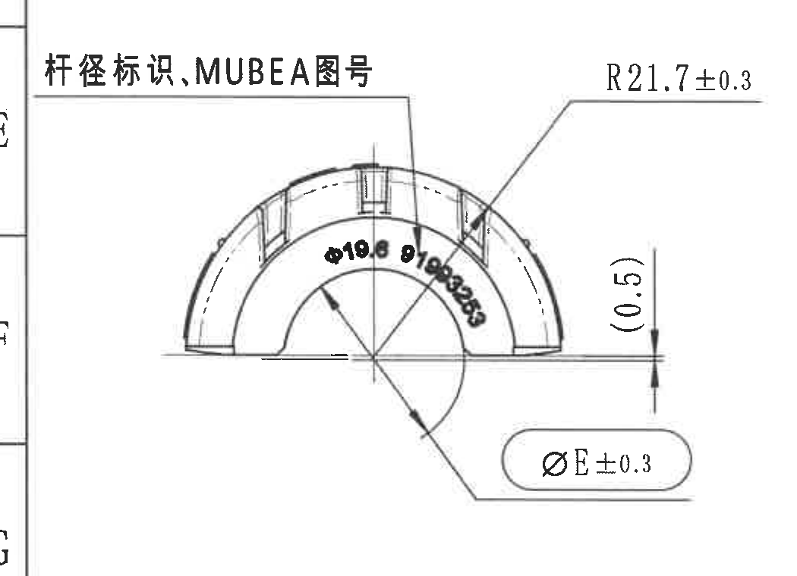

原图位置/视图名称：页 1，左上主视图，bbox `[330, 1110, 1050, 760]`。

提取表格：

| 提取项 | 原图数值或文本 | 含义说明 |
|---|---|---|
| 视图说明 | 杆径标识,MUBEA图号 | 本主视图展示弧形外观、杆径标识和 MUBEA 图号位置。 |
| 弧形标识 | Ø19.6 91993253 | 沿内弧布置；`Ø19.6` 对应规格表 J 行 ØA，`91993253` 对应标题栏 Drawing No。 |
| 半径尺寸 | R21.7±0.3 | 外形圆弧半径尺寸，带 ±0.3 公差。 |
| 直径尺寸 | ØE±0.3 | 衬套直径变量，E 值由规格表确定；J 行 ØE=18.8 mm。 |
| 参考尺寸 | (0.5) | 括号内尺寸为参考尺寸，位于主视图右侧基准线附近，用于说明边缘高度/间隙关系，不作为独立公差控制尺寸。 |
| 星号关键尺寸 | 未见带星号尺寸 | 本视图无 `*` 标注的关键尺寸。 |

边界归属说明：左侧仅有少量图框坐标边缘，未提取为视图内容；右侧尺寸线、箭头和文字完整包含。

## object_4 - 侧视图/A-A 剖切位置

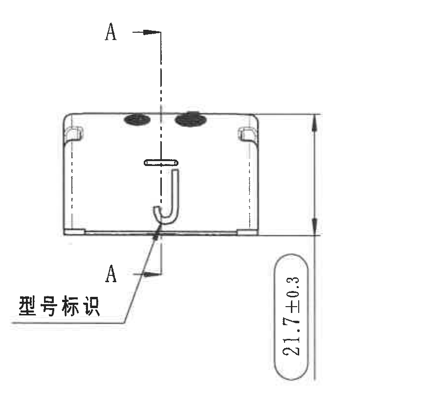

原图位置/视图名称：页 1，中左侧视图，bbox `[1370, 1100, 900, 850]`。

提取表格：

| 提取项 | 原图数值或文本 | 含义说明 |
|---|---|---|
| 剖切基准字母 | A、A | A-A 剖切位置；上、下各有 `A` 和箭头，中心虚线表示剖切线。 |
| 总高度/外形高度 | 21.7±0.3 | 侧视竖向尺寸，带 ±0.3 公差，位于右侧完整尺寸线内。 |
| 型号标识 | 型号标识；J | 侧面型号标识位置，`J` 对应 Variant J。 |
| 星号关键尺寸 | 未见带星号尺寸 | 本视图没有星号尺寸。 |

边界归属说明：已重裁去除右侧 A-A 剖视片段；所有 A-A 剖切箭头和 21.7±0.3 尺寸线完整。

## object_5 - A-A 剖面视图

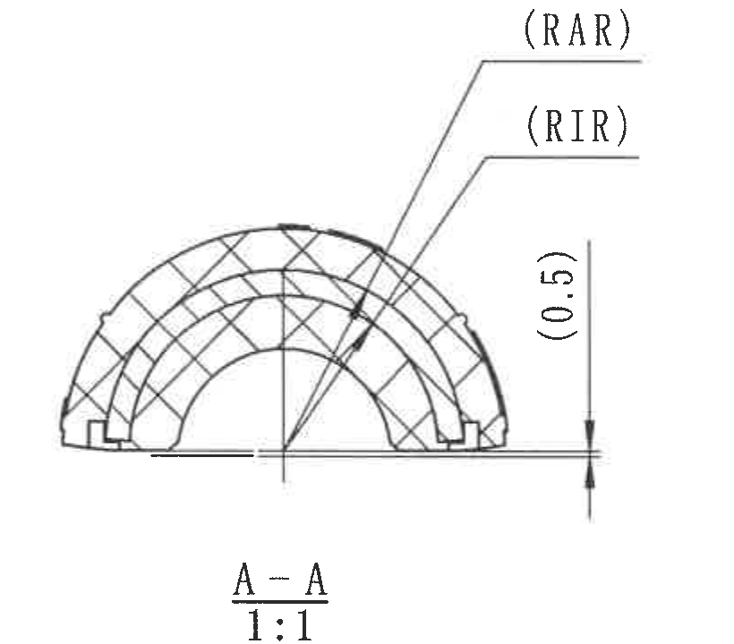

原图位置/视图名称：页 1，中部 A-A 剖视，bbox `[2260, 1080, 820, 720]`。

提取表格：

| 提取项 | 原图数值或文本 | 含义说明 |
|---|---|---|
| 剖面名称/比例 | A-A；1:1 | A-A 剖面视图，比例 1:1。 |
| 外插入半径参考 | (RAR) | 括号内参考尺寸；由规格表确定，J 行 RAR=17.7 mm。 |
| 内插入半径参考 | (RIR) | 括号内参考尺寸；由规格表确定，J 行 RIR=15.2 mm。 |
| 参考尺寸 | (0.5) | 位于剖视右侧竖向尺寸线上，括号表示参考尺寸。 |
| 剖面填充 | 交叉剖面线 | 表示剖切材料区域，不是尺寸值。 |
| 星号关键尺寸 | 未见带星号尺寸 | 本剖面无星号关键尺寸。 |

边界归属说明：右边界重裁后不包含 B-B 剖视的 `(B)` 标注；底部只包含 A-A 标题和比例。

## object_6 - B-B 剖面视图

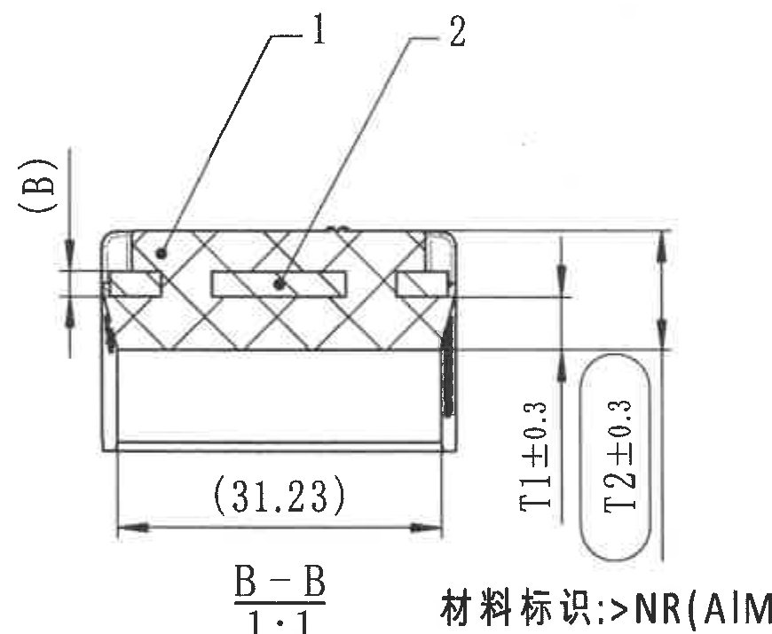

原图位置/视图名称：页 1，中右 B-B 剖视，bbox `[3090, 1085, 870, 715]`。

提取表格：

| 提取项 | 原图数值或文本 | 含义说明 |
|---|---|---|
| 剖面名称/比例 | B-B；1:1 | B-B 剖面视图，比例 1:1。 |
| 项目编号 | 1、2 | 剖面引出编号；与标题栏 BOM 的序号 1 橡胶、序号 2 铝骨架对应。 |
| 参考尺寸 | (B) | 括号内参考尺寸；由规格表确定，J 行 B=2.5 mm。 |
| 参考尺寸 | (31.23) | 底部水平参考尺寸，括号表示参考值。 |
| T 编号尺寸 | T1±0.3 | 橡胶厚度 T1，带 ±0.3 公差；J 行 T1=6.30 mm。 |
| T 编号尺寸 | T2±0.3 | 内橡胶厚度 T2，带 ±0.3 公差；J 行 T2=12.80 mm。 |
| 星号关键尺寸 | 未见带星号尺寸 | 本剖面无星号关键尺寸。 |

边界归属说明：B-B 的 `1:1` 与下方材料标识线相距很近；裁切保留了 B-B 标题和比例，右下缘可见相邻材料标识的少量文字边缘，但未作为 B-B 内容提取。

## object_7 - 右侧正视图/材料标识视图

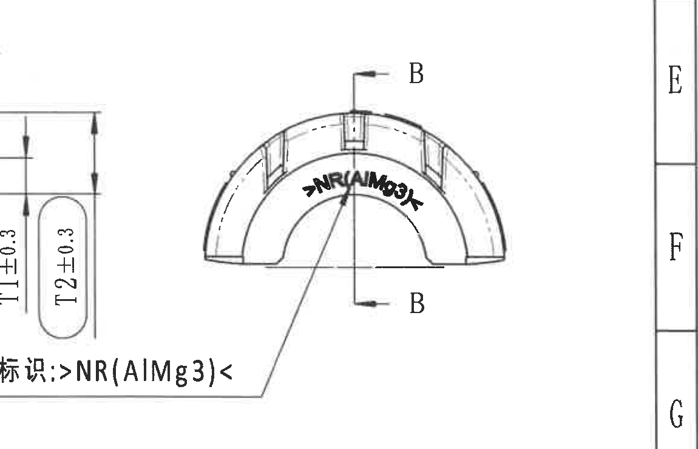

原图位置/视图名称：页 1，右侧正视图与材料标识，bbox `[3680, 1160, 1150, 740]`。

提取表格：

| 提取项 | 原图数值或文本 | 含义说明 |
|---|---|---|
| 剖切基准字母 | B、B | 标出 B-B 剖切方向，上下各有 `B`。 |
| 材料弧形标识 | >NR(AlMg3)< | 位于零件内弧区域，表示橡胶/铝镁材料标识内容。 |
| 材料标识说明 | 材料标识: >NR(AlMg3)< | 下方引出线对应弧形材料标识。 |
| 星号关键尺寸 | 未见带星号尺寸 | 本视图无星号尺寸。 |

边界归属说明：左边缘靠近 B-B 的 `T1/T2` 尺寸，裁切中可见局部相邻尺寸边缘；该 `T1/T2` 属于 object_6 B-B 剖面，不在本视图提取。右侧图框坐标字母不作为内容提取。

## object_8 - 下视图/徽标、型号、时间钟位置

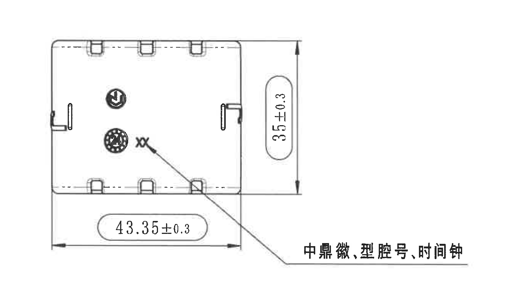

原图位置/视图名称：页 1，左下下视图，bbox `[440, 1810, 1320, 760]`。

提取表格：

| 提取项 | 原图数值或文本 | 含义说明 |
|---|---|---|
| 竖向尺寸 | 35±0.3 | 下视图右侧总宽/高度方向尺寸，带 ±0.3 公差。 |
| 横向尺寸 | 43.35±0.3 | 下视图底部总长方向尺寸，带 ±0.3 公差。 |
| 标识说明 | 中鼎徽,型号,时间钟 | 引出线指向零件上的中鼎徽、型号与时间钟位置。 |
| 局部标记 | xx | 与标识说明引出线相邻，为原图局部标记文本。 |
| 星号关键尺寸 | 未见带星号尺寸 | `xx` 不是星号关键尺寸。 |

边界归属说明：已向右扩展后再收紧，完整保留中文说明和引出线，未混入右侧等轴视图片段。

## object_9 - 等轴视图与坐标轴

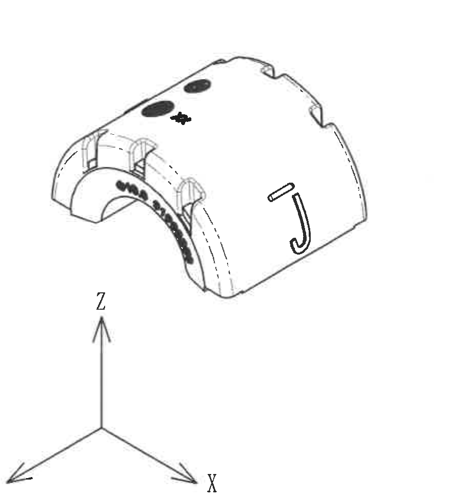

原图位置/视图名称：页 1，中下等轴视图，bbox `[1740, 1900, 880, 980]`。

提取表格：

| 提取项 | 原图数值或文本 | 含义说明 |
|---|---|---|
| 等轴视图 | 零件三维外观 | 展示弧形衬套外观、侧面 `J` 标识、顶部黑色标识和端部结构。 |
| 坐标轴 | X、Y、Z | 表示零件方向；不是尺寸。 |
| 尺寸 | 未见尺寸标注 | 本等轴视图无数值尺寸、角度或公差。 |

边界归属说明：已重裁去除右侧 NOTES 文字；等轴图和 X/Y/Z 坐标轴完整。

## object_10 - NOTES / Specification 技术要求

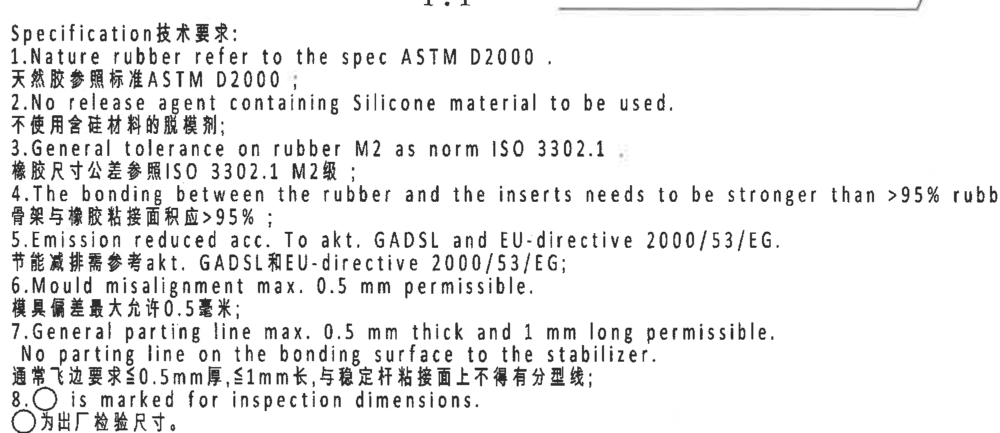

原图位置/视图名称：页 1，中右 NOTES 技术要求区，bbox `[2735, 1800, 1500, 650]`。

原文本还原：

| 序号 | 原图英文/中文文本 |
|---|---|
| 标题 | Specification技术要求: |
| 1 | Nature rubber refer to the spec ASTM D2000. / 天然胶参照标准ASTM D2000; |
| 2 | No release agent containing Silicone material to be used. / 不使用含硅材料的脱模剂; |
| 3 | General tolerance on rubber M2 as norm ISO 3302.1 / 橡胶尺寸公差参照ISO 3302.1 M2级; |
| 4 | The bonding between the rubber and the inserts needs to be stronger than >95% rubber break. / 骨架与橡胶粘接面积应>95%; |
| 5 | Emission reduced acc. To akt. GADSL and EU-directive 2000/53/EG. / 节能减排需参考akt. GADSL和EU-directive 2000/53/EG; |
| 6 | Mould misalignment max. 0.5 mm permissible. / 模具偏差最大允许0.5毫米; |
| 7 | General parting line max. 0.5 mm thick and 1 mm long permissible. No parting line on the bonding surface to the stabilizer. / 通常飞边要求≤0.5mm厚, ≤1mm长, 与稳定杆粘接面上不得有分型线; |
| 8 | ○ is marked for inspection dimensions. / ○为出厂检验尺寸。 |

提取表格：

| 提取项 | 原图数值或文本 | 含义说明 |
|---|---|---|
| 材料标准 | ASTM D2000 | 天然胶参考标准。 |
| 通用公差 | ISO 3302.1 M2 | 橡胶尺寸通用公差等级。 |
| 粘接面积 | >95% rubber break / >95% | 骨架与橡胶粘接强度/破坏面积要求。 |
| 模具偏差 | max. 0.5 mm | 模具错位最大允许值。 |
| 飞边 | max. 0.5 mm thick and 1 mm long | 飞边厚度和长度限制。 |
| 出厂检验符号 | ○ | 图中圆圈标识为出厂检验尺寸。 |

边界归属说明：顶部可见一小段上方材料标识引出线，属于 object_7，不作为 NOTES 文本提取；底部未包含下方 BOM 表。

## object_11 - DIN ISO 3302-1 M2 class 公差表

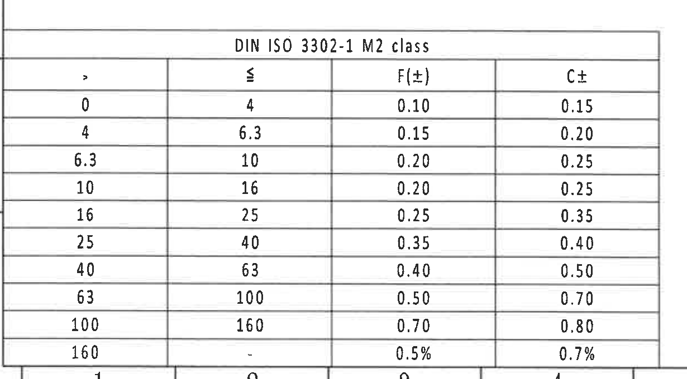

原图位置/视图名称：页 1，左下 DIN ISO 3302-1 M2 class 公差表，bbox `[360, 2690, 1230, 680]`。

原表还原：

| DIN ISO 3302-1 M2 class |  |  |  |
|---:|---:|---:|---:|
| > | ≤ | F(±) | C± |
| 0 | 4 | 0.10 | 0.15 |
| 4 | 6.3 | 0.15 | 0.20 |
| 6.3 | 10 | 0.20 | 0.25 |
| 10 | 16 | 0.20 | 0.25 |
| 16 | 25 | 0.25 | 0.35 |
| 25 | 40 | 0.35 | 0.40 |
| 40 | 63 | 0.40 | 0.50 |
| 63 | 100 | 0.50 | 0.70 |
| 100 | 160 | 0.70 | 0.80 |
| 160 | - | 0.5% | 0.7% |

提取表格：

| 提取项 | 原图数值或文本 | 含义说明 |
|---|---|---|
| 公差标准 | DIN ISO 3302-1 M2 class | 橡胶件尺寸公差表，与 NOTES 第 3 条对应。 |
| F(±) | 0.10 到 0.70；160 以上为 0.5% | F 类双向公差。 |
| C± | 0.15 到 0.80；160 以上为 0.7% | C 类双向公差。 |

边界归属说明：底部有极细图框坐标边缘，但表格最后一行完整；未提取底部坐标数字。

## object_12 - Reference 参考标准

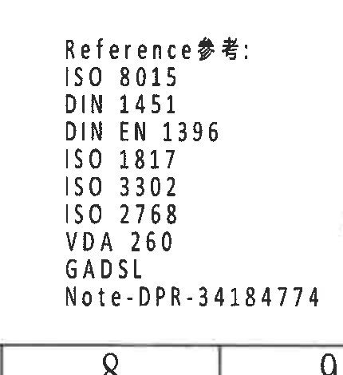

原图位置/视图名称：页 1，下方参考标准块，bbox `[2310, 2920, 430, 470]`。

提取表格：

| 提取项 | 原图数值或文本 | 含义说明 |
|---|---|---|
| 标题 | Reference参考: | 参考标准清单标题。 |
| 标准 | ISO 8015 | 引用标准。 |
| 标准 | DIN 1451 | 引用标准。 |
| 标准 | DIN EN 1396 | 引用标准。 |
| 标准 | ISO 1817 | 引用标准。 |
| 标准 | ISO 3302 | 引用标准。 |
| 标准 | ISO 2768 | 引用标准。 |
| 标准 | VDA 260 | 引用标准。 |
| 标准 | GADSL | 引用标准。 |
| 备注编号 | Note-DPR-34184774 | 备注/规范编号。 |

边界归属说明：右侧已重裁去除标题栏签名片段；底部图框坐标边缘不作为参考标准内容提取。

## object_13 - BOM、标题栏、签核栏

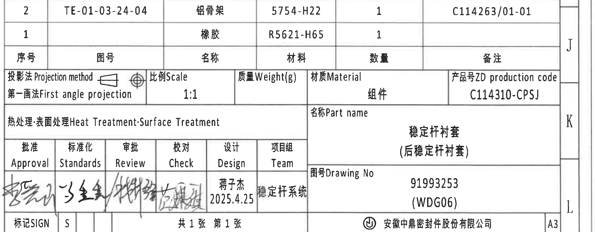

原图位置/视图名称：页 1，右下 BOM/标题栏/签核栏，bbox `[2740, 2505, 2150, 840]`。

BOM 原表还原：

| 序号 | 图号 | 名称 | 材料 | 数量 | 备注 |
|---:|---|---|---|---:|---|
| 2 | TE-01-03-24-04 | 铝骨架 | 5754-H22 | 1 | C114263/01-01 |
| 1 |  | 橡胶 | R5621-H65 | 1 |  |

标题栏原表字段还原：

| 字段 | 原图数值或文本 |
|---|---|
| 投影法 Projection method | 第一画法 First angle projection |
| 比例 Scale | 1:1 |
| 质量 Weight(g) |  |
| 材质 Material | 组件 |
| 产品号 ZD production code | C114310-CPSJ |
| 热处理·表面处理 Heat Treatment;Surface Treatment |  |
| 名称 Part name | 稳定杆衬套（后稳定杆衬套） |
| 图号 Drawing No | 91993253 (WDG06) |
| 批准 Approval | 手写签名 |
| 标准化 Standards | 手写签名 |
| 审批 Review | 手写签名 |
| 校对 Check | 手写签名 |
| 设计 Design | 蒋子杰 2025.4.25 |
| 项目组 Team | 稳定杆系统 |
| 标记 SIGN | S |
| 张数 | 共1张 第1张 |
| 公司 | 安徽中鼎密封件股份有限公司 |
| 图幅 | A3 |

提取表格：

| 提取项 | 原图数值或文本 | 含义说明 |
|---|---|---|
| BOM 序号 1 | 橡胶；R5621-H65；数量 1 | 橡胶部件材料与数量。 |
| BOM 序号 2 | TE-01-03-24-04；铝骨架；5754-H22；数量 1；备注 C114263/01-01 | 铝骨架部件材料、图号与备注。 |
| 产品号 | C114310-CPSJ | 成品生产代码。 |
| 零件名称 | 稳定杆衬套（后稳定杆衬套） | 标题栏零件名称。 |
| 图号 | 91993253 (WDG06) | 与主视图弧形标识和规格表 Variant J 对应。 |
| 比例 | 1:1 | 标题栏比例。 |
| 投影法 | 第一画法 First angle projection | 图纸投影方法。 |

边界归属说明：上边界已重裁去除 NOTES 尾部；右侧图框坐标 J/K/L 与 A3 贴近，坐标字母不作为标题栏字段提取，A3 属于标题栏图幅字段。

## 裁切检查记录

| 对象 | 图片路径 | 检查结果 | 边界归属处理 |
|---|---|---|---|
| object_1 | `20C114310_assets/images/object_1.png` | 完整包含修订表表头、两行记录和右侧变更者列。 | 右侧图框字母不提取。 |
| object_2 | `20C114310_assets/images/object_2.png` | 完整包含规格参数表表头和 B/C/E/H/J/K/L 全部行。 | 已重裁去除下方剖视片段。 |
| object_3 | `20C114310_assets/images/object_3.png` | 完整包含主视图、R21.7±0.3、ØE±0.3、(0.5) 和弧形标识。 | 左侧图框边缘不提取。 |
| object_4 | `20C114310_assets/images/object_4.png` | 完整包含侧视图、A-A 剖切线和 21.7±0.3。 | 已重裁去除右侧 A-A 剖视片段。 |
| object_5 | `20C114310_assets/images/object_5.png` | 完整包含 A-A 剖面、(RAR)、(RIR)、(0.5)、A-A/1:1。 | 已重裁去除 B-B 标注。 |
| object_6 | `20C114310_assets/images/object_6.png` | 完整包含 B-B 剖面、1/2 引出编号、(B)、(31.23)、T1±0.3、T2±0.3、B-B/1:1。 | 右下可见邻近材料标识文字边缘，未作为 B-B 内容提取。 |
| object_7 | `20C114310_assets/images/object_7.png` | 完整包含右侧正视图、B-B 剖切标记和材料标识引出线。 | 左边缘局部 T1/T2 属于 object_6，不在本对象提取；右侧图框坐标不提取。 |
| object_8 | `20C114310_assets/images/object_8.png` | 完整包含下视图、35±0.3、43.35±0.3 和中文标识说明。 | 已重裁去除等轴视图片段。 |
| object_9 | `20C114310_assets/images/object_9.png` | 完整包含等轴图和 X/Y/Z 坐标轴。 | 已重裁去除 NOTES 文字。 |
| object_10 | `20C114310_assets/images/object_10.png` | 完整包含 NOTES 第 1-8 条中英文文本。 | 顶部少量横线属于上方材料引线，不提取；未包含 BOM。 |
| object_11 | `20C114310_assets/images/object_11.png` | 完整包含 DIN ISO 3302-1 M2 class 表格和最后一行。 | 底部极细图框坐标边缘不提取。 |
| object_12 | `20C114310_assets/images/object_12.png` | 完整包含 Reference 标题和全部标准/备注编号。 | 底部图框边缘不提取。 |
| object_13 | `20C114310_assets/images/object_13.png` | 完整包含 BOM、标题栏、签核栏、公司和 A3。 | 右侧 J/K/L 图框坐标不提取。 |
