# 20C114311 内容识别与裁切提取

## 整页渲染

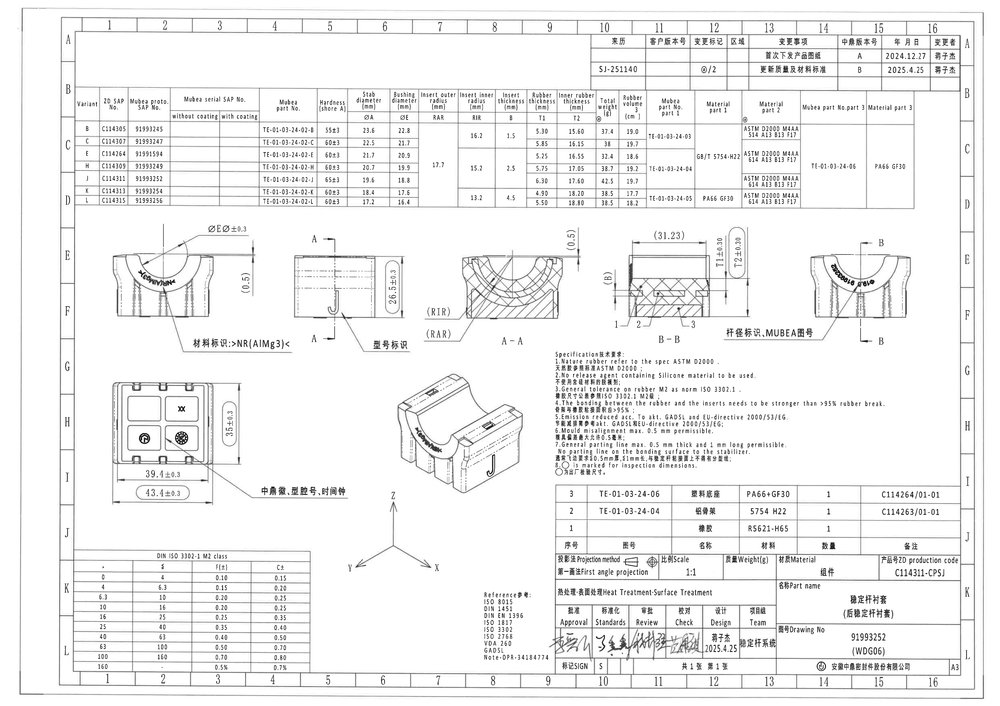

| 提取项 | 原图数值或文本 | 含义说明 |
|---|---|---|
| PDF 页数 | 1 | 单页 A3 工程图。 |
| 整页 PNG | `outputs/20C114311_assets/images/page_1.png` | 先将 PDF 渲染为整页 PNG 后再裁切。 |
| 页面像素 | 4959 x 3505 | 所有 bbox 均为该 PNG 坐标系下 `[x1, y1, x2, y2]`。 |

边界归属说明：整页图作为全局参考，不参与单个加工视图尺寸归属。

## object_1 - 上方 Variant 参数/材料总表

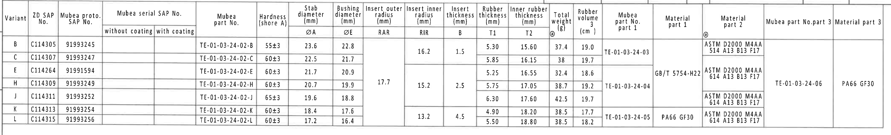

原图位置/视图名称：页面上方 B-D 区域，Variant 参数/材料总表。bbox `[360, 430, 4570, 1070]`。

| Variant | ZD SAP No. | Mubea proto. SAP No. | Mubea serial SAP No. without coating | Mubea serial SAP No. with coating | Mubea part No. | Hardness (shore A) | Stab diameter ØA (mm) | Bushing diameter ØE (mm) | Insert outer radius RAR (mm) | Insert inner radius RIR (mm) | Insert thickness B (mm) | Rubber thickness T1 (mm) | Inner rubber thickness T2 (mm) | Total weight (g) | Rubber volume (cm³) | Mubea part No. part 1 | Material part 1 | Material part 2 | Mubea part No.part 3 | Material part 3 |
|---|---|---|---|---|---|---|---:|---:|---:|---:|---:|---:|---:|---:|---:|---|---|---|---|---|
| B | C114305 | 91993245 |  |  | TE-01-03-24-02-B | 55±3 | 23.6 | 22.8 |  | 16.2 | 1.5 | 5.30 | 15.60 | 37.4 | 19.0 | TE-01-03-24-03 |  | ASTM D2000 M4AA 514 A13 B13 F17 |  |  |
| C | C114307 | 91993247 |  |  | TE-01-03-24-02-C | 60±3 | 22.5 | 21.7 |  | 16.2 | 1.5 | 5.85 | 16.15 | 38 | 19.7 | TE-01-03-24-03 |  | ASTM D2000 M4AA 514 A13 B13 F17 |  |  |
| E | C114264 | 91991594 |  |  | TE-01-03-24-02-E | 60±3 | 21.7 | 20.9 | 17.7 |  |  | 5.25 | 16.55 | 32.4 | 18.6 |  | GB/T 5754-H22 | ASTM D2000 M4AA 614 A13 B13 F17 |  |  |
| H | C114309 | 91993249 |  |  | TE-01-03-24-02-H | 60±3 | 20.7 | 19.9 | 17.7 | 15.2 | 2.5 | 5.75 | 17.05 | 38.7 | 19.2 | TE-01-03-24-04 | GB/T 5754-H22 | ASTM D2000 M4AA 614 A13 B13 F17 | TE-01-03-24-06 | PA66 GF30 |
| J | C114311 | 91993252 |  |  | TE-01-03-24-02-J | 65±3 | 19.6 | 18.8 | 17.7 | 15.2 | 2.5 | 6.30 | 17.60 | 42.5 | 19.7 | TE-01-03-24-04 | GB/T 5754-H22 | ASTM D2000 M4AA 614 A13 B13 F17 | TE-01-03-24-06 | PA66 GF30 |
| K | C114313 | 91993254 |  |  | TE-01-03-24-02-K | 60±3 | 18.4 | 17.6 |  | 13.2 | 4.5 | 4.90 | 18.20 | 38.5 | 17.7 | TE-01-03-24-05 | PA66 GF30 | ASTM D2000 M4AA 614 A13 B13 F17 |  |  |
| L | C114315 | 91993256 |  |  | TE-01-03-24-02-L | 60±3 | 17.2 | 16.4 |  | 13.2 | 4.5 | 5.50 | 18.80 | 38.5 | 18.2 | TE-01-03-24-05 | PA66 GF30 | ASTM D2000 M4AA 614 A13 B13 F17 |  |  |

| 提取项 | 原图数值或文本 | 含义说明 |
|---|---|---|
| `ØA` | Stab diameter (mm) | 稳定杆直径，参数表每个 Variant 一行。 |
| `ØE` | Bushing diameter (mm) | 衬套/孔径相关直径，和主视图 `ØEØ ±0.3` 呼应。 |
| `RAR` | Insert outer radius | 插入件外半径，和 A-A 剖面 `(RAR)` 标注对应。 |
| `RIR` | Insert inner radius | 插入件内半径，和 A-A 剖面 `(RIR)` 标注对应。 |
| `B` | Insert thickness | 插入件厚度，和 B-B 剖面 `(B)` 标注对应。 |
| `T1` | Rubber thickness | 橡胶厚度，和 B-B 剖面 `T1±0.30` 对应。 |
| `T2` | Inner rubber thickness | 内橡胶厚度，和 B-B 剖面 `T2±0.30` 对应。 |

边界归属说明：本表裁切完整包含表头、所有 7 行 Variant 和右侧材料列；上方图框坐标线不作为表格内容提取。合并单元格按原图纵向覆盖关系记录，空白单元格保持空白。

## object_2 - 右上角变更履历表

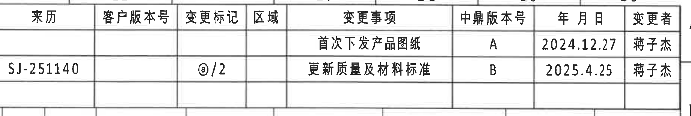

原图位置/视图名称：页面右上 A-B 区域，修订/变更履历。bbox `[2950, 160, 4790, 470]`。

| 来历 | 客户版本号 | 变更标记 | 区域 | 变更事项 | 中鼎版本号 | 年月日 | 变更者 |
|---|---|---|---|---|---|---|---|
|  |  |  |  | 首次下发产品图纸 | A | 2024.12.27 | 蒋子杰 |
| SJ-251140 |  | @/2 |  | 更新质量及材料标准 | B | 2025.4.25 | 蒋子杰 |

| 提取项 | 原图数值或文本 | 含义说明 |
|---|---|---|
| 中鼎版本号 A | 首次下发产品图纸 | 初版下发记录。 |
| 中鼎版本号 B | 更新质量及材料标准 | 当前修订记录，来源 `SJ-251140`，变更标记 `@/2`。 |

边界归属说明：裁切包含完整表格外框、表头和两条变更记录；不包含下方参数总表。

## object_3 - 左上主视图/正面加工视图

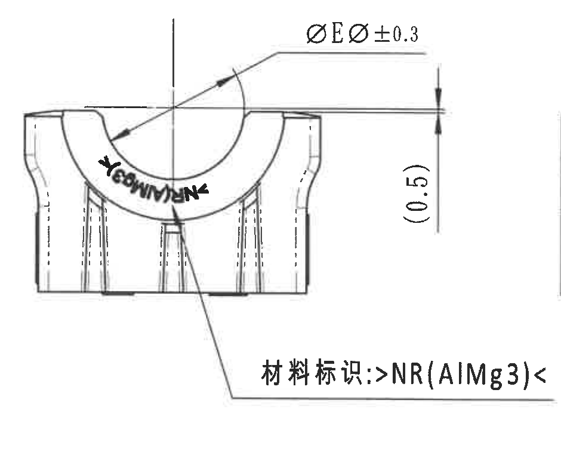

原图位置/视图名称：页面左中 E-F 区域，左上主视图。bbox `[520, 1080, 1460, 1840]`。

| 提取项 | 原图数值或文本 | 含义说明 |
|---|---|---|
| 直径尺寸 | `ØEØ ±0.3` | 斜向引出到上方半圆/孔口处，表示 ØE 相关直径尺寸，公差 ±0.3。 |
| 参考尺寸 | `(0.5)` | 括号内参考尺寸，位于右侧竖向小间距处，表示该局部间隙/台阶高度参考值。 |
| 材料标识 | `材料标识:>NR(AIMg3)<` | 指向正面弧面位置，说明该处模刻/标注天然橡胶材料识别文本。 |
| 弧面文字 | 可见 Mubea/字符标识 | 弧面上有黑色字符，用于产品/品牌识别。 |

边界归属说明：只提取本主视图中的 `ØEØ ±0.3`、`(0.5)` 和材料标识；右侧侧视图及其 A-A 剖切符号不归入本对象。

## object_4 - 中左侧视图/带 A-A 剖切位置

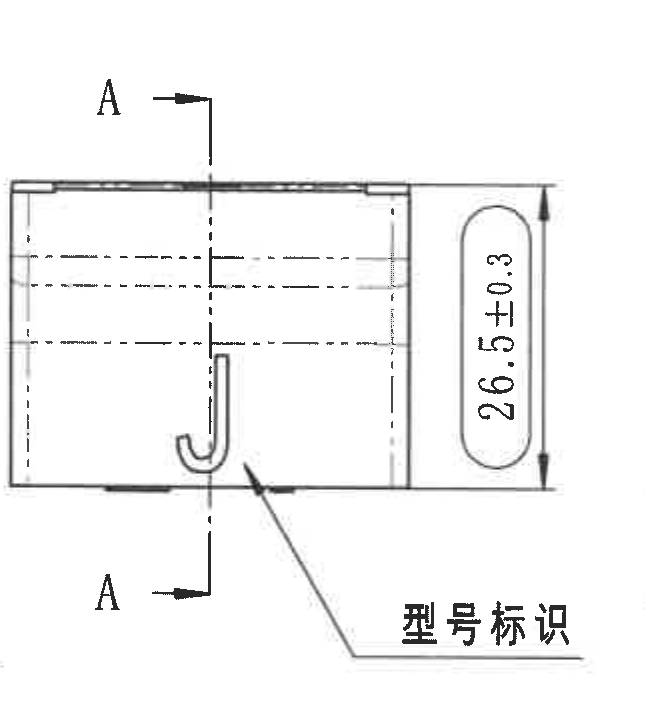

原图位置/视图名称：页面中左 E-F 区域，侧视图。bbox `[1450, 1088, 2095, 1808]`。

| 提取项 | 原图数值或文本 | 含义说明 |
|---|---|---|
| 高度/厚度方向尺寸 | `26.5±0.3` | 右侧竖向尺寸线，表示该侧视图总体高度/厚度方向控制尺寸。 |
| 剖切标识 | `A`、`A` 和剖切箭头 | 指示 A-A 剖面取剖位置。 |
| 标识说明 | `型号标识` | 引线指向侧面 J 形区域，说明型号标识位置。 |

边界归属说明：本对象只包括侧视图、`26.5±0.3` 和 A-A 剖切符号；A-A 剖面中的 RIR/RAR 标注不归入本对象。

## object_5 - A-A 剖面视图

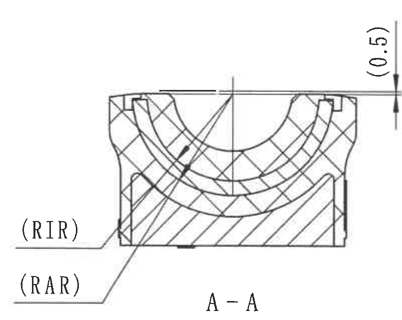

原图位置/视图名称：页面中部 E-F 区域，A-A 剖面。bbox `[2075, 1088, 2880, 1728]`。

| 提取项 | 原图数值或文本 | 含义说明 |
|---|---|---|
| 参考尺寸 | `(0.5)` | 括号内参考尺寸，位于剖面右上方竖向尺寸处，表示顶面附近间隙/台阶高度参考值。 |
| 内半径标注 | `(RIR)` | 插入件内半径标识，和参数表 `Insert inner radius RIR` 列对应。 |
| 外半径标注 | `(RAR)` | 插入件外半径标识，和参数表 `Insert outer radius RAR` 列对应。 |
| 剖面名称 | `A-A` | 对应侧视图中的 A-A 剖切线。 |

边界归属说明：本对象只提取剖面阴影、RIR/RAR 引出线、`(0.5)` 和 A-A 标题；不提取侧视图 `26.5±0.3`，不提取下方 NOTES。

## object_6 - B-B 剖面视图

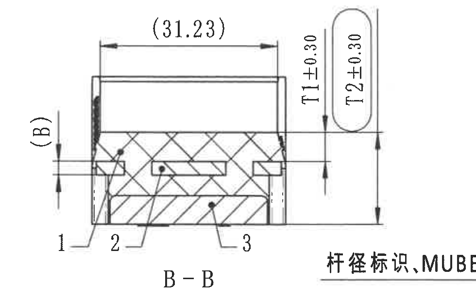

原图位置/视图名称：页面中右 E-F 区域，B-B 剖面。bbox `[2930, 1110, 3910, 1730]`。

| 提取项 | 原图数值或文本 | 含义说明 |
|---|---|---|
| 参考宽度 | `(31.23)` | 括号内参考尺寸，位于剖面上方横向尺寸线，表示剖面参考宽度。 |
| 橡胶厚度 | `T1±0.30` | 右侧竖向尺寸，和参数表 Rubber thickness `T1` 对应。 |
| 内橡胶厚度 | `T2±0.30` | 右侧框内竖向尺寸，和参数表 Inner rubber thickness `T2` 对应。 |
| 参考厚度 | `(B)` | 左侧括号标注，和参数表 Insert thickness `B` 对应。 |
| 序号 | `1`, `2`, `3` | 分别指向剖面中的材料/零件层，与 BOM 序号 1、2、3 对应。 |
| 剖面名称 | `B-B` | 对应右侧主视图中的 B-B 剖切线。 |

边界归属说明：本对象只提取 B-B 剖面自身尺寸、剖面序号和 B-B 标题；右侧主视图的 B 剖切符号及“杆径标识,MUBEA图号”不归入本对象。

## object_7 - 右侧主视图/带 B-B 剖切位置

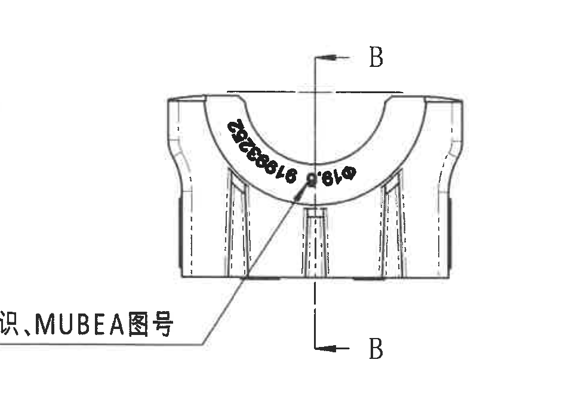

原图位置/视图名称：页面右中 E-F 区域，右侧主视图。bbox `[3740, 1110, 4720, 1810]`。

| 提取项 | 原图数值或文本 | 含义说明 |
|---|---|---|
| 剖切标识 | `B`、`B` 和剖切箭头 | 指示 B-B 剖面取剖位置。 |
| 标识说明 | `杆径标识,MUBEA图号` | 引线指向内弧面字符区域，说明杆径标识与 MUBEA 图号标识位置。 |
| 弧面文字 | 可见 Mubea/图号字符 | 弧面上黑色字符用于标识。 |

边界归属说明：“杆径标识,MUBEA图号”的引出文字跨越 B-B 与右主视图之间空白区；为避免带入 B-B 的 `T2±0.30` 尺寸残片，裁切图中左端文字略截，但完整文本依据整页图像归属本对象记录。B-B 剖面尺寸不归入本对象。

## object_8 - 左下底视图/底面加工视图

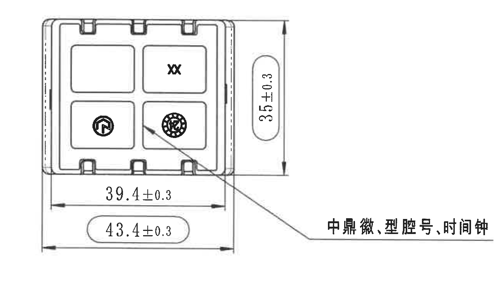

原图位置/视图名称：页面左下 H-I 区域，底视图。bbox `[450, 1850, 1730, 2610]`。

| 提取项 | 原图数值或文本 | 含义说明 |
|---|---|---|
| 竖向总尺寸 | `35±0.3` | 底视图右侧竖向尺寸线。 |
| 横向内尺寸 | `39.4±0.3` | 底部内侧横向尺寸线。 |
| 横向外尺寸 | `43.4±0.3` | 底部外侧横向尺寸线，数值外有圆角框强调。 |
| 底面标识 | `中鼎徽、型腔号、时间钟` | 引线指向底面圆形标识/时间钟区域，说明需布置的底面模刻内容。 |
| 型腔号示意 | `XX` | 位于底面右上小框内，表示型腔号文本位置。 |

边界归属说明：本对象只包括底视图、三处尺寸和底面标识引线；不包含中部等轴测或下方公差表。

## object_9 - 等轴测视图与坐标轴

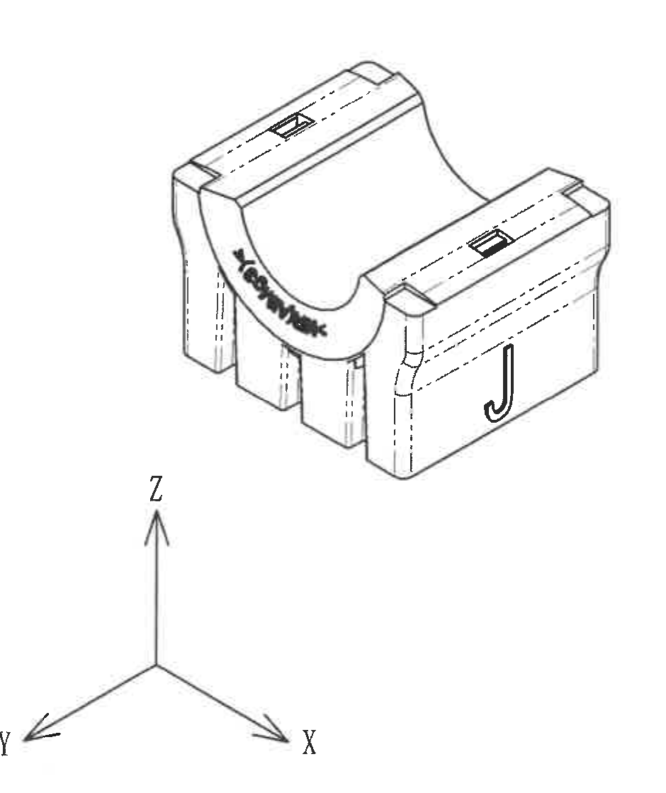

原图位置/视图名称：页面中下 H-J 区域，等轴测视图。bbox `[1730, 1770, 2670, 2890]`。

| 提取项 | 原图数值或文本 | 含义说明 |
|---|---|---|
| 三维外形 | 等轴测零件外观 | 展示 U 形内槽、侧面肋、顶部矩形槽、侧面 J 形标识。 |
| 坐标轴 | `X`, `Y`, `Z` | 表示图纸方向坐标。 |
| 弧面标识 | 可见 Mubea 字符 | 三维视图中显示弧面标识位置。 |

边界归属说明：本对象无独立数值尺寸；只包含等轴测零件和坐标轴，不提取右侧 NOTES 或 BOM 表。

## object_10 - Specification 技术要求 / NOTES

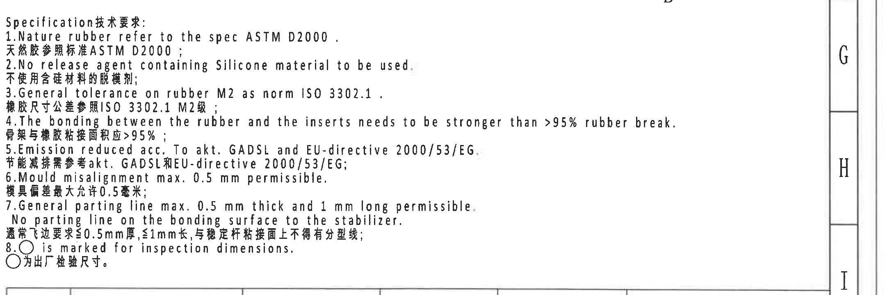

原图位置/视图名称：页面右中 G-I 区域，技术要求。bbox `[2740, 1705, 4920, 2425]`。

| 提取项 | 原图数值或文本 | 含义说明 |
|---|---|---|
| 标题 | `Specification技术要求:` | 技术要求区域标题。 |
| 1 | `Nature rubber refer to the spec ASTM D2000.` / `天然胶参照标准ASTM D2000;` | 天然橡胶材料按 ASTM D2000。 |
| 2 | `No release agent containing silicone material to be used.` / `不使用含硅材料的脱模剂;` | 禁止使用含硅脱模剂。 |
| 3 | `General tolerance on rubber M2 as norm ISO 3302.1.` / `橡胶尺寸公差参照ISO 3302.1 M2级;` | 橡胶通用公差按 ISO 3302.1 M2。 |
| 4 | `The bonding between the rubber and the inserts needs to be stronger than >95% rubber break.` / `骨架与橡胶粘接面积应>95%;` | 橡胶与嵌件粘接强度/破坏面积要求。 |
| 5 | `Emission reduced acc. To akt. GADSL and EU-directive 2000/53/EG.` / `节能减排需参考akt. GADSL和EU-directive 2000/53/EG;` | 排放/环保要求参照 GADSL 和 EU 指令。 |
| 6 | `Mould misalignment max. 0.5 mm permissible.` / `模具偏差最大允许0.5毫米;` | 模具错位最大允许 0.5 mm。 |
| 7 | `General parting line max. 0.5 mm thick and 1 mm long permissible. No parting line on the bonding surface to the stabilizer.` / `通常飞边要求≤0.5mm厚,≤1mm长,与稳定杆粘接面上不得有分型线;` | 飞边/分型线限制。 |
| 8 | `○ is marked for inspection dimensions.` / `○为出厂检验尺寸。` | 圆圈标出的尺寸为检验尺寸。 |

边界归属说明：本对象只提取技术要求文本；上方 B-B/右主视图尺寸和下方 BOM 表不归入 NOTES。裁切底部可见下方表格上边线，不作为 NOTES 内容提取。

## object_11 - DIN ISO 3302-1 M2 class 橡胶一般公差表

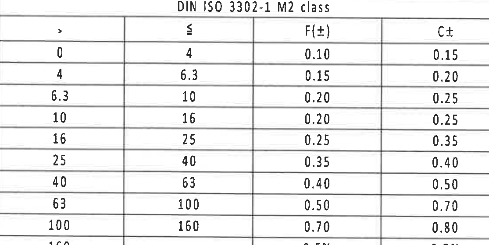

原图位置/视图名称：页面左下 J-L 区域，公差表。bbox `[375, 2745, 1490, 3305]`。

| > | ≤ | F(±) | C± |
|---:|---:|---:|---:|
| 0 | 4 | 0.10 | 0.15 |
| 4 | 6.3 | 0.15 | 0.20 |
| 6.3 | 10 | 0.20 | 0.25 |
| 10 | 16 | 0.20 | 0.25 |
| 16 | 25 | 0.25 | 0.35 |
| 25 | 40 | 0.35 | 0.40 |
| 40 | 63 | 0.40 | 0.50 |
| 63 | 100 | 0.50 | 0.70 |
| 100 | 160 | 0.70 | 0.80 |
| 160 | - | 0.5% | 0.7% |

| 提取项 | 原图数值或文本 | 含义说明 |
|---|---|---|
| 表名 | `DIN ISO 3302-1 M2 class` | 橡胶件一般尺寸公差表。 |
| F(±), C± | 见表 | 两类公差栏，按尺寸区间选择。 |

边界归属说明：仅提取表格本体；不提取左侧图框坐标和底部图框编号。

## object_12 - Reference 参考标准清单

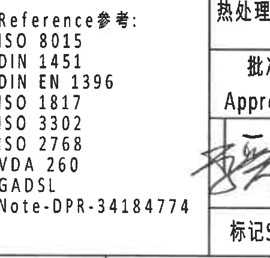

原图位置/视图名称：页面下中 K-L 区域，Reference 参考。bbox `[2405, 2920, 2855, 3350]`。

| 提取项 | 原图数值或文本 | 含义说明 |
|---|---|---|
| 参考标准 | `ISO 8015` | 图纸参考标准之一。 |
| 参考标准 | `DIN 1451` | 字体/制图相关参考。 |
| 参考标准 | `DIN EN 1396` | 材料/标准参考。 |
| 参考标准 | `ISO 1817` | 橡胶性能/液体影响相关标准参考。 |
| 参考标准 | `ISO 3302` | 橡胶产品公差标准参考。 |
| 参考标准 | `ISO 2768` | 一般公差标准参考。 |
| 参考标准 | `VDA 260` | 材料标识/汽车行业参考。 |
| 参考标准 | `GADSL` | 物质申报/限制清单参考。 |
| 参考文件 | `Note-DPR-34184774` | 内部备注/规范编号。 |

边界归属说明：只提取参考标准清单；右侧标题栏签名栏不归入本对象。

## object_13 - BOM/材料明细表

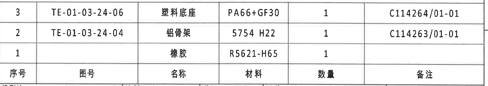

原图位置/视图名称：页面右下 I-J 区域，BOM/材料明细。bbox `[2760, 2400, 4780, 2760]`。

| 序号 | 图号 | 名称 | 材料 | 数量 | 备注 |
|---:|---|---|---|---:|---|
| 3 | TE-01-03-24-06 | 塑料底座 | PA66+GF30 | 1 | C114264/01-01 |
| 2 | TE-01-03-24-04 | 铝骨架 | 5754 H22 | 1 | C114263/01-01 |
| 1 |  | 橡胶 | R5621-H65 | 1 |  |

| 提取项 | 原图数值或文本 | 含义说明 |
|---|---|---|
| 序号 1 | 橡胶 / R5621-H65 | 对应 B-B 剖面序号 1 的橡胶层。 |
| 序号 2 | TE-01-03-24-04 / 铝骨架 / 5754 H22 | 对应 B-B 剖面序号 2 的铝骨架。 |
| 序号 3 | TE-01-03-24-06 / 塑料底座 / PA66+GF30 | 对应 B-B 剖面序号 3 的塑料底座。 |

边界归属说明：本对象只提取 BOM 明细表；下方投影法、比例、标题栏不归入本对象。

## object_14 - 右下标题栏

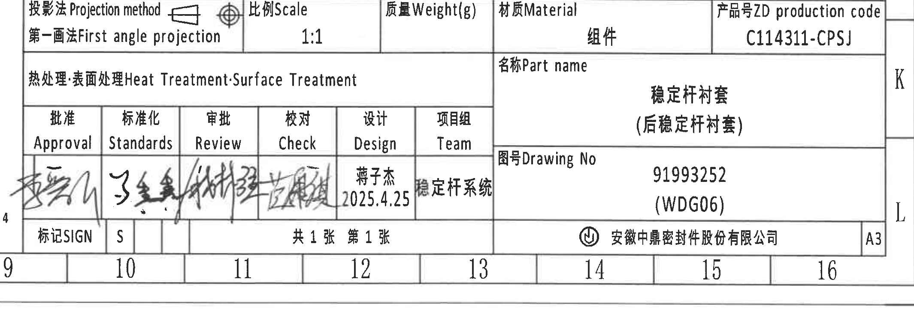

原图位置/视图名称：页面右下 J-L 区域，标题栏。bbox `[2700, 2755, 4830, 3505]`。

| 字段 | 原图数值或文本 | 含义说明 |
|---|---|---|
| 投影法 Projection method | 第一画法 First angle projection | 第一角法投影。 |
| 比例 Scale | 1:1 | 图纸比例。 |
| 质量 Weight(g) |  | 未填写。 |
| 材质 Material | 组件 | 总成/组件材质栏。 |
| 产品号 ZD production code | C114311-CPSJ | 产品号。 |
| 热处理·表面处理 Heat Treatment·Surface Treatment |  | 未填写。 |
| 名称 Part name | 稳定杆衬套（后稳定杆衬套） | 零件/组件名称。 |
| 图号 Drawing No | 91993252 (WDG06) | 图纸编号。 |
| 批准 Approval | 签名 | 签署栏。 |
| 标准化 Standards | 签名 | 签署栏。 |
| 审批 Review | 签名 | 签署栏。 |
| 校对 Check | 签名 | 签署栏。 |
| 设计 Design | 蒋子杰 2025.4.25 | 设计人员和日期。 |
| 项目组 Team | 稳定杆系统 | 项目组。 |
| 标记 SIGN | S | 标记栏。 |
| 张数 | 共1张 第1张 | 页数信息。 |
| 公司 | 安徽中鼎密封件股份有限公司 | 出图公司。 |
| 图幅 | A3 | 图纸幅面。 |

边界归属说明：本对象提取标题栏字段、签署栏和图幅/公司信息；上方 BOM 明细表不归入本对象。裁切左侧可见少量图框坐标，不作为标题栏业务内容提取。

## 裁切检查记录

| 对象 | 检查结论 | 边界与重裁记录 |
|---|---|---|
| page_1 | 完整 | 整页 PNG 渲染完整，尺寸 4959 x 3505。 |
| object_1 | 完整 | 初裁左/右边缘表头不完整，已重裁；最终包含完整参数表表头、7 行和右侧材料列。 |
| object_2 | 完整 | 包含完整变更履历表头和两条记录，无下方参数表内容。 |
| object_3 | 完整 | 初裁材料标识右端被截且带入侧视图，已重裁；最终保留 `>NR(AIMg3)<` 和尺寸线完整。 |
| object_4 | 完整 | 初裁右侧带入 A-A 标注、左下带入主视图残字，已重裁；最终只保留侧视图、`26.5±0.3` 和 A-A 剖切符号。 |
| object_5 | 完整 | 初裁 RAR 下端被截并带入 NOTES，已重裁；最终 RIR/RAR、`(0.5)` 和 A-A 标题完整。 |
| object_6 | 完整 | 初裁左侧序号/引线偏紧且右下混入相邻说明，已重裁；最终 B-B 剖面尺寸、序号和标题完整。 |
| object_7 | 可用，已记录取舍 | 为避免带入 B-B 的 `T2±0.30` 尺寸残片，裁切图中“杆径标识,MUBEA图号”左端略截；完整文字依据整页图像写入本对象。 |
| object_8 | 完整 | 包含 `35±0.3`、`39.4±0.3`、`43.4±0.3` 和底面标识引线完整，无相邻视图混入。 |
| object_9 | 完整 | 初裁混入 NOTES/BOM，已重裁；最终只含等轴测图和 X/Y/Z 坐标轴。 |
| object_10 | 完整 | 初裁 NOTES 左/右文字边缘偏紧，已重裁加宽；最终 1-8 条技术要求完整。底部仅可见下方表格边线，不提取。 |
| object_11 | 完整 | 重裁到公差表本体，表名、表头和 10 行数据完整。 |
| object_12 | 完整 | 初裁混入签名栏，已收窄；最终只含 Reference 参考清单。 |
| object_13 | 完整 | 初裁边界偏紧，已重裁；最终包含 BOM 表头和 3 条记录完整。 |
| object_14 | 完整 | 初裁包含 BOM 上部，已重裁到标题栏区域；标题栏字段完整，左侧少量图框坐标不提取。 |
