# 20C114312.pdf 内容识别与裁切提取

整页渲染图：`outputs/20C114312_assets/images/page_1.png`  
页面：1；整页 PNG 尺寸：4959 x 3505 px；图纸旋转已按渲染结果展开。

以下对象按原图从上到下、从左到右的版面顺序记录；尺寸、括号内参考尺寸、符号尺寸、表格字段和边界归属均以裁切图为证据。

## object_1 修订履历表

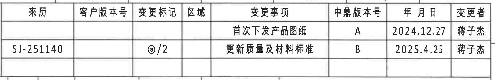

原图位置/视图名称：页 1，上方右侧修订履历表，bbox `[2910, 170, 4760, 470]`。

| 来历 | 客户版本号 | 变更标记 | 区域 | 变更事项 | 中鼎版本号 | 年 月 日 | 变更者 |
|---|---|---|---|---|---|---|---|
|  |  |  |  | 首次下发产品图纸 | A | 2024.12.27 | 蒋子杰 |
| SJ-251140 |  | ⓐ/2 |  | 更新质量及材料标准 | B | 2025.4.25 | 蒋子杰 |

| 提取项 | 原图数值或文本 | 含义说明 |
|---|---|---|
| 修订记录 1 | 首次下发产品图纸；版本 A；2024.12.27；蒋子杰 | 首次发行记录。 |
| 修订记录 2 | SJ-251140；ⓐ/2；更新质量及材料标准；版本 B；2025.4.25；蒋子杰 | 第二条变更记录，变更标记为原图中的带圈字母/符号和 `/2`。 |

边界归属说明：裁切框完整包含修订履历表外框、表头和两条记录；下方参数表的边框未纳入该对象内容。

## object_2 变体参数表

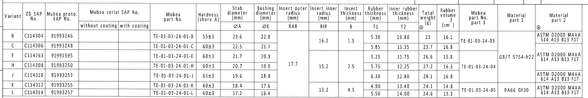

原图位置/视图名称：页 1，上方主参数表，bbox `[340, 430, 3990, 1045]`。

| Variant | ZD SAP No. | Mubea proto. SAP No. | Mubea serial SAP No. without coating | Mubea serial SAP No. with coating | Mubea part No. | Hardness (shore A) | Stab diameter ØA (mm) | Bushing diameter ØE (mm) | Insert outer radius RAR (mm) | Insert inner radius RIR (mm) | Insert thickness B (mm) | Rubber thickness T1 (mm) | Inner rubber thickness T2 (mm) | Total weight ⓐ (g) | Rubber volume (cm³) | Mubea part No. part 1 | Material part 1 | Material part 2 ⓐ |
|---|---|---|---|---|---|---|---|---|---|---|---|---|---|---|---|---|---|---|
| B | C114304 | 91993246 |  |  | TE-01-03-24-01-B | 55±3 | 23.6 | 22.8 |  | 16.2（合并 B-C） | 1.5（合并 B-C） | 5.30 | 10.80 | 23 | 16.1 | TE-01-03-24-03（合并 B-C） |  | ASTM D2000 M4AA 514 A13 B13 F17 |
| C | C114306 | 91993248 |  |  | TE-01-03-24-01-C | 60±3 | 22.5 | 21.7 |  | 16.2（合并 B-C 续） | 1.5（合并 B-C 续） | 5.85 | 11.35 | 23.7 | 16.8 | TE-01-03-24-03（合并 B-C 续） |  | ASTM D2000 M4AA 514 A13 B13 F17（合并/延续区域） |
| E | C114263 | 91991595 |  |  | TE-01-03-24-01-E | 60±3 | 21.7 | 20.9 | 17.7（合并 E-H-J 区域） |  |  | 5.25 | 11.75 | 26.6 | 15.8 |  | GB/T 5754-H22（合并 E-H-J 区域） | ASTM D2000 M4AA 614 A13 B13 F17 |
| H | C114308 | 91993250 |  |  | TE-01-03-24-01-H | 60±3 | 20.7 | 19.9 | 17.7（合并 E-H-J 续） | 15.2（合并 H-J） | 2.5（合并 H-J） | 5.75 | 12.25 | 27.2 | 16.3 | TE-01-03-24-04（合并 H-J） | GB/T 5754-H22（合并 E-H-J 续） | ASTM D2000 M4AA 614 A13 B13 F17 |
| J | C114310 | 91993253 |  |  | TE-01-03-24-01-J | 65±3 | 19.6 | 18.8 | 17.7（合并 E-H-J 续） | 15.2（合并 H-J 续） | 2.5（合并 H-J 续） | 6.30 | 12.80 | 28.1 | 16.8 | TE-01-03-24-04（合并 H-J 续） | GB/T 5754-H22（合并 E-H-J 续） | ASTM D2000 M4AA 614 A13 B13 F17 |
| K | C114312 | 91993255 |  |  | TE-01-03-24-01-K | 60±3 | 18.4 | 17.6 |  | 13.2（合并 K-L） | 4.5（合并 K-L） | 4.90 | 13.40 | 24.1 | 14.8 | TE-01-03-24-05（合并 K-L） | PA66 GF30（合并 K-L） | ASTM D2000 M4AA 614 A13 B13 F17 |
| L | C114314 | 91993257 |  |  | TE-01-03-24-01-L | 60±3 | 17.2 | 16.4 |  | 13.2（合并 K-L 续） | 4.5（合并 K-L 续） | 5.50 | 14.00 | 24.6 | 15.3 | TE-01-03-24-05（合并 K-L 续） | PA66 GF30（合并 K-L 续） | ASTM D2000 M4AA 614 A13 B13 F17 |

| 提取项 | 原图数值或文本 | 含义说明 |
|---|---|---|
| 当前图纸对应变体 | K；ZD SAP No. C114312；Mubea proto. SAP No. 91993255 | 与标题栏产品号/图号对应的当前行。 |
| K 行硬度 | 60±3 shore A | 橡胶硬度公差。 |
| K 行 ØA | 18.4 mm | 稳定杆直径/杆径，对应视图中的 `Ø18.4` 标识。 |
| K 行 ØE | 17.6 mm | 衬套直径符号尺寸，视图中以 `ØE±0.3` 表示。 |
| K-L 合并 RIR | 13.2 mm | 插入件内半径，合并单元格跨 K、L 两行。 |
| K-L 合并 B | 4.5 mm | 插入件厚度，合并单元格跨 K、L 两行。 |
| K 行 T1 | 4.90 mm | 橡胶厚度，剖面 B-B 中以 `T1±0.3` 表示。 |
| K 行 T2 | 13.40 mm | 内橡胶厚度，剖面 B-B 中以 `T2±0.3` 表示。 |
| K 行总重 | 24.1 g | 总重量，表头带 ⓐ 标记。 |
| K 行橡胶体积 | 14.8 cm³ | 橡胶体积。 |
| K-L 合并材料 part 1 | PA66 GF30 | 塑料骨架材料，对应右侧材料标识 `>NR(PA66GF30)<` 中的 PA66GF30。 |
| Material part 2 | ASTM D2000 M4AA 614 A13 B13 F17 | 橡胶材料规范字段。 |

边界归属说明：裁切框完整包含参数表的表头、合并单元格和 B/C/E/H/J/K/L 七行；表格上方的修订履历和下方视图均未作为本对象提取。

## object_3 左上正视图/杆径标识、MUBEA 图号

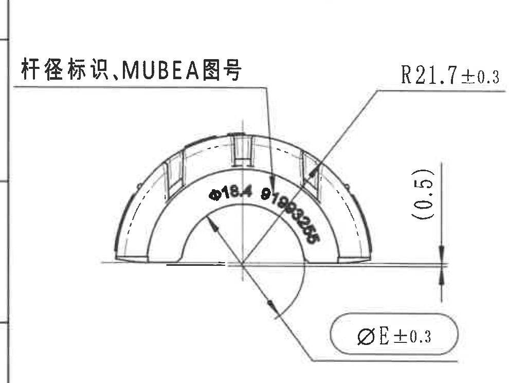

原图位置/视图名称：页 1，中左上半圆正视图，bbox `[340, 1070, 1330, 1815]`。

| 提取项 | 原图数值或文本 | 含义说明 |
|---|---|---|
| 视图文字 | 杆径标识,MUBEA图号 | 引线指向弧面上的模刻标识区域。 |
| 外弧半径 | R21.7±0.3 | 外轮廓弧半径，带 ±0.3 公差。 |
| 参考高度/偏置 | (0.5) | 括号内参考尺寸；右侧竖向箭头标出，表示用于说明的参考偏置/高度，不作为独立控制尺寸。 |
| 直径符号尺寸 | ØE±0.3 | 底部胶囊框内尺寸；对应参数表中的 bushing diameter ØE，当前 K 行数值为 17.6 mm。 |
| 弧面标识 | Ø18.4 91993255（原图弧向文字） | 弧向模刻文字；`Ø18.4` 对应 K 行 ØA，`91993255` 对应 Mubea proto./图号。 |

边界归属说明：裁切框包含完整半圆视图、R21.7 引线、右侧 `(0.5)` 尺寸线和底部 `ØE±0.3` 胶囊框；左侧少量图框分区线仅为页面边界，不归入视图信息。

## object_4 中左侧视图/型号标识

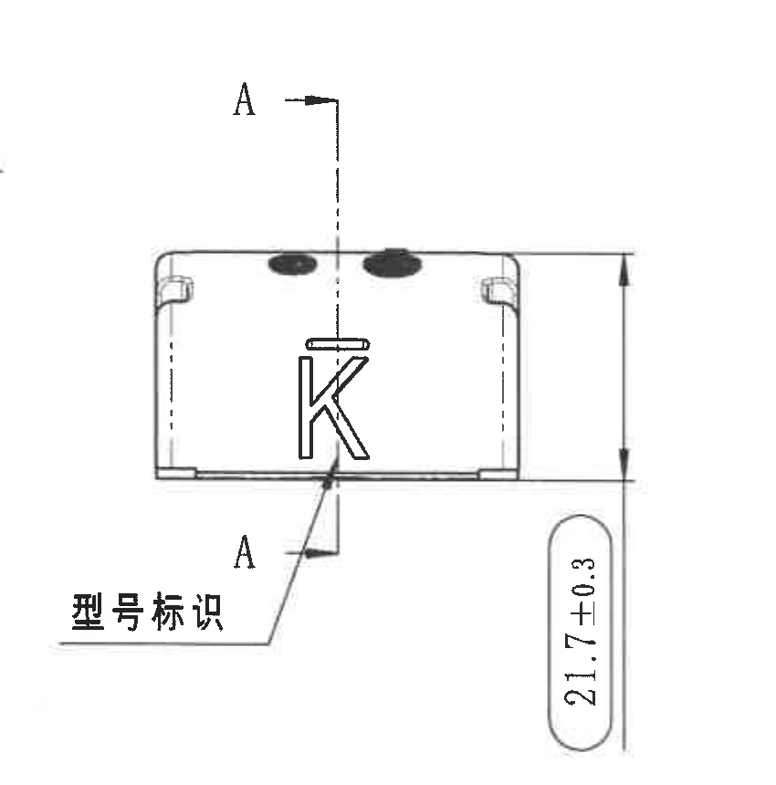

原图位置/视图名称：页 1，中左侧矩形侧视图，bbox `[1320, 1060, 2170, 1920]`。

| 提取项 | 原图数值或文本 | 含义说明 |
|---|---|---|
| 剖切基准 | A / A | 竖向剖切线两端标注 A，指向 A-A 剖面。 |
| 型号标识 | K；型号标识 | 引线指向侧面模刻字母 K。 |
| 总高度/半径关联尺寸 | 21.7±0.3 | 右侧竖向尺寸，完整尺寸线和箭头均在裁切内；用于控制该侧视投影的高度/外弧相关尺寸。 |

边界归属说明：裁切框向下扩展以完整包含 `21.7±0.3` 文字和尺寸线；下方平面视图未纳入该对象。

## object_5 A-A 剖面视图

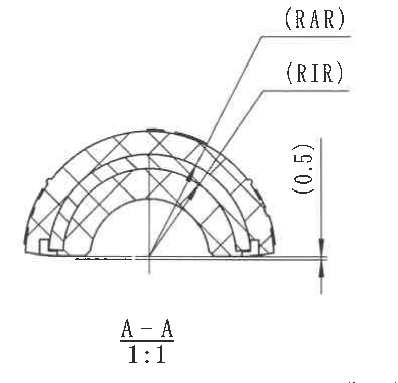

原图位置/视图名称：页 1，中部 A-A 剖面，bbox `[2270, 1080, 3060, 1840]`。

| 提取项 | 原图数值或文本 | 含义说明 |
|---|---|---|
| 视图名称/比例 | A-A；1:1 | 由 object_4 的 A-A 剖切线生成的剖面，比例 1:1。 |
| 外插入半径符号 | (RAR) | 括号内参考符号尺寸；指向剖面外侧弧形插入区域，数值从参数表 RAR 列读取。 |
| 内插入半径符号 | (RIR) | 括号内参考符号尺寸；指向剖面内侧弧形区域，当前 K-L 合并数值为 13.2 mm。 |
| 参考高度/偏置 | (0.5) | 右侧竖向参考尺寸；括号表示参考说明尺寸。 |
| 剖面材料显示 | 交叉剖面线 | 表示剖切实体区域。 |

边界归属说明：裁切框包含完整 A-A 剖面、`(RAR)`、`(RIR)`、`(0.5)`、视图名和比例；下方 NOTES 的字迹不作为本对象内容。

## object_6 B-B 剖面视图

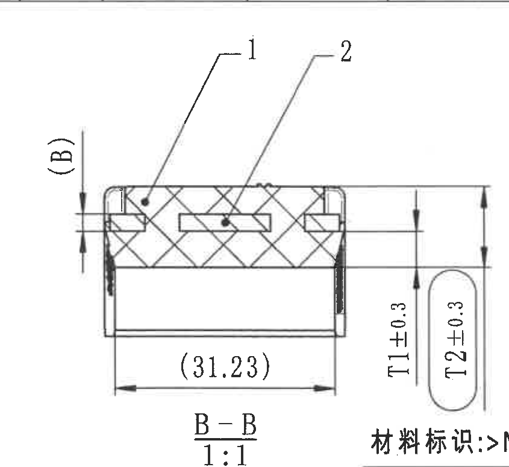

原图位置/视图名称：页 1，中右 B-B 剖面，bbox `[3020, 1040, 3865, 1815]`。

| 提取项 | 原图数值或文本 | 含义说明 |
|---|---|---|
| 视图名称/比例 | B-B；1:1 | 由右侧正视图的 B-B 剖切线生成，比例 1:1。 |
| 参考厚度 | (B) | 左侧括号参考尺寸，指示插入件厚度符号；当前 K-L 合并值为 4.5 mm。 |
| 底部参考长度 | (31.23) | 括号内参考尺寸，水平尺寸线完整；表示该剖面底部长度参考值。 |
| 橡胶厚度 | T1±0.3 | 右侧竖向尺寸，参数表 K 行 T1=4.90 mm；图面给出 ±0.3 公差。 |
| 内橡胶厚度 | T2±0.3 | 右侧胶囊框竖向尺寸，参数表 K 行 T2=13.40 mm；图面给出 ±0.3 公差。 |
| BOM 引出编号 | 1、2 | 剖面引线编号，对应明细表序号 1 橡胶、序号 2 塑料骨架。 |

边界归属说明：裁切框为了完整包含 `(B)`、`T1±0.3` 和 `T2±0.3`，右下角带入相邻材料标识开头；该材料标识归属 object_7，不在本对象提取为 B-B 信息。

## object_7 右侧正视图/材料标识

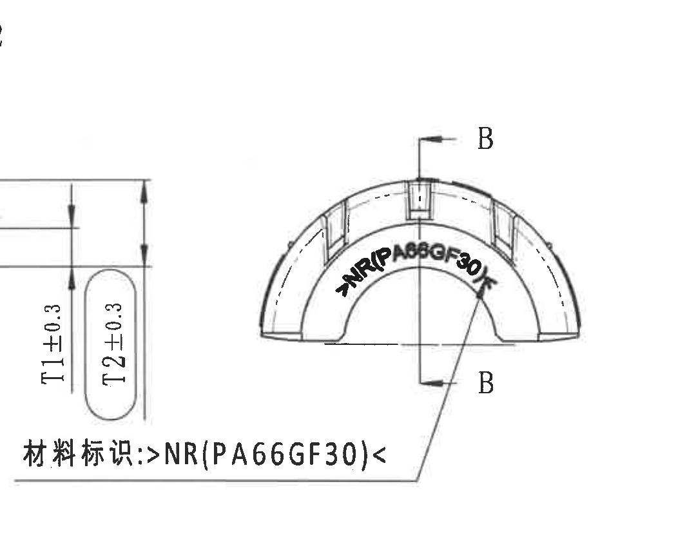

原图位置/视图名称：页 1，右侧半圆正视图，bbox `[3600, 1070, 4680, 1920]`。

| 提取项 | 原图数值或文本 | 含义说明 |
|---|---|---|
| 剖切基准 | B / B | 竖向剖切线两端标注 B，指向 B-B 剖面。 |
| 材料标识引线 | 材料标识:>NR(PA66GF30)< | 引线指向内弧模刻材料标识。 |
| 弧面材料文字 | >NR(PA66GF30)< | 弧向模刻文字；NR 表示天然橡胶，PA66GF30 对应塑料骨架材料。 |

边界归属说明：裁切框向左扩展以完整包含材料标识文字和引线；左侧相邻的 `T1±0.3/T2±0.3` 属于 object_6 的 B-B 剖面，不在本对象提取。

## object_8 左下平面视图

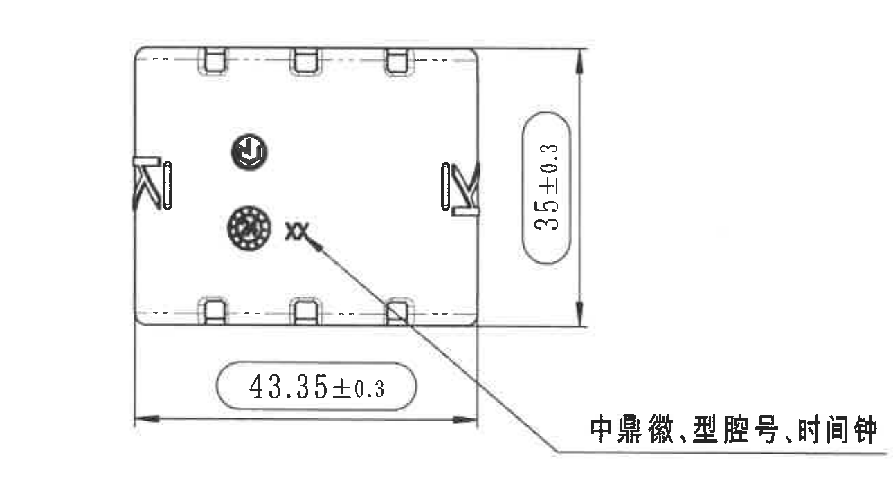

原图位置/视图名称：页 1，左下平面/底视图，bbox `[370, 1850, 1660, 2570]`。

| 提取项 | 原图数值或文本 | 含义说明 |
|---|---|---|
| 垂直外形尺寸 | 35±0.3 | 右侧竖向胶囊框尺寸，完整尺寸线和箭头均包含。 |
| 水平外形尺寸 | 43.35±0.3 | 底部水平胶囊框尺寸，完整尺寸线和箭头均包含。 |
| 标识引线 | 中鼎徽,型腔号,时间钟 | 引线指向底面图中的徽标、型腔号和时间钟/日期钟区域。 |
| 局部文字 | xx | 位于时间钟/型腔标识附近的局部标记。 |

边界归属说明：裁切框仅包含左下平面视图及其两条外形尺寸和标识引线；下方公差表和右侧 NOTES 均未纳入。

## object_9 轴测图与坐标方向

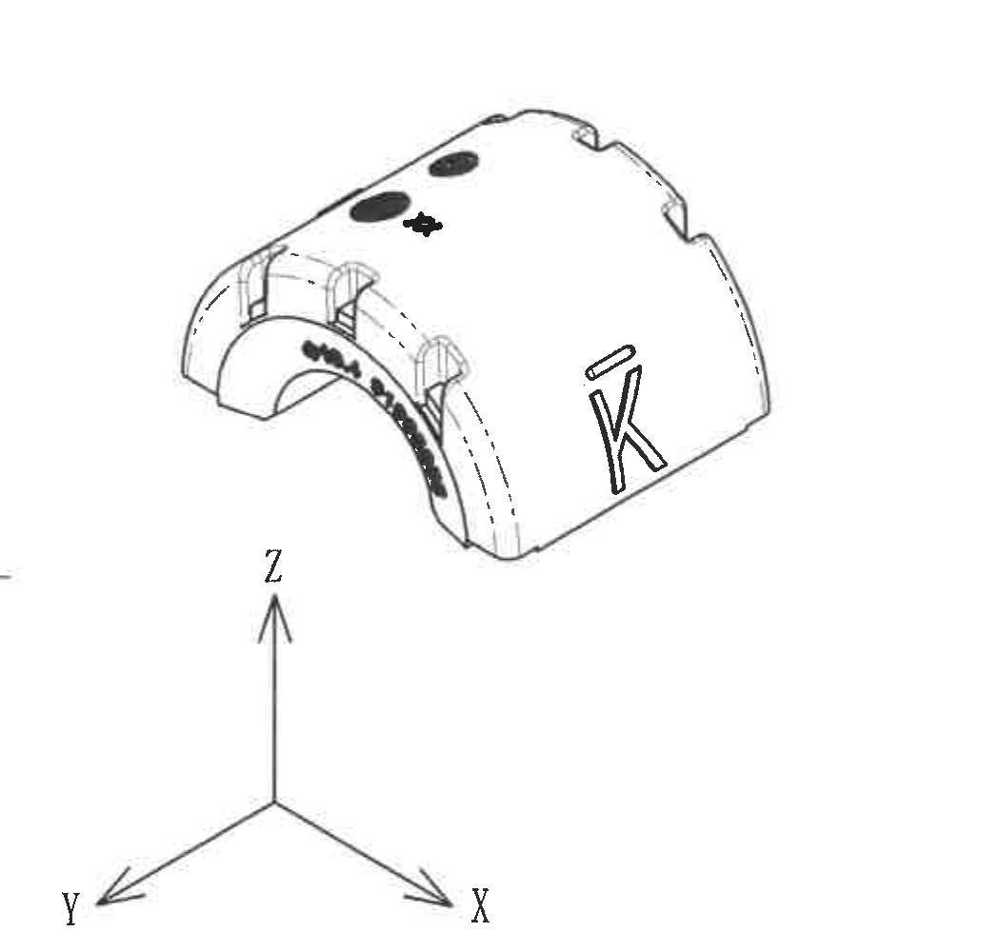

原图位置/视图名称：页 1，中下轴测示意与 X/Y/Z 坐标方向，bbox `[1640, 1900, 2690, 2900]`。

| 提取项 | 原图数值或文本 | 含义说明 |
|---|---|---|
| 轴测外观 | 带 K 标识的三维示意 | 展示产品立体方向和表面标识位置。 |
| 顶部标识 | 两个黑色椭圆及一个星形/十字标记 | 原图为外观标识，不是带星号尺寸。 |
| 坐标方向 | X、Y、Z | 表示轴测图方向。 |
| 弧向文字 | 原图低清，显示为弧面模刻文字 | 与 object_3 的 MUBEA 图号/杆径标识区域对应；此处不另行判定数值尺寸。 |

边界归属说明：裁切框包含轴测图和完整 X/Y/Z 坐标轴；底部参考标准清单另列为 object_14，不归入本对象。

## object_10 NOTES/Specification 技术要求

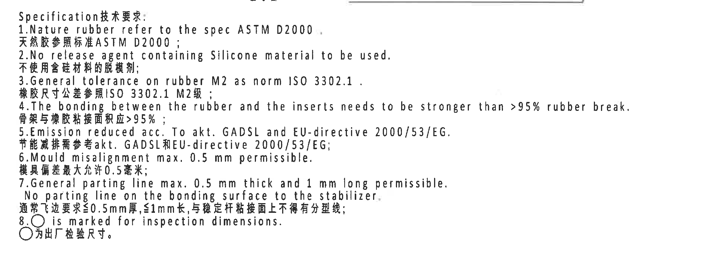

原图位置/视图名称：页 1，中右 NOTES 文本区，bbox `[2690, 1810, 4590, 2490]`。

| 提取项 | 原图数值或文本 | 含义说明 |
|---|---|---|
| 标题 | Specification技术要求: | 技术要求区标题。 |
| 1 | Nature rubber refer to the spec ASTM D2000. / 天然胶参照标准ASTM D2000; | 天然橡胶材料规范。 |
| 2 | No release agent containing Silicone material to be used. / 不使用含硅材料的脱模剂; | 脱模剂禁用含硅材料。 |
| 3 | General tolerance on rubber M2 as norm ISO 3302.1. / 橡胶尺寸公差参照ISO 3302.1 M2级; | 橡胶通用公差等级。 |
| 4 | The bonding between the rubber and the inserts needs to be stronger than >95% rubber break. / 骨架与橡胶粘接面积应>95%; | 橡胶与骨架粘接强度/破坏面积要求。 |
| 5 | Emission reduced acc. To akt. GADSL and EU-directive 2000/53/EG. / 节能减排需参考akt. GADSL和EU-directive 2000/53/EG; | 排放/法规要求。 |
| 6 | Mould misalignment max. 0.5 mm permissible. / 模具偏差最大允许0.5毫米; | 模具错位最大允许值。 |
| 7 | General parting line max. 0.5 mm thick and 1 mm long permissible. No parting line on the bonding surface to the stabilizer. / 通常飞边要求≤0.5mm厚,≤1mm长,与稳定杆粘接面上不得有分型线; | 飞边和分型线限制。 |
| 8 | ○ is marked for inspection dimensions. / ○为出厂检验尺寸。 | 带圆圈标记的尺寸为出厂检验尺寸。 |

边界归属说明：裁切框完整包含 NOTES 1-8 条及中英文文本；顶部少量相邻视图线条不作为 NOTES 内容，下方明细表未纳入。

## object_11 DIN ISO 3302-1 M2 class 公差表

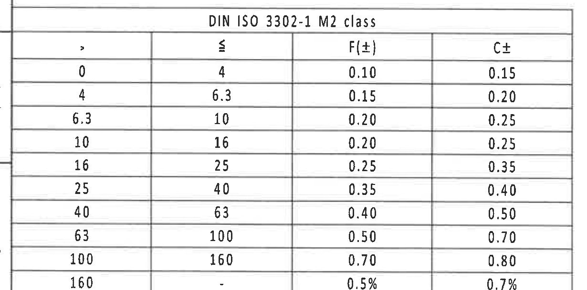

原图位置/视图名称：页 1，左下公差表，bbox `[330, 2730, 1560, 3340]`。

| > | ≤ | F(±) | C± |
|---:|---:|---:|---:|
| 0 | 4 | 0.10 | 0.15 |
| 4 | 6.3 | 0.15 | 0.20 |
| 6.3 | 10 | 0.20 | 0.25 |
| 10 | 16 | 0.20 | 0.25 |
| 16 | 25 | 0.25 | 0.35 |
| 25 | 40 | 0.35 | 0.40 |
| 40 | 63 | 0.40 | 0.50 |
| 63 | 100 | 0.50 | 0.70 |
| 100 | 160 | 0.70 | 0.80 |
| 160 | - | 0.5% | 0.7% |

| 提取项 | 原图数值或文本 | 含义说明 |
|---|---|---|
| 表名 | DIN ISO 3302-1 M2 class | 橡胶尺寸通用公差等级表。 |
| F/C 公差 | F(±)、C± | 表中按尺寸范围给出 F 和 C 两类公差。 |

边界归属说明：裁切框包含完整表名、列头和 10 行公差数据；底部图框坐标数字不作为本对象内容。

## object_12 明细表/BOM

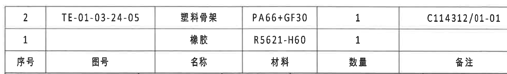

原图位置/视图名称：页 1，右下明细表，bbox `[2725, 2480, 4670, 2765]`。原图表头位于两条数据行下方。

| 序号 | 图号 | 名称 | 材料 | 数量 | 备注 |
|---|---|---|---|---:|---|
| 2 | TE-01-03-24-05 | 塑料骨架 | PA66+GF30 | 1 | C114312/01-01 |
| 1 |  | 橡胶 | R5621-H60 | 1 |  |

| 提取项 | 原图数值或文本 | 含义说明 |
|---|---|---|
| 序号 2 | TE-01-03-24-05；塑料骨架；PA66+GF30；数量 1；备注 C114312/01-01 | 塑料骨架件，对应剖面 B-B 引出编号 2。 |
| 序号 1 | 橡胶；R5621-H60；数量 1 | 橡胶件，对应剖面 B-B 引出编号 1。 |

边界归属说明：裁切框完整包含明细表两条记录和底部表头；其下方标题栏字段另列为 object_13。

## object_13 标题栏

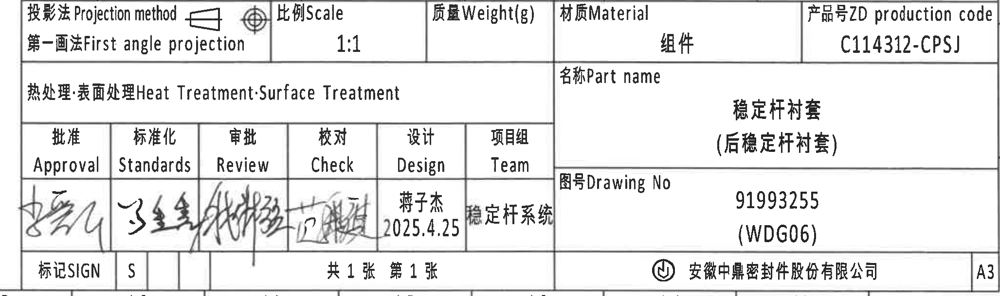

原图位置/视图名称：页 1，右下标题栏，bbox `[2700, 2760, 4755, 3370]`。

| 字段 | 原图数值或文本 | 含义说明 |
|---|---|---|
| 投影法 | 投影法 Projection method；第一画法 First angle projection | 图纸采用第一角投影。 |
| 比例 | 1:1 | 图样比例。 |
| 质量 | Weight(g)；空白 | 标题栏有字段但未填写数值。 |
| 材质 | Material；组件 | 标题栏材质字段为组件。 |
| 产品号 | ZD production code；C114312-CPSJ | 产品代码。 |
| 热处理/表面处理 | Heat Treatment·Surface Treatment；空白 | 标题栏字段未填写具体处理。 |
| 名称 | Part name；稳定杆衬套（后稳定杆衬套） | 零件名称。 |
| 图号 | Drawing No；91993255（WDG06） | 图纸号/版本标识。 |
| 设计 | Design；蒋子杰；2025.4.25 | 设计人和日期。 |
| 项目组 | Team；稳定杆系统 | 项目组。 |
| 张数 | 共1张 第1张 | 总页数和当前页。 |
| 标记 | 标记SIGN；S | 标题栏标记字段。 |
| 公司 | 安徽中鼎密封件股份有限公司 | 出图单位。 |
| 图幅 | A3 | 图纸幅面。 |

| 签审栏 | 原图数值或文本 | 含义说明 |
|---|---|---|
| Approval | 签名/手写，低清不可精确转写 | 批准签名栏。 |
| Standards | 签名/手写，低清不可精确转写 | 标准化签名栏。 |
| Review | 签名/手写，低清不可精确转写 | 审批/评审签名栏。 |
| Check | 签名/手写，低清不可精确转写 | 校对签名栏。 |
| Design | 蒋子杰 2025.4.25 | 设计签名/日期栏。 |
| Team | 稳定杆系统 | 项目组栏。 |

边界归属说明：裁切框完整包含标题栏主体、产品号、图号、公司和 A3 标识；其上方明细表另列为 object_12，底部图框坐标数字不作为标题栏内容。

## object_14 Reference 参考标准清单

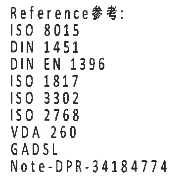

原图位置/视图名称：页 1，下中部 Reference 参考清单，bbox `[2360, 2960, 2730, 3320]`。

| 提取项 | 原图数值或文本 | 含义说明 |
|---|---|---|
| 标题 | Reference参考: | 参考标准清单标题。 |
| 参考标准 | ISO 8015 | 参考标准。 |
| 参考标准 | DIN 1451 | 参考标准。 |
| 参考标准 | DIN EN 1396 | 参考标准。 |
| 参考标准 | ISO 1817 | 参考标准。 |
| 参考标准 | ISO 3302 | 参考标准，与 NOTES 和公差表中的 ISO 3302/3302.1 相关。 |
| 参考标准 | ISO 2768 | 参考标准。 |
| 参考标准 | VDA 260 | 参考标准。 |
| 参考标准 | GADSL | 参考标准，与 NOTES 第 5 条相关。 |
| 参考文件 | Note-DPR-34184774 | 参考文件编号。 |

边界归属说明：裁切框仅保留 Reference 清单；右侧标题栏签审格未纳入该对象。

## 裁切检查记录

| 对象 | 图片路径 | 检查结果 |
|---|---|---|
| 整页 | outputs/20C114312_assets/images/page_1.png | 已由 PDF 渲染为整页 PNG，4959 x 3505 px。 |
| object_1 | outputs/20C114312_assets/images/object_1.png | 修订履历表外框、表头、右侧“变更者”列完整；无截断。 |
| object_2 | outputs/20C114312_assets/images/object_2.png | 参数表表头、所有列、七条变体行和合并单元格完整；无视图混入。 |
| object_3 | outputs/20C114312_assets/images/object_3.png | `R21.7±0.3`、`(0.5)`、`ØE±0.3`、弧向标识完整；左侧仅有图框线，不提取。 |
| object_4 | outputs/20C114312_assets/images/object_4.png | A-A 剖切线、K 型号标识、`21.7±0.3` 竖向尺寸完整；未截断。 |
| object_5 | outputs/20C114312_assets/images/object_5.png | A-A 剖面、`(RAR)`、`(RIR)`、`(0.5)` 和比例完整；无尺寸线截断。 |
| object_6 | outputs/20C114312_assets/images/object_6.png | B-B 剖面、`(B)`、`(31.23)`、`T1±0.3`、`T2±0.3` 完整；右下相邻材料标识仅作为边界混入，不提取。 |
| object_7 | outputs/20C114312_assets/images/object_7.png | B-B 剖切字母和材料标识 `>NR(PA66GF30)<` 完整；左侧 T1/T2 归属 object_6。 |
| object_8 | outputs/20C114312_assets/images/object_8.png | `35±0.3`、`43.35±0.3`、标识引线和文字完整；无邻近表格混入。 |
| object_9 | outputs/20C114312_assets/images/object_9.png | 轴测图和 X/Y/Z 坐标轴完整；底部 Reference 清单另裁。 |
| object_10 | outputs/20C114312_assets/images/object_10.png | NOTES 1-8 条完整，中文末行完整；无明细表内容纳入。 |
| object_11 | outputs/20C114312_assets/images/object_11.png | DIN ISO 3302-1 M2 class 表名、列头、全部 10 行完整；底部坐标行未提取。 |
| object_12 | outputs/20C114312_assets/images/object_12.png | 明细表两条记录、底部表头和外框完整；标题栏另裁。 |
| object_13 | outputs/20C114312_assets/images/object_13.png | 标题栏右端产品号、公司、A3 和签审栏完整；底部图框坐标不提取。 |
| object_14 | outputs/20C114312_assets/images/object_14.png | Reference 清单完整，右侧标题栏签审格未纳入。 |
