# 20C114313 PDF 内容识别与裁切提取

- 输入文件：`input/20C114313.pdf`
- 整页渲染图：`outputs/20C114313_assets/images/page_1.png`，尺寸 4959 x 3505 px。
- 说明：PDF无可提取文本层，本结果基于整页PNG与局部放大图目视识别。未见带星号关键尺寸；未见角度尺寸；弧/半径相关信息以 `RAR`、`RIR` 和弧面标识提取。括号内尺寸按参考尺寸逐项记录。

## object_1 顶部右侧变更履历表

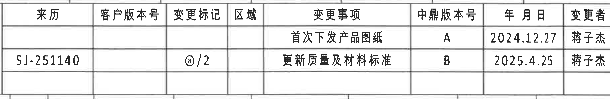

- 原图位置/视图名称：第1页上边框内，图幅列号约10-16、行号A-B。
- bbox：`[2920, 165, 4750, 465]`

### 原表行列还原

| 来历 | 客户版本号 | 变更标记 | 区域 | 变更事项 | 中鼎版本号 | 年月日 | 变更者 |
| --- | --- | --- | --- | --- | --- | --- | --- |
| 空白 | 空白 | 空白 | 空白 | 首次下发产品图纸 | A | 2024.12.27 | 蒋子杰 |
| SJ-251140 | 空白 | @/2 | 空白 | 更新质量及材料标准 | B | 2025.4.25 | 蒋子杰 |

### 提取表格

| 提取项 | 原图数值或文本 | 含义说明 |
| --- | --- | --- |
| 表头 | 来历 / 客户版本号 / 变更标记 / 区域 / 变更事项 / 中鼎版本号 / 年月日 / 变更者 | 变更履历表的原始列名，位于图纸右上角。 |
| 变更记录1 | 首次下发产品图纸；中鼎版本号 A；2024.12.27；变更者 蒋子杰 | 首版图纸发布记录。 |
| 变更记录2 | 来历 SJ-251140；变更标记 @/2；更新质量及材料标准；中鼎版本号 B；2025.4.25；变更者 蒋子杰 | 第二次修订记录，说明质量及材料标准更新。 |

### 边界归属说明

裁切沿表格外框取到完整行列；未包含下方主参数表内容。

## object_2 主参数与变体规格表

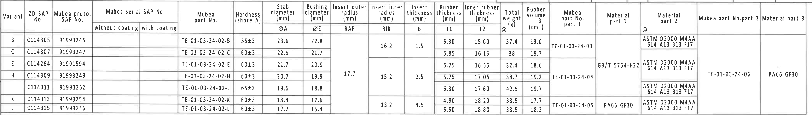

- 原图位置/视图名称：第1页上半部，图幅行号B-D，列号约1-15。
- bbox：`[360, 440, 4560, 1040]`

### 原表行列还原

| Variant | ZD SAP No. | Mubea proto. SAP No. | Mubea serial SAP No. without coating | Mubea serial SAP No. with coating | Mubea part No. | Hardness (shore A) | Stab diameter ØA (mm) | Bushing diameter ØE (mm) | Insert outer radius RAR (mm) | Insert inner radius RIR (mm) | Insert thickness B (mm) | Rubber thickness T1 (mm) | Inner rubber thickness T2 (mm) | Total weight @ (g) | Rubber volume (cm^3) | Mubea part No. part 1 | Material part 1 | Material part 2 @ | Mubea part No. part 3 | Material part 3 |
| --- | --- | --- | --- | --- | --- | --- | --- | --- | --- | --- | --- | --- | --- | --- | --- | --- | --- | --- | --- | --- |
| B | C114305 | 91993245 | 空白 | 空白 | TE-01-03-24-02-B | 55±3 | 23.6 | 22.8 | 17.7 | 16.2 | 1.5 | 5.30 | 15.60 | 37.4 | 19.0 | TE-01-03-24-03 | GB/T 5754-H22 | ASTM D2000 M4AA 514 A13 B13 F17 | TE-01-03-24-06 | PA66 GF30 |
| C | C114307 | 91993247 | 空白 | 空白 | TE-01-03-24-02-C | 60±3 | 22.5 | 21.7 | 17.7 | 16.2 | 1.5 | 5.85 | 16.15 | 38 | 19.7 | TE-01-03-24-03 | GB/T 5754-H22 | ASTM D2000 M4AA 614 A13 B13 F17 | TE-01-03-24-06 | PA66 GF30 |
| E | C114264 | 91991594 | 空白 | 空白 | TE-01-03-24-02-E | 60±3 | 21.7 | 20.9 | 17.7 | 15.2 | 2.5 | 5.25 | 16.55 | 32.4 | 18.6 | TE-01-03-24-04 | GB/T 5754-H22 | ASTM D2000 M4AA 614 A13 B13 F17 | TE-01-03-24-06 | PA66 GF30 |
| H | C114309 | 91993249 | 空白 | 空白 | TE-01-03-24-02-H | 60±3 | 20.7 | 19.9 | 17.7 | 15.2 | 2.5 | 5.75 | 17.05 | 38.7 | 19.2 | TE-01-03-24-04 | GB/T 5754-H22 | ASTM D2000 M4AA 614 A13 B13 F17 | TE-01-03-24-06 | PA66 GF30 |
| J | C114311 | 91993252 | 空白 | 空白 | TE-01-03-24-02-J | 65±3 | 19.6 | 18.8 | 17.7 | 15.2 | 2.5 | 6.30 | 17.60 | 42.5 | 19.7 | TE-01-03-24-04 | GB/T 5754-H22 | ASTM D2000 M4AA 614 A13 B13 F17 | TE-01-03-24-06 | PA66 GF30 |
| K | C114313 | 91993254 | 空白 | 空白 | TE-01-03-24-02-K | 60±3 | 18.4 | 17.6 | 17.7 | 13.2 | 4.5 | 4.90 | 18.20 | 38.5 | 17.7 | TE-01-03-24-05 | GB/T 5754-H22 | ASTM D2000 M4AA 614 A13 B13 F17 | TE-01-03-24-06 | PA66 GF30 |
| L | C114315 | 91993256 | 空白 | 空白 | TE-01-03-24-02-L | 60±3 | 17.2 | 16.4 | 17.7 | 13.2 | 4.5 | 5.50 | 18.80 | 38.5 | 18.2 | TE-01-03-24-05 | GB/T 5754-H22 | ASTM D2000 M4AA 614 A13 B13 F17 | TE-01-03-24-06 | PA66 GF30 |

### 提取表格

| 提取项 | 原图数值或文本 | 含义说明 |
| --- | --- | --- |
| 尺寸列 | ØA、ØE、RAR、RIR、B、T1、T2 | 各加工视图中的字母尺寸在本表给出变体数值。RAR/RIR 为半径，B/T1/T2 为厚度，ØA/ØE 为直径。 |
| 变体K | ZD SAP C114313；Mubea proto. SAP No. 91993254；Mubea part No. TE-01-03-24-02-K | 与标题栏图号 91993254 对应的当前图纸变体。 |
| 合并单元格 | RAR=17.7；part 3=TE-01-03-24-06；Material part 3=PA66 GF30 | 这些值在原表中以纵向合并单元格覆盖多行，表格中按每个变体重复写出以保持机器可读。 |
| 检验/材料标记 | Total weight 标头带 @；Material part 2 标头带 @ | 原表以圈注符号标记相关字段；具体检验尺寸说明见技术要求第8条。 |

### 边界归属说明

裁切包含完整主参数表外框、表头和7行变体记录；下方视图的尺寸线未纳入本对象提取。

## object_3 左上正视图 / 弧面材料标识视图

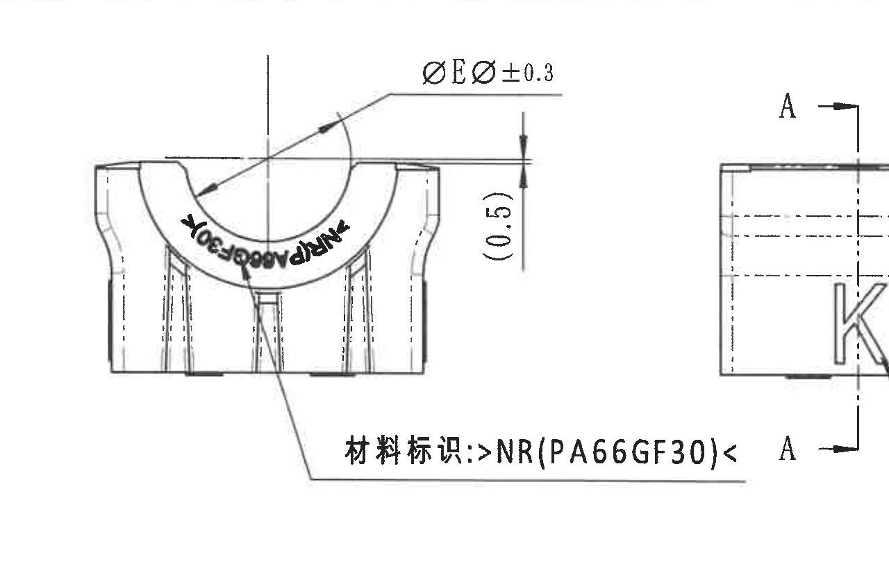

- 原图位置/视图名称：第1页中左部，图幅行号E-F、列号约1-5。
- bbox：`[420, 1040, 1700, 1850]`

### 提取表格

| 提取项 | 原图数值或文本 | 含义说明 |
| --- | --- | --- |
| 直径尺寸 | ØEر0.3 | 上方弧口直径标注，对应主参数表中的 Bushing diameter ØE 列；公差为 ±0.3。 |
| 参考尺寸 | (0.5) | 右侧竖向括号尺寸，为参考尺寸；表示上表面/唇边附近的高度偏置参考，不作为独立公差控制尺寸。 |
| 材料标识 | >NR(PA66GF30)< | 下方引线指向弧面上的材料标识，说明橡胶/塑料材料组合标记。 |
| 弧面文字 | NR(PA66GF30) | 沿内弧印/刻在零件上的材料标识内容，与材料标识引线对应。 |
| 剖切字母 | A（右侧邻接处可见） | 右侧邻近的A-A剖切符号来自相邻侧视图，仅作为边界可见内容，不归入本视图尺寸。 |

### 边界归属说明

为完整保留“材料标识:>NR(PA66GF30)<”引线和文字，裁切右侧不可避免露出侧视图A-A符号局部；本区域只提取左上正视图的ØE、(0.5)和材料标识，不提取邻近侧视图尺寸。

## object_4 侧视图 / A-A剖切定位与型号标识

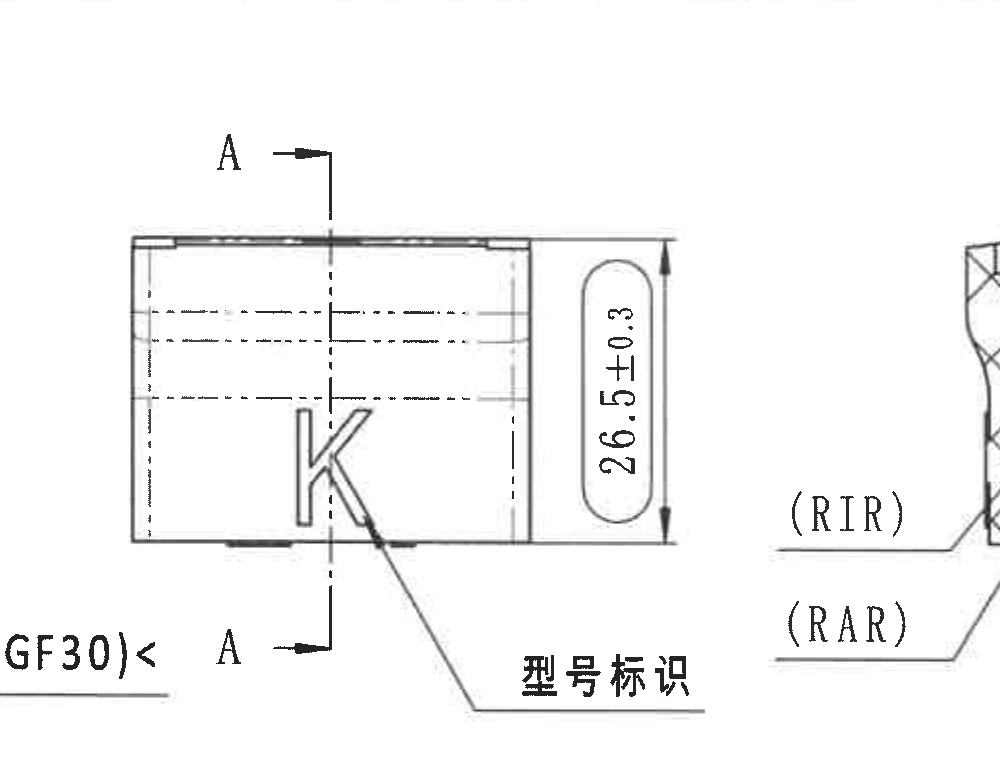

- 原图位置/视图名称：第1页中部偏左，图幅行号E-F、列号约5-7。
- bbox：`[1325, 1040, 2325, 1800]`

### 提取表格

| 提取项 | 原图数值或文本 | 含义说明 |
| --- | --- | --- |
| 总高度尺寸 | 26.5±0.3 | 右侧竖向尺寸，表示该侧视投影总高度/外形高度；公差 ±0.3，尺寸被圆角框标记为检验相关尺寸。 |
| 剖切线 | A-A | 竖向剖切线穿过侧视图中心，两端箭头和字母A指示A-A剖面位置及观察方向。 |
| 型号标识 | 型号标识；K | 引线指向侧面字母K，说明零件型号/变体标识位置；K也对应主参数表变体K。 |
| 隐藏轮廓 | 虚线水平线与内部轮廓 | 表示内部结构/孔槽位置，用于辅助剖面A-A的理解。 |

### 边界归属说明

左边缘残留object_3材料标识尾段，右边缘露出A-A剖视图RIR/RAR引线端；两者均不归入本侧视图。侧视图只提取26.5±0.3、A-A剖切线和型号标识。

## object_5 A-A剖面视图

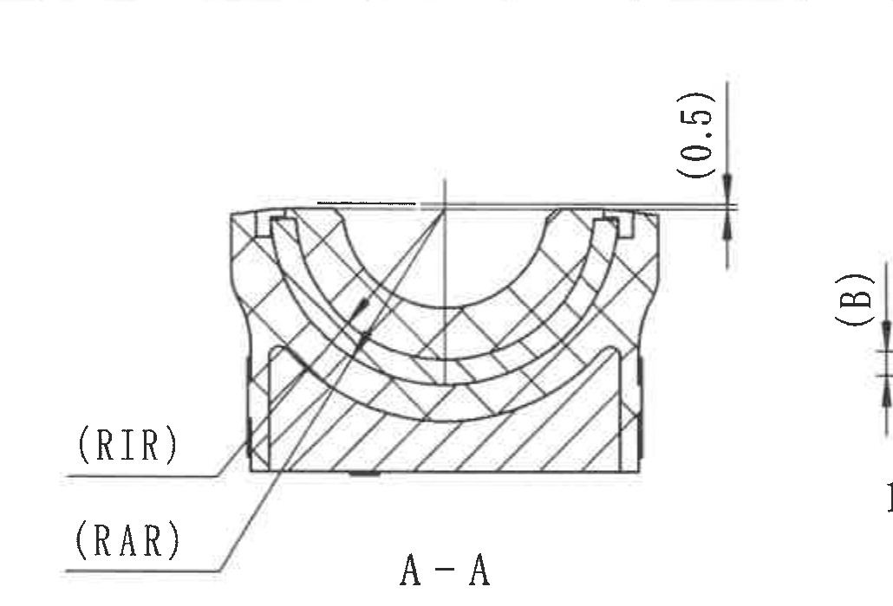

- 原图位置/视图名称：第1页中部，图幅行号E-F、列号约7-9。
- bbox：`[2025, 1040, 3055, 1740]`

### 提取表格

| 提取项 | 原图数值或文本 | 含义说明 |
| --- | --- | --- |
| 剖面名称 | A-A | 位于视图下方，表示该截面来自侧视图中的A-A剖切线。 |
| 参考尺寸 | (0.5) | 剖面顶部右侧竖向参考尺寸；括号表示参考值，用于说明上端面附近偏置。 |
| 半径标注 | RIR | 左下引线指向内侧嵌件半径；具体数值见主参数表 Insert inner radius RIR 列。 |
| 半径标注 | RAR | 左下引线指向外侧嵌件半径；具体数值见主参数表 Insert outer radius RAR 列。 |
| 剖面填充 | 交叉剖面线 | 表示被剖切材料区域及不同构件的截面关系。 |

### 边界归属说明

左侧RIR/RAR引线和文字完整包含；右侧仅露出B-B局部参考标注边缘，不提取为A-A内容。

## object_6 B-B剖面视图及杆径/MUBEA图号标识引线

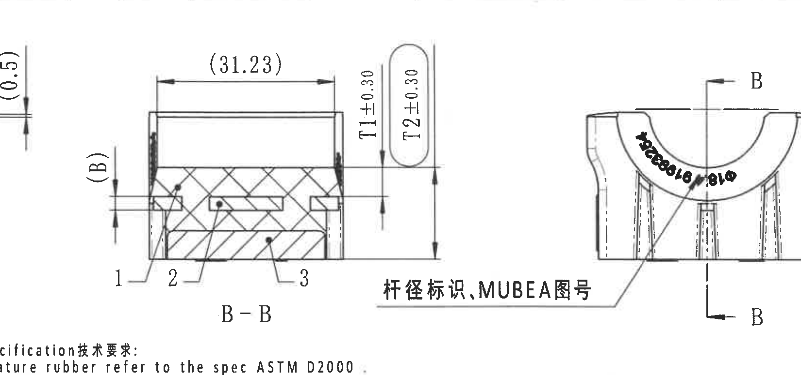

- 原图位置/视图名称：第1页中右部，图幅行号E-F、列号约10-14。
- bbox：`[2810, 1040, 4460, 1815]`

### 提取表格

| 提取项 | 原图数值或文本 | 含义说明 |
| --- | --- | --- |
| 剖面名称 | B-B | 位于剖面下方，表示来自右侧正视图中的B-B剖切线。 |
| 参考长度 | (31.23) | 剖面上方水平括号尺寸，为参考总宽/跨距尺寸；括号表示参考尺寸。 |
| 厚度尺寸 | T1±0.30 | 右侧竖向尺寸，对应主参数表 Rubber thickness T1 列；公差 ±0.30。 |
| 厚度尺寸 | T2±0.30 | 右侧圆角框内竖向尺寸，对应主参数表 Inner rubber thickness T2 列；公差 ±0.30，圆角框表示检验相关尺寸。 |
| 参考厚度 | (B) | 左侧竖向括号标注，对应主参数表 Insert thickness B 列；括号表示该剖面中按表取值的参考标识。 |
| 部件编号 | 1 / 2 / 3 | 剖面引线编号，对应零件清单中的橡胶、塑料骨架、塑料底座。 |
| 标识说明 | 杆径标识,MUBEA图号 | 引线指向右侧正视图弧面上的杆径和MUBEA图号标识。 |

### 边界归属说明

裁切保留B-B剖面、T1/T2/(B)/(31.23)和标识引线。底部有NOTES首行边缘、右侧包含右正视图局部；尺寸归属仅按完整箭头和文字归入B-B，右正视图另在object_7说明。

## object_7 右侧正视图 / B-B剖切与杆径标识视图

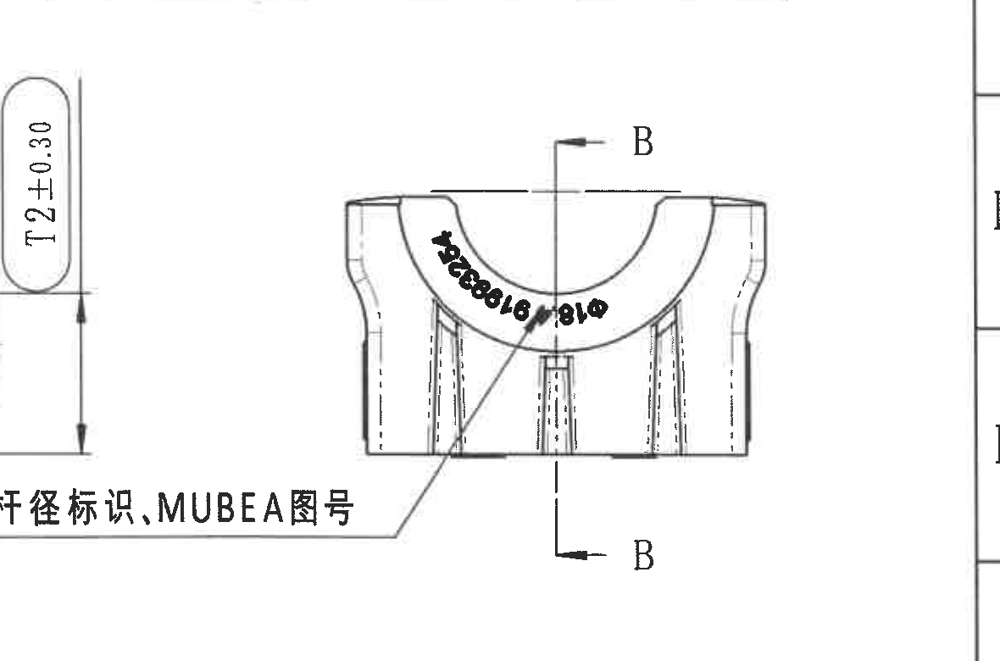

- 原图位置/视图名称：第1页中右部，图幅行号E-F、列号约13-16。
- bbox：`[3610, 1040, 4790, 1820]`

### 提取表格

| 提取项 | 原图数值或文本 | 含义说明 |
| --- | --- | --- |
| 剖切线 | B-B | 竖向剖切线穿过正视图中心，上下箭头和字母B指示B-B剖面位置及观察方向。 |
| 弧面标识 | 杆径标识、MUBEA图号 | 弧面黑色文字为杆径与MUBEA图号标识，文字由object_6中的引线说明指向。 |
| 图号关联 | 91993254 | 弧面标识与标题栏 Drawing No 91993254、主参数表变体K的 Mubea proto. SAP No. 91993254 对应。 |
| 局部轮廓 | 中心筋、两侧竖向虚线轮廓 | 表示正视外形与内部结构位置，用于B-B剖切定位。 |

### 边界归属说明

左侧可见T2±0.30边缘属于B-B剖面，未归入本视图；本对象只提取右侧正视图的B-B剖切标识和弧面杆径/MUBEA图号标识。

## object_8 底视图 / 外形尺寸与标记位置

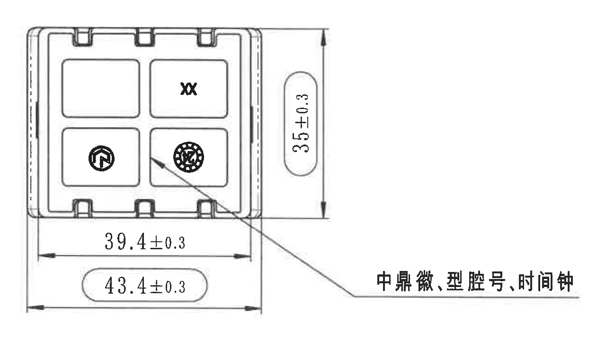

- 原图位置/视图名称：第1页左下中部，图幅行号H-I、列号约1-5。
- bbox：`[500, 1850, 1780, 2585]`

### 提取表格

| 提取项 | 原图数值或文本 | 含义说明 |
| --- | --- | --- |
| 竖向外形尺寸 | 35±0.3 | 右侧竖向总尺寸，公差 ±0.3；圆角框表示检验相关尺寸。 |
| 水平内宽尺寸 | 39.4±0.3 | 下方水平尺寸，表示内侧/主体宽度；公差 ±0.3。 |
| 水平总宽尺寸 | 43.4±0.3 | 最下方圆角框内水平总宽尺寸，公差 ±0.3；圆角框表示检验相关尺寸。 |
| 标记内容 | XX | 右上小格内型腔/编号示意。 |
| 标记内容 | 中鼎徽、型腔号、时间钟 | 右下引线说明底面标记内容：中鼎徽标、型腔号和时间钟。 |
| 内部图形 | 中鼎徽和时间钟圆形符号 | 位于下排两个小格，说明制造追溯标记位置。 |

### 边界归属说明

裁切完整包含35±0.3、39.4±0.3、43.4±0.3的尺寸线、箭头和标注文字；右侧空白用于保留长引线文字，未混入其他视图。

## object_9 轴测图 / 三维外观与坐标方向

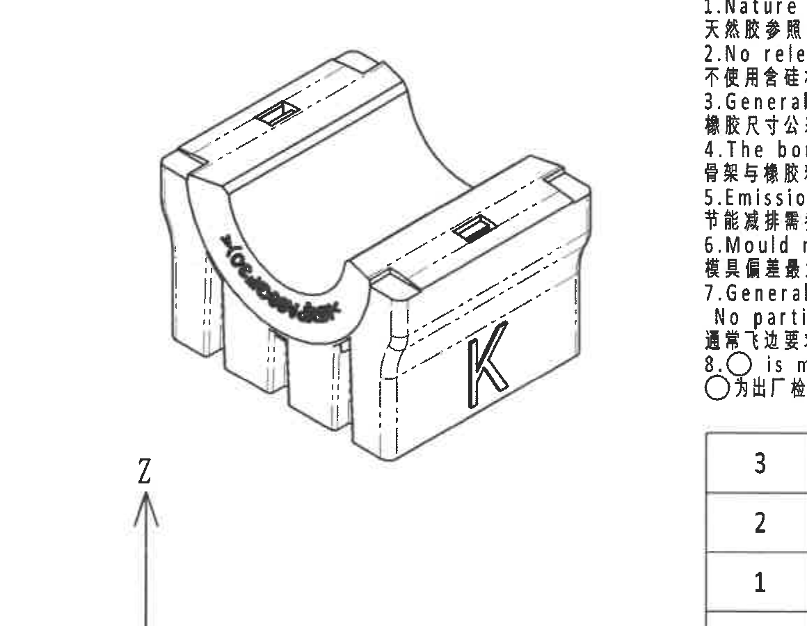

- 原图位置/视图名称：第1页下中部，图幅行号G-I、列号约6-9。
- bbox：`[1740, 1790, 2900, 2690]`

### 提取表格

| 提取项 | 原图数值或文本 | 含义说明 |
| --- | --- | --- |
| 三维外观 | 稳定杆衬套轴测外形 | 展示U形槽、侧壁、顶部小槽和底部支撑结构的三维关系。 |
| 型号标识 | K | 侧面大写K，表示当前变体/型号标识位置。 |
| 弧面标识 | NR(PA66GF30) | 内弧面上可见材料/标识文字，与object_3的材料标识对应。 |
| 坐标方向 | X / Y / Z | 下方坐标箭头说明图纸空间方向；不属于零件尺寸。 |

### 边界归属说明

裁切仅保留轴测图和坐标箭头；右侧技术要求和下方标题栏已分别裁为object_10和object_13，不在本对象提取。

## object_10 Specification 技术要求 / NOTES

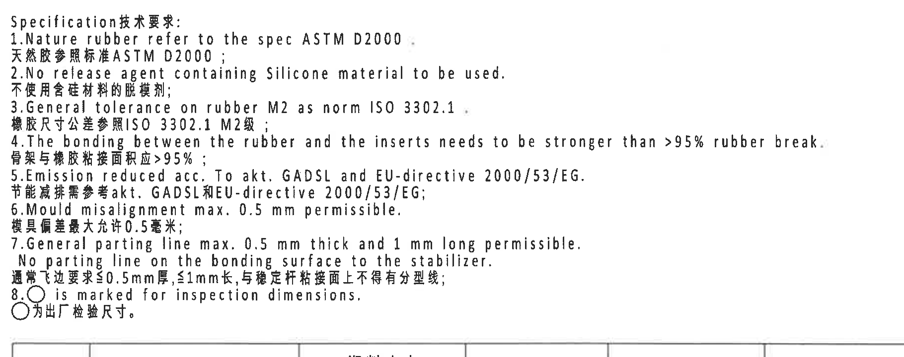

- 原图位置/视图名称：第1页右下中部，B-B剖面下方、标题栏上方。
- bbox：`[2730, 1720, 4550, 2440]`

### 提取表格

| 提取项 | 原图数值或文本 | 含义说明 |
| --- | --- | --- |
| 标题 | Specification 技术要求: | 技术要求区标题。 |
| 1 | Nature rubber refer to the spec ASTM D2000. / 天然胶参照标准ASTM D2000； | 天然胶材料需参照ASTM D2000标准。 |
| 2 | No release agent containing Silicone material to be used. / 不使用含硅材料的脱模剂； | 制造过程中不得使用含硅脱模剂。 |
| 3 | General tolerance on rubber M2 as norm ISO 3302.1. / 橡胶尺寸公差参照ISO 3302.1 M2级； | 橡胶件通用尺寸公差按ISO 3302.1 M2级。 |
| 4 | The bonding between the rubber and the inserts needs to be stronger than >95% rubber break. / 骨架与橡胶粘接面积应>95%； | 橡胶与嵌件粘接要求达到大于95%橡胶破坏。 |
| 5 | Emission reduced acc. To akt. GADSL and EU-directive 2000/53/EG. / 节能减排需参考akt. GADSL和EU-directive 2000/53/EG； | 材料/排放要求按GADSL及EU 2000/53/EG。 |
| 6 | Mould misalignment max. 0.5 mm permissible. / 模具偏差最大允许0.5毫米； | 模具错位最大允许0.5 mm。 |
| 7 | General parting line max. 0.5 mm thick and 1 mm long permissible. No parting line on the bonding surface to the stabilizer. / 通常飞边要求≤0.5mm厚,≤1mm长,与稳定杆粘接面上不得有分型线； | 飞边/分型线控制要求，并禁止稳定杆粘接面出现分型线。 |
| 8 | ○ is marked for inspection dimensions. / ○为出厂检验尺寸。 | 图中圆角框/圈注尺寸为出厂检验尺寸。 |

### 边界归属说明

裁切包含NOTES标题和1-8条完整文字；顶部B-B剖面不在本对象内，底部零件清单/标题栏另行裁切。

## object_11 DIN ISO 3302-1 M2 class 通用公差表

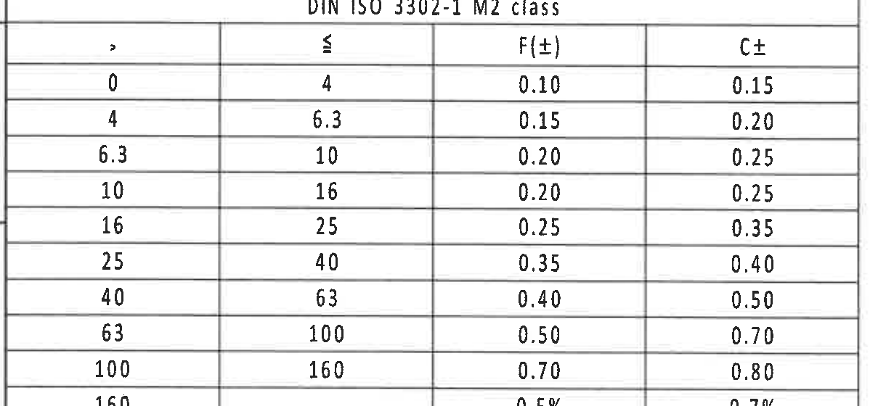

- 原图位置/视图名称：第1页左下角，图幅行号J-L、列号约1-4。
- bbox：`[355, 2760, 1575, 3320]`

### 原表行列还原

| > | ≤ | F(±) | C± |
| --- | --- | --- | --- |
| 0 | 4 | 0.10 | 0.15 |
| 4 | 6.3 | 0.15 | 0.20 |
| 6.3 | 10 | 0.20 | 0.25 |
| 10 | 16 | 0.20 | 0.25 |
| 16 | 25 | 0.25 | 0.35 |
| 25 | 40 | 0.35 | 0.40 |
| 40 | 63 | 0.40 | 0.50 |
| 63 | 100 | 0.50 | 0.70 |
| 100 | 160 | 0.70 | 0.80 |
| 160 | - | 0.5% | 0.7% |

### 提取表格

| 提取项 | 原图数值或文本 | 含义说明 |
| --- | --- | --- |
| 标准 | DIN ISO 3302-1 M2 class | 橡胶件M2级通用尺寸公差表。 |
| 尺寸范围 | 0-160及以上 | 左两列给出大于/小于等于的尺寸区间。 |
| F(±) | 0.10至0.5% | F等级对应的双向公差。 |
| C± | 0.15至0.7% | C等级对应的双向公差。 |

### 边界归属说明

裁切包含完整表格标题、外框和10行公差数据；下方图框列号未作为表格内容提取。

## object_12 零件清单 / BOM表

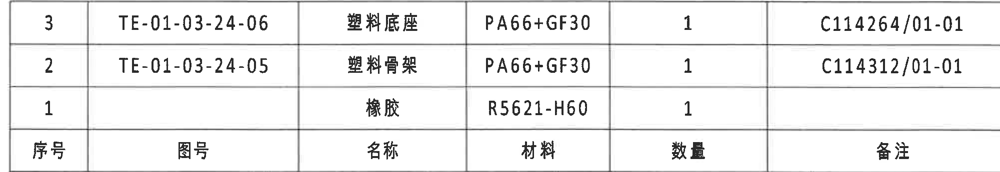

- 原图位置/视图名称：第1页右下部，技术要求下方、标题栏上方。
- bbox：`[2735, 2410, 4735, 2755]`

### 原表行列还原

| 序号 | 图号 | 名称 | 材料 | 数量 | 备注 |
| --- | --- | --- | --- | --- | --- |
| 3 | TE-01-03-24-06 | 塑料底座 | PA66+GF30 | 1 | C114264/01-01 |
| 2 | TE-01-03-24-05 | 塑料骨架 | PA66+GF30 | 1 | C114312/01-01 |
| 1 | 空白 | 橡胶 | R5621-H60 | 1 | 空白 |

### 提取表格

| 提取项 | 原图数值或文本 | 含义说明 |
| --- | --- | --- |
| 表头 | 序号 / 图号 / 名称 / 材料 / 数量 / 备注 | 原表表头位于该清单底行；Markdown表按字段名置顶还原。 |
| 序号1 | 橡胶；材料 R5621-H60；数量 1 | 对应B-B剖面中的编号1。 |
| 序号2 | TE-01-03-24-05；塑料骨架；PA66+GF30；数量 1；备注 C114312/01-01 | 对应B-B剖面中的编号2。 |
| 序号3 | TE-01-03-24-06；塑料底座；PA66+GF30；数量 1；备注 C114264/01-01 | 对应B-B剖面中的编号3。 |

### 边界归属说明

裁切包含清单三行数据和底部表头；下方标题栏从“投影法/Projection method”另裁为object_13。

## object_13 标题栏 / Title block

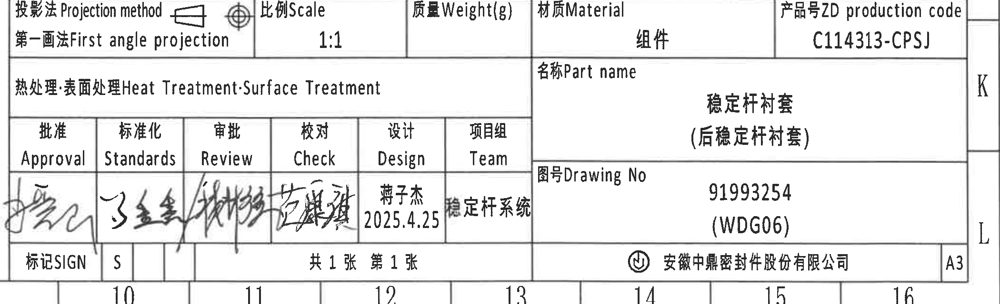

- 原图位置/视图名称：第1页右下角标题栏，图幅列号约10-16、行号J-L。
- bbox：`[2735, 2760, 4835, 3400]`

### 提取表格

| 提取项 | 原图数值或文本 | 含义说明 |
| --- | --- | --- |
| 投影法 | 第一画法 First angle projection | 标题栏左上，含第一角投影符号。 |
| 比例 | 1:1 | 图纸比例。 |
| 质量 Weight(g) | 空白 | 标题栏保留字段，未填写重量。 |
| 材质 Material | 组件 | 材料栏填写组件，表示装配件。 |
| 产品号 ZD production code | C114313-CPSJ | 中鼎产品号/生产代码。 |
| 热处理·表面处理 | 空白 | Heat Treatment·Surface Treatment栏未填写。 |
| 名称 Part name | 稳定杆衬套（后稳定杆衬套） | 零件名称和补充名称。 |
| 图号 Drawing No | 91993254 (WDG06) | 图纸编号及括号内附加编号。 |
| 批准/标准化/审批/校对/设计/项目组 | Approval / Standards / Review / Check / Design / Team | 签署栏；Design栏为蒋子杰 2025.4.25，Team栏为稳定杆系统，其余为手写签名。 |
| 标记 SIGN | S | 标记栏内容。 |
| 页码 | 共1张 第1张 | 总页数与当前页。 |
| 公司 | 安徽中鼎密封件股份有限公司 | 标题栏底部公司名称。 |
| 图幅 | A3 | 右下角图幅规格。 |

### 边界归属说明

裁切从标题栏上边界开始，完整包含投影法、比例、材料、产品号、名称、图号、签署栏、页码、公司和A3图幅；上方零件清单不作为标题栏内容提取。

## object_14 Reference 参考标准列表

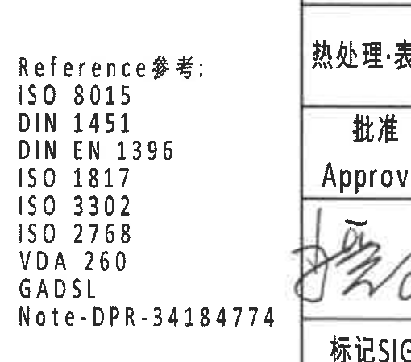

- 原图位置/视图名称：第1页下部中右，标题栏左侧。
- bbox：`[2380, 2875, 2890, 3325]`

### 提取表格

| 提取项 | 原图数值或文本 | 含义说明 |
| --- | --- | --- |
| 标题 | Reference参考: | 参考标准列表标题。 |
| 参考标准 | ISO 8015 | 图纸引用标准。 |
| 参考标准 | DIN 1451 | 图纸引用标准。 |
| 参考标准 | DIN EN 1396 | 图纸引用标准。 |
| 参考标准 | ISO 1817 | 图纸引用标准。 |
| 参考标准 | ISO 3302 | 图纸引用标准。 |
| 参考标准 | ISO 2768 | 图纸引用标准。 |
| 参考标准 | VDA 260 | 图纸引用标准。 |
| 参考标准 | GADSL | 图纸引用清单/材料合规要求。 |
| 参考文件 | Note-DPR-34184774 | 图纸引用备注文件编号。 |

### 边界归属说明

裁切只保留参考标准列表；右侧签字栏已排除，不作为本对象内容。

## 裁切检查记录

| 图片 | 裁切对象 | 检查结果 | 边界/完整性记录 |
| --- | --- | --- | --- |
| page_1.png | 整页渲染 | 完整 | 整页由PDF渲染得到，未裁切；作为所有对象bbox坐标基准。 |
| object_1.png | 顶部右侧变更履历表 | 完整 | 裁切沿表格外框取到完整行列；未包含下方主参数表内容。 |
| object_2.png | 主参数与变体规格表 | 完整 | 裁切包含完整主参数表外框、表头和7行变体记录；下方视图的尺寸线未纳入本对象提取。 |
| object_3.png | 左上正视图 / 弧面材料标识视图 | 完整，含邻近边界说明 | 为完整保留“材料标识:>NR(PA66GF30)<”引线和文字，裁切右侧不可避免露出侧视图A-A符号局部；本区域只提取左上正视图的ØE、(0.5)和材料标识，不提取邻近侧视图尺寸。 |
| object_4.png | 侧视图 / A-A剖切定位与型号标识 | 完整，含邻近边界说明 | 左边缘残留object_3材料标识尾段，右边缘露出A-A剖视图RIR/RAR引线端；两者均不归入本侧视图。侧视图只提取26.5±0.3、A-A剖切线和型号标识。 |
| object_5.png | A-A剖面视图 | 完整，含邻近边界说明 | 左侧RIR/RAR引线和文字完整包含；右侧仅露出B-B局部参考标注边缘，不提取为A-A内容。 |
| object_6.png | B-B剖面视图及杆径/MUBEA图号标识引线 | 完整，含邻近边界说明 | 裁切保留B-B剖面、T1/T2/(B)/(31.23)和标识引线。底部有NOTES首行边缘、右侧包含右正视图局部；尺寸归属仅按完整箭头和文字归入B-B，右正视图另在object_7说明。 |
| object_7.png | 右侧正视图 / B-B剖切与杆径标识视图 | 完整，含邻近边界说明 | 左侧可见T2±0.30边缘属于B-B剖面，未归入本视图；本对象只提取右侧正视图的B-B剖切标识和弧面杆径/MUBEA图号标识。 |
| object_8.png | 底视图 / 外形尺寸与标记位置 | 完整 | 裁切完整包含35±0.3、39.4±0.3、43.4±0.3的尺寸线、箭头和标注文字；右侧空白用于保留长引线文字，未混入其他视图。 |
| object_9.png | 轴测图 / 三维外观与坐标方向 | 完整 | 裁切仅保留轴测图和坐标箭头；右侧技术要求和下方标题栏已分别裁为object_10和object_13，不在本对象提取。 |
| object_10.png | Specification 技术要求 / NOTES | 完整 | 裁切包含NOTES标题和1-8条完整文字；顶部B-B剖面不在本对象内，底部零件清单/标题栏另行裁切。 |
| object_11.png | DIN ISO 3302-1 M2 class 通用公差表 | 完整 | 裁切包含完整表格标题、外框和10行公差数据；下方图框列号未作为表格内容提取。 |
| object_12.png | 零件清单 / BOM表 | 完整 | 裁切包含清单三行数据和底部表头；下方标题栏从“投影法/Projection method”另裁为object_13。 |
| object_13.png | 标题栏 / Title block | 完整，含邻近边界说明 | 裁切从标题栏上边界开始，完整包含投影法、比例、材料、产品号、名称、图号、签署栏、页码、公司和A3图幅；上方零件清单不作为标题栏内容提取。 |
| object_14.png | Reference 参考标准列表 | 完整 | 裁切只保留参考标准列表；右侧签字栏已排除，不作为本对象内容。 |

## 全局归属说明

- object_3、object_4、object_5、object_6、object_7 在原图中横向相邻，部分标注引线接近边界；提取时按完整尺寸线、箭头、标注文字和剖切字母判断归属。
- `(0.5)` 属于左正视图/object_3和A-A剖面/object_5的参考尺寸；`(31.23)`、`(B)` 属于B-B剖面/object_6；均未并入主视图。
- `T1±0.30`、`T2±0.30` 属于B-B剖面/object_6；`T1`、`T2`具体变体数值由主参数表/object_2给出。
- 零件编号1、2、3属于B-B剖面中的构件指引，并与零件清单/object_12逐项对应。