# 20C114314 内容识别与裁切提取

整页 PNG: `outputs/20C114314_assets/images/page_1.png`  
页面像素: 4959 x 3505  
说明: PDF 无可提取文字层，以下内容基于整页 PNG 和局部放大裁切识别。所有 bbox 为整页 PNG 像素坐标 `[x1, y1, x2, y2]`。

## object_1 修订履历表

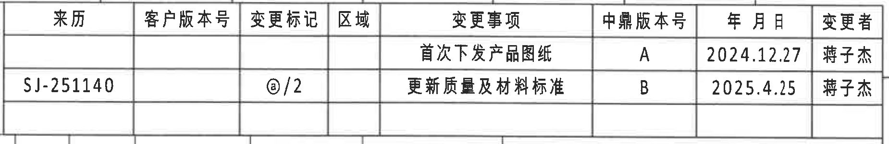

原图位置/视图名称: 上方右侧修订履历表，bbox `[2930, 165, 4780, 465]`。

| 来历 | 客户版本号 | 变更标记 | 区域 | 变更事项 | 中鼎版本号 | 年 月 日 | 变更者 |
|---|---|---|---|---|---|---|---|
|  |  |  |  | 首次下发产品图纸 | A | 2024.12.27 | 蒋子杰 |
| SJ-251140 |  | @/2 |  | 更新质量及材料标准 | B | 2025.4.25 | 蒋子杰 |

| 提取项 | 原图数值或文本 | 含义说明 |
|---|---|---|
| 表格类型 | 修订履历 | 记录图纸版本变更历史。 |
| 第1条变更事项 | 首次下发产品图纸 | 初始发布记录，对应中鼎版本号 A。 |
| 第2条来历 | SJ-251140 | 第二条修订来源/来历编号。 |
| 第2条变更标记 | @/2 | 原图变更标记字段。 |
| 第2条变更事项 | 更新质量及材料标准 | 说明此次修订内容。 |
| 日期 | 2024.12.27; 2025.4.25 | 分别对应 A、B 两个版本记录。 |

边界归属说明: 裁切只覆盖修订履历表，右侧图框字母栏未纳入；空白单元格按原表保留，不补写推断内容。

## object_2 上方 Variant / SAP / 材料参数表

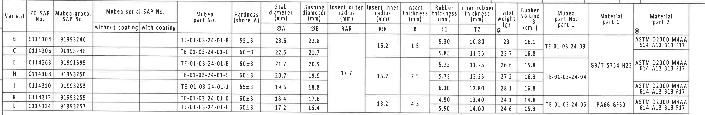

原图位置/视图名称: 上方 B-D 网格参数表，bbox `[360, 430, 4060, 1040]`。

| Variant | ZD SAP No. | Mubea proto. SAP No. | Mubea serial SAP No. without coating | Mubea serial SAP No. with coating | Mubea part No. | Hardness (shore A) | ØA Stab diameter (mm) | ØE Bushing diameter (mm) | RAR Insert outer radius (mm) | RIR Insert inner radius (mm) | B Insert thickness (mm) | T1 Rubber thickness (mm) | T2 Inner rubber thickness (mm) | Total weight @ (g) | Rubber volume (cm^3) | Mubea part No. part 1 | Material part 1 | Material part 2 @ |
|---|---|---|---|---|---|---|---:|---:|---:|---:|---:|---:|---:|---:|---:|---|---|---|
| B | C114304 | 91993246 |  |  | TE-01-03-24-01-B | 55±3 | 23.6 | 22.8 |  | 16.2 | 1.5 | 5.30 | 10.80 | 23 | 16.1 | TE-01-03-24-03 |  | ASTM D2000 M4AA 514 A13 B13 F17 |
| C | C114306 | 91993248 |  |  | TE-01-03-24-01-C | 60±3 | 22.5 | 21.7 |  |  |  | 5.85 | 11.35 | 23.7 | 16.8 |  |  |  |
| E | C114263 | 91991595 |  |  | TE-01-03-24-01-E | 60±3 | 21.7 | 20.9 |  |  |  | 5.25 | 11.75 | 26.6 | 15.8 |  | GB/T 5754-H22 | ASTM D2000 M4AA 614 A13 B13 F17 |
| H | C114308 | 91993250 |  |  | TE-01-03-24-01-H | 60±3 | 20.7 | 19.9 | 17.7 | 15.2 | 2.5 | 5.75 | 12.25 | 27.2 | 16.3 | TE-01-03-24-04 |  |  |
| J | C114310 | 91993253 |  |  | TE-01-03-24-01-J | 65±3 | 19.6 | 18.8 |  |  |  | 6.30 | 12.80 | 28.1 | 16.8 |  |  | ASTM D2000 M4AA 614 A13 B13 F17 |
| K | C114312 | 91993255 |  |  | TE-01-03-24-01-K | 60±3 | 18.4 | 17.6 |  |  |  | 4.90 | 13.40 | 24.1 | 14.8 |  |  |  |
| L | C114314 | 91993257 |  |  | TE-01-03-24-01-L | 60±3 | 17.2 | 16.4 |  | 13.2 | 4.5 | 5.50 | 14.00 | 24.6 | 15.3 | TE-01-03-24-05 | PA66 GF30 | ASTM D2000 M4AA 614 A13 B13 F17 |

| 提取项 | 原图数值或文本 | 含义说明 |
|---|---|---|
| ØA | 23.6, 22.5, 21.7, 20.7, 19.6, 18.4, 17.2 | 稳定杆直径参数。 |
| ØE | 22.8, 21.7, 20.9, 19.9, 18.8, 17.6, 16.4 | 衬套/套筒直径参数。 |
| RAR | 17.7 | 嵌件外半径，原图中为合并单元格，位置在中间组。 |
| RIR | 16.2; 15.2; 13.2 | 嵌件内半径，部分为合并单元格。 |
| B | 1.5; 2.5; 4.5 | 嵌件厚度，部分为合并单元格。 |
| T1 | 5.30, 5.85, 5.25, 5.75, 6.30, 4.90, 5.50 | 橡胶厚度。 |
| T2 | 10.80, 11.35, 11.75, 12.25, 12.80, 13.40, 14.00 | 内橡胶厚度。 |
| 材料 | GB/T 5754-H22; PA66 GF30; ASTM D2000 M4AA 514/614 A13 B13 F17 | 材料 part 1/part 2 字段。 |

边界归属说明: 裁切完整覆盖表头和 B/C/E/H/J/K/L 行，未纳入下方加工视图。RAR/RIR/B 等合并单元格按其在原图中的合并区域记录；空白不表示识别遗漏。

## object_3 左侧拱形主视图

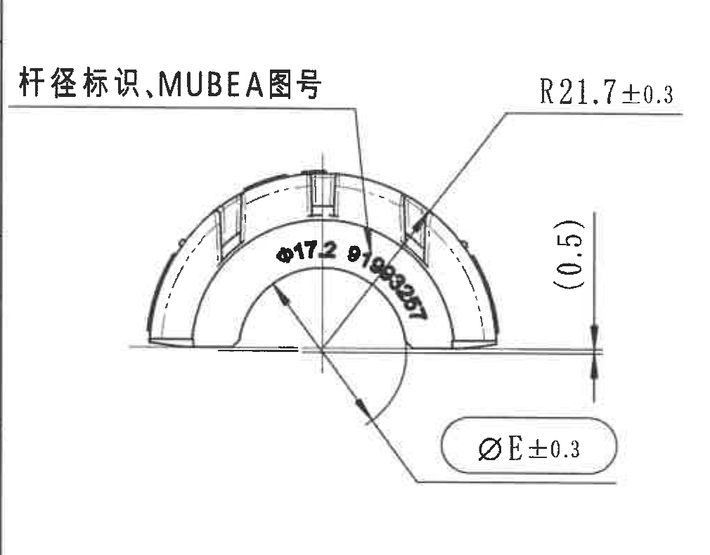

原图位置/视图名称: 左中 E-G 网格左侧拱形主视图，bbox `[370, 1070, 1380, 1860]`。

| 提取项 | 原图数值或文本 | 含义说明 |
|---|---|---|
| 杆径标识/MUBEA图号 | 杆径标识、MUBEA图号 | 引线指向零件弧面标记区域。 |
| 弧面印字 | Ø17.2 91993257 | 弧面上的直径/图号类标识。 |
| 外半径 | R21.7±0.3 | 外弧半径，公差 ±0.3。 |
| 底部直径 | ØE±0.3 | 套筒直径代号 E，公差 ±0.3。 |
| 参考尺寸 | (0.5) | 括号内参考尺寸，位于右侧竖向尺寸线。 |

边界归属说明: 该裁切已重裁去除右侧相邻侧视图文字；所有尺寸线、箭头和标注文字完整。`(0.5)` 属本主视图右侧竖向参考尺寸。

## object_4 中左侧侧视图 / A-A 剖切位置

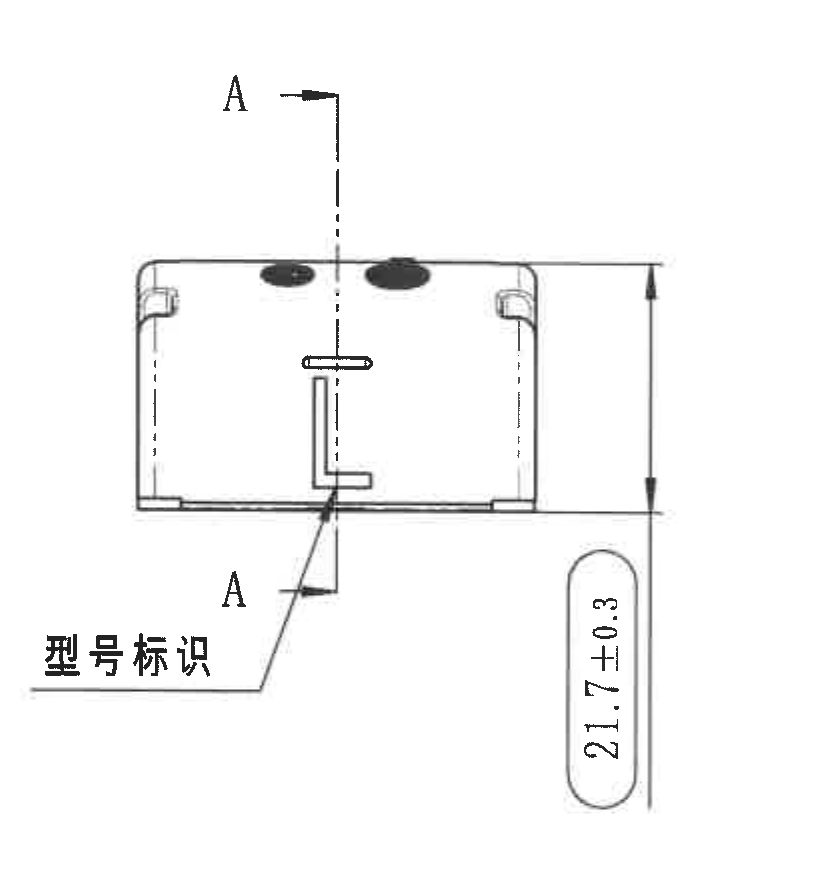

原图位置/视图名称: 中左 E-G 网格侧视图，bbox `[1370, 1060, 2190, 1950]`。

| 提取项 | 原图数值或文本 | 含义说明 |
|---|---|---|
| 剖切标识 | A-A | 指示 object_5 的 A-A 剖面位置。 |
| 高度尺寸 | 21.7±0.3 | 侧视图整体高度尺寸，公差 ±0.3。 |
| 标识说明 | 型号标识 | 引线指向中部 L 形标记。 |

边界归属说明: 裁切完整包含剖切线 A-A、高度尺寸箭头和“型号标识”；未将左侧主视图的 ØE/R21.7 或右侧 A-A 剖面内容归入本视图。

## object_5 剖面 A-A 1:1

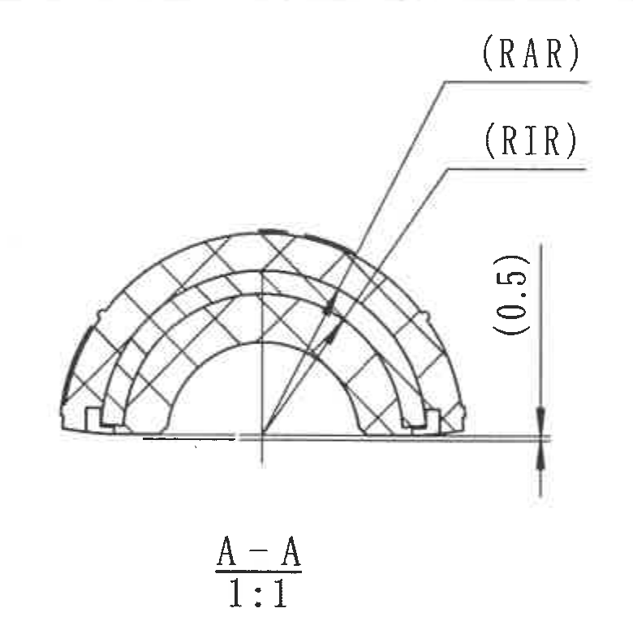

原图位置/视图名称: 中部剖面 A-A，bbox `[2260, 1040, 3040, 1800]`。

| 提取项 | 原图数值或文本 | 含义说明 |
|---|---|---|
| 剖面名称 | A-A | 剖切自 object_4 的 A-A 位置。 |
| 比例 | 1:1 | 剖面绘制比例。 |
| 外半径代号 | (RAR) | 括号内参考/参数代号，指向嵌件外半径位置。 |
| 内半径代号 | (RIR) | 括号内参考/参数代号，指向嵌件内半径位置。 |
| 参考尺寸 | (0.5) | 右侧竖向参考尺寸。 |

边界归属说明: 裁切右侧已收边，未带入 B-B 的 `(B)` 标注；底部完整包含 `A-A 1:1`。

## object_6 剖面 B-B 1:1

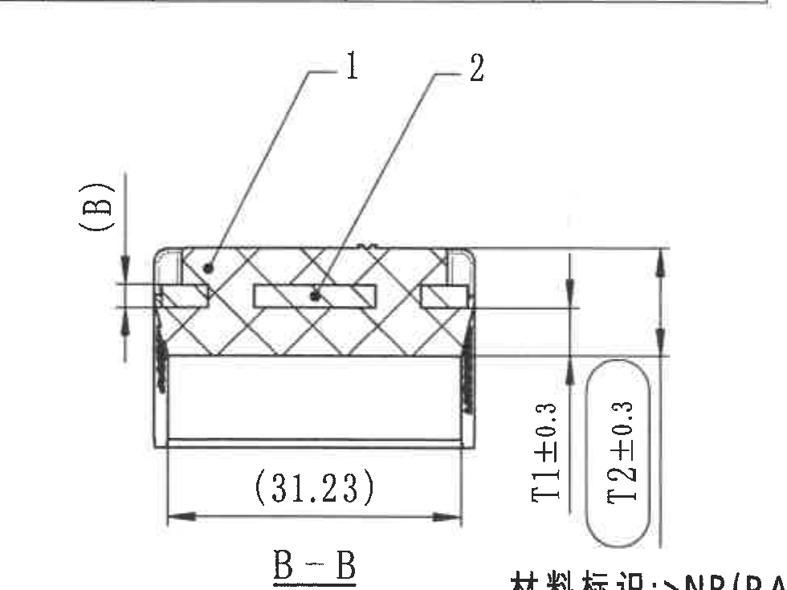

原图位置/视图名称: 中右剖面 B-B，bbox `[3020, 1030, 4000, 1765]`。

| 提取项 | 原图数值或文本 | 含义说明 |
|---|---|---|
| 剖面名称 | B-B | 剖切自 object_7 的 B-B 位置。 |
| 比例 | 1:1 | 剖面绘制比例。 |
| 物料/结构编号 | 1 | 指向剖面中斜线填充主体区域。 |
| 物料/结构编号 | 2 | 指向中部嵌件/骨架区域。 |
| 厚度代号 | (B) | 左侧括号参考代号，关联参数表中的 insert thickness B。 |
| 参考宽度 | (31.23) | 底部水平括号参考尺寸。 |
| 橡胶厚度 | T1±0.3 | 右侧竖向尺寸，公差 ±0.3。 |
| 内橡胶厚度 | T2±0.3 | 右侧竖向尺寸，公差 ±0.3。 |

边界归属说明: `(B)`、`(31.23)`、`T1±0.3`、`T2±0.3` 均归 B-B 剖面。下缘因与右侧材料标识距离极近，可见少量相邻材料标识上沿，未作为 B-B 内容提取。

## object_7 右侧拱形材料标识视图 / B-B 剖切位置

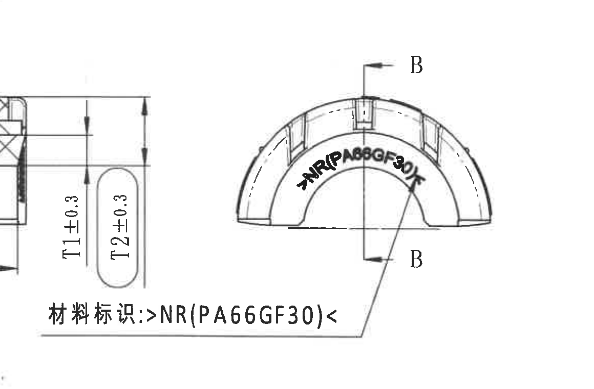

原图位置/视图名称: 右中 E-G 网格材料标识拱形视图，bbox `[3560, 1150, 4720, 1910]`。

| 提取项 | 原图数值或文本 | 含义说明 |
|---|---|---|
| 剖切标识 | B-B | 指示 object_6 的 B-B 剖面位置。 |
| 弧面材料印字 | >NR(PA66GF30)< | 零件弧面上的材料标识。 |
| 下方材料标识 | 材料标识: >NR(PA66GF30)< | 引线指向弧面材料印字。 |

边界归属说明: 为保留完整材料标识和引线，左侧可见 B-B 剖面 T1/T2 尺寸残部；该残部归 object_6，不在本对象提取表中重复提取。

## object_8 左下俯视图

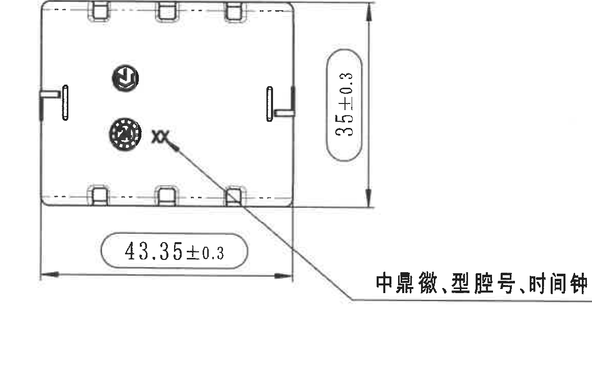

原图位置/视图名称: 左下 H-I 网格俯视图，bbox `[500, 1900, 1660, 2620]`。

| 提取项 | 原图数值或文本 | 含义说明 |
|---|---|---|
| 水平尺寸 | 43.35±0.3 | 俯视图底部总宽尺寸，公差 ±0.3。 |
| 竖向尺寸 | 35±0.3 | 俯视图右侧总高/宽向尺寸，公差 ±0.3。 |
| 标识说明 | 中鼎徽、型腔号、时间钟 | 引线指向图内圆形徽标、型腔号和时间钟标记。 |

边界归属说明: 尺寸线和标识引线完整；未带入中部等轴测视图。左侧实体边线贴近裁切边界但未截断尺寸文字或箭头。

## object_9 等轴测视图与坐标方向

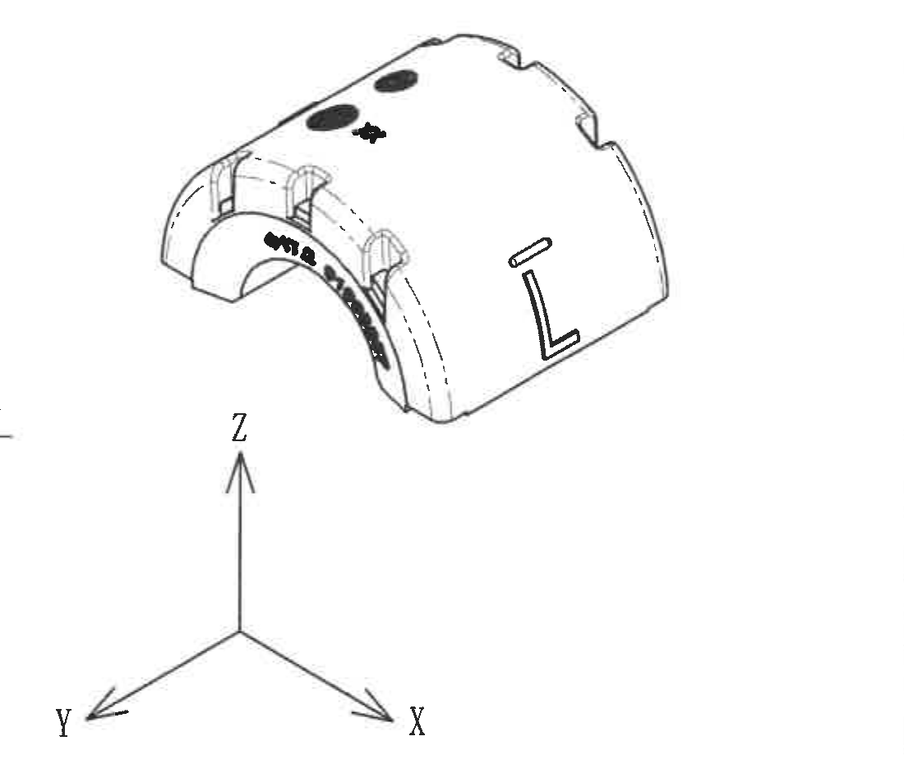

原图位置/视图名称: 中下 H-J 网格等轴测视图，bbox `[1650, 1960, 2750, 2890]`。

| 提取项 | 原图数值或文本 | 含义说明 |
|---|---|---|
| 三维外形 | 等轴测零件视图 | 显示弧形衬套外形、槽、凸台、弧面印字和 L 形标识。 |
| 坐标方向 | X、Y、Z | 指示三维视图方向。 |

边界归属说明: 重裁后已排除下方 Reference 文本；该视图没有独立尺寸标注，主要用于形状和方向说明。

## object_10 Specification 技术要求

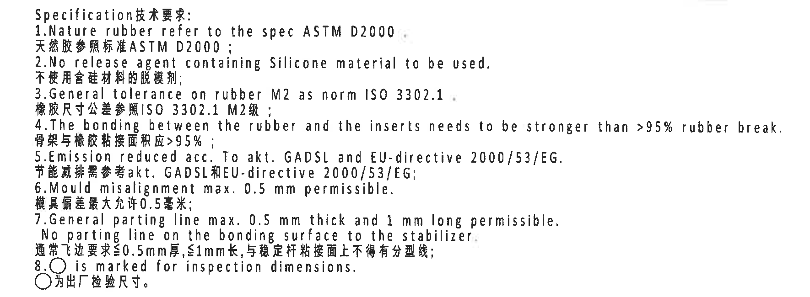

原图位置/视图名称: 右中下技术要求文本，bbox `[2680, 1810, 4450, 2460]`。

| 提取项 | 原图数值或文本 | 含义说明 |
|---|---|---|
| 标题 | Specification技术要求 | 技术要求说明块。 |
| 1 | Nature rubber refer to the spec ASTM D2000 / 天然胶参照标准 ASTM D2000 | 天然胶材料按 ASTM D2000。 |
| 2 | No release agent containing Silicone material to be used / 不使用含硅材料的脱模剂 | 禁用含硅脱模剂。 |
| 3 | General tolerance on rubber M2 as norm ISO 3302.1 / 橡胶尺寸公差参照 ISO 3302.1 M2级 | 橡胶通用尺寸公差标准。 |
| 4 | The bonding between the rubber and the inserts needs to be stronger than >95% rubber break / 骨架与橡胶粘接面积应 >95% | 橡胶与嵌件粘接强度/破坏要求。 |
| 5 | Emission reduced acc. To akt. GADSL and EU-directive 2000/53/EG / 节能减排需参考 akt. GADSL 和 EU-directive 2000/53/EG | 环保/排放法规要求。 |
| 6 | Mould misalignment max. 0.5 mm permissible / 模具偏差最大允许 0.5 毫米 | 模具错位限值。 |
| 7 | General parting line max. 0.5 mm thick and 1 mm long permissible. No parting line on the bonding surface to the stabilizer / 通常飞边要求≤0.5mm厚, ≤1mm长, 与稳定杆粘接面上不得有分型线 | 飞边和分型线限制。 |
| 8 | ○ is marked for inspection dimensions / ○为出厂检验尺寸 | 圆圈标记表示检验尺寸。 |

边界归属说明: 裁切从标题开始到第 8 条结束，未带入上方材料视图或下方 BOM 表。

## object_11 DIN ISO 3302-1 M2 class 公差表

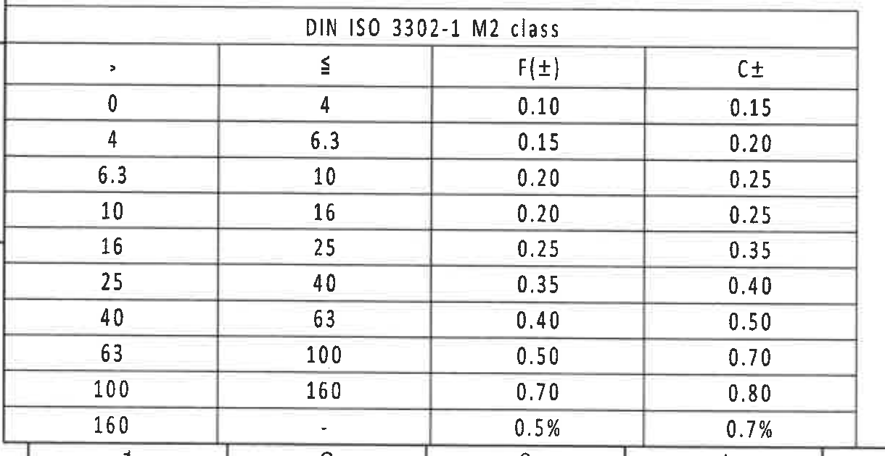

原图位置/视图名称: 左下公差表，bbox `[360, 2720, 1580, 3350]`。

| > | ≤ | F(±) | C± |
|---:|---:|---:|---:|
| 0 | 4 | 0.10 | 0.15 |
| 4 | 6.3 | 0.15 | 0.20 |
| 6.3 | 10 | 0.20 | 0.25 |
| 10 | 16 | 0.20 | 0.25 |
| 16 | 25 | 0.25 | 0.35 |
| 25 | 40 | 0.35 | 0.40 |
| 40 | 63 | 0.40 | 0.50 |
| 63 | 100 | 0.50 | 0.70 |
| 100 | 160 | 0.70 | 0.80 |
| 160 | - | 0.5% | 0.7% |

| 提取项 | 原图数值或文本 | 含义说明 |
|---|---|---|
| 标题 | DIN ISO 3302-1 M2 class | 橡胶件尺寸公差等级表。 |
| 范围列 | `>` 与 `≤` | 尺寸区间上下限。 |
| F(±), C± | 0.10 至 0.80; 0.5%, 0.7% | 不同尺寸范围对应的公差值。 |

边界归属说明: 裁切完整包含标题、表头和全部数据行；底边接近图框坐标栏但坐标数字未作为表格内容。

## object_12 BOM / 明细表

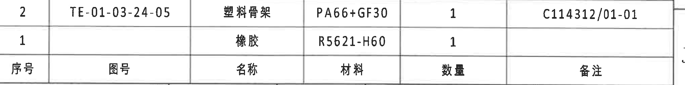

原图位置/视图名称: 右下标题栏上方 BOM/明细表，bbox `[2770, 2500, 4800, 2755]`。

| 序号 | 图号 | 名称 | 材料 | 数量 | 备注 |
|---:|---|---|---|---:|---|
| 2 | TE-01-03-24-05 | 塑料骨架 | PA66+GF30 | 1 | C114312/01-01 |
| 1 |  | 橡胶 | R5621-H60 | 1 |  |

| 提取项 | 原图数值或文本 | 含义说明 |
|---|---|---|
| 序号 2 | TE-01-03-24-05 / 塑料骨架 / PA66+GF30 / 1 / C114312/01-01 | 塑料骨架物料明细。 |
| 序号 1 | 橡胶 / R5621-H60 / 1 | 橡胶物料明细，图号和备注为空。 |

边界归属说明: 原表表头位于底部，已按原行列还原；裁切排除了下方标题栏字段。

## object_13 Reference 参考标准

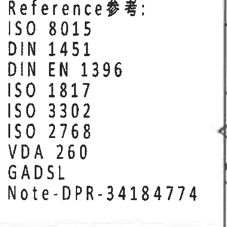

原图位置/视图名称: 中下参考标准文本，bbox `[2380, 2960, 2760, 3340]`。

| 提取项 | 原图数值或文本 | 含义说明 |
|---|---|---|
| Reference参考 | ISO 8015 | 参考标准。 |
| Reference参考 | DIN 1451 | 参考标准。 |
| Reference参考 | DIN EN 1396 | 参考标准。 |
| Reference参考 | ISO 1817 | 参考标准。 |
| Reference参考 | ISO 3302 | 参考标准。 |
| Reference参考 | ISO 2768 | 参考标准。 |
| Reference参考 | VDA 260 | 参考标准。 |
| Reference参考 | GADSL | 参考标准。 |
| Note | Note-DPR-34184774 | 参考备注编号。 |

边界归属说明: 文本块完整；右侧仅有相邻标题栏竖线，不属于本对象文本。

## object_14 标题栏

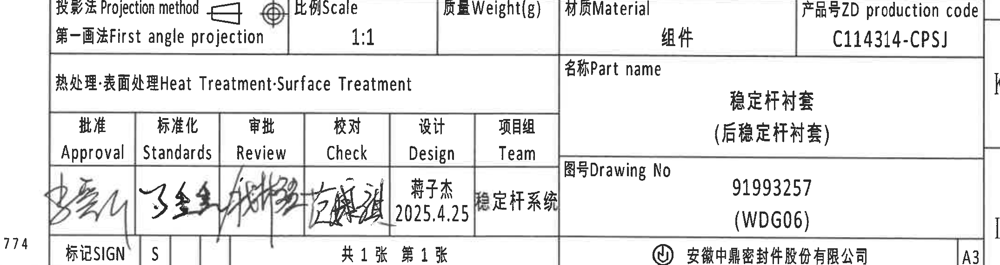

原图位置/视图名称: 右下标题栏，bbox `[2650, 2760, 4800, 3330]`。

| 字段 | 原图数值或文本 | 含义说明 |
|---|---|---|
| 投影法 Projection method | 第一画法 First angle projection | 投影视图方法。 |
| 比例 Scale | 1:1 | 图纸比例。 |
| 质量 Weight(g) |  | 原图为空。 |
| 材质 Material | 组件 | 标题栏材料/对象类别。 |
| 产品号 ZD production code | C114314-CPSJ | 产品代码。 |
| 热处理·表面处理 Heat Treatment·Surface Treatment |  | 原图为空。 |
| 名称 Part name | 稳定杆衬套 (后稳定杆衬套) | 零件名称。 |
| 图号 Drawing No | 91993257 (WDG06) | 图纸编号。 |
| Approval | 签名 | 审批签名栏。 |
| Standards | 签名 | 标准化签名栏。 |
| Review | 签名 | 审批/复核签名栏。 |
| Check | 签名 | 校对签名栏。 |
| Design | 蒋子杰 2025.4.25 | 设计者及日期。 |
| Team | 稳定杆系统 | 项目组。 |
| SIGN | S | 标记字段。 |
| 页数 | 共1张 第1张 | 总页数与当前页。 |
| 公司 | 安徽中鼎密封件股份有限公司 | 出图公司。 |
| 图幅 | A3 | 图幅规格。 |

边界归属说明: 裁切覆盖标题栏主要外框和字段；左缘可见 Reference 文本末端残字，不属于标题栏字段，未提取。

## 裁切检查记录

| object_id | 裁切对象 | 检查结论 |
|---|---|---|
| object_1 | 修订履历表 | 表头和两行记录完整；未裁掉文字；未混入右侧图框字母栏。 |
| object_2 | 上方参数表 | 表头、合并单元格和 B/C/E/H/J/K/L 行完整；未带入下方视图。 |
| object_3 | 左侧拱形主视图 | 经重裁去除相邻“型号标识”残片；R21.7±0.3、ØE±0.3、(0.5) 尺寸线和文字完整。 |
| object_4 | 侧视图 | 经重裁向下扩展；A-A 剖切线和 21.7±0.3 高度尺寸完整。 |
| object_5 | 剖面 A-A | 经重裁收右边界；RAR/RIR 引线、(0.5)、A-A 1:1 完整，无 B-B 标注混入。 |
| object_6 | 剖面 B-B | (B)、(31.23)、T1±0.3、T2±0.3 和 B-B 1:1 完整；下缘有相邻材料标识上沿，已在归属说明中排除。 |
| object_7 | 右侧材料拱形视图 | B-B 剖切标识、弧面材料印字和下方材料标识完整；左侧可见 B-B 尺寸残部，不作为本对象提取。 |
| object_8 | 俯视图 | 43.35±0.3、35±0.3 和标识引线完整；未混入等轴测视图。 |
| object_9 | 等轴测视图 | 经重裁排除 Reference 文本；三维视图和 X/Y/Z 坐标完整。 |
| object_10 | 技术要求 | 经重裁保留标题和第 1-8 条完整文本；未混入上下对象。 |
| object_11 | 公差表 | 经重裁保留最后一行 160--；标题、表头和所有数据行完整。 |
| object_12 | BOM 明细表 | 两行物料和底部表头完整；未带入下方标题栏。 |
| object_13 | Reference 参考标准 | 标准列表完整；右侧仅保留相邻竖线，无文字混入。 |
| object_14 | 标题栏 | 标题栏字段完整；左缘少量 Reference 残字已排除提取。 |
