# 20C114315.pdf 内容识别与裁切提取
整页 PNG：`outputs/20C114315_assets/images/page_1.png`；页面尺寸：4959 x 3505 px；bbox 均为该 PNG 坐标 `[x0, y0, x1, y1]`。
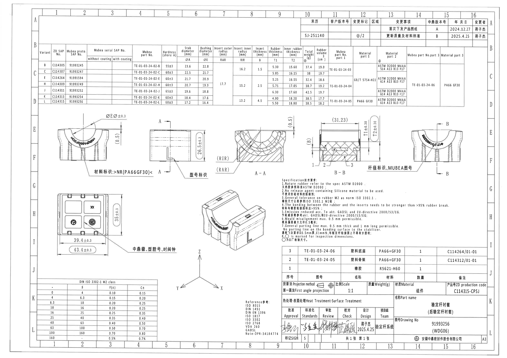
## object_1 - 主参数表 / Variant and material-dimension table
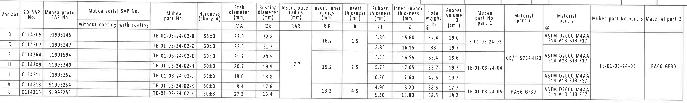
- 原图位置/视图名称：页面上部 B-C-D 区，横跨图纸 1-16 列；位于修订履历表下方。 bbox `[380, 425, 4565, 1060]`
### 原表还原
| Variant | ZD SAP No. | Mubea proto. SAP No. | serial SAP without coating | serial SAP with coating | Mubea part No. | Hardness shore A | ØA Stab dia. | ØE Bushing dia. | RAR | RIR | B insert thickness | T1 rubber thickness | T2 inner rubber thickness | Weight @ (g) | Rubber volume (cm3) | Mubea part No. part 1 | Material part 1 | Material part 2 @ | Mubea part No. part 3 | Material part 3 |
| --- | --- | --- | --- | --- | --- | --- | --- | --- | --- | --- | --- | --- | --- | --- | --- | --- | --- | --- | --- | --- |
| B | C114305 | 91993245 |  |  | TE-01-03-24-02-B | 55±3 | 23.6 | 22.8 |  | 16.2 | 1.5 | 5.30 | 15.60 | 37.4 | 19.0 | TE-01-03-24-03 |  | ASTM D2000 M4AA 514 A13 B13 F17 |  |  |
| C | C114307 | 91993247 |  |  | TE-01-03-24-02-C | 60±3 | 22.5 | 21.7 |  | 16.2 | 1.5 | 5.85 | 16.15 | 38 | 19.7 | TE-01-03-24-03 |  | ASTM D2000 M4AA 514 A13 B13 F17 |  |  |
| E | C114264 | 91991594 |  |  | TE-01-03-24-02-E | 60±3 | 21.7 | 20.9 | 17.7 | 15.2 | 2.5 | 5.25 | 16.55 | 32.4 | 18.6 |  | GB/T 5754-H22 | ASTM D2000 M4AA 614 A13 B13 F17 | TE-01-03-24-06 | PA66 GF30 |
| H | C114309 | 91993249 |  |  | TE-01-03-24-02-H | 60±3 | 20.7 | 19.9 | 17.7 | 15.2 | 2.5 | 5.75 | 17.05 | 38.7 | 19.2 | TE-01-03-24-04 | GB/T 5754-H22 | ASTM D2000 M4AA 614 A13 B13 F17 | TE-01-03-24-06 | PA66 GF30 |
| J | C114311 | 91993252 |  |  | TE-01-03-24-02-J | 65±3 | 19.6 | 18.8 | 17.7 | 15.2 | 2.5 | 6.30 | 17.60 | 42.5 | 19.7 | TE-01-03-24-04 | GB/T 5754-H22 | ASTM D2000 M4AA 614 A13 B13 F17 | TE-01-03-24-06 | PA66 GF30 |
| K | C114313 | 91993254 |  |  | TE-01-03-24-02-K | 60±3 | 18.4 | 17.6 |  | 13.2 | 4.5 | 4.90 | 18.20 | 38.5 | 17.7 | TE-01-03-24-05 | PA66 GF30 | ASTM D2000 M4AA 614 A13 B13 F17 |  |  |
| L | C114315 | 91993256 |  |  | TE-01-03-24-02-L | 60±3 | 17.2 | 16.4 |  | 13.2 | 4.5 | 5.50 | 18.80 | 38.5 | 18.2 | TE-01-03-24-05 | PA66 GF30 | ASTM D2000 M4AA 614 A13 B13 F17 |  |  |

### 提取表格
| 提取项 | 原图数值或文本 | 含义说明 |
| --- | --- | --- |
| ØA | 17.2-23.6（按 Variant 变化） | Stab diameter，稳定杆/杆径尺寸列。 |
| ØE | 16.4-22.8（按 Variant 变化） | Bushing diameter，衬套直径尺寸列。 |
| RAR | 17.7（E/H/J 合并单元） | Insert outer radius，外嵌件半径；A-A 剖面给出位置。 |
| RIR | 16.2、15.2、13.2（跨行合并） | Insert inner radius，内嵌件半径；A-A 剖面给出位置。 |
| B | 1.5、2.5、4.5（跨行合并） | Insert thickness，嵌件厚度；B-B 剖面中 (B) 为参考位置。 |
| T1 | 4.90-6.30 | Rubber thickness，橡胶厚度；B-B 剖面标注 T1±0.30。 |
| T2 | 15.60-18.80 | Inner rubber thickness，内橡胶厚度；B-B 剖面标注 T2±0.30。 |
| Hardness | 55±3、60±3、65±3 | 邵氏 A 硬度。 |
| @ | 重量列和 Material part 2 处出现 @ | 图面中的检验/标注符号，按原图保留。 |

### 边界归属说明
完整裁取主参数表。合并单元格按原图跨行含义记录：RAR=17.7 覆盖 E/H/J；RIR=16.2 覆盖 B/C，15.2 覆盖 E/H/J，13.2 覆盖 K/L；B=1.5 覆盖 B/C，2.5 覆盖 E/H/J，4.5 覆盖 K/L。空白 serial coating 栏保持为空。
## object_2 - 修订履历表 / Revision history
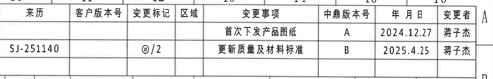
- 原图位置/视图名称：页面右上 A-B 区，约 10-16 列。 bbox `[2940, 150, 4835, 455]`
### 原表还原
| 来历 | 客户版本号 | 变更标记 | 区域 | 变更事项 | 中鼎版本号 | 年 月 日 | 变更者 |
| --- | --- | --- | --- | --- | --- | --- | --- |
|  |  |  |  | 首次下发产品图纸 | A | 2024.12.27 | 蒋子杰 |
| SJ-251140 |  | @/2 |  | 更新质量及材料标准 | B | 2025.4.25 | 蒋子杰 |

### 提取表格
| 提取项 | 原图数值或文本 | 含义说明 |
| --- | --- | --- |
| REV/版本 | A | 首次下发产品图纸，日期 2024.12.27，变更者 蒋子杰。 |
| REV/版本 | B | 更新质量及材料标准，变更标记 @/2，来历 SJ-251140，日期 2025.4.25，变更者 蒋子杰。 |

### 边界归属说明
完整裁取修订履历表；右侧靠近外框 A/B 坐标不属于表格字段。
## object_3 - 左上主视图 / Front machining view
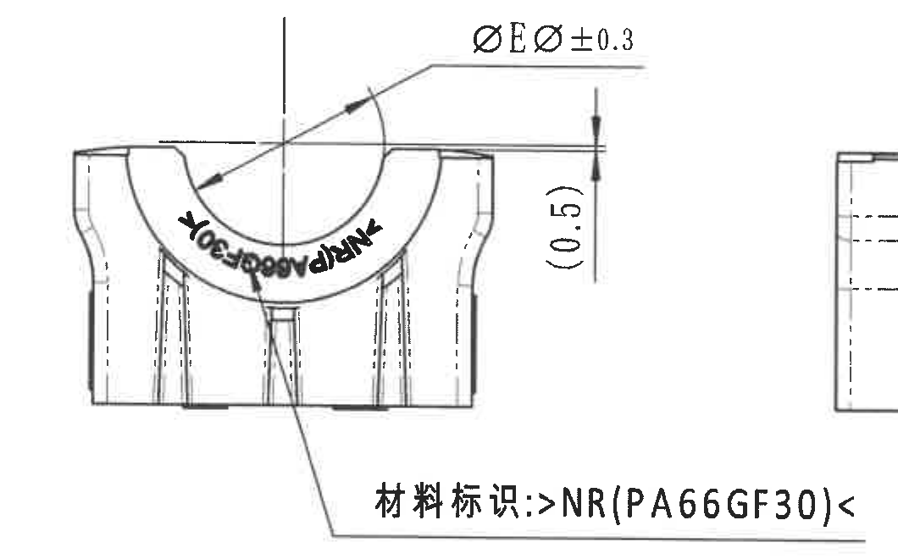
- 原图位置/视图名称：页面左中 E-F-G 区，约 2-5 列。 bbox `[480, 1090, 1540, 1750]`
### 提取表格
| 提取项 | 原图数值或文本 | 含义说明 |
| --- | --- | --- |
| 尺寸 | ØEر0.3 | 弧形槽/衬套直径相关尺寸，带直径符号 Ø 和 ±0.3 公差；位于左上主视图上方。 |
| 参考尺寸 | (0.5) | 括号内参考尺寸，位于视图右侧竖向标注；作为参考高度/间隙说明保留。 |
| 标识 | 材料标识: >NR(PA66GF30)< | 材料标识引线指向正面下部，说明材料标记内容和位置。 |
| 弧面标识 | 内弧上 MUBEA/相关弧形字样 | 弧面上形成的标识，不作为尺寸；说明标识在内弧表面。 |

### 边界归属说明
该视图表达 U 形槽正面形状、衬套/橡胶区域和材料标识位置。ØEر0.3 是衬套外径/槽口相关直径公差标注，括号 (0.5) 为参考高度/间隙类尺寸，不作为加工控制尺寸但必须保留说明。右侧已收紧，未提取相邻侧视图尺寸。
## object_4 - 侧视图与 A-A 剖切指示 / Side view with A-A cutting plane
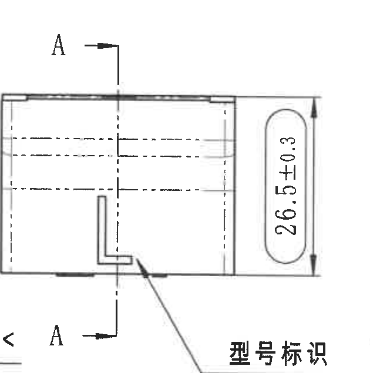
- 原图位置/视图名称：页面中部 E-F-G 区，约 5-7 列。 bbox `[1465, 1110, 2095, 1745]`
### 提取表格
| 提取项 | 原图数值或文本 | 含义说明 |
| --- | --- | --- |
| 剖切标识 | A / A | 上下 A 字母及箭头表示 A-A 剖切位置。 |
| 尺寸 | 26.5±0.3 | 侧视方向总高度/外形高度尺寸，带 ±0.3 公差。 |
| 标识 | 型号标识 | 引线指向侧面 L 形标识区域。 |

### 边界归属说明
该视图用于说明 A-A 剖面位置和侧向总高度。26.5±0.3 为该侧视方向总高度尺寸；A/A 字母为剖切基准标识；型号标识说明型号标记所在面。左边缘可能见到相邻材料标识的极少残影，不归属本对象，未提取。右边缘邻近 A-A 剖面文字，未归入本视图。
## object_5 - A-A 剖面 / Section A-A
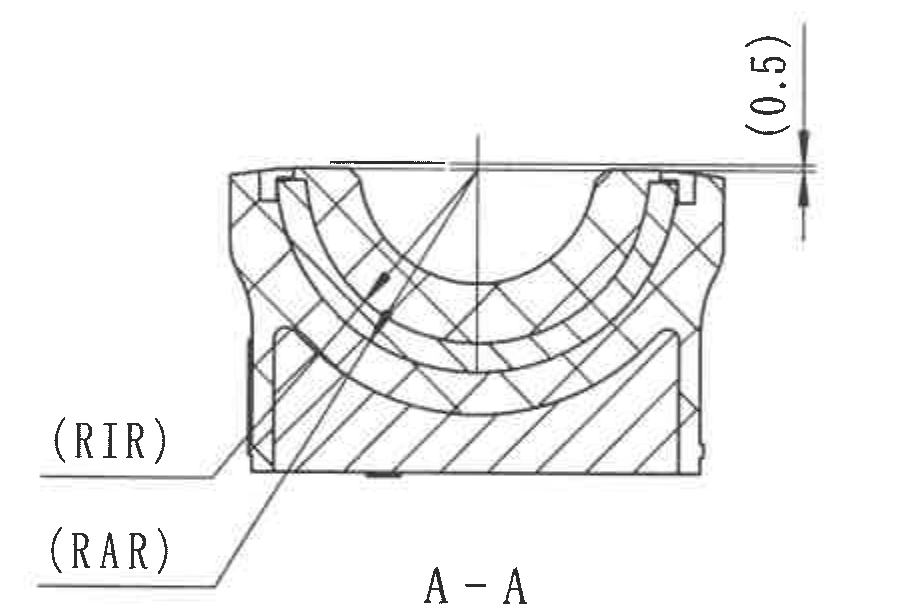
- 原图位置/视图名称：页面中部 E-F-G 区，约 7-9 列。 bbox `[2070, 1110, 2970, 1720]`
### 提取表格
| 提取项 | 原图数值或文本 | 含义说明 |
| --- | --- | --- |
| 剖面名称 | A-A | 该剖视图由 object_4 的 A-A 剖切线得到。 |
| 参考尺寸 | (0.5) | 括号内参考尺寸，位于剖面右上。 |
| 半径标识 | (RIR) | Insert inner radius 的位置说明；具体数值在主参数表中按 Variant 读取。 |
| 半径标识 | (RAR) | Insert outer radius 的位置说明；具体数值在主参数表中按 Variant 读取。 |

### 边界归属说明
A-A 剖面解释内外半径 RIR/RAR 的几何位置，RIR 为 insert inner radius，RAR 为 insert outer radius；具体数值由主参数表按变体读取。括号 (0.5) 为参考尺寸/参考间隙说明，位于剖面右上，不可省略。下边缘邻近 NOTES 起始文字，未归属本剖面。
## object_6 - B-B 剖面 / Section B-B
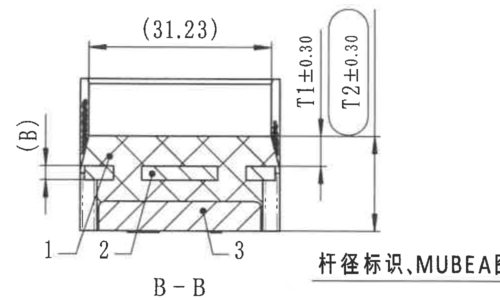
- 原图位置/视图名称：页面中右 E-F 区，约 10-13 列。 bbox `[2965, 1115, 3965, 1715]`
### 提取表格
| 提取项 | 原图数值或文本 | 含义说明 |
| --- | --- | --- |
| 剖面名称 | B-B | 该剖视图由右端主视图的 B-B 剖切线得到。 |
| 参考尺寸 | (31.23) | 括号内参考长度尺寸，位于剖面上方。 |
| 参考尺寸 | (B) | 括号内参考厚度/位置尺寸，位于剖面左侧。 |
| 厚度尺寸 | T1±0.30 | 橡胶厚度控制尺寸，带 ±0.30 公差。 |
| 厚度尺寸 | T2±0.30 | 内橡胶厚度控制尺寸，带 ±0.30 公差。 |
| 编号 | 1, 2, 3 | 剖面中材料/部件编号，对应 BOM：1 橡胶，2 塑料骨架，3 塑料底座。 |

### 边界归属说明
B-B 剖面说明宽度、橡胶厚度和内橡胶厚度方向。括号 (31.23) 和 (B) 为参考尺寸/参考位置说明；T1±0.30 和 T2±0.30 为厚度公差标注，对应主参数表 Rubber thickness T1 与 Inner rubber thickness T2；编号 1/2/3 对应 BOM 中橡胶、塑料骨架、塑料底座。右下方中文“杆径标识,MUBEA图号”引线跨入相邻右端视图区域，未归属本剖面。
## object_7 - 右端主视图与 B-B 剖切指示 / Right front view with B-B cutting plane
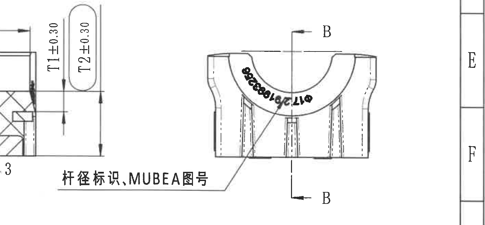
- 原图位置/视图名称：页面右中 E-F 区，约 12-16 列。 bbox `[3420, 1120, 4840, 1780]`
### 提取表格
| 提取项 | 原图数值或文本 | 含义说明 |
| --- | --- | --- |
| 剖切标识 | B / B | 上下 B 字母及箭头表示 B-B 剖切位置。 |
| 标识 | 杆径标识,MUBEA图号 | 中文引线指向内弧标识，说明杆径标识和 MUBEA 图号位置。 |
| 弧面标识 | 内弧黑色弧形字样 | 表示产品弧面上的编码/图号标识。 |

### 边界归属说明
该视图说明 B-B 剖切位置以及杆径标识、MUBEA 图号在弧形表面上的位置。裁图左侧保留了从 B-B 剖面方向延伸过来的 T1/T2 和中文引线起点，用于完整呈现“杆径标识,MUBEA图号”的归属；B-B 尺寸数值不在本对象提取，仍归 object_6。右侧图框坐标 E/F 不属于视图内容。
## object_8 - 底视图 / Bottom view
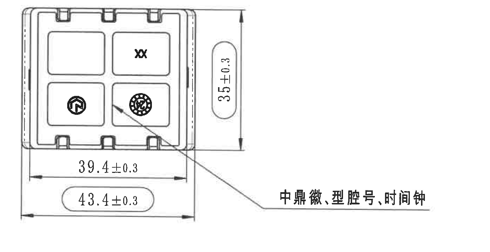
- 原图位置/视图名称：页面左下 G-I 区，约 2-6 列。 bbox `[500, 1875, 1900, 2595]`
### 提取表格
| 提取项 | 原图数值或文本 | 含义说明 |
| --- | --- | --- |
| 尺寸 | 35±0.3 | 底视图竖向外形尺寸，带 ±0.3 公差。 |
| 尺寸 | 39.4±0.3 | 底视图横向内部/有效宽度尺寸，带 ±0.3 公差。 |
| 尺寸 | 43.4±0.3 | 底视图横向外宽尺寸，圆角框标注；按图中形式保留。 |
| 标识 | 中鼎徽、型腔号、时间钟 | 引线指向底面标识组合。 |
| 底面符号 | XX、圆形徽标、圆点时间钟 | 底面模刻/检验相关符号。 |

### 边界归属说明
该视图表达底面轮廓和底面标识。35±0.3 为竖向外形尺寸；39.4±0.3 为内部/有效宽度尺寸；43.4±0.3 为外宽尺寸，因以圆角框显示，按图中标注保留并说明为底视图外宽标注。中文引线完整，未将右侧其他视图内容归入。
## object_9 - 轴测图 / Isometric view
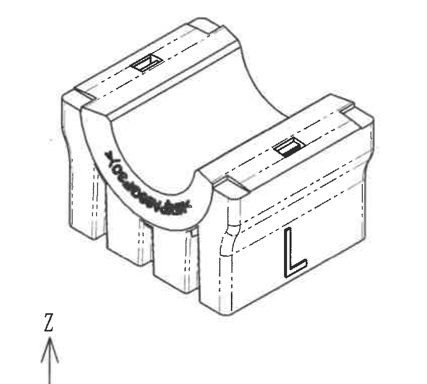
- 原图位置/视图名称：页面中下 G-I 区，约 7-9 列。 bbox `[1855, 1825, 2700, 2585]`
### 提取表格
| 提取项 | 原图数值或文本 | 含义说明 |
| --- | --- | --- |
| 标识 | 顶部矩形标识 | 两侧上肋各有矩形标识/凹位。 |
| 标识 | 内弧 MUBEA/杆径相关弧形字样 | 说明弧面标识位置。 |
| 标识 | L | 侧面大写 L 标识，对应变体/型号标识位置。 |

### 边界归属说明
轴测图用于表达零件三维外观和各标识的大致位置，不单独给出尺寸数值。右边界已收紧，NOTES 文本不归属本对象。
## object_10 - Specification 技术要求 / NOTES
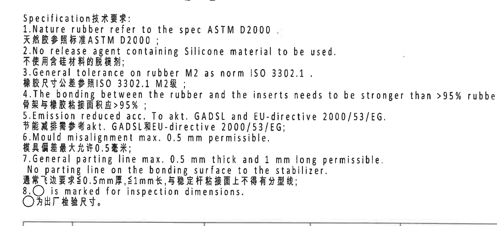
- 原图位置/视图名称：页面右中 G-I 区，约 9-14 列。 bbox `[2685, 1705, 4265, 2425]`
### 提取表格
| 序号 | 原图数值或文本 | 含义说明 |
| --- | --- | --- |
| 1 | Nature rubber refer to the spec ASTM D2000; 天然胶参照标准ASTM D2000 | 天然胶材料标准要求。 |
| 2 | No release agent containing Silicone material to be used; 不使用含硅材料的脱模剂 | 脱模剂禁用含硅材料。 |
| 3 | General tolerance on rubber M2 as norm ISO 3302.1; 橡胶尺寸公差参照ISO 3302.1 M2级 | 橡胶尺寸通用公差适用 M2 级。 |
| 4 | The bonding between the rubber and the inserts needs to be stronger than >95% rubber break; 骨架与橡胶粘接面积应>95% | 橡胶与嵌件粘接强度/破胶面积要求。 |
| 5 | Emission reduced acc. To akt, GADSL and EU-directive 2000/53/EG; 节能减排需参考akt, GADSL和EU-directive 2000/53/EG | 环保/排放法规要求。 |
| 6 | Mould misalignment max. 0.5 mm permissible; 模具偏差最大允许0.5毫米 | 模具错位最大允许值。 |
| 7 | General parting line max. 0.5 mm thick and 1 mm long permissible. No parting line on the bonding surface to the stabilizer; 通常飞边要求≤0.5mm厚, ≤1mm长, 与稳定杆粘接面上不得有分型线 | 飞边/分型线限制。 |
| 8 | ○ is marked for inspection dimensions; ○为出厂检验尺寸 | 圆圈标记尺寸为出厂检验尺寸。 |

### 边界归属说明
完整裁取技术要求文本。第 8 条圆圈符号说明图中被圆圈框起的尺寸为出厂检验尺寸/检验尺寸；该解释适用于视图中的圆角框/圆圈标注。
## object_11 - DIN ISO 3302-1 M2 class 通用公差表
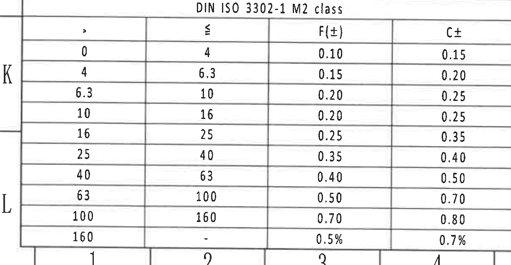
- 原图位置/视图名称：页面左下 J-L 区，约 1-4 列。 bbox `[310, 2740, 1530, 3375]`
### 原表还原
| > | ≤ | F(±) | C± |
| --- | --- | --- | --- |
| 0 | 4 | 0.10 | 0.15 |
| 4 | 6.3 | 0.15 | 0.20 |
| 6.3 | 10 | 0.20 | 0.25 |
| 10 | 16 | 0.20 | 0.25 |
| 16 | 25 | 0.25 | 0.35 |
| 25 | 40 | 0.35 | 0.40 |
| 40 | 63 | 0.40 | 0.50 |
| 63 | 100 | 0.50 | 0.70 |
| 100 | 160 | 0.70 | 0.80 |
| 160 | - | 0.5% | 0.7% |

### 提取表格
| 提取项 | 原图数值或文本 | 含义说明 |
| --- | --- | --- |
| 标准 | DIN ISO 3302-1 M2 class | 橡胶尺寸通用公差标准。 |
| F(±) | 0.10 到 0.5% | F 类公差列，随尺寸区间变化。 |
| C± | 0.15 到 0.7% | C 类公差列，随尺寸区间变化。 |

### 边界归属说明
完整裁取通用公差表。用于未单独标注公差的橡胶尺寸，且与 NOTES 第 3 条 ISO 3302.1 M2 级一致。
## object_12 - Reference 参考标准
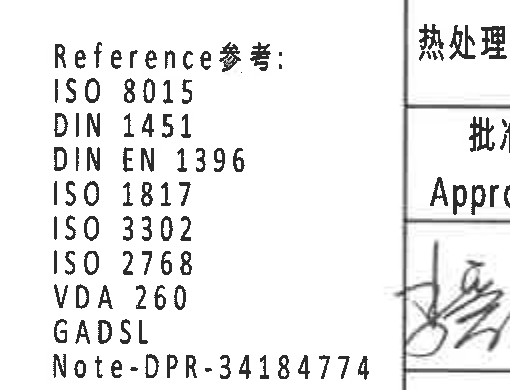
- 原图位置/视图名称：页面下中 J-L 区，约 8-9 列。 bbox `[2350, 2900, 2860, 3290]`
### 提取表格
| 提取项 | 原图数值或文本 | 含义说明 |
| --- | --- | --- |
| ISO 8015 | ISO 8015 | 参考标准/文件 |
| DIN 1451 | DIN 1451 | 参考标准/文件 |
| DIN EN 1396 | DIN EN 1396 | 参考标准/文件 |
| ISO 1817 | ISO 1817 | 参考标准/文件 |
| ISO 3302 | ISO 3302 | 参考标准/文件 |
| ISO 2768 | ISO 2768 | 参考标准/文件 |
| VDA 260 | VDA 260 | 参考标准/文件 |
| GADSL | GADSL | 参考标准/文件 |
| Note-DPR-34184774 | Note-DPR-34184774 | 参考标准/文件 |

### 边界归属说明
参考标准列表。右侧标题栏签名格已基本排除，若边缘可见标题栏线条，不归属本对象。
## object_13 - BOM / 明细表
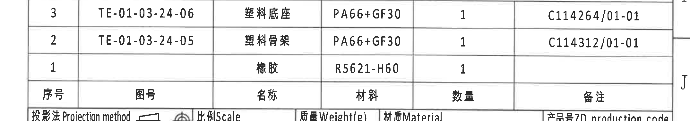
- 原图位置/视图名称：页面右下 I-J 区，约 9-16 列，标题栏上方。 bbox `[2670, 2415, 4820, 2795]`
### 原表还原
| 序号 | 图号 | 名称 | 材料 | 数量 | 备注 |
| --- | --- | --- | --- | --- | --- |
| 3 | TE-01-03-24-06 | 塑料底座 | PA66+GF30 | 1 | C114264/01-01 |
| 2 | TE-01-03-24-05 | 塑料骨架 | PA66+GF30 | 1 | C114312/01-01 |
| 1 |  | 橡胶 | R5621-H60 | 1 |  |

### 提取表格
| 提取项 | 原图数值或文本 | 含义说明 |
| --- | --- | --- |
| 序号 1 | 橡胶 / R5621-H60 / 数量 1 | 对应 B-B 剖面编号 1。 |
| 序号 2 | TE-01-03-24-05 / 塑料骨架 / PA66+GF30 / 数量 1 / C114312/01-01 | 对应 B-B 剖面编号 2。 |
| 序号 3 | TE-01-03-24-06 / 塑料底座 / PA66+GF30 / 数量 1 / C114264/01-01 | 对应 B-B 剖面编号 3。 |

### 边界归属说明
完整裁取 BOM 明细表。序号 1/2/3 与 B-B 剖面中的编号引线对应。
## object_14 - 标题栏 / Title block
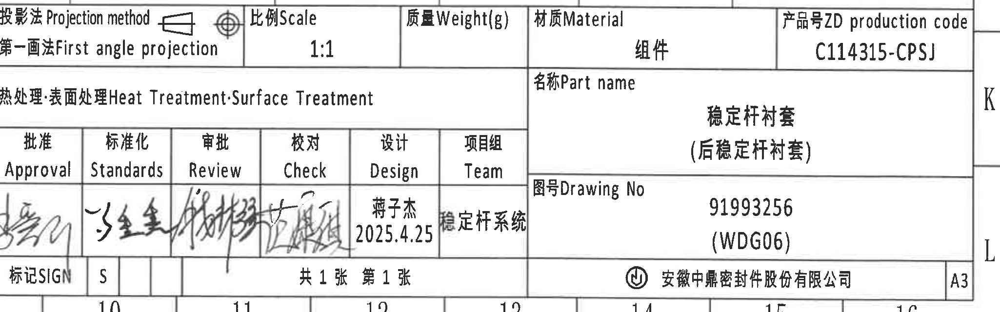
- 原图位置/视图名称：页面右下 J-L 区，约 10-16 列。 bbox `[2770, 2745, 4820, 3385]`
### 原表还原
| 字段 | 原图文本 |
| --- | --- |
| 投影法 Projection method | 第一画法 First angle projection |
| 比例 Scale | 1:1 |
| 质量 Weight(g) |  |
| 材质 Material | 组件 |
| 产品号 ZD production code | C114315-CPSJ |
| 热处理/表面处理 Heat Treatment/Surface Treatment |  |
| 名称 Part name | 稳定杆衬套（后稳定杆衬套） |
| 图号 Drawing No | 91993256 (WDG06) |
| 批准 Approval | 签名 |
| 标准化 Standards | 签名 |
| 审批 Review | 签名 |
| 校对 Check | 签名 |
| 设计 Design | 蒋子杰 2025.4.25 |
| 项目组 Team | 稳定杆系统 |
| 标记 SIGN | S |
| 页数 | 共1张 第1张 |
| 公司 | 安徽中鼎密封件股份有限公司 |
| 图幅 | A3 |

### 提取表格
| 提取项 | 原图数值或文本 | 含义说明 |
| --- | --- | --- |
| 投影法 Projection method | 第一画法 First angle projection |
| 比例 Scale | 1:1 |
| 质量 Weight(g) |  |
| 材质 Material | 组件 |
| 产品号 ZD production code | C114315-CPSJ |
| 热处理/表面处理 Heat Treatment/Surface Treatment |  |
| 名称 Part name | 稳定杆衬套（后稳定杆衬套） |
| 图号 Drawing No | 91993256 (WDG06) |
| 批准 Approval | 签名 |
| 标准化 Standards | 签名 |
| 审批 Review | 签名 |
| 校对 Check | 签名 |
| 设计 Design | 蒋子杰 2025.4.25 |
| 项目组 Team | 稳定杆系统 |
| 标记 SIGN | S |
| 页数 | 共1张 第1张 |
| 公司 | 安徽中鼎密封件股份有限公司 |
| 图幅 | A3 |

### 边界归属说明
完整裁取标题栏。左边界贴近签名栏，未将 Reference 文本归属标题栏；右侧 A3 和公司栏完整。
## object_15 - 坐标轴方向说明 / X-Y-Z axis indicator
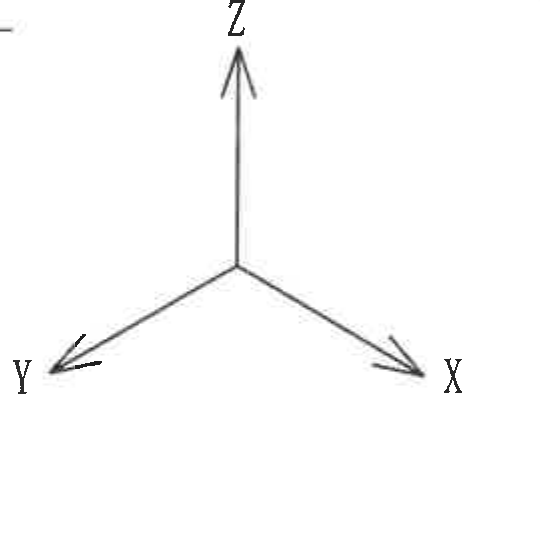
- 原图位置/视图名称：页面下中 I-J 区，轴测图下方、参考标准左侧。 bbox `[1715, 2445, 2255, 2993]`
### 提取表格
| 提取项 | 原图数值或文本 | 含义说明 |
| --- | --- | --- |
| 方向 | X | 箭头指向右下。 |
| 方向 | Y | 箭头指向左下。 |
| 方向 | Z | 箭头指向上方。 |

### 边界归属说明
用于说明图面/模型方向。左上角接近底视图引线末端，若可见微小残留不归属该坐标轴对象。
## 裁切检查记录
| 对象 | 名称 | 图片路径 | 完整性 | 检查说明 |
| --- | --- | --- | --- | --- |
| object_1 | 主参数表 / Variant and material-dimension table | outputs/20C114315_assets/images/object_1.png | 已检查 | 完整裁取主参数表。合并单元格按原图跨行含义记录：RAR=17.7 覆盖 E/H/J；RIR=16.2 覆盖 B/C，15.2 覆盖 E/H/J，13.2 覆盖 K/L；B=1.5 覆盖 B/C，2.5 覆盖 E/H/J，4.5 覆盖 K/L。空白 serial coating 栏保持为空。 |
| object_2 | 修订履历表 / Revision history | outputs/20C114315_assets/images/object_2.png | 已检查 | 完整裁取修订履历表；右侧靠近外框 A/B 坐标不属于表格字段。 |
| object_3 | 左上主视图 / Front machining view | outputs/20C114315_assets/images/object_3.png | 已检查 | 该视图表达 U 形槽正面形状、衬套/橡胶区域和材料标识位置。ØEر0.3 是衬套外径/槽口相关直径公差标注，括号 (0.5) 为参考高度/间隙类尺寸，不作为加工控制尺寸但必须保留说明。右侧已收紧，未提取相邻侧视图尺寸。 |
| object_4 | 侧视图与 A-A 剖切指示 / Side view with A-A cutting plane | outputs/20C114315_assets/images/object_4.png | 已检查 | 该视图用于说明 A-A 剖面位置和侧向总高度。26.5±0.3 为该侧视方向总高度尺寸；A/A 字母为剖切基准标识；型号标识说明型号标记所在面。左边缘可能见到相邻材料标识的极少残影，不归属本对象，未提取。右边缘邻近 A-A 剖面文字，未归入本视图。 |
| object_5 | A-A 剖面 / Section A-A | outputs/20C114315_assets/images/object_5.png | 已检查 | A-A 剖面解释内外半径 RIR/RAR 的几何位置，RIR 为 insert inner radius，RAR 为 insert outer radius；具体数值由主参数表按变体读取。括号 (0.5) 为参考尺寸/参考间隙说明，位于剖面右上，不可省略。下边缘邻近 NOTES 起始文字，未归属本剖面。 |
| object_6 | B-B 剖面 / Section B-B | outputs/20C114315_assets/images/object_6.png | 已检查 | B-B 剖面说明宽度、橡胶厚度和内橡胶厚度方向。括号 (31.23) 和 (B) 为参考尺寸/参考位置说明；T1±0.30 和 T2±0.30 为厚度公差标注，对应主参数表 Rubber thickness T1 与 Inner rubber thickness T2；编号 1/2/3 对应 BOM 中橡胶、塑料骨架、塑料底座。右下方中文“杆径标识,MUBEA图号”引线跨入相邻右端视图区域，未归属本剖面。 |
| object_7 | 右端主视图与 B-B 剖切指示 / Right front view with B-B cutting plane | outputs/20C114315_assets/images/object_7.png | 已检查 | 该视图说明 B-B 剖切位置以及杆径标识、MUBEA 图号在弧形表面上的位置。裁图左侧保留了从 B-B 剖面方向延伸过来的 T1/T2 和中文引线起点，用于完整呈现“杆径标识,MUBEA图号”的归属；B-B 尺寸数值不在本对象提取，仍归 object_6。右侧图框坐标 E/F 不属于视图内容。 |
| object_8 | 底视图 / Bottom view | outputs/20C114315_assets/images/object_8.png | 已检查 | 该视图表达底面轮廓和底面标识。35±0.3 为竖向外形尺寸；39.4±0.3 为内部/有效宽度尺寸；43.4±0.3 为外宽尺寸，因以圆角框显示，按图中标注保留并说明为底视图外宽标注。中文引线完整，未将右侧其他视图内容归入。 |
| object_9 | 轴测图 / Isometric view | outputs/20C114315_assets/images/object_9.png | 已检查 | 轴测图用于表达零件三维外观和各标识的大致位置，不单独给出尺寸数值。右边界已收紧，NOTES 文本不归属本对象。 |
| object_10 | Specification 技术要求 / NOTES | outputs/20C114315_assets/images/object_10.png | 已检查 | 完整裁取技术要求文本。第 8 条圆圈符号说明图中被圆圈框起的尺寸为出厂检验尺寸/检验尺寸；该解释适用于视图中的圆角框/圆圈标注。 |
| object_11 | DIN ISO 3302-1 M2 class 通用公差表 | outputs/20C114315_assets/images/object_11.png | 已检查 | 完整裁取通用公差表。用于未单独标注公差的橡胶尺寸，且与 NOTES 第 3 条 ISO 3302.1 M2 级一致。 |
| object_12 | Reference 参考标准 | outputs/20C114315_assets/images/object_12.png | 已检查 | 参考标准列表。右侧标题栏签名格已基本排除，若边缘可见标题栏线条，不归属本对象。 |
| object_13 | BOM / 明细表 | outputs/20C114315_assets/images/object_13.png | 已检查 | 完整裁取 BOM 明细表。序号 1/2/3 与 B-B 剖面中的编号引线对应。 |
| object_14 | 标题栏 / Title block | outputs/20C114315_assets/images/object_14.png | 已检查 | 完整裁取标题栏。左边界贴近签名栏，未将 Reference 文本归属标题栏；右侧 A3 和公司栏完整。 |
| object_15 | 坐标轴方向说明 / X-Y-Z axis indicator | outputs/20C114315_assets/images/object_15.png | 已检查 | 用于说明图面/模型方向。左上角接近底视图引线末端，若可见微小残留不归属该坐标轴对象。 |
