# 20C114319.pdf 内容识别与裁切提取

源文件：`input/20C114319.pdf`。整页渲染图：`outputs/20C114319_assets/images/page_1.png`，像素尺寸 `4959 x 3505`。PDF 无可提取文字层，以下内容基于整页 PNG 和 600dpi 临时放大图人工校读。

## 整页渲染

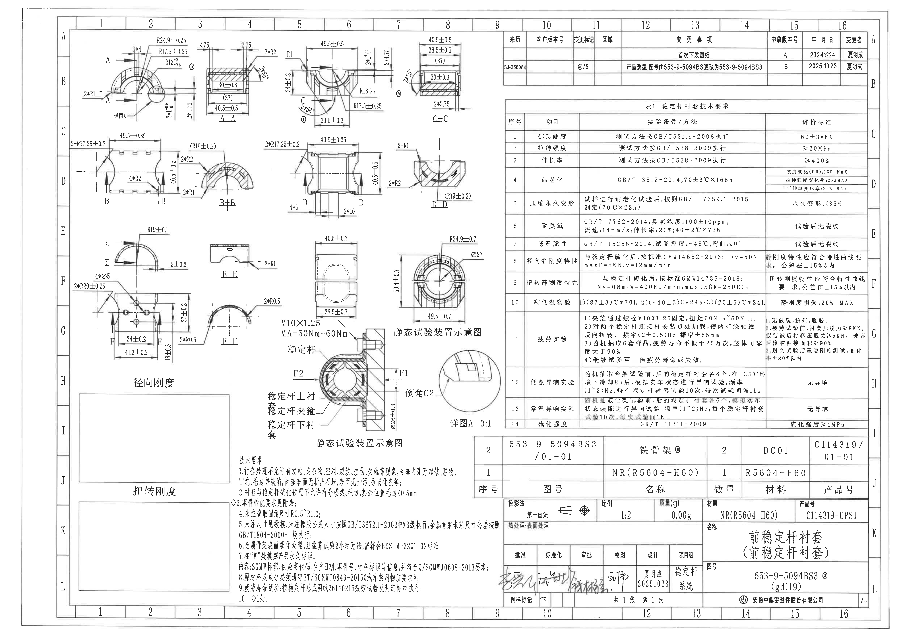

## 裁切对象与内容提取

### object_1 - 左上主视图 / A-A 剖切位置与详图A引出

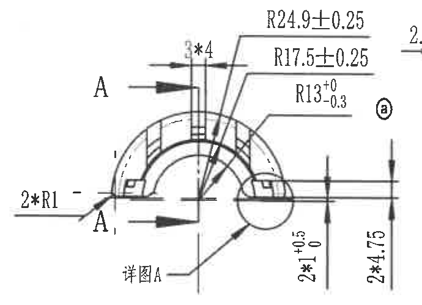

- 原图位置/视图名称：第1页左上，坐标网格约 A-B / 1-3 区域；左上主视图 / A-A 剖切位置与详图A引出
- 裁切 bbox：`[430, 190, 1120, 690]`

提取表格：

| 提取项 | 原图数值或文本 | 含义说明 |
| --- | --- | --- |
| 外圆弧半径 | R24.9±0.25 | 上侧外圆弧半径尺寸，带双向公差 ±0.25。 |
| 内圆弧半径 | R17.5±0.25 | 内侧圆弧半径尺寸，带双向公差 ±0.25。 |
| 中心小圆弧半径 | R13 +0/-0.3 | 中心圆弧半径，单向负公差，最大为 R13，最小为 R12.7。 |
| 台阶/槽数量尺寸 | 3*4 | 3 处 4 mm 宽/长的重复特征，位于上方引出线处。 |
| 左侧小圆角 | 2*R1 | 两处 R1 圆角，位于左下引出线。 |
| 总高度/局部高度 | 2*10 +0.5/0 | 两处 10 mm 高度特征，正公差 +0.5、负公差 0；图中文字为竖排。 |
| 总高度/外侧高度 | 2*4.75 | 两处 4.75 mm 尺寸，竖向标注在右侧。 |
| 剖切/基准标记 | A、A1 | A-A 剖切方向和局部标记，不是尺寸值。 |
| 局部放大引出 | 详图A | 指向后续 object_15 的详图 A，比例见详图区域。 |
| 圈注 | ⓐ | 圈注符号，表示与标题栏/版本标记相关的标识。 |

边界归属说明：裁切保留主视图本体、A/A1 剖切箭头、详图A引出线及本视图右侧两条竖向尺寸线。右侧相邻 A-A 剖面未纳入本对象；若边缘可见相邻线段，不提取为本视图尺寸。

### object_2 - 剖面 A-A

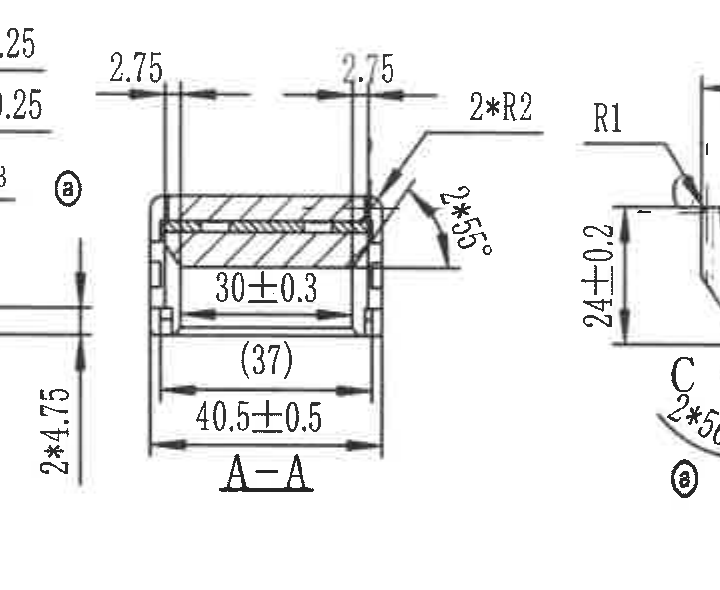

- 原图位置/视图名称：第1页上部偏左，主视图右侧；剖面 A-A
- 裁切 bbox：`[990, 180, 1710, 770]`

提取表格：

| 提取项 | 原图数值或文本 | 含义说明 |
| --- | --- | --- |
| 上侧端部间距 | 2.75 | 左端上方尺寸，指向剖面上端边缘。 |
| 上侧端部间距 | 2.75 | 右端上方尺寸，指向剖面上端边缘。 |
| 内宽 | 30±0.3 | 剖面内部水平宽度，双向公差 ±0.3。 |
| 参考宽度 | (37) | 括号内参考尺寸，表示该宽度仅供参考，不作为制造控制主尺寸。 |
| 外宽 | 40.5±0.5 | 剖面整体外部宽度，双向公差 ±0.5。 |
| 圆角 | 2*R2 | 两处 R2 圆角，引出线指向右上圆角区域。 |
| 圆角 | R1 | 右侧相邻引出线上可见，靠近 A-A 右边界；属于邻近特征提示，不计入 A-A 主要截面尺寸。 |
| 倒角/角度 | 2*45° | 两处 45 度倒角，弧向引出线位于右侧。 |
| 剖面名称 | A-A | 剖面标识。 |

边界归属说明：为完整包含两处 2.75、2*R2 与 2*45° 引出线，裁切左/右边缘保留少量相邻视图片段；左侧主视图竖向尺寸和右侧 C 视图的 24±0.2 不归入 A-A。

### object_3 - C 向视图 / 上部中间加工视图

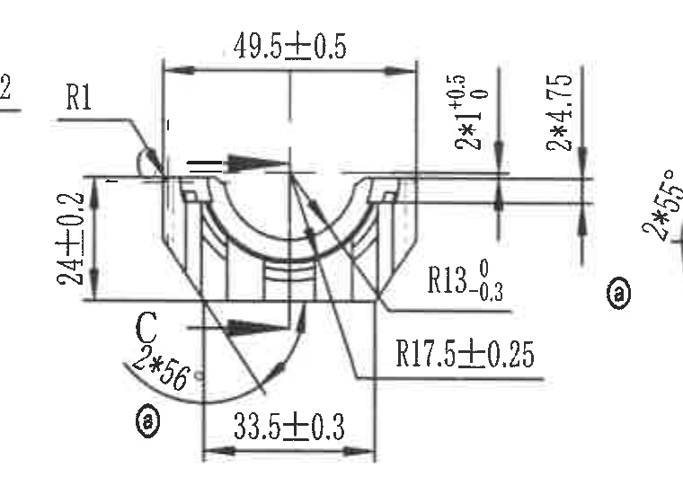

- 原图位置/视图名称：第1页上部中间，约 B-C / 5-7 区域；C 向视图 / 上部中间加工视图
- 裁切 bbox：`[1510, 190, 2270, 750]`

提取表格：

| 提取项 | 原图数值或文本 | 含义说明 |
| --- | --- | --- |
| 总宽 | 49.5±0.5 | 上方水平外宽，双向公差 ±0.5。 |
| 左侧高度 | 24±0.2 | 左侧竖向高度，双向公差 ±0.2。 |
| 台阶高度 | 2*1 +0.5/0 | 两处 1 mm 特征，正公差 +0.5、负公差 0。 |
| 高度/间距 | 2*4.75 | 两处 4.75 mm 竖向尺寸。 |
| 内圆半径 | R13 +0/-0.3 | 内侧圆弧半径，单向负公差。 |
| 外圆半径 | R17.5±0.25 | 外侧圆弧半径，双向公差 ±0.25。 |
| 底部宽度 | 33.5±0.3 | 下方两竖线间宽度，双向公差 ±0.3。 |
| 角度/弧向标注 | 2*56° | 两处 56 度角度/弧向尺寸，标注在左下弧线。 |
| 圆角 | R1 | 左上引出线指向圆角。 |
| 剖切标记 | C | C-C 剖切位置标记。 |
| 圈注 | ⓐ | 圈注标识，位于右下。 |

边界归属说明：裁切包含 C 向视图本体及其完整尺寸线。右侧 C-C 剖面被排除，仅保留 C 视图自身右侧竖向尺寸和圈注；下方 D 视图尺寸不归入本对象。

### object_4 - 剖面 C-C

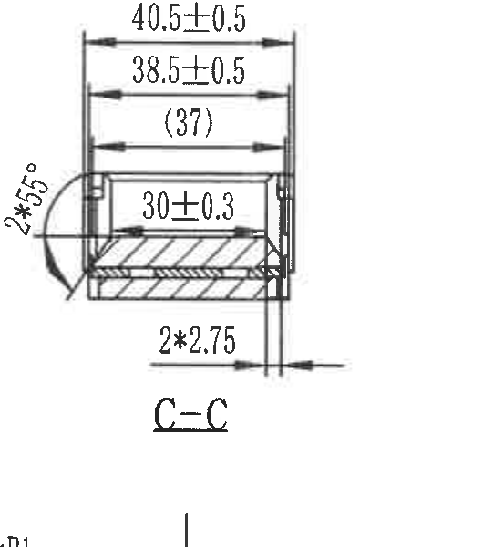

- 原图位置/视图名称：第1页上部偏右，C 向视图右侧；剖面 C-C
- 裁切 bbox：`[2220, 200, 2750, 800]`

提取表格：

| 提取项 | 原图数值或文本 | 含义说明 |
| --- | --- | --- |
| 外宽 | 40.5±0.5 | 剖面最外侧水平宽度，双向公差 ±0.5。 |
| 中间宽度 | 38.5±0.5 | 内侧/中间水平宽度，双向公差 ±0.5。 |
| 参考宽度 | (37) | 括号内参考尺寸，不作为制造控制主尺寸。 |
| 内宽 | 30±0.3 | 内部水平尺寸，双向公差 ±0.3。 |
| 倒角 | 2*45° | 两处 45 度倒角，左侧弧向引出线标注。 |
| 端部间距 | 2*2.75 | 两处 2.75 mm 间距，位于下方引出线。 |
| 剖面名称 | C-C | 剖面标识。 |

边界归属说明：C-C 剖面及所有横向尺寸线完整包含。底部有相邻行的极少量竖线边缘，不提取；右侧修订表/表格不归入本对象。

### object_5 - B 向视图 / 中左加工视图

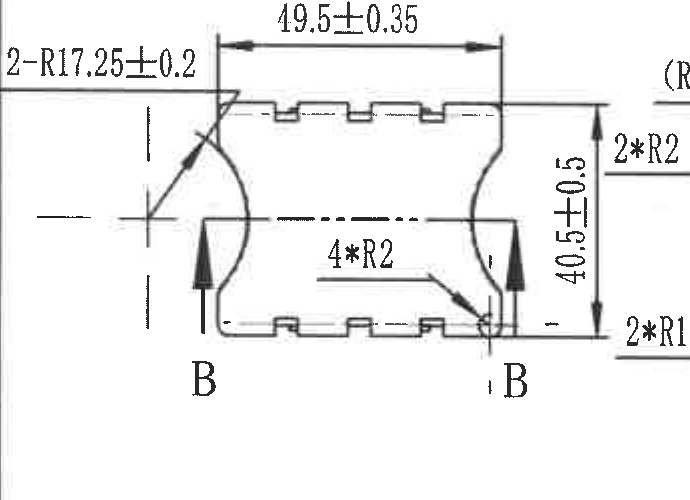

- 原图位置/视图名称：第1页左中，约 C-D / 1-3 区域；B 向视图 / 中左加工视图
- 裁切 bbox：`[385, 730, 1075, 1230]`

提取表格：

| 提取项 | 原图数值或文本 | 含义说明 |
| --- | --- | --- |
| 弧向半径 | 2-R17.25±0.2 | 两处 R17.25 圆弧，双向公差 ±0.2；位于左上引出。 |
| 总宽 | 49.5±0.35 | 上方水平宽度，双向公差 ±0.35。 |
| 总高 | 40.5±0.5 | 右侧竖向高度，双向公差 ±0.5。 |
| 圆角 | 4*R2 | 四处 R2 圆角，指向右下内角附近。 |
| 剖切标记 | B、B | B+B 剖面位置标记。 |

边界归属说明：裁切完整包含 B 向视图外形、上方宽度、右侧高度和 B 剖切箭头。右侧可见相邻 B+B 剖面半径文字边缘，不归入本对象。

### object_6 - 剖面 B+B

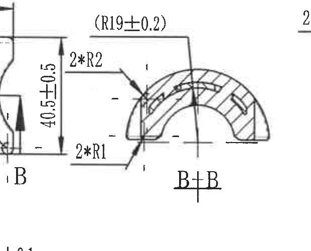

- 原图位置/视图名称：第1页中左，B 向视图右侧；剖面 B+B
- 裁切 bbox：`[860, 760, 1480, 1260]`

提取表格：

| 提取项 | 原图数值或文本 | 含义说明 |
| --- | --- | --- |
| 参考半径 | (R19±0.2) | 括号内参考半径，表示该圆弧半径为参考尺寸。 |
| 圆角 | 2*R2 | 两处 R2 圆角，左侧上方引出。 |
| 圆角 | 2*R1 | 两处 R1 圆角，左侧下方引出。 |
| 剖面名称 | B+B | 剖面标识。 |

边界归属说明：裁切覆盖 B+B 半圆形剖面和全部半径引出线。右侧 D 向视图的尺寸被排除；左侧 B 视图仅因引出线需要保留少量空白。

### object_7 - D 向视图 / 中部主加工视图

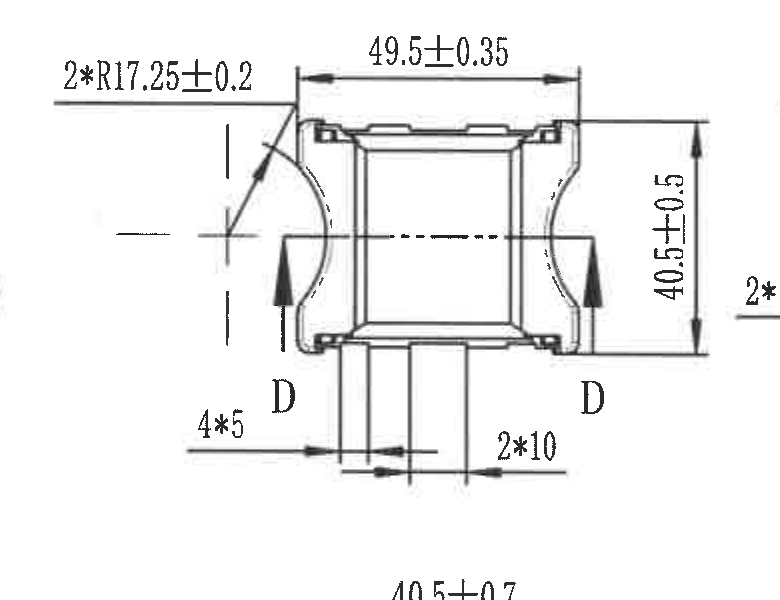

- 原图位置/视图名称：第1页中部，约 C-E / 5-7 区域；D 向视图 / 中部主加工视图
- 裁切 bbox：`[1400, 720, 2180, 1320]`

提取表格：

| 提取项 | 原图数值或文本 | 含义说明 |
| --- | --- | --- |
| 弧向半径 | 2*R17.25±0.2 | 两处 R17.25 圆弧，双向公差 ±0.2。 |
| 总宽 | 49.5±0.35 | 上方水平宽度，双向公差 ±0.35。 |
| 总高 | 40.5±0.5 | 右侧竖向高度，双向公差 ±0.5。 |
| 端部/槽尺寸 | 4*5 | 四处 5 mm 特征，位于下方左侧标注。 |
| 端部/槽尺寸 | 2*10 | 两处 10 mm 特征，位于下方右侧标注。 |
| 剖切标记 | D、D | D-D 剖面位置标记。 |

边界归属说明：裁切包含 D 向视图本体、D 剖切箭头和底部 4*5、2*10 尺寸。右侧 D-D 剖面半径标注和下方静态试验装置尺寸不归入本对象。

### object_8 - 剖面 D-D

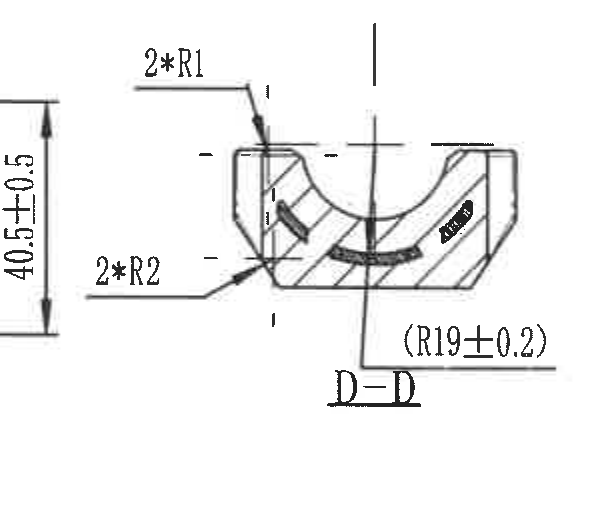

- 原图位置/视图名称：第1页中右，D 向视图右侧；剖面 D-D
- 裁切 bbox：`[2050, 740, 2660, 1260]`

提取表格：

| 提取项 | 原图数值或文本 | 含义说明 |
| --- | --- | --- |
| 圆角 | 2*R1 | 两处 R1 圆角，左上引出。 |
| 圆角 | 2*R2 | 两处 R2 圆角，左下引出。 |
| 参考半径 | (R19±0.2) | 括号内参考半径，位于剖面下方。 |
| 剖面名称 | D-D | 剖面标识。 |

边界归属说明：裁切完整包含 D-D 剖面、左侧半径引出线和下方参考半径。右侧表格/图框未纳入。

### object_9 - E 向局部视图

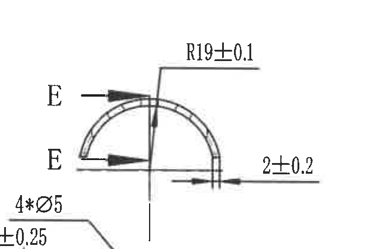

- 原图位置/视图名称：第1页左中偏下，约 E-F / 2-4 区域；E 向局部视图
- 裁切 bbox：`[500, 1180, 1150, 1600]`

提取表格：

| 提取项 | 原图数值或文本 | 含义说明 |
| --- | --- | --- |
| 半径 | R19±0.1 | 上方圆弧半径，双向公差 ±0.1。 |
| 厚度/宽度 | 2±0.2 | 右侧水平尺寸，双向公差 ±0.2。 |
| 剖切标记 | E、E | E-E 剖面位置标记。 |

边界归属说明：裁切包含 E 向视图、E 剖切箭头和 R19/2±0.2 尺寸。下方 F 视图尺寸不归入本对象。

### object_10 - 剖面 E-E

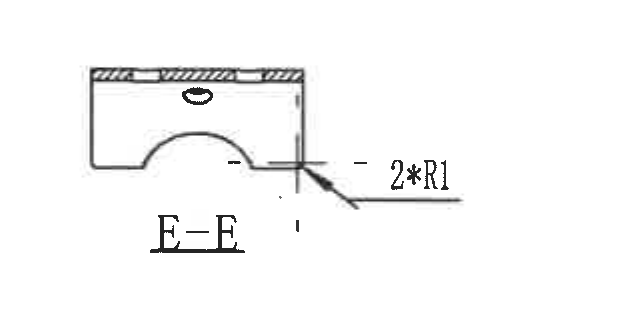

- 原图位置/视图名称：第1页中左偏下，E 向视图右侧；剖面 E-E
- 裁切 bbox：`[1070, 1280, 1690, 1610]`

提取表格：

| 提取项 | 原图数值或文本 | 含义说明 |
| --- | --- | --- |
| 圆角 | 2*R1 | 两处 R1 圆角，右侧引出线。 |
| 剖面名称 | E-E | 剖面标识。 |
| 剖面结构 | 上部剖线、下部圆弧缺口 | 展示 E-E 截面形状；该对象内未见其他尺寸数值。 |

边界归属说明：裁切收至 E-E 剖面和 2*R1 引出线范围。下方 F-E 剖面的 2*R0.5 已排除。

### object_11 - F 向视图 / 径向刚度试验位置视图

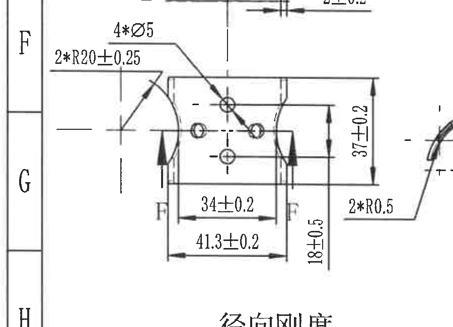

- 原图位置/视图名称：第1页左下中，约 F-G / 1-4 区域；F 向视图 / 径向刚度试验位置视图
- 裁切 bbox：`[300, 1465, 1200, 2115]`

提取表格：

| 提取项 | 原图数值或文本 | 含义说明 |
| --- | --- | --- |
| 孔径/孔数 | 4*Ø5 | 四个直径 5 mm 孔。 |
| 外圆半径 | 2*R20±0.25 | 两处 R20 圆弧，双向公差 ±0.25。 |
| 宽度 | 34±0.2 | 下方内侧宽度，双向公差 ±0.2。 |
| 宽度 | 41.3±0.2 | 下方外侧宽度，双向公差 ±0.2。 |
| 高度 | 37±0.2 | 右侧上段竖向高度，双向公差 ±0.2。 |
| 高度 | 18±0.5 | 右侧下段竖向高度，双向公差 ±0.5。 |
| 小圆角 | 2*R0.5 | 两处 R0.5 圆角，右侧引出。 |
| 剖切标记 | F、F | F 位置剖切/方向标记。 |
| 区域标题 | 径向刚度 | 下方大标题，对应刚度试验记录区域。 |

边界归属说明：裁切完整保留 F 向视图孔、半径、宽度和高度尺寸线。右侧 F-E 剖面边缘不归入本对象。

### object_12 - 剖面 F-E

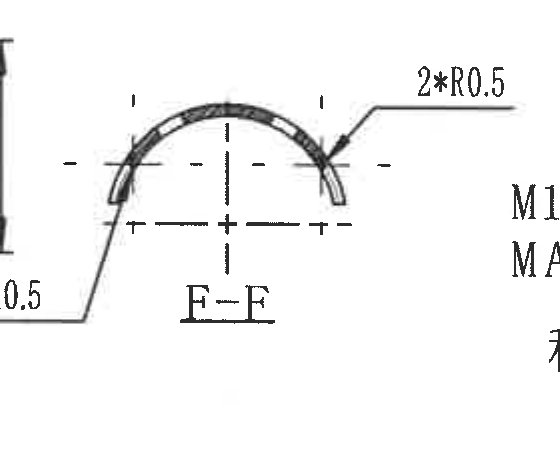

- 原图位置/视图名称：第1页中下，F 向视图右侧；剖面 F-E
- 裁切 bbox：`[1040, 1580, 1600, 2030]`

提取表格：

| 提取项 | 原图数值或文本 | 含义说明 |
| --- | --- | --- |
| 小圆角 | 2*R0.5 | 左侧引出，两处 R0.5 圆角。 |
| 小圆角 | 2*R0.5 | 右侧引出，两处 R0.5 圆角。 |
| 剖面名称 | F-E | 剖面标识，原图扫描中第二个字母略模糊，按图面读作 F-E。 |

边界归属说明：裁切仅保留弧形剖面和两侧 2*R0.5 引出线；左侧 F 向视图高度尺寸和右侧静态试验文字不归入本对象。

### object_13 - 静态试验装置示意图 / 上部两视图

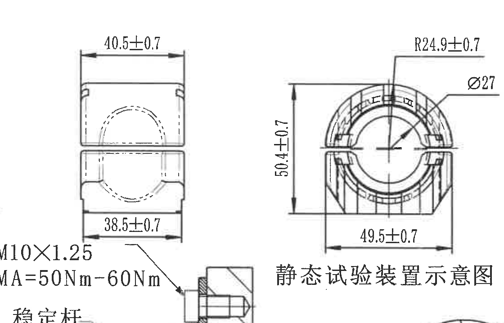

- 原图位置/视图名称：第1页中右偏下，约 E-G / 6-9 区域；静态试验装置示意图 / 上部两视图
- 裁切 bbox：`[1560, 1220, 2680, 1940]`

提取表格：

| 提取项 | 原图数值或文本 | 含义说明 |
| --- | --- | --- |
| 左视图上宽 | 40.5±0.7 | 左侧外形上方水平尺寸，双向公差 ±0.7。 |
| 左视图下宽 | 38.5±0.7 | 左侧外形下方水平尺寸，双向公差 ±0.7。 |
| 右视图高度 | 50.4±0.7 | 右侧剖面外形高度，双向公差 ±0.7。 |
| 右视图底宽 | 49.5±0.7 | 右侧剖面底部水平宽度，双向公差 ±0.7。 |
| 右视图外圆半径 | R24.9±0.7 | 右侧剖面外圆弧半径，双向公差 ±0.7。 |
| 圆孔/轴径 | Ø27 | 右侧剖面中心孔或轴径直径 27。 |
| 试验螺纹 | M10×1.25 | 稳定杆连接处螺纹规格。 |
| 拧紧力矩 | MA=50Nm-60Nm | 试验装置安装力矩范围 50 N·m 至 60 N·m。 |
| 部件 | 稳定杆 | 引出线指示稳定杆。 |
| 标题 | 静态试验装置示意图 | 该区域上部两个小视图共用标题。 |

边界归属说明：裁切把同一标题下的两个静态试验装置视图合并为一个对象。下方较大的装配剖面属于 object_14；底部稳定杆螺栓文字只按本对象试验螺纹/力矩提取。

### object_14 - 静态试验装置示意图 / 装配剖面

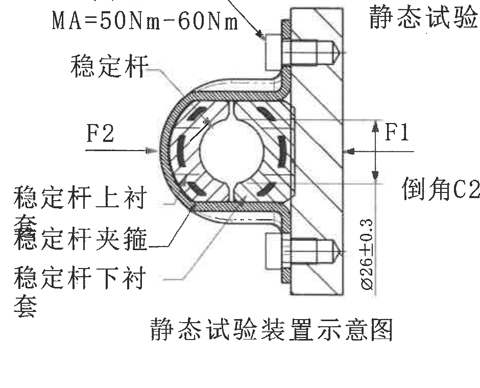

- 原图位置/视图名称：第1页中下，约 G-I / 5-8 区域；静态试验装置示意图 / 装配剖面
- 裁切 bbox：`[1450, 1800, 2390, 2560]`

提取表格：

| 提取项 | 原图数值或文本 | 含义说明 |
| --- | --- | --- |
| 力方向 | F1 | 右侧水平载荷方向标记。 |
| 力方向 | F2 | 左侧水平载荷方向标记。 |
| 夹具直径/孔径 | Ø26±0.3 | 右侧竖向直径尺寸，双向公差 ±0.3。 |
| 倒角 | 倒角C2 | 右侧引出文字，指示 C2 倒角要求。 |
| 组件名称 | 稳定杆 | 左上引出线指向稳定杆。 |
| 组件名称 | 稳定杆上衬套 | 左侧引出线指向上衬套。 |
| 组件名称 | 稳定杆夹箍 | 左侧引出线指向夹箍。 |
| 组件名称 | 稳定杆下衬套 | 左侧引出线指向下衬套。 |
| 标题 | 静态试验装置示意图 | 装配剖面标题。 |

边界归属说明：裁切收至装配剖面、F1/F2、Ø26±0.3 和倒角 C2 范围；右侧详图 A 圆形放大视图不归入本对象。

### object_15 - 详图 A 3:1

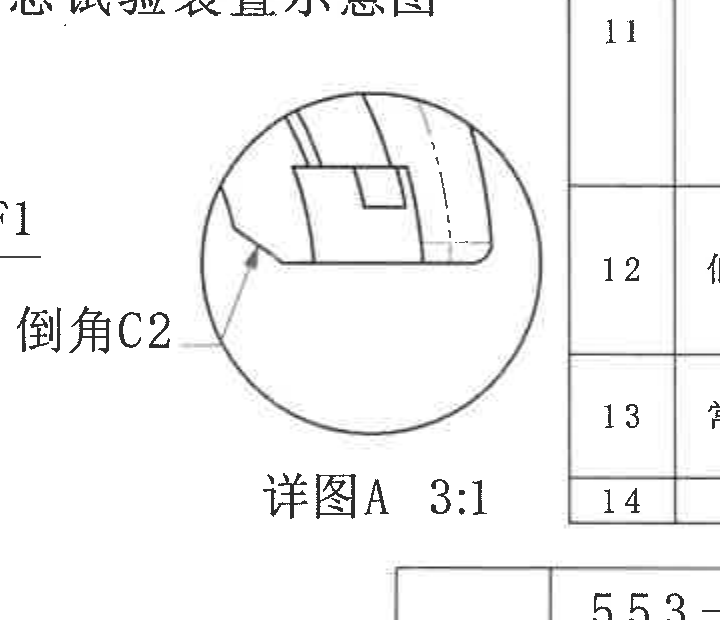

- 原图位置/视图名称：第1页中右下，静态试验装置右侧；详图 A 3:1
- 裁切 bbox：`[2220, 1840, 2940, 2460]`

提取表格：

| 提取项 | 原图数值或文本 | 含义说明 |
| --- | --- | --- |
| 倒角 | 倒角C2 | 左侧引出线指向详图中的倒角，尺寸为 C2。 |
| 比例 | 3:1 | 详图 A 放大比例 3:1。 |
| 详图名称 | 详图A | 对应 object_1 中“详图A”引出。 |

边界归属说明：裁切完整包含圆形放大框、倒角 C2 引出线和“详图A 3:1”文字。右侧技术要求表和下方标题栏边线已排除。

### object_16 - 径向刚度 / 扭转刚度空白记录框

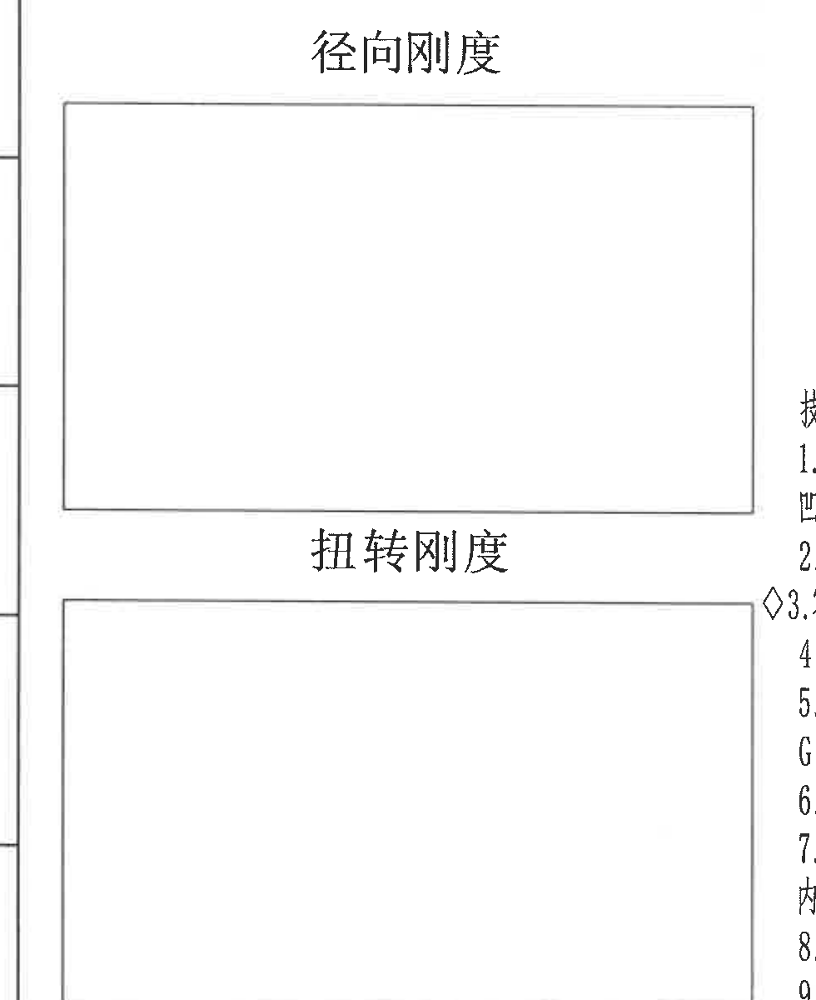

- 原图位置/视图名称：第1页左下，约 H-L / 1-4 区域；径向刚度 / 扭转刚度空白记录框
- 裁切 bbox：`[360, 2050, 1340, 3250]`

原表/原框结构还原：

| 项目 | 原图内容 | 说明 |
| --- | --- | --- |
| 径向刚度 | 空白矩形框 | 未填写数据。 |
| 扭转刚度 | 空白矩形框 | 未填写数据。 |

提取表格：

| 提取项 | 原图数值或文本 | 含义说明 |
| --- | --- | --- |
| 上方标题 | 径向刚度 | 上方大矩形空白框标题，用于记录径向刚度信息。 |
| 上方内容 | 空白矩形框 | 原图未填数值或文字。 |
| 下方标题 | 扭转刚度 | 下方大矩形空白框标题，用于记录扭转刚度信息。 |
| 下方内容 | 空白矩形框 | 原图未填数值或文字。 |

边界归属说明：裁切仅包含两个空白记录框和其标题；右侧技术要求文字已排除。

### object_17 - 技术要求 NOTES

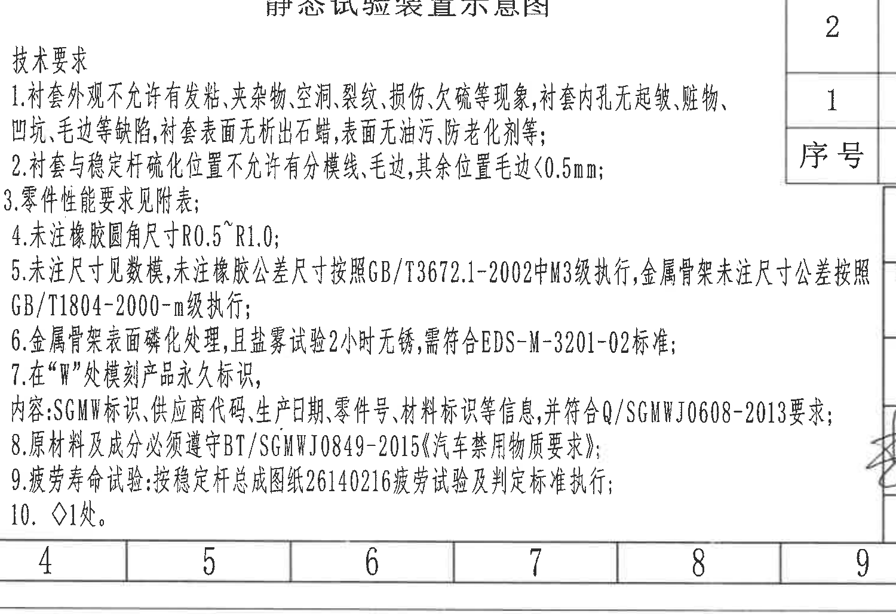

- 原图位置/视图名称：第1页下部中左，标题栏左侧；技术要求 NOTES
- 裁切 bbox：`[1300, 2440, 2800, 3470]`

提取表格：

| 提取项 | 原图数值或文本 | 含义说明 |
| --- | --- | --- |
| 标题 | 技术要求 | NOTES 区域标题。 |
| 1 | 衬套外观不允许有发粘、夹杂物、空洞、裂纹、损伤、欠硫等现象，衬套内孔无起皱、脏物、凹坑、毛边等缺陷，衬套表面无析出石蜡，表面无油污、防老化剂等； | 外观缺陷、污染和表面析出物要求。 |
| 2 | 衬套与稳定杆硫化位置不允许有分模线、毛边，其余位置毛边<0.5mm； | 硫化位置和毛边控制要求。 |
| 3 | 零件性能要求见附表； | 性能要求引用表 1。 |
| 4 | 未注橡胶圆角尺寸R0.5~R1.0； | 未注橡胶圆角默认范围。 |
| 5 | 未注尺寸见数模，未注橡胶公差尺寸按照GB/T3672.1-2002中M3级执行，金属骨架未注尺寸公差按照GB/T1804-2000-m级执行； | 未注尺寸与未注公差标准。 |
| 6 | 金属骨架表面磷化处理，且盐雾试验2小时无锈，需符合EDS-M-3201-02标准； | 金属骨架表面处理和盐雾要求。 |
| 7 | 在“W”处模刻产品永久标识，内容：SGMW标识、供应商代码、生产日期、零件号、材料标识等信息，并符合Q/SGMWJ0608-2013要求； | 永久标识内容和标准要求。 |
| 8 | 原材料及成分必须遵守BT/SGMWJ0849-2015《汽车禁用物质要求》； | 材料禁用物质要求。 |
| 9 | 疲劳寿命试验：按稳定杆总成图纸26140216疲劳试验及判定标准执行； | 疲劳寿命试验依据。 |
| 10 | ◇1处。 | 菱形符号标注的 1 处要求；扫描图中第10条仅见该短句。 |

边界归属说明：裁切完整包含技术要求 1-10 条。右侧可见标题栏/明细栏边缘和少量签名边缘，不归入 NOTES；底部坐标格为图框边界，不作为文本提取项。

### object_18 - 修订履历表

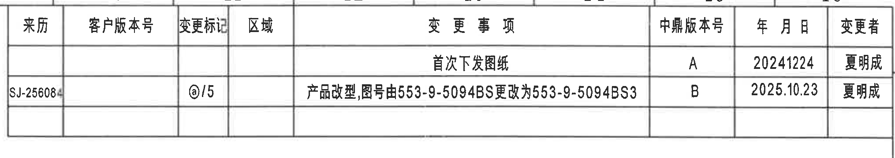

- 原图位置/视图名称：第1页右上，约 A-B / 10-16 区域；修订履历表
- 裁切 bbox：`[2760, 160, 4790, 520]`

原表/原框结构还原：

| 来历 | 客户版本号 | 变更标记 | 区域 | 变更事项 | 中鼎版本号 | 年月日 | 变更者 |
| --- | --- | --- | --- | --- | --- | --- | --- |
|  |  |  |  | 首次下发图纸 | A | 20241224 | 夏明成 |
| SJ-256084 |  | ⓐ/5 |  | 产品改型,图号由553-9-5094BS更改为553-9-5094BS3 | B | 2025.10.23 | 夏明成 |
|  |  |  |  |  |  |  |  |

提取表格：

| 提取项 | 原图数值或文本 | 含义说明 |
| --- | --- | --- |
| 表头 | 来历、客户版本号、变更标记、区域、变更事项、中鼎版本号、年月日、变更者 | 修订履历表列名。 |
| 记录A | 变更事项：首次下发图纸；中鼎版本号：A；年月日：20241224；变更者：夏明成 | 首次下发图纸记录。 |
| 记录B | 来历：SJ-256084；变更标记：ⓐ/5；变更事项：产品改型,图号由553-9-5094BS更改为553-9-5094BS3；中鼎版本号：B；年月日：2025.10.23；变更者：夏明成 | 产品改型和图号变更记录。 |

边界归属说明：裁切只包含修订履历表完整边框和三行表格区域；下方表 1 标题已排除。

### object_19 - 表1 稳定杆衬套技术要求

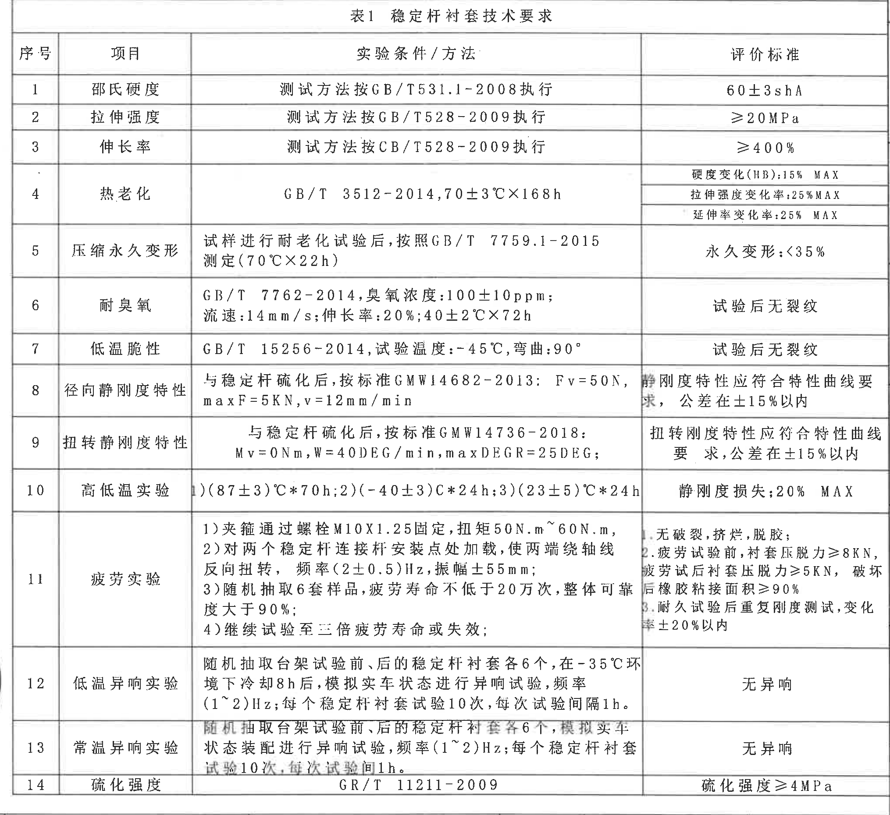

- 原图位置/视图名称：第1页右侧中部，约 B-I / 10-16 区域；表1 稳定杆衬套技术要求
- 裁切 bbox：`[2760, 550, 4790, 2410]`

原表/原框结构还原：

| 序号 | 项目 | 实验条件 / 方法 | 评价标准 |
| --- | --- | --- | --- |
| 1 | 邵氏硬度 | 测试方法按GB/T531.1-2008执行 | 60±3shA |
| 2 | 拉伸强度 | 测试方法按GB/T528-2009执行 | ≥20MPa |
| 3 | 伸长率 | 测试方法按CB/T528-2009执行 | ≥400% |
| 4 | 热老化 | GB/T 3512-2014,70±3℃×168h | 硬度变化(HB):15% MAX；拉伸强度变化率:25% MAX；延伸率变化率:25% MAX |
| 5 | 压缩永久变形 | 试样进行耐老化试验后,按照GB/T 7759.1-2015测定(70℃×22h) | 永久变形:<35% |
| 6 | 耐臭氧 | GB/T 7762-2014,臭氧浓度:100±10ppm; 流速:14mm/s; 伸长率:20%; 40±2℃×72h | 试验后无裂纹 |
| 7 | 低温脆性 | GB/T 15256-2014,试验温度:-45℃,弯曲:90° | 试验后无裂纹 |
| 8 | 径向静刚度特性 | 与稳定杆硫化后,按标准GMW14682-2013: Fv=50N, maxF=5KN, v=12mm/min | 静刚度特性应符合特性曲线要求,公差在±15%以内 |
| 9 | 扭转静刚度特性 | 与稳定杆硫化后,按标准GMW14736-2018: Mv=0Nm, W=40DEG/min, maxDEGR=25DEG | 扭转刚度特性应符合特性曲线要求,公差在±15%以内 |
| 10 | 高低温实验 | 1)(87±3)℃*70h; 2)(-40±3)℃*24h; 3)(23±5)℃*24h | 静刚度损失:20% MAX |
| 11 | 疲劳实验 | 1)夹箍通过螺栓M10X1.25固定,扭矩50N.m~60N.m; 2)对两个稳定杆连接杆安装点处加载,使两端绕轴线反向扭转,频率(2±0.5)Hz,振幅±55mm; 3)随机抽取6套样品,疲劳寿命不低于20万次,整体可靠度大于90%; 4)继续试验至三倍疲劳寿命或失效 | 1.无破裂、挤烂、脱胶; 2.疲劳试验前,衬套压脱力≥8KN,疲劳试验后衬套压脱力≥5KN,破坏后橡胶粘接面积≥90%; 3.耐久试验后重复刚度测试,变化率±20%以内 |
| 12 | 低温异响实验 | 随机抽取台架试验前、后的稳定杆衬套各6个,在-35℃环境下冷却8h后,模拟实车状态进行异响试验,频率(1~2)Hz; 每个稳定杆衬套试验10次,每次试验间隔1h。 | 无异响 |
| 13 | 常温异响实验 | 随机抽取台架试验前、后的稳定杆衬套各6个,模拟实车状态装配进行异响试验,频率(1~2)Hz; 每个稳定杆衬套试验10次,每次试验间隔1h。 | 无异响 |
| 14 | 硫化强度 | GR/T 11211-2009 | 硫化强度≥4MPa |

提取表格：

| 提取项 | 原图数值或文本 | 含义说明 |
| --- | --- | --- |
| 表名 | 表1 稳定杆衬套技术要求 | 性能与试验要求表。 |
| 表头 | 序号、项目、实验条件/方法、评价标准 | 表格列名。 |
| 1 邵氏硬度 | 测试方法按GB/T531.1-2008执行；60±3shA | 硬度要求。 |
| 2 拉伸强度 | 测试方法按GB/T528-2009执行；≥20MPa | 拉伸强度下限。 |
| 3 伸长率 | 测试方法按CB/T528-2009执行；≥400% | 伸长率下限；图面标准号处疑似 CB/T 或 GB/T，按原图视觉转写为 CB/T528-2009。 |
| 4 热老化 | GB/T 3512-2014,70±3℃×168h；硬度变化(HB):15% MAX；拉伸强度变化率:25% MAX；延伸率变化率:25% MAX | 热老化条件和三项变化率限值。 |
| 5 压缩永久变形 | 试样进行耐老化试验后,按照GB/T 7759.1-2015测定(70℃×22h)；永久变形:<35% | 压缩永久变形限值。 |
| 6 耐臭氧 | GB/T 7762-2014,臭氧浓度:100±10ppm; 流速:14mm/s; 伸长率:20%; 40±2℃×72h；试验后无裂纹 | 臭氧老化条件和判定。 |
| 7 低温脆性 | GB/T 15256-2014,试验温度:-45℃,弯曲:90°；试验后无裂纹 | 低温脆性条件和判定。 |
| 8 径向静刚度特性 | 与稳定杆硫化后,按标准GMW14682-2013: Fv=50N, maxF=5KN, v=12mm/min；静刚度特性应符合特性曲线要求,公差在±15%以内 | 径向静刚度试验条件和允许偏差。 |
| 9 扭转静刚度特性 | 与稳定杆硫化后,按标准GMW14736-2018: Mv=0Nm, W=40DEG/min, maxDEGR=25DEG；扭转刚度特性应符合特性曲线要求,公差在±15%以内 | 扭转静刚度试验条件和允许偏差。 |
| 10 高低温实验 | 1)(87±3)℃*70h; 2)(-40±3)℃*24h; 3)(23±5)℃*24h；静刚度损失:20% MAX | 高低温循环条件和刚度损失限值。 |
| 11 疲劳实验 | 1)夹箍通过螺栓M10X1.25固定,扭矩50N.m~60N.m; 2)对两个稳定杆连接杆安装点处加载,使两端绕轴线反向扭转,频率(2±0.5)Hz,振幅±55mm; 3)随机抽取6套样品,疲劳寿命不低于20万次,整体可靠度大于90%; 4)继续试验至三倍疲劳寿命或失效；评价：1.无破裂、挤烂、脱胶; 2.疲劳试验前,衬套压脱力≥8KN,疲劳试验后衬套压脱力≥5KN,破坏后橡胶粘接面积≥90%; 3.耐久试验后重复刚度测试,变化率±20%以内 | 疲劳试验安装、加载、抽样、寿命和评价要求；右列部分小字扫描较模糊，按可辨内容转写。 |
| 12 低温异响实验 | 随机抽取台架试验前、后的稳定杆衬套各6个,在-35℃环境下冷却8h后,模拟实车状态进行异响试验,频率(1~2)Hz; 每个稳定杆衬套试验10次,每次试验间隔1h；无异响 | 低温异响判定。 |
| 13 常温异响实验 | 随机抽取台架试验前、后的稳定杆衬套各6个,模拟实车状态装配进行异响试验,频率(1~2)Hz; 每个稳定杆衬套试验10次,每次试验间隔1h；无异响 | 常温异响判定。 |
| 14 硫化强度 | GR/T 11211-2009；硫化强度≥4MPa | 硫化强度下限。 |

边界归属说明：裁切完整包含表 1 的标题、表头和第 1-14 行。第 11 行右侧评价标准区小字受扫描和线条重叠影响，裁切未裁断但清晰度较低。

### object_20 - 标题栏 / 明细栏 / 签署栏

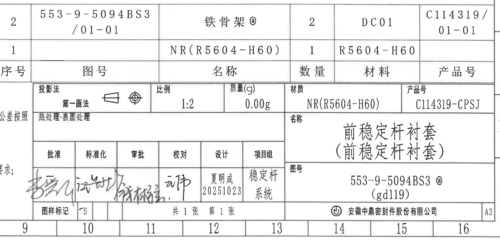

- 原图位置/视图名称：第1页右下，约 I-L / 9-16 区域；标题栏 / 明细栏 / 签署栏
- 裁切 bbox：`[2635, 2390, 4815, 3450]`

原表/原框结构还原：

| 区域 | 字段 | 原图文本 |
| --- | --- | --- |
| 明细栏 | 表头 | 序号 \| 图号 \| 名称 \| 数量 \| 材料 \| 产品号 |
| 明细栏 | 2 | 553-9-5094BS3 /01-01 \| 铁骨架ⓐ \| 2 \| DC01 \| C114319/01-01 |
| 明细栏 | 1 | NR(R5604-H60) \| 1 \| R5604-H60 |
| 标题栏 | 投影法 | 第一画法 |
| 标题栏 | 比例 | 1:2 |
| 标题栏 | 质量(g) | 0.00g |
| 标题栏 | 材质 | NR(R5604-H60) |
| 标题栏 | 产品号 | C114319-CPSJ |
| 标题栏 | 名称 | 前稳定杆衬套（前稳定杆衬套） |
| 标题栏 | 图号 | 553-9-5094BS3ⓐ (gd119) |
| 签署栏 | 批准/标准化/审批/校对/设计/项目组 | 设计:夏明成 20251023；项目组:稳定杆系统；其余为签名/手写 |
| 页脚 | 图样标记/页码/公司/图幅 | S；共1张 第1张；安徽中鼎密封件股份有限公司；A3 |

提取表格：

| 提取项 | 原图数值或文本 | 含义说明 |
| --- | --- | --- |
| 明细栏行2 | 序号2；图号553-9-5094BS3/01-01；名称铁骨架ⓐ；数量2；材料DC01；产品号C114319/01-01 | 明细栏第二行。 |
| 明细栏行1 | 序号1；名称NR(R5604-H60)；数量1；材料R5604-H60 | 明细栏第一行。 |
| 明细栏表头 | 序号、图号、名称、数量、材料、产品号 | 明细栏列名。 |
| 投影法 | 第一画法 | 投影法栏，配有投影视图符号。 |
| 比例 | 1:2 | 图纸比例。 |
| 质量 | 0.00g | 质量栏。 |
| 材质 | NR(R5604-H60) | 材料/材质栏。 |
| 产品号 | C114319-CPSJ | 产品号栏。 |
| 热处理 | 热处理:表面处理 | 热处理/表面处理栏文字。 |
| 名称 | 前稳定杆衬套（前稳定杆衬套） | 标题栏主名称。 |
| 图号 | 553-9-5094BS3ⓐ (gd119) | 标题栏图号。 |
| 签署栏 | 批准、标准化、审批、校对、设计、项目组 | 签署栏表头。 |
| 设计 | 夏明成 20251023 | 设计栏文字。 |
| 项目组 | 稳定杆系统 | 项目组栏文字。 |
| 图样标记 | S | 图样标记栏。 |
| 页码 | 共1张 第1张 | 页码栏。 |
| 公司 | 安徽中鼎密封件股份有限公司 | 公司名称。 |
| 图幅 | A3 | 图幅标记。 |

边界归属说明：裁切完整包含右下标题栏、明细栏、签署栏、比例/材质/产品号栏、图号与公司栏；左侧 NOTES 文字和底部坐标格不作为标题栏内容提取。

## 裁切检查记录

| 对象 | 检查结果 | 完整性与归属说明 |
| --- | --- | --- |
| object_1 | 通过 | 裁切保留主视图本体、A/A1 剖切箭头、详图A引出线及本视图右侧两条竖向尺寸线。右侧相邻 A-A 剖面未纳入本对象；若边缘可见相邻线段，不提取为本视图尺寸。 |
| object_2 | 通过 | 为完整包含两处 2.75、2*R2 与 2*45° 引出线，裁切左/右边缘保留少量相邻视图片段；左侧主视图竖向尺寸和右侧 C 视图的 24±0.2 不归入 A-A。 因尺寸引出线靠近邻图，裁切中可见少量邻图边缘，已在提取中严格排除。 |
| object_3 | 通过 | 裁切包含 C 向视图本体及其完整尺寸线。右侧 C-C 剖面被排除，仅保留 C 视图自身右侧竖向尺寸和圈注；下方 D 视图尺寸不归入本对象。 |
| object_4 | 通过 | C-C 剖面及所有横向尺寸线完整包含。底部有相邻行的极少量竖线边缘，不提取；右侧修订表/表格不归入本对象。 |
| object_5 | 通过 | 裁切完整包含 B 向视图外形、上方宽度、右侧高度和 B 剖切箭头。右侧可见相邻 B+B 剖面半径文字边缘，不归入本对象。 因尺寸引出线靠近邻图，裁切中可见少量邻图边缘，已在提取中严格排除。 |
| object_6 | 通过 | 裁切覆盖 B+B 半圆形剖面和全部半径引出线。右侧 D 向视图的尺寸被排除；左侧 B 视图仅因引出线需要保留少量空白。 |
| object_7 | 通过 | 裁切包含 D 向视图本体、D 剖切箭头和底部 4*5、2*10 尺寸。右侧 D-D 剖面半径标注和下方静态试验装置尺寸不归入本对象。 |
| object_8 | 通过 | 裁切完整包含 D-D 剖面、左侧半径引出线和下方参考半径。右侧表格/图框未纳入。 |
| object_9 | 通过 | 裁切包含 E 向视图、E 剖切箭头和 R19/2±0.2 尺寸。下方 F 视图尺寸不归入本对象。 |
| object_10 | 通过 | 裁切收至 E-E 剖面和 2*R1 引出线范围。下方 F-E 剖面的 2*R0.5 已排除。 |
| object_11 | 通过 | 裁切完整保留 F 向视图孔、半径、宽度和高度尺寸线。右侧 F-E 剖面边缘不归入本对象。 |
| object_12 | 通过 | 裁切仅保留弧形剖面和两侧 2*R0.5 引出线；左侧 F 向视图高度尺寸和右侧静态试验文字不归入本对象。 |
| object_13 | 通过 | 裁切把同一标题下的两个静态试验装置视图合并为一个对象。下方较大的装配剖面属于 object_14；底部稳定杆螺栓文字只按本对象试验螺纹/力矩提取。 |
| object_14 | 通过 | 裁切收至装配剖面、F1/F2、Ø26±0.3 和倒角 C2 范围；右侧详图 A 圆形放大视图不归入本对象。 |
| object_15 | 通过 | 裁切完整包含圆形放大框、倒角 C2 引出线和“详图A 3:1”文字。右侧技术要求表和下方标题栏边线已排除。 |
| object_16 | 通过 | 裁切仅包含两个空白记录框和其标题；右侧技术要求文字已排除。 |
| object_17 | 通过 | 裁切完整包含技术要求 1-10 条。右侧可见标题栏/明细栏边缘和少量签名边缘，不归入 NOTES；底部坐标格为图框边界，不作为文本提取项。 |
| object_18 | 通过 | 裁切只包含修订履历表完整边框和三行表格区域；下方表 1 标题已排除。 |
| object_19 | 通过 | 裁切完整包含表 1 的标题、表头和第 1-14 行。第 11 行右侧评价标准区小字受扫描和线条重叠影响，裁切未裁断但清晰度较低。 第11行右侧小字扫描较模糊，但表格线、文字区域和边界完整包含。 |
| object_20 | 通过 | 裁切完整包含右下标题栏、明细栏、签署栏、比例/材质/产品号栏、图号与公司栏；左侧 NOTES 文字和底部坐标格不作为标题栏内容提取。 |

## 备注

括号内尺寸均按参考尺寸处理并保留，例如 `(37)`、`(R19±0.2)`；带星号数量前缀、直径符号、角度、弧向尺寸、基准/剖切字母、圈注和公差均逐项列入对应对象。
