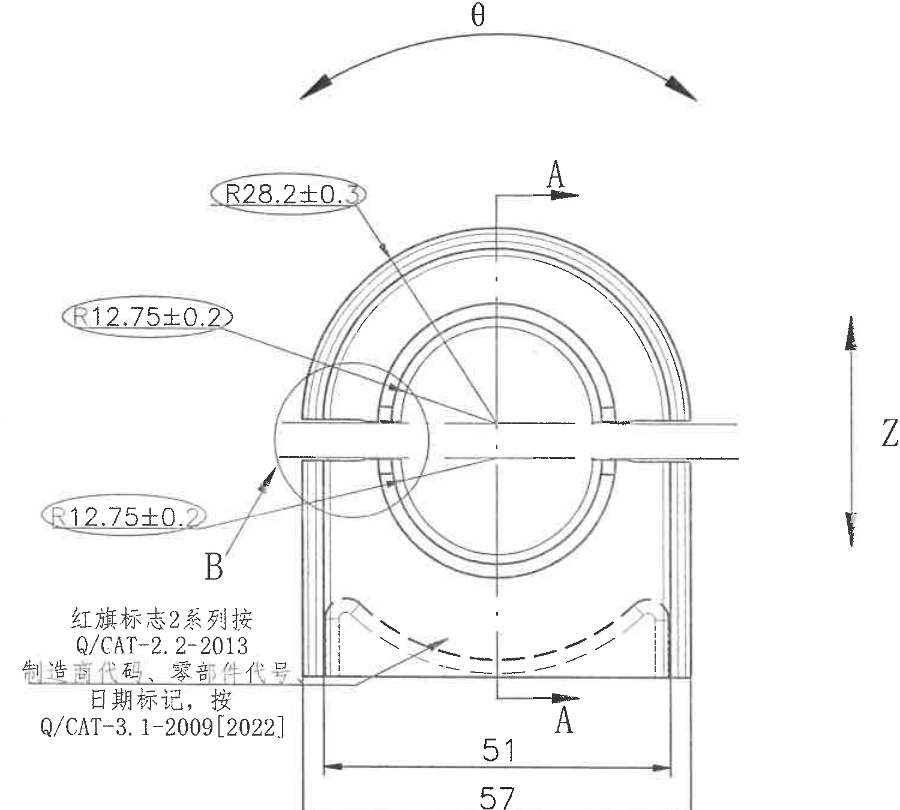
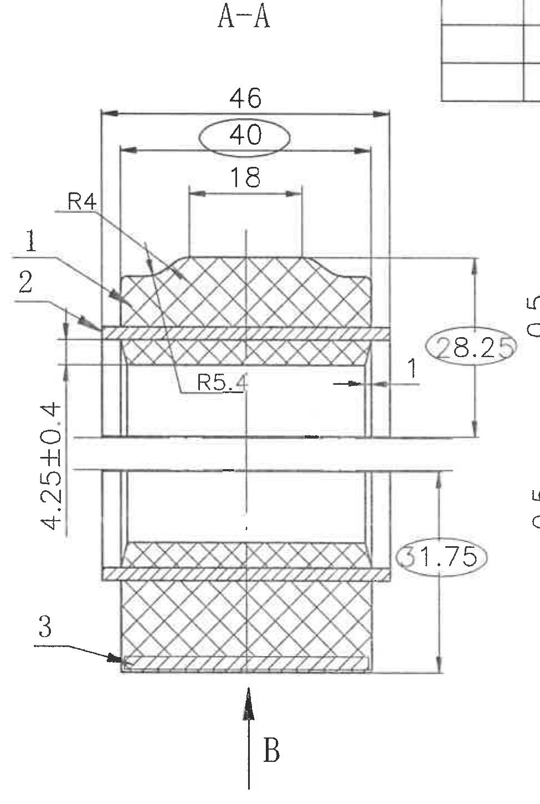
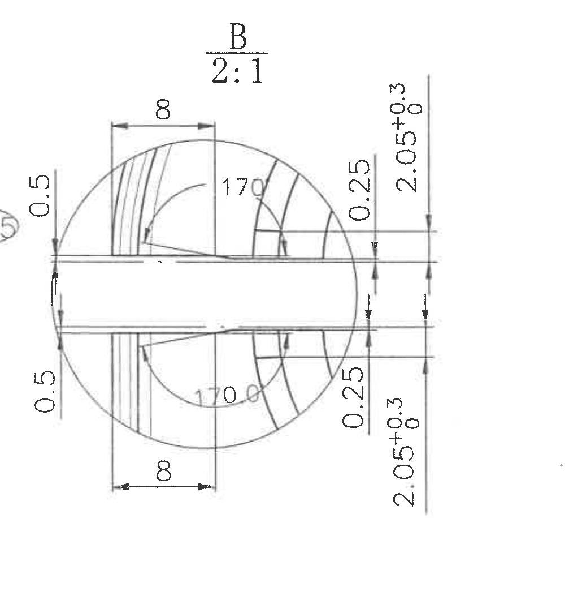
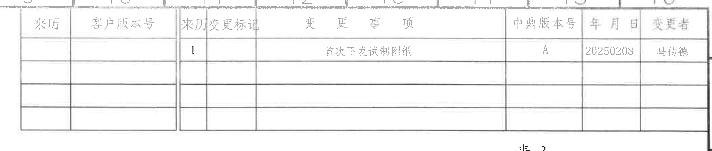
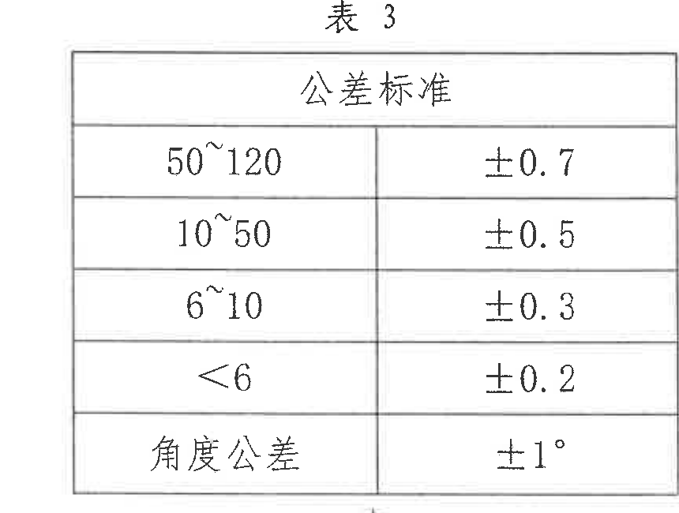
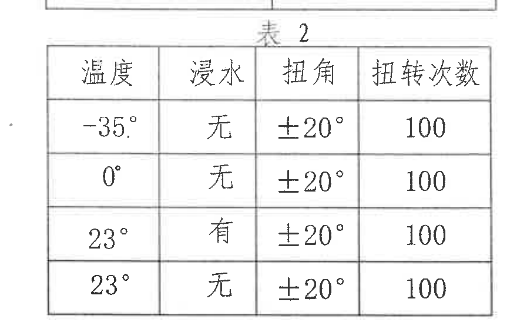
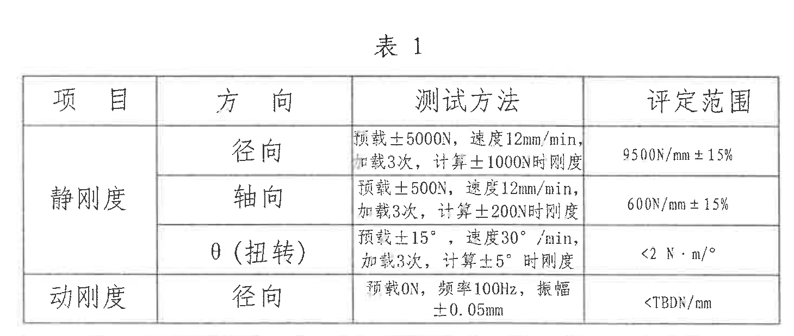
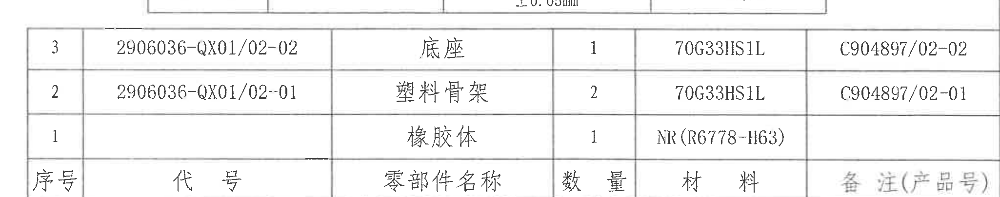
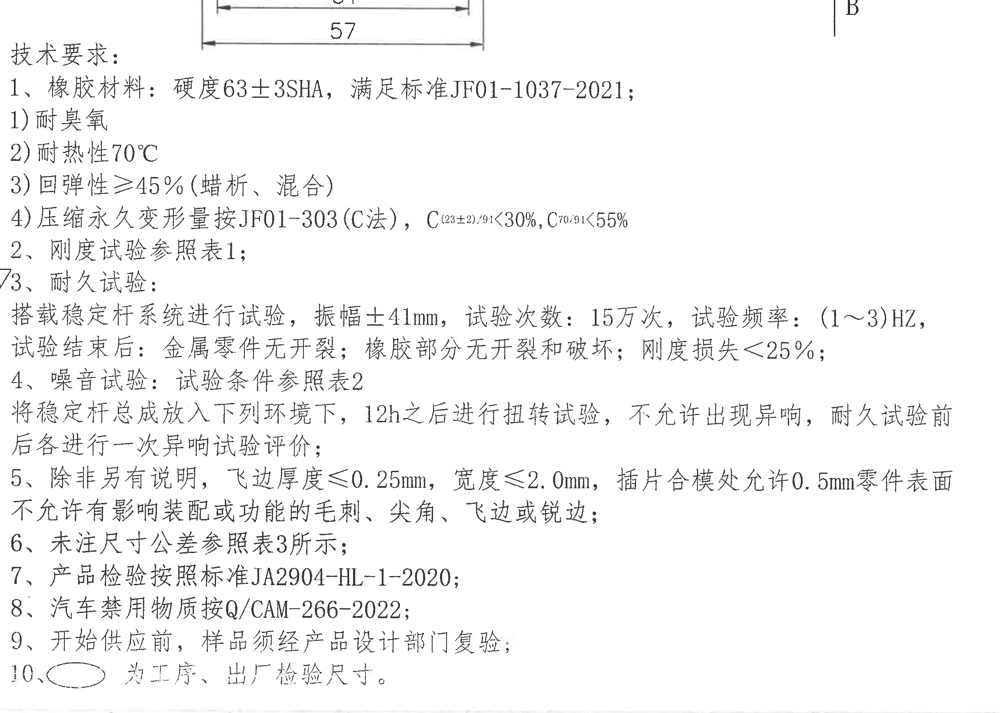
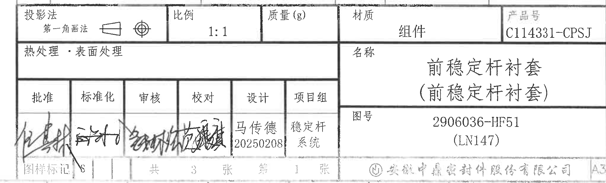

# 20C114331 PDF 内容识别

源文件：`input/20C114331.pdf`  
整页渲染图：`outputs/20C114331_assets/images/page_1.png`  
整页 PNG 尺寸：4959 x 3505 px  

说明：以下裁切对象按原图结构排列，视图、剖视图、局部视图、表格、NOTES、标题栏分别裁切。所有 bbox 均为整页 PNG 像素坐标 `[x0, y0, x1, y1]`。

## object_1 主加工视图 / 正视图

原图位置/视图名称：左侧主加工视图，bbox `[390, 430, 1890, 1780]`。

| 提取项 | 原图数值或文本 | 含义说明 |
|---|---|---|
| 弧向角度 | θ | 主视图上方弧向箭头标注，表示该结构的弧向/扭转角度方向，未给出具体数值。 |
| 圆弧半径 | R28.2±0.3 | 上部大圆弧半径，带 ±0.3 公差。 |
| 圆弧半径 | R12.75±0.2 | 左侧上方连接/过渡圆弧半径，带 ±0.2 公差。 |
| 圆弧半径 | R12.75±0.2 | 左侧下方连接/过渡圆弧半径，带 ±0.2 公差。 |
| 宽度 | 51 | 底部内侧宽度尺寸。 |
| 总宽 | 57 | 底部外侧总宽尺寸。 |
| 剖切标记 | A-A | 上下两处 A 箭头定义 A-A 剖切位置和方向。 |
| 局部索引 | B | 左侧局部放大视图 B 的索引。 |
| 方向标记 | Z | 主视图右侧竖向箭头，表示 Z 方向/加载方向。 |
| 标准文字 | 红旗标志2系列按 Q/CAT-2.2-2013 | 主视图左下文字，说明标志系列按该标准。 |
| 标准文字 | 制造商代码、零部件代号、日期标记，按 Q/CAT-3.1-2009[2022] | 主视图左下文字，说明日期和代码标记要求。 |

边界归属说明：该裁切包含主视图、A-A 剖切箭头、局部 B 索引和 Z 方向箭头；右侧未进入 A-A 剖视图主体，底部 51/57 尺寸线完整，未提取下方 NOTES 内容。

## object_2 A-A 剖视图

原图位置/视图名称：中部 A-A 剖视图，bbox `[1900, 350, 2875, 1800]`。

| 提取项 | 原图数值或文本 | 含义说明 |
|---|---|---|
| 剖视图名称 | A-A | 表示该剖面来自主视图 A-A 剖切线。 |
| 总宽 | 46 | 剖面上方外侧总宽尺寸。 |
| 参考/检验尺寸 | 40 | 椭圆圈出尺寸；按技术要求第10条，为工序、出厂检验尺寸。 |
| 内部宽度 | 18 | 上部内侧宽度尺寸。 |
| 圆角半径 | R4 | 上部肩部圆角半径。 |
| 圆角半径 | R5.4 | 内腔/过渡部位半径。 |
| 厚度/高度 | 4.25±0.4 | 左侧竖向尺寸，带 ±0.4 公差。 |
| 参考/检验尺寸 | 28.25 | 椭圆圈出尺寸；右侧上部高度/位置控制，按技术要求第10条作为工序、出厂检验尺寸。 |
| 参考/检验尺寸 | 31.75 | 椭圆圈出尺寸；右侧下部高度/位置控制，按技术要求第10条作为工序、出厂检验尺寸。 |
| 层号/编号 | 1 | 剖面左侧引出编号，指向上层/部件位置。 |
| 层号/编号 | 2 | 剖面左侧引出编号，指向中间层/部件位置。 |
| 层号/编号 | 3 | 剖面左下引出编号，指向底部层/部件位置。 |
| 局部方向 | B | 底部箭头指向局部 B 放大视图。 |

边界归属说明：右边界为保留 28.25、31.75 的完整尺寸线和文字，带入少量相邻 B 视图残线；该残线不属于 A-A 剖视图，不在本节提取。左侧未提取主视图 Z 方向箭头。

## object_3 局部视图 B 2:1

原图位置/视图名称：右中局部视图 B，比例 2:1，bbox `[2800, 575, 3830, 1635]`。

| 提取项 | 原图数值或文本 | 含义说明 |
|---|---|---|
| 局部视图名称 | B | 来自主视图和 A-A 剖视图的 B 局部索引。 |
| 比例 | 2:1 | 局部视图放大比例。 |
| 宽度 | 8 | 上侧局部条带/槽宽尺寸。 |
| 宽度 | 8 | 下侧局部条带/槽宽尺寸。 |
| 弧向角度 | 170° | 上侧弧段/夹角尺寸。 |
| 弧向角度 | 170° | 下侧弧段/夹角尺寸。 |
| 小尺寸 | 0.5 | 左上侧间隙/厚度尺寸。 |
| 小尺寸 | 0.5 | 左下侧间隙/厚度尺寸。 |
| 小尺寸 | 0.25 | 右上侧小厚度/间隙尺寸。 |
| 小尺寸 | 0.25 | 右下侧小厚度/间隙尺寸。 |
| 竖向尺寸及公差 | 2.05 +0.3/0 | 右上竖向尺寸，上偏差 +0.3，下偏差 0。 |
| 竖向尺寸及公差 | 2.05 +0.3/0 | 右下竖向尺寸，上偏差 +0.3，下偏差 0。 |

边界归属说明：该裁切只覆盖 B 局部放大视图及其尺寸；未提取 A-A 剖视图右侧尺寸，也未提取下方表1内容。

## object_4 修订履历表 / 变更事项表

原图位置/视图名称：右上修订履历表，bbox `[2635, 145, 4755, 595]`。

| 来历 | 客户版本号 | 来历变更标记 | 变更事项 | 中鼎版本号 | 年月日 | 变更者 |
|---|---|---|---|---|---|---|
|  |  | 1 | 首次下发试制图纸 | A | 20250208 | 马传德 |
|  |  |  |  |  |  |  |
|  |  |  |  |  |  |  |
|  |  |  |  |  |  |  |

| 提取项 | 原图数值或文本 | 含义说明 |
|---|---|---|
| 表格用途 | 变更事项 | 记录图纸下发和版本变更历史。 |
| 记录 | 首次下发试制图纸 | 第 1 条变更记录。 |
| 版本 | A | 中鼎版本号。 |
| 日期 | 20250208 | 变更日期。 |
| 变更者 | 马传德 | 变更人员。 |

边界归属说明：仅提取修订履历表；下方局部 B 和表3不属于本对象。

## object_5 表3 公差标准

原图位置/视图名称：右上表3，bbox `[3760, 575, 4620, 1225]`。

| 公差标准 |  |
|---|---|
| 50~120 | ±0.7 |
| 10~50 | ±0.5 |
| 6~10 | ±0.3 |
| <6 | ±0.2 |
| 角度公差 | ±1° |

| 提取项 | 原图数值或文本 | 含义说明 |
|---|---|---|
| 未注尺寸公差 | 50~120 -> ±0.7 | 尺寸范围 50 到 120 的默认公差。 |
| 未注尺寸公差 | 10~50 -> ±0.5 | 尺寸范围 10 到 50 的默认公差。 |
| 未注尺寸公差 | 6~10 -> ±0.3 | 尺寸范围 6 到 10 的默认公差。 |
| 未注尺寸公差 | <6 -> ±0.2 | 尺寸小于 6 的默认公差。 |
| 角度公差 | ±1° | 未注角度的默认公差。 |

边界归属说明：表号“表3”和表格外框完整；底部靠近表2标题，未将表2数据归入本对象。

## object_6 表2 噪音/扭转试验条件

原图位置/视图名称：右中表2，bbox `[3775, 1185, 4655, 1745]`。

| 温度 | 浸水 | 扭角 | 扭转次数 |
|---|---|---|---|
| -35° | 无 | ±20° | 100 |
| 0° | 无 | ±20° | 100 |
| 23° | 有 | ±20° | 100 |
| 23° | 无 | ±20° | 100 |

| 提取项 | 原图数值或文本 | 含义说明 |
|---|---|---|
| 试验条件 | -35° / 无 / ±20° / 100 | 低温无浸水扭转条件。 |
| 试验条件 | 0° / 无 / ±20° / 100 | 0° 无浸水扭转条件。 |
| 试验条件 | 23° / 有 / ±20° / 100 | 常温浸水扭转条件。 |
| 试验条件 | 23° / 无 / ±20° / 100 | 常温无浸水扭转条件。 |

边界归属说明：顶部接近表3底边，为保留表2表号，裁图中可见上方相邻线迹；表3内容不在本对象提取。

## object_7 表1 刚度试验表

原图位置/视图名称：右下中部表1，bbox `[2960, 1750, 4420, 2370]`。

| 项目 | 方向 | 测试方法 | 评定范围 |
|---|---|---|---|
| 静刚度 | 径向 | 预载±5000N，速度12mm/min，加载3次，计算±1000N时刚度 | 9500N/mm±15% |
| 静刚度 | 轴向 | 预载±500N，速度12mm/min，加载3次，计算±200N时刚度 | 600N/mm±15% |
| 静刚度 | θ（扭转） | 预载±15°，速度30°/min，加载3次，计算±5°时刚度 | <2 N·m/° |
| 动刚度 | 径向 | 预载0N，频率100Hz，振幅±0.05mm | <TBDN/cm |

| 提取项 | 原图数值或文本 | 含义说明 |
|---|---|---|
| 静刚度径向 | 9500N/mm±15% | 径向静刚度判定范围。 |
| 静刚度轴向 | 600N/mm±15% | 轴向静刚度判定范围。 |
| 静刚度扭转 | <2 N·m/° | θ 扭转刚度判定范围。 |
| 动刚度径向 | <TBDN/cm | 径向动刚度判定范围。 |
| 动刚度振幅 | ±0.05mm | 动刚度测试振幅。 |

边界归属说明：表号、表头、所有行列完整；下方标题栏未进入本裁切对象。

## object_8 零部件明细表 / BOM

原图位置/视图名称：右下零部件明细表，bbox `[2700, 2320, 4750, 2725]`。

| 序号 | 代号 | 零部件名称 | 数量 | 材料 | 备注(产品号) |
|---|---|---|---|---|---|
| 3 | 2906036-QX01/02-02 | 底座 | 1 | 70G33HS1L | C904897/02-02 |
| 2 | 2906036-QX01/02-01 | 塑料骨架 | 2 | 70G33HS1L | C904897/02-01 |
| 1 |  | 橡胶体 | 1 | NR(R6778-H63) |  |

| 提取项 | 原图数值或文本 | 含义说明 |
|---|---|---|
| 零件3 | 底座 / 2906036-QX01/02-02 / 1 / 70G33HS1L / C904897/02-02 | 底座零件，数量 1，材料 70G33HS1L。 |
| 零件2 | 塑料骨架 / 2906036-QX01/02-01 / 2 / 70G33HS1L / C904897/02-01 | 塑料骨架，数量 2，材料 70G33HS1L。 |
| 零件1 | 橡胶体 / 1 / NR(R6778-H63) | 橡胶体，数量 1，材料 NR(R6778-H63)。 |

边界归属说明：顶部有表1底边残线但未提取；该对象只提取 BOM 表格行列。下方标题栏单独作为 object_10。

## object_9 技术要求 / NOTES

原图位置/视图名称：左下技术要求，bbox `[430, 1690, 2730, 3330]`。

| 提取项 | 原图数值或文本 | 含义说明 |
|---|---|---|
| 1 | 橡胶材料：硬度63±3SHA，满足标准JF01-1037-2021 | 材料和硬度要求。 |
| 1-1 | 耐臭氧 | 橡胶材料性能要求。 |
| 1-2 | 耐热性70°C | 耐热性能要求。 |
| 1-3 | 回弹性≥45%（蜡析、混合） | 回弹性能要求。 |
| 1-4 | 压缩永久变形量按JF01-303(C法)，C(23±2)/91<30%，C70/91<55% | 压缩永久变形标准和限值。 |
| 2 | 刚度试验参照表1 | 刚度试验按表1执行。 |
| 3 | 耐久试验：搭载稳定杆系统进行试验，振幅±41mm，试验次数：15万次，试验频率：(1~3)HZ；试验结束后：金属零件无开裂；橡胶部分无开裂和破坏；刚度损失<25% | 耐久试验条件和判定。 |
| 4 | 噪音试验：试验条件参照表2；将稳定杆总成放入下列环境下，12h之后进行扭转试验，不允许出现异响，耐久试验前后各进行一次异响试验评价 | 噪音/异响试验要求。 |
| 5 | 除非另有说明，飞边厚度≤0.25mm，宽度≤2.0mm，插件合模处允许0.5mm，零件表面不允许有影响装配或功能的毛刺、尖角、飞边或锐边 | 外观、飞边和锐边要求。 |
| 6 | 未注尺寸公差参照表3所示 | 默认尺寸公差依据表3。 |
| 7 | 产品检验按照标准JA2904-HL-1-2020 | 产品检验标准。 |
| 8 | 汽车禁用物质按Q/CAM-266-2022 | 禁用物质标准。 |
| 9 | 开始供应前，样品须经产品设计部门复验 | 供样复验要求。 |
| 10 | 椭圆圈出尺寸为工序、出厂检验尺寸 | 对椭圆圈出尺寸的含义说明。 |

边界归属说明：为完整包含第1-10条，裁切顶部带入主视图底部 51/57 尺寸线和右侧 B 箭头残段；这些残段不属于 NOTES，未在本节作为技术要求提取。

## object_10 标题栏

原图位置/视图名称：右下标题栏，bbox `[2700, 2720, 4750, 3340]`。

| 提取项 | 原图数值或文本 | 含义说明 |
|---|---|---|
| 投影法 | 第一角画法 | 图纸投影法。 |
| 比例 | 1:1 | 图纸比例。 |
| 质量(g) | 空 | 原图该栏未填。 |
| 材质 | 组件 | 标题栏材质/状态字段。 |
| 产品号 | C114331-CPSJ | 产品号字段。 |
| 热处理·表面处理 | 空 | 原图该栏未填。 |
| 名称 | 前稳定杆衬套（前稳定杆衬套） | 零件/组件名称。 |
| 图号 | 2906036-HF51 (LN147) | 图纸编号。 |
| 批准 | 手写签名 | 签署栏，手写内容不清。 |
| 标准化 | 手写签名 | 签署栏，手写内容不清。 |
| 审核 | 手写签名 | 签署栏，手写内容不清。 |
| 校对 | 手写签名 | 签署栏，手写内容不清。 |
| 设计 | 马传德 / 20250208 | 设计人员与日期。 |
| 项目组 | 稳定杆系统 | 项目组字段。 |
| 图样标记 | S | 图样标记字段。 |
| 页数 | 共3张，第1张 | 图纸张数和当前张号。 |
| 公司 | 安徽中鼎密封件股份有限公司 | 出图公司。 |
| 图幅 | A3 | 图幅。 |

边界归属说明：顶部与 BOM 明细表共边，裁图顶部可见相邻边线；标题栏字段完整，BOM 行列已在 object_8 单独提取。

## 裁切检查记录

| 对象 | 图片路径 | bbox | 检查结论 | 边界处理 |
|---|---|---|---|---|
| object_1 | outputs/20C114331_assets/images/object_1.png | [390, 430, 1890, 1780] | 主视图尺寸线、箭头、文字完整。 | 扩展右边界纳入 Z 方向箭头；未提取 A-A 剖视图主体。 |
| object_2 | outputs/20C114331_assets/images/object_2.png | [1900, 350, 2875, 1800] | A-A 尺寸线、文字、剖面线、B 箭头完整。 | 右侧为保留 28.25/31.75，带少量 B 视图残线，不提取残线内容。 |
| object_3 | outputs/20C114331_assets/images/object_3.png | [2800, 575, 3830, 1635] | B 局部视图圆形轮廓、所有 8、170°、0.5、0.25、2.05+0.3/0 标注完整。 | 未带入下方表1；左侧未归入 A-A 尺寸。 |
| object_4 | outputs/20C114331_assets/images/object_4.png | [2635, 145, 4755, 595] | 修订表外框、表头和记录完整。 | 不提取下方局部 B/表3。 |
| object_5 | outputs/20C114331_assets/images/object_5.png | [3760, 575, 4620, 1225] | 表3表号、外框和全部行完整。 | 底部靠近表2，未提取表2。 |
| object_6 | outputs/20C114331_assets/images/object_6.png | [3775, 1185, 4655, 1745] | 表2表号、表头和四行完整。 | 顶部有表3相邻线迹，未提取表3内容。 |
| object_7 | outputs/20C114331_assets/images/object_7.png | [2960, 1750, 4420, 2370] | 表1表号、表头、四行和外框完整。 | 未带入标题栏。 |
| object_8 | outputs/20C114331_assets/images/object_8.png | [2700, 2320, 4750, 2725] | BOM 三行、表头和备注列完整。 | 顶部有表1底边残线，未提取；标题栏另裁。 |
| object_9 | outputs/20C114331_assets/images/object_9.png | [430, 1690, 2730, 3330] | 技术要求 1-10 条完整。 | 顶部有主视图 51/57 尺寸线残留，不归入 NOTES。 |
| object_10 | outputs/20C114331_assets/images/object_10.png | [2700, 2720, 4750, 3340] | 标题栏字段、签署栏、产品号、图号、公司和 A3 图幅完整。 | 顶部与 BOM 共边，仅提取标题栏字段。 |
