# 20C114337 内容识别与裁切提取

整页 PNG：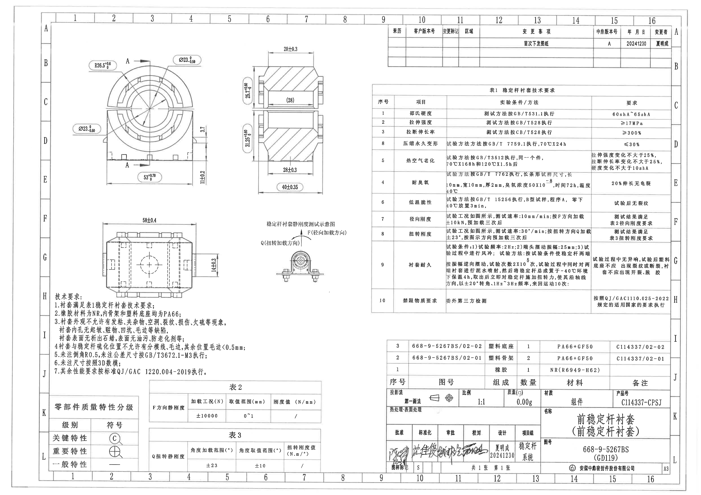

说明：以下对象按原图结构从上到下、从左到右排列。所有尺寸、参考尺寸、角度、加载方向、表格字段和标题栏字段均按裁切对象归属提取；原图存在的序号不连续或重复按原图保留。

## object_1 主视图 / 正视加工视图

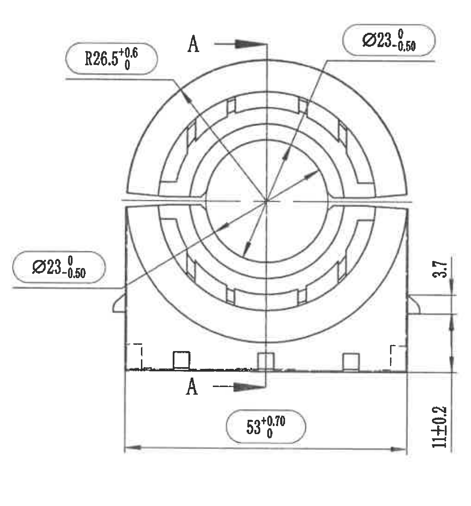

原图位置/视图名称：page 1，bbox [650, 450, 2000, 1900]，主视图 / 正视加工视图，含 A-A 剖切位置。

| 提取项 | 原图数值或文本 | 含义说明 |
|---|---|---|
| 圆弧半径 | R26.5(+0.6/0) | 上部外圆弧半径；下偏差 0，上偏差 +0.6。 |
| 直径 | Ø23(0/-0.50) | 上方引出线指向内孔/圆柱特征；直径 23，上偏差 0，下偏差 -0.50。 |
| 直径 | Ø23(0/-0.50) | 左侧引出线指向同类内孔/圆柱特征；直径 23，上偏差 0，下偏差 -0.50。 |
| 总宽 | 53(+0.70/0) | 底部水平尺寸，表示主视图底部总宽；下偏差 0，上偏差 +0.70。 |
| 局部高度/台阶 | 3.7 | 右侧靠上短竖向尺寸，表示开口/台阶处局部高度差。 |
| 底部高度 | 11±0.2 | 右侧底部竖向尺寸，表示底座相关高度。 |
| 剖切标识 | A / A | 剖切箭头和字母指示 A-A 剖面视图的位置与方向。 |

边界归属说明：右侧 `3.7`、`11±0.2` 的尺寸线和箭头均围绕主视图右边界，归属 object_1；右侧 A-A 剖视图的尺寸未混入本对象。

## object_2 A-A 剖面视图

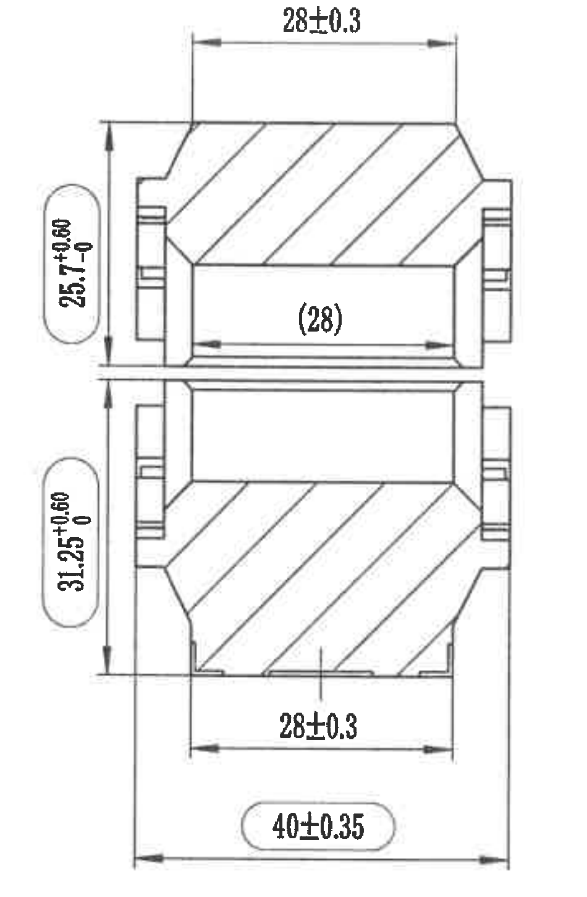

原图位置/视图名称：page 1，bbox [2220, 430, 3170, 1880]，A-A 剖面视图 / 纵向剖切加工视图。

| 提取项 | 原图数值或文本 | 含义说明 |
|---|---|---|
| 水平宽度 | 28±0.3 | 剖面上部水平尺寸，公差 ±0.3。 |
| 参考尺寸 | (28) | 剖面中部内腔长度，括号表示参考尺寸，用于说明结构对应关系，不作为主要控制尺寸。 |
| 上半高度 | 25.7(+0.60/0) | 左侧上段竖向尺寸；下偏差 0，上偏差 +0.60。 |
| 下半高度 | 31.25(+0.60/0) | 左侧下段竖向尺寸；下偏差 0，上偏差 +0.60。 |
| 水平宽度 | 28±0.3 | 剖面下部水平尺寸，公差 ±0.3。 |
| 总宽 | 40±0.35 | 剖面底部总宽，公差 ±0.35。 |

边界归属说明：本对象只提取 A-A 剖面内尺寸；`(28)` 虽为参考尺寸但仍按要求提取并说明。左侧主视图尺寸不归入本对象。

## object_3 下方俯视/侧向加工视图

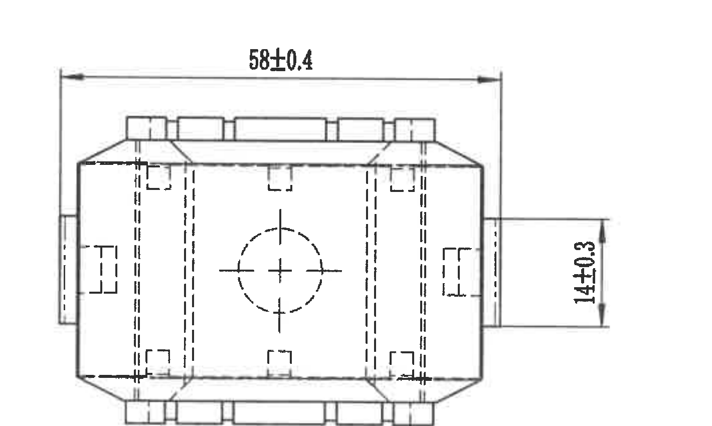

原图位置/视图名称：page 1，bbox [850, 1960, 2270, 2810]，下方俯视/侧向加工视图。

| 提取项 | 原图数值或文本 | 含义说明 |
|---|---|---|
| 总长 | 58±0.4 | 顶部水平尺寸，表示该视图方向的零件总长。 |
| 侧向局部尺寸 | 14±0.3 | 右侧竖向尺寸，表示侧向局部高度/宽度。 |
| 隐藏结构 | 虚线孔/槽 | 中心圆与侧向虚线表示不可见孔、槽或内部结构。 |

边界归属说明：`58±0.4` 的两端箭头完整位于本裁切内；`14±0.3` 右侧尺寸线完整。下方技术要求未纳入本对象。

## object_4 稳定杆衬套静刚度测试示意图

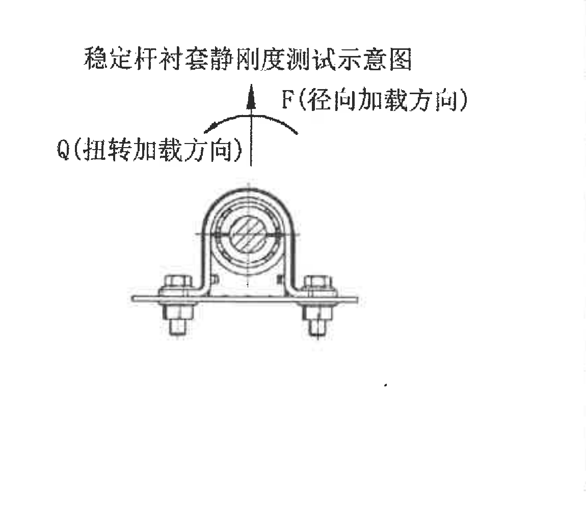

原图位置/视图名称：page 1，bbox [2350, 2000, 3500, 3000]，稳定杆衬套静刚度测试示意图 / 局部示意。

| 提取项 | 原图数值或文本 | 含义说明 |
|---|---|---|
| 标题 | 稳定杆衬套静刚度测试示意图 | 说明该图用于刚度试验工况。 |
| 径向加载方向 | F(径向加载方向) | 竖直箭头向上，表示径向加载方向 F。 |
| 扭转加载方向 | Q(扭转加载方向) | 弧形箭头表示扭转载荷方向 Q。 |

边界归属说明：该对象仅为试验示意，不含加工尺寸。表 1、表 2、表 3 的数值要求不并入本局部图。

## object_5 修订履历表 / 变更记录

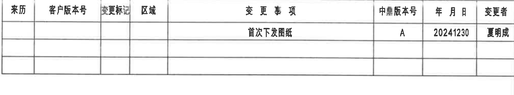

原图位置/视图名称：page 1，bbox [3650, 240, 6330, 740]，修订履历表。

| 来历 | 客户版本号 | 变更标记 | 区域 | 变更事项 | 中鼎版本号 | 年月日 | 变更者 |
|---|---|---|---|---|---|---|---|
|  |  |  |  | 首次下发图纸 | A | 20241230 | 夏明成 |
|  |  |  |  |  |  |  |  |
|  |  |  |  |  |  |  |  |

| 提取项 | 原图数值或文本 | 含义说明 |
|---|---|---|
| 变更事项 | 首次下发图纸 | 首次发布/下发该图纸。 |
| 中鼎版本号 | A | 当前中鼎版本为 A。 |
| 年月日 | 20241230 | 变更日期。 |
| 变更者 | 夏明成 | 变更者姓名。 |

边界归属说明：本裁切为修订履历表，未提取下方表 1 技术要求内容。

## object_6 表 1 稳定杆衬套技术要求

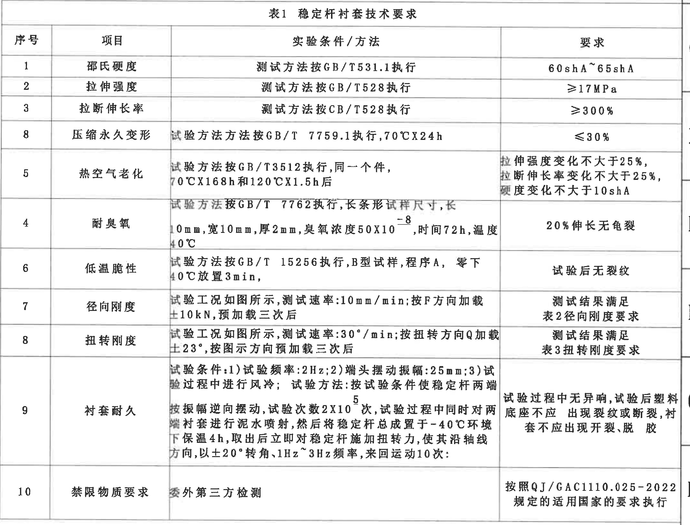

原图位置/视图名称：page 1，bbox [3505, 795, 6365, 2975]，表 1 稳定杆衬套技术要求。

| 序号 | 项目 | 实验条件 / 方法 | 要求 |
|---|---|---|---|
| 1 | 邵氏硬度 | 测试方法按 GB/T531.1 执行 | 60shA~65shA |
| 2 | 拉伸强度 | 测试方法按 GB/T528 执行 | ≥17MPa |
| 3 | 拉断伸长率 | 测试方法按 CB/T528 执行 | ≥300% |
| 8 | 压缩永久变形 | 试验方法按 GB/T 7759.1 执行，70℃X24h | ≤30% |
| 5 | 热空气老化 | 试验方法按 GB/T3512 执行，同一个件，70℃X168h 和 120℃X1.5h 后 | 拉伸强度变化不大于25%，拉断伸长率变化不大于25%，硬度变化不大于10shA |
| 4 | 耐臭氧 | 试验方法按 GB/T 7762 执行，长条形试样尺寸，长10mm，宽10mm，厚2mm，臭氧浓度50X10^-8，时间72h，温度40℃ | 20%伸长无龟裂 |
| 6 | 低温脆性 | 试验方法按 GB/T 15256 执行，B型试样，程序A，零下40℃放置3min | 试验后无裂纹 |
| 7 | 径向刚度 | 试验工况如图所示，测试速率：10mm/min；按F方向加载±10kN，预加载三次后 | 测试结果满足表2径向刚度要求 |
| 8 | 扭转刚度 | 试验工况如图所示，测试速率：30°/min；按扭转方向Q加载±23°，按图示方向预加载三次后 | 测试结果满足表3扭转刚度要求 |
| 9 | 衬套耐久 | 试验条件：1)试验频率：2Hz；2)端头摆动振幅：25mm；3)试验过程中进行风冷；试验方法：按试验条件使稳定杆两端按振幅逆向摆动，试验次数2X10^5次，试验过程中同时对两端衬套进行泥水喷射，然后将稳定杆总成置于-40℃环境下保温4h，取出后立即对稳定杆施加扭转力，使其沿轴线方向，以±20°转角，1Hz~3Hz频率，来回运动10次； | 试验过程中无异响，试验后塑料底座不应出现裂纹或断裂，衬套不应出现开裂、脱胶 |
| 10 | 禁限物质要求 | 委外第三方检测 | 按照 QJ/GAC1110.025-2022 规定的适用国家的要求执行 |

| 提取项 | 原图数值或文本 | 含义说明 |
|---|---|---|
| 标准号 | GB/T531.1、GB/T528、CB/T528、GB/T 7759.1、GB/T3512、GB/T 7762、GB/T 15256、QJ/GAC1110.025-2022 | 按原图逐项提取；其中 CB/T528 按图面字符保留。 |
| 温度/时间 | 70℃X24h；70℃X168h；120℃X1.5h；40℃；零下40℃放置3min；-40℃保温4h | 环境与老化、低温、耐久条件。 |
| 载荷/速度/角度 | 10mm/min；±10kN；30°/min；±23°；±20°；1Hz~3Hz | 径向刚度、扭转刚度和耐久试验条件。 |
| 次数/频率 | 2Hz；2X10^5次；10次 | 耐久试验频率和循环次数。 |

边界归属说明：表 1 右侧图框坐标字母未作为表格内容提取；下方明细/标题栏不属于本表。序号 `8` 重复、`4/5/8` 顺序按原图保留。

## object_7 技术要求 / NOTES

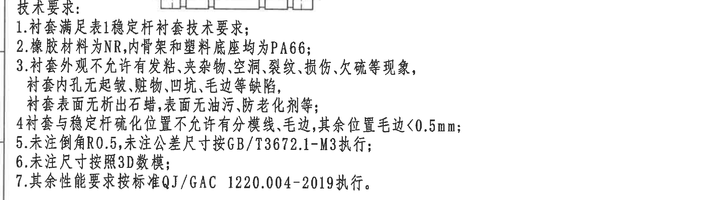

原图位置/视图名称：page 1，bbox [450, 2770, 3300, 3580]，技术要求 / NOTES。

| 提取项 | 原图数值或文本 | 含义说明 |
|---|---|---|
| 1 | 衬套满足表1稳定杆衬套技术要求； | 总要求，引用表 1。 |
| 2 | 橡胶材料为NR,内骨架和塑料底座均为PA66； | 材料要求。 |
| 3 | 衬套外观不允许有发粘、夹杂物、空洞、裂纹、损伤、欠硫等现象，衬套内孔无起皱、脏物、凹坑、毛边等缺陷，衬套表面无析出石蜡，表面无油污、防老化剂等； | 外观、内孔和表面缺陷控制。 |
| 4 | 衬套与稳定杆硫化位置不允许有分模线、毛边,其余位置毛边<0.5mm； | 硫化位置及毛边限值。 |
| 5 | 未注倒角R0.5,未注公差尺寸按GB/T3672.1-M3执行； | 未注倒角和未注公差执行依据。 |
| 6 | 未注尺寸按照3D数模； | 未注尺寸来源。 |
| 7 | 其余性能要求按标准QJ/GAC 1220.004-2019执行。 | 其余性能标准。 |

边界归属说明：本对象顶部有少量相邻下方视图底边线残留，仅作为裁切边界参照，不提取为 NOTES 内容；表 2 不在该对象中。

## object_8 零部件质量特性分级表

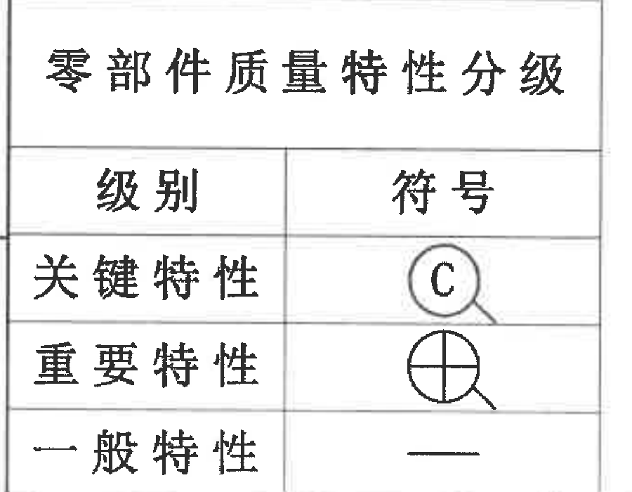

原图位置/视图名称：page 1，bbox [450, 3740, 1350, 4440]，零部件质量特性分级表。

| 级别 | 符号 |
|---|---|
| 关键特性 | C（圆圈符号） |
| 重要特性 | 圆圈十字符号 |
| 一般特性 | 一横线符号 |

| 提取项 | 原图数值或文本 | 含义说明 |
|---|---|---|
| 关键特性 | C（圆圈符号） | 用于标注关键质量特性。 |
| 重要特性 | 圆圈十字符号 | 用于标注重要质量特性。 |
| 一般特性 | 一横线符号 | 用于标注一般质量特性。 |

边界归属说明：表格底部图框坐标数字未纳入提取内容。

## object_9 表 2 F方向静刚度

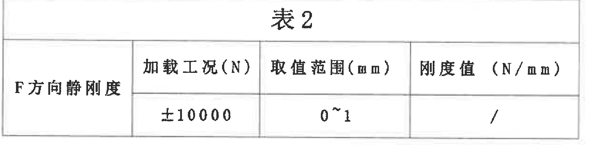

原图位置/视图名称：page 1，bbox [1400, 3600, 3100, 4010]，表 2 F方向静刚度。

| 项目 | 加载工况(N) | 取值范围(mm) | 刚度值（N/mm） |
|---|---|---|---|
| F方向静刚度 | ±10000 | 0~1 | / |

| 提取项 | 原图数值或文本 | 含义说明 |
|---|---|---|
| 加载工况 | ±10000 N | F 方向径向静刚度加载范围。 |
| 取值范围 | 0~1 mm | 刚度取值位移范围。 |
| 刚度值 | / | 原图未给出具体刚度值。 |

边界归属说明：表 2 独立裁出，未提取上方 NOTES 或下方表 3 内容。

## object_10 表 3 Q扭转静刚度

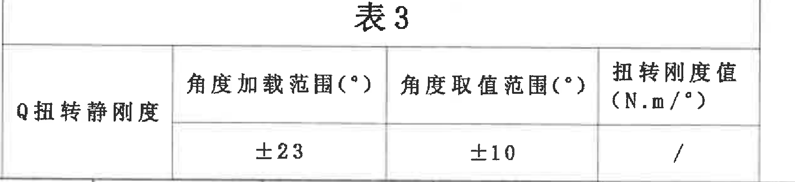

原图位置/视图名称：page 1，bbox [1400, 4070, 3100, 4460]，表 3 Q扭转静刚度。

| 项目 | 角度加载范围(°) | 角度取值范围(°) | 扭转刚度值（N.m/°） |
|---|---|---|---|
| Q扭转静刚度 | ±23 | ±10 | / |

| 提取项 | 原图数值或文本 | 含义说明 |
|---|---|---|
| 角度加载范围 | ±23° | Q 扭转方向加载角度范围。 |
| 角度取值范围 | ±10° | 扭转刚度取值角度范围。 |
| 扭转刚度值 | / | 原图未给出具体扭转刚度值。 |

边界归属说明：表 3 独立裁出，底部图框列号未作为表格内容提取。

## object_11 明细表 / BOM

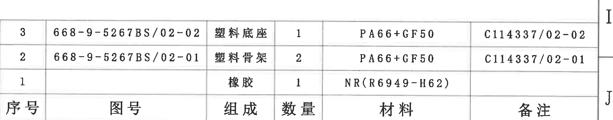

原图位置/视图名称：page 1，bbox [3650, 3120, 6390, 3660]，明细表 / BOM。

| 序号 | 图号 | 组成 | 数量 | 材料 | 备注 |
|---|---|---|---|---|---|
| 3 | 668-9-5267BS/02-02 | 塑料底座 | 1 | PA66+GF50 | C114337/02-02 |
| 2 | 668-9-5267BS/02-01 | 塑料骨架 | 2 | PA66+GF50 | C114337/02-01 |
| 1 |  | 橡胶 | 1 | NR(R6949-H62) |  |

| 提取项 | 原图数值或文本 | 含义说明 |
|---|---|---|
| 塑料底座 | 668-9-5267BS/02-02；数量 1；PA66+GF50；备注 C114337/02-02 | 明细表序号 3。 |
| 塑料骨架 | 668-9-5267BS/02-01；数量 2；PA66+GF50；备注 C114337/02-01 | 明细表序号 2。 |
| 橡胶 | 数量 1；NR(R6949-H62) | 明细表序号 1，图号和备注为空白。 |

边界归属说明：本对象只含明细表主体；下方投影法、比例、质量、名称和图号等标题栏字段归 object_12。

## object_12 标题栏

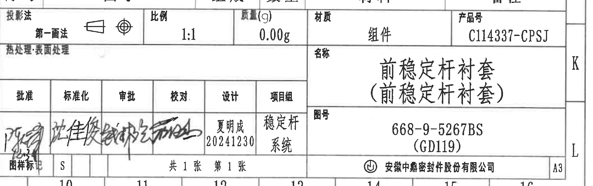

原图位置/视图名称：page 1，bbox [3650, 3630, 6450, 4510]，标题栏。

| 提取项 | 原图数值或文本 | 含义说明 |
|---|---|---|
| 投影法 | 第一画法 | 图纸投影方法。 |
| 比例 | 1:1 | 绘图比例。 |
| 质量(g) | 0.00g | 标题栏质量字段。 |
| 材质 | 组件 | 标题栏材质字段。 |
| 产品号 | C114337-CPSJ | 产品编号。 |
| 热处理/表面处理 | 表面处理 | 标题栏左侧处理字段。 |
| 名称 | 前稳定杆衬套（前稳定杆衬套） | 零件/组件名称。 |
| 图号 | 668-9-5267BS（GD119） | 图纸编号。 |
| 设计 | 夏明成 20241230 | 设计者和日期。 |
| 项目组 | 稳定杆系统 | 项目组字段。 |
| 图样标记 | S | 图样标记字段。 |
| 张数 | 共1张 第1张 | 页张信息。 |
| 公司 | 安徽中鼎密封件股份有限公司 | 图纸所属公司。 |
| 图幅 | A3 | 图纸幅面。 |
| 签署栏 | 批准、标准化、审批、校对为手写签名/签署 | 签署栏按原图保留为手写内容，不扩展识别姓名。 |

边界归属说明：标题栏与上方明细表分开提取；底部图框坐标数字不作为标题栏字段。

## 裁切检查记录

| 对象 | 检查结果 |
|---|---|
| object_1 主视图 | 完整包含 R26.5、两个 Ø23、53、3.7、11±0.2、A-A 剖切箭头和尺寸线；未混入 A-A 剖视图尺寸。 |
| object_2 A-A 剖面视图 | 完整包含 28±0.3、(28)、25.7、31.25、40±0.35 的文字、箭头和尺寸线；未混入主视图。 |
| object_3 下方俯视/侧向视图 | 经重裁后完整包含 58±0.4 和 14±0.3；技术要求文字已排除。 |
| object_4 静刚度测试示意图 | 经重裁后完整包含标题、F/Q 方向文字和箭头；未混入表格。 |
| object_5 修订履历表 | 经重裁后表头和记录行完整；未提取下方表 1 内容。 |
| object_6 表 1 | 表题、表头、全部 10 行技术要求完整；右侧图框坐标未作为表格字段提取。 |
| object_7 技术要求 | 经重裁后 1-7 条文字完整；顶部残留的相邻视图底边线不提取为 NOTES 内容。 |
| object_8 质量特性分级表 | 表题、表头、三行符号完整；底部图框数字未提取。 |
| object_9 表 2 | 表题、表头和 F 方向静刚度数据完整；未混入表 3。 |
| object_10 表 3 | 表题、表头和 Q 扭转静刚度数据完整；底部图框列号未提取。 |
| object_11 明细表 | 三行明细和表头完整；右侧图框坐标列已排除。 |
| object_12 标题栏 | 标题栏字段完整；上方明细表不作为标题栏字段提取。 |
