# 20C114339 内容识别

源文件：`input/20C114339.pdf`

整页渲染图：`outputs/20C114339_assets/images/page_1.png`

页面信息：1 页，整页 PNG 尺寸 4959 x 3505 px。以下对象均从整页 PNG 裁切得到，bbox 坐标为 `[x, y, width, height]`，单位为像素。

## object_1：左上主视图

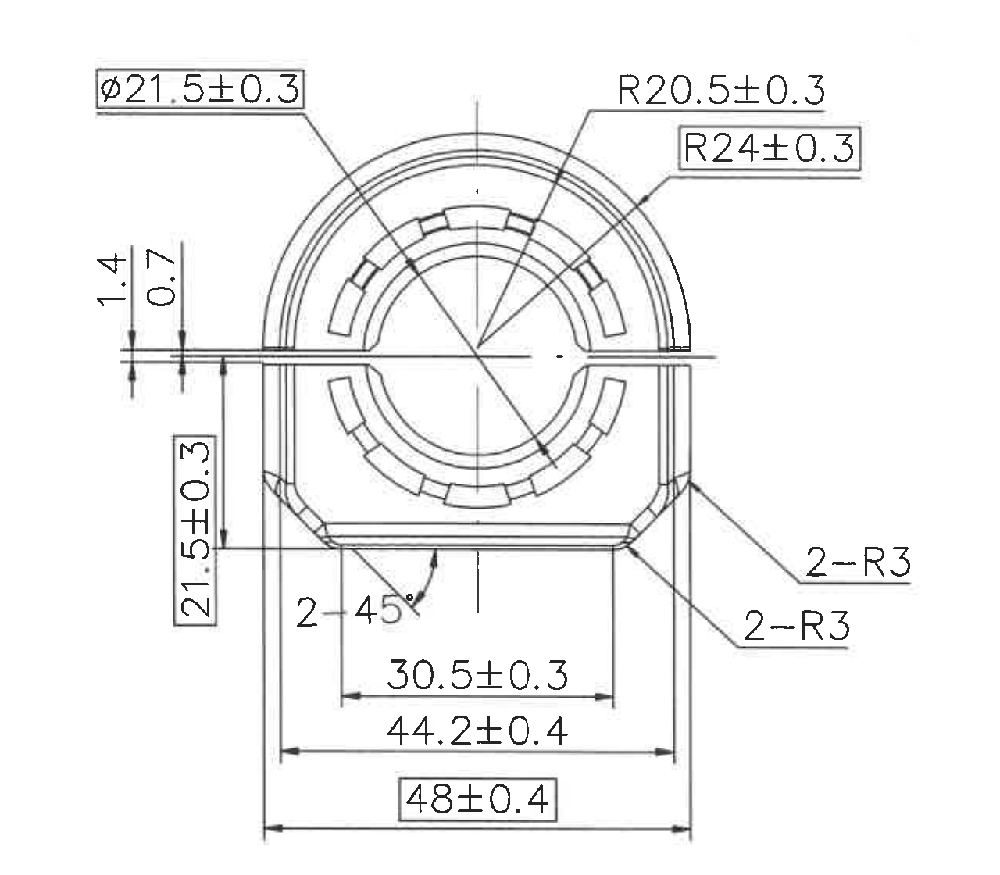

原图位置/视图名称：第 1 页左上主视图，bbox `[420, 440, 1280, 1120]`。

| 提取项 | 原图数值或文本 | 含义说明 |
|---|---:|---|
| 内孔/圆柱直径 | `φ21.5±0.3` | 圆孔或内圆相关直径尺寸，直径符号 `φ` 表示圆形特征，公差为 ±0.3。 |
| 上部外弧半径 | `R20.5±0.3` | 上部圆弧半径，公差 ±0.3。 |
| 外侧大圆弧半径 | `R24±0.3` | 外轮廓圆弧半径，公差 ±0.3。 |
| 左侧台阶高度 1 | `1.4` | 水平分型/边缘附近的短高度尺寸。 |
| 左侧台阶高度 2 | `0.7` | 与 `1.4` 同区域的短高度尺寸。 |
| 左侧垂直高度 | `21.5±0.3` | 主视图左侧至底部台阶的垂直尺寸，公差 ±0.3。 |
| 倒角数量与角度 | `2-45°` | 两处 45 度倒角。 |
| 下部内宽 | `30.5±0.3` | 下部内部台阶宽度，公差 ±0.3。 |
| 下部外宽 | `44.2±0.4` | 下部较外侧宽度，公差 ±0.4。 |
| 总宽 | `48±0.4` | 主视图最外宽度，带框标注，公差 ±0.4。 |
| 右侧圆角 1 | `2-R3` | 右侧两处 R3 圆角。 |
| 右侧圆角 2 | `2-R3` | 另一组右侧两处 R3 圆角。 |

| 提取项 | 原图数值或文本 | 含义说明 |
|---|---|---|
| 边界归属说明 | 左上主视图的引线、箭头和尺寸线均完整包含；右侧两个 `2-R3` 引线与文字已扩边保留。 | 该对象只归属主视图；未把上中剖视、左下俯视或右侧示意图尺寸归入本区。 |

## object_2：上中剖面/侧向加工视图

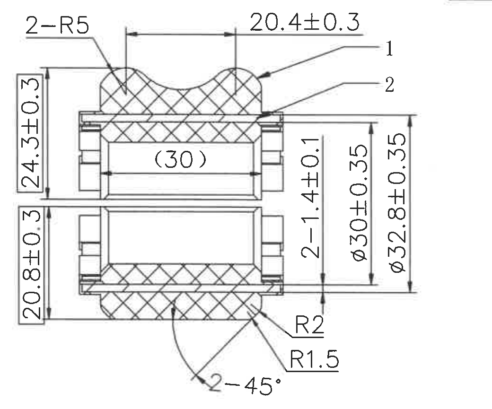

原图位置/视图名称：第 1 页上中剖面/侧向加工视图，bbox `[1700, 470, 1040, 865]`。

| 提取项 | 原图数值或文本 | 含义说明 |
|---|---:|---|
| 顶部圆角 | `2-R5` | 顶部两处 R5 圆角。 |
| 顶部宽度 | `20.4±0.3` | 上部凸起宽度尺寸，公差 ±0.3。 |
| 指引编号 | `1` | 引线编号，指向上部剖面材料/零件区域。 |
| 指引编号 | `2` | 引线编号，指向中间薄层或嵌件区域。 |
| 内部参考长度 | `(30)` | 括号尺寸，为参考尺寸，表示剖视内部长度的参考值，不作为直接加工公差控制尺寸。 |
| 左上高度 | `24.3±0.3` | 上半部剖面高度，公差 ±0.3。 |
| 左下高度 | `20.8±0.3` | 下半部剖面高度，公差 ±0.3。 |
| 右侧层厚/间距 | `2-1.4±0.1` | 两处 1.4 厚度或间距，公差 ±0.1。 |
| 直径 | `φ30±0.35` | 中间圆柱/孔相关直径，公差 ±0.35。 |
| 直径 | `φ32.8±0.35` | 外侧圆柱/包络直径，公差 ±0.35。 |
| 圆角 | `R2` | 下右局部 R2 圆角。 |
| 圆角 | `R1.5` | 下右局部 R1.5 圆角。 |
| 倒角数量与角度 | `2-45°` | 两处 45 度倒角。 |

| 提取项 | 原图数值或文本 | 含义说明 |
|---|---|---|
| 边界归属说明 | 剖面视图的全部尺寸线、箭头、编号 `1`/`2` 和括号参考尺寸 `(30)` 完整包含。 | 该对象为独立剖面/侧向视图；未把左主视图尺寸或右侧装配示意尺寸归入本区。 |

## object_3：右上刻字要求立体示意

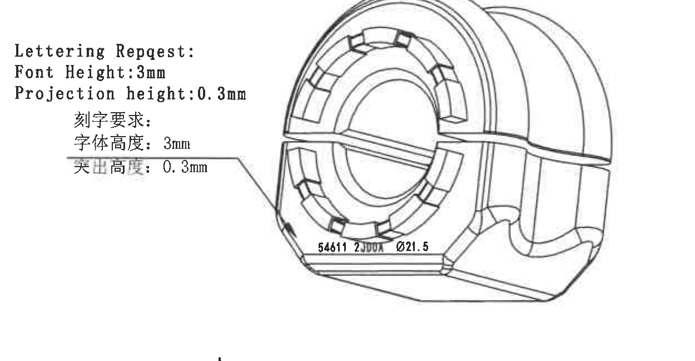

原图位置/视图名称：第 1 页右上立体示意及刻字要求，bbox `[2870, 555, 1250, 650]`。

| 提取项 | 原图数值或文本 | 含义说明 |
|---|---|---|
| 英文刻字要求 | `Lettering Request:` | 刻字要求标题。 |
| 字体高度 | `Font Height: 3mm` | 英文字体高度为 3 mm。 |
| 突出/投影高度 | `Projection height: 0.3mm` | 字体凸起或投影高度 0.3 mm。 |
| 中文刻字要求 | `刻字要求:` | 中文刻字要求标题。 |
| 中文字体高度 | `字体高度：3mm` | 中文说明中字体高度为 3 mm。 |
| 中文突出高度 | `突出高度：0.3mm` | 中文说明中凸起高度为 0.3 mm。 |
| 刻字内容 | `54611 23004  φ21.5` | 示意图底部刻字内容；中间编号局部较模糊，按图面可辨识记录。 |

| 提取项 | 原图数值或文本 | 含义说明 |
|---|---|---|
| 边界归属说明 | 刻字说明文字、引线和立体示意本体完整包含。 | 该对象为刻字/外观说明，不承接相邻装配状态示意的尺寸。 |

## object_4：左下俯视/底视图

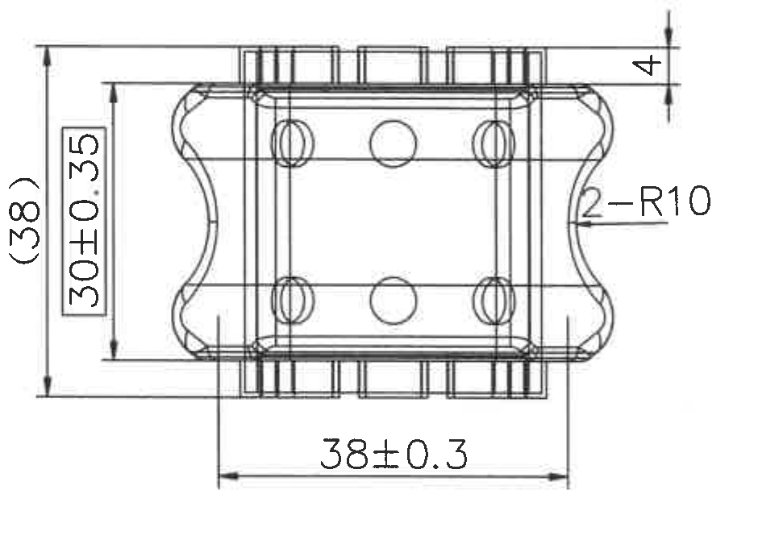

原图位置/视图名称：第 1 页左下俯视/底视图，bbox `[545, 1570, 940, 675]`。

| 提取项 | 原图数值或文本 | 含义说明 |
|---|---:|---|
| 参考总高/外包络 | `(38)` | 括号参考尺寸，表示该视图方向的外包络参考高度。 |
| 内部高度 | `30±0.35` | 内部高度尺寸，公差 ±0.35。 |
| 底部长度 | `38±0.3` | 底部横向长度，公差 ±0.3。 |
| 顶部局部高度 | `4` | 上方小台阶或凸出高度。 |
| 侧边圆角 | `2-R10` | 两处 R10 圆角或侧面波形圆角。 |

| 提取项 | 原图数值或文本 | 含义说明 |
|---|---|---|
| 边界归属说明 | `(38)`、`30±0.35`、`38±0.3`、`4`、`2-R10` 的尺寸线和文字完整包含。 | 该对象只对应左下俯视/底视图；不包含左上主视和右中安装示意尺寸。 |

## object_5：右中衬套安装状态示意图

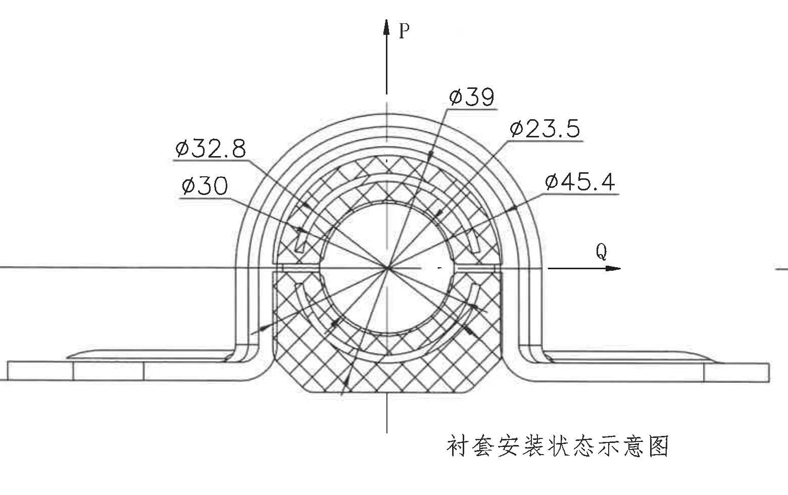

原图位置/视图名称：第 1 页右中“衬套安装状态示意图”，bbox `[2500, 1160, 1560, 980]`。

| 提取项 | 原图数值或文本 | 含义说明 |
|---|---:|---|
| 方向标识 | `P` | 竖向箭头方向标识。 |
| 方向标识 | `Q` | 横向箭头方向标识。 |
| 直径 | `φ32.8` | 外/中间圆形特征直径。 |
| 直径 | `φ30` | 内侧圆形特征直径。 |
| 直径 | `φ39` | 上方指向的圆形特征直径。 |
| 直径 | `φ23.5` | 内孔或内圈相关直径。 |
| 直径 | `φ45.4` | 外圈或外包络相关直径。 |
| 图名 | `衬套安装状态示意图` | 表明此对象是安装状态说明图。 |

| 提取项 | 原图数值或文本 | 含义说明 |
|---|---|---|
| 边界归属说明 | P/Q 方向箭头、所有直径引线和图名完整包含；右边界已收束，未包含右侧局部剖视片段。 | 本对象为安装状态示意；不把右侧 `44.7` 局部剖视尺寸归入本区。 |

## object_6：右侧上部局部剖视

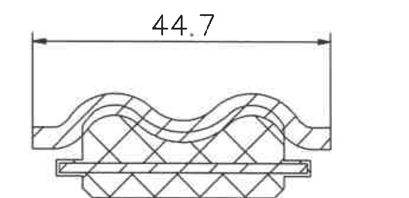

原图位置/视图名称：第 1 页右侧上部局部剖视，bbox `[4030, 1230, 690, 335]`。

| 提取项 | 原图数值或文本 | 含义说明 |
|---|---:|---|
| 局部长度/宽度 | `44.7` | 上部局部剖视的水平尺寸，未见单独公差标注。 |
| 剖面线 | 交叉剖面线 | 表示橡胶/衬套剖切材料区域。 |

| 提取项 | 原图数值或文本 | 含义说明 |
|---|---|---|
| 边界归属说明 | `44.7` 的完整尺寸线、两端箭头、延长线和文字均保留。 | 该对象只包含上方局部剖视；未包含右侧图框坐标栏，也未将下方局部剖视归入本区。 |

## object_7：右侧下部局部剖视

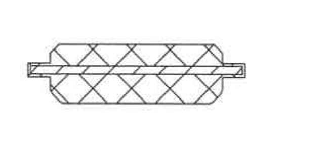

原图位置/视图名称：第 1 页右侧下部局部剖视，bbox `[4070, 1735, 650, 295]`。

| 提取项 | 原图数值或文本 | 含义说明 |
|---|---|---|
| 剖面对象 | 下部剖切衬套/嵌件形状 | 原图未在此局部视图旁标出独立尺寸文字。 |
| 剖面线 | 交叉剖面线 | 表示该局部视图被剖切的材料区域。 |

| 提取项 | 原图数值或文本 | 含义说明 |
|---|---|---|
| 边界归属说明 | 下部局部剖视轮廓和剖面线完整包含。 | 中间中心线和上方 `44.7` 尺寸不归入该对象；未包含右侧图框坐标栏。 |

## object_8：顶部修订履历表

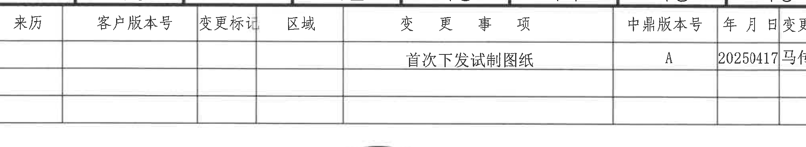

原图位置/视图名称：第 1 页顶部修订履历表，bbox `[2675, 160, 2020, 370]`。

| 来历 | 客户版本号 | 变更标记 | 区域 | 变更事项 | 中鼎版本号 | 年月日 | 变更者 |
|---|---|---|---|---|---|---|---|
|  |  |  |  | 首次下发试制图纸 | A | 20250417 | 马传德 |
|  |  |  |  |  |  |  |  |
|  |  |  |  |  |  |  |  |

| 提取项 | 原图数值或文本 | 含义说明 |
|---|---|---|
| 表格类型 | 修订履历表 | 记录图纸版本、变更事项、日期和变更者。 |
| 边界归属说明 | 表头、三行记录区、外边框完整包含；右侧图框坐标 A/B 已排除。 | 该对象只为修订履历表，不包含右上立体视图。 |

## object_9：下方 BOM/明细表

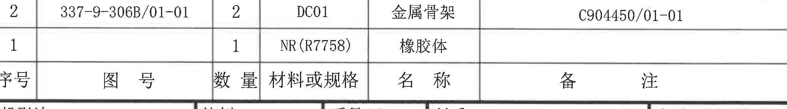

原图位置/视图名称：第 1 页下方物料明细/BOM 表，bbox `[2785, 2490, 1965, 275]`。

| 序号 | 图号 | 数量 | 材料或规格 | 名称 | 备注 |
|---:|---|---:|---|---|---|
| 2 | 337-9-306B/01-01 | 2 | DC01 | 金属骨架 | C904450/01-01 |
| 1 |  | 1 | NR(R7758) | 橡胶体 |  |

| 提取项 | 原图数值或文本 | 含义说明 |
|---|---|---|
| 表格类型 | BOM/明细表 | 按序号列出零件图号、数量、材料或规格、名称和备注。 |
| 边界归属说明 | BOM 两条物料记录、表头和备注列完整包含；底部与标题栏分界线保留。 | 该对象不包含标题栏的投影法、比例、产品号等字段。 |

## object_10：左下 NOTES 与技术要求

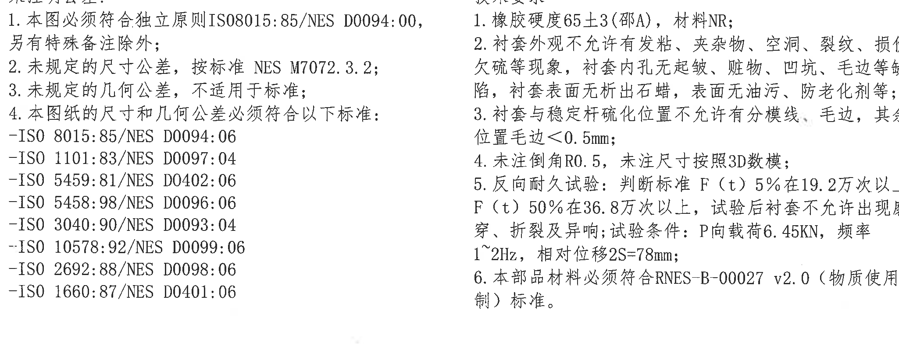

原图位置/视图名称：第 1 页左下 NOTES/技术要求，bbox `[560, 2495, 2050, 805]`。

| 提取项 | 原图数值或文本 | 含义说明 |
|---|---|---|
| 未注尺寸公差 1 | `本图必须符合独立原则 ISO8015:85/NES D0094:00, 另有特殊备注除外;` | 图纸尺寸遵循独立原则；特殊备注优先。 |
| 未注尺寸公差 2 | `未规定的尺寸公差，按标准 NES M7072.3.2;` | 未注明尺寸公差按指定 NES 标准。 |
| 未注几何公差 | `未规定的几何公差，不适用于标准;` | 未注明几何公差不按一般标准套用。 |
| 尺寸/几何公差标准 | `ISO 8015:85/NES D0094:06` | 图纸引用标准之一。 |
| 尺寸/几何公差标准 | `ISO 1101:83/NES D0097:04` | 图纸引用标准之一。 |
| 尺寸/几何公差标准 | `ISO 5459:81/NES D0402:06` | 图纸引用标准之一。 |
| 尺寸/几何公差标准 | `ISO 5458:98/NES D0096:06` | 图纸引用标准之一。 |
| 尺寸/几何公差标准 | `ISO 3040:90/NES D0093:04` | 图纸引用标准之一。 |
| 尺寸/几何公差标准 | `ISO 10578:92/NES D0099:06` | 图纸引用标准之一。 |
| 尺寸/几何公差标准 | `ISO 2692:88/NES D0098:06` | 图纸引用标准之一。 |
| 尺寸/几何公差标准 | `ISO 1660:87/NES D0401:06` | 图纸引用标准之一。 |
| 技术要求 1 | `橡胶硬度65±3(邵A)，材料NR;` | 橡胶硬度要求，邵氏 A，材料为 NR。 |
| 技术要求 2 | `衬套外观不允许有发粘、夹杂物、空洞、裂纹、损伤、欠硫等现象，衬套内孔无起皱、脏物、凹坑、毛边等缺陷，衬套表面无析出石蜡，表面无油污、防老化剂等;` | 外观和表面质量要求。 |
| 技术要求 3 | `衬套与稳定杆硫化位置不允许有分模线、毛边，其余位置毛边<0.5mm;` | 硫化位置分模线/毛边控制，毛边限值小于 0.5 mm。 |
| 技术要求 4 | `未注倒角R0.5，未注尺寸按照3D数模;` | 未注明倒角为 R0.5，未注明尺寸依据 3D 数模。 |
| 技术要求 5 | `反向耐久试验：判断标准F(t) 5%在19.2万次以上，F(t)50%在36.8万次以上，试验后衬套不允许出现磨穿、折裂及异响；试验条件：P向载荷6.45KN，频率1~2Hz，相对位移2S=78mm;` | 反向耐久试验和判定条件。 |
| 技术要求 6 | `本部品材料必须符合RNES-B-00027 v2.0（物质使用限制）标准。` | 材料须符合物质使用限制标准。 |

| 提取项 | 原图数值或文本 | 含义说明 |
|---|---|---|
| 边界归属说明 | NOTES 与技术要求两栏文字整体包含；右侧文字因扫描/裁切边界有轻微模糊，但未混入标题栏或 BOM 表。 | 本对象为文本说明区，不包含任何加工视图尺寸。 |

## object_11：右下标题栏

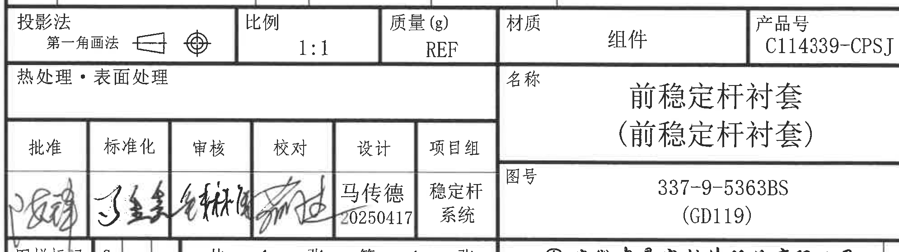

原图位置/视图名称：第 1 页右下标题栏，bbox `[2750, 2730, 1990, 560]`。

| 字段 | 原图数值或文本 | 含义说明 |
|---|---|---|
| 投影法 | `第一角画法` | 投影法字段，配第一角法符号。 |
| 比例 | `1:1` | 图纸比例。 |
| 质量(g) | `REF` | 质量为参考值，未给定具体质量数值。 |
| 材质 | `组件` | 标题栏材质/类别栏标注组件。 |
| 产品号 | `C114339-CPSJ` | 产品号。 |
| 热处理·表面处理 | 空白 | 原图该栏无具体处理文本。 |
| 名称 | `前稳定杆衬套（前稳定杆衬套）` | 零件/组件名称。 |
| 图号 | `337-9-5363BS (GD119)` | 图纸编号。 |
| 批准 | 手写签名，局部模糊 | 批准签字栏，扫描图手写内容不可稳定转写。 |
| 标准化 | 手写签名，局部模糊 | 标准化签字栏。 |
| 审核 | 手写签名，局部模糊 | 审核签字栏。 |
| 校对 | 手写签名，局部模糊 | 校对签字栏。 |
| 设计 | `马传德 20250417` | 设计者和日期。 |
| 项目组 | `稳定杆系统` | 项目组。 |
| 图样标记 | `S` | 图样标记栏。 |
| 页数 | `共 1 张 第 1 张` | 总页数和当前页。 |
| 公司 | `安徽中鼎密封件股份有限公司` | 标题栏公司名称。 |
| 图幅 | `A3` | 图纸幅面。 |

| 提取项 | 原图数值或文本 | 含义说明 |
|---|---|---|
| 边界归属说明 | 标题栏主要网格、产品号、名称、图号、签字栏、公司和 A3 格完整包含。 | 外侧图框坐标栏不是标题栏字段；对象不包含 BOM 表物料记录。 |

## 裁切检查记录

| 对象 | 检查结果 | 说明 |
|---|---|---|
| page_1 | 完整 | PDF 已先渲染为整页 PNG，尺寸 4959 x 3505 px。 |
| object_1 | 完整 | 主视图尺寸线、文字、箭头和右侧 `2-R3` 引线完整；无相邻视图内容。 |
| object_2 | 完整 | 剖面视图全部尺寸和编号 `1`/`2` 完整；未混入其他视图。 |
| object_3 | 完整 | 刻字说明、引线和立体示意完整；底部刻字局部受扫描清晰度限制。 |
| object_4 | 完整 | 俯视/底视图尺寸线、箭头和文字完整；无主视图内容。 |
| object_5 | 完整 | 安装状态示意图、P/Q 方向箭头和直径标注完整；已排除右侧局部剖视片段。 |
| object_6 | 完整 | `44.7` 尺寸线、箭头和文字完整；已排除右侧图框坐标栏。 |
| object_7 | 完整 | 下部局部剖视轮廓和剖面线完整；无独立尺寸文字。 |
| object_8 | 完整 | 修订履历表表头和记录行完整；右侧图框坐标排除。 |
| object_9 | 完整 | BOM 表头、两条记录和备注列完整；不包含标题栏字段。 |
| object_10 | 完整 | NOTES 与技术要求文字整体完整；局部小字因原扫描分辨率略模糊。 |
| object_11 | 完整 | 标题栏主要字段完整；外侧图框坐标栏不作为标题栏内容。 |
