# 20C114340.pdf 内容识别与裁切提取

## 整页渲染

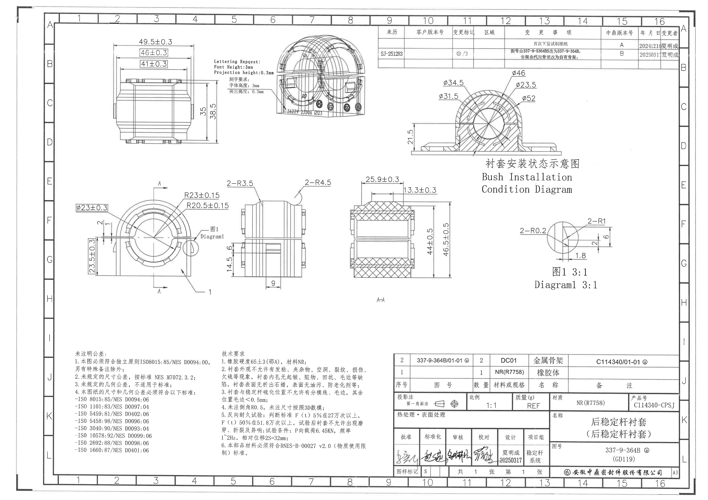

- 原图位置/视图名称：第1页整页渲染，A3图纸，渲染尺寸4959 x 3505 px。
- 结构说明：上部为尺寸视图、刻字/三维示意、修订履历表和衬套安装状态示意图；中部为主视图、侧视图、A-A剖视图和图1局部放大图；下部为NOTES、明细表/属性表和标题栏。

## object_1 上部左侧加工视图：外形宽度/高度尺寸视图

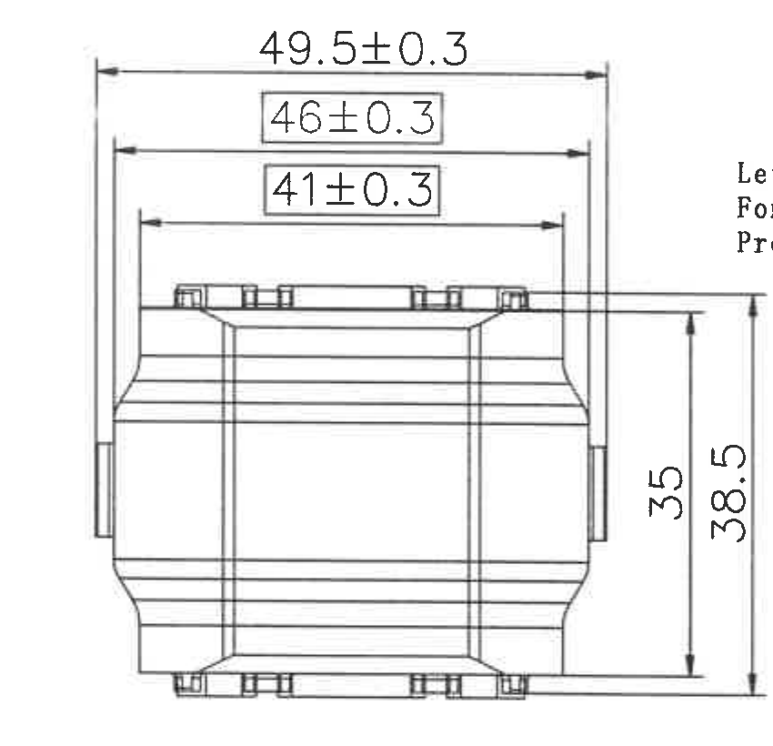

- 原图位置/视图名称：第1页上部左侧加工视图。

| 提取项 | 原图数值或文本 | 含义说明 |
|---|---|---|
| 水平最大外宽 | 49.5±0.3 | 零件上部外侧最大宽度，带±0.3公差。 |
| 中间水平宽度 | 46±0.3 | 框选尺寸，表示中间台阶/内侧宽度，带±0.3公差。 |
| 内侧水平宽度 | 41±0.3 | 框选尺寸，表示更内侧台阶宽度，带±0.3公差。 |
| 竖向局部高度 | 35 | 右侧内侧高度尺寸。 |
| 竖向总高度 | 38.5 | 右侧外侧总高度尺寸。 |
| 参考尺寸/关键尺寸/T编号 | 未见 | 本视图内未见括号参考尺寸、星号关键尺寸或T编号。 |

边界归属说明：右上角可见相邻刻字说明的残片；为完整保留38.5总高度尺寸线和数字而保留该边缘，残片不属于本视图，未提取为object_1内容。

## object_2 上部中侧刻字要求及三维示意视图

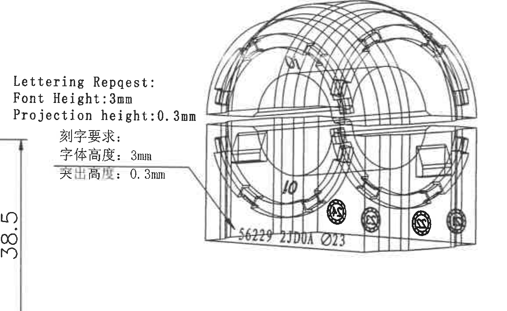

- 原图位置/视图名称：第1页上部中侧，刻字要求及三维示意视图。

| 提取项 | 原图数值或文本 | 含义说明 |
|---|---|---|
| 英文刻字说明标题 | Lettering Request: | 刻字要求说明。 |
| 英文字体高度 | Font Height:3mm | 字体高度为3 mm。 |
| 英文突出高度 | Projection height:0.3mm | 字符凸出/投影高度为0.3 mm。 |
| 中文刻字说明标题 | 刻字要求: | 中文刻字要求说明。 |
| 中文字体高度 | 字体高度: 3mm | 与英文说明一致，字体高度为3 mm。 |
| 中文突出高度 | 突出高度: 0.3mm | 与英文说明一致，突出高度为0.3 mm。 |
| 三维示意底部刻字 | S6229 25DVA Ø23 | 显示零件外表面刻印内容和直径标识。 |
| 参考尺寸/关键尺寸/T编号 | 未见 | 本对象内未见括号参考尺寸、星号关键尺寸或T编号。 |

边界归属说明：左侧可见object_1的38.5总高度尺寸残片；该残片属于上部左侧加工视图，不在本对象内提取。

## object_8 右上修订履历表

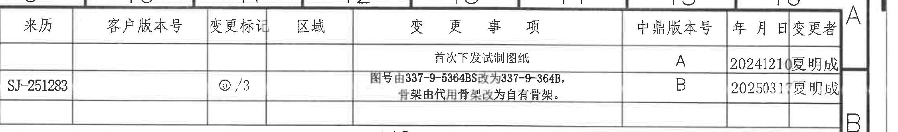

- 原图位置/视图名称：第1页右上修订履历表。

### 原表还原

| 来历 | 客户版本号 | 变更标记 | 区域 | 变更事项 | 中鼎版本号 | 年月日 | 变更者 |
|---|---|---|---|---|---|---|---|
|  |  |  |  | 首次下发试制图纸 | A | 20241210 | 夏明成 |
| SJ-251283 |  | ⓐ/3 |  | 图号由337-9-5364BS改为337-9-364B，骨架由代用骨架改为自有骨架。 | B | 20250317 | 夏明成 |

| 提取项 | 原图数值或文本 | 含义说明 |
|---|---|---|
| 表头 | 来历、客户版本号、变更标记、区域、变更事项、中鼎版本号、年月日、变更者 | 修订履历字段。 |
| A版记录 | 首次下发试制图纸；A；20241210；夏明成 | 初版/首次下发试制图纸记录。 |
| B版记录 | SJ-251283；ⓐ/3；图号由337-9-5364BS改为337-9-364B，骨架由代用骨架改为自有骨架。；B；20250317；夏明成 | 变更来源、变更标记、图号/骨架变更说明及版本日期。 |

边界归属说明：表格右侧包含图框坐标字母A/B的边缘，该坐标属于外部图框，不属于修订履历表字段。

## object_3 右上剖面示意：衬套安装状态示意图

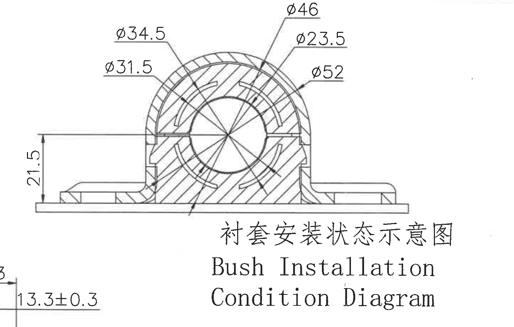

- 原图位置/视图名称：第1页右上，衬套安装状态示意图 / Bush Installation Condition Diagram。

| 提取项 | 原图数值或文本 | 含义说明 |
|---|---|---|
| 直径 | φ34.5 | 左上标注，指向剖面中的圆柱/衬套层直径。 |
| 直径 | φ31.5 | 左中标注，指向内侧圆柱/衬套层直径。 |
| 直径 | φ46 | 上方标注，指向安装示意中的外层直径。 |
| 直径 | φ23.5 | 右上标注，指向内孔/内侧圆柱直径。 |
| 直径 | φ52 | 右侧标注，指向外包络/外侧安装直径。 |
| 竖向安装尺寸 | 21.5 | 左侧竖向尺寸，表示底部基准至水平安装参考线的高度。 |
| 标题 | 衬套安装状态示意图 / Bush Installation Condition Diagram | 表示该图为装配状态示意，不是单独零件加工主视图。 |
| 参考尺寸/关键尺寸/T编号 | 未见 | 本对象内未见括号参考尺寸、星号关键尺寸或T编号。 |

边界归属说明：左下角带入A-A剖视图的13.3±0.3残片，该残片属于object_6，不提取为安装状态示意图内容。

## object_4 中部左侧主视/俯视加工视图

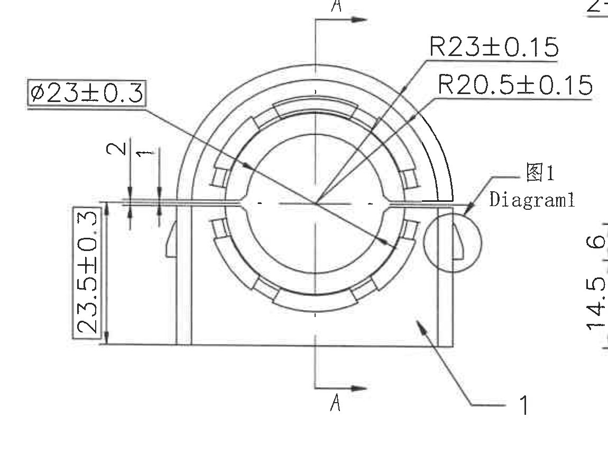

- 原图位置/视图名称：第1页中部左侧主视/俯视加工视图，含A-A剖切位置和Diagram1索引。

| 提取项 | 原图数值或文本 | 含义说明 |
|---|---|---|
| 直径 | φ23±0.3 | 框选直径尺寸，表示内孔直径，带±0.3公差。 |
| 外圆弧半径 | R23±0.15 | 外侧圆弧半径，带±0.15公差。 |
| 内圆弧半径 | R20.5±0.15 | 内侧圆弧半径，带±0.15公差。 |
| 局部竖向尺寸 | 2 | 开口/台阶处局部尺寸。 |
| 局部竖向尺寸 | 1 | 开口/台阶处局部尺寸。 |
| 左侧竖向外形尺寸 | 23.5±0.3 | 框选竖向尺寸，带±0.3公差。 |
| 剖切基准/剖视标识 | A、A | 上下A箭头定义A-A剖切位置，对应object_6。 |
| 局部视图索引 | 图1 / Diagram1 | 指向右侧局部结构，对应object_7放大图。 |
| 件号/引出编号 | 1 | 引出线指向本体零件区域。 |
| 参考尺寸/关键尺寸/T编号 | 未见 | 本视图内未见括号参考尺寸、星号关键尺寸或T编号。 |

边界归属说明：右边缘可见object_5的14.5/6尺寸残片，顶部右侧可见object_5的半径标注残片；这些均属于中部侧视图，不归入本主视/俯视图。

## object_5 中部侧视加工视图

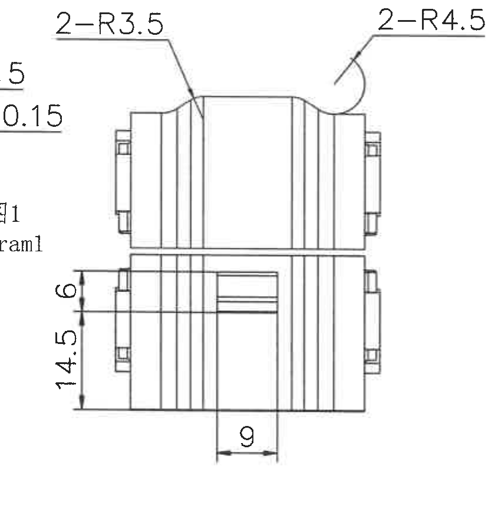

- 原图位置/视图名称：第1页中部中左侧侧视加工视图。

| 提取项 | 原图数值或文本 | 含义说明 |
|---|---|---|
| 圆角数量及半径 | 2-R3.5 | 两处R3.5圆角。 |
| 圆角数量及半径 | 2-R4.5 | 两处R4.5圆角。 |
| 竖向局部尺寸 | 6 | 左侧上部局部高度/台阶尺寸。 |
| 竖向局部尺寸 | 14.5 | 左侧下部局部高度尺寸。 |
| 下部槽宽 | 9 | 下部开槽宽度尺寸。 |
| 参考尺寸/关键尺寸/T编号 | 未见 | 本视图内未见括号参考尺寸、星号关键尺寸或T编号。 |

边界归属说明：左边缘可见object_4的Diagram1文字和半径标注残片；这些属于主视/俯视图，不归入本侧视图。

## object_6 中部A-A剖面视图

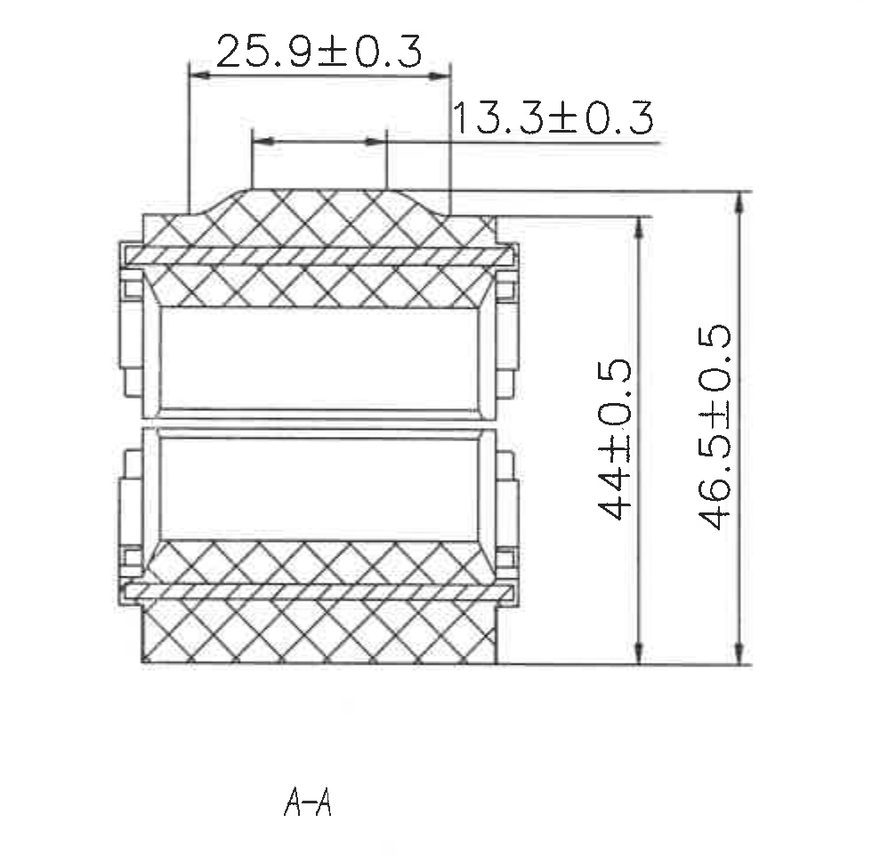

- 原图位置/视图名称：第1页中部，A-A剖面视图。

| 提取项 | 原图数值或文本 | 含义说明 |
|---|---|---|
| 顶部外侧水平尺寸 | 25.9±0.3 | A-A剖面上部凸起/外层宽度，带±0.3公差。 |
| 顶部内侧水平尺寸 | 13.3±0.3 | A-A剖面上部内侧台阶宽度，带±0.3公差。 |
| 内侧高度 | 44±0.5 | 右侧内侧竖向尺寸，带±0.5公差。 |
| 总高度 | 46.5±0.5 | 右侧外侧总高度尺寸，带±0.5公差。 |
| 剖面标识 | A-A | 与object_4中的A-A剖切标识对应。 |
| 参考尺寸/关键尺寸/T编号 | 未见 | 本剖视图内未见括号参考尺寸、星号关键尺寸或T编号。 |

边界归属说明：裁切完整包含剖面线、尺寸线、箭头、尺寸文字和A-A标题，未混入相邻视图内容。

## object_7 右中局部放大图：图1 3:1

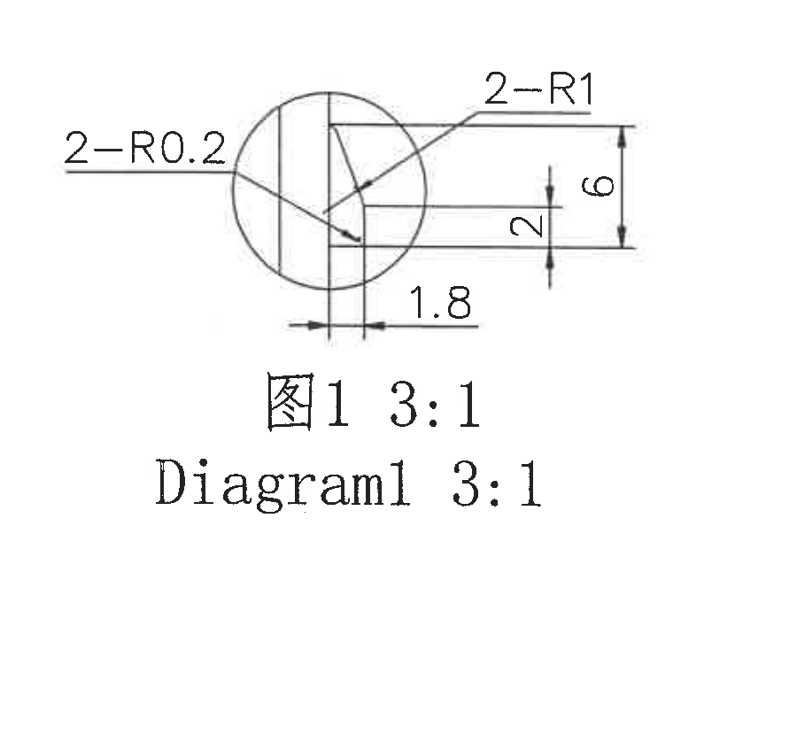

- 原图位置/视图名称：第1页右中局部放大图，图1 3:1 / Diagram1 3:1。

| 提取项 | 原图数值或文本 | 含义说明 |
|---|---|---|
| 小圆角数量及半径 | 2-R0.2 | 两处R0.2小圆角。 |
| 圆角数量及半径 | 2-R1 | 两处R1圆角。 |
| 竖向局部尺寸 | 2 | 中部竖向局部尺寸。 |
| 竖向总局部尺寸 | 6 | 右侧竖向局部总尺寸。 |
| 底部水平尺寸 | 1.8 | 底部局部宽度尺寸。 |
| 放大比例 | 3:1 | 局部图放大比例。 |
| 参考尺寸/关键尺寸/T编号 | 未见 | 本局部视图内未见括号参考尺寸、星号关键尺寸或T编号。 |

边界归属说明：裁切完整包含局部图、尺寸线、箭头、标注文字和标题，未混入相邻视图内容。

## object_9 左下NOTES：未注明公差

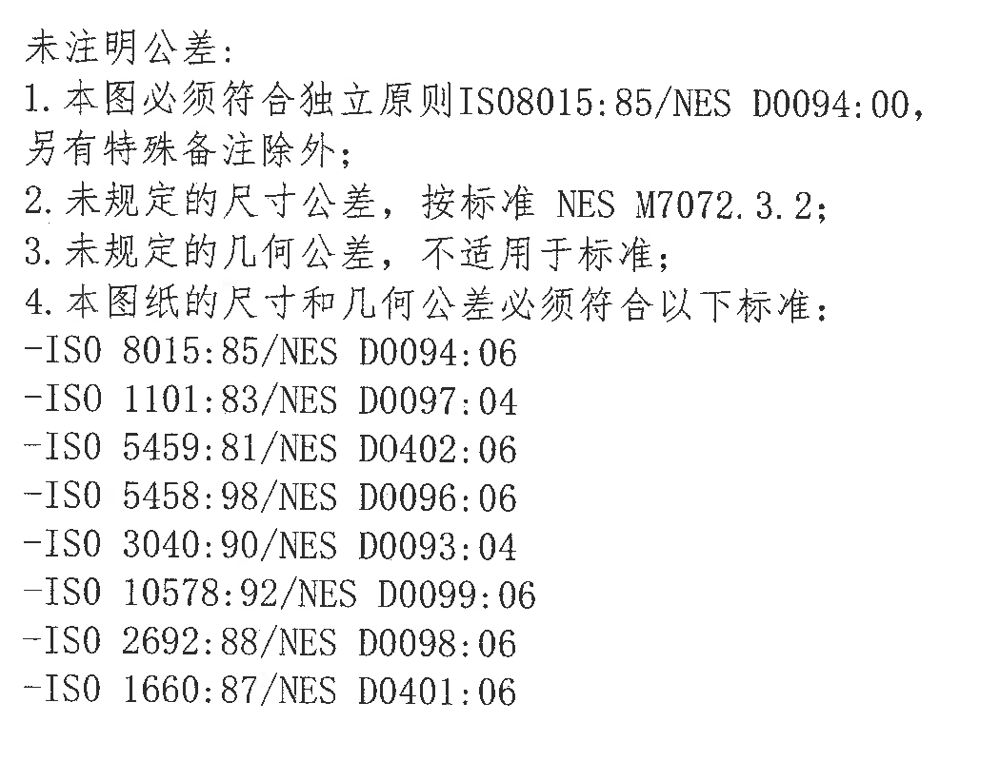

- 原图位置/视图名称：第1页左下NOTES区。

| 提取项 | 原图数值或文本 | 含义说明 |
|---|---|---|
| 标题 | 未注明公差: | 未注明公差说明。 |
| 1 | 本图必须符合独立原则ISO8015:85/NES D0094:00，另有特殊备注除外; | 独立原则及特殊备注优先说明。 |
| 2 | 未规定的尺寸公差，按标准 NES M7072.3.2; | 未注尺寸公差按NES M7072.3.2执行。 |
| 3 | 未规定的几何公差，不适用于标准; | 未注几何公差说明。 |
| 4 | 本图纸的尺寸和几何公差必须符合以下标准: | 引出下列标准清单。 |
| 标准 | ISO 8015:85/NES D0094:06 | 标准引用。 |
| 标准 | ISO 1101:83/NES D0097:04 | 标准引用。 |
| 标准 | ISO 5459:81/NES D0402:06 | 标准引用。 |
| 标准 | ISO 5458:98/NES D0096:06 | 标准引用。 |
| 标准 | ISO 3040:90/NES D0093:04 | 标准引用。 |
| 标准 | ISO 10578:92/NES D0099:06 | 标准引用。 |
| 标准 | ISO 2692:88/NES D0098:06 | 标准引用。 |
| 标准 | ISO 1660:87/NES D0401:06 | 标准引用。 |

边界归属说明：裁切仅包含左侧未注明公差NOTES，没有混入右侧技术要求文本。

## object_10 下中NOTES：技术要求

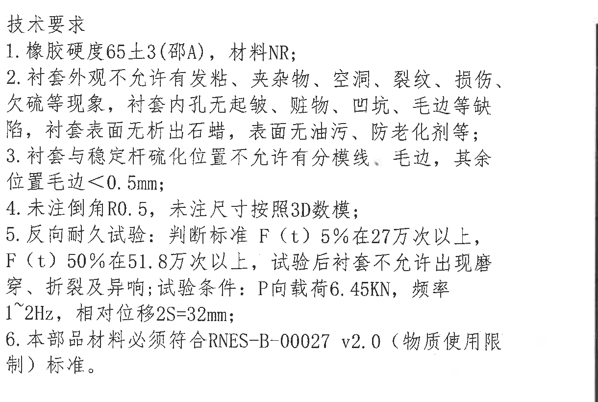

- 原图位置/视图名称：第1页下中技术要求NOTES区。

| 提取项 | 原图数值或文本 | 含义说明 |
|---|---|---|
| 标题 | 技术要求 | 技术要求说明区。 |
| 1 | 橡胶硬度65±3(邵A)，材料NR; | 橡胶硬度和材料要求。 |
| 2 | 衬套外观不允许有发粘、夹杂物、空洞、裂纹、损伤、欠硫等现象，衬套内孔无起皱、脏物、凹坑、毛边等缺陷，衬套表面无析出石蜡，表面无油污、防老化剂等; | 外观、内孔和表面缺陷禁止项。 |
| 3 | 衬套与稳定杆硫化位置不允许有分模线、毛边，其余位置毛边<0.5mm; | 硫化位置和其余位置毛边要求。 |
| 4 | 未注倒角R0.5，未注尺寸按照3D数模; | 未注倒角和未注尺寸依据。 |
| 5 | 反向耐久试验: 判断标准F(t)5%在27万次以上，F(t)50%在51.8万次以上，试验后衬套不允许出现磨穿、折裂及异响; 试验条件: P向载荷6.45KN，频率1~2Hz，相对位移2S=32mm; | 反向耐久试验判定标准和试验条件。 |
| 6 | 本部品材料必须符合RNES-B-00027 v2.0（物质使用限制）标准。 | 材料物质使用限制要求。 |

边界归属说明：右侧可见标题栏分隔线边缘，但未带入右侧表格字段；该边线不作为技术要求文本提取。

## object_11 右下明细表及属性表

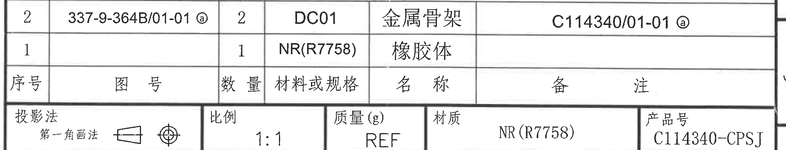

- 原图位置/视图名称：第1页右下明细表及属性表。

### 明细表原表还原

| 序号 | 图号 | 数量 | 材料或规格 | 名称 | 备注 |
|---|---|---:|---|---|---|
| 2 | 337-9-364B/01-01 ⓐ | 2 | DC01 | 金属骨架 | C114340/01-01 ⓐ |
| 1 |  | 1 | NR(R7758) | 橡胶体 |  |

### 属性表原表还原

| 投影法 | 比例 | 质量(g) | 材质 | 产品号 |
|---|---|---|---|---|
| 第一角画法（原图含投影符号） | 1:1 | REF | NR(R7758) | C114340-CPSJ |

| 提取项 | 原图数值或文本 | 含义说明 |
|---|---|---|
| 明细表表头 | 序号、图号、数量、材料或规格、名称、备注 | 零件组成清单字段。 |
| 序号2 | 337-9-364B/01-01 ⓐ；数量2；DC01；金属骨架；C114340/01-01 ⓐ | 金属骨架明细。 |
| 序号1 | 数量1；NR(R7758)；橡胶体 | 橡胶体明细。 |
| 投影法 | 第一角画法 | 原图含第一角投影图标。 |
| 比例 | 1:1 | 图纸比例。 |
| 质量(g) | REF | 质量为参考。 |
| 材质 | NR(R7758) | 材质字段。 |
| 产品号 | C114340-CPSJ | 产品编号字段。 |

边界归属说明：右侧外框残片属于图框，不作为明细表或属性表字段。

## object_12 右下标题栏

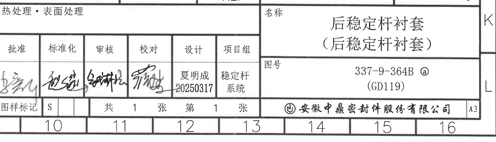

- 原图位置/视图名称：第1页右下标题栏。

| 提取项 | 原图数值或文本 | 含义说明 |
|---|---|---|
| 热处理・表面处理 | 空白 | 原栏位未填写具体处理要求。 |
| 名称 | 后稳定杆衬套（后稳定杆衬套） | 图纸名称。 |
| 图号 | 337-9-364B ⓐ (GD119) | 图纸编号及括号内编号。 |
| 批准 | 手写签名 | 签名扫描件，具体字形不可稳定辨认。 |
| 标准化 | 手写签名 | 签名扫描件，具体字形不可稳定辨认。 |
| 审核 | 手写签名 | 签名扫描件，具体字形不可稳定辨认。 |
| 校对 | 手写签名 | 签名扫描件，具体字形不可稳定辨认。 |
| 设计 | 夏明成 20250317 | 设计人员及日期。 |
| 项目组 | 稳定杆系统 | 所属项目组。 |
| 图样标记 | S | 图样标记字段。 |
| 张数 | 共1张，第1张 | 图纸张数和页序。 |
| 公司 | 安徽中鼎密封件股份有限公司 | 出图公司名称。 |
| 图幅 | A3 | 图幅规格。 |

边界归属说明：底部10-16为图框坐标栏，不属于标题栏字段；该坐标栏随标题栏裁切保留，是为了完整包含公司名和A3图幅格。

## 裁切检查记录

| 对象 | 检查结果 | 边界归属复核 |
|---|---|---|
| page_1.png | 整页PNG完整，尺寸4959 x 3505 px。 | 全页渲染，无裁切归属问题。 |
| object_1.png | 完整包含49.5±0.3、46±0.3、41±0.3、35、38.5及对应尺寸线/箭头。 | 右上角有object_2文字残片，已排除。 |
| object_2.png | 完整包含刻字要求、三维示意和底部刻字S6229 25DVA Ø23。 | 左侧有object_1的38.5残片，已排除。 |
| object_3.png | 完整包含φ34.5、φ31.5、φ46、φ23.5、φ52、21.5和标题。 | 左下角有object_6的13.3±0.3残片，已排除。 |
| object_4.png | 完整包含φ23±0.3、R23±0.15、R20.5±0.15、2、1、23.5±0.3、A-A索引和Diagram1索引。 | 右边缘有object_5尺寸残片，已排除。 |
| object_5.png | 完整包含2-R3.5、2-R4.5、6、14.5、9及对应尺寸线/箭头。 | 左边缘有object_4残片，已排除。 |
| object_6.png | 完整包含25.9±0.3、13.3±0.3、44±0.5、46.5±0.5和A-A标题。 | 未混入相邻视图内容。 |
| object_7.png | 完整包含2-R0.2、2-R1、2、6、1.8和图1/Diagram1 3:1标题。 | 未混入相邻视图内容。 |
| object_8.png | 完整包含修订履历表头和A/B两条记录。 | 右侧图框坐标A/B已排除。 |
| object_9.png | 完整包含未注明公差NOTES全部文本和标准清单。 | 未混入技术要求。 |
| object_10.png | 完整包含技术要求1-6全部文本。 | 右侧仅为分隔线边缘，无表格字段混入。 |
| object_11.png | 完整包含明细表两条记录及投影法、比例、质量、材质、产品号属性表。 | 右侧外框残片已排除。 |
| object_12.png | 完整包含标题栏名称、图号、签署、张数、公司和A3图幅。 | 底部图框坐标10-16已排除。 |
