# 20C114341 内容识别

PDF 已先渲染为整页 PNG：`outputs/20C114341_assets/images/page_1.png`，整页尺寸 `4959 x 3505 px`。未见独立剖面视图；右侧模具上下侧图按局部视图裁切。

## object_1 - 修订履历表

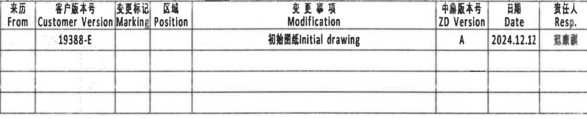

原图位置/视图名称：第 1 页右上修订履历表，bbox `[2820, 165, 4730, 555]`，object_kind=`table`。

原表还原：

| 来历 From | 客户版本号 Customer Version | 变更标记 Marking | 区域 Position | 变更事项 Modification | 中鼎版本号 ZD Version | 日期 Date | 责任人 Resp. |
|---|---|---|---|---|---|---|---|
|  | 19388-E |  |  | 初始图纸 Initial drawing | A | 2024.12.12 | 疑似“黄康斌”，扫描不清 |
|  |  |  |  |  |  |  |  |
|  |  |  |  |  |  |  |  |
|  |  |  |  |  |  |  |  |

| 提取项 | 原图数值或文本 | 含义说明 |
|---|---|---|
| Customer Version | 19388-E | 客户版本号。 |
| Modification | 初始图纸 Initial drawing | 本版为初始图纸。 |
| ZD Version | A | 中鼎内部版本为 A。 |
| Date | 2024.12.12 | 修订/出图日期。 |
| Resp. | 疑似“黄康斌”，扫描不清 | 责任人栏扫描模糊，未作唯一断定。 |

边界归属说明：裁切包含完整表头、首行记录和空白修订行；顶部残留一小段图框网格线，不作为表格数据提取。

## object_2 - 主加工视图 / 正视图

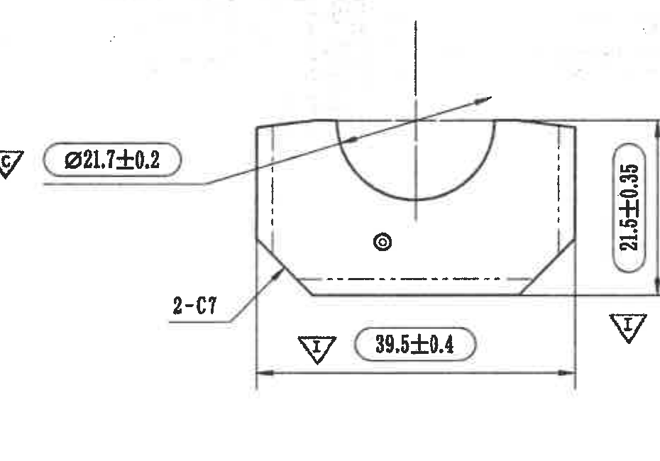

原图位置/视图名称：第 1 页右中部主加工正视图，bbox `[2640, 720, 3570, 1370]`，object_kind=`view`。

| 提取项 | 原图数值或文本 | 含义说明 |
|---|---|---|
| 关键特性标识 | 三角形 C，连接 `Ø21.7±0.2` | `C` 表示 Critical，控制该内径/圆弧开口为关键特性。 |
| 直径尺寸 | `Ø21.7±0.2` | 顶部半圆开口/衬套内径尺寸，公差为 ±0.2。 |
| 倒角/切角数量 | `2-C7`（C 后数字扫描可读为 7） | 指左右两处切角/倒角特征，数量前缀为 2。 |
| 高度尺寸 | `21.5±0.35` | 正视图竖向总高度，公差为 ±0.35。 |
| 宽度尺寸 | `39.5±0.4` | 正视图底部总宽度，公差为 ±0.4。 |
| 重要特性标识 | 三角形 I，靠近 `39.5±0.4` 和右侧高度标注 | `I` 表示 Important，提示相邻尺寸为重要特性。 |
| 弧向/半径 | 顶部半圆由 `Ø21.7±0.2` 控制 | 本视图未单独给出 R 值；圆弧含义由直径尺寸控制。 |
| 基准字母/T 编号/星号 | 未见 | 当前裁切中无基准框、T 编号或星号关键尺寸。 |

边界归属说明：左侧 `C` 特性符号和 `Ø21.7±0.2` 引出线属于本视图；右侧高度尺寸线、底部宽度尺寸线和箭头完整。未纳入右侧独立视图。

## object_3 - 右侧加工视图

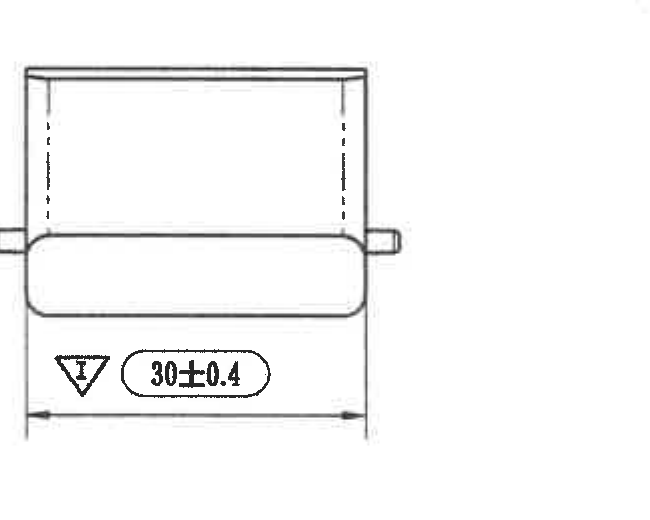

原图位置/视图名称：第 1 页右中部右侧视图，bbox `[3890, 820, 4540, 1340]`，object_kind=`view`。

| 提取项 | 原图数值或文本 | 含义说明 |
|---|---|---|
| 横向总尺寸 | `30±0.4` | 右侧视图底部横向外包尺寸，公差为 ±0.4。 |
| 重要特性标识 | 三角形 I，靠近 `30±0.4` | 表示该尺寸为重要特性。 |
| 侧向小凸台 | 两侧短凸出形状，无单独数值 | 仅在视图中显示形状，尺寸不在本视图标注。 |
| 基准字母/T 编号/星号 | 未见 | 当前裁切中无基准框、T 编号或星号关键尺寸。 |

边界归属说明：裁切只包含右侧视图和 `30±0.4` 尺寸线；底部箭头、尺寸文字和重要特性符号完整，未混入主视图。

## object_4 - 圆柱侧向加工视图

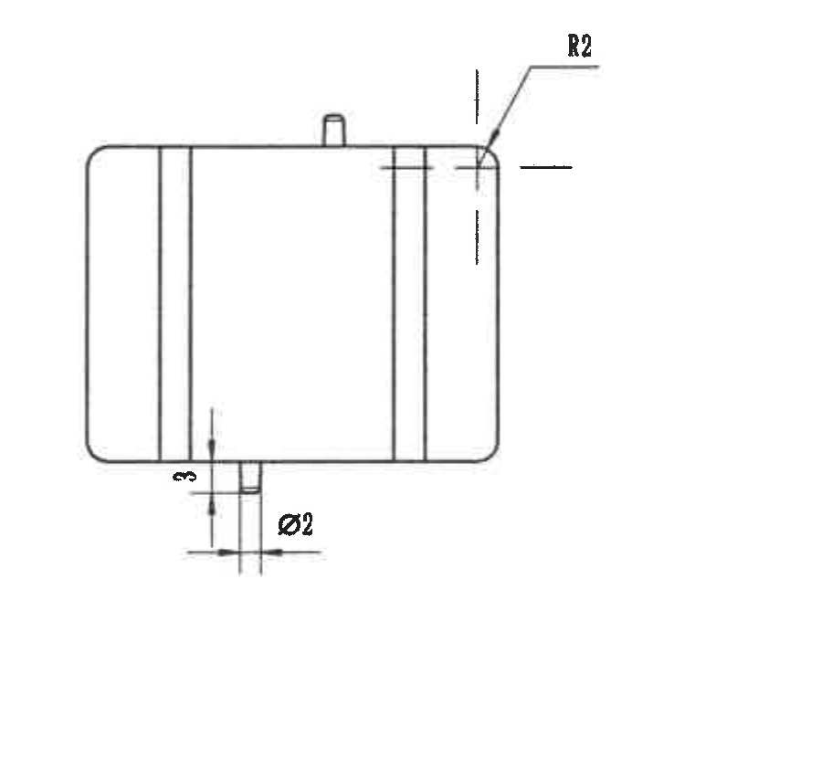

原图位置/视图名称：第 1 页中右部圆柱侧向视图，bbox `[2905, 1450, 3805, 2280]`，object_kind=`view`。

| 提取项 | 原图数值或文本 | 含义说明 |
|---|---|---|
| 圆角半径 | `R2` | 右上角圆角半径为 2。 |
| 小凸起高度/伸出量 | `3` | 下方小凸起的竖向尺寸。 |
| 小凸起直径 | `Ø2` | 下方小圆柱/定位凸起直径。 |
| 中心线/虚线 | 右侧竖向中心线、内部两条竖线 | 表示圆柱体和内部结构的投影位置。 |
| 基准字母/T 编号/星号 | 未见 | 当前裁切中无基准框、T 编号或星号关键尺寸。 |

边界归属说明：重裁后 `R2` 字符和引出线完整；下方 `3`、`Ø2` 及其箭头完整。右侧不包含模具上下侧局部图。

## object_5 - 立体示意图

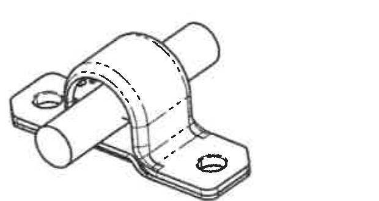

原图位置/视图名称：第 1 页中下部立体示意图，bbox `[2320, 1870, 2940, 2200]`，object_kind=`detail`。

| 提取项 | 原图数值或文本 | 含义说明 |
|---|---|---|
| 立体形状 | 稳定杆穿过衬套/支架的装配示意 | 用于表达零件外形、安装方向和局部孔位关系。 |
| 尺寸/公差 | 未标注 | 本对象仅为示意图，无尺寸、角度、弧度或公差数值。 |
| 基准字母/T 编号/星号 | 未见 | 当前裁切中无基准框、T 编号或星号关键尺寸。 |

边界归属说明：裁切只保留立体示意图；已与下方坐标轴分开，未混入 NOTES 或表格内容。

## object_6 - Mould lower side 局部视图

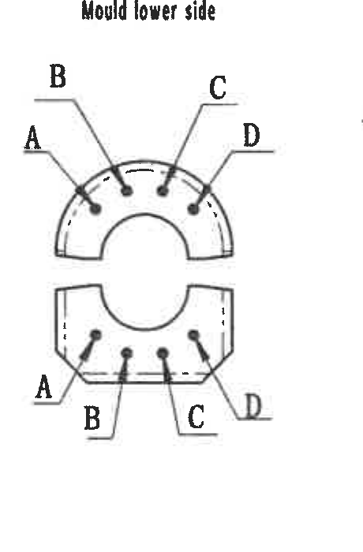

原图位置/视图名称：第 1 页右下部 `Mould lower side` 局部视图，bbox `[3875, 1660, 4335, 2360]`，object_kind=`detail`。

| 提取项 | 原图数值或文本 | 含义说明 |
|---|---|---|
| 视图标题 | `Mould lower side` | 下模侧局部视图。 |
| 上半局部标识 | A、B、C、D | 引线分别指向上半圆弧区域的四个位置/标识点。 |
| 下半局部标识 | A、B、C、D | 引线分别指向下半局部区域的四个位置/标识点。 |
| 数值尺寸 | 未标注 | 本局部图只给出 A/B/C/D 位置关系，没有尺寸或公差。 |
| 基准含义 | A/B/C/D 为位置/识别标注，不是基准框 | 图中未见 GD&T 基准框。 |

边界归属说明：重裁后仅包含下模侧标题、上下两个局部图及 A/B/C/D 引线；没有混入右侧上模侧局部图。

## object_7 - Mould upper side 局部视图

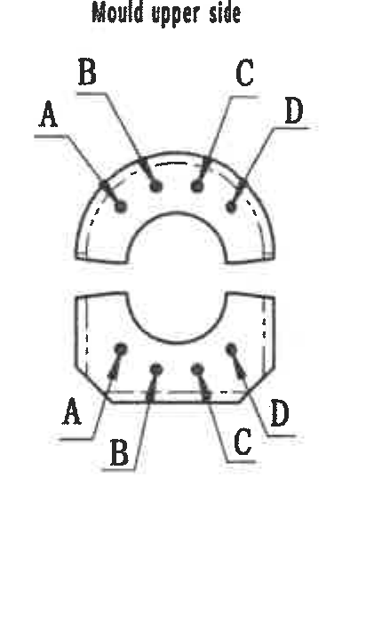

原图位置/视图名称：第 1 页右下部 `Mould upper side` 局部视图，bbox `[4295, 1660, 4725, 2360]`，object_kind=`detail`。

| 提取项 | 原图数值或文本 | 含义说明 |
|---|---|---|
| 视图标题 | `Mould upper side` | 上模侧局部视图。 |
| 上半局部标识 | A、B、C、D | 引线分别指向上半圆弧区域的四个位置/标识点。 |
| 下半局部标识 | A、B、C、D | 引线分别指向下半局部区域的四个位置/标识点。 |
| 数值尺寸 | 未标注 | 本局部图只给出 A/B/C/D 位置关系，没有尺寸或公差。 |
| 基准含义 | A/B/C/D 为位置/识别标注，不是基准框 | 图中未见 GD&T 基准框。 |

边界归属说明：右边界已缩窄，去除了图框坐标栏；保留右侧 D 引线和文字完整，未混入下模侧局部图。

## object_8 - 坐标轴局部图

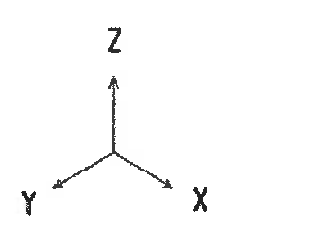

原图位置/视图名称：第 1 页中下部 X/Y/Z 坐标轴，bbox `[2735, 2235, 3055, 2485]`，object_kind=`detail`。

| 提取项 | 原图数值或文本 | 含义说明 |
|---|---|---|
| 坐标方向 | X、Y、Z | 表示零件/测试方向坐标。 |
| 尺寸/公差 | 未标注 | 坐标轴为方向说明，不包含尺寸线或公差。 |

边界归属说明：重裁后 X、Y、Z 三个字母和箭头均完整；未混入立体示意图或底部表格。

## object_9 - NOTES / 技术要求

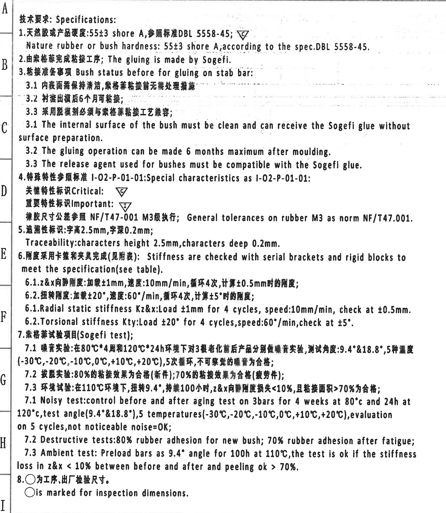

原图位置/视图名称：第 1 页左侧 `技术要求: Specifications:`，bbox `[300, 165, 2250, 2405]`，object_kind=`notes`。

| 提取项 | 原图数值或文本 | 含义说明 |
|---|---|---|
| 标题 | `技术要求: Specifications:` | 技术要求区域。 |
| 1 | `天然胶衬套产品硬度: 55±3 shore A, 参照标准 DBL 5558-45;` / `Nature rubber or bush hardness: 55±3 shore A, according to the spec. DBL 5558-45.` | 天然橡胶或衬套硬度要求；`55±3 shore A` 含公差；旁有 Critical 三角 C 标识。 |
| 2 | `由索格菲完成粘接工序; The gluing is made by Sogefi.` | 粘接工序由 Sogefi 完成。 |
| 3 | `粘接准备事项 Bush status before for gluing on stab bar:` | 粘接前衬套状态要求。 |
| 3.1 | `The internal surface of the bush must be clean and can receive the Sogefi glue without surface preparation.` | 内表面需清洁，可不经表面处理直接接受 Sogefi 胶。 |
| 3.2 | `The gluing operation can be made 6 months maximum after moulding.` | 成型后最长 6 个月内可进行粘接。 |
| 3.3 | `The release agent used for bushes must be compatible with the Sogefi glue.` | 脱模剂需与 Sogefi 胶相容。 |
| 4 | `Special characteristics as I-02-P-01-01:` | 特殊特性标准。 |
| Critical | 三角形 `C` | 关键特性标识。 |
| Important | 三角形 `I` | 重要特性标识。 |
| General tolerance | `General tolerances on rubber M3 as norm NF/T47.001.` | 橡胶尺寸通用公差按 NF/T47.001 M3 级执行。 |
| 5 | `Traceability: characters height 2.5mm, characters deep 0.2mm.` | 追溯性标识要求：字高 2.5 mm，字深 0.2 mm。 |
| 6 | `Stiffness are checked with serial brackets and rigid blocks to meet the specification (see table).` | 刚度用系列卡箍和刚性块检查，见刚度表。 |
| 6.1 | `Radial static stiffness Kz&x: Load ±1mm for 4 cycles, speed: 10mm/min, check at ±0.5mm.` | 径向静刚度 Kz 和 Kx 测试条件；`±1mm`、`10mm/min`、`4 cycles`、`±0.5mm` 均为检测参数。 |
| 6.2 | `Torsional stiffness Kty: Load ±20° for 4 cycles, speed: 60°/min, check at ±5°.` | 扭转刚度 Kty 测试条件；包含角度和角速度。 |
| 7 | `Sogefi test` | Sogefi 试验项目。 |
| 7.1 Noisy test | `control before and after aging test on 3 bars for 4 weeks at 80°C and 24h at 120°C, test angle (9.4°&18.8°), 5 temperatures (-30°C,-20°C,-10°C,0°C,+10°C,+20°C), evaluation on 5 cycles, not noticeable noise=OK` | 噪音试验条件；包含 9.4° 和 18.8° 测试角度、温度点和循环次数。 |
| 7.2 Destructive tests | `80% rubber adhesion for new bush; 70% rubber adhesion after fatigue;` | 新件粘接面积/效果 80%，疲劳后 70%。 |
| 7.3 Ambient test | `Preload bars as 9.4° angle for 100h at 110°C, the test is ok if the stiffness loss in z&x < 10% between before and after and peeling ok > 70%.` | 环境试验：110°C、100h、9.4° 预载；Z/X 向刚度损失 <10%，剥离合格 >70%。 |
| 8 | `○ 为工序、出厂检验尺寸。 ○ is marked for inspection dimensions.` | 圆圈符号表示工序/出厂检验尺寸。 |

边界归属说明：裁切只覆盖左侧 NOTES 文本，右侧视图和右下立体示意图均未纳入；左侧图框坐标字母 A-I 属于图纸边框，不作为 NOTES 内容。

## object_10 - Stiffness requirement 刚度表

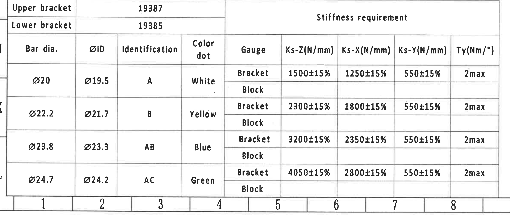

原图位置/视图名称：第 1 页左下刚度要求表，bbox `[310, 2420, 2690, 3440]`，object_kind=`table`。

原表还原：

| Upper bracket | 19387 |  |  |  | Stiffness requirement |  |  |  |
|---|---:|---|---|---|---|---|---|---|
| Lower bracket | 19385 |  |  |  |  |  |  |  |
| Bar dia. | ØID | Identification | Color dot | Gauge | Ks-Z(N/mm) | Ks-X(N/mm) | Ks-Y(N/mm) | Ty(Nm/°) |
| Ø20 | Ø19.5 | A | White | Bracket | 1500±15% | 1250±15% | 550±15% | 2max |
|  |  |  |  | Block |  |  |  |  |
| Ø22.2 | Ø21.7 | B | Yellow | Bracket | 2300±15% | 1800±15% | 550±15% | 2max |
|  |  |  |  | Block |  |  |  |  |
| Ø23.8 | Ø23.3 | AB | Blue | Bracket | 3200±15% | 2350±15% | 550±15% | 2max |
|  |  |  |  | Block |  |  |  |  |
| Ø24.7 | Ø24.2 | AC | Green | Bracket | 4050±15% | 2800±15% | 550±15% | 2max |
|  |  |  |  | Block |  |  |  |  |

| 提取项 | 原图数值或文本 | 含义说明 |
|---|---|---|
| Upper bracket | 19387 | 上支架/上卡箍编号。 |
| Lower bracket | 19385 | 下支架/下卡箍编号。 |
| Ø20 规格 | ØID Ø19.5, Identification A, White, Bracket: Ks-Z 1500±15%, Ks-X 1250±15%, Ks-Y 550±15%, Ty 2max | Ø20 杆径对应白色 A 标识的刚度要求。 |
| Ø22.2 规格 | ØID Ø21.7, Identification B, Yellow, Bracket: Ks-Z 2300±15%, Ks-X 1800±15%, Ks-Y 550±15%, Ty 2max | Ø22.2 杆径对应黄色 B 标识的刚度要求。 |
| Ø23.8 规格 | ØID Ø23.3, Identification AB, Blue, Bracket: Ks-Z 3200±15%, Ks-X 2350±15%, Ks-Y 550±15%, Ty 2max | Ø23.8 杆径对应蓝色 AB 标识的刚度要求。 |
| Ø24.7 规格 | ØID Ø24.2, Identification AC, Green, Bracket: Ks-Z 4050±15%, Ks-X 2800±15%, Ks-Y 550±15%, Ty 2max | Ø24.7 杆径对应绿色 AC 标识的刚度要求。 |
| Block 行 | Block 行数值为空 | 原表保留 Block 行，但该扫描件中未填写数值。 |

边界归属说明：表格外左侧 J/K/L 图框字母和底部 1-8 网格编号属于图框边界；提取时只取表格字段。

## object_11 - NF/T 47-001 CLASS M3 公差表

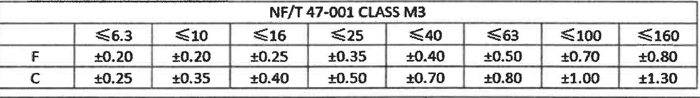

原图位置/视图名称：第 1 页右下 `NF/T 47-001 CLASS M3` 表，bbox `[2745, 2500, 4530, 2750]`，object_kind=`table`。

原表还原：

| NF/T 47-001 CLASS M3 | ≤6.3 | ≤10 | ≤16 | ≤25 | ≤40 | ≤63 | ≤100 | ≤160 |
|---|---:|---:|---:|---:|---:|---:|---:|---:|
| F | ±0.20 | ±0.20 | ±0.25 | ±0.35 | ±0.40 | ±0.50 | ±0.70 | ±0.80 |
| C | ±0.25 | ±0.35 | ±0.40 | ±0.50 | ±0.70 | ±0.80 | ±1.00 | ±1.30 |

| 提取项 | 原图数值或文本 | 含义说明 |
|---|---|---|
| 标准等级 | `NF/T 47-001 CLASS M3` | 橡胶件一般尺寸公差等级。 |
| F 行 | `±0.20, ±0.20, ±0.25, ±0.35, ±0.40, ±0.50, ±0.70, ±0.80` | F 类尺寸在不同名义尺寸范围下的公差。 |
| C 行 | `±0.25, ±0.35, ±0.40, ±0.50, ±0.70, ±0.80, ±1.00, ±1.30` | C 类尺寸在不同名义尺寸范围下的公差。 |

边界归属说明：裁切只包含公差表本体，已与下方标题栏分开。

## object_12 - 标题栏

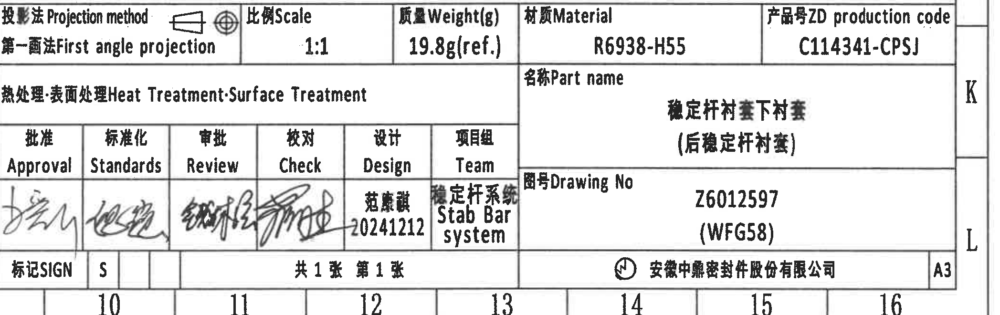

原图位置/视图名称：第 1 页右下标题栏，bbox `[2745, 2740, 4840, 3400]`，object_kind=`title_block`。

| 提取项 | 原图数值或文本 | 含义说明 |
|---|---|---|
| Projection method | `第一画法 First angle projection` | 投影法为第一角法。 |
| Scale | `1:1` | 比例。 |
| Weight(g) | `19.8g(ref.)` | 重量为参考值，括号内 `ref.` 表示参考。 |
| Material | `R6938-H55` | 材料牌号。 |
| ZD production code | `C114341-CPSJ` | 中鼎产品号/生产代码。 |
| Heat Treatment / Surface Treatment | 空白 | 热处理/表面处理栏未填写。 |
| Part name | `稳定杆衬套下衬套 (后稳定杆衬套)` | 零件名称；括号内容为参考/补充名称。 |
| Drawing No | `Z6012597 (WFG58)` | 图号；括号内为补充代码。 |
| Approval | 手写签名，未辨认 | 批准签字栏。 |
| Standards | 手写签名，未辨认 | 标准化签字栏。 |
| Review | 手写签名，未辨认 | 审批/审核签字栏。 |
| Check | 手写签名，未辨认 | 校对签字栏。 |
| Design | `范寅黄 20241212`（扫描字形略模糊） | 设计人员与日期。 |
| Team | `稳定杆系统 Stab Bar system` | 项目组。 |
| SIGN | `S` | 标记栏。 |
| Sheet | `共1张 第1张` | 共 1 张，第 1 张。 |
| Company | `安徽中鼎密封件股份有限公司` | 出图/公司名称。 |
| Format | `A3` | 图幅。 |

边界归属说明：裁切从投影法/比例/重量/材料/产品号行开始，未重复纳入上方公差表；底部图框列号 10-16 和右侧 J/K/L 图框字母属于边框索引，不作为标题栏字段。

## 裁切检查记录

| object_id | 对象 | 检查结论 |
|---|---|---|
| object_1 | 修订履历表 | 完整包含表头、首行记录、空白行和负责人列；顶部残留图框线不影响归属。 |
| object_2 | 主加工正视图 | `Ø21.7±0.2`、`2-C7`、`21.5±0.35`、`39.5±0.4` 的尺寸线、箭头、文字完整。 |
| object_3 | 右侧加工视图 | `30±0.4` 尺寸线、箭头、文字和 I 标识完整；未混入主视图。 |
| object_4 | 圆柱侧向加工视图 | 已因 `R2` 贴近边缘重裁；`R2`、`3`、`Ø2` 完整。 |
| object_5 | 立体示意图 | 已与坐标轴分开重裁；示意图完整，无尺寸文字。 |
| object_6 | Mould lower side | 已因混入相邻视图重裁；A/B/C/D 引线和文字完整。 |
| object_7 | Mould upper side | 已因混入图框坐标栏重裁；A/B/C/D 引线和文字完整。 |
| object_8 | 坐标轴局部图 | 已因 Y 字母贴边重裁；X/Y/Z 和箭头完整。 |
| object_9 | NOTES | 已收窄右边界；文本完整，未纳入右侧视图或立体示意图。 |
| object_10 | Stiffness requirement 表 | 表格列、行、表头和底部边界完整；图框编号不作为表格内容。 |
| object_11 | NF/T 47-001 CLASS M3 表 | 已与标题栏分开重裁；所有表头和数值完整。 |
| object_12 | 标题栏 | 字段完整；底部列号和右侧图框字母为边框索引，不作为标题栏字段。 |
