# 20C114342 PDF 内容识别与裁切提取

源文件: `input/20C114342.pdf`

整页渲染图:

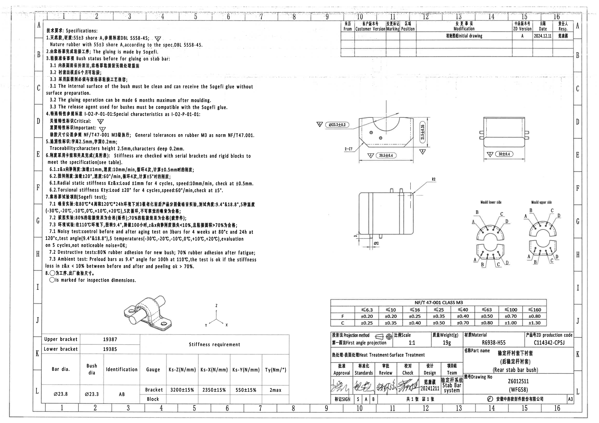

说明: PDF 为 1 页 A3 扫描图，先渲染为 `outputs/20C114342_assets/images/page_1.png`，再按加工视图、局部视图、表格、NOTES、标题栏分别裁切。bbox 格式为 `[x, y, width, height]`，坐标基于整页 PNG 左上角。

## object_1 - 技术要求 / Specifications / NOTES，位于页面左上至左中区域。

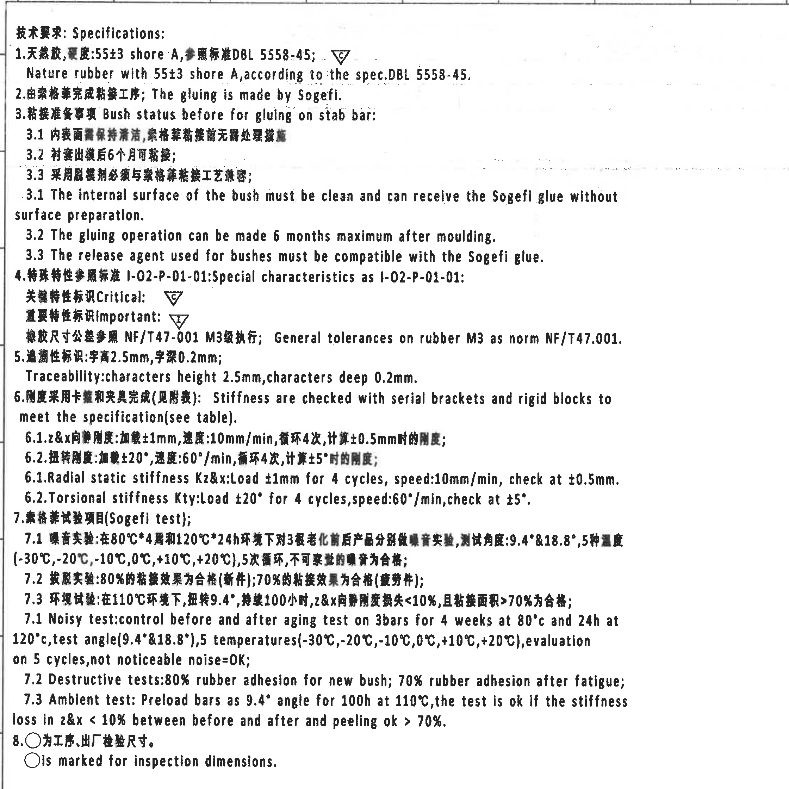

| 项目 | 内容 |
| --- | --- |
| object_kind | notes (NOTES) |
| 原图位置/视图名称 | 技术要求 / Specifications / NOTES，位于页面左上至左中区域。 |
| bbox | [340, 160, 2240, 2240] |

### 提取表格

| 提取项 | 原图数值或文本 | 含义说明 |
| --- | --- | --- |
| 技术要求; Specifications | 标题 | 左侧 NOTES 区标题，后续 1-8 条均属该区域。 |
| 55±3 shore A | 天然胶硬度 | 材料硬度要求，按 DBL 5558-45。 |
| DBL 5558-45 | 材料规范 | 天然橡胶规范依据。 |
| Sogefi | 粘接责任/工艺方 | 粘接由 Sogefi 完成，脱模剂需兼容 Sogefi 胶。 |
| 6 months maximum after moulding | 粘接时间窗口 | 衬套出模后最多 6 个月内可粘接。 |
| Critical: 倒三角 C | 关键特性标识 | 图中倒三角 C 表示关键特性。 |
| Important: 倒三角 I | 重要特性标识 | 图中倒三角 I 表示重要特性。 |
| NF/T47-001 M3 | 通用公差等级 | 橡胶尺寸公差按 M3。 |
| 字高2.5mm, 字深0.2mm | 追溯字符要求 | 追溯标识字符高度和深度。 |
| ±1mm, 10mm/min, 4 cycles, ±0.5mm | 径向静刚度 Kz&x 测试条件 | 加载/速度/循环次数/评价位移。 |
| ±20°, 60°/min, 4 cycles, ±5° | 扭转刚度 Kty 测试条件 | 加载角度、速度、循环次数和评价角度。 |
| 9.4° & 18.8° | 噪音试验角度 | 老化前后噪音试验角度。 |
| -30°C,-20°C,-10°C,0°C,+10°C,+20°C | 噪音试验温度 | 图中文字写作 5 temperatures，但列出 6 个温度点；按原图照录。 |
| 80% / 70% | 破坏试验粘接比例 | 新件 80% 橡胶粘附，疲劳后 70% 橡胶粘附。 |
| 110°C, 9.4°, 100h, z&x < 10%, peeling > 70% | 环境试验合格条件 | 高温扭转载荷后的刚度损失和剥离面积要求。 |
| ○ | 检验尺寸符号 | ○ 标记为工序、出厂检验尺寸。 |

### 边界归属说明

NOTES 说明材料、粘接、特性标识、通用公差、追溯性、刚度测试、Sogefi 试验和检验尺寸符号。该裁切只提取左侧文本区内容，不把右侧加工视图尺寸归入 NOTES。边界归属: 右侧留白截止于视图区之前，未包含任何加工视图尺寸线。

## object_2 - 修订履历表 / Modification table，位于页面右上。

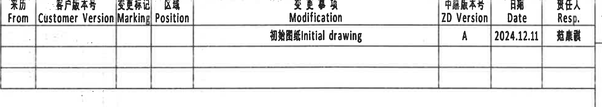

| 项目 | 内容 |
| --- | --- |
| object_kind | table (表格) |
| 原图位置/视图名称 | 修订履历表 / Modification table，位于页面右上。 |
| bbox | [2820, 180, 1950, 350] |

### 原表格还原

| From | Customer Version | Marking | Position | Modification | ZD Version | Date | Resp. |
| --- | --- | --- | --- | --- | --- | --- | --- |
|  |  |  |  | 初始图纸 Initial drawing | A | 2024.12.11 | 范康霞 |
|  |  |  |  |  |  |  |  |
|  |  |  |  |  |  |  |  |

### 提取表格

| 提取项 | 原图数值或文本 | 含义说明 |
| --- | --- | --- |
| From |  | 来源列，第一行为空。 |
| Customer Version |  | 客户版本列，第一行为空。 |
| Marking |  | 变更标记列，第一行为空。 |
| Position |  | 区域/位置列，第一行为空。 |
| Modification | 初始图纸 Initial drawing | 修订事项。 |
| ZD Version | A | 内部版本号。 |
| Date | 2024.12.11 | 修订/初版日期。 |
| Resp. | 范康霞 | 负责人。 |

### 边界归属说明

修订表记录初始发行状态。边界归属: 仅包含右上表格本体及表头/行线，不提取图框坐标数字或右侧分区字母。

## object_3 - 端面主视加工视图，位于页面上中偏右。

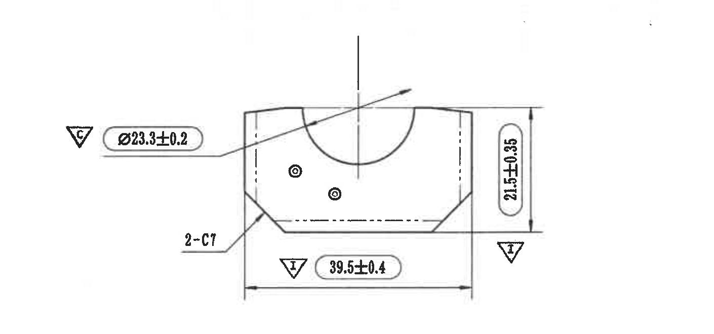

| 项目 | 内容 |
| --- | --- |
| object_kind | view (加工视图) |
| 原图位置/视图名称 | 端面主视加工视图，位于页面上中偏右。 |
| bbox | [2490, 760, 1410, 660] |

### 提取表格

| 提取项 | 原图数值或文本 | 含义说明 |
| --- | --- | --- |
| 倒三角 C | Critical symbol | 关键特性符号，靠近 Ø23.3±0.2。 |
| Ø23.3±0.2 | 直径尺寸 | 衬套/圆柱特征直径，公差 ±0.2，属于端面主视图。 |
| 21.5±0.35 | 垂直尺寸 | 端面视图总高度/截面高度，公差 ±0.35，标为重要特性。 |
| 39.5±0.4 | 水平尺寸 | 端面视图总宽度，公差 ±0.4，标为重要特性。 |
| 2-C7 | 数量前缀倒角/切角 | 两处 C7 倒角/切角，位于端面视图左下引出。 |
| 倒三角 I | Important symbol | 重要特性符号，分别靠近 21.5±0.35 和 39.5±0.4。 |

### 边界归属说明

该视图表达衬套端面轮廓、槽/孔特征和关键尺寸。Ø23.3±0.2 为带关键特性 C 的圆柱/衬套直径相关尺寸; 21.5±0.35 为垂直总高度尺寸并标为重要特性 I; 39.5±0.4 为水平总宽度尺寸并标为重要特性 I; 2-C7 表示两处 C7 倒角/切角。边界归属: 下边界收至宽度尺寸线下方，未包含下方侧视图 R2; 右侧高度尺寸线和左侧引出标注完整保留。

## object_4 - 右上正交视图，位于端面视图右侧。

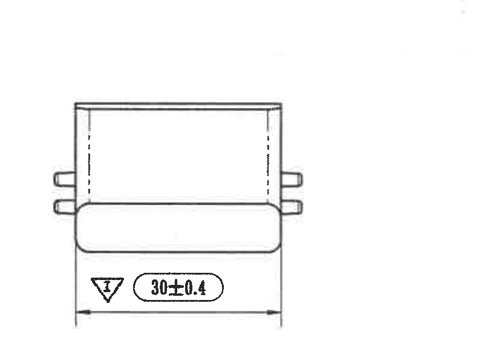

| 项目 | 内容 |
| --- | --- |
| object_kind | view (加工视图) |
| 原图位置/视图名称 | 右上正交视图，位于端面视图右侧。 |
| bbox | [3880, 800, 800, 560] |

### 提取表格

| 提取项 | 原图数值或文本 | 含义说明 |
| --- | --- | --- |
| 30±0.4 | 水平尺寸 | 右上正交视图底部总宽/长度，公差 ±0.4。 |
| 倒三角 I | Important symbol | 重要特性符号，靠近 30±0.4。 |

### 边界归属说明

该视图表达零件另一方向外形宽度/长度。30±0.4 为视图底部水平尺寸，标为重要特性 I。边界归属: 裁切包含完整底部尺寸线、箭头/延长线和标注文字; 不包含左侧端面主视图的尺寸。

## object_5 - 中部侧视加工视图，位于页面中部偏右。

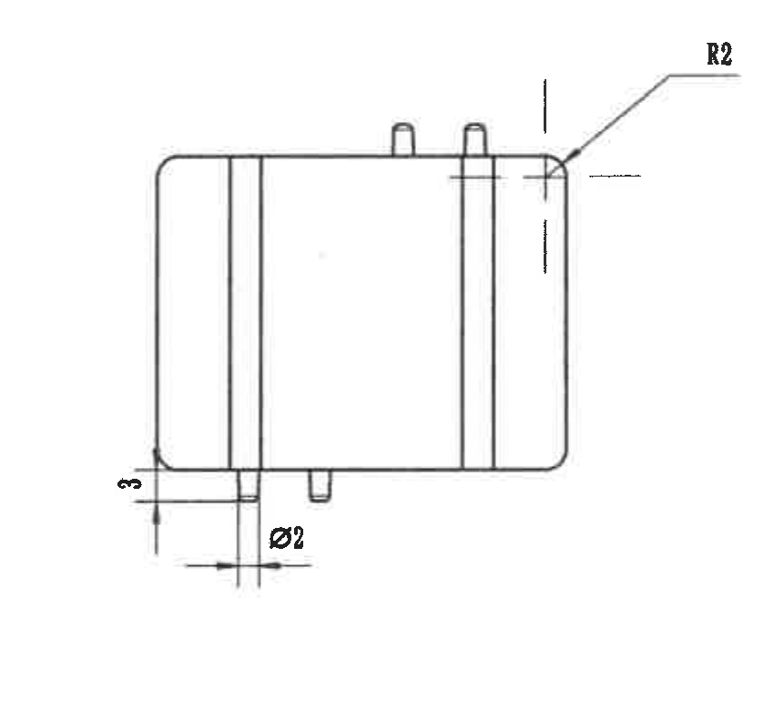

| 项目 | 内容 |
| --- | --- |
| object_kind | view (加工视图) |
| 原图位置/视图名称 | 中部侧视加工视图，位于页面中部偏右。 |
| bbox | [2800, 1425, 850, 780] |

### 提取表格

| 提取项 | 原图数值或文本 | 含义说明 |
| --- | --- | --- |
| R2 | 圆角半径 | 右端上角半径 2，属于中部侧视图。 |
| Ø2 | 直径尺寸 | 底部局部圆孔/圆柱特征直径，属于侧视图底部局部特征。 |
| 3 | 线性尺寸 | 左下局部高度/台阶尺寸。 |

### 边界归属说明

该视图表达衬套侧向外形、端部圆角和底部小孔/小凸台。R2 为右上端部圆角半径; Ø2 为底部局部圆孔或圆柱特征直径; 3 为左下局部高度/台阶尺寸。边界归属: R2 属于本侧视图，不归入上方端面视图; 底部 Ø2 和 3 的尺寸线完整保留。

## object_6 - Mould lower side / Mould upper side 局部标识视图，位于页面右中。

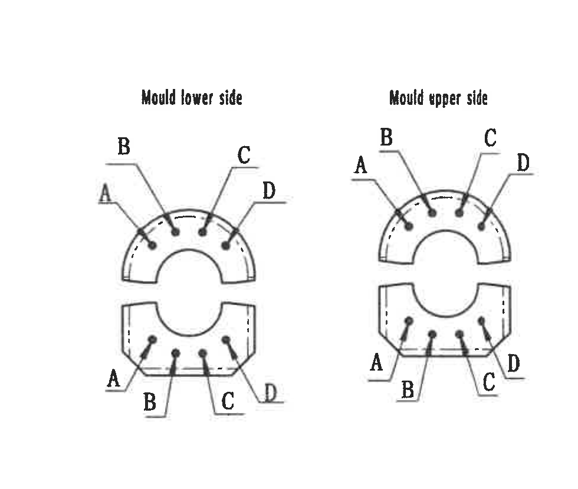

| 项目 | 内容 |
| --- | --- |
| object_kind | detail (局部视图) |
| 原图位置/视图名称 | Mould lower side / Mould upper side 局部标识视图，位于页面右中。 |
| bbox | [3740, 1510, 980, 830] |

### 提取表格

| 提取项 | 原图数值或文本 | 含义说明 |
| --- | --- | --- |
| Mould lower side | 局部视图标题 | 左侧上下两半圆/半块表示模具下侧标识位置。 |
| Mould upper side | 局部视图标题 | 右侧上下两半圆/半块表示模具上侧标识位置。 |
| A/B/C/D | 点位标识 | 各引线指向孔位/点位，说明上下模侧对应关系，无数值尺寸。 |

### 边界归属说明

该局部图说明模具下侧和模具上侧的 A/B/C/D 位置对应关系，用于区分不同点位或标识位置。该对象没有数值尺寸、公差或角度。边界归属: 两个小局部图作为同一 detail 对象处理，未混入左侧侧视图尺寸。

## object_7 - 三维轴测示意图及坐标轴，位于页面左下中部。

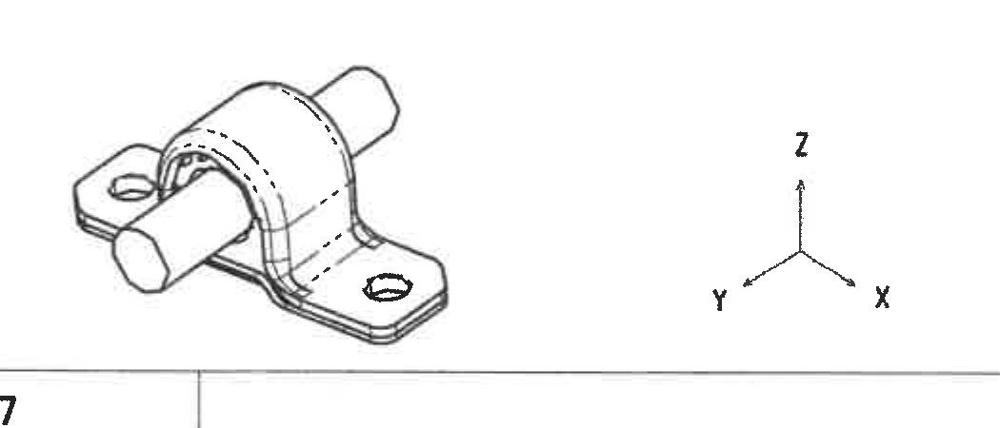

| 项目 | 内容 |
| --- | --- |
| object_kind | view (加工视图) |
| 原图位置/视图名称 | 三维轴测示意图及坐标轴，位于页面左下中部。 |
| bbox | [950, 2380, 1050, 450] |

### 提取表格

| 提取项 | 原图数值或文本 | 含义说明 |
| --- | --- | --- |
| X/Y/Z | 坐标轴 | 显示零件方向定义。 |
| 三维轴测图 | 外观示意 | 表达后稳定杆衬套组件外形，无尺寸提取项。 |

### 边界归属说明

用于说明零件空间形态和 X/Y/Z 方向。边界归属: 仅提取三维示意和坐标轴，不提取下方刚度表内容。

## object_8 - 刚度要求表 / Stiffness requirement table，位于页面左下。

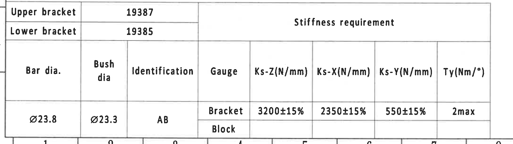

| 项目 | 内容 |
| --- | --- |
| object_kind | table (表格) |
| 原图位置/视图名称 | 刚度要求表 / Stiffness requirement table，位于页面左下。 |
| bbox | [320, 2760, 2170, 610] |

### 原表格还原

| Upper bracket | 19387 | Stiffness requirement |  |  |  |  |  |
| --- | --- | --- | --- | --- | --- | --- | --- |
| Lower bracket | 19385 |  |  |  |  |  |  |
| Bar dia. | Bush dia | Identification | Gauge | Ks-Z(N/mm) | Ks-X(N/mm) | Ks-Y(N/mm) | Ty(Nm/°) |
| Ø23.8 | Ø23.3 | AB | Bracket | 3200±15% | 2350±15% | 550±15% | 2max |
|  |  |  | Block |  |  |  |  |

### 提取表格

| 提取项 | 原图数值或文本 | 含义说明 |
| --- | --- | --- |
| Upper bracket | 19387 | 上支架编号。 |
| Lower bracket | 19385 | 下支架编号。 |
| Bar dia. | Ø23.8 | 稳定杆杆径。 |
| Bush dia | Ø23.3 | 衬套直径。 |
| Identification | AB | 识别标识。 |
| Gauge | Bracket | 刚度值所在量具/夹具行。 |
| Ks-Z(N/mm) | 3200±15% | Z 向刚度要求。 |
| Ks-X(N/mm) | 2350±15% | X 向刚度要求。 |
| Ks-Y(N/mm) | 550±15% | Y 向刚度要求。 |
| Ty(Nm/°) | 2max | 扭转刚度上限。 |
| Gauge | Block | Block 行存在但数值格为空。 |

### 边界归属说明

表格给出支架编号、杆径、衬套直径、识别码和刚度验收指标。Ø23.8 是 Bar dia.; Ø23.3 是 Bush dia.; Bracket 行为有效刚度要求，Block 行无填充值。边界归属: 表格紧贴底部图框坐标，裁切保留表格本体和底边线; 底部坐标数字不作为表格字段提取。

## object_9 - NF/T 47-001 CLASS M3 通用公差表，位于页面右下上方。

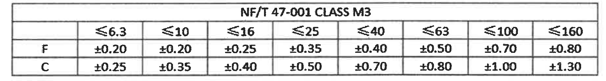

| 项目 | 内容 |
| --- | --- |
| object_kind | table (表格) |
| 原图位置/视图名称 | NF/T 47-001 CLASS M3 通用公差表，位于页面右下上方。 |
| bbox | [2700, 2470, 1850, 250] |

### 原表格还原

| NF/T 47-001 CLASS M3 | ≤6.3 | ≤10 | ≤16 | ≤25 | ≤40 | ≤63 | ≤100 | ≤160 |
| --- | --- | --- | --- | --- | --- | --- | --- | --- |
| F | ±0.20 | ±0.20 | ±0.25 | ±0.35 | ±0.40 | ±0.50 | ±0.70 | ±0.80 |
| C | ±0.25 | ±0.35 | ±0.40 | ±0.50 | ±0.70 | ±0.80 | ±1.00 | ±1.30 |

### 提取表格

| 提取项 | 原图数值或文本 | 含义说明 |
| --- | --- | --- |
| ≤6.3 / F | ±0.20 | NF/T 47-001 CLASS M3 中 F 行公差。 |
| ≤10 / F | ±0.20 | F 行公差。 |
| ≤16 / F | ±0.25 | F 行公差。 |
| ≤25 / F | ±0.35 | F 行公差。 |
| ≤40 / F | ±0.40 | F 行公差。 |
| ≤63 / F | ±0.50 | F 行公差。 |
| ≤100 / F | ±0.70 | F 行公差。 |
| ≤160 / F | ±0.80 | F 行公差。 |
| ≤6.3 / C | ±0.25 | C 行公差。 |
| ≤10 / C | ±0.35 | C 行公差。 |
| ≤16 / C | ±0.40 | C 行公差。 |
| ≤25 / C | ±0.50 | C 行公差。 |
| ≤40 / C | ±0.70 | C 行公差。 |
| ≤63 / C | ±0.80 | C 行公差。 |
| ≤100 / C | ±1.00 | C 行公差。 |
| ≤160 / C | ±1.30 | C 行公差。 |

### 边界归属说明

该表用于橡胶尺寸通用公差，NOTES 中说明按 NF/T47-001 M3 执行。边界归属: 仅包含公差表，已排除下方标题栏字段。

## object_10 - 标题栏，位于页面右下。

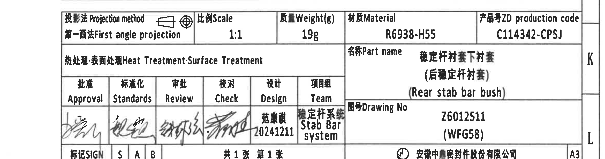

| 项目 | 内容 |
| --- | --- |
| object_kind | title_block (标题栏) |
| 原图位置/视图名称 | 标题栏，位于页面右下。 |
| bbox | [2500, 2705, 2340, 620] |

### 标题栏结构还原

| 字段 | 原图文本/数值 |
| --- | --- |
| Projection method | First angle projection |
| Scale | 1:1 |
| Weight(g) | 19g |
| Material | R6938-H55 |
| ZD production code | C114342-CPSJ |
| Heat Treatment / Surface Treatment |  |
| Part name | 稳定杆衬套下衬套（后稳定杆衬套） / Rear stab bar bush |
| Drawing No | Z6012511 (WFG58) |
| Approval / Standards / Review / Check | 签名字段 |
| Design | 范康霞 20241211 |
| Team | 稳定杆系统 / Stab Bar system |
| SIGN | S A B |
| Sheet | 共1张 第1张 |
| Company | 安徽中鼎密封件股份有限公司 |
| Sheet size | A3 |

### 提取表格

| 提取项 | 原图数值或文本 | 含义说明 |
| --- | --- | --- |
| Projection method | First angle projection | 第一角法投影。 |
| Scale | 1:1 | 图纸比例。 |
| Weight(g) | 19g | 产品重量。 |
| Material | R6938-H55 | 材料牌号。 |
| ZD production code | C114342-CPSJ | 产品号。 |
| Heat Treatment / Surface Treatment |  | 标题存在，值栏未见填写。 |
| Part name | 稳定杆衬套下衬套（后稳定杆衬套） / Rear stab bar bush | 零件名称。 |
| Drawing No | Z6012511 (WFG58) | 图号。 |
| Design | 范康霞 20241211 | 设计人和日期。 |
| Team | 稳定杆系统 / Stab Bar system | 项目组/系统。 |
| SIGN | S A B | 签名/标记栏。 |
| Sheet | 共1张 第1张 | 总页数和当前页。 |
| Company | 安徽中鼎密封件股份有限公司 | 公司名称。 |
| Sheet size | A3 | 图幅。 |

### 边界归属说明

标题栏还原产品基本属性、签审栏和图纸编号。边界归属: 裁切包含完整标题栏外框和 A3 栏; 底部图框坐标贴近标题栏，未作为标题栏字段提取。

## 裁切检查记录

| 对象 | 裁切对象 | 检查结论 | 完整性/重裁记录 |
| --- | --- | --- | --- |
| object_1 | NOTES | 通过 | 包含 NOTES 编号 1-8、英文/中文文本和符号说明；右侧裁到文字区留白，未带入右侧视图尺寸。 |
| object_2 | 修订履历表 | 通过 | 包含表头、第一行修订记录和空白行线；未把图框坐标作为表格字段。 |
| object_3 | 端面主视加工视图 | 通过 | 重裁后完整包含 Ø23.3±0.2、2-C7、21.5±0.35、39.5±0.4 及 C/I 符号；下边界排除了下方侧视图 R2。 |
| object_4 | 右上正交视图 | 通过 | 重裁后完整包含 30±0.4、I 符号、底部尺寸线和延长线；未混入端面视图。 |
| object_5 | 中部侧视加工视图 | 通过 | 包含 R2、Ø2、3 及对应引线/尺寸线；R2 明确归属侧视图。 |
| object_6 | 模具上下侧局部视图 | 通过 | 包含 Mould lower side、Mould upper side 和全部 A/B/C/D 引线标识；无数值尺寸。 |
| object_7 | 三维轴测示意图 | 通过 | 包含零件轴测图和 X/Y/Z 坐标轴；未包含下方刚度表。 |
| object_8 | 刚度要求表 | 通过 | 包含完整表格本体、支架编号、杆径/衬套直径和刚度行；因表格贴近图框，底部坐标区不作为提取内容。 |
| object_9 | NF/T 47-001 CLASS M3 表 | 通过 | 重裁后仅包含公差表表头和 F/C 两行，排除下方标题栏。 |
| object_10 | 标题栏 | 通过 | 包含标题栏完整外框、投影法、比例、重量、材料、产品号、名称、图号、签审栏、公司和 A3 栏；底部图框坐标不作为标题栏字段。 |

## sidecar manifest 覆盖说明

`outputs/20C114342_manifest.json` 的 `objects.text`、`objects.context` 和 `entities` 已写入上述尺寸、参考/说明性文本、表格字段、标题栏字段和边界归属说明；图片路径均为相对当前目录路径。