# 20C114343.pdf 内容识别与裁切提取

整页渲染：`outputs/20C114343_assets/images/page_1.png`，尺寸 4959 x 3505 px，bbox `[0, 0, 4959, 3505]`。  
本页未见以剖切线、SECTION 字样或剖面代号标识的独立剖面视图；已按可见对象裁切为 NOTES、修订履历表、加工视图、局部视图、表格和标题栏。

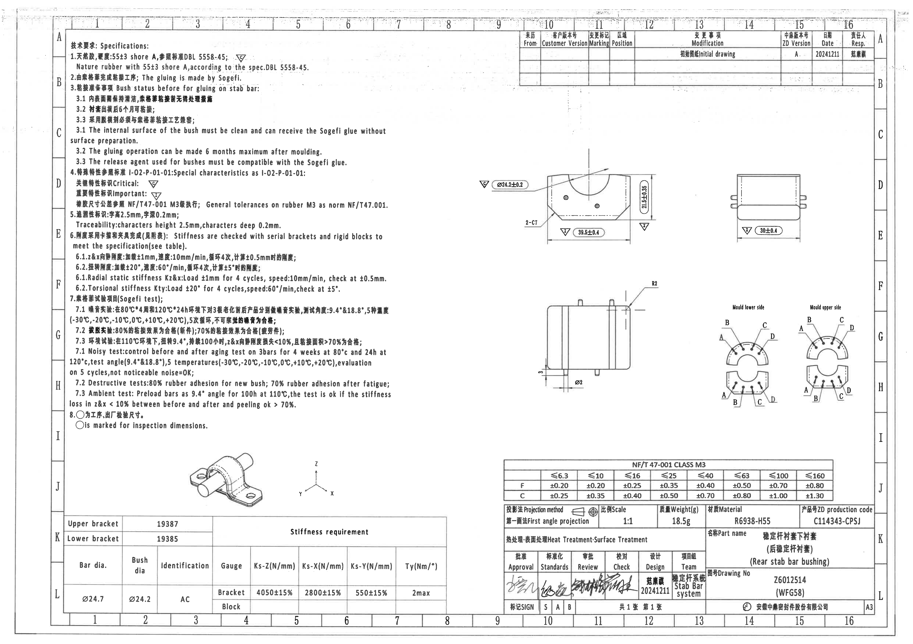

## object_1 - NOTES / 技术要求

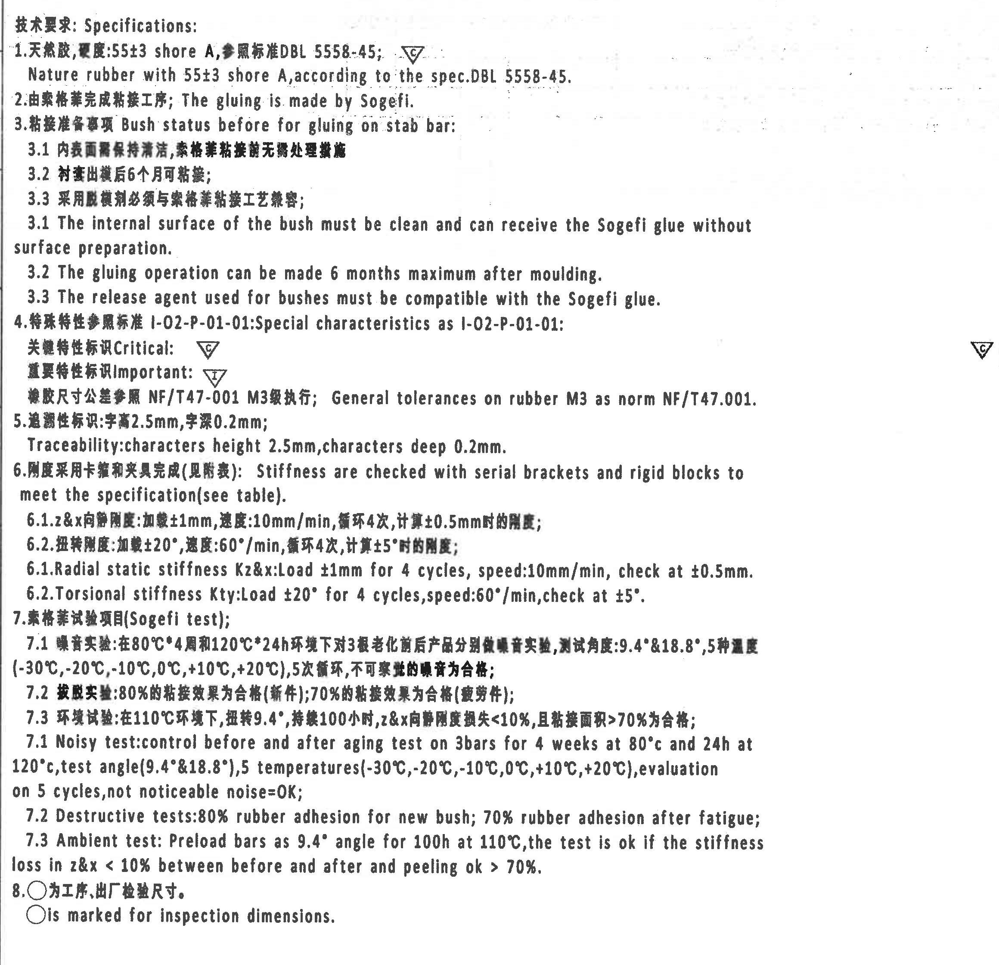

原图位置/视图名称：左上至左中 NOTES/Specifications，bbox `[350, 190, 2670, 2430]`。

### 提取表格

| 提取项 | 原图数值或文本 | 含义说明 |
|---|---|---|
| 标题 | 技术要求; Specifications: | 图纸技术要求区标题。 |
| 1 材料硬度 | 天然胶, 硬度:55±3 shore A, 参照标准 DBL 5558-45; Critical 三角 C | 天然橡胶材料硬度为 55±3 Shore A，按 DBL 5558-45；旁有 C 关键特性符号。 |
| 1 英文 | Nature rubber with 55±3 shore A, according to the spec.DBL 5558-45. | 与第 1 条中文对应。 |
| 2 粘接 | 由索格菲完成粘接工序; The gluing is made by Sogefi. | 粘接工序由 Sogefi 执行。 |
| 3 粘接准备 | 粘接准备事项 Bush status before for gluing on stab bar: | 稳定杆粘接前的衬套状态要求。 |
| 3.1 中文 | 内表面需保持清洁, 橡胶粘接前无需处理缝隙 | 原图字迹较粗，含义为内表面清洁，粘接前无需额外表面处理。 |
| 3.2 中文 | 衬套出模后6个月可粘接 | 出模后最长 6 个月内可进行粘接。 |
| 3.3 中文 | 采用脱模剂必须与索格菲粘接工艺兼容 | 脱模剂需与 Sogefi 粘接工艺兼容。 |
| 3.1 英文 | The internal surface of the bush must be clean and can receive the Sogefi glue without surface preparation. | 内表面清洁且无需表面预处理即可接收 Sogefi 胶。 |
| 3.2 英文 | The gluing operation can be made 6 months maximum after moulding. | 成型后最多 6 个月内粘接。 |
| 3.3 英文 | The release agent used for bushes must be compatible with the Sogefi glue. | 脱模剂必须与 Sogefi 胶兼容。 |
| 4 特殊特性 | 特殊特性参照标准 I-02-P-01-01; Special characteristics as I-02-P-01-01: | 特殊特性符号按 I-02-P-01-01。 |
| 4 关键特性 | 关键特性标识 Critical: 三角 C | 图纸中三角 C 表示关键特性。 |
| 4 重要特性 | 重要特性标识 Important: 三角 I | 图纸中三角 I 表示重要特性/检验特性。 |
| 通用公差 | 橡胶尺寸公差参照 NF/T47-001 M3级执行; General tolerances on rubber M3 as norm NF/T47.001. | 未单独标注公差的橡胶尺寸按 NF/T47-001 M3 级。 |
| 5 追溯性 | 追溯性标识: 字高2.5mm, 字深0.2mm; Traceability: characters height 2.5mm, characters deep 0.2mm. | 追溯字符高度 2.5 mm，深度 0.2 mm。 |
| 6 刚度检查 | 刚度采用卡箍和夹具完成(见附表); Stiffness are checked with serial brackets and rigid blocks to meet the specification(see table). | 刚度使用卡箍/刚性块检查，要求见刚度表。 |
| 6.1 中文 | z&x向静刚度: 加载±1mm, 速度:10mm/min, 循环4次, 计算±0.5mm时的刚度 | Z/X 向静刚度测试条件。 |
| 6.2 中文 | 扭转刚度: 加载±20°, 速度:60°/min, 循环4次, 计算±5°时的刚度 | 扭转刚度测试条件。 |
| 6.1 英文 | Radial static stiffness Kz&x: Load ±1mm for 4 cycles, speed:10mm/min, check at ±0.5mm. | Z/X 向径向静刚度测试条件。 |
| 6.2 英文 | Torsional stiffness Kty: Load ±20° for 4 cycles,speed:60°/min,check at ±5°. | 扭转刚度测试条件。 |
| 7 标题 | 索格菲试验项目(Sogefi test); | Sogefi 试验项目。 |
| 7.1 中文 | 噪音实验: 在80°C*4周和120°C*24h环境下对3根老化前后产品分别做噪音实验, 测试角度:9.4°&18.8°, 5种温度(-30°C,-20°C,-10°C,0°C,+10°C,+20°C), 5次循环, 不可察觉的噪音为合格 | 噪音试验条件和判定。原文写 5 种温度但列出 6 个温度点，按原图保留。 |
| 7.2 中文 | 破坏实验: 80%的粘接效果为合格(新件); 70%的粘接效果为合格(疲劳件); | 新件/疲劳件粘接保持率判定。 |
| 7.3 中文 | 环境试验: 在110°C环境下, 扭转9.4°, 持续100小时, z&x向静刚度损失<10%, 且粘接面积>70%为合格 | 环境试验判定。 |
| 7.1 英文 | Noisy test: control before and after aging test on 3bars for 4 weeks at 80°C and 24h at 120°C,test angle(9.4°&18.8°),5 temperatures(-30°C,-20°C,-10°C,0°C,+10°C,+20°C),evaluation on 5 cycles,not noticeable noise=OK; | 噪音试验英文要求。 |
| 7.2 英文 | Destructive tests:80% rubber adhesion for new bush; 70% rubber adhesion after fatigue; | 破坏试验英文要求。 |
| 7.3 英文 | Ambient test: Preload bars as 9.4° angle for 100h at 110°C,the test is ok if the stiffness loss in z&x < 10% between before and after and peeling ok > 70%. | 环境试验英文要求。 |
| 8 检验标记 | ○为工序,出厂检验尺寸. ○is marked for inspection dimensions. | 圆圈标记表示工序/出厂检验尺寸。 |

边界归属说明：该裁切仅包含左侧 NOTES 区域；右侧空白中的淡痕为扫描背景，不作为表格或视图信息。右侧可见的 C/I 符号仍属于 NOTES 中“关键/重要特性标识”说明，不归入加工视图。

## object_2 - 修订履历表

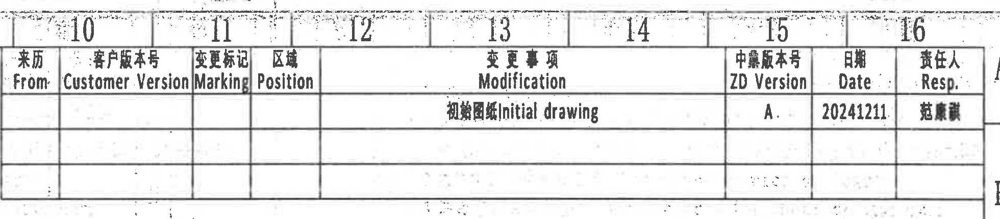

原图位置/视图名称：右上修订履历表，bbox `[2820, 75, 4780, 505]`。

### 原表还原

| 来历 From | 客户版本号 Customer Version | 变更标记 Marking | 区域 Position | 变更事项 Modification | 中鑫版本号 ZD Version | 日期 Date | 责任人 Resp. |
|---|---|---|---|---|---|---|---|
|  |  |  |  | 初始图纸 Initial drawing | A | 20241211 | 范康曦 |
|  |  |  |  |  |  |  |  |
|  |  |  |  |  |  |  |  |

### 提取表格

| 提取项 | 原图数值或文本 | 含义说明 |
|---|---|---|
| 表头 | From, Customer Version, Marking, Position, Modification, ZD Version, Date, Resp. | 修订履历列名。 |
| 首行修订 | 初始图纸 Initial drawing | 初版图纸说明。 |
| ZD Version | A | 中鑫版本号。 |
| Date | 20241211 | 修订日期，格式为 YYYYMMDD。 |
| Resp. | 范康曦 | 责任人，按原图识读。 |

边界归属说明：表格右侧出现图框分区字母 A/B 的边缘，但不属于表格字段；表格内只有首行有内容，其余行为空白。

## object_3 - 正面主加工视图

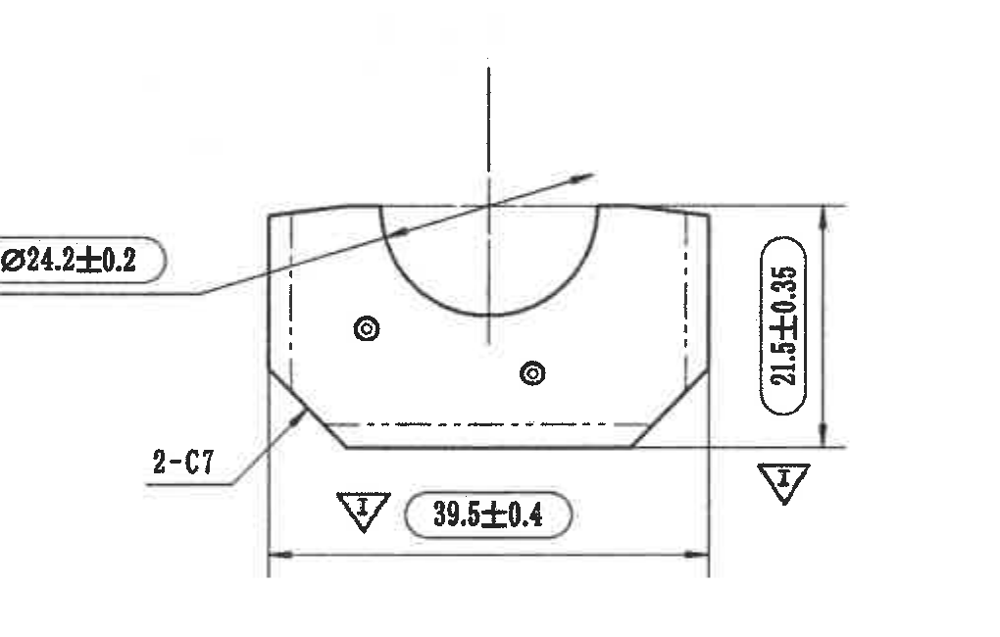

原图位置/视图名称：右中上正面主加工视图，bbox `[2700, 740, 3720, 1390]`。

### 提取表格

| 提取项 | 原图数值或文本 | 含义说明 |
|---|---|---|
| 关键尺寸 | 三角 C + Ø24.2±0.2 | 带 C 关键特性符号的直径尺寸，指向上部半圆/衬套配合圆弧区域。 |
| 倒角/斜角数量 | 2-C7 | 两处 C7 倒角或斜面特征，箭头指向左下斜角；对称位置同属该主视图。 |
| 重要尺寸 | 三角 I + 39.5±0.4 | 底部横向总宽/安装宽度尺寸，带 I 重要特性符号。 |
| 重要尺寸 | 三角 I + 21.5±0.35 | 右侧竖向高度尺寸，带 I 重要特性符号。 |
| 隐线/中心线 | 竖向中心线、两侧虚线、底部虚线 | 表示内部/对称或隐藏结构，不是独立尺寸值。 |
| 参考尺寸 | 未见括号形式参考尺寸 | 此视图没有括号尺寸。 |
| 星号/T 编号 | 未见星号关键尺寸或 T 编号 | 关键/重要属性通过三角 C/I 表示。 |

边界归属说明：左侧 `Ø24.2±0.2` 标注和引线完整包含并指向本主视图；未把 NOTES 中的 C/I 符号混入。右侧 `21.5±0.35` 的完整尺寸线和箭头属于本主视图，不归入右上侧视图。

## object_4 - 右上侧向加工视图

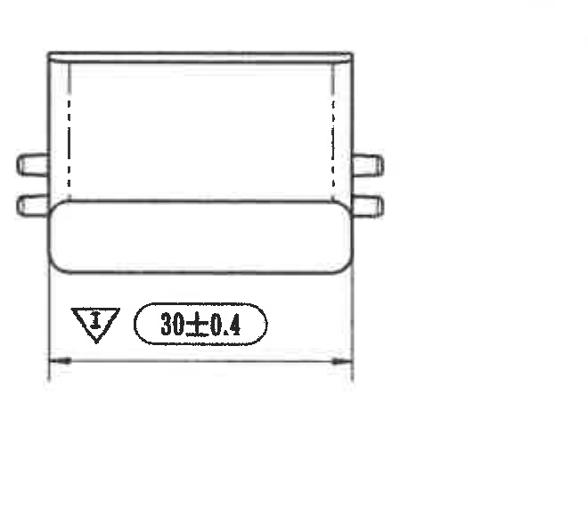

原图位置/视图名称：右上侧向加工视图，bbox `[3950, 890, 4610, 1460]`。

### 提取表格

| 提取项 | 原图数值或文本 | 含义说明 |
|---|---|---|
| 重要尺寸 | 三角 I + 30±0.4 | 下方横向宽度尺寸，带 I 重要特性符号。 |
| 外伸结构 | 左右侧小凸耳/销状外形 | 仅为形体表达，未见独立数值。 |
| 参考尺寸 | 未见括号形式参考尺寸 | 此视图没有括号尺寸。 |
| 星号/T 编号 | 未见星号关键尺寸或 T 编号 | 无星号/T 编号标注。 |

边界归属说明：裁切完整包含 `30±0.4` 数值、尺寸线、箭头和 I 标识；未包含主视图的 `21.5±0.35` 尺寸。

## object_5 - 下方侧向加工视图

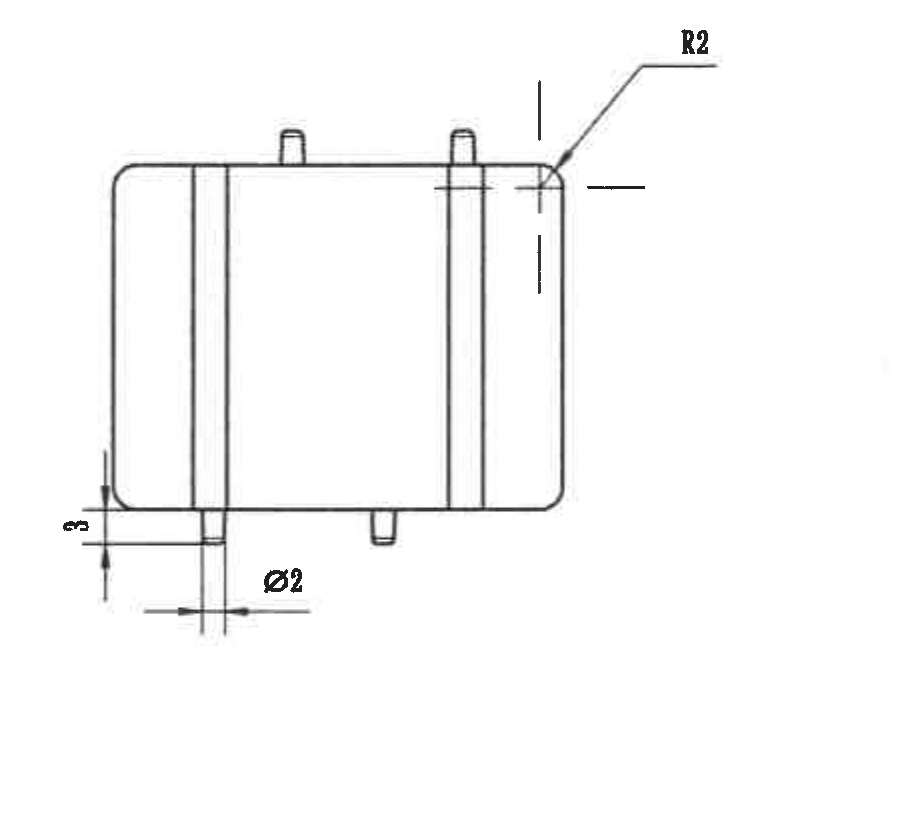

原图位置/视图名称：中下侧向加工视图，bbox `[2860, 1500, 3760, 2320]`。

### 提取表格

| 提取项 | 原图数值或文本 | 含义说明 |
|---|---|---|
| 圆角半径 | R2 | 右上角圆角半径，箭头指向外轮廓圆角。 |
| 直径 | Ø2 | 下方凸柱/销状特征直径。 |
| 竖向尺寸 | 3 | 左下局部高度/台阶尺寸，原图无显式公差。 |
| 一般公差归属 | NF/T47-001 M3 | 对未单独标注公差的 `R2`、`Ø2`、`3`，按 NOTES 和公差表的一般公差执行。 |
| 参考尺寸 | 未见括号形式参考尺寸 | 此视图没有括号尺寸。 |
| 星号/T 编号 | 未见星号关键尺寸或 T 编号 | 无星号/T 编号标注。 |

边界归属说明：`R2`、`Ø2`、`3` 的文字和箭头/尺寸线均在本裁切内；右侧的局部模具侧视图未被纳入。

## object_6 - Mould lower side 局部视图

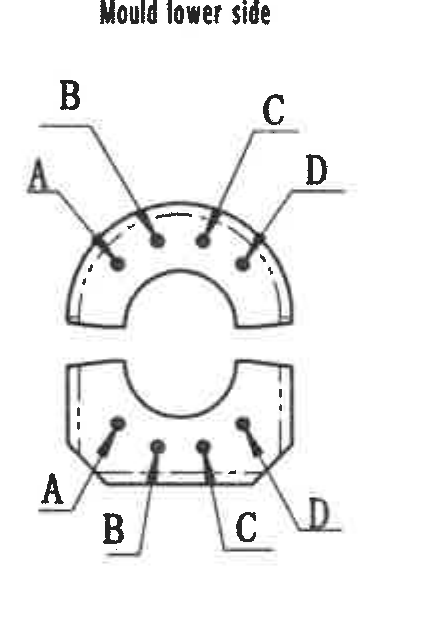

原图位置/视图名称：右中下 Mould lower side 局部视图，bbox `[3880, 1660, 4310, 2300]`。

### 提取表格

| 提取项 | 原图数值或文本 | 含义说明 |
|---|---|---|
| 局部视图标题 | Mould lower side | 下模侧局部视图。 |
| 上半部位置标识 | A, B, C, D | 四个点位/标识引线指向上半圆弧区域。 |
| 下半部位置标识 | A, B, C, D | 四个点位/标识引线指向下半部区域。 |
| 虚线 | 两侧虚线 | 表示隐藏边/内侧轮廓。 |
| 数值尺寸 | 未见数值尺寸 | 此局部图只给出 A/B/C/D 标识，无尺寸数值、公差或参考尺寸。 |

边界归属说明：裁切已去除右侧上模视图片段，仅保留下模侧 A/B/C/D 引线和文字；不得将右侧上模图中的标识归入本对象。

## object_7 - Mould upper side 局部视图

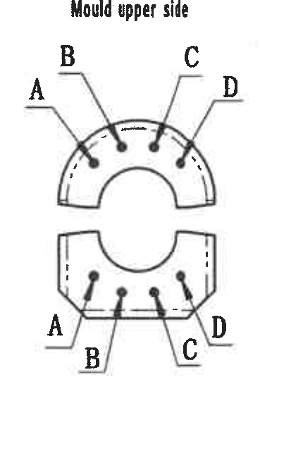

原图位置/视图名称：右中下 Mould upper side 局部视图，bbox `[4300, 1660, 4730, 2300]`。

### 提取表格

| 提取项 | 原图数值或文本 | 含义说明 |
|---|---|---|
| 局部视图标题 | Mould upper side | 上模侧局部视图。 |
| 上半部位置标识 | A, B, C, D | 四个点位/标识引线指向上半圆弧区域。 |
| 下半部位置标识 | A, B, C, D | 四个点位/标识引线指向下半部区域。 |
| 虚线 | 两侧虚线 | 表示隐藏边/内侧轮廓。 |
| 数值尺寸 | 未见数值尺寸 | 此局部图只给出 A/B/C/D 标识，无尺寸数值、公差或参考尺寸。 |

边界归属说明：裁切已去除右侧图框分区栏，仅保留上模侧局部图；左侧下模侧图未纳入。

## object_8 - 等轴测外形视图

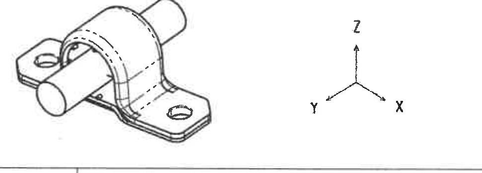

原图位置/视图名称：左下等轴测外形视图，bbox `[1000, 2470, 1970, 2820]`。

### 提取表格

| 提取项 | 原图数值或文本 | 含义说明 |
|---|---|---|
| 外形 | 稳定杆衬套与底座/安装耳组合外形 | 说明零件总体空间形态。 |
| 坐标轴 | X, Y, Z | 表示图中方向参考。 |
| 孔/杆/衬套形态 | 圆杆穿过衬套，左右安装孔 | 形体示意，无独立尺寸标注。 |
| 数值尺寸 | 未见数值尺寸 | 等轴测图未给出尺寸、公差或参考尺寸。 |

边界归属说明：底部残留的一条水平线为相邻刚度表上边框/图面分隔线，不作为等轴测信息；没有带入刚度表文字。

## object_9 - Stiffness requirement 刚度要求表

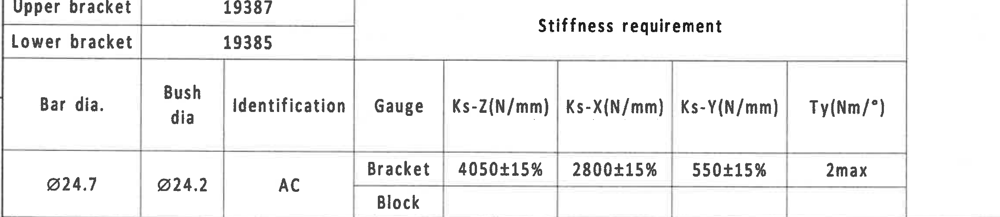

原图位置/视图名称：左下刚度要求表，bbox `[340, 2835, 2640, 3335]`。

### 原表还原

原图存在合并单元格，Markdown 中以相邻表格保留其行列结构。

| Bracket item | Code |
|---|---|
| Upper bracket | 19387 |
| Lower bracket | 19385 |

| Bar dia. | Bush dia | Identification | Gauge | Ks-Z(N/mm) | Ks-X(N/mm) | Ks-Y(N/mm) | Ty(Nm/°) |
|---|---|---|---|---|---|---|---|
| Ø24.7 | Ø24.2 | AC | Bracket | 4050±15% | 2800±15% | 550±15% | 2max |
| Ø24.7 | Ø24.2 | AC | Block |  |  |  |  |

### 提取表格

| 提取项 | 原图数值或文本 | 含义说明 |
|---|---|---|
| Upper bracket | 19387 | 上卡箍/支架编号。 |
| Lower bracket | 19385 | 下卡箍/支架编号。 |
| Bar dia. | Ø24.7 | 稳定杆直径。 |
| Bush dia | Ø24.2 | 衬套直径。 |
| Identification | AC | 识别标识。 |
| Gauge | Bracket / Block | 检具形式，Bracket 行给出刚度要求，Block 行为空。 |
| Ks-Z(N/mm) | 4050±15% | Z 向刚度要求。 |
| Ks-X(N/mm) | 2800±15% | X 向刚度要求。 |
| Ks-Y(N/mm) | 550±15% | Y 向刚度要求。 |
| Ty(Nm/°) | 2max | 扭转刚度/力矩角度指标最大值。 |

边界归属说明：表格完整包含上下 bracket 编号和刚度数据；底部图框坐标栏已裁掉，不作为表格内容。

## object_10 - NF/T47-001 CLASS M3 公差表

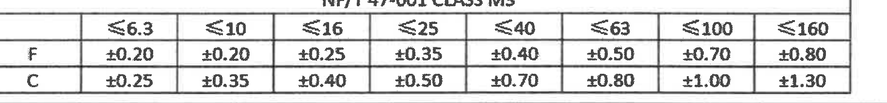

原图位置/视图名称：右下上方公差表，bbox `[2770, 2530, 4600, 2745]`。

### 原表还原

| NF/T47-001 CLASS M3 | ≤6.3 | ≤10 | ≤16 | ≤25 | ≤40 | ≤63 | ≤100 | ≤160 |
|---|---|---|---|---|---|---|---|---|
| F | ±0.20 | ±0.20 | ±0.25 | ±0.35 | ±0.40 | ±0.50 | ±0.70 | ±0.80 |
| C | ±0.25 | ±0.35 | ±0.40 | ±0.50 | ±0.70 | ±0.80 | ±1.00 | ±1.30 |

### 提取表格

| 提取项 | 原图数值或文本 | 含义说明 |
|---|---|---|
| 标题 | NF/T47-001 CLASS M3 | 与 NOTES 中“一般公差”对应。 |
| 尺寸范围 | ≤6.3, ≤10, ≤16, ≤25, ≤40, ≤63, ≤100, ≤160 | 公差按名义尺寸范围分列。 |
| F 行 | ±0.20, ±0.20, ±0.25, ±0.35, ±0.40, ±0.50, ±0.70, ±0.80 | F 类公差值。 |
| C 行 | ±0.25, ±0.35, ±0.40, ±0.50, ±0.70, ±0.80, ±1.00, ±1.30 | C 类公差值。 |

边界归属说明：裁切只包含公差表本体；下方标题栏字段未纳入。

## object_11 - 标题栏

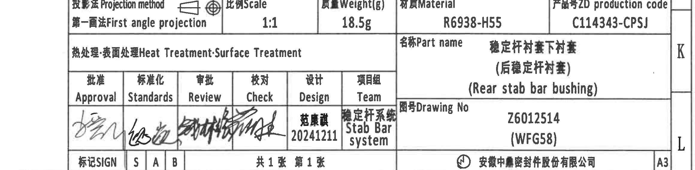

原图位置/视图名称：右下标题栏，bbox `[2510, 2760, 4830, 3330]`。

### 提取表格

| 提取项 | 原图数值或文本 | 含义说明 |
|---|---|---|
| Projection method | 第一画法 First angle projection | 投影法为第一角法。 |
| Scale | 1:1 | 图纸比例。 |
| Weight(g) | 18.5g | 零件重量。 |
| Material | R6938-H55 | 材料牌号。 |
| ZD production code | C114343-CPSJ | 产品号/生产代码。 |
| Heat Treatment; Surface Treatment | 表头可见，值为空 | 热处理/表面处理栏未见填写内容。 |
| Part name | 稳定杆衬套下衬套 (后稳定杆衬套) (Rear stab bar bushing) | 零件名称，中英文及括号补充名称。 |
| Drawing No | Z6012514 (WFG58) | 图号及括号内代码。 |
| Approval | 签名 | 批准签名。 |
| Standards | 签名 | 标准化签名。 |
| Review | 签名 | 审批/审核签名。 |
| Check | 签名 | 校对签名。 |
| Design | 范康曦 20241211 | 设计人及日期。 |
| Team | 稳定杆系统 Stab Bar system | 项目组。 |
| SIGN | S, A, B | 标记栏。 |
| Sheet | 共1张 第1张 | 共 1 张，第 1 张。 |
| Company | 安徽中鼎密封件股份有限公司 | 公司名称。 |
| Format | A3 | 图幅。 |

边界归属说明：标题栏右侧 K/L 分区字母和底部图框坐标不是标题栏字段；裁切保留公司名、页码和 A3 图幅信息。

## 裁切检查记录

| object_id | 裁切对象 | 检查结果 |
|---|---|---|
| page_1 | 整页 PNG | 已由 PDF 按 300 dpi 渲染，尺寸 4959 x 3505 px。 |
| object_1 | NOTES | 文字完整；未混入加工视图尺寸。 |
| object_2 | 修订履历表 | From 至 Resp. 表头和首行记录完整；右侧图框字母不作为表内容。 |
| object_3 | 正面主加工视图 | `Ø24.2±0.2`、`2-C7`、`39.5±0.4`、`21.5±0.35` 的文字、引线、尺寸线和箭头完整。 |
| object_4 | 右上侧向加工视图 | `30±0.4` 文字、尺寸线、箭头和 I 标识完整；未带入主视图尺寸。 |
| object_5 | 下方侧向加工视图 | `R2`、`Ø2`、`3` 的文字和引线/尺寸线完整；无局部模具视图片段。 |
| object_6 | Mould lower side | A/B/C/D 标识和引线完整；已重裁去除相邻上模图残片。 |
| object_7 | Mould upper side | A/B/C/D 标识和引线完整；已重裁去除右侧图框分区栏。 |
| object_8 | 等轴测外形视图 | 零件外形和 X/Y/Z 坐标完整；底部仅保留图面分隔线，无刚度表文字。 |
| object_9 | 刚度要求表 | 上下 bracket 编号、表头、数据行完整；底部坐标栏已去除。 |
| object_10 | 公差表 | 表题、列范围和 F/C 两行公差完整；未混入标题栏字段。 |
| object_11 | 标题栏 | 标题栏字段完整；右侧/底部图框分区信息不作为字段提取。 |
