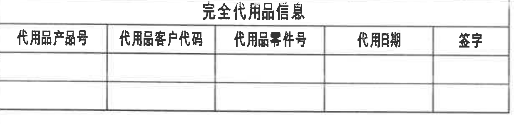
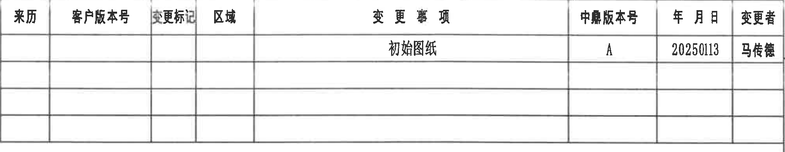
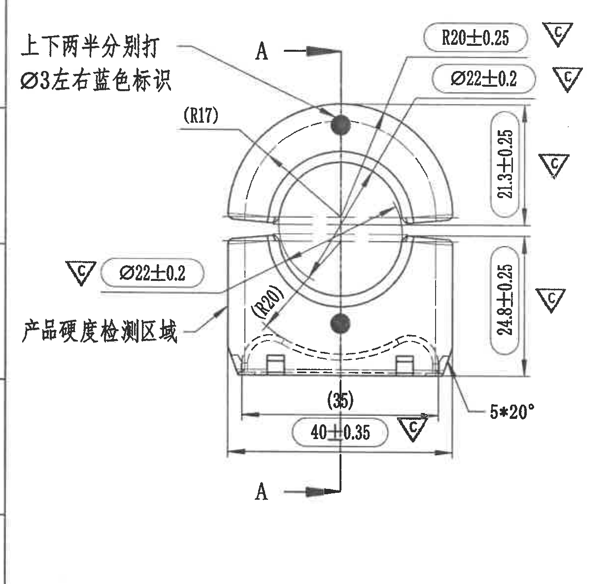
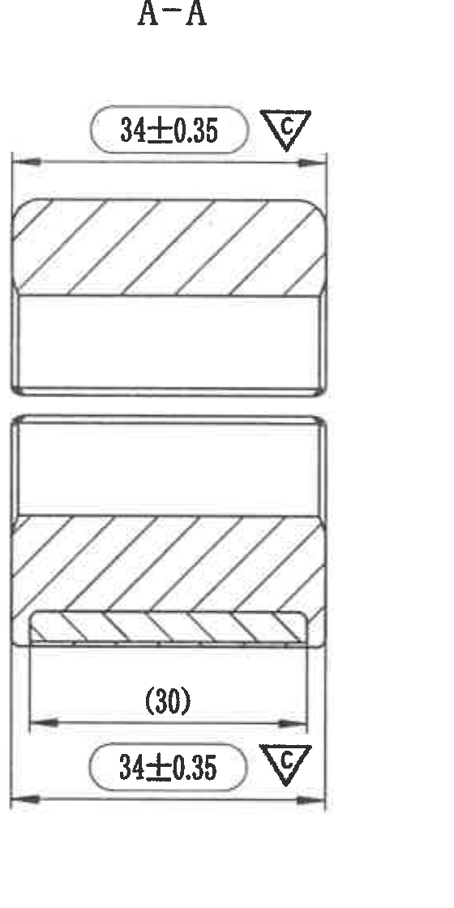
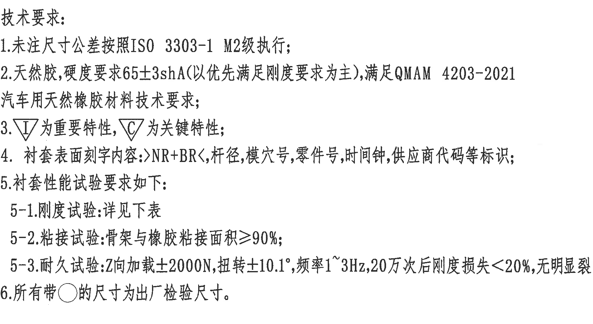
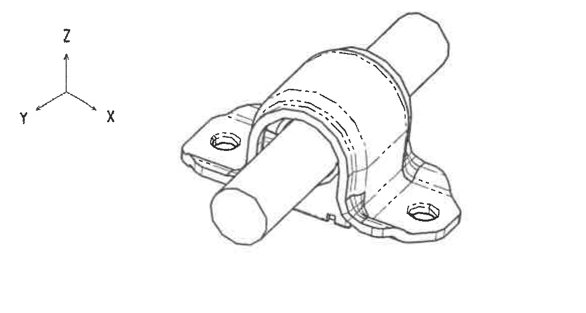
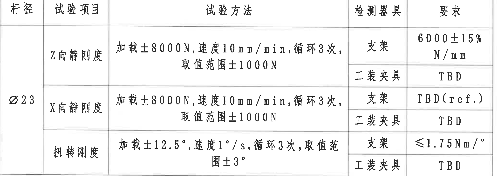
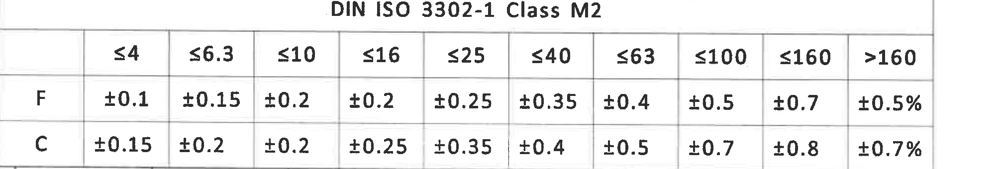
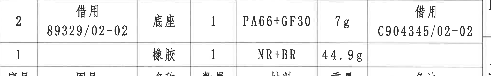
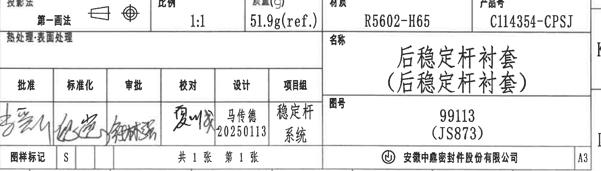

# 20C114354 PDF 内容识别

整页 PNG：`outputs/20C114354_assets/images/page_1.png`，尺寸 4959 x 3505 px。以下坐标和边界归属均基于该整页 PNG。

## object_1 - 完全代用品信息表

原图位置/视图名称：页面左上，图框横向坐标约 1-5、纵向坐标 A-B 内的“完全代用品信息”表。

原表还原：

| 代用品产品号 | 代用品客户代码 | 代用品零件号 | 代用日期 | 签字 |
|---|---|---|---|---|
| 空白 | 空白 | 空白 | 空白 | 空白 |
| 空白 | 空白 | 空白 | 空白 | 空白 |

提取表格：

| 提取项 | 原图数值或文本 | 含义说明 |
|---|---|---|
| 表题 | 完全代用品信息 | 记录替代/代用品信息的空表。 |
| 字段 | 代用品产品号、代用品客户代码、代用品零件号、代用日期、签字 | 原图表头字段。 |
| 数据行 | 两行均为空白 | 原图未填写代用品记录。 |

边界归属说明：裁切仅包含该表标题、表头和两行空白记录；上方图框坐标编号和周边其他表格不作为本对象内容提取。

## object_2 - 变更履历表

原图位置/视图名称：页面右上，图框横向坐标约 10-16、纵向坐标 A-B 内的变更履历表。

原表还原：

| 来历 | 客户版本号 | 变更标记 | 区域 | 变更事项 | 中鼎版本号 | 年月日 | 变更者 |
|---|---|---|---|---|---|---|---|
| 空白 | 空白 | 空白 | 空白 | 初始图纸 | A | 20250113 | 马传德 |
| 空白 | 空白 | 空白 | 空白 | 空白 | 空白 | 空白 | 空白 |
| 空白 | 空白 | 空白 | 空白 | 空白 | 空白 | 空白 | 空白 |
| 空白 | 空白 | 空白 | 空白 | 空白 | 空白 | 空白 | 空白 |

提取表格：

| 提取项 | 原图数值或文本 | 含义说明 |
|---|---|---|
| 表头 | 来历、客户版本号、变更标记、区域、变更事项、中鼎版本号、年月日、变更者 | 原图变更履历字段。 |
| 变更记录 | 初始图纸 / A / 20250113 / 马传德 | 初始图纸版本，版本号 A，日期 2025-01-13，变更者为马传德。 |
| 空白记录 | 后三行为空白 | 原图未填写后续变更。 |

边界归属说明：裁切收在表格外框内，未提取右侧图框坐标字母 A/B；空白行按表格结构保留。

## object_3 - 主加工视图

原图位置/视图名称：页面左中，图框横向坐标约 2-4、纵向坐标 D-G，零件主加工视图。

提取表格：

| 提取项 | 原图数值或文本 | 含义说明 |
|---|---|---|
| 蓝色标识说明 | 上下两半分别打 Ø3 左右蓝色标识 | 说明上下两半零件分别设置 Ø3 左右蓝色标识；该文字引出线指向主视图上部圆点区域，归属主加工视图。 |
| 产品硬度检测区域 | 产品硬度检测区域 | 主视图左下文字引出线指向零件下半区域，表示硬度测试区域。 |
| 剖切标记 | A-A | 主视图中心竖向剖切线，顶部和底部均有 A 与箭头，指向 object_4 的 A-A 剖视图；不是尺寸值。 |
| 参考半径 | (R17) | 括号内参考半径，位于上半圆弧附近，用于说明相关圆弧参考几何，不作为直接公差控制尺寸。 |
| 半径尺寸 | R20±0.25，C | 上半圆弧半径尺寸，公差 ±0.25，旁有 C 三角符号，按技术要求为关键特性；该尺寸带圆/椭圆框，按技术要求第 6 条为出厂检验尺寸。 |
| 直径尺寸 | Ø22±0.2，C | 上侧引出标注，直径 22，公差 ±0.2，关键特性；带圆/椭圆框，为出厂检验尺寸。 |
| 直径尺寸 | Ø22±0.2，C | 左侧引出标注，直径 22，公差 ±0.2，关键特性；带圆/椭圆框，为出厂检验尺寸。 |
| 垂直尺寸 | 21.3±0.25，C | 上半部分从分型/中间水平线到上侧结构的高度尺寸，公差 ±0.25，关键特性；带圆/椭圆框，为出厂检验尺寸。 |
| 垂直尺寸 | 24.8±0.25，C | 下半部分从分型/中间水平线到下侧结构的高度尺寸，公差 ±0.25，关键特性；带圆/椭圆框，为出厂检验尺寸。 |
| 参考半径 | (R20) | 括号内参考半径，位于下半内部圆弧/虚线附近，用于说明参考圆弧轮廓。 |
| 参考尺寸 | (35) | 主视图下方内侧宽度参考尺寸，括号表示参考值。 |
| 宽度尺寸 | 40±0.35，C | 主视图下方总宽度尺寸，公差 ±0.35，关键特性；带圆/椭圆框，为出厂检验尺寸。 |
| 角度/数量前缀 | 5*20° | 5 处 20° 角度/倒角类标注，位于右下引出线处；数量前缀 5* 必须与 20° 同读。 |
| T 编号 | 未见 T 编号 | 本主视图内未出现 T 编号。 |

边界归属说明：右侧的 21.3±0.25、24.8±0.25、C 符号和 5*20° 的完整尺寸线与文字均在本主视图裁切内；A-A 剖视图的 34±0.35、(30) 不归入本视图。左侧文字引出线指向主视图，因此归属本对象；裁切未混入 A-A 剖视图。

## object_4 - A-A 剖视图

原图位置/视图名称：页面中部，主加工视图右侧，A-A 剖视图。

提取表格：

| 提取项 | 原图数值或文本 | 含义说明 |
|---|---|---|
| 视图名称 | A-A | 与主视图中的 A-A 剖切线对应。 |
| 宽度尺寸 | 34±0.35，C | 上半剖面外宽尺寸，公差 ±0.35，关键特性；尺寸线和箭头完整位于剖视图对象内。 |
| 参考尺寸 | (30) | 下半剖面内侧参考宽度，括号表示参考尺寸。 |
| 宽度尺寸 | 34±0.35，C | 下半剖面外宽尺寸，公差 ±0.35，关键特性。 |
| 剖面线 | 斜向剖面线 | 表示剖切材料区域。 |
| T 编号 | 未见 T 编号 | 本剖视图内未出现 T 编号。 |

边界归属说明：本对象只包含 A-A 剖视图及其 34±0.35、(30) 尺寸；主视图中的 40±0.35、21.3±0.25、24.8±0.25 等不归入本对象。

## object_5 - 技术要求 / NOTES

原图位置/视图名称：页面右中，技术要求文字区。

提取表格：

| 提取项 | 原图数值或文本 | 含义说明 |
|---|---|---|
| 标题 | 技术要求: | 技术说明标题。 |
| 1 | 未注尺寸公差按照 ISO 3303-1 M2级执行; | 未单独标注公差的尺寸按该标准和等级执行。 |
| 2 | 天然胶,硬度要求 65±3shA(以优先满足刚度要求为主),满足 QMAM 4203-2021 汽车用天然橡胶材料技术要求; | 橡胶硬度要求为 65±3 shA，并优先满足刚度要求，同时满足 QMAM 4203-2021。 |
| 3 | ▽I 为重要特性, ▽C 为关键特性; | 三角 I 符号代表重要特性，三角 C 符号代表关键特性。 |
| 4 | 衬套表面刻字内容: >NR+BR<,杆径,模穴号,零件号,时间钟,供应商代码等标识; | 规定衬套表面刻字/标识内容。 |
| 5 | 衬套性能试验要求如下: | 引出下方试验要求。 |
| 5-1 | 刚度试验:详见下表 | 刚度试验要求见 object_7。 |
| 5-2 | 粘接试验:骨架与橡胶粘接面积≥90%; | 骨架与橡胶粘接面积不得低于 90%。 |
| 5-3 | 耐久试验:Z向加载±2000N,扭转±10.1°,频率1~3Hz,20万次后刚度损失<20%,无明显裂纹; | 耐久试验载荷、扭转角、频率、循环次数和判定要求。 |
| 6 | 所有带○的尺寸为出厂检验尺寸。 | 图中带圆/椭圆框的尺寸作为出厂检验尺寸。 |

边界归属说明：本对象只提取技术要求文本；右侧图框坐标列不作为 NOTES 内容。第 5-1 所称“下表”指左下试验表 object_7。

## object_6 - 右侧等轴测局部视图

原图位置/视图名称：页面右中下，图框横向坐标约 13-15、纵向坐标 G-H，零件等轴测局部视图。

提取表格：

| 提取项 | 原图数值或文本 | 含义说明 |
|---|---|---|
| 视图类型 | 等轴测/局部结构示意 | 显示装配状态下的衬套、底座、孔位和杆件方向。 |
| 坐标方向 | X、Y、Z | 坐标轴方向标识，Z 竖直向上，X 向右下，Y 向左下。 |
| 尺寸 | 未标注尺寸 | 本局部视图内未出现尺寸、公差、角度、弧度、T 编号或关键特性符号。 |

边界归属说明：裁切包含完整等轴测图和 X/Y/Z 坐标轴；本对象不提取主视图或 A-A 剖视图中的任何尺寸。

## object_7 - 衬套性能试验表

原图位置/视图名称：页面左下，技术要求 5-1 所指的刚度/试验要求表。

原表还原：

| 杆径 | 试验项目 | 试验方法 | 检测器具 | 要求 |
|---|---|---|---|---|
| Ø23 | Z向静刚度 | 加载±8000N,速度10mm/min,循环3次,取值范围±1000N | 支架 | 6000±15% N/mm |
| Ø23 | Z向静刚度 | 同上 | 工装夹具 | TBD |
| Ø23 | X向静刚度 | 加载±8000N,速度10mm/min,循环3次,取值范围±1000N | 支架 | TBD(ref.) |
| Ø23 | X向静刚度 | 同上 | 工装夹具 | TBD |
| Ø23 | 扭转刚度 | 加载±12.5°,速度1°/s,循环3次,取值范围±3° | 支架 | ≤1.75Nm/° |
| Ø23 | 扭转刚度 | 同上 | 工装夹具 | TBD |

提取表格：

| 提取项 | 原图数值或文本 | 含义说明 |
|---|---|---|
| 杆径 | Ø23 | 试验适用杆径。 |
| Z向静刚度方法 | 加载±8000N,速度10mm/min,循环3次,取值范围±1000N | Z 向静刚度试验加载和取值条件。 |
| Z向静刚度要求 | 支架:6000±15% N/mm; 工装夹具:TBD | 支架检测要求已给出，工装夹具要求待定。 |
| X向静刚度方法 | 加载±8000N,速度10mm/min,循环3次,取值范围±1000N | X 向静刚度试验加载和取值条件。 |
| X向静刚度要求 | 支架:TBD(ref.); 工装夹具:TBD | 支架要求为参考待定，工装夹具要求待定。 |
| 扭转刚度方法 | 加载±12.5°,速度1°/s,循环3次,取值范围±3° | 扭转试验角度、速度、循环次数和取值范围。 |
| 扭转刚度要求 | 支架:≤1.75Nm/°; 工装夹具:TBD | 支架扭转刚度上限为 1.75 Nm/°，工装夹具要求待定。 |

边界归属说明：裁切只包含试验表本体；下方公差表标题 DIN ISO 3302-1 Class M2 不归入本对象。

## object_8 - DIN ISO 3302-1 Class M2 公差表

原图位置/视图名称：页面左下，试验表下方的 DIN ISO 3302-1 Class M2 公差表。

原表还原：

| 级别 | ≤4 | ≤6.3 | ≤10 | ≤16 | ≤25 | ≤40 | ≤63 | ≤100 | ≤160 | >160 |
|---|---|---|---|---|---|---|---|---|---|---|
| F | ±0.1 | ±0.15 | ±0.2 | ±0.2 | ±0.25 | ±0.35 | ±0.4 | ±0.5 | ±0.7 | ±0.5% |
| C | ±0.15 | ±0.2 | ±0.2 | ±0.25 | ±0.35 | ±0.4 | ±0.5 | ±0.7 | ±0.8 | ±0.7% |

提取表格：

| 提取项 | 原图数值或文本 | 含义说明 |
|---|---|---|
| 表题 | DIN ISO 3302-1 Class M2 | 公差表标题。 |
| F 行 | ±0.1, ±0.15, ±0.2, ±0.2, ±0.25, ±0.35, ±0.4, ±0.5, ±0.7, ±0.5% | F 级对应不同尺寸段的公差。 |
| C 行 | ±0.15, ±0.2, ±0.2, ±0.25, ±0.35, ±0.4, ±0.5, ±0.7, ±0.8, ±0.7% | C 级对应不同尺寸段的公差。 |

边界归属说明：裁切包含表题和完整 F/C 公差表；底部有极轻微图框线残影但无图框文字，未作为表格内容提取。

## object_9 - 材料 / BOM 表

原图位置/视图名称：页面右下标题栏上方的材料明细表。原图中表头在数据行下方；下表为 Markdown 语法还原，数据行保持原图自上而下顺序。

原表还原：

| 序号 | 图号 | 名称 | 数量 | 材料 | 重量 | 备注 |
|---|---|---|---|---|---|---|
| 2 | 借用 89329/02-02 | 底座 | 1 | PA66+GF30 | 7g | 借用 C904345/02-02 |
| 1 | 空白 | 橡胶 | 1 | NR+BR | 44.9g | 空白 |

提取表格：

| 提取项 | 原图数值或文本 | 含义说明 |
|---|---|---|
| 序号 2 | 借用 89329/02-02 / 底座 / 1 / PA66+GF30 / 7g / 借用 C904345/02-02 | 底座件借用件号 89329/02-02，材料 PA66+GF30，重量 7g，备注借用 C904345/02-02。 |
| 序号 1 | 橡胶 / 1 / NR+BR / 44.9g | 橡胶件材料 NR+BR，数量 1，重量 44.9g。 |
| 表头 | 序号、图号、名称、数量、材料、重量、备注 | 原图表头字段。 |

边界归属说明：裁切只包含材料明细表，未纳入下方标题栏中的投影法、比例、质量、材质、产品号等字段。

## object_10 - 标题栏

原图位置/视图名称：页面右下标题栏及签审栏。

原表还原：

| 字段 | 原图数值或文本 |
|---|---|
| 投影法 | 第一画法，并带投影视图符号 |
| 比例 | 1:1 |
| 质量(g) | 51.9g(ref.) |
| 材质 | R5602-H65 |
| 产品号 | C114354-CPSJ |
| 热处理·表面处理 | 空白 |
| 名称 | 后稳定杆衬套（后稳定杆衬套） |
| 图号 | 99113（JS873） |
| 图样标记 | S |
| 页码 | 共 1 张 第 1 张 |
| 公司 | 安徽中鼎密封件股份有限公司 |
| 图幅 | A3 |

签审栏还原：

| 批准 | 标准化 | 审批 | 校对 | 设计 | 项目组 |
|---|---|---|---|---|---|
| 手写签名，无法可靠辨识 | 手写签名，无法可靠辨识 | 手写签名，无法可靠辨识 | 手写签名，无法可靠辨识 | 马传德 / 20250113 | 稳定杆系统 |

提取表格：

| 提取项 | 原图数值或文本 | 含义说明 |
|---|---|---|
| 投影法 | 第一画法 | 图纸投影法字段，旁有投影符号。 |
| 比例 | 1:1 | 图纸比例。 |
| 质量 | 51.9g(ref.) | 总质量参考值，括号 ref. 表示参考。 |
| 材质 | R5602-H65 | 标题栏材质字段。 |
| 产品号 | C114354-CPSJ | 产品编号。 |
| 名称 | 后稳定杆衬套（后稳定杆衬套） | 零件名称。 |
| 图号 | 99113（JS873） | 图纸编号。 |
| 设计 | 马传德 / 20250113 | 设计者和日期。 |
| 项目组 | 稳定杆系统 | 所属项目组。 |
| 图样标记 | S | 图样标记字段。 |
| 页码 | 共 1 张 第 1 张 | 图纸总页数和当前页。 |
| 公司 | 安徽中鼎密封件股份有限公司 | 标题栏公司名称。 |
| 批准/标准化/审批/校对 | 手写签名，无法可靠辨识 | 原图为扫描手写签名，未作臆测转写。 |

边界归属说明：裁切包含标题栏和签审栏，排除上方 BOM 数据行；右侧保留标题栏 A3 单元格完整边框，邻近图框坐标残边不作为标题栏内容提取。

## 裁切检查记录

| 对象 | 图片路径 | 完整性检查 | 边界/归属检查 |
|---|---|---|---|
| page_1 | outputs/20C114354_assets/images/page_1.png | 整页 PNG 完整，4959 x 3505 px。 | 作为所有裁切 bbox 的坐标基准。 |
| object_1 | outputs/20C114354_assets/images/object_1.png | 表题、表头、空白行完整。 | 未提取上方图框坐标编号；仅归属完全代用品信息表。 |
| object_2 | outputs/20C114354_assets/images/object_2.png | 表头、初始图纸记录、空白行完整。 | 重裁后排除了右侧图框 A/B 字母。 |
| object_3 | outputs/20C114354_assets/images/object_3.png | 主视图所有尺寸线、箭头、C 符号、A-A 剖切标记、中文说明完整。 | 未混入 A-A 剖视图尺寸；左侧说明按引出线归属主视图。 |
| object_4 | outputs/20C114354_assets/images/object_4.png | A-A 标题、上下 34±0.35、(30) 及剖面线完整。 | 未混入主视图尺寸。 |
| object_5 | outputs/20C114354_assets/images/object_5.png | 技术要求 1-6 条文字完整。 | 右侧图框坐标列不作为 NOTES 内容。 |
| object_6 | outputs/20C114354_assets/images/object_6.png | 等轴测图、X/Y/Z 坐标轴完整。 | 未提取主视图或剖视图尺寸；本对象无尺寸标注。 |
| object_7 | outputs/20C114354_assets/images/object_7.png | 试验表表头、Ø23、三项试验及检测器具/要求完整。 | 下方公差表不归入本对象。 |
| object_8 | outputs/20C114354_assets/images/object_8.png | DIN ISO 3302-1 Class M2 表题、F/C 两行和尺寸段表头完整。 | 底部轻微图框线残影不含文字，未作为表格内容提取。 |
| object_9 | outputs/20C114354_assets/images/object_9.png | BOM 两条数据行和表头完整。 | 未混入下方标题栏字段。 |
| object_10 | outputs/20C114354_assets/images/object_10.png | 标题栏、签审栏、名称/图号/公司/A3 单元格完整。 | 排除上方 BOM；右侧图框坐标残边不作为内容提取。 |
