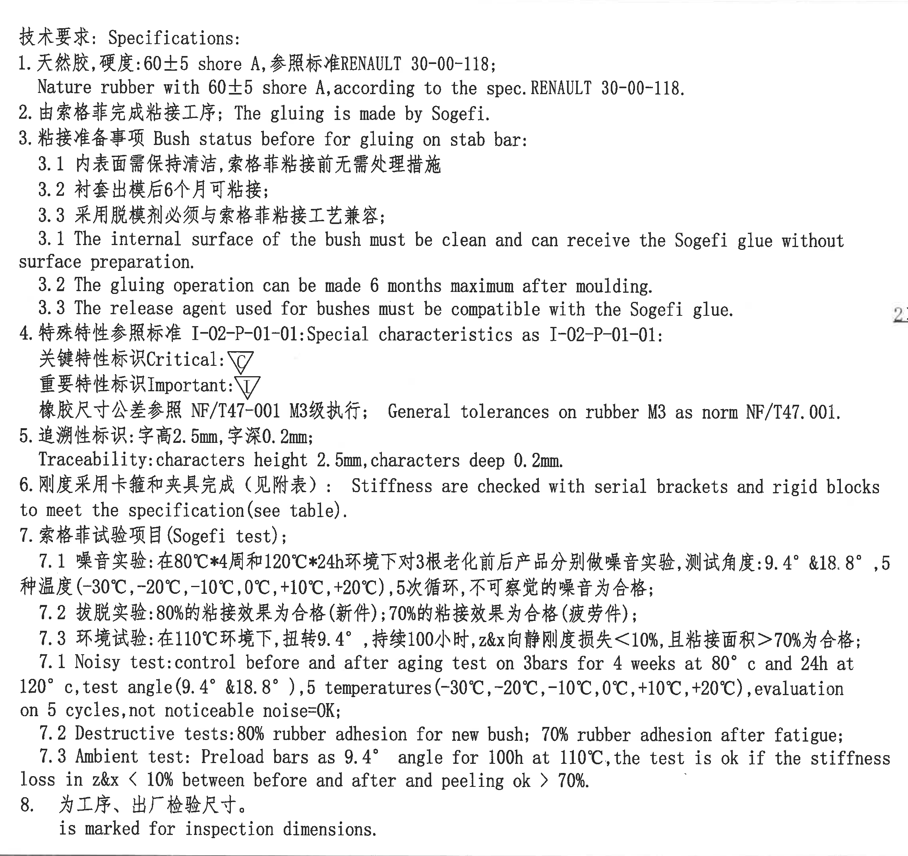
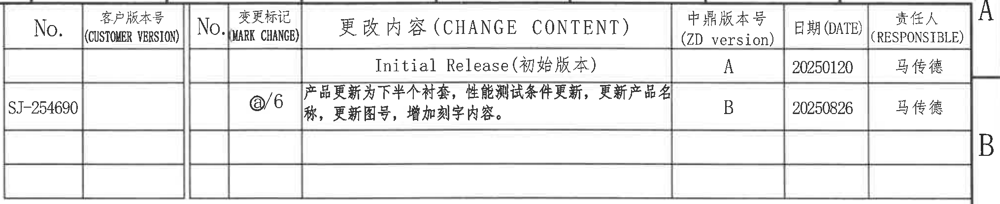
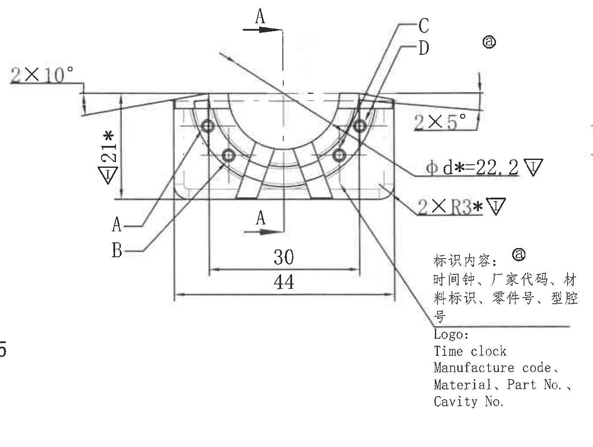
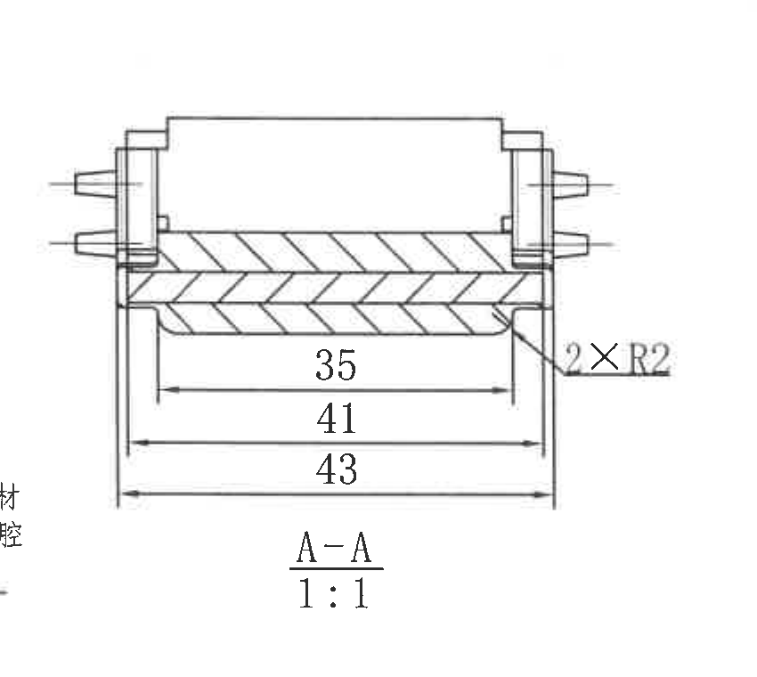
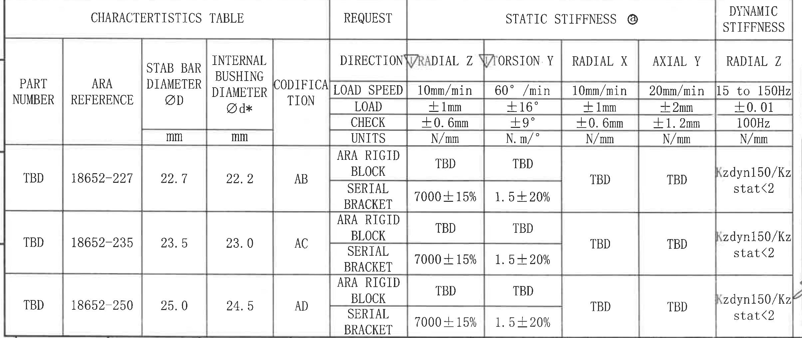
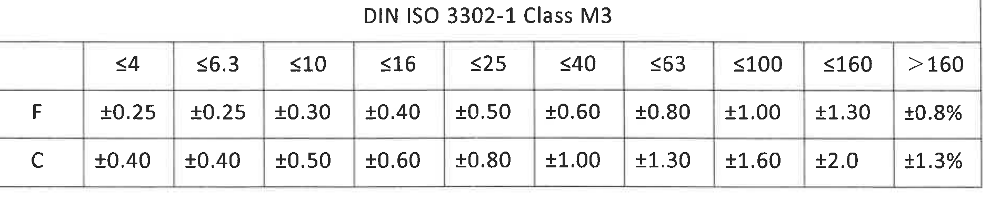
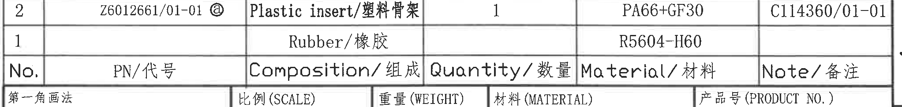
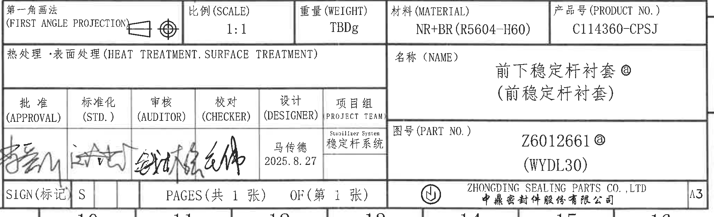

# 20C114360 内容识别结果

PDF 已先渲染为整页 PNG：`outputs/20C114360_assets/images/page_1.png`。以下 `bbox` 均为整页 PNG 像素坐标，格式为 `[x, y, width, height]`。

## object_1 - NOTES / 技术要求

原图位置/视图名称：第 1 页左上至左中 NOTES 区域，bbox `[410, 185, 2285, 2155]`。

| 提取项 | 原图数值或文本 | 含义说明 |
|---|---|---|
| 标题 | 技术要求: Specifications: | 图纸通用技术要求。 |
| 1 材料与硬度 | 天然胶，硬度:60±5 shore A, 参照标准 RENAULT 30-00-118; Nature rubber with 60±5 shore A, according to the spec. RENAULT 30-00-118. | 零件橡胶材料为天然胶，邵氏 A 硬度 60±5，适用 Renault 30-00-118 标准。 |
| 2 粘接工序 | 由索格菲完成粘接工序; The gluing is made by Sogefi. | 衬套与稳定杆粘接由 Sogefi 完成。 |
| 3 粘接准备 | 粘接准备事项 Bush status before for gluing on stab bar: | 粘接到稳定杆前的衬套状态要求。 |
| 3.1 内表面 | 内表面需保持清洁，索格菲粘接前无需处理措施; The internal surface of the bush must be clean and can receive the Sogefi glue without surface preparation. | 衬套内表面清洁即可接受 Sogefi 胶水，无需额外表面处理。 |
| 3.2 出模后时限 | 衬套出模后 6 个月可粘接; The gluing operation can be made 6 months maximum after moulding. | 出模后最多 6 个月内允许粘接。 |
| 3.3 脱模剂兼容性 | 采用脱模剂必须与索格菲粘接工艺兼容; The release agent used for bushes must be compatible with the Sogefi glue. | 脱模剂不能影响 Sogefi 胶水粘接。 |
| 4 特殊特性 | 特殊特性参照标准 I-02-P-01-01: Special characteristics as I-02-P-01-01. | 特殊特性标识依据 I-02-P-01-01。 |
| 关键特性标识 | Critical: 倒三角 C | 图中带倒三角 C 的项目为关键特性。 |
| 重要特性标识 | Important: 倒三角 I | 图中带倒三角 I 的项目为重要特性。 |
| 橡胶尺寸公差 | 橡胶尺寸公差参照 NF/T47-001 M3级执行; General tolerances on rubber M3 as norm NF/T47.001. | 橡胶尺寸未注公差按 NF/T47-001 M3。 |
| 5 追溯性标识 | 字高 2.5mm, 字深 0.2mm; Traceability: characters height 2.5mm, characters deep 0.2mm. | 追溯字符高度和深度要求。 |
| 6 刚度检测 | 刚度采用卡箍和夹具完成（见附表）; Stiffness are checked with serial brackets and rigid blocks to meet the specification (see table). | 静/动态刚度通过卡箍和刚性块按附表检测。 |
| 7 索格菲试验项目 | 索格菲试验项目 (Sogefi test) | Sogefi 试验项目总标题。 |
| 7.1 噪音试验 | 在 80°C*4周和 120°C*24h 环境下对 3 根老化前后产品分别做噪音实验，测试角度: 9.4° & 18.8°，5 种温度 (-30°C, -20°C, -10°C, 0°C, +10°C, +20°C)，5 次循环，不可察觉的噪音为合格; Noisy test: control before and after aging test on 3 bars for 4 weeks at 80°c and 24h at 120°c, test angle (9.4° & 18.8°), 5 temperatures (-30°C, -20°C, -10°C, 0°C, +10°C, +20°C), evaluation on 5 cycles, not noticeable noise=OK. | 老化前后噪音测试条件、角度、温度循环和合格判定。原图写“5 temperatures”但列出 6 个温度点，按原文保留。 |
| 7.2 拨脱/破坏试验 | 80%的粘接效果为合格（新件）；70%的粘接效果为合格（疲劳件）; Destructive tests: 80% rubber adhesion for new bush; 70% rubber adhesion after fatigue. | 新件胶粘面积/粘接效果至少 80%，疲劳后至少 70%。 |
| 7.3 环境试验 | 在 110°C 环境下，扭转 9.4°，持续 100 小时，z&x 向静刚度损失 <10%，且粘接面积 >70% 为合格; Ambient test: Preload bars as 9.4° angle for 100h at 110°C, the test is ok if the stiffness loss in z&x < 10% between before and after and peeling ok > 70%. | 高温扭转耐久后刚度损失和粘接面积合格判定。 |
| 8 检验尺寸 | 为工序、出厂检验尺寸。is marked for inspection dimensions. | 图中带星号的尺寸按检验尺寸理解。 |

边界归属说明：该 NOTES 区域位于主视图左侧，右侧矩形裁切边界附近与主视图上方角度标注非常接近；抽取时仅归属 NOTES 文本，未将右侧相邻主视图标注计入本对象。

## object_2 - 修订履历表

原图位置/视图名称：第 1 页右上修订履历表，bbox `[2810, 170, 2030, 415]`。

| No. | 客户版本号 (CUSTOMER VERSION) | No. | 变更标记 (MARK CHANGE) | 更改内容 (CHANGE CONTENT) | 中鼎版本号 (ZD version) | 日期 (DATE) | 责任人 (RESPONSIBLE) |
|---|---|---|---|---|---|---|---|
|  |  |  |  | Initial Release (初始版本) | A | 20250120 | 马传德 |
| SJ-254690 |  |  | @/6 | 产品更新为下半个衬套，性能测试条件更新，更新产品名称，更新图号，增加刻字内容。 | B | 20250826 | 马传德 |

| 提取项 | 原图数值或文本 | 含义说明 |
|---|---|---|
| 表头字段 | No.; CUSTOMER VERSION; No.; MARK CHANGE; CHANGE CONTENT; ZD version; DATE; RESPONSIBLE | 修订履历的列结构。 |
| 初始版本 | Initial Release (初始版本), ZD version A, 20250120, 马传德 | 初始发布记录。 |
| B 版变更 | SJ-254690, @/6, 产品更新为下半个衬套，性能测试条件更新，更新产品名称，更新图号，增加刻字内容。, ZD version B, 20250826, 马传德 | 第二条修订记录，标记 @/6 对应图中带 @ 的更新内容。 |

边界归属说明：裁切包含完整修订履历表格和右侧负责人列，右边缘靠近图框字母但未作为表格内容提取。

## object_3 - 主加工视图

原图位置/视图名称：第 1 页中右部主加工视图，bbox `[2635, 805, 1350, 1020]`。

| 提取项 | 原图数值或文本 | 含义说明 |
|---|---|---|
| 左上角度 | 2×10° | 左上两处 10° 斜面/角度要求，数量前缀为 2×。 |
| 右上角度 | 2×5° | 右上两处 5° 斜面/角度要求，数量前缀为 2×。 |
| 竖向高度 | 21*，倒三角 I | 主视图左侧竖向尺寸 21；星号为检验尺寸标记，倒三角 I 表示重要特性。 |
| 内径尺寸 | φ d*=22.2，倒三角 I | 内衬套直径 d 为 22.2；φ 为直径符号，星号为检验尺寸，倒三角 I 表示重要特性。 |
| 圆角 | 2×R3*，倒三角 I | 两处 R3 圆角；星号为检验尺寸，倒三角 I 表示重要特性。 |
| 下部内宽 | 30 | 主视图下部内侧尺寸。 |
| 下部总宽 | 44 | 主视图下部外侧总宽。 |
| 剖切标记 | A-A | 上下两个 A 箭头给出 A-A 剖切方向和剖面位置。 |
| 引出标号 | A, B, C, D | 指向主视图局部结构/区域的字母标识，原图未给出独立数值。 |
| 变更标记 | @ | 与修订履历 @/6 对应，表示本视图相关内容在 B 版更新中涉及。 |
| 标识内容 | 标识内容: 时间钟、厂家代码、材料标识、零件号、型腔号 / Logo: Time clock, Manufacture code, Material, Part No., Cavity No. | 引出线指向主视图右下区域，说明该处刻字/Logo 内容。 |

边界归属说明：本对象只提取主加工视图及其引出说明。A-A 剖面在右侧单独裁切为 object_4；底部表格与左侧 NOTES 的边缘残影不作为本对象内容。

## object_4 - A-A 剖面视图

原图位置/视图名称：第 1 页右中 A-A 剖面视图，bbox `[3925, 885, 850, 760]`。

| 提取项 | 原图数值或文本 | 含义说明 |
|---|---|---|
| 剖面名称 | A-A | 与主视图中的 A-A 剖切线对应。 |
| 比例 | 1:1 | 剖面视图绘制比例。 |
| 内部长度 | 35 | 剖面下方最内侧长度尺寸。 |
| 中间长度 | 41 | 剖面下方中间长度尺寸。 |
| 总长度 | 43 | 剖面下方外侧总长度尺寸。 |
| 右侧圆角 | 2×R2 | 两处 R2 圆角，数量前缀为 2×。 |
| 剖面线 | 斜线剖面填充 | 表示剖切到的材料区域。 |

边界归属说明：本对象仅包含 A-A 剖面及其尺寸 35、41、43、2×R2。主视图中的 φd、21、2×R3 等尺寸不归入本剖面。

## object_5 - CHARACTERISTICS TABLE / 特性表

原图位置/视图名称：第 1 页左下 CHARACTERISTICS TABLE，bbox `[365, 2350, 2410, 1015]`。

| PART NUMBER | ARA REFERENCE | STAB BAR DIAMETER ØD (mm) | INTERNAL BUSHING DIAMETER Ød* (mm) | CODIFICATION | REQUEST / DIRECTION | STATIC STIFFNESS @ RADIAL Z | STATIC STIFFNESS @ TORSION Y | STATIC STIFFNESS @ RADIAL X | STATIC STIFFNESS @ AXIAL Y | DYNAMIC STIFFNESS RADIAL Z |
|---|---|---:|---:|---|---|---|---|---|---|---|
|  |  |  |  |  | LOAD SPEED | 10mm/min | 60°/min | 10mm/min | 20mm/min | 15 to 150Hz |
|  |  |  |  |  | LOAD | ±1mm | ±16° | ±1mm | ±2mm | ±0.01 |
|  |  |  |  |  | CHECK | ±0.6mm | ±9° | ±0.6mm | ±1.2mm | 100Hz |
|  |  |  |  |  | UNITS | N/mm | N.m/° | N/mm | N/mm | N/mm |
| TBD | 18652-227 | 22.7 | 22.2 | AB | ARA RIGID BLOCK | TBD | TBD | TBD | TBD | Kzdyn150/Kz stat<2 |
| TBD | 18652-227 | 22.7 | 22.2 | AB | SERIAL BRACKET | 7000±15% | 1.5±20% | TBD | TBD | Kzdyn150/Kz stat<2 |
| TBD | 18652-235 | 23.5 | 23.0 | AC | ARA RIGID BLOCK | TBD | TBD | TBD | TBD | Kzdyn150/Kz stat<2 |
| TBD | 18652-235 | 23.5 | 23.0 | AC | SERIAL BRACKET | 7000±15% | 1.5±20% | TBD | TBD | Kzdyn150/Kz stat<2 |
| TBD | 18652-250 | 25.0 | 24.5 | AD | ARA RIGID BLOCK | TBD | TBD | TBD | TBD | Kzdyn150/Kz stat<2 |
| TBD | 18652-250 | 25.0 | 24.5 | AD | SERIAL BRACKET | 7000±15% | 1.5±20% | TBD | TBD | Kzdyn150/Kz stat<2 |

| 提取项 | 原图数值或文本 | 含义说明 |
|---|---|---|
| ØD | 22.7 / 23.5 / 25.0 mm | 稳定杆直径，按 ARA reference 分三种配置。 |
| Ød* | 22.2 / 23.0 / 24.5 mm | 内衬套直径，带星号，按 NOTES 第 8 条为检验尺寸。 |
| CODIFICATION | AB / AC / AD | 每组直径配置对应编码。 |
| 静刚度 @ 径向 Z | SERIAL BRACKET: 7000±15%; ARA RIGID BLOCK: TBD | 径向 Z 静刚度目标值/待定项。 |
| 静刚度 @ 扭转 Y | SERIAL BRACKET: 1.5±20%; ARA RIGID BLOCK: TBD | 扭转 Y 静刚度目标值/待定项。 |
| 静刚度 @ 径向 X | TBD | 径向 X 静刚度未定。 |
| 静刚度 @ 轴向 Y | TBD | 轴向 Y 静刚度未定。 |
| 动刚度 @ 径向 Z | Kzdyn150/Kz stat<2 | 动刚度与静刚度比值要求。 |

边界归属说明：该表为独立特性表，右侧接近标题栏区域但裁切止于特性表边界；表中 Ød* 的星号含义按 NOTES 的检验尺寸说明解释，不归入主视图单独尺寸。

## object_6 - DIN ISO 3302-1 Class M3 公差表

原图位置/视图名称：第 1 页右下中部 DIN ISO 3302-1 Class M3 公差表，bbox `[2835, 2115, 1900, 380]`。

|  | ≤4 | ≤6.3 | ≤10 | ≤16 | ≤25 | ≤40 | ≤63 | ≤100 | ≤160 | >160 |
|---|---:|---:|---:|---:|---:|---:|---:|---:|---:|---:|
| F | ±0.25 | ±0.25 | ±0.30 | ±0.40 | ±0.50 | ±0.60 | ±0.80 | ±1.00 | ±1.30 | ±0.8% |
| C | ±0.40 | ±0.40 | ±0.50 | ±0.60 | ±0.80 | ±1.00 | ±1.30 | ±1.60 | ±2.0 | ±1.3% |

| 提取项 | 原图数值或文本 | 含义说明 |
|---|---|---|
| 标准 | DIN ISO 3302-1 Class M3 | 橡胶件尺寸公差等级表。 |
| F 行 | ±0.25 至 ±1.30，>160 为 ±0.8% | F 类公差随尺寸段变化。 |
| C 行 | ±0.40 至 ±2.0，>160 为 ±1.3% | C 类公差随尺寸段变化。 |

边界归属说明：该对象仅包含 DIN ISO 公差表，未包含下方 BOM 或标题栏内容。

## object_7 - BOM / 组成表

原图位置/视图名称：第 1 页右下标题栏上方 BOM/组成表，bbox `[2770, 2570, 2045, 245]`。

| No. | PN/代号 | Composition/组成 | Quantity/数量 | Material/材料 | Note/备注 |
|---|---|---|---:|---|---|
| 2 | Z6012661/01-01 @ | Plastic insert/塑料骨架 | 1 | PA66+GF30 | C114360/01-01 |
| 1 |  | Rubber/橡胶 |  | R5604-H60 |  |

| 提取项 | 原图数值或文本 | 含义说明 |
|---|---|---|
| 件号 2 | Z6012661/01-01 @ | 塑料骨架代号，带 @ 变更标记。 |
| 件号 2 组成 | Plastic insert/塑料骨架 | 组成件为塑料骨架。 |
| 件号 2 数量 | 1 | 每件数量 1。 |
| 件号 2 材料 | PA66+GF30 | 塑料骨架材料。 |
| 件号 2 备注 | C114360/01-01 | 备注/关联图号。 |
| 件号 1 组成 | Rubber/橡胶 | 组成件为橡胶。 |
| 件号 1 材料 | R5604-H60 | 橡胶材料牌号。 |

边界归属说明：该对象只包含 BOM/组成表两行及表头。下方第一角画法、比例、重量等属于标题栏 object_8，不在本表提取。

## object_8 - 标题栏

原图位置/视图名称：第 1 页右下标题栏，bbox `[2770, 2765, 2045, 625]`。

| 提取项 | 原图数值或文本 | 含义说明 |
|---|---|---|
| 第一角画法 | 第一角画法 (FIRST ANGLE PROJECTION) | 投影视图采用第一角法。 |
| 比例 | 1:1 | 图纸比例。 |
| 重量 | TBDg | 重量待定，单位 g。 |
| 材料 | NR+BR (R5604-H60) | 标题栏材料栏，天然胶/顺丁胶组合及牌号。 |
| 产品号 | C114360-CPSJ | 产品号。 |
| 热处理/表面处理 | 热处理·表面处理 (HEAT TREATMENT. SURFACE TREATMENT) | 原栏位为空，未给出具体处理。 |
| 名称 | 前下稳定杆衬套 @ / (前稳定杆衬套) | 产品名称，带 @ 变更标记；括号内为旧/补充名称。 |
| 图号 | Z6012661 @ / (WYDL30) | 零件图号，带 @ 变更标记；括号内为参考/项目代号。 |
| 批准 | APPROVAL，签名 | 审批签名栏。 |
| 标准化 | STD.，签名 | 标准化签名栏。 |
| 审核 | AUDITOR，签名 | 审核签名栏。 |
| 校对 | CHECKER，签名 | 校对签名栏。 |
| 设计 | DESIGNER: 马传德, 2025.8.27 | 设计人和日期。 |
| 项目组 | PROJECT TEAM: Stabilizer System / 稳定杆系统 | 项目组信息。 |
| 标记 | SIGN(标记): S | 签署/标记栏值。 |
| 页数 | PAGES(共 1 张) OF(第 1 张) | 总页数 1，当前第 1 张。 |
| 公司 | ZHONGDING SEALING PARTS CO., LTD / 中鼎密封件股份有限公司 | 出图公司。 |
| 图幅 | A3 | 图纸幅面。 |

边界归属说明：该对象为标题栏，包含标题栏内投影法、比例、材料、产品号、名称、图号、签署栏、页码、公司和图幅；上方 BOM 表已单独归属 object_7。

## 裁切检查记录

| object_id | 图片路径 | 检查结果 | 边界/完整性说明 |
|---|---|---|---|
| page_1 | outputs/20C114360_assets/images/page_1.png | 通过 | 整页 PNG 尺寸 4959×3505，包含完整图框。 |
| object_1 | outputs/20C114360_assets/images/object_1.png | 通过 | NOTES 文本完整；右侧邻近主视图标注只作为边界干扰，不提取为 NOTES 内容。 |
| object_2 | outputs/20C114360_assets/images/object_2.png | 通过 | 修订履历表表头、两条记录、日期和责任人列完整；右侧图框字母不提取。 |
| object_3 | outputs/20C114360_assets/images/object_3.png | 通过 | 主视图尺寸线、箭头、文字 2×10°、2×5°、21*、φd*=22.2、2×R3*、30、44、A-A 标记和 Logo 引出说明完整；左边缘少量相邻 NOTES 残影不提取。 |
| object_4 | outputs/20C114360_assets/images/object_4.png | 通过 | A-A 剖面轮廓、剖面线、尺寸 35/41/43、2×R2、视图名和比例完整。 |
| object_5 | outputs/20C114360_assets/images/object_5.png | 通过 | CHARACTERISTICS TABLE 表头、单位/加载条件和三组 AB/AC/AD 数据完整；右端动态刚度列完整。 |
| object_6 | outputs/20C114360_assets/images/object_6.png | 通过 | DIN ISO 3302-1 Class M3 表头、尺寸段、F/C 两行公差完整。 |
| object_7 | outputs/20C114360_assets/images/object_7.png | 通过 | BOM 表头和 1、2 两行完整；下方标题栏字段未归入本对象。 |
| object_8 | outputs/20C114360_assets/images/object_8.png | 通过 | 标题栏各栏文字、签署栏、名称、图号、公司和 A3 图幅完整；上方 BOM 表未归入本对象。 |
