# 20C114361 内容识别与裁切提取

## 整页渲染

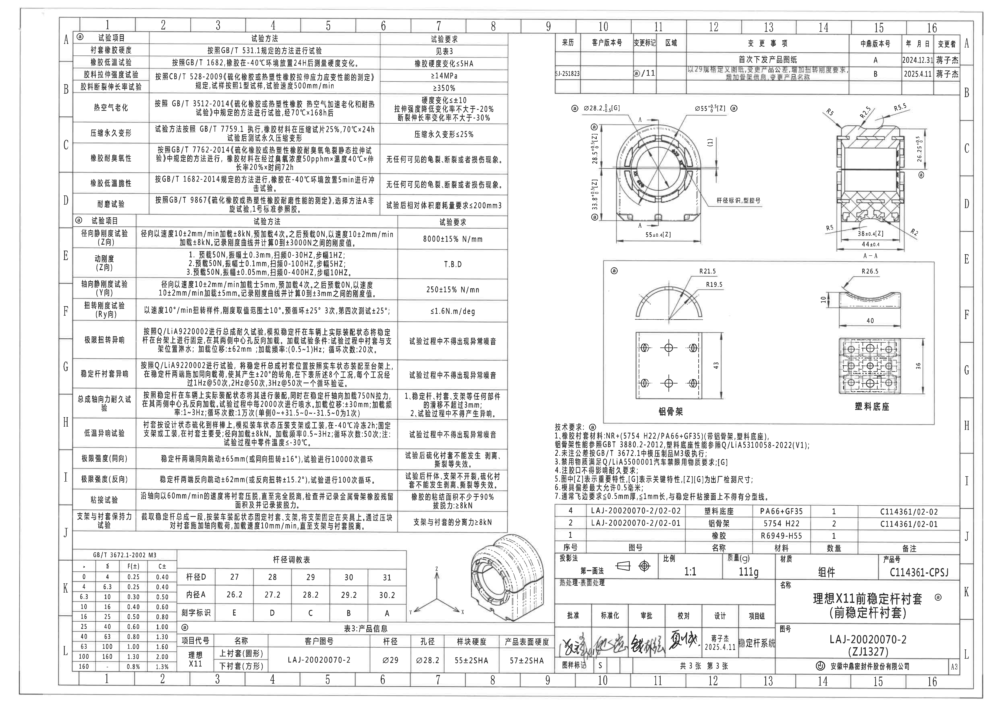

| 提取项 | 原图数值或文本 | 含义说明 |
|---|---|---|
| 页面 | 第1页，4959×3505 px | PDF按300 DPI渲染为整页PNG。 |
| 原图位置 | 整页 | 后续对象均基于该整页图像像素bbox裁切。 |

边界归属说明：整页图用于定位，不作为单独加工视图提取尺寸。

## object_1 - 试验项目/试验方法/试验要求表

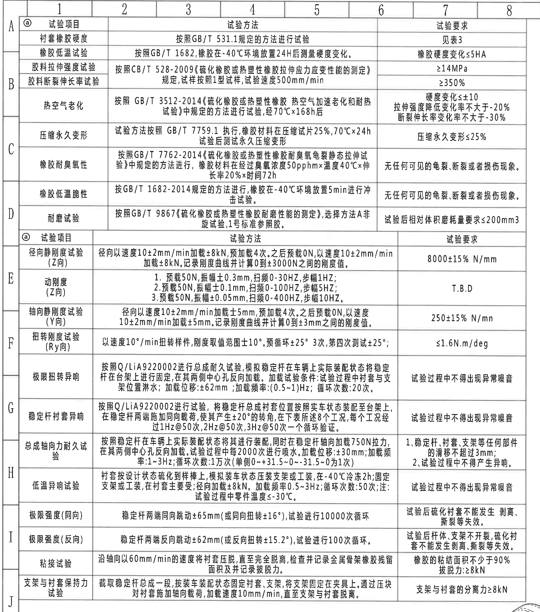

原图位置/视图名称：第1页左侧 A-J 网格区域，试验项目表。

| 试验项目 | 试验方法 | 试验要求 |
|---|---|---|
| 衬套橡胶硬度 | 按照GB/T 531.1规定的方法进行试验 | 见表3 |
| 橡胶低温试验 | 按照GB/T 1682，橡胶在-40℃环境放置24H后测量硬度变化。 | 橡胶硬度变化≤5HA |
| 胶料拉伸强度试验 | 按照CB/T 528-2009《硫化橡胶或热塑性橡胶拉伸应力应变性能的测定》规定，试样按照1型试样，试验速度500mm/min | ≥14MPa |
| 胶料断裂伸长率试验 | 按照CB/T 528-2009《硫化橡胶或热塑性橡胶拉伸应力应变性能的测定》规定，试样按照1型试样，试验速度500mm/min | ≥350% |
| 热空气老化 | 按照GB/T 3512-2014《硫化橡胶或热塑性橡胶 热空气加速老化和耐热试验》中规定的方法进行试验，经70℃×168h后 | 硬度变化≤±10；拉伸强度降低变化率不大于-20%；断裂伸长率变化率不大于-30% |
| 压缩永久变形 | 试验方法按照GB/T 7759.1执行，橡胶材料在压缩试片25%，70℃×24h，试验后测试永久压缩变形 | 压缩永久变形≤25% |
| 橡胶耐臭氧性 | 按照GB/T 7762-2014《硫化橡胶或热塑性橡胶耐臭氧龟裂静态拉伸试验》中规定的方法进行，橡胶材料在经过臭氧浓度50pphm×温度40℃×伸长率20%×时间72h | 无任何可见的龟裂、断裂或者损伤现象。 |
| 橡胶低温脆性 | 按GB/T 1682-2014规定的方法进行，橡胶在-40℃环境放置5min进行冲击试验。 | 无任何可见的龟裂、断裂或者损伤现象。 |
| 耐磨试验 | 按照GB/T 9867《硫化橡胶或热塑性橡胶耐磨性能的测定》，选择方法A非旋转试验，1号标准参照胶。 | 试验后相对体积磨耗量要求≤200mm3 |
| 径向静刚度试验(Z向) | 径向以速度10±2mm/min加载±8kN，预加载4次。之后预载0N，以速度10±2mm/min加载±8kN，记录刚度曲线并计算0到±3000N之间的刚度值。 | 8000±15% N/mm |
| 动刚度(Z向) | 1. 预载50N，振幅±0.3mm，扫频0-30HZ，步幅1HZ；2. 预载50N，振幅±0.1mm，扫频0-100HZ，步幅5HZ；3. 预载50N，振幅±0.05mm，扫频0-400HZ，步幅10HZ。 | T.B.D |
| 轴向静刚度试验(Y向) | 径向以速度10±2mm/min加载±5mm，预加载4次。之后预载0N，以速度10±2mm/min加载±5mm。记录刚度曲线并计算0到±3mm之间的刚度值。 | 250±15% N/mm |
| 扭转刚度试验(Ry向) | 以速度10°/min扭转样件，刚度取值范围±10°。预循环±25°3次，第四次测试±25°； | ≤1.6N.m/deg |
| 极限扭转异响 | 按照Q/LiA9220002进行总成耐久试验，模拟稳定杆在车辆上实际装配状态将稳定杆在台架上进行固定，在其两侧中心孔反向加载。加载试验条件：试验过程中衬套与支架位置淋水；加载位移：±62mm；加载频率：(0.5~1)Hz；循环次数：20次。 | 试验过程中不得出现异常噪音 |
| 稳定杆衬套异响 | 按照Q/LiA9220002进行试验，将稳定杆总成衬套位置按照实车状态装配至台架上，在稳定杆两端施加同向载荷，使其产生±20°的转角，在下表所述8个工况，每个工况经过1Hz@50次，2Hz@50次，3Hz@50次一个循环验证。 | 试验过程中不得出现异常噪音 |
| 总成轴向力耐久试验 | 按照稳定杆在车辆上实际装配状态将其进行装配，同时在稳定杆轴向加载750N拉力，在其两侧中心孔反向加载。试验过程中每2000次进行喷水。加载位移：±30mm；加载频率：1~3Hz；循环次数：1万次(单侧0~+31.5~0~-31.5~0为1次) | 1. 稳定杆、衬套、支架等任何部件的滑移不超过3mm；2. 试验过程中不得产生异响。 |
| 低温异响试验 | 衬套按设计状态硫化到样棒上，模拟装车状态压装支架或工装，在-40℃冷冻2h；固定支架或工装，在衬套主要受径向加载±8kN。加载频率0.5~3Hz；循环次数：50次；注：试验过程中零件温度≤-30℃。 | 试验过程中不得出现异常噪音 |
| 极限强度(同向) | 稳定杆两端同向跳动±65mm(或同向扭转±16°)，试验进行10000次循环 | 试验后硫化衬套不能发生剥离、撕裂等失效。 |
| 极限强度(反向) | 稳定杆两端反向跳动±62mm(或反向扭转±15.2°)，试验进行100次循环。 | 试验后杆体、支架不开裂，硫化衬套不能发生剥离、撕裂等失效。 |
| 粘接试验 | 沿轴向以60mm/min的速度将衬套压脱，直至完全脱离，检查并记录金属骨架橡胶残留面积及并记录拔脱力。 | 橡胶的粘结面积不少于90%；拔脱力≥8kN |
| 支架与衬套保持力试验 | 截取稳定杆总成一段，按装车装配状态固定衬套、支架，将支架固定在夹具上，通过压块对衬套施加轴向载荷，加载速度10mm/min，直至支架与衬套脱离。 | 支架与衬套的分离力≥8kN |

| 提取项 | 原图数值或文本 | 含义说明 |
|---|---|---|
| 表格结构 | 3列，多行 | 按原图“试验项目/试验方法/试验要求”还原；所有数值、单位、频率和循环次数均按原行提取。 |
| 边界归属说明 | 左侧A-J网格内整表 | 下方通用公差表、产品信息表和右侧等轴测图不归入本表。 |

## object_2 - 修订履历表

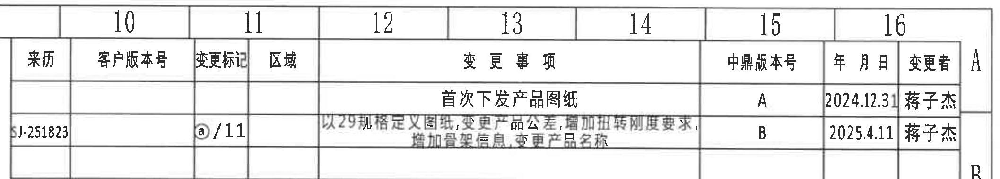

原图位置/视图名称：第1页右上 10-16/A-B 网格区域，修订履历表。

| 来历 | 客户版本号 | 变更标记 | 区域 | 变更事项 | 中鼎版本号 | 年月日 | 变更者 |
|---|---|---|---|---|---|---|---|
|  |  |  |  | 首次下发产品图纸 | A | 2024.12.31 | 蒋子杰 |
| J-251823（首字符/前缀原图边缘不清） |  | @/11 |  | 以29规格定义图纸，变更产品公差，增加扭转刚度要求，增加骨架信息，变更产品名称 | B | 2025.4.11 | 蒋子杰 |

| 提取项 | 原图数值或文本 | 含义说明 |
|---|---|---|
| REV A | 首次下发产品图纸 | 首次发布记录。 |
| REV B | 以29规格定义图纸... | 变更规格、公差、扭转刚度、骨架信息和产品名称。 |
| 边界归属说明 | 表右侧A/B为图框坐标字母 | 不作为修订履历数据；来历列首字符受扫描边界影响，按可见字符记录。 |

## object_3 - 正视图/端面加工视图

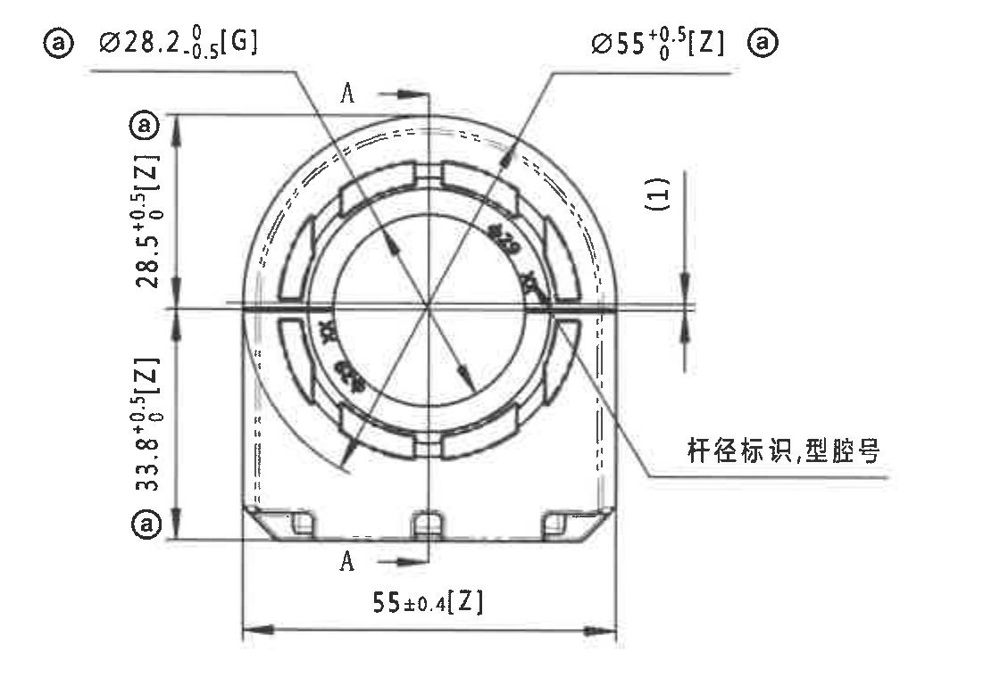

原图位置/视图名称：第1页右上中部，A-A剖面左侧。

| 提取项 | 原图数值或文本 | 含义说明 |
|---|---|---|
| 直径尺寸 | @ Ø28.2 +0/-0.5 [G] | 孔径/杆径相关直径标注；[G]为关键特性或出厂检测尺寸，@为圈注标记。 |
| 直径尺寸 | Ø55 +0.5/0 [Z] @ | 外圆/总外径尺寸；[Z]为重要特性。 |
| 竖向尺寸 | 28.5 +0.5/0 [Z] | 上段高度/定位尺寸，重要特性。 |
| 竖向尺寸 | 33.8 +0.5/0 [Z] | 下段高度/定位尺寸，重要特性。 |
| 横向总宽 | 55±0.4 [Z] | 底部总宽尺寸，重要特性。 |
| 参考尺寸 | (1) | 括号内尺寸为参考尺寸，仅作结构参考，不作为制造控制尺寸；位于正视图右侧。 |
| 剖切标记 | A-A | 剖面A-A的切割位置指示。 |
| 引出说明 | 杆径标识,型腔号 | 指示零件上刻字/标识位置。 |
| 边界归属说明 | 正视图完整尺寸线、箭头、文字均在裁切内 | 右侧A-A剖面尺寸和下方局部视图尺寸不归入本对象。 |

## object_4 - A-A剖面视图

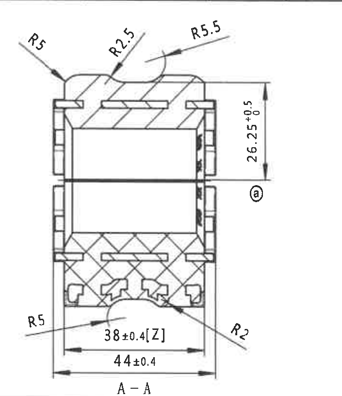

原图位置/视图名称：第1页右上角，剖面A-A。

| 提取项 | 原图数值或文本 | 含义说明 |
|---|---|---|
| 弧度/圆角 | R5 | 顶部左侧圆角和底部左侧圆角半径。 |
| 弧度/圆角 | R2.5 | 顶部中部小圆角半径。 |
| 弧度/圆角 | R5.5 | 顶部右侧弧面半径。 |
| 高度尺寸 | 26.25 +0.5/0 @ | 右侧高度尺寸，带上偏差+0.5、下偏差0，并带圈注@。 |
| 底部宽度 | 38±0.4 [Z] | 底部内侧/槽宽尺寸，重要特性。 |
| 底部总宽 | 44±0.4 | 剖面底部外侧总宽。 |
| 圆角 | R2 | 右下局部圆角半径。 |
| 剖面名称 | A-A | 对应正视图A-A切线。 |
| 边界归属说明 | 剖面内全部尺寸线和A-A标题均完整 | 左侧正视图A-A切线仅作为来源，不提取正视图尺寸。 |

## object_5 - 铝骨架局部视图

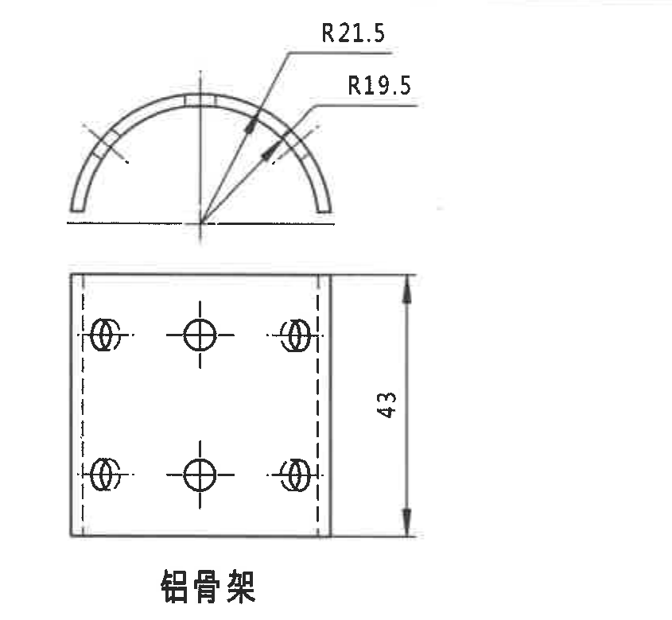

原图位置/视图名称：第1页右中局部图框左侧，铝骨架。

| 提取项 | 原图数值或文本 | 含义说明 |
|---|---|---|
| 外弧半径 | R21.5 | 铝骨架半圆外弧半径。 |
| 内弧半径 | R19.5 | 铝骨架半圆内弧半径。 |
| 高度/宽度方向尺寸 | 43 | 下部平面视图右侧尺寸。 |
| 局部名称 | 铝骨架 | 本局部视图对象名称。 |
| 孔位表示 | 中心线、虚线孔位，无新增数值 | 表示孔/槽位关系，原图未给出该局部孔距数值。 |
| 边界归属说明 | R21.5、R19.5、43均完整包含 | 右侧塑料底座局部图不归入铝骨架对象。 |

## object_6 - 塑料底座局部视图

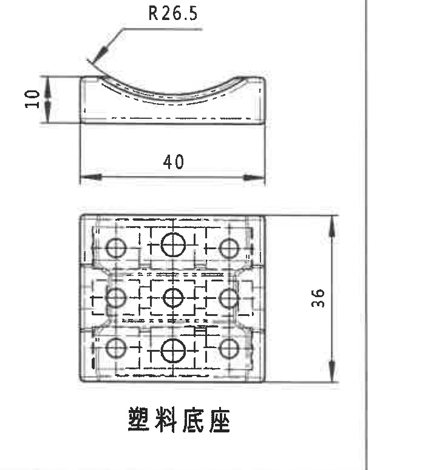

原图位置/视图名称：第1页右中局部图框右侧，塑料底座。

| 提取项 | 原图数值或文本 | 含义说明 |
|---|---|---|
| 弧面半径 | R26.5 | 上部侧视弧面半径。 |
| 局部高度 | 10 | 上部侧视左侧台阶高度。 |
| 局部长度 | 40 | 上部侧视底部横向长度。 |
| 平面高度 | 36 | 下部平面视图右侧高度。 |
| 局部名称 | 塑料底座 | 本局部视图对象名称。 |
| 边界归属说明 | R26.5、10、40、36及名称均完整 | 右侧竖线是局部图框边界，不是其他对象内容。 |

## object_7 - 技术要求

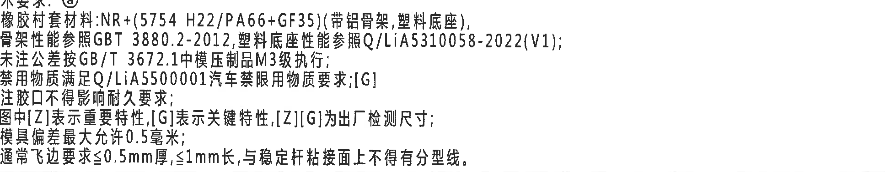

原图位置/视图名称：第1页右下中部，技术要求文本块。

| 序号 | 原图文本 | 含义说明 |
|---|---|---|
| 1 | 橡胶衬套材料:NR+(5754 H22/PA66+GF35)(带铝骨架,塑料底座)，骨架性能参照GBT 3880.2-2012，塑料底座性能参照Q/LiA5310058-2022(V1)； | 定义橡胶、铝骨架和塑料底座材料及性能参照标准。 |
| 2 | 未注公差按GB/T 3672.1中模压制品M3级执行； | 未注尺寸公差执行标准。 |
| 3 | 禁用物质满足Q/LiA5500001汽车禁限用物质要求；[G] | 禁限用物质要求，带[G]标识。 |
| 4 | 注胶口不得影响耐久要求； | 浇口/注胶口不得影响耐久性能。 |
| 5 | 图中[Z]表示重要特性，[G]表示关键特性，[Z][G]为出厂检测尺寸； | 解释[Z]、[G]和[Z][G]含义。 |
| 6 | 模具偏差最大允许0.5毫米； | 模具偏差控制要求。 |
| 7 | 通常飞边要求≤0.5mm厚，≤1mm长，与稳定杆粘接面上不得有分型线。 | 飞边和分型线要求。 |

| 提取项 | 原图数值或文本 | 含义说明 |
|---|---|---|
| 边界归属说明 | 技术要求文本块完整 | 上方局部视图与下方物料明细表均不归入本对象。 |

## object_8 - 物料明细表

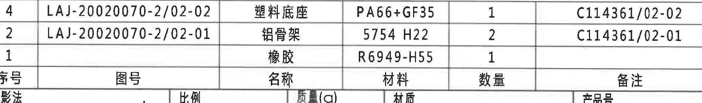

原图位置/视图名称：第1页右下，技术要求下方、标题栏上方。

| 序号 | 图号 | 名称 | 材料 | 数量 | 备注 |
|---|---|---|---|---|---|
| 4 | LAJ-20020070-2/02-02 | 塑料底座 | PA66+GF35 | 1 | C114361/02-02 |
| 2 | LAJ-20020070-2/02-01 | 铝骨架 | 5754 H22 | 2 | C114361/02-01 |
| 1 |  | 橡胶 | R6949-H55 | 1 |  |

| 提取项 | 原图数值或文本 | 含义说明 |
|---|---|---|
| 表格结构 | 序号、图号、名称、材料、数量、备注 | 原物料明细行列还原。 |
| 边界归属说明 | 下缘贴近标题栏 | 下方标题栏字段不归入物料明细表。 |

## object_9 - GB/T 3672.1-2002 M3通用公差表

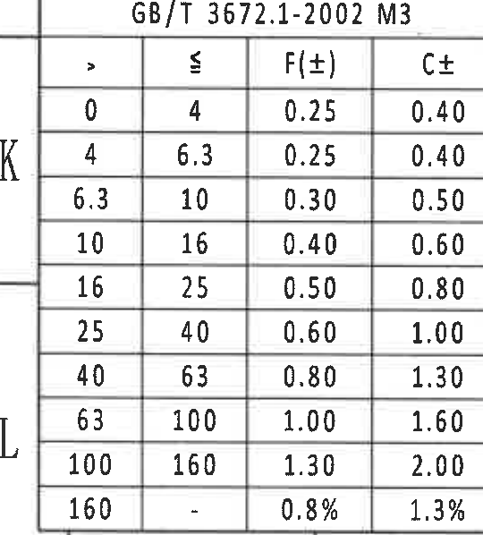

原图位置/视图名称：第1页左下 K-L 网格，GB/T 3672.1-2002 M3 表。

| > | ≤ | F(±) | C± |
|---|---|---|---|
| 0 | 4 | 0.25 | 0.40 |
| 4 | 6.3 | 0.25 | 0.40 |
| 6.3 | 10 | 0.30 | 0.50 |
| 10 | 16 | 0.40 | 0.60 |
| 16 | 25 | 0.50 | 0.80 |
| 25 | 40 | 0.60 | 1.00 |
| 40 | 63 | 0.80 | 1.30 |
| 63 | 100 | 1.00 | 1.60 |
| 100 | 160 | 1.30 | 2.00 |
| 160 | - | 0.8% | 1.3% |

| 提取项 | 原图数值或文本 | 含义说明 |
|---|---|---|
| 标准 | GB/T 3672.1-2002 M3 | 未注公差等级表。 |
| 边界归属说明 | 左侧K/L为图框坐标 | 坐标字母不属于表格内容；右侧杆径调整表单独裁切。 |

## object_10 - 杆径调整表

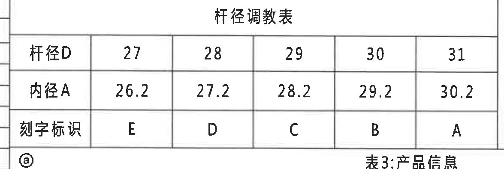

原图位置/视图名称：第1页左下偏中，杆径调整表。

| 项目 | 27 | 28 | 29 | 30 | 31 |
|---|---|---|---|---|---|
| 杆径D | 27 | 28 | 29 | 30 | 31 |
| 内径A | 26.2 | 27.2 | 28.2 | 29.2 | 30.2 |
| 刻字标识 | E | D | C | B | A |

| 提取项 | 原图数值或文本 | 含义说明 |
|---|---|---|
| 调整关系 | 杆径D与内径A、刻字标识对应 | 用于不同杆径规格下的孔径/刻字识别。 |
| 边界归属说明 | 下方“表3:产品信息”为相邻表题 | 不作为杆径调整表字段；右侧等轴测示意不归入本对象。 |

## object_11 - 表3:产品信息

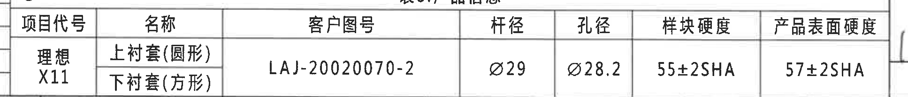

原图位置/视图名称：第1页左下 L 网格，表3产品信息。

| 项目代号 | 名称 | 客户图号 | 杆径 | 孔径 | 样块硬度 | 产品表面硬度 |
|---|---|---|---|---|---|---|
| 理想X11 | 上衬套(圆形) / 下衬套(方形) | LAJ-20020070-2 | Ø29 | Ø28.2 | 55±2SHA | 57±2SHA |

| 提取项 | 原图数值或文本 | 含义说明 |
|---|---|---|
| 项目代号 | 理想X11 | 产品/项目代号。 |
| 名称 | 上衬套(圆形)、下衬套(方形) | 产品包含上下衬套形态。 |
| 客户图号 | LAJ-20020070-2 | 客户图纸编号。 |
| 杆径 | Ø29 | 稳定杆杆径。 |
| 孔径 | Ø28.2 | 衬套孔径。 |
| 样块硬度 | 55±2SHA | 样块硬度要求。 |
| 产品表面硬度 | 57±2SHA | 成品表面硬度要求。 |
| 边界归属说明 | 产品信息表完整 | 上方杆径调整表和左侧通用公差表不归入本表。 |

## object_12 - 等轴测示意图/坐标方向

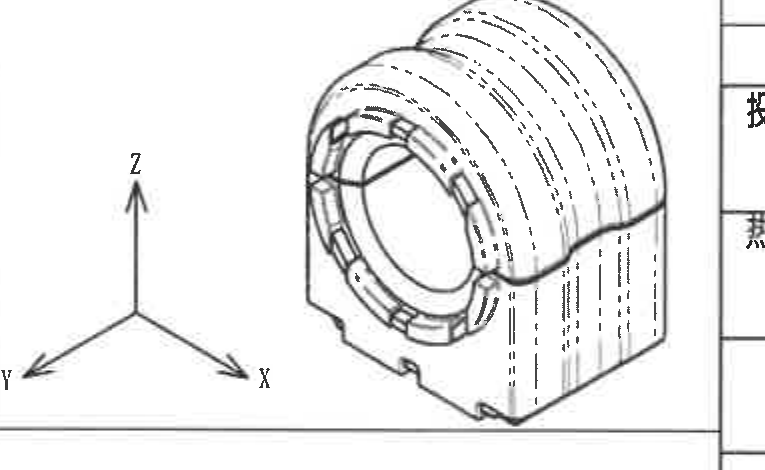

原图位置/视图名称：第1页左下至中下部，等轴测示意图。

| 提取项 | 原图数值或文本 | 含义说明 |
|---|---|---|
| 坐标方向 | X、Y、Z | 用于说明图纸试验和装配方向。 |
| 示意结构 | 稳定杆衬套总成三维外形 | 无新增尺寸；展示外形、中心孔、外部开口及虚线内部轮廓。 |
| 尺寸信息 | 无新增数值尺寸 | 尺寸以正视图、剖面视图和局部视图为准。 |
| 边界归属说明 | 示意图与坐标轴完整 | 周边表格文字不归入本对象。 |

## object_13 - 标题栏

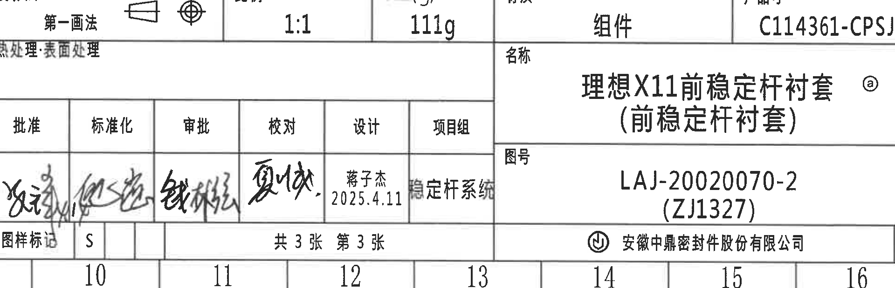

原图位置/视图名称：第1页右下角标题栏。

| 提取项 | 原图数值或文本 | 含义说明 |
|---|---|---|
| 投影法 | 第一画法 | 图纸投影方法。 |
| 比例 | 1:1 | 图样比例。 |
| 质量 | 111g | 零件/组件质量。 |
| 对象类型 | 组件 | 图纸对象属性。 |
| 产品号 | C114361-CPSJ | 产品编号。 |
| 热处理/表面处理 | 表面处理 | 处理栏原图文字。 |
| 名称 | 理想X11前稳定杆衬套(前稳定杆衬套) | 图纸名称。 |
| 图号 | LAJ-20020070-2 (ZJ1327) | 图纸编号和括号内编号。 |
| 图样标记 | S | 标题栏图样标记。 |
| 张数 | 共3张 第3张 | 图纸页次。 |
| 设计 | 蒋子杰 2025.4.11 | 设计人员与日期。 |
| 项目组 | 稳定杆系统 | 所属项目组。 |
| 公司 | 安徽中鼎密封件股份有限公司 | 出图单位。 |
| 图幅 | A3 | 图幅规格。 |
| 签署栏 | 批准、标准化、审批、校对等手写签名 | 手写签名原图不完全可辨，按栏位说明提取。 |
| 边界归属说明 | 标题栏字段完整 | 上缘紧邻物料明细表，不提取明细表行到标题栏。 |

## 裁切检查记录

| 对象 | 图片路径 | 检查结果 | 是否重裁 |
|---|---|---|---|
| 整页 | outputs/20C114361_assets/images/page_1.png | 整页PNG完整，作为所有bbox来源。 | 否 |
| object_1 | outputs/20C114361_assets/images/object_1.png | 试验表所有行列和文字完整；底部表线完整，无尺寸线问题。 | 是，扩展到底部完整行 |
| object_2 | outputs/20C114361_assets/images/object_2.png | 修订履历表表头和A/B记录完整；来历列左侧原扫描边缘字符不清，已扩大裁切并按可见内容记录。 | 是，向左扩展 |
| object_3 | outputs/20C114361_assets/images/object_3.png | 正视图尺寸线、箭头、文字完整；未带入A-A剖面尺寸。 | 是，收紧下边界 |
| object_4 | outputs/20C114361_assets/images/object_4.png | A-A剖面尺寸线、箭头、文字和剖面标题完整。 | 否 |
| object_5 | outputs/20C114361_assets/images/object_5.png | 铝骨架R21.5/R19.5/43及名称完整；R21.5曾贴边，已上移重裁。 | 是，上移上边界 |
| object_6 | outputs/20C114361_assets/images/object_6.png | 塑料底座R26.5、10、40、36及名称完整；右侧为本局部图框边界。 | 是，扩大左下边界 |
| object_7 | outputs/20C114361_assets/images/object_7.png | 技术要求文本完整，上沿文字未截断。 | 是，扩大左上和底部 |
| object_8 | outputs/20C114361_assets/images/object_8.png | 物料明细表行列完整；下缘标题栏边线不提取为表格内容。 | 是，调整为明细表区域 |
| object_9 | outputs/20C114361_assets/images/object_9.png | GB/T 3672.1-2002 M3表所有行完整；左侧仅保留图框坐标边缘。 | 是，补足下半表并去除右侧表格 |
| object_10 | outputs/20C114361_assets/images/object_10.png | 杆径调整表完整；右侧等轴测示意已排除，下方产品信息表题不提取。 | 是，补左侧标签列并去除右侧示意图 |
| object_11 | outputs/20C114361_assets/images/object_11.png | 产品信息表字段完整；无相邻公差表内容混入。 | 是，去除左侧相邻表格 |
| object_12 | outputs/20C114361_assets/images/object_12.png | 等轴测示意和X/Y/Z坐标完整；上方测试表残片已排除。 | 是，重裁示意区域 |
| object_13 | outputs/20C114361_assets/images/object_13.png | 标题栏字段、签署栏、产品号、图号、公司和图幅完整；上缘邻接明细表但不提取其内容。 | 否 |
