# 20C114362 内容识别与裁切

源文件：`input/20C114362.pdf`  
整页渲染图：`outputs/20C114362_assets/images/page_1.png`  
整页尺寸：4959 x 3505 px  
bbox 格式：`[x, y, width, height]`，坐标基于整页 PNG 左上角。

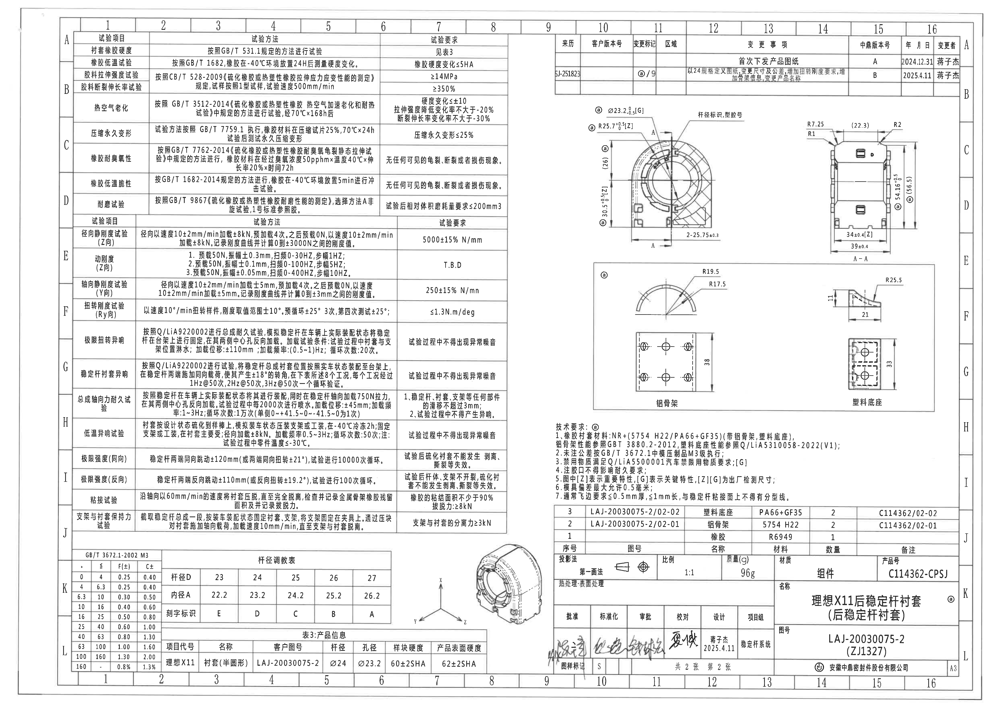

## object_1 - 左侧试验项目/试验方法/试验要求表

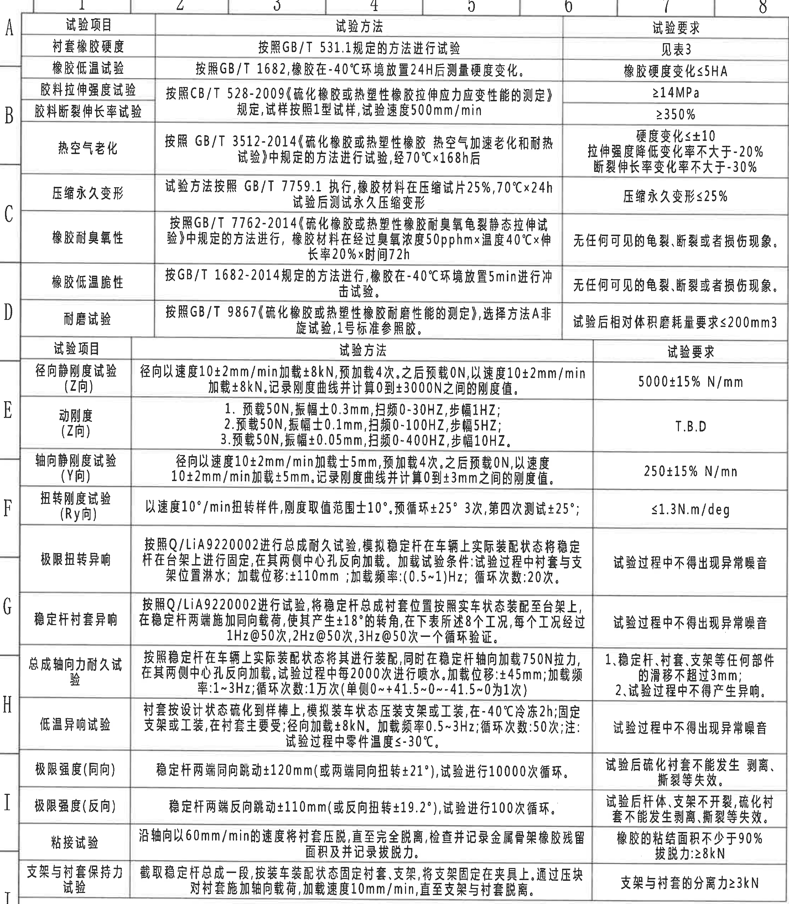

原图位置/视图名称：第 1 页左侧大表，bbox `[305, 120, 2215, 2535]`。

### 原表还原

| 试验项目 | 试验方法 | 试验要求 |
|---|---|---|
| 衬套橡胶硬度 | 按照 GB/T 531.1 规定的方法进行试验 | 见表3 |
| 橡胶低温试验 | 按照 GB/T 1682，橡胶在 -40℃ 环境放置 24H 后测量硬度变化。 | 橡胶硬度变化≤5HA |
| 胶料拉伸强度试验 | 按照 CB/T 528-2009《硫化橡胶或热塑性橡胶拉伸应力应变性能的测定》规定，试样按照 1 型试样，试验速度 500mm/min | ≥14MPa |
| 胶料断裂伸长率试验 | 同上：按照 CB/T 528-2009，试样按照 1 型试样，试验速度 500mm/min | ≥350% |
| 热空气老化 | 按照 GB/T 3512-2014《硫化橡胶或热塑性橡胶 热空气加速老化和耐热试验》中规定的方法进行试验，经 70℃×168h 后 | 硬度变化≤±10；拉伸强度降低变化率不大于 -20%；断裂伸长率变化率不大于 -30% |
| 压缩永久变形 | 试验方法按照 GB/T 7759.1 执行，橡胶材料在压缩试片 25%，70℃×24h 试验后测试永久压缩变形 | 压缩永久变形≤25% |
| 橡胶耐臭氧性 | 按照 GB/T 7762-2014《硫化橡胶或热塑性橡胶耐臭氧龟裂静态拉伸试验》中规定的方法进行，橡胶材料在经过臭氧浓度 50pphm×温度 40℃×伸长率 20%×时间 72h | 无任何可见的龟裂、断裂或者损伤现象。 |
| 橡胶低温脆性 | 按 GB/T 1682-2014 规定的方法进行，橡胶在 -40℃ 环境放置 5min 进行冲击试验。 | 无任何可见的龟裂、断裂或者损伤现象。 |
| 耐磨试验 | 按照 GB/T 9867《硫化橡胶或热塑性橡胶耐磨性能的测定》，选择方法 A 非旋试验，1 号标准参照胶。 | 试验后相对体积磨耗量要求≤200mm3 |
| 径向静刚度试验（Z 向） | 径向以速度 10±2mm/min 加载 ±8kN，预加载 4 次。之后预载 0N，以速度 10±2mm/min 加载 ±8kN。记录刚度曲线并计算 0 到 ±3000N 之间的刚度值。 | 5000±15% N/mm |
| 动刚度（Z 向） | 1. 预载 50N，振幅 ±0.3mm，扫频 0-30HZ，步幅 1HZ；2. 预载 50N，振幅 ±0.1mm，扫频 0-100HZ，步幅 5HZ；3. 预载 50N，振幅 ±0.05mm，扫频 0-400HZ，步幅 10HZ。 | T.B.D |
| 轴向静刚度试验（Y 向） | 径向以速度 10±2mm/min 加载 ±5mm，预加载 4 次。之后预载 0N，以速度 10±2mm/min 加载 ±5mm。记录刚度曲线并计算 0 到 ±3mm 之间的刚度值。 | 250±15% N/mm |
| 扭转刚度试验（Ry 向） | 以速度 10°/min 扭转样件，刚度取值范围 ±10°。预循环 ±25° 3 次，第四次测试 ±25°； | ≤1.3N.m/deg |
| 极限扭转异响 | 按照 Q/LiA9220002 进行总成耐久试验，模拟稳定杆在车辆上实际装配状态将稳定杆在台架上进行固定，在其两侧中心孔反向加载。加载试验条件：试验过程中衬套与支架位置淋水；加载位移：±110mm；加载频率：(0.5~1)Hz；循环次数：20次。 | 试验过程中不得出现异常噪音 |
| 稳定杆衬套异响 | 按照 Q/LiA9220002 进行试验，将稳定杆总成衬套位置按照实车状态装配至台架上，在稳定杆两端施加同向载荷，使其产生 ±18° 的转角，在下表所述 8 个工况，每个工况经过 1Hz@50次、2Hz@50次、3Hz@50次一个循环验证。 | 试验过程中不得出现异常噪音 |
| 总成轴向力耐久试验 | 按照稳定杆在车辆上实际装配状态将其进行装配，同时在稳定杆轴向加载 750N 拉力，在其两侧中心孔反向加载。试验过程中每 2000 次进行喷水。加载位移：±45mm；加载频率：1~3Hz；循环次数：1万次（单侧 0~+41.5~0~-41.5~0 为 1 次） | 1. 稳定杆、衬套、支架等任何部件的滑移不超过 3mm；2. 试验过程中不得产生异响。 |
| 低温异响试验 | 衬套按设计状态硫化到样棒上，模拟装车状态压装支架或工装，在 -40℃ 冷冻 2h；固定支架或工装，在衬套主要受径向加载 ±8kN。加载频率 0.5~3Hz；循环次数：50次；注：试验过程中零件温度≤-30℃。 | 试验过程中不得出现异常噪音 |
| 极限强度（同向） | 稳定杆两端同向跳动 ±120mm（或两端同向扭转 ±21°），试验进行 10000 次循环。 | 试验后硫化衬套不能发生剥离、撕裂等失效。 |
| 极限强度（反向） | 稳定杆两端反向跳动 ±110mm（或反向扭转 ±19.2°），试验进行 100 次循环。 | 试验后杆体、支架不开裂，硫化衬套不能发生剥离、撕裂等失效。 |
| 粘接试验 | 沿轴向以 60mm/min 的速度将衬套压脱，直至完全脱离，检查并记录金属骨架橡胶残留面积及并记录拔脱力。 | 橡胶的粘结面积不少于 90%；拔脱力：≥8kN |
| 支架与衬套保持力试验 | 截取稳定杆总成一段，按装车装配状态固定衬套、支架，将支架固定在夹具上。通过压块对衬套施加轴向载荷，加载速度 10mm/min，直至支架与衬套脱离。 | 支架与衬套的分离力≥3kN |

### 提取表

| 提取项 | 原图数值或文本 | 含义说明 |
|---|---|---|
| 表格结构 | 试验项目 / 试验方法 / 试验要求 | 左侧主体性能与试验要求表。 |
| 关键单位 | MPa、%、N/mm、N.m/deg、kN、mm/min、Hz、℃ | 分别表示强度、伸长率、刚度、扭转刚度、力、速度、频率和温度。 |
| 参考关系 | “见表3” | 衬套橡胶硬度要求引用底部表3产品信息。 |

边界归属说明：裁切包含完整左侧大表及外框，右下角只接近三维示意边缘，未将三维视图内容归入本表；顶部/左侧坐标框为原图边框信息，不作为试验内容提取。

## object_2 - 右上修订履历表

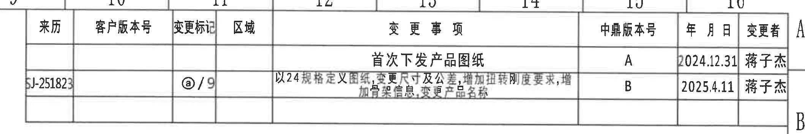

原图位置/视图名称：第 1 页右上修订履历，bbox `[2685, 145, 2120, 355]`。

### 原表还原

| 来历 | 客户版本号 | 变更标记 | 区域 | 变更事项 | 中鼎版本号 | 年月日 | 变更者 |
|---|---|---|---|---|---|---|---|
|  |  |  |  | 首次下发产品图纸 | A | 2024.12.31 | 蒋子杰 |
| SJ-251823（原图较模糊） |  | ⓐ/9 |  | 以 24 规格定义图纸，变更尺寸及公差，增加扭转刚度要求，增加备注信息，变更产品名称 | B | 2025.4.11 | 蒋子杰 |

### 提取表

| 提取项 | 原图数值或文本 | 含义说明 |
|---|---|---|
| 中鼎版本号 A | 首次下发产品图纸；2024.12.31；蒋子杰 | 初版发布记录。 |
| 中鼎版本号 B | ⓐ/9；2025.4.11；蒋子杰 | 以 24 规格定义图纸并调整尺寸、公差、扭转刚度、备注和名称。 |

边界归属说明：裁切从右上表格左边界扩展至右侧变更者列，包含完整表头和 A/B 两行。右侧页框字母 A/B 可见，属于图框边界，不归入修订表字段。

## object_3 - 主视图/半剖主加工视图

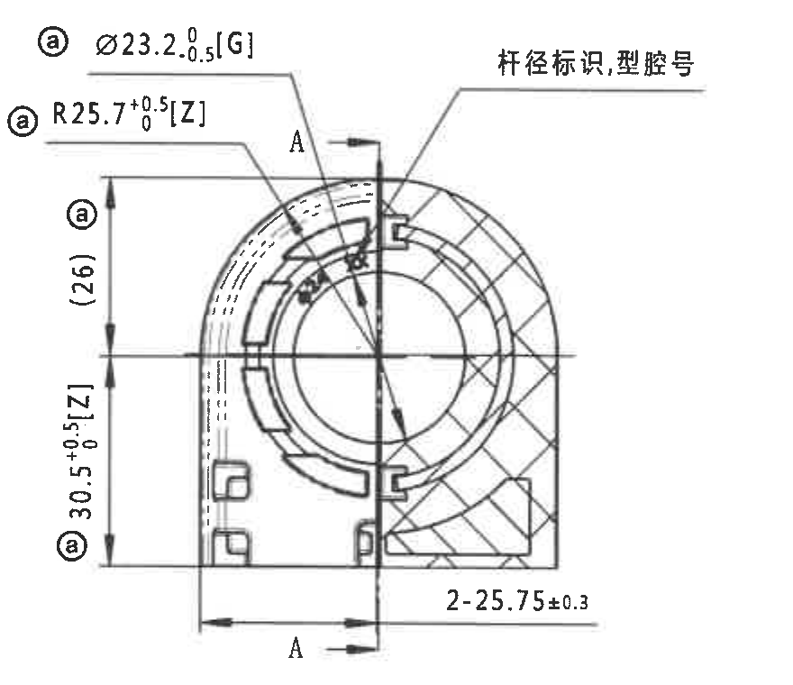

原图位置/视图名称：第 1 页右上主视图，bbox `[2910, 500, 880, 760]`。

### 提取表

| 提取项 | 原图数值或文本 | 含义说明 |
|---|---|---|
| 直径尺寸 | ⓐ Ø23.2 +0/-0.5 [G] | 孔/杆径相关尺寸，带变更标记 ⓐ；[G] 为关键特性，按技术要求属于出厂检测尺寸。 |
| 弧半径 | ⓐ R25.7 +0.5/0 [Z] | 主外圆弧半径，带变更标记 ⓐ；[Z] 为重要特性，按技术要求属于出厂检测尺寸。 |
| 参考尺寸 | ⓐ (26) | 括号内参考尺寸，表示从上端到中心水平线附近的参考高度，不作为直接公差控制尺寸。 |
| 竖向尺寸 | ⓐ 30.5 +0.5/0 [Z] | 主视图下半高度尺寸，带变更标记 ⓐ 和 [Z] 重要特性。 |
| 数量前缀尺寸 | 2-25.75±0.3 | “2-”表示两处同类尺寸，25.75 为尺寸值，公差 ±0.3。 |
| 剖切基准 | A / A | A-A 剖切线位置，指向 object_4 的 A-A 剖面。 |
| 文本标注 | 杆径标识，型腔号 | 指示该区域含杆径标识和型腔号。 |

边界归属说明：裁切包含主视图完整尺寸线、箭头、A-A 剖切线和左侧竖向尺寸文字；未包含右侧 A-A 剖面的独立尺寸，主视图尺寸只归属于本对象。

## object_4 - A-A 剖面视图

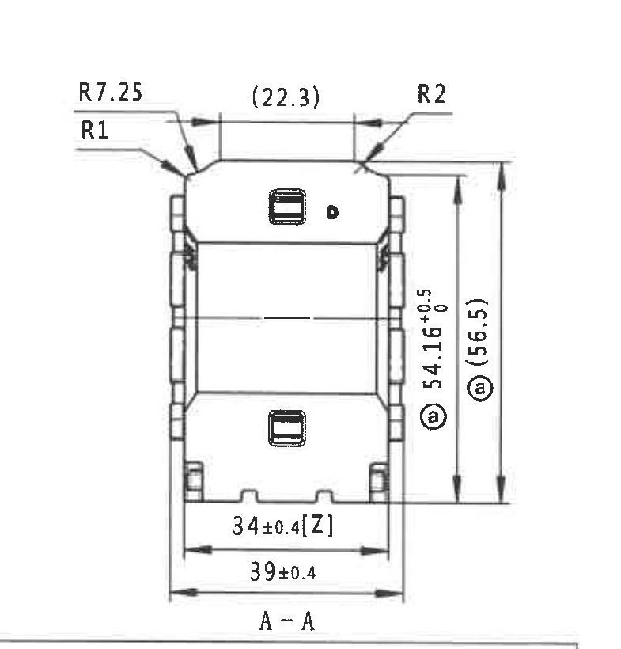

原图位置/视图名称：第 1 页右上 A-A 剖面，bbox `[3905, 500, 785, 820]`。

### 提取表

| 提取项 | 原图数值或文本 | 含义说明 |
|---|---|---|
| 圆角/半径 | R7.25 | 剖面左上外侧圆角半径。 |
| 圆角/半径 | R1 | 剖面左上内侧小圆角半径。 |
| 参考尺寸 | (22.3) | 括号内水平参考尺寸，表示上部宽度参考值。 |
| 圆角/半径 | R2 | 剖面右上圆角半径。 |
| 竖向尺寸 | ⓐ 54.16 +0.5/0 | 剖面主体高度控制尺寸，带变更标记 ⓐ。 |
| 参考总高度 | ⓐ (56.5) | 括号内参考总高度，带变更标记 ⓐ。 |
| 横向尺寸 | 34±0.4 [Z] | 内部底部宽度，公差 ±0.4；[Z] 为重要特性。 |
| 横向总宽 | 39±0.4 | 剖面底部总宽度，公差 ±0.4。 |
| 视图名 | A-A | 与主视图 A-A 剖切线对应。 |

边界归属说明：裁切包含剖面尺寸线、箭头、文字和 “A-A” 视图名；底部可见下方局部视图框上边线，但该线不作为本剖面尺寸提取。

## object_5 - 局部视图总框

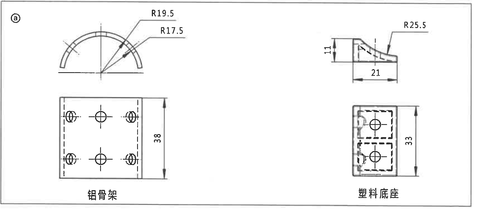

原图位置/视图名称：第 1 页中右局部视图框，bbox `[2940, 1300, 1780, 760]`。

### 提取表

| 提取项 | 原图数值或文本 | 含义说明 |
|---|---|---|
| 左上局部视图 | R19.5；R17.5 | 铝骨架弧形局部半径，详见 object_6。 |
| 左下局部视图 | 38；铝骨架 | 铝骨架平面/孔位示意高度，详见 object_7。 |
| 右上局部视图 | 11；21；R25.5 | 塑料底座侧向局部尺寸，详见 object_8。 |
| 右下局部视图 | 33；塑料底座 | 塑料底座平面局部高度，详见 object_9。 |

边界归属说明：本对象保留局部视图框原始结构，内部四个局部视图的具体尺寸分别在 object_6 到 object_9 中提取；未将框外技术要求或标题栏内容归入本对象。

## object_6 - 铝骨架弧形局部视图

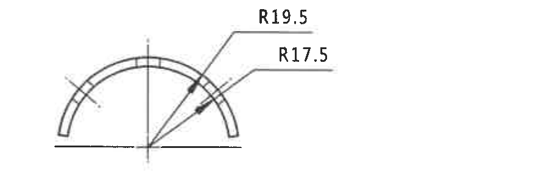

原图位置/视图名称：局部视图框左上，bbox `[3060, 1320, 880, 310]`。

### 提取表

| 提取项 | 原图数值或文本 | 含义说明 |
|---|---|---|
| 外弧半径 | R19.5 | 铝骨架半圆外侧弧向半径。 |
| 内弧半径 | R17.5 | 铝骨架半圆内侧弧向半径。 |
| 中心/基准线 | 水平中心线、竖向中心线 | 半径从中心交点引出，表示同心弧结构。 |

边界归属说明：裁切只包含左上弧形局部视图及其 R19.5/R17.5 标注，未带入下方铝骨架平面视图尺寸。

## object_7 - 铝骨架平面局部视图

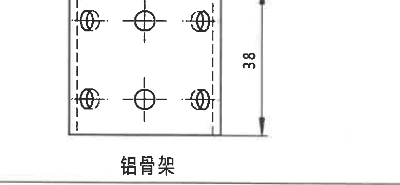

原图位置/视图名称：局部视图框左下，bbox `[3020, 1680, 780, 360]`。

### 提取表

| 提取项 | 原图数值或文本 | 含义说明 |
|---|---|---|
| 高度尺寸 | 38 | 铝骨架平面视图竖向尺寸。 |
| 零件名称 | 铝骨架 | 对应 BOM 中铝骨架零件。 |
| 结构标记 | 六处孔/孔位示意、虚线边界 | 视图表达孔位和隐藏/内部边界，原图未给出孔径尺寸。 |

边界归属说明：裁切包含铝骨架平面视图、右侧 38 尺寸线及“铝骨架”文字；下边缘接近技术要求区域，但未提取其文字。

## object_8 - 塑料底座侧向局部视图

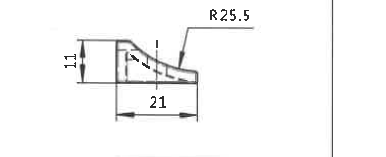

原图位置/视图名称：局部视图框右上，bbox `[3980, 1360, 760, 310]`。

### 提取表

| 提取项 | 原图数值或文本 | 含义说明 |
|---|---|---|
| 竖向尺寸 | 11 | 塑料底座侧向局部高度。 |
| 横向尺寸 | 21 | 塑料底座侧向局部长度。 |
| 弧半径 | R25.5 | 侧向曲面/弧面半径。 |
| 中心/辅助线 | 竖向中心线、虚线曲线 | 表示曲面位置和内部轮廓。 |

边界归属说明：裁切只包含右上侧向局部视图及 11、21、R25.5 标注，未带入右下塑料底座平面视图的 33 尺寸。

## object_9 - 塑料底座平面局部视图

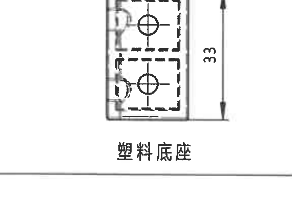

原图位置/视图名称：局部视图框右下，bbox `[4000, 1700, 570, 385]`。

### 提取表

| 提取项 | 原图数值或文本 | 含义说明 |
|---|---|---|
| 高度尺寸 | 33 | 塑料底座平面视图竖向尺寸。 |
| 零件名称 | 塑料底座 | 对应 BOM 中塑料底座零件。 |
| 结构标记 | 两处孔位、虚线边界 | 视图表达孔位和隐藏/内部结构，原图未给出孔径尺寸。 |

边界归属说明：裁切包含右下塑料底座平面视图、33 尺寸线及“塑料底座”文字；未归入右上侧向视图的尺寸。

## object_10 - 技术要求 NOTES

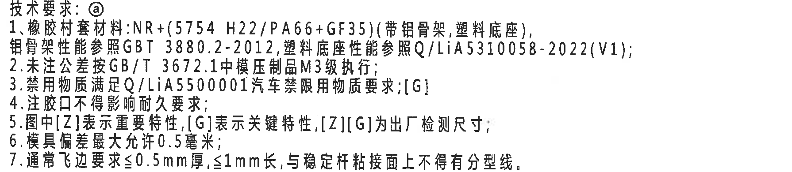

原图位置/视图名称：第 1 页右中下技术要求，bbox `[2735, 2100, 1790, 390]`。

### 原文本还原

| 序号 | 原图文本 | 含义说明 |
|---|---|---|
| 标题 | 技术要求：ⓐ | 本技术要求带变更标记 ⓐ。 |
| 1 | 橡胶衬套材料：NR+(5754 H22/PA66+GF35)(带铝骨架、塑料底座)，铝骨架性能参照 GBT 3880.2-2012，塑料底座性能参照 Q/LiA5310058-2022(V1)； | 定义衬套材料组合及铝骨架、塑料底座性能依据。 |
| 2 | 未注公差按 GB/T 3672.1 中模压制品 M3 级执行； | 未注公差执行标准。 |
| 3 | 禁用物质满足 Q/LiA5500001 汽车禁限用物质要求；[G] | 禁限用物质要求，带 [G] 关键特性标识。 |
| 4 | 注胶口不得影响耐久要求； | 对注胶口位置/影响的要求。 |
| 5 | 图中 [Z] 表示重要特性，[G] 表示关键特性，[Z][G] 为出厂检测尺寸； | 解释图中 [Z]、[G] 含义。 |
| 6 | 模具偏差最大允许 0.5 毫米； | 模具偏差限值。 |
| 7 | 通常飞边要求≤0.5mm 厚，≤1mm 长，与稳定杆粘接面上不得有分型线。 | 飞边和粘接面分型线要求。 |

边界归属说明：裁切包含技术要求 1-7 条完整文字；下方 BOM 表未进入正式裁切，技术要求不与 BOM 字段混合。

## object_11 - GB/T 3672.1-2002 M3 公差表

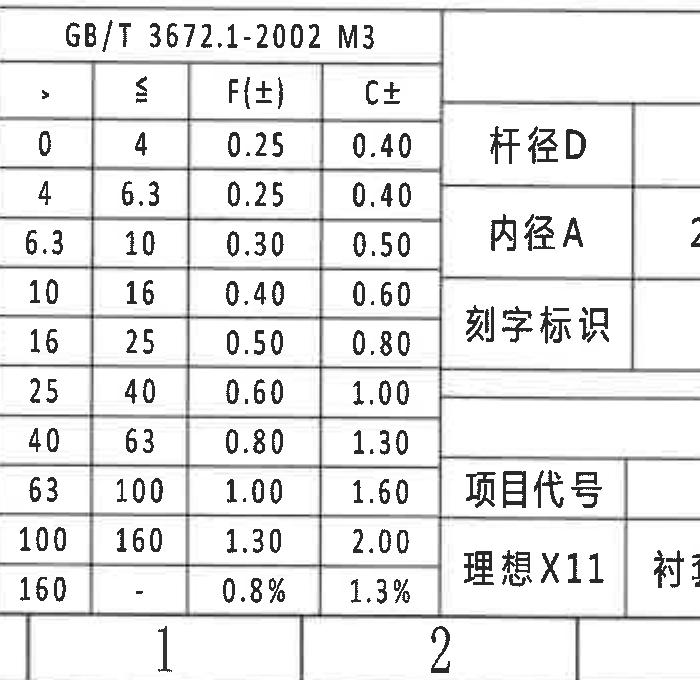

原图位置/视图名称：第 1 页左下 GB/T 3672.1-2002 M3 表，bbox `[360, 2720, 700, 680]`。

### 原表还原

| > | ≤ | F(±) | C± |
|---:|---:|---:|---:|
| 0 | 4 | 0.25 | 0.40 |
| 4 | 6.3 | 0.25 | 0.40 |
| 6.3 | 10 | 0.30 | 0.50 |
| 10 | 16 | 0.40 | 0.60 |
| 16 | 25 | 0.50 | 0.80 |
| 25 | 40 | 0.60 | 1.00 |
| 40 | 63 | 0.80 | 1.30 |
| 63 | 100 | 1.00 | 1.60 |
| 100 | 160 | 1.30 | 2.00 |
| 160 | - | 0.8% | 1.3% |

### 提取表

| 提取项 | 原图数值或文本 | 含义说明 |
|---|---|---|
| 表名 | GB/T 3672.1-2002 M3 | 未注公差等级表，呼应技术要求第 2 条。 |
| 公差列 | F(±)、C± | 表示不同类别的双向公差值。 |

边界归属说明：右侧可见相邻杆径调数表的左边线/局部文字，但本对象只提取 GB/T 3672.1-2002 M3 公差表字段。

## object_12 - 杆径调数表

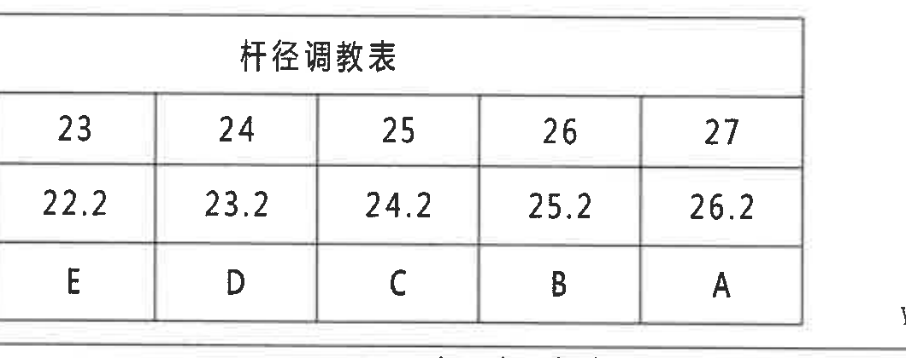

原图位置/视图名称：第 1 页底部偏左“杆径调数表”，bbox `[1000, 2715, 1060, 420]`。

### 原表还原

|  | 23 | 24 | 25 | 26 | 27 |
|---|---:|---:|---:|---:|---:|
| 杆径D | 23 | 24 | 25 | 26 | 27 |
| 内径A | 22.2 | 23.2 | 24.2 | 25.2 | 26.2 |
| 刻字标识 | E | D | C | B | A |

### 提取表

| 提取项 | 原图数值或文本 | 含义说明 |
|---|---|---|
| 表名 | 杆径调数表 | 按杆径 D 对应内径 A 与刻字标识。 |
| 24 规格 | 杆径D=24；内径A=23.2；刻字标识=D | 与图中 24 规格及主视图 Ø23.2 相关。 |

边界归属说明：裁切包含杆径调数表完整表框和全部 23-27 列；左侧 GB/T 公差表边缘不归入本表。

## object_13 - 表3：产品信息

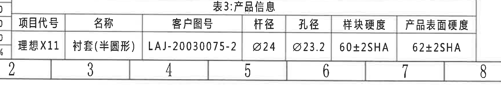

原图位置/视图名称：第 1 页底部“表3：产品信息”，bbox `[760, 3130, 1740, 300]`。

### 原表还原

| 项目代号 | 名称 | 客户图号 | 杆径 | 孔径 | 样块硬度 | 产品表面硬度 |
|---|---|---|---|---|---|---|
| 理想X11 | 衬套(半圆形) | LAJ-20030075-2 | Ø24 | Ø23.2 | 60±2SHA | 62±2SHA |

### 提取表

| 提取项 | 原图数值或文本 | 含义说明 |
|---|---|---|
| 杆径 | Ø24 | 产品适配杆径。 |
| 孔径 | Ø23.2 | 产品孔径，与主视图 Ø23.2 [G] 对应。 |
| 样块硬度 | 60±2SHA | 材料样块硬度要求。 |
| 产品表面硬度 | 62±2SHA | 产品表面硬度要求。 |

边界归属说明：裁切包含“表3：产品信息”表头及单行数据；左侧相邻公差表边缘可见，但不归入本表字段。

## object_14 - 三维示意视图

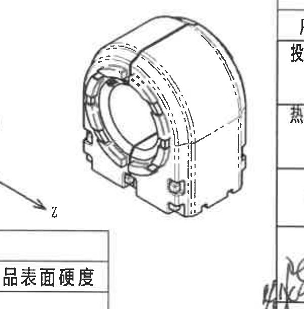

原图位置/视图名称：第 1 页下中三维示意图，bbox `[2200, 2670, 600, 610]`。

### 提取表

| 提取项 | 原图数值或文本 | 含义说明 |
|---|---|---|
| 视图内容 | 衬套三维轴测示意 | 展示半圆形衬套总成外形、内孔、骨架/底座相对位置。 |
| 坐标轴 | X、Y、Z | 表示方向坐标；本裁切中未给出具体尺寸数值。 |
| 尺寸标注 | 无独立尺寸标注 | 原图三维示意仅用于形状理解，尺寸以主视图、A-A 剖面和局部视图为准。 |

边界归属说明：裁切保留完整三维示意图；左下角局部可见坐标轴文字，右侧页框线不作为尺寸内容。

## object_15 - BOM/材料明细表

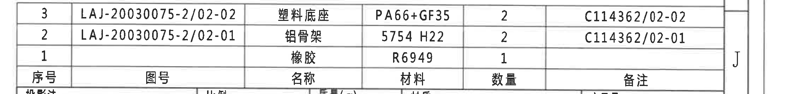

原图位置/视图名称：第 1 页右下 BOM 表，bbox `[2700, 2500, 2240, 270]`。

### 原表还原

| 序号 | 图号 | 名称 | 材料 | 数量 | 备注 |
|---:|---|---|---|---:|---|
| 3 | LAJ-20030075-2/02-02 | 塑料底座 | PA66+GF35 | 2 | C114362/02-02 |
| 2 | LAJ-20030075-2/02-01 | 铝骨架 | 5754 H22 | 2 | C114362/02-01 |
| 1 |  | 橡胶 | R6949 | 1 |  |

### 提取表

| 提取项 | 原图数值或文本 | 含义说明 |
|---|---|---|
| 塑料底座 | PA66+GF35；数量 2 | 与局部视图 object_8/object_9 对应。 |
| 铝骨架 | 5754 H22；数量 2 | 与局部视图 object_6/object_7 对应。 |
| 橡胶 | R6949；数量 1 | 对应衬套橡胶主体。 |

边界归属说明：裁切包含 BOM 三行和表头；下方标题栏字段“投影法/比例/质量”等不归入本对象。

## object_16 - 标题栏/签审栏

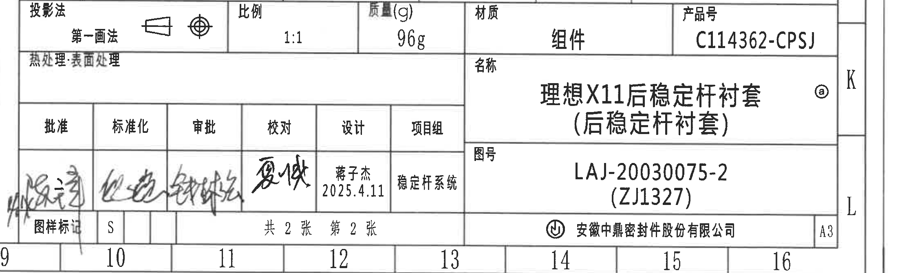

原图位置/视图名称：第 1 页右下标题栏，bbox `[2700, 2750, 2240, 670]`。

### 提取表

| 提取项 | 原图数值或文本 | 含义说明 |
|---|---|---|
| 投影法 | 第一画法 | 图样投影方法。 |
| 比例 | 1:1 | 图样比例。 |
| 质量(g) | 96g | 组件质量。 |
| 材质 | 组件 | 标题栏材质字段。 |
| 产品号 | C114362-CPSJ | 产品编号。 |
| 热处理/表面处理 | 热处理：表面处理 | 标题栏处理字段，原图此区域未填写具体处理值。 |
| 名称 | 理想X11后稳定杆衬套（后稳定杆衬套）ⓐ | 图样名称，带变更标记 ⓐ。 |
| 图号 | LAJ-20030075-2 (ZJ1327) | 图纸编号。 |
| 设计 | 蒋子杰 2025.4.11 | 设计签审信息。 |
| 项目组 | 稳定杆系统 | 项目组字段。 |
| 图样标记 | S | 图样标记字段。 |
| 张数 | 共 2 张 第 2 张 | 图纸页数信息。 |
| 公司 | 安徽中鼎密封件股份有限公司 | 出图单位。 |
| 图幅 | A3 | 图幅规格。 |

边界归属说明：裁切包含标题栏、签审栏、产品号、名称、图号、公司和 A3 图幅；右侧 J/K/L 页框字母和底部坐标数字为图框信息，不作为标题栏字段。

## 裁切检查记录

| 图片 | bbox | 检查结果 | 边界处理记录 |
|---|---|---|---|
| page_1.png | [0, 0, 4959, 3505] | 完整 | 整页 PNG 完整渲染 PDF 第 1 页。 |
| object_1.png | [305, 120, 2215, 2535] | 完整 | 左侧大表所有行、列和边框完整；未提取右侧三维示意。 |
| object_2.png | [2685, 145, 2120, 355] | 完整 | 修订表左右边界完整；右侧页框字母不归入表格。 |
| object_3.png | [2910, 500, 880, 760] | 完整 | 主视图尺寸线、箭头、文字完整；未混入 A-A 剖面尺寸。 |
| object_4.png | [3905, 500, 785, 820] | 完整 | A-A 文字、底部尺寸线完整；底部局部视图框线只作为边界背景。 |
| object_5.png | [2940, 1300, 1780, 760] | 完整 | 局部视图框完整，框外技术要求未归入本对象。 |
| object_6.png | [3060, 1320, 880, 310] | 完整 | R19.5、R17.5 及引线完整；未带入下方平面视图。 |
| object_7.png | [3020, 1680, 780, 360] | 完整 | 38 尺寸线与“铝骨架”文字完整；下方技术要求未归入。 |
| object_8.png | [3980, 1360, 760, 310] | 完整 | 11、21、R25.5 完整；未带入右下 33 尺寸。 |
| object_9.png | [4000, 1700, 570, 385] | 完整 | 33 尺寸线与“塑料底座”文字完整。 |
| object_10.png | [2735, 2100, 1790, 390] | 完整 | 技术要求 1-7 条完整；未带入 BOM。 |
| object_11.png | [360, 2720, 700, 680] | 完整 | GB/T 公差表完整；右侧相邻表边缘可见但不提取。 |
| object_12.png | [1000, 2715, 1060, 420] | 完整 | 杆径调数表完整，23-27 列均完整。 |
| object_13.png | [760, 3130, 1740, 300] | 完整 | 表3标题、表头和数据行完整。 |
| object_14.png | [2200, 2670, 600, 610] | 完整 | 三维示意图完整；无独立尺寸线需提取。 |
| object_15.png | [2700, 2500, 2240, 270] | 完整 | BOM 行列完整；下方标题栏不归入。 |
| object_16.png | [2700, 2750, 2240, 670] | 完整 | 标题栏和签审栏完整；页框坐标仅作为边界背景。 |
