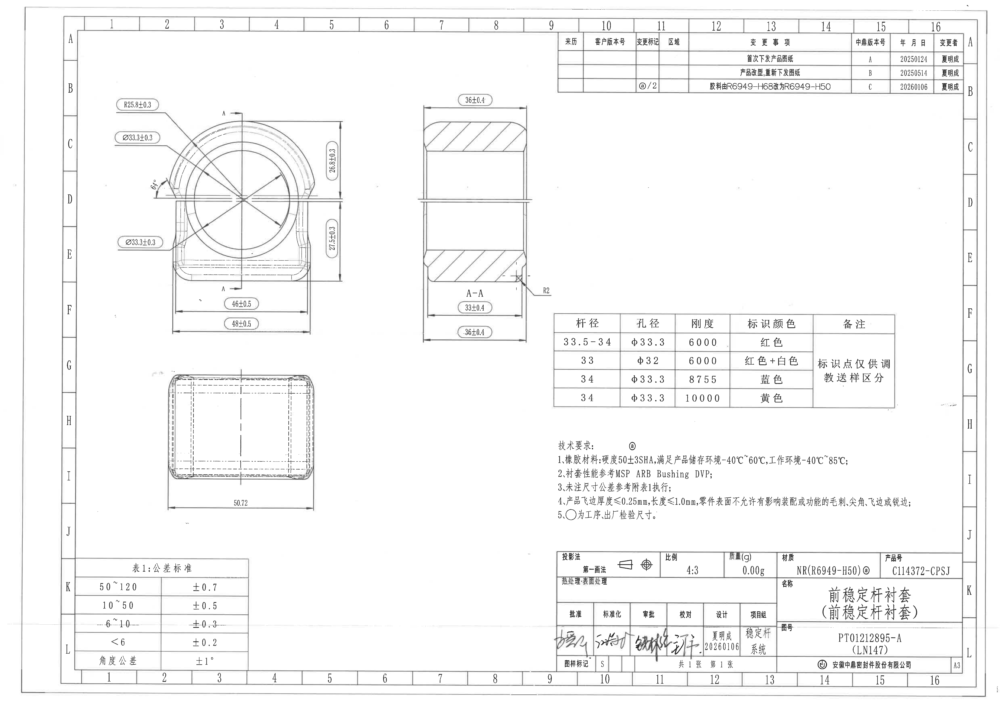
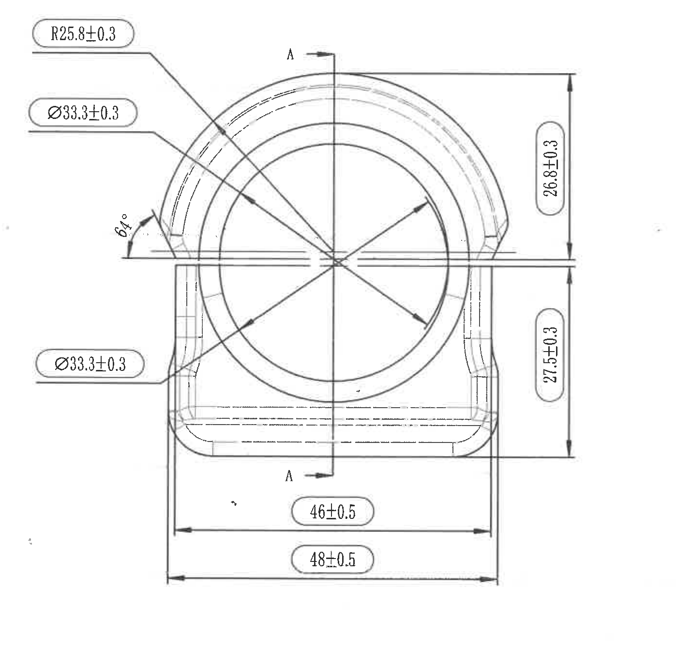
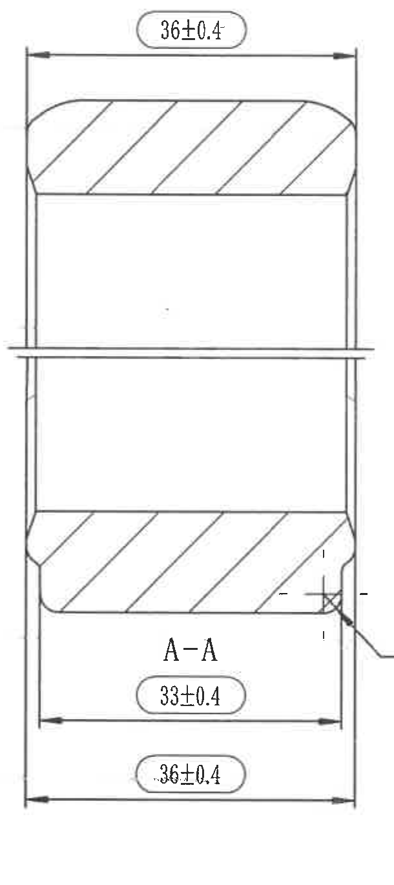
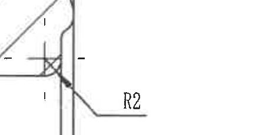
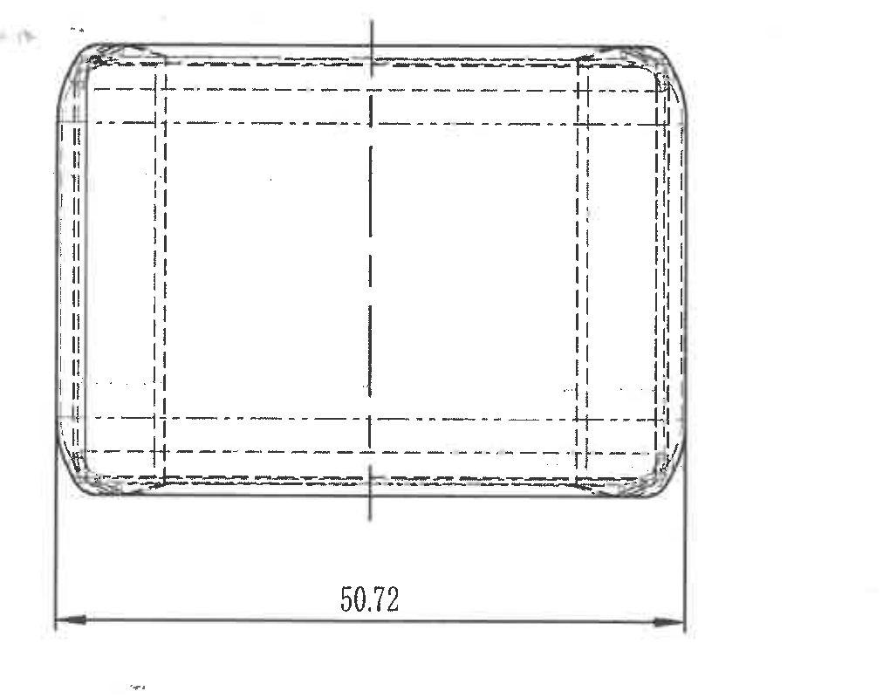
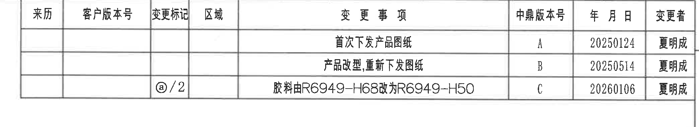
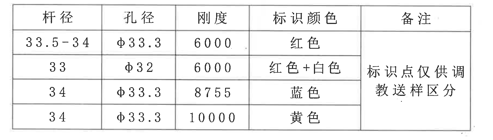
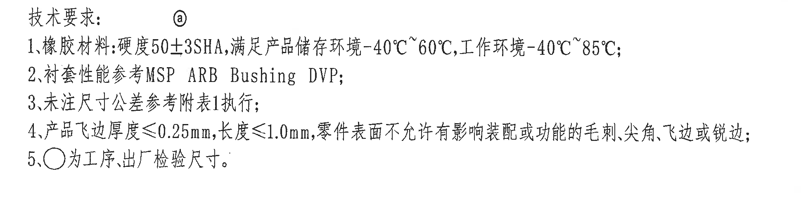
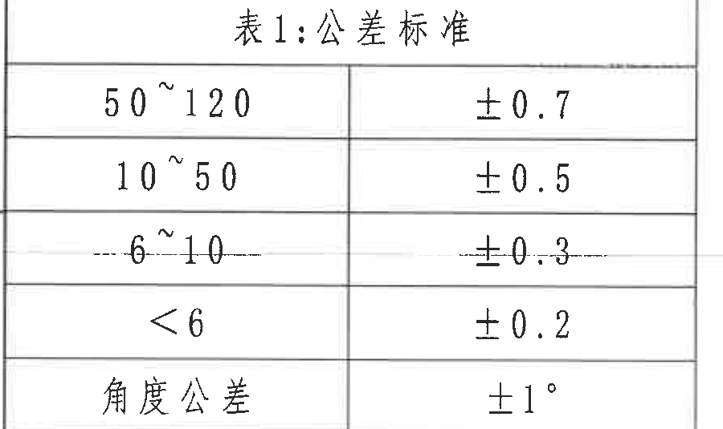
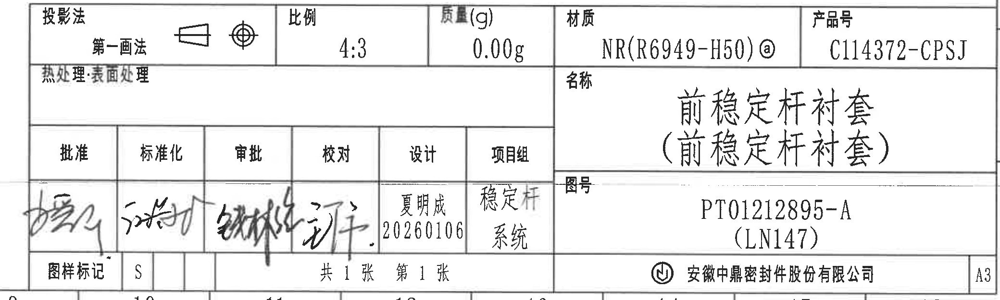

# 20C114372 PDF 内容识别

整页 PNG：`outputs/20C114372_assets/images/page_1.png`  
页面：1；整页尺寸：4959 x 3505 px；整页 bbox：`[0, 0, 4959, 3505]`。  
说明：以下 bbox 均为整页 PNG 上的像素坐标，格式为 `[x0, y0, x1, y1]`。图中未见括号内参考尺寸、带星号关键尺寸或 T 编号；标题栏中的括号文本为名称/图号附注，不作为参考尺寸处理。

## object_1：左上主加工视图

原图位置/视图名称：第 1 页左上主加工视图，bbox `[510, 450, 1940, 1790]`。

| 提取项 | 原图数值或文本 | 含义说明 |
|---|---|---|
| 半径尺寸 | R25.8±0.3 | 左上引出框，指向主视图上部弧形轮廓；R 表示半径，公差为 ±0.3。 |
| 直径尺寸（上部引出） | Ø33.3±0.3 | 左侧上部引出框，指向圆/孔相关轮廓；Ø 表示直径，公差为 ±0.3。 |
| 直径尺寸（下部引出） | Ø33.3±0.3 | 左侧下部引出框，指向同一主视图下部相关圆/孔轮廓；与上部引出属于不同引线位置。 |
| 角度 | 64° | 主视图左侧斜面/圆弧过渡附近的角度标注。 |
| 竖向尺寸（上段） | 26.8±0.3 | 右侧竖向尺寸，上部水平基准线至中间水平线的距离，公差 ±0.3。 |
| 竖向尺寸（下段） | 27.5±0.3 | 右侧竖向尺寸，中间水平线至下部水平基准线的距离，公差 ±0.3。 |
| 横向尺寸（内侧） | 46±0.5 | 底部内侧两竖向延长线之间的宽度，公差 ±0.5。 |
| 横向尺寸（外侧） | 48±0.5 | 底部外侧总宽度，公差 ±0.5。 |
| 剖切标识 | A、A | 中心竖向剖切线两端标注 A，指示 A-A 剖视图位置和方向；不是独立基准特征框。 |
| 参考尺寸/关键尺寸/T 编号 | 未见 | 本裁切对象中未出现括号内参考尺寸、星号关键尺寸或 T 编号。 |

边界归属说明：该裁切保留主视图完整轮廓、尺寸线、箭头和左/右/底部标注框；下边界收至主视图 48±0.5 尺寸线以下，未提取下方矩形视图的 50.72 尺寸。A-A 剖切字母属于本主视图的剖切指示，剖面尺寸不归入本对象。

## object_2：A-A 剖面视图

原图位置/视图名称：第 1 页上中 A-A 剖面视图，bbox `[2060, 450, 2670, 1820]`。

| 提取项 | 原图数值或文本 | 含义说明 |
|---|---|---|
| 剖面名称 | A-A | 与主视图中的 A-A 剖切线对应。 |
| 横向尺寸（上部外宽） | 36±0.4 | 剖面上方总宽度尺寸，公差 ±0.4。 |
| 横向尺寸（下部内侧） | 33±0.4 | 剖面下方内侧宽度尺寸，公差 ±0.4。 |
| 横向尺寸（下部外侧） | 36±0.4 | 剖面下方外侧总宽度尺寸，公差 ±0.4。 |
| 剖面填充 | 斜线剖面线 | 上下实体材料区域以斜线剖面线表示。 |
| 局部圆角提示 | 右下局部圆角引出线局部可见 | R2 半径文字作为独立局部标注放入 object_3，不在本剖面尺寸表中重复归属。 |
| 参考尺寸/关键尺寸/T 编号 | 未见 | 本裁切对象中未出现括号内参考尺寸、星号关键尺寸或 T 编号。 |

边界归属说明：裁切区域只覆盖 A-A 剖面本体和本剖面所属的 36±0.4、33±0.4、36±0.4 尺寸线。右侧 R2 文字标注已拆为 object_3；右侧标识表未归入本对象。

## object_3：R2 局部半径标注

原图位置/视图名称：第 1 页 A-A 剖面右下局部标注，bbox `[2485, 1270, 2925, 1500]`。

| 提取项 | 原图数值或文本 | 含义说明 |
|---|---|---|
| 局部半径 | R2 | 剖面右下角局部圆角半径标注，R 表示半径，数值为 2。 |
| 引出线 | R2 引线指向右下局部圆角 | 用于明确 R2 属于 A-A 剖面右下角局部圆角。 |
| 参考尺寸/关键尺寸/T 编号 | 未见 | 本裁切对象中未出现括号内参考尺寸、星号关键尺寸或 T 编号。 |

边界归属说明：该对象仅用于 R2 局部半径说明，未包含右侧表格内容；R2 归属于 A-A 剖面右下角局部圆角，不归入主视图或标识表。

## object_4：左下矩形加工视图

原图位置/视图名称：第 1 页左下矩形加工视图，bbox `[770, 1810, 1790, 2610]`。

| 提取项 | 原图数值或文本 | 含义说明 |
|---|---|---|
| 横向总长 | 50.72 | 底部水平尺寸线标注，表示该矩形视图左右端之间的长度；原图未在此处单独给出 ± 公差。 |
| 中心线 | 竖向中心线 | 表示该视图的中心位置。 |
| 隐藏线/内部轮廓线 | 多条虚线/点划线 | 表示内部或背面不可见轮廓。 |
| 未注尺寸公差引用 | 技术要求第 3 条、表 1 | 50.72 未见单独公差，按技术要求“未注尺寸公差参考附表1执行”。 |
| 参考尺寸/关键尺寸/T 编号 | 未见 | 本裁切对象中未出现括号内参考尺寸、星号关键尺寸或 T 编号。 |

边界归属说明：该裁切只包含左下矩形视图及其 50.72 尺寸线、箭头和文字；不包含上方主视图尺寸，也不包含左下公差表。

## object_5：右上修订履历表

原图位置/视图名称：第 1 页右上修订履历表，bbox `[2705, 165, 4790, 545]`。

| 来历 | 客户版本号 | 变更标记 | 区域 | 变更事项 | 中鼎版本号 | 年月日 | 变更者 |
|---|---|---|---|---|---|---|---|
|  |  |  |  | 首次下发产品图纸 | A | 20250124 | 夏明成 |
|  |  |  |  | 产品改型,重新下发图纸 | B | 20250514 | 夏明成 |
|  |  | ⓐ/2 |  | 胶料由R6949-H68改为R6949-H50 | C | 20260106 | 夏明成 |

| 提取项 | 原图数值或文本 | 含义说明 |
|---|---|---|
| 表头 | 来历、客户版本号、变更标记、区域、变更事项、中鼎版本号、年月日、变更者 | 修订履历表列名。 |
| 修订 A | 首次下发产品图纸；中鼎版本号 A；20250124；夏明成 | 首次下发记录。 |
| 修订 B | 产品改型,重新下发图纸；中鼎版本号 B；20250514；夏明成 | 产品改型并重新下发图纸记录。 |
| 修订 C | ⓐ/2；胶料由R6949-H68改为R6949-H50；中鼎版本号 C；20260106；夏明成 | 当前材料变更记录，与标题栏材料 NR(R6949-H50)ⓐ 对应。 |

边界归属说明：该裁切保留修订表完整行列和右侧“变更者”列；图框坐标字母不作为表格字段提取。

## object_6：右中标识/性能表

原图位置/视图名称：第 1 页右中标识/性能表，bbox `[2700, 1540, 4520, 2060]`。

| 杆径 | 孔径 | 刚度 | 标识颜色 | 备注 |
|---|---|---|---|---|
| 33.5-34 | φ33.3 | 6000 | 红色 | 标识点仅供调教送样区分 |
| 33 | φ32 | 6000 | 红色+白色 | 标识点仅供调教送样区分 |
| 34 | φ33.3 | 8755 | 蓝色 | 标识点仅供调教送样区分 |
| 34 | φ33.3 | 10000 | 黄色 | 标识点仅供调教送样区分 |

| 提取项 | 原图数值或文本 | 含义说明 |
|---|---|---|
| 表头 | 杆径、孔径、刚度、标识颜色、备注 | 标识/性能表列名。 |
| 数据行 1 | 杆径 33.5-34；孔径 φ33.3；刚度 6000；标识颜色 红色 | 适用于杆径 33.5-34 的配置。 |
| 数据行 2 | 杆径 33；孔径 φ32；刚度 6000；标识颜色 红色+白色 | 适用于杆径 33 的配置。 |
| 数据行 3 | 杆径 34；孔径 φ33.3；刚度 8755；标识颜色 蓝色 | 适用于杆径 34、刚度 8755 的配置。 |
| 数据行 4 | 杆径 34；孔径 φ33.3；刚度 10000；标识颜色 黄色 | 适用于杆径 34、刚度 10000 的配置。 |
| 备注栏 | 标识点仅供调教送样区分 | 原图备注栏为数据区合并单元格，文字跨多行显示。 |

边界归属说明：该裁切只包含右中标识/性能表，未包含左侧 A-A 剖面 R2 标注；备注栏为本表内部合并区域。

## object_7：技术要求 / NOTES

原图位置/视图名称：第 1 页右下技术要求，bbox `[2700, 2170, 4640, 2670]`。

| 提取项 | 原图数值或文本 | 含义说明 |
|---|---|---|
| 标题 | 技术要求：ⓐ | 技术要求区标题，带 ⓐ 变更标记。 |
| 1 | 橡胶材料:硬度50±3SHA,满足产品储存环境-40℃~60℃,工作环境-40℃~85℃; | 材料硬度、储存环境温度和工作环境温度要求。 |
| 2 | 衬套性能参考MSP ARB Bushing DVP; | 衬套性能参考文件。 |
| 3 | 未注尺寸公差参考附表1执行; | 未注尺寸按表 1 公差标准执行。 |
| 4 | 产品飞边厚度≤0.25mm,长度≤1.0mm,零件表面不允许有影响装配或功能的毛刺,尖角,飞边或锐边; | 飞边厚度/长度限值和表面质量要求。 |
| 5 | ○为工序,出厂检验尺寸。 | 圆圈符号用于工序/出厂检验尺寸标识说明。 |

边界归属说明：该裁切只包含技术要求文字区；底部标题栏被排除，不将标题栏字段归入 NOTES。

## object_8：左下表 1 公差标准

原图位置/视图名称：第 1 页左下“表1:公差标准”，bbox `[365, 2785, 1265, 3320]`。

| 尺寸范围 | 公差 |
|---|---|
| 50~120 | ±0.7 |
| 10~50 | ±0.5 |
| 6~10 | ±0.3 |
| <6 | ±0.2 |
| 角度公差 | ±1° |

| 提取项 | 原图数值或文本 | 含义说明 |
|---|---|---|
| 表题 | 表1:公差标准 | 技术要求第 3 条引用的未注尺寸公差表。 |
| 线性尺寸范围 50~120 | ±0.7 | 未注线性尺寸在 50~120 范围时采用该公差。 |
| 线性尺寸范围 10~50 | ±0.5 | 未注线性尺寸在 10~50 范围时采用该公差。 |
| 线性尺寸范围 6~10 | ±0.3 | 未注线性尺寸在 6~10 范围时采用该公差。 |
| 线性尺寸范围 <6 | ±0.2 | 未注线性尺寸小于 6 时采用该公差。 |
| 角度公差 | ±1° | 未注角度尺寸采用该公差。 |

边界归属说明：该裁切只包含公差标准表本体；左侧/底部图框坐标编号不作为表格内容提取。

## object_9：右下标题栏

原图位置/视图名称：第 1 页右下标题栏，bbox `[2700, 2730, 4780, 3355]`。

| 字段 | 原图数值或文本 |
|---|---|
| 投影法 | 第一画法；含投影符号 |
| 比例 | 4:3 |
| 质量(g) | 0.00g |
| 材质 | NR(R6949-H50)ⓐ |
| 产品号 | C114372-CPSJ |
| 热处理·表面处理 | 未填写 |
| 名称 | 前稳定杆衬套（前稳定杆衬套） |
| 图号 | PT01212895-A（LN147） |
| 批准 | 手写签名 |
| 标准化 | 手写签名 |
| 审批 | 手写签名 |
| 校对 | 手写签名 |
| 设计 | 夏明成 20260106 |
| 项目组 | 稳定杆系统 |
| 图样标记 | S |
| 张数 | 共1张 第1张 |
| 公司 | 安徽中鼎密封件股份有限公司 |
| 图幅 | A3 |

| 提取项 | 原图数值或文本 | 含义说明 |
|---|---|---|
| 产品标识 | C114372-CPSJ | 标题栏产品号。 |
| 图号 | PT01212895-A（LN147） | 标题栏图号；括号内 LN147 为图号附注，不是参考尺寸。 |
| 名称 | 前稳定杆衬套（前稳定杆衬套） | 零件名称；括号内为名称重复/附注，不是参考尺寸。 |
| 材质 | NR(R6949-H50)ⓐ | 材料牌号与 ⓐ 变更标记，和修订 C “胶料由R6949-H68改为R6949-H50”对应。 |
| 比例 | 4:3 | 图纸比例。 |
| 质量 | 0.00g | 标题栏质量字段。 |
| 设计 | 夏明成 20260106 | 设计栏姓名和日期。 |
| 图幅 | A3 | 标题栏右下图幅标识。 |

边界归属说明：该裁切保留标题栏完整内部栏格、A3 图幅格和公司名称；右侧与图框坐标 K/L 相邻，裁切按标题栏边框取值，不将图框坐标作为标题栏字段提取。

## 裁切检查记录

| object_id | 图片路径 | 检查结果 | 边界处理记录 |
|---|---|---|---|
| object_1 | outputs/20C114372_assets/images/object_1.png | 完整包含主视图尺寸线、箭头和文字。 | 下边界重裁后排除左下矩形视图；46±0.5、48±0.5 尺寸线完整。 |
| object_2 | outputs/20C114372_assets/images/object_2.png | 完整包含 A-A 剖面本体和 36±0.4、33±0.4、36±0.4 尺寸线。 | 右侧收紧，排除标识表；R2 文字另归 object_3。 |
| object_3 | outputs/20C114372_assets/images/object_3.png | 完整包含 R2 文字、引出线和对应局部圆角区域。 | 未带入右侧表格字段。 |
| object_4 | outputs/20C114372_assets/images/object_4.png | 完整包含矩形视图、中心线、隐藏线和 50.72 尺寸线。 | 未带入主视图和公差表。 |
| object_5 | outputs/20C114372_assets/images/object_5.png | 完整包含修订表表头、三行记录和右侧“变更者”列。 | 重裁后排除图框坐标字母。 |
| object_6 | outputs/20C114372_assets/images/object_6.png | 完整包含标识/性能表所有列、四行数据和备注合并区。 | 左边界避开 A-A 剖面/R2 标注。 |
| object_7 | outputs/20C114372_assets/images/object_7.png | 完整包含“技术要求”标题和 1~5 条文字。 | 下边界收至标题栏上方，未混入标题栏。 |
| object_8 | outputs/20C114372_assets/images/object_8.png | 完整包含表 1 标题、五行公差数据和外框。 | 裁掉图框坐标编号，保留角度公差行。 |
| object_9 | outputs/20C114372_assets/images/object_9.png | 完整包含标题栏内部栏格、产品号、图号、名称、签核栏、公司名和 A3。 | 右侧与图框坐标相邻，按标题栏边框裁切；K/L 坐标不作为内容提取。 |
