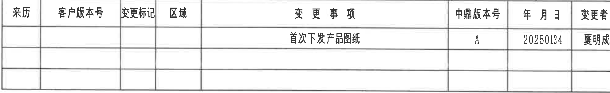
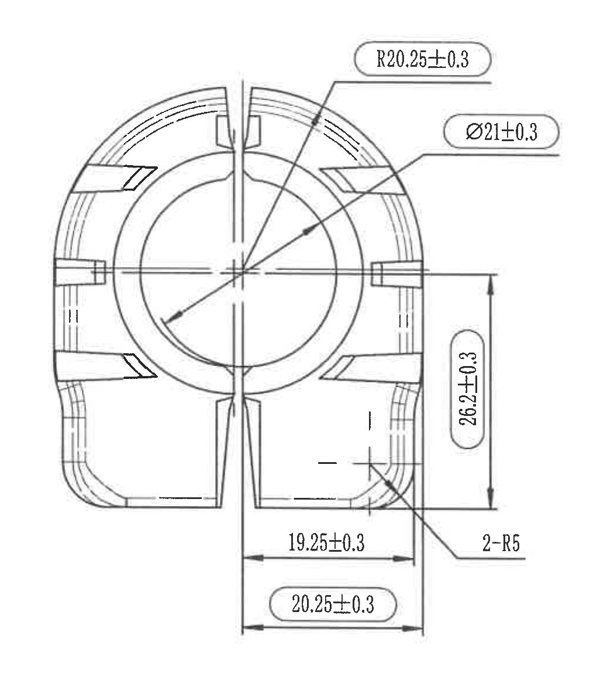
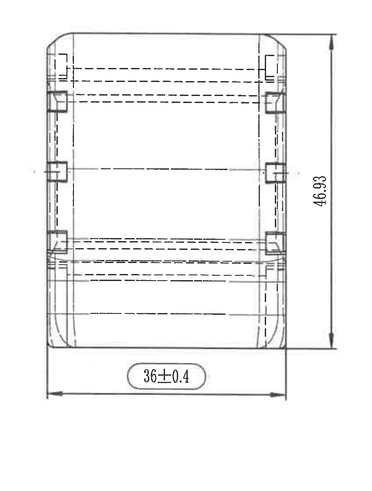
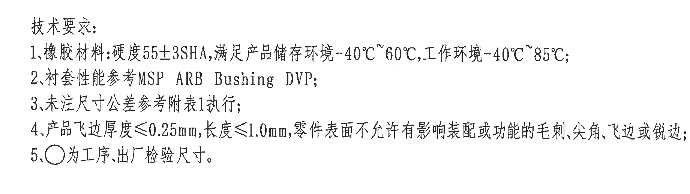
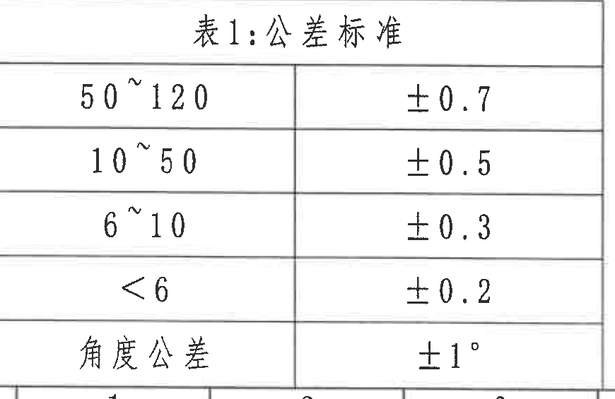
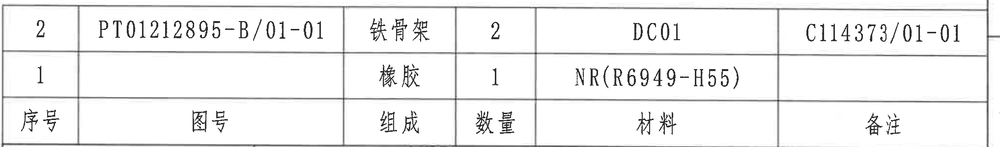
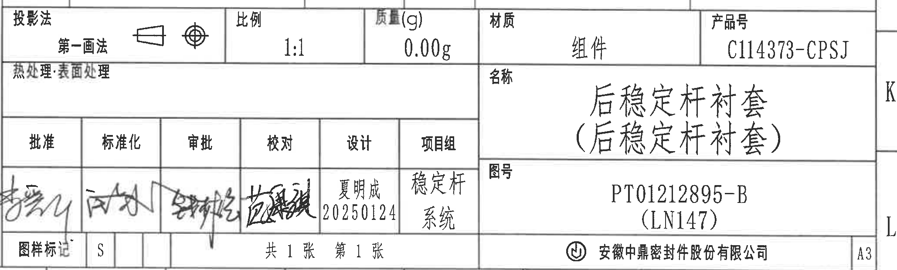

# 20C114373 图纸内容识别

整页渲染图：`20C114373_assets/images/page_1.png`，页面尺寸 4959 x 3505 px。

本页未见独立剖面视图或局部放大视图；识别到 2 个加工视图、3 个表格、1 个 NOTES 区域、1 个标题栏区域。以下按原图结构位置记录，不将相邻区域内容归入当前对象。

## object_3：上方变更履历表

原图位置/视图名称：第 1 页上部 A 区，约列 9-16；bbox `[2760, 180, 4745, 485]`；object_kind=`table`。

原表还原：

| 来历 | 客户版本号 | 变更标记 | 区域 | 变更事项 | 中鼎版本号 | 年月日 | 变更者 |
|---|---|---|---|---|---|---|---|
|  |  |  |  | 首次下发产品图纸 | A | 20250124 | 夏明成 |
|  |  |  |  |  |  |  |  |
|  |  |  |  |  |  |  |  |

| 提取项 | 原图数值或文本 | 含义说明 |
|---|---|---|
| 表头 | 来历、客户版本号、变更标记、区域、变更事项、中鼎版本号、年月日、变更者 | 变更履历字段。 |
| 变更事项 | 首次下发产品图纸 | 本次为首次下发产品图纸。 |
| 中鼎版本号 | A | 中鼎内部版本号为 A。 |
| 年月日 | 20250124 | 变更日期为 2025-01-24。 |
| 变更者 | 夏明成 | 本条变更记录的变更者。 |
| 空白行 | 两行空白记录 | 原表预留变更记录行。 |

边界归属说明：裁切区域只取上方变更履历表。右侧图框坐标字母已通过重裁去除；表内空白格保留为原结构，不归入标题栏或其他表格。

## object_1：左侧端面加工视图

原图位置/视图名称：第 1 页左中部 D-G 区，约列 2-5；bbox `[555, 935, 1605, 2125]`；object_kind=`view`。

| 提取项 | 原图数值或文本 | 含义说明 |
|---|---|---|
| 半径尺寸 | R20.25±0.3 | 上方引出线指向端面上部圆弧/圆环相关轮廓；R 表示半径，公差 ±0.3。该标注位于圆角框内，按技术要求第 5 条理解为工序/出厂检验关注尺寸。 |
| 直径尺寸 | Ø21±0.3 | 引出线指向中心圆孔/内圆轮廓；Ø 表示直径，公差 ±0.3。该标注位于圆角框内，按技术要求第 5 条理解为工序/出厂检验关注尺寸。 |
| 竖向尺寸 | 26.2±0.3 | 右侧竖向尺寸线标注局部高度/台阶到下端基准位置的距离，公差 ±0.3。该标注位于圆角框内。 |
| 横向尺寸 | 19.25±0.3 | 下部内侧横向尺寸线，箭头位于右下开口/腿部内侧边界之间，公差 ±0.3。 |
| 横向总尺寸 | 20.25±0.3 | 底部外侧横向尺寸线，标注下部两侧外边界间距离，公差 ±0.3。该标注位于圆角框内。 |
| 数量前缀半径 | 2-R5 | 右下引出线指向两处圆角，表示 2 处 R5 半径圆角。 |
| 中心线/对称线 | 水平、竖向中心线 | 用于表示中心位置和对称关系，不是尺寸数值。 |
| 括号内参考尺寸 | 未见 | 当前端面视图中未见括号内参考尺寸；未发现可归属本视图的参考尺寸。 |
| 星号关键尺寸 | 未见 | 当前端面视图中未见带星号尺寸。 |
| 角度/弧长/弧向尺寸 | 未见角度与弧长标注；见半径 R20.25±0.3、2-R5 | 当前视图包含半径尺寸，但未见单独角度、弧长或弧向尺寸。 |
| 基准字母/T 编号 | 未见 | 当前端面视图中未见基准字母或 T 编号。 |

边界归属说明：右侧 26.2±0.3、2-R5 和底部 19.25±0.3、20.25±0.3 的完整箭头、尺寸线、引出线均包含在裁切内；右侧未混入侧视图，底部未混入公差表。

## object_2：右侧侧向加工视图

原图位置/视图名称：第 1 页中部 D-G 区，约列 6-8；bbox `[1725, 1015, 2575, 2135]`；object_kind=`view`。

| 提取项 | 原图数值或文本 | 含义说明 |
|---|---|---|
| 总高度 | 46.93 | 右侧竖向尺寸线，从上端外轮廓到下端外轮廓，标注零件侧向总高度；原图未给出显式公差，按 NOTES 第 3 条引用附表 1 未注尺寸公差。 |
| 总宽度 | 36±0.4 | 下方横向尺寸线，从左外边界到右外边界，标注侧视外宽，公差 ±0.4。该标注位于圆角框内，按技术要求第 5 条理解为工序/出厂检验关注尺寸。 |
| 隐藏线/内轮廓 | 多条虚线 | 表示内部结构或不可见边界，不单独构成尺寸数值。 |
| 括号内参考尺寸 | 未见 | 当前侧向视图中未见括号内参考尺寸。 |
| 星号关键尺寸 | 未见 | 当前侧向视图中未见带星号尺寸。 |
| 直径/半径/角度/弧长 | 未见 | 当前侧向视图未见 Ø、R、角度或弧长标注。 |
| 基准字母/T 编号 | 未见 | 当前侧向视图中未见基准字母或 T 编号。 |

边界归属说明：右侧 46.93 竖向尺寸线和底部 36±0.4 横向尺寸线均完整；裁切未包含左侧端面视图、右下 NOTES 或标题栏内容。

## object_4：技术要求 NOTES

原图位置/视图名称：第 1 页右中下 H-I 区，约列 9-14；bbox `[2700, 1905, 4540, 2425]`；object_kind=`notes`。

| 提取项 | 原图数值或文本 | 含义说明 |
|---|---|---|
| 标题 | 技术要求: | NOTES 区域标题。 |
| 1 | 橡胶材料:硬度55±3SHA,满足产品储存环境-40℃~60℃,工作环境-40℃~85℃; | 规定橡胶硬度及储存/工作环境温度范围。 |
| 2 | 衬套性能参考MSP ARB Bushing DVP; | 衬套性能参考文件/规范为 MSP ARB Bushing DVP。 |
| 3 | 未注尺寸公差参考附表1执行; | 未单独标注公差的尺寸按附表 1 执行。 |
| 4 | 产品飞边厚度≤0.25mm,长度≤1.0mm,零件表面不允许有影响装配或功能的毛刺、尖角、飞边或锐边; | 限制飞边厚度和长度，并禁止影响装配或功能的表面缺陷。 |
| 5 | ○为工序、出厂检验尺寸。 | 圆形/圆角框标识对应工序和出厂检验尺寸。 |

边界归属说明：左侧和右侧均保留空白边距，文字未压边；裁切只包含技术要求文本，不包含下方标题栏或左侧视图。

## object_5：左下公差标准表

原图位置/视图名称：第 1 页左下 K-L 区，约列 1-4；bbox `[385, 2790, 1255, 3355]`；object_kind=`table`。

原表还原：

| 尺寸范围 | 公差 |
|---|---|
| 50~120 | ±0.7 |
| 10~50 | ±0.5 |
| 6~10 | ±0.3 |
| <6 | ±0.2 |
| 角度公差 | ±1° |

| 提取项 | 原图数值或文本 | 含义说明 |
|---|---|---|
| 表题 | 表1:公差标准 | 未注尺寸公差参考表。 |
| 50~120 | ±0.7 | 尺寸范围 50 到 120 的未注线性公差。 |
| 10~50 | ±0.5 | 尺寸范围 10 到 50 的未注线性公差。 |
| 6~10 | ±0.3 | 尺寸范围 6 到 10 的未注线性公差。 |
| <6 | ±0.2 | 小于 6 的未注线性公差。 |
| 角度公差 | ±1° | 未注角度公差。 |

边界归属说明：裁切保留完整表题、行列线和最后一行；因表格下边线紧贴图框坐标格，底部可见极少量相邻图框线，但未把相邻图框文字作为表格字段提取。

## object_6：右下组成/材料明细表

原图位置/视图名称：第 1 页右下 I-J 区，约列 9-16；bbox `[2760, 2460, 4795, 2760]`；object_kind=`table`。

原表还原：

| 序号 | 图号 | 组成 | 数量 | 材料 | 备注 |
|---|---|---|---|---|---|
| 2 | PT01212895-B/01-01 | 铁骨架 | 2 | DC01 | C114373/01-01 |
| 1 |  | 橡胶 | 1 | NR(R6949-H55) |  |

| 提取项 | 原图数值或文本 | 含义说明 |
|---|---|---|
| 表头 | 序号、图号、组成、数量、材料、备注 | 明细表字段；原图表头位于两条明细记录下方。 |
| 记录 2 | 序号 2；图号 PT01212895-B/01-01；组成 铁骨架；数量 2；材料 DC01；备注 C114373/01-01 | 铁骨架明细记录。 |
| 记录 1 | 序号 1；图号空白；组成 橡胶；数量 1；材料 NR(R6949-H55)；备注空白 | 橡胶明细记录。 |

边界归属说明：裁切只归属组成/材料明细表；下方投影法、比例、产品号等标题栏字段不归入本对象。右侧表格外框完整，边缘不提取外侧图框坐标。

## object_7：右下标题栏与签核区

原图位置/视图名称：第 1 页右下 J-L 区，约列 9-16；bbox `[2760, 2738, 4818, 3358]`；object_kind=`title_block`。

| 提取项 | 原图数值或文本 | 含义说明 |
|---|---|---|
| 投影法 | 第一画法（含投影符号） | 图纸投影方式。 |
| 比例 | 1:1 | 绘图比例。 |
| 质量(g) | 0.00g | 质量字段，单位 g。 |
| 材质 | 组件 | 标题栏材质字段。 |
| 产品号 | C114373-CPSJ | 产品编号。 |
| 热处理·表面处理 | 空白 | 原图该栏未填写。 |
| 名称 | 后稳定杆衬套（后稳定杆衬套） | 零件/组件名称，括号内为重复名称文本。 |
| 图号 | PT01212895-B (LN147) | 图纸编号和括号内平台/项目代号。 |
| 批准 | 签名，未能可靠辨认 | 批准签核栏有手写签名。 |
| 标准化 | 签名，未能可靠辨认 | 标准化签核栏有手写签名。 |
| 审批 | 签名，未能可靠辨认 | 审批签核栏有手写签名。 |
| 校对 | 签名，未能可靠辨认 | 校对签核栏有手写签名。 |
| 设计 | 夏明成 20250124 | 设计人员和日期。 |
| 项目组 | 稳定杆 系统 | 项目组字段。 |
| 图样标记 | S | 图样标记。 |
| 页数 | 共 1 张 第 1 张 | 总页数和当前页。 |
| 公司 | 安徽中鼎密封件股份有限公司 | 出图/所属公司。 |
| 幅面 | A3 | 图纸幅面。 |

边界归属说明：裁切包含标题栏上方投影法/比例/质量/材质/产品号行、名称/图号/签核区、图样标记、页数、公司和 A3 幅面格。右侧相邻图框坐标 K/L 因紧贴标题栏外框在边缘可见，但不作为标题栏字段提取；上方组成/材料明细表已单独归入 object_6。

## 裁切检查记录

| 对象 | 图片路径 | 检查结果 |
|---|---|---|
| page_1 | `20C114373_assets/images/page_1.png` | 整页 PNG 已渲染，尺寸 4959 x 3505 px。 |
| object_1 | `20C114373_assets/images/object_1.png` | 端面加工视图完整；R20.25±0.3、Ø21±0.3、26.2±0.3、19.25±0.3、20.25±0.3、2-R5 的文字、尺寸线、箭头和引出线均完整；未混入侧视图。 |
| object_2 | `20C114373_assets/images/object_2.png` | 侧向加工视图完整；46.93 竖向尺寸线和 36±0.4 横向尺寸线完整；未混入端面视图或 NOTES。 |
| object_3 | `20C114373_assets/images/object_3.png` | 变更履历表经重裁后去除右侧图框坐标字母；表头、网格线和变更记录完整。 |
| object_4 | `20C114373_assets/images/object_4.png` | NOTES 文本完整，左侧未压字，右侧无其他表格或视图片段。 |
| object_5 | `20C114373_assets/images/object_5.png` | 公差表文字和行列线完整；为保留最后一行下边线，底部保留极少量相邻图框线，未提取为表格内容。 |
| object_6 | `20C114373_assets/images/object_6.png` | 组成/材料明细表行列完整；下方标题栏字段未归入本对象；右侧图框坐标未作为表格内容提取。 |
| object_7 | `20C114373_assets/images/object_7.png` | 标题栏字段、签核区、公司和 A3 幅面格完整；右侧相邻图框坐标 K/L 可见但不归入标题栏提取内容。 |
