# 20C114394 内容识别与裁切提取

整页渲染图：`outputs/20C114394_assets/images/page_1.png`，像素尺寸 4959×3505。以下裁切坐标均为整页 PNG 像素坐标 `[x1, y1, x2, y2]`。

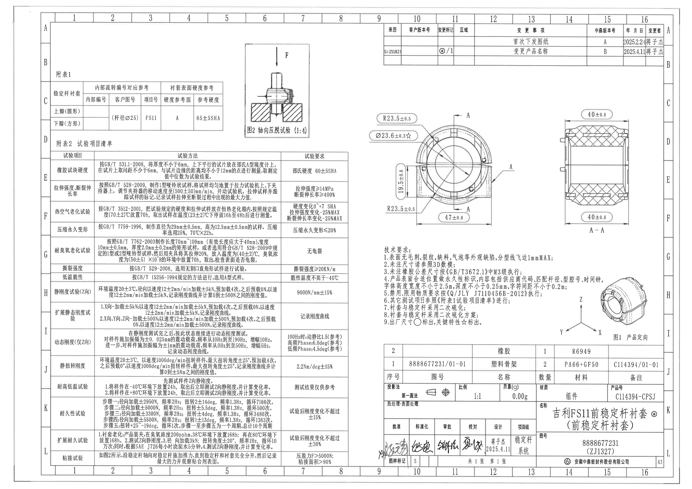

## object_1｜附表1 稳定杆衬套硬度参考表

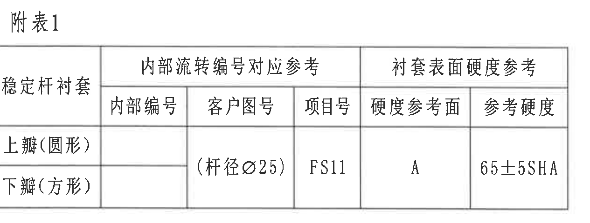

- 原图位置/视图名称：页面左上 C-D 区，附表1，bbox `[380, 485, 1645, 965]`
- object_kind：table

### 原表还原

| 稳定杆衬套 | 内部编号 | 客户图号 | 项目号 | 硬度参考面 | 参考硬度 |
|---|---|---|---|---|---|
| 上瓣（圆形） |  | （杆径Ø25） | FS11 | A | 65±5SHA |
| 下瓣（方形） |  | （杆径Ø25） | FS11 | A | 65±5SHA |

说明：原图中“内部流转编号对应参考”覆盖内部编号、客户图号、项目号三列；“衬套表面硬度参考”覆盖硬度参考面、参考硬度两列；客户图号、项目号、硬度参考面、参考硬度在两行之间为共享/跨行表达。

### 提取表格

| 提取项 | 原图数值或文本 | 含义说明 |
|---|---|---|
| 表名 | 附表1 | 稳定杆衬套参考信息表。 |
| 对象 | 稳定杆衬套 | 表格适用于该衬套。 |
| 分瓣1 | 上瓣（圆形） | 衬套上瓣形态。 |
| 分瓣2 | 下瓣（方形） | 衬套下瓣形态。 |
| 客户图号/杆径参考 | （杆径Ø25） | 表示匹配稳定杆杆径为直径25，作为内部流转参考。 |
| 项目号 | FS11 | 项目/车型平台编号。 |
| 硬度参考面 | A | 硬度检测参考面。 |
| 参考硬度 | 65±5SHA | 邵氏A硬度参考范围，中心65，公差±5。 |

边界归属说明：裁切完整包含附表1标题、外框、列头和两条分瓣行；未混入上中部“图2”或下方“附表2”。

## object_2｜图2 轴向压脱试验（1:4）

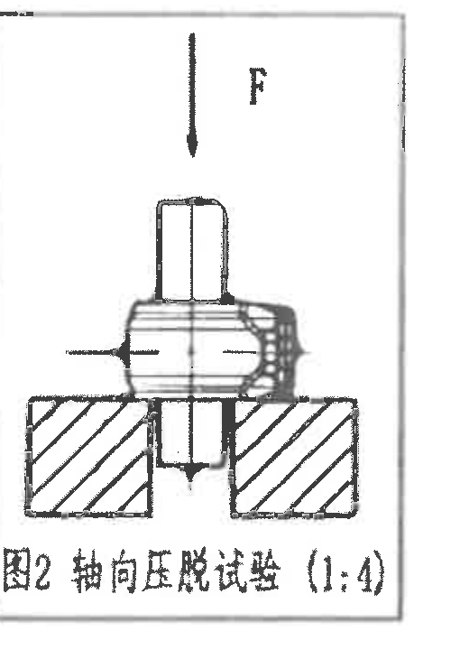

- 原图位置/视图名称：页面上中部 B-D 区，图2 轴向压脱试验，bbox `[1770, 300, 2280, 1020]`
- object_kind：detail

| 提取项 | 原图数值或文本 | 含义说明 |
|---|---|---|
| 图名 | 图2 轴向压脱试验 | 粘接试验/压脱试验的布置示意。 |
| 比例 | （1:4） | 该示意图比例为1:4。 |
| 载荷方向 | F | 箭头F向下，表示沿稳定杆轴向施加载荷/推力的方向。 |
| 剖面表达 | 夹具剖线、稳定杆和衬套截面 | 展示试验时稳定杆、衬套、支承夹具的相对位置。 |

边界归属说明：裁切包含完整图框、F箭头、试验示意和图题；无尺寸线。该对象只解释试验布置，不提取附表2粘接试验表格要求。

## object_3｜附表2 试验项目清单

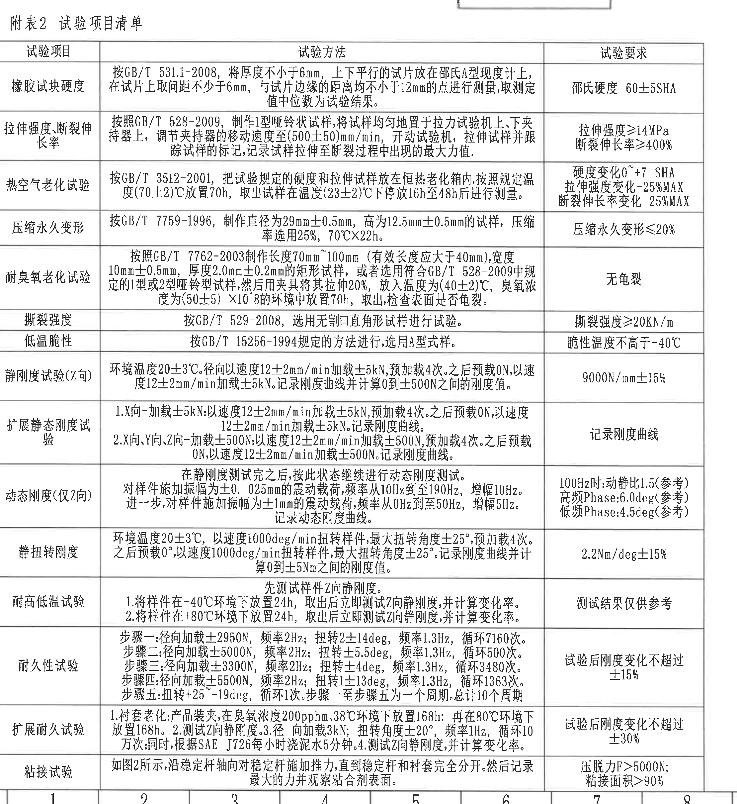

- 原图位置/视图名称：页面左侧 D-L 区，附表2 试验项目清单，bbox `[375, 960, 2595, 3380]`
- object_kind：table

### 原表还原

| 试验项目 | 试验方法 | 试验要求 |
|---|---|---|
| 橡胶试块硬度 | 按GB/T 531.1-2008，将厚度不小于6mm，上下平行的试片放在邵氏A型硬度计上，在试片上取间距不少于6mm，与试片边缘的距离均不小于12mm的点进行测量，取测定值中位数为试验结果。 | 邵氏硬度 60±5SHA |
| 拉伸强度、断裂伸长率 | 按照GB/T 528-2009，制作1型哑铃状试样，将试样均匀地置于拉力试验机上、下夹持器上，调节夹持器的移动速度至(500±50)mm/min，开动试验机，拉伸试样并跟踪试样的标记，记录试样拉伸至断裂过程中出现的最大力值。 | 拉伸强度≥14MPa 断裂伸长率≥400% |
| 热空气老化试验 | 按GB/T 3512-2001，把试验规定的硬度和拉伸试样放在恒热老化箱内，按照规定温度(70±2)℃放置70h，取出试样在温度(23±2)℃下停放16h至48h后进行测量。 | 硬度变化0~+7 SHA 拉伸强度变化-25%MAX 断裂伸长率变化-25%MAX |
| 压缩永久变形 | 按GB/T 7759-1996，制作直径为29mm±0.5mm，高为12.5mm±0.5mm的试样，压缩率选用25%，70℃X22h。 | 压缩永久变形≤20% |
| 耐臭氧老化试验 | 按照GB/T 7762-2003制作长度70mm~100mm（有效长度应大于40mm），宽度10mm±0.5mm，厚度2.0mm±0.2mm的矩形试样，或者选用符合GB/T 528-2009中规定的1型或2型哑铃型试样，然后用夹具将其拉伸20%，放入温度为(40±2)℃，臭氧浓度为(50±5)×10^-8的环境中放置70h，取出，检查表面是否龟裂。 | 无龟裂 |
| 撕裂强度 | 按GB/T 529-2008，选用无割口直角形试样进行试验。 | 撕裂强度≥20KN/m |
| 低温脆性 | 按GB/T 15256-1994规定的方法进行，选用A型式样。 | 脆性温度不高于-40℃ |
| 静刚度试验(Z向) | 环境温度20±3℃，径向以速度12±2mm/min加载±5kN，预加载4次。之后预载0N，以速度12±2mm/min加载±5kN。记录刚度曲线并计算0到±500N之间的刚度值。 | 9000N/mm±15% |
| 扩展静态刚度试验 | 1.X向-加载±5kN：以速度12±2mm/min加载±5kN，预加载4次。之后预载0N，以速度12±2mm/min加载±5kN。记录刚度曲线。 2.X向、Y向、Z向-加载±500N：以速度12±2mm/min加载±500N，预加载4次。之后预载0N，以速度12±2mm/min加载±500N。记录刚度曲线。 | 记录刚度曲线 |
| 动态刚度(仅Z向) | 在静刚度测试完之后，按此状态继续进行动态刚度测试。对样件施加振幅为±0.025mm的震动载荷，频率从10Hz到至190Hz，增幅10Hz。进一步，对样件施加振幅为±1mm的震动载荷，频率从0Hz到至50Hz，增幅5Hz。记录动态刚度曲线。 | 100Hz时:动静比1.5(参考) 高频Phase:6.0deg(参考) 低频Phase:4.5deg(参考) |
| 静扭转刚度 | 环境温度20±3℃，以速度1000deg/min扭转样件，最大扭转角度±25°，预加载4次。之后预载0°，以速度1000deg/min扭转样件，最大扭转角度±25°。记录刚度曲线并计算0到±5Nm之间的刚度值。 | 2.2Nm/deg±15% |
| 耐高低温试验 | 先测试样件Z向静刚度。 1.将样件在-40℃环境下放置24h，取出后立即测试Z向静刚度，并计算变化率。 2.将样件在+80℃环境下放置24h，取出后立即测试Z向静刚度，并计算变化率。 | 测试结果仅供参考 |
| 耐久性试验 | 步骤一:径向加载±2950N，频率2Hz；扭转2±14deg，频率1.3Hz，循环7160次。 步骤二:径向加载±5000N，频率2Hz；扭转±5.5deg，频率1.3Hz，循环500次。 步骤三:径向加载±3300N，频率2Hz；扭转±4deg，频率1.3Hz，循环3480次。 步骤四:径向加载±5500N，频率2Hz；扭转1±13deg，频率1.3Hz，循环1363次。 步骤五:扭转+25~-19deg，循环1次。步骤一至步骤五为一个周期。总计10个周期。 | 试验后刚度变化不超过±15% |
| 扩展耐久试验 | 1.衬套老化:产品装夹，在臭氧浓度200pphm、38℃环境下放置168h；再在80℃环境下放置168h。2.测试Z向静刚度。3.径向加载3kN；扭转角度±20°，频率1Hz，循环10万次；同时，根据SAE J726每小时浇泥水5分钟。4.测试Z向静刚度，并计算变化率。 | 试验后刚度变化不超过±30% |
| 粘接试验 | 如图2所示，沿稳定杆轴向对稳定杆施加推力，直到稳定杆和衬套完全分开。然后记录最大的力并观察粘合剂表面。 | 压脱力F>5000N； 粘接面积>90% |

### 提取表格

| 提取项 | 原图数值或文本 | 含义说明 |
|---|---|---|
| 表名 | 附表2 试验项目清单 | 所有试验项目及方法/要求清单。 |
| 硬度要求 | 邵氏硬度 60±5SHA | 橡胶试块硬度验收范围。 |
| 拉伸强度 | ≥14MPa | 拉伸强度下限。 |
| 断裂伸长率 | ≥400% | 断裂伸长率下限。 |
| 老化后硬度变化 | 0~+7 SHA | 热空气老化后硬度变化范围。 |
| 老化后拉伸强度变化 | -25%MAX | 热空气老化后拉伸强度变化上限。 |
| 老化后断裂伸长率变化 | -25%MAX | 热空气老化后断裂伸长率变化上限。 |
| 压缩永久变形 | ≤20% | 压缩永久变形上限。 |
| 臭氧老化 | 无龟裂 | 臭氧老化后表面要求。 |
| 撕裂强度 | ≥20KN/m | 撕裂强度下限。 |
| 低温脆性 | 不高于-40℃ | 脆性温度要求。 |
| Z向静刚度 | 9000N/mm±15% | Z向静刚度目标及公差。 |
| 动态刚度参考 | 100Hz时:动静比1.5(参考)；高频Phase:6.0deg(参考)；低频Phase:4.5deg(参考) | 括号内“参考”表示该项为参考指标，仍按原图提取。 |
| 静扭转刚度 | 2.2Nm/deg±15% | 静扭转刚度目标及公差。 |
| 耐久变化 | ±15% | 耐久性试验后刚度变化上限。 |
| 扩展耐久变化 | ±30% | 扩展耐久试验后刚度变化上限。 |
| 粘接/压脱 | 压脱力F>5000N；粘接面积>90% | 轴向压脱力和粘接面积要求，试验布置见object_2。 |

边界归属说明：本裁切完整包含附表2标题、表头、全部数据行和底线；页框分区数字不作为表格内容。表中“如图2所示”仅引用object_2，不把图2示意归入本表。

## object_4｜右上变更履历表

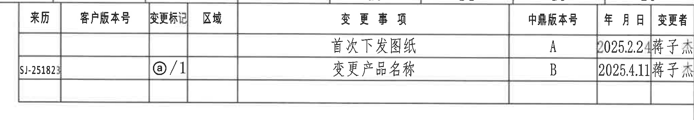

- 原图位置/视图名称：页面右上 A-B 区，变更履历，bbox `[2695, 160, 4755, 520]`
- object_kind：table

### 原表还原

| 来源 | 客户版本号 | 变更标记 | 区域 | 变更事项 | 中鼎版本号 | 年月日 | 变更者 |
|---|---|---|---|---|---|---|---|
|  |  |  |  | 首次下发图纸 | A | 2025.2.24 | 蒋子杰 |
| SJ-251823 |  | @/1 |  | 变更产品名称 | B | 2025.4.11 | 蒋子杰 |

### 提取表格

| 提取项 | 原图数值或文本 | 含义说明 |
|---|---|---|
| 表头 | 来源、客户版本号、变更标记、区域、变更事项、中鼎版本号、年月日、变更者 | 变更履历字段。 |
| 版本A记录 | 首次下发图纸；A；2025.2.24；蒋子杰 | 首次发布记录。 |
| 版本B记录 | SJ-251823；@/1；变更产品名称；B；2025.4.11；蒋子杰 | 与变更标记@/1对应的产品名称变更记录。 |

边界归属说明：裁切左侧包含来源编号SJ-251823，右侧收在表格外框内，不包含页框A/B坐标字母。

## object_5｜主加工视图/正视图

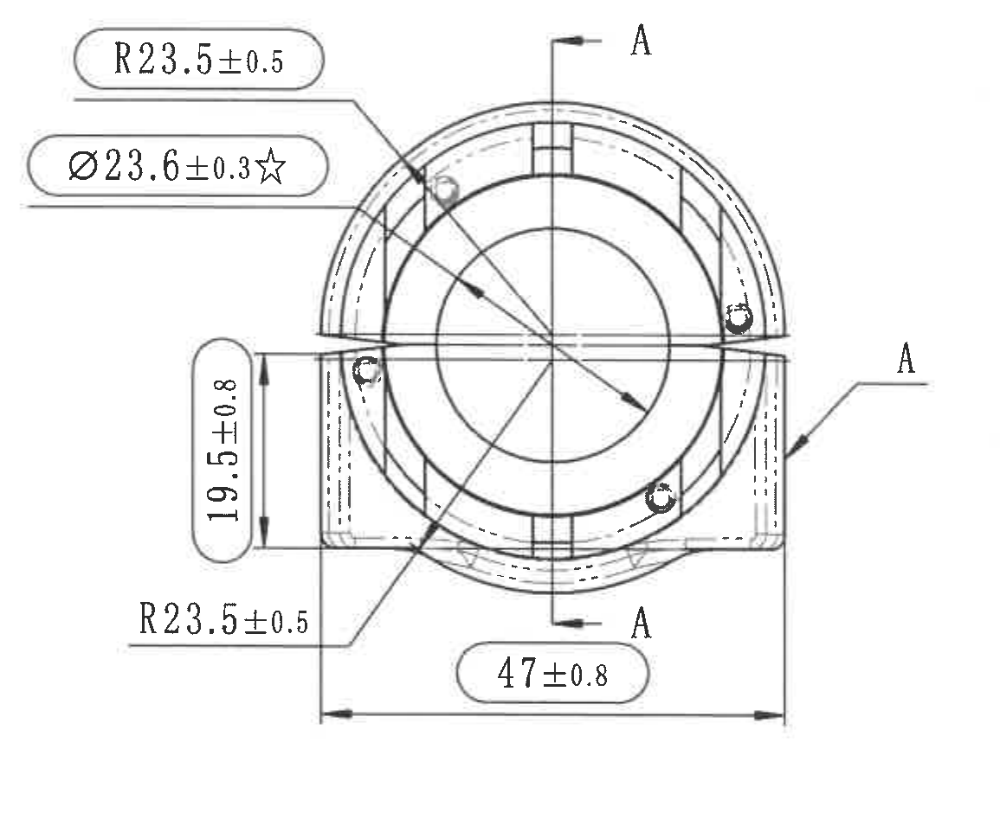

- 原图位置/视图名称：页面中右 D-F 区，主加工视图/正视图，bbox `[2615, 780, 3770, 1720]`
- object_kind：view

| 提取项 | 原图数值或文本 | 含义说明 |
|---|---|---|
| 上部半径 | R23.5±0.5 | 上部圆弧/外轮廓半径，公差±0.5。 |
| 中心孔/内径关键尺寸 | Ø23.6±0.3☆ | 直径尺寸，公差±0.3；星号表示关键特性，见技术要求第9条。 |
| 左侧竖向尺寸 | 19.5±0.8 | 左侧台阶/耳部竖向高度，公差±0.8。 |
| 下部半径 | R23.5±0.5 | 下部圆弧/外轮廓半径，公差±0.5。 |
| 底部总宽/跨距 | 47±0.8 | 底部两端之间的横向尺寸，公差±0.8。 |
| 剖切标识 | A、A | 指向右侧A-A剖视图的剖切位置和方向。 |

边界归属说明：裁切包含主视图全部尺寸文字、引线、箭头和剖切标识。右侧A-A剖视图的两个40±0.8不归入本对象；主视图内的A字母仅作为剖切标识。

## object_6｜A-A剖视图

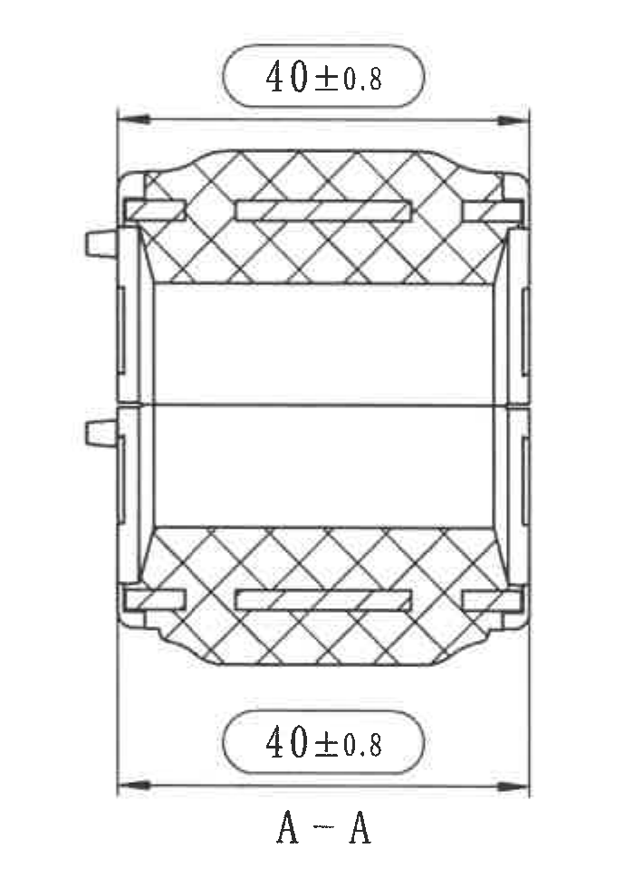

- 原图位置/视图名称：页面右侧 C-F 区，A-A剖视图，bbox `[3920, 735, 4620, 1725]`
- object_kind：section

| 提取项 | 原图数值或文本 | 含义说明 |
|---|---|---|
| 上端横向尺寸 | 40±0.8 | A-A剖视图上方横向宽度/轴向长度，公差±0.8。 |
| 下端横向尺寸 | 40±0.8 | A-A剖视图下方横向宽度/轴向长度，公差±0.8。 |
| 剖视图名 | A-A | 与主视图剖切标识A对应。 |
| 剖面线 | 交叉剖面线 | 表示被剖切材料区域。 |

边界归属说明：裁切完整包含上下两条40±0.8尺寸线、箭头和A-A标题；未包含主视图的R23.5、Ø23.6、47、19.5等尺寸。

## object_7｜技术要求

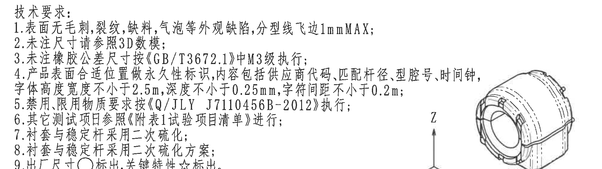

- 原图位置/视图名称：页面中下 G-H 区，技术要求，bbox `[2705, 1750, 4730, 2320]`
- object_kind：notes

| 提取项 | 原图数值或文本 | 含义说明 |
|---|---|---|
| 标题 | 技术要求: | 技术说明块。 |
| 1 | 表面无毛刺，裂纹，缺料，气泡等外观缺陷，分型线飞边1mmMAX; | 外观缺陷和飞边最大值要求。 |
| 2 | 未注尺寸请参照3D数模; | 未注尺寸来源为3D数模。 |
| 3 | 未注橡胶公差尺寸按《GB/T3672.1》中M3级执行; | 未注橡胶公差按GB/T3672.1 M3级。 |
| 4 | 产品表面合适位置做永久性标识，内容包括供应商代码，匹配杆径，型腔号，时间钟，字体高度宽度不小于2.5m，深度不小于0.25mm，字符间距不小于0.2m; | 永久标识内容和标识字符尺寸/深度/间距要求，按原图单位抄录。 |
| 5 | 禁用,限用物质要求按《Q/JLY J7110456B-2012》执行; | 禁限用物质标准。 |
| 6 | 其它测试项目参照《附表1试验项目清单》进行; | 测试项目引用要求。 |
| 7 | 衬套与稳定杆采用二次硫化; | 衬套与稳定杆工艺要求。 |
| 8 | 衬套与稳定杆采用二次硫化方案; | 二次硫化方案要求。 |
| 9 | 出厂尺寸○标出，关键特性☆标出。 | ○表示出厂尺寸；☆表示关键特性。 |

边界归属说明：裁切覆盖第1-9条完整文字。因第4条右侧文字接近产品定向图区域，裁切右侧可能可见邻近区域线条；这些线条不作为技术要求内容提取。

## object_8｜图1 产品定向

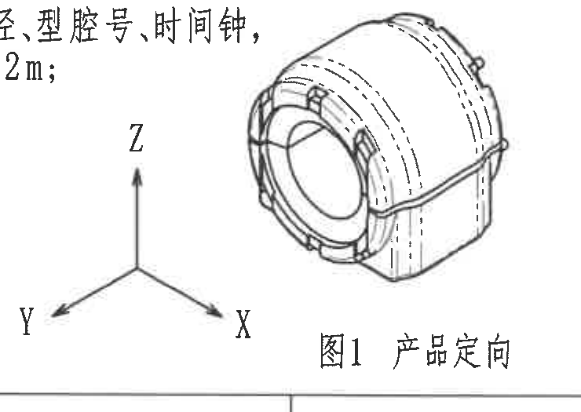

- 原图位置/视图名称：页面右下 H-I 区，图1 产品定向，bbox `[3990, 1970, 4730, 2495]`
- object_kind：detail

| 提取项 | 原图数值或文本 | 含义说明 |
|---|---|---|
| 图名 | 图1 产品定向 | 产品坐标/装配方向示意。 |
| Z轴 | Z | Z方向向上。 |
| X轴 | X | X方向向右下。 |
| Y轴 | Y | Y方向向左下。 |
| 产品示意 | 三维外观线图 | 表示产品在XYZ坐标中的方向。 |

边界归属说明：为保证产品顶部轮廓、XYZ坐标轴和“图1 产品定向”完整，裁切左上保留了少量技术要求文字残留，底部邻近明细表边线也可见；这些残留不归入本对象，不提取为产品定向内容。

## object_9｜明细表/BOM

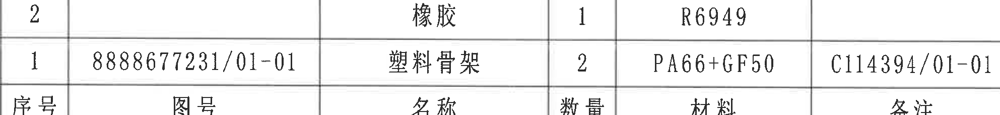

- 原图位置/视图名称：页面右下 I-J 区，明细表/BOM，bbox `[2750, 2485, 4735, 2715]`
- object_kind：table

### 原表还原（按图面自上而下）

| 序号列 | 图号列 | 名称列 | 数量列 | 材料列 | 备注列 |
|---|---|---|---|---|---|
| 2 |  | 橡胶 | 1 | R6949 |  |
| 1 | 8888677231/01-01 | 塑料骨架 | 2 | PA66+GF50 | C114394/01-01 |
| 序号 | 图号 | 名称 | 数量 | 材料 | 备注 |

### 提取表格

| 提取项 | 原图数值或文本 | 含义说明 |
|---|---|---|
| 列头 | 序号、图号、名称、数量、材料、备注 | 明细表字段，原图列头位于表格下行。 |
| 零件2 | 序号2；名称橡胶；数量1；材料R6949 | 橡胶件物料。 |
| 零件1 | 序号1；图号8888677231/01-01；名称塑料骨架；数量2；材料PA66+GF50；备注C114394/01-01 | 塑料骨架物料。 |

边界归属说明：裁切包含明细表两条物料行和底部列头。下方标题栏字段已排除，右侧页框J字母未作为表格内容提取。

## object_10｜标题栏

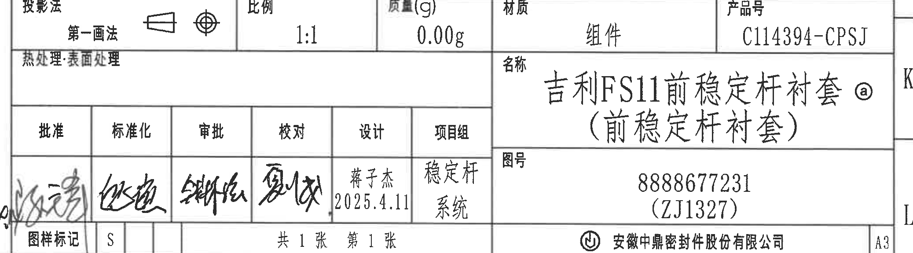

- 原图位置/视图名称：页面右下 J-L 区，标题栏，bbox `[2725, 2760, 4800, 3335]`
- object_kind：title_block

### 标题栏字段还原

| 字段 | 原图文本 |
|---|---|
| 投影法 | 第一画法 |
| 比例 | 1:1 |
| 质量(g) | 0.00g |
| 材质 | 组件 |
| 产品号 | C114394-CPSJ |
| 热处理·表面处理 | 空白 |
| 名称 | 吉利FS11前稳定杆衬套 @（前稳定杆衬套） |
| 图号 | 8888677231（ZJ1327） |
| 批准 | 手写签名 |
| 标准化 | 手写签名 |
| 审批 | 手写签名 |
| 校对 | 手写签名 |
| 设计 | 蒋子杰 2025.4.11 |
| 项目组 | 稳定杆系统 |
| 图样标记 | S |
| 页数 | 共1张 第1张 |
| 公司 | 安徽中鼎密封件股份有限公司 |
| 图幅 | A3 |

### 提取表格

| 提取项 | 原图数值或文本 | 含义说明 |
|---|---|---|
| 图纸名称 | 吉利FS11前稳定杆衬套 @（前稳定杆衬套） | 产品/零件名称。 |
| 图号 | 8888677231（ZJ1327） | 图纸编号及括号内编号。 |
| 产品号 | C114394-CPSJ | 产品号。 |
| 比例 | 1:1 | 图纸比例。 |
| 质量 | 0.00g | 标题栏质量字段。 |
| 材质 | 组件 | 标题栏材质字段。 |
| 投影法 | 第一画法 | 投影方法。 |
| 设计 | 蒋子杰 2025.4.11 | 设计人员和日期。 |
| 项目组 | 稳定杆系统 | 项目组信息。 |
| 图样标记 | S | 图样标记字段。 |
| 页数 | 共1张 第1张 | 总张数和当前张。 |
| 公司 | 安徽中鼎密封件股份有限公司 | 出图/公司信息。 |
| 图幅 | A3 | 图纸幅面。 |

边界归属说明：裁切包含标题栏主要字段和签署栏。标题栏贴近右侧页框，若可见K/L字母属于页框坐标，不作为标题栏字段提取。

## 裁切检查记录

| 对象 | bbox | 检查结果 | 边界归属/重裁记录 |
|---|---:|---|---|
| page_1 | [0, 0, 4959, 3505] | 整页PNG完整。 | PDF按300DPI渲染为横向整页PNG。 |
| object_1 | [380, 485, 1645, 965] | 完整包含附表1标题、表线、列头和两行内容。 | 未混入图2或附表2。 |
| object_2 | [1770, 300, 2280, 1020] | 完整包含图框、F箭头、试验示意和图题。 | 无尺寸值；不提取相邻附表内容。 |
| object_3 | [375, 960, 2595, 3380] | 完整包含附表2全表、底部粘接试验行和表格底线。 | 初查末行后确认底线完整；页框分区数字不提取。 |
| object_4 | [2695, 160, 4755, 520] | 完整包含变更履历表头和两条记录。 | 初裁左侧来源编号不全、右侧带页框字母，已重裁。 |
| object_5 | [2615, 780, 3770, 1720] | 完整包含主视图所有尺寸线、箭头和文字。 | A-A剖视图尺寸未混入；A字母仅作为剖切标识。 |
| object_6 | [3920, 735, 4620, 1725] | 完整包含A-A剖视图、上下40±0.8尺寸和标题。 | 未带入主视图尺寸。 |
| object_7 | [2705, 1750, 4730, 2320] | 完整包含技术要求1-9条文字。 | 为保留第4条右端，裁切与产品定向图邻近；相邻线条不归属技术要求。 |
| object_8 | [3990, 1970, 4730, 2495] | 完整包含产品定向图主体、XYZ坐标和图题。 | 因视图与NOTES/BOM贴近，保留少量相邻残留；不提取残留文字/表线。 |
| object_9 | [2750, 2485, 4735, 2715] | 完整包含明细表两条物料行和列头。 | 初裁带入标题栏/页框J，已重裁并剔除。 |
| object_10 | [2725, 2760, 4800, 3335] | 完整包含标题栏主要字段、签署栏、公司栏和A3图幅。 | 右侧页框K/L可能邻近可见，不作为标题栏字段。 |
