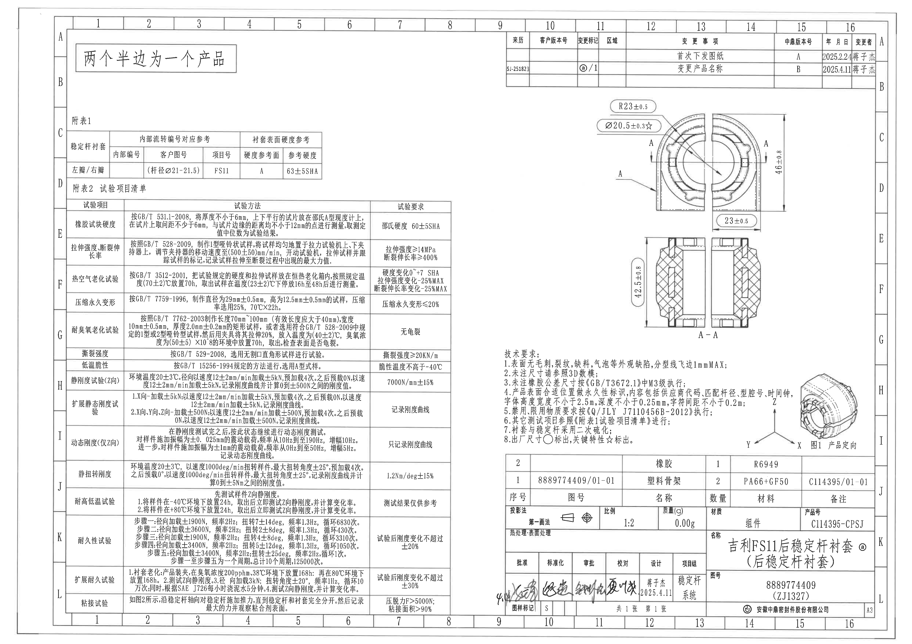
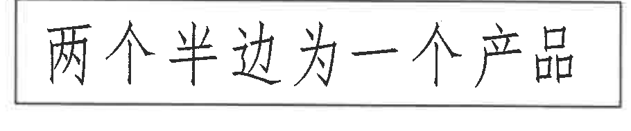
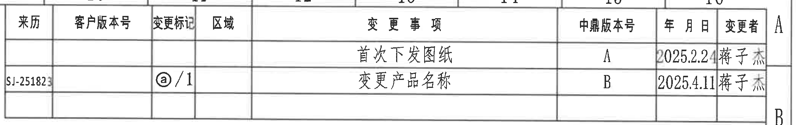
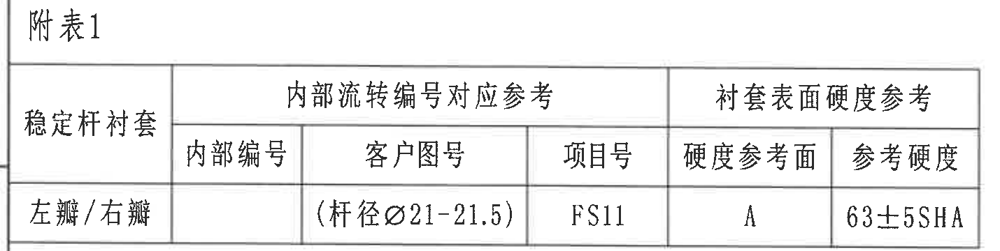
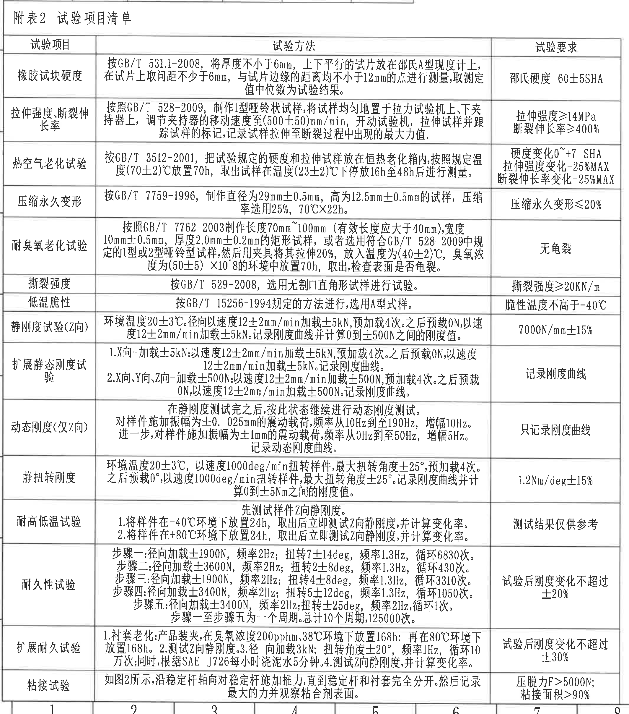
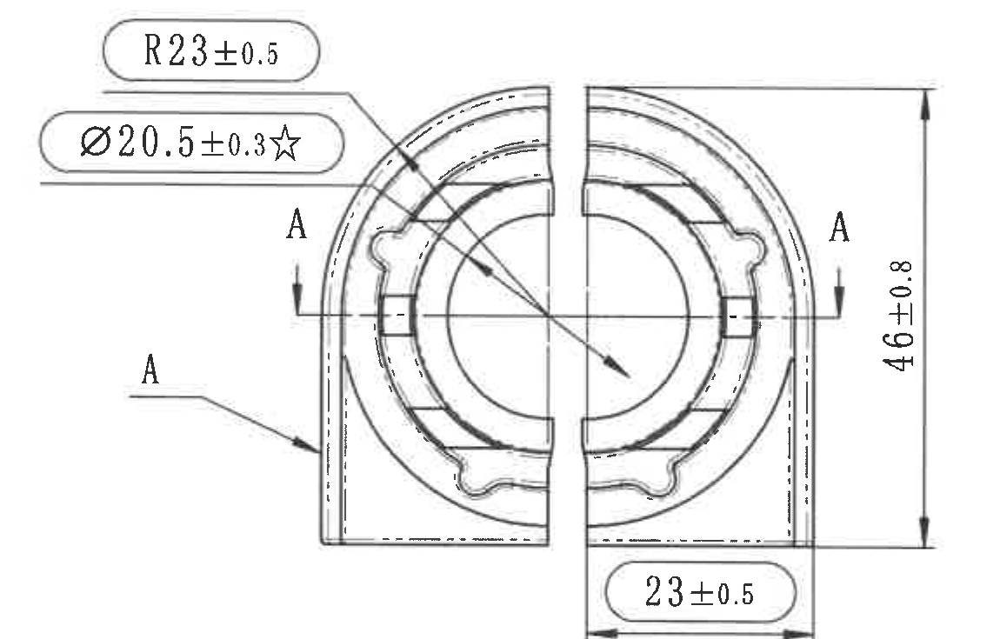
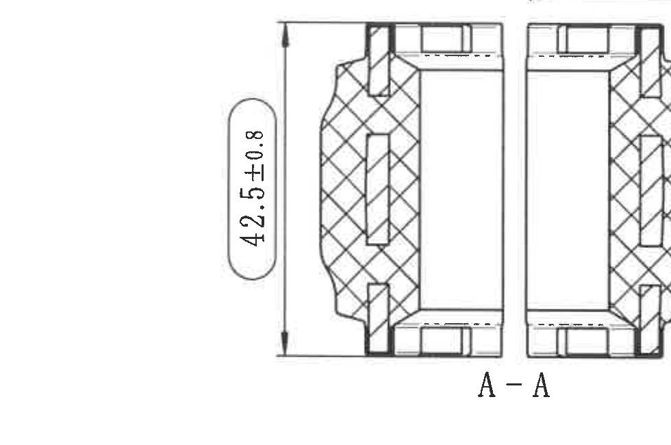
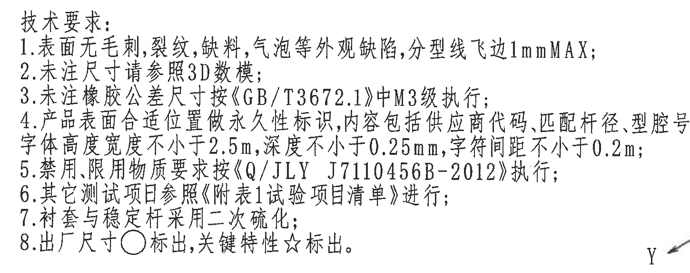
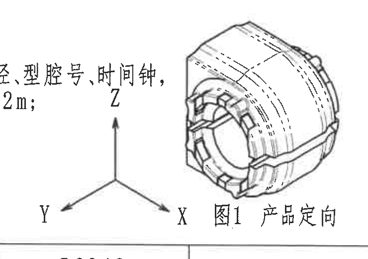
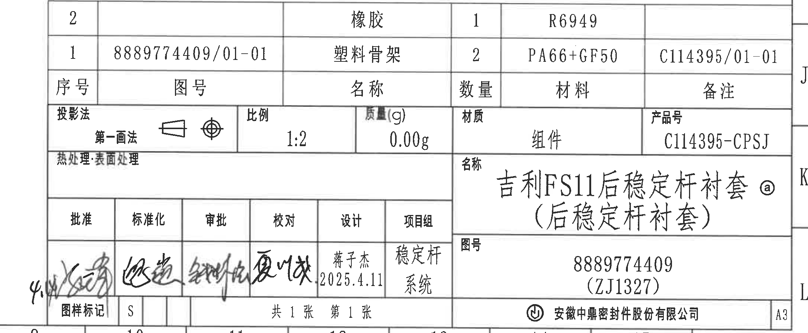

# 20C114395.pdf 内容识别

整页渲染图：

## object_1 - NOTES：左上 boxed note

原图位置/视图名称：第 1 页左上区域，网格 A-B / 1-4 附近，独立框注。

| 提取项 | 原图数值或文本 | 含义说明 |
|---|---|---|
| 框注文字 | 两个半边为一个产品 | 说明该零件由两个半边组合为一个产品，右侧端面视图中的中间分界线与此说明对应。 |

边界归属说明：裁切框完整包含矩形边框和全部文字，周围未带入表格、尺寸线或其他视图内容。

## object_2 - table：右上修订履历表

原图位置/视图名称：第 1 页右上区域，网格 A-B / 10-16 附近，修订履历表。

| 来历 | 客户版本号 | 变更标记 | 区域 | 变更事项 | 中鼎版本号 | 年月日 | 变更者 |
|---|---|---|---|---|---|---|---|
|  |  |  |  | 首次下发图纸 | A | 2025.2.24 | 蒋子杰 |
| SJ-251823 |  | ⓐ/1 |  | 变更产品名称 | B | 2025.4.11 | 蒋子杰 |
|  |  |  |  |  |  |  |  |

| 提取项 | 原图数值或文本 | 含义说明 |
|---|---|---|
| 表头 | 来历、客户版本号、变更标记、区域、变更事项、中鼎版本号、年月日、变更者 | 修订履历字段。 |
| 版本 A | 首次下发图纸；中鼎版本号 A；2025.2.24；蒋子杰 | 首次发图记录。 |
| 版本 B | 来历 SJ-251823；变更标记 ⓐ/1；变更产品名称；中鼎版本号 B；2025.4.11；蒋子杰 | 产品名称变更记录，与标题栏名称中的 ⓐ 标记关联。 |

边界归属说明：裁切从表格左边框到右边框、从表头到空白末行，完整包含行列线和文字；下方端面加工视图未纳入本对象。

## object_3 - table：附表1

原图位置/视图名称：第 1 页左侧上部，网格 C-D / 1-5 附近，附表 1。

附表 1 原表还原：

| 稳定杆衬套 | 内部编号 | 客户图号 | 项目号 | 硬度参考面 | 参考硬度 |
|---|---|---|---|---|---|
| 左瓣/右瓣 |  | (杆径Ø21-21.5) | FS11 | A | 63±5SHA |

| 提取项 | 原图数值或文本 | 含义说明 |
|---|---|---|
| 分组表头 | 内部流转编号对应参考 | 覆盖内部编号、客户图号、项目号三列。 |
| 分组表头 | 衬套表面硬度参考 | 覆盖硬度参考面、参考硬度两列。 |
| 产品侧别 | 左瓣/右瓣 | 适用于两个半边。 |
| 客户图号字段 | (杆径Ø21-21.5) | 括号内参考尺寸，表示匹配稳定杆杆径参考范围 Ø21 至 21.5，位于附表 1 客户图号栏。 |
| 项目号 | FS11 | 项目编号。 |
| 硬度参考面 | A | 表面硬度测量参考面。 |
| 参考硬度 | 63±5SHA | 衬套表面参考硬度。 |

边界归属说明：裁切完整包含“附表1”标题、表头、合并表头和一行数据；下方“附表2 试验项目清单”标题未纳入本对象。

## object_4 - table：附表2 试验项目清单

原图位置/视图名称：第 1 页左侧主体区域，网格 D-L / 1-8 附近，附表 2 试验项目清单。

附表 2 原表还原：

| 试验项目 | 试验方法 | 试验要求 |
|---|---|---|
| 橡胶试块硬度 | 按GB/T 531.1-2008，将厚度不小于6mm，上下平行的试片放在邵氏A型硬度计上，在试片上取间距不小于6mm，与试片边缘的距离均不小于12mm的点进行测量，取测定值中位数为试验结果。 | 邵氏硬度 60±5SHA |
| 拉伸强度、断裂伸长率 | 按照GB/T 528-2009，制作1型哑铃状试样，将试样均匀地置于拉力试验机上、下夹持器上，调节夹持器的移动速度至(500±50)mm/min，开动试验机，拉伸试样并跟踪试样的标记，记录试样拉伸至断裂过程中出现的最大力值。 | 拉伸强度≥14MPa 断裂伸长率≥400% |
| 热空气老化试验 | 按GB/T 3512-2001，把试验规定的硬度和拉伸试样放在恒热老化箱内，按照规定温度(70±2)℃放置70h，取出试样在温度(23±2)℃下停放16h至48h后进行测量。 | 硬度变化0~+7 SHA 拉伸强度变化-25%MAX 断裂伸长率变化-25%MAX |
| 压缩永久变形 | 按GB/T 7759-1996，制作直径为29mm±0.5mm，高为12.5mm±0.5mm的试样，压缩率选用25%，70℃X22h。 | 压缩永久变形≤20% |
| 耐臭氧老化试验 | 按照GB/T 7762-2003制作长度70mm~100mm（有效长度应大于40mm），宽度10mm±0.5mm，厚度2.0mm±0.2mm的矩形试样，或者选用符合GB/T 528-2009中规定的1型或2型哑铃型试样，然后用夹具将其拉伸20%，放入温度为(40±2)℃，臭氧浓度为(50±5)×10^8的环境中放置70h，取出，检查表面是否龟裂。 | 无龟裂 |
| 撕裂强度 | 按GB/T 529-2008，选用无割口直角形试样进行试验。 | 撕裂强度≥20KN/m |
| 低温脆性 | 按GB/T 15256-1994规定的方法进行，选用A型式样。 | 脆性温度不高于-40℃ |
| 静刚度试验(Z向) | 环境温度20±3℃。径向以速度12±2mm/min加载±5kN，预加载4次。之后预载0N，以速度12±2mm/min加载±5kN。记录刚度曲线并计算0到±500N之间的刚度值。 | 7000N/mm±15% |
| 扩展静态刚度试验 | 1.X向-加载±5kN：以速度12±2mm/min加载±5kN，预加载4次。之后预载0N，以速度12±2mm/min加载±5kN。记录刚度曲线。 2.X向、Y向、Z向-加载±500N：以速度12±2mm/min加载±500N，预加载4次。之后预载0N，以速度12±2mm/min加载±500N。记录刚度曲线。 | 记录刚度曲线 |
| 动态刚度(仅Z向) | 在静刚度测试完之后，按此状态继续进行动态刚度测试。对样件施加振幅为±0.025mm的震动载荷，频率从10Hz到至190Hz，增幅10Hz。进一步，对样件施加振幅为±1mm的震动载荷，频率从0Hz到至50Hz，增幅5Hz。记录动态刚度曲线。 | 只记录刚度曲线 |
| 静扭转刚度 | 环境温度20±3℃，以速度1000deg/min扭转样件，最大扭转角度±25°，预加载4次。之后预载0°，以速度1000deg/min扭转样件，最大扭转角度±25°。记录刚度曲线并计算0到±5Nm之间的刚度值。 | 1.2Nm/deg±15% |
| 耐高低温试验 | 先测试样件Z向静刚度。 1.将样件在-40℃环境下放置24h，取出后立即测试Z向静刚度，并计算变化率。 2.将样件在+80℃环境下放置24h，取出后立即测试Z向静刚度，并计算变化率。 | 测试结果仅供参考 |
| 耐久性试验 | 步骤一：径向加载±1900N，频率2Hz；扭转7±14deg，频率1.3Hz，循环6830次。 步骤二：径向加载±3600N，频率2Hz；扭转2±8deg，频率1.3Hz，循环430次。 步骤三：径向加载±1900N，频率2Hz；扭转4±8deg，频率1.3Hz，循环3310次。 步骤四：径向加载±3400N，频率2Hz；扭转5±12deg，频率1.3Hz，循环1050次。 步骤五：径向加载±3400N，频率2Hz；扭转±25deg，频率2Hz，循环1次。 步骤一至步骤五为一个周期。总计10个周期，125000次。 | 试验后刚度变化不超过±20% |
| 扩展耐久试验 | 1.衬套老化：产品装夹，在臭氧浓度200pphm、38℃环境下放置168h；再在80℃环境下放置168h。 2.测试Z向静刚度。 3.径向加载3kN；扭转角度±20°，频率1Hz，循环10万次；同时，根据SAE J726每小时浇泥水5分钟。 4.测试Z向静刚度，并计算变化率。 | 试验后刚度变化不超过±30% |
| 粘接试验 | 如图2所示，沿稳定杆轴向对稳定杆施加推力，直到稳定杆和衬套完全分开。然后记录最大的力并观察粘合剂表面。 | 压脱力F>5000N； 粘接面积>90% |

| 提取项 | 原图数值或文本 | 含义说明 |
|---|---|---|
| 表头 | 试验项目、试验方法、试验要求 | 附表 2 的三列字段。 |
| 参考尺寸/条件 | 6mm、12mm、(500±50)mm/min、(70±2)℃、(23±2)℃、16h至48h、29mm±0.5mm、12.5mm±0.5mm、70mm~100mm、10mm±0.5mm、2.0mm±0.2mm、(40±2)℃、(50±5)×10^8、20±3℃、12±2mm/min、±500N、±0.025mm、±1mm、±25°、0到±5Nm | 表内试验样件、加载、温度、时间、频率、角度、力和刚度计算范围。 |
| 试验要求 | 60±5SHA、≥14MPa、≥400%、0~+7 SHA、-25%MAX、≤20%、≥20KN/m、不高于-40℃、7000N/mm±15%、1.2Nm/deg±15%、±20%、±30%、F>5000N、>90% | 对应各试验的验收或记录要求。 |

边界归属说明：裁切覆盖附表 2 标题、表头和全部数据行，底部保留表线下方少量空白，未纳入右侧加工视图、技术要求或标题栏内容。

## object_5 - view：端面加工视图

原图位置/视图名称：第 1 页右上区域，网格 C-E / 11-15 附近，端面加工视图。

| 提取项 | 原图数值或文本 | 含义说明 |
|---|---|---|
| 半径尺寸 | R23±0.5 | 上方圆弧半径尺寸，箭线指向端面外侧圆弧区域。 |
| 直径关键尺寸 | Ø20.5±0.3☆ | 带直径符号和关键特性星号，箭线指向端面圆形/内圈相关特征；☆ 表示关键特性。 |
| 总高度 | 46±0.8 | 右侧竖向尺寸，尺寸线从上部圆弧顶端高度到下部平直端，表示端面外形总高度。 |
| 横向尺寸 | 23±0.5 | 下方横向尺寸，尺寸线位于右半边底部，表示从中间分界线到右侧外边界的半边宽度。 |
| 剖切标记 | A、A | 左右两处 A 标记和箭头定义 A-A 剖切位置，与 object_6 剖面视图对应。 |
| 局部指示 | A | 左侧引出线指向侧壁特征/剖切相关位置，标识当前端面视图中对应 A 位置。 |

边界归属说明：裁切包含端面视图本体及 R23±0.5、Ø20.5±0.3☆、46±0.8、23±0.5 的完整尺寸线、箭头和文字；下方 A-A 剖面未纳入本对象，剖面尺寸不归属本视图。

## object_6 - section：A-A 剖面视图

原图位置/视图名称：第 1 页右中区域，网格 E-G / 11-14 附近，A-A 剖面。

| 提取项 | 原图数值或文本 | 含义说明 |
|---|---|---|
| 剖面名称 | A-A | 与端面加工视图中的 A-A 剖切标记对应。 |
| 竖向尺寸 | 42.5±0.8 | 左侧竖向尺寸，尺寸线覆盖剖面上下外廓，表示剖面总高度/厚度方向尺寸。 |
| 剖面填充 | 交叉剖面线 | 表示被剖切材料区域。 |
| 中央分界 | 中间竖向断开/间隔 | 表示两个半边组合结构，与 object_1 框注一致。 |

边界归属说明：裁切完整包含 A-A 剖面本体、42.5±0.8 尺寸文字、尺寸线和上下箭头；上方端面视图的 23±0.5 尺寸未纳入本对象。

## object_7 - notes：技术要求

原图位置/视图名称：第 1 页右中偏下区域，网格 H-I / 10-13 附近，技术要求。

| 提取项 | 原图数值或文本 | 含义说明 |
|---|---|---|
| 1 | 表面无毛刺，裂纹，缺料，气泡等外观缺陷，分型线飞边1mmMAX； | 外观缺陷和分型线飞边最大值要求。 |
| 2 | 未注尺寸请参照3D数模； | 未标注尺寸按 3D 数模。 |
| 3 | 未注橡胶公差尺寸按《GB/T3672.1》中M3级执行； | 橡胶未注公差等级为 GB/T3672.1 M3。 |
| 4 | 产品表面合适位置做永久性标识，内容包括供应商代码、匹配杆径、型腔号、时间钟，字体高度宽度不小于2.5mm，深度不小于0.25mm，字符间距不小于0.2mm； | 标识内容、字符高度/宽度、深度和字符间距要求。 |
| 5 | 禁用、限用物质要求按《Q/JLY J7110456B-2012》执行； | 受限物质标准。 |
| 6 | 其它测试项目参照《附表1试验项目清单》进行； | 测试项目引用原图文字。 |
| 7 | 衬套与稳定杆采用二次硫化； | 工艺要求。 |
| 8 | 出厂尺寸○标出，关键特性☆标出。 | 圆圈表示出厂尺寸，星号表示关键特性。 |

边界归属说明：裁切完整包含“技术要求”标题和 1-8 条文字。右下方产品定向图与本 NOTES 相邻，裁切时以完整保留技术要求文字为准；产品定向图内容不在本对象中提取。

## object_8 - detail：图1 产品定向

原图位置/视图名称：第 1 页右下方标题栏上方，网格 H-I / 14-16 附近，图1 产品定向。

| 提取项 | 原图数值或文本 | 含义说明 |
|---|---|---|
| 题注 | 图1 产品定向 | 产品装配/方向识别用局部等轴测视图。 |
| 坐标轴 | X、Y、Z | 表示产品方向坐标。 |
| 等轴测图 | 稳定杆衬套外形 | 显示衬套圆筒状外形、端面结构和外表面轮廓方向。 |

边界归属说明：裁切包含完整坐标轴、等轴测产品图和题注。左侧可见少量技术要求第 4 条末尾文字，这是相邻 NOTES 的边界残留，不作为产品定向图内容提取。

## object_9 - title_block：标题栏、明细栏和签字栏

原图位置/视图名称：第 1 页右下角，网格 J-L / 10-16 附近，标题栏、明细栏和签字栏。

明细栏原表还原：

| 序号 | 图号 | 名称 | 数量 | 材料 | 备注 |
|---|---|---|---|---|---|
| 2 |  | 橡胶 | 1 | R6949 |  |
| 1 | 8889774409/01-01 | 塑料骨架 | 2 | PA66+GF50 | C114395/01-01 |

标题栏字段原表还原：

| 字段 | 原图数值或文本 |
|---|---|
| 投影法 | 第一画法 |
| 比例 | 1:2 |
| 质量(g) | 0.00g |
| 材质 | 组件 |
| 产品号 | C114395-CPSJ |
| 热处理·表面处理 | 空白 |
| 名称 | 吉利FS11后稳定杆衬套 ⓐ（后稳定杆衬套） |
| 图号 | 8889774409（ZJ1327） |
| 图样标记 | S |
| 页码 | 共1张 第1张 |
| 公司 | 安徽中鼎密封件股份有限公司 |
| 图幅 | A3 |

签字栏原表还原：

| 批准 | 标准化 | 审批 | 校对 | 设计 | 项目组 |
|---|---|---|---|---|---|
| 手写签名 | 手写签名 | 手写签名 | 手写签名 | 蒋子杰 2025.4.11 | 稳定杆系统 |

| 提取项 | 原图数值或文本 | 含义说明 |
|---|---|---|
| 产品名称 | 吉利FS11后稳定杆衬套 ⓐ（后稳定杆衬套） | 标题栏主名称，ⓐ 与修订表变更标记关联。 |
| 图号 | 8889774409（ZJ1327） | 产品图号及括号内编号。 |
| 产品号 | C114395-CPSJ | 产品号字段。 |
| 组成明细 | 橡胶 1 件 R6949；塑料骨架 2 件 PA66+GF50 | 组件的材料和数量。 |
| 设计 | 蒋子杰 2025.4.11 | 设计人员和日期。 |

边界归属说明：裁切从明细栏上边框开始，完整包含明细栏、投影/比例/质量/材质/产品号、产品名称、图号、签字栏、页码、公司和 A3 图幅；左侧签名越出表格边框，裁切已向左扩展以保留该越界笔迹。

## 裁切检查记录

| 对象 | 图片路径 | 检查结果 |
|---|---|---|
| page_1 | outputs/20C114395_assets/images/page_1.png | 整页 PNG 已由 PDF 300dpi 渲染，尺寸 4959x3505，包含整张工程图。 |
| object_1 | outputs/20C114395_assets/images/object_1.png | 完整包含框注边框和文字，无边缘文字裁切，无其他对象混入。 |
| object_2 | outputs/20C114395_assets/images/object_2.png | 完整包含修订表表头、两条记录和空白末行；未带入下方端面视图。 |
| object_3 | outputs/20C114395_assets/images/object_3.png | 完整包含附表 1 标题、表头、合并表头和数据行；未带入附表 2。 |
| object_4 | outputs/20C114395_assets/images/object_4.png | 完整包含附表 2 从标题到粘接试验的全部行列，底部表线未被裁掉；未带入右侧视图或标题栏。 |
| object_5 | outputs/20C114395_assets/images/object_5.png | 完整包含端面视图的 R23±0.5、Ø20.5±0.3☆、46±0.8、23±0.5 尺寸线、箭头和文字；已重裁去除下方 A-A 剖面图形。 |
| object_6 | outputs/20C114395_assets/images/object_6.png | 完整包含 A-A 剖面、42.5±0.8 尺寸线、箭头和剖面名称；未带入上方端面视图尺寸。 |
| object_7 | outputs/20C114395_assets/images/object_7.png | 完整包含技术要求 1-8 条。为保留第 4 条长行和第 8 条文字，裁切接近右下方产品定向图；未从该对象提取产品定向图内容。 |
| object_8 | outputs/20C114395_assets/images/object_8.png | 完整包含 X/Y/Z 坐标轴、产品等轴测图和“图1 产品定向”题注；左侧有相邻技术要求残字，已在边界说明中排除归属。 |
| object_9 | outputs/20C114395_assets/images/object_9.png | 完整包含标题栏、明细栏、签字栏、页码、公司和 A3 标记；已向左扩展保留越界签名。 |
