# 20C114396 内容识别

整页渲染图：`outputs/20C114396_assets/images/page_1.png`

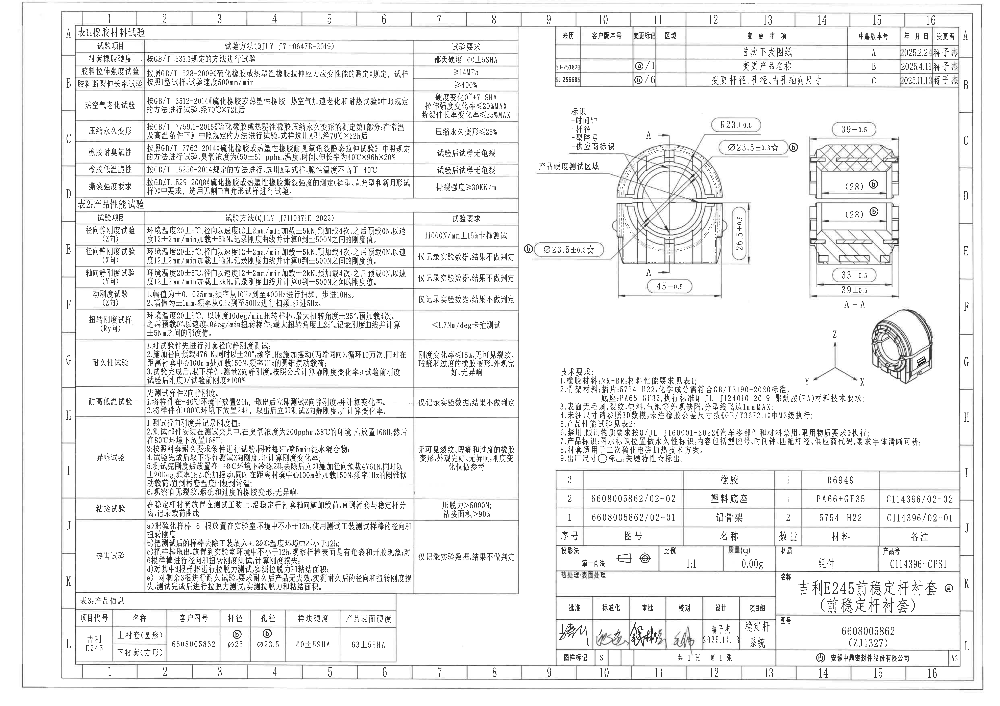

## object_1 表1：橡胶材料试验

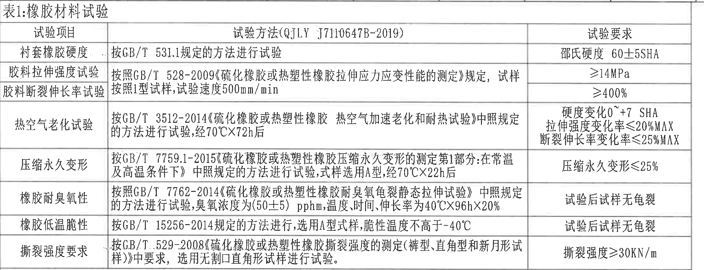

原图位置/视图名称：第1页左上区域，表1：橡胶材料试验。

原表还原：

| 试验项目 | 试验方法(QJLY J7110647B-2019) | 试验要求 |
|---|---|---|
| 衬套橡胶硬度 | 按GB/T 531.1规定的方法进行试验 | 邵氏硬度 60±5SHA |
| 胶料拉伸强度试验 | 按照GB/T 528-2009《硫化橡胶或热塑性橡胶拉伸应力应变性能的测定》规定，试样按照1型试样，试验速度500mm/min | ≥14MPa |
| 胶料断裂伸长率试验 | 按照GB/T 528-2009《硫化橡胶或热塑性橡胶拉伸应力应变性能的测定》规定，试样按照1型试样，试验速度500mm/min | ≥400% |
| 热空气老化试验 | 按GB/T 3512-2014《硫化橡胶或热塑性橡胶 热空气加速老化和耐热试验》中照规定的方法进行试验，经70℃X72h后 | 硬度变化0~+7 SHA；拉伸强度变化率≤20%MAX；断裂伸长率变化率≤25%MAX |
| 压缩永久变形 | 按GB/T 7759.1-2015《硫化橡胶或热塑性橡胶压缩永久变形的测定第1部分：在常温及高温条件下》中照规定的方法进行试验，试样选用A型，经70℃X22h后 | 压缩永久变形≤25% |
| 橡胶耐臭氧性 | 按照GB/T 7762-2014《硫化橡胶或热塑性橡胶耐臭氧龟裂静态拉伸试验》中照规定的方法进行试验，臭氧浓度为(50±5) pphm，温度、时间、伸长率为40℃X96hX20% | 试验后试样无龟裂 |
| 橡胶低温脆性 | 按GB/T 15256-2014规定的方法进行，选用A型试样，脆性温度不高于-40℃ | 试验后试样无龟裂 |
| 撕裂强度要求 | 按GB/T 529-2008《硫化橡胶或热塑性橡胶撕裂强度的测定(裤型、直角型和新月形试样)》中要求，选用无割口直角形试样进行试验。 | 撕裂强度≥30KN/m |

提取表格：

| 提取项 | 原图数值或文本 | 含义说明 |
|---|---|---|
| 材料硬度 | 邵氏硬度 60±5SHA | 衬套橡胶硬度验收范围，单位为Shore A。 |
| 拉伸强度 | ≥14MPa | 胶料拉伸强度下限。 |
| 断裂伸长率 | ≥400% | 胶料断裂伸长率下限。 |
| 老化条件 | 70℃X72h | 热空气老化试验条件。 |
| 老化后硬度变化 | 0~+7 SHA | 热空气老化后的硬度变化允许范围。 |
| 老化后拉伸变化 | ≤20%MAX | 热空气老化后的拉伸强度变化率上限。 |
| 老化后断裂伸长变化 | ≤25%MAX | 热空气老化后的断裂伸长率变化率上限。 |
| 压缩永久变形 | ≤25% | 压缩永久变形上限。 |
| 臭氧条件 | (50±5) pphm；40℃X96hX20% | 臭氧浓度、温度、时间和伸长率条件。 |
| 低温脆性 | 不高于-40℃ | 脆性温度要求。 |
| 撕裂强度 | ≥30KN/m | 撕裂强度下限。 |

边界归属说明：裁切区域仅覆盖表1完整边框、表头和全部8个试验项目；未包含右侧加工视图或下方表2的数据。

## object_2 表2：产品性能试验

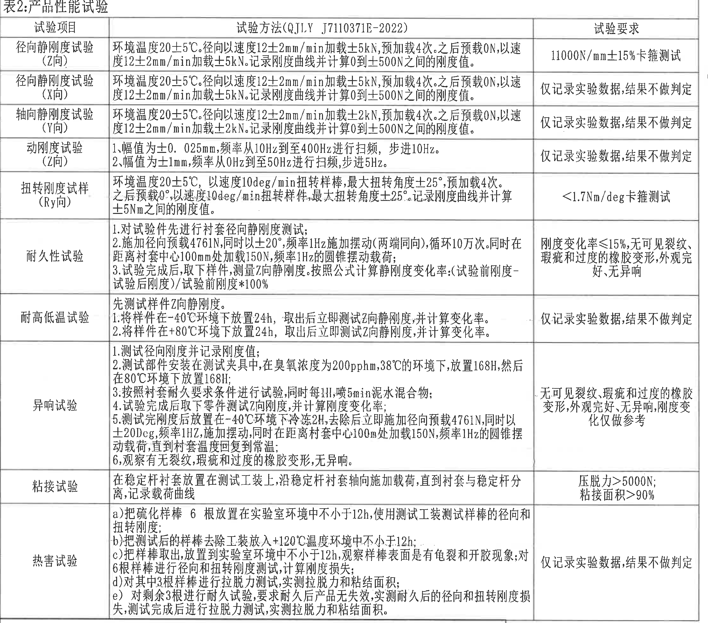

原图位置/视图名称：第1页左中至左下区域，表2：产品性能试验。

原表还原：

| 试验项目 | 试验方法(QJLY J7110371E-2022) | 试验要求 |
|---|---|---|
| 径向静刚度试验(Z向) | 环境温度20±5℃。径向以速度12±2mm/min加载±5kN，预加载4次。之后预载0N，以速度12±2mm/min加载±5kN。记录刚度曲线并计算0到±500N之间的刚度值。 | 11000N/mm±15%卡箍测试 |
| 径向静刚度试验(X向) | 环境温度20±5℃。径向以速度12±2mm/min加载±5kN，预加载4次。之后预载0N，以速度12±2mm/min加载±5kN。记录刚度曲线并计算0到±500N之间的刚度值。 | 仅记录实验数据，结果不做判定 |
| 轴向静刚度试验(Y向) | 环境温度20±5℃。径向以速度12±2mm/min加载±2kN，预加载4次。之后预载0N，以速度12±2mm/min加载±2kN。记录刚度曲线并计算0到±500N之间的刚度值。 | 仅记录实验数据，结果不做判定 |
| 动刚度试验(Z向) | 1、幅值为±0.025mm，频率从10Hz到至400Hz进行扫频，步进10Hz。 2、幅值为±1mm，频率从0Hz到至50Hz进行扫频，步进5Hz。 | 仅记录实验数据，结果不做判定 |
| 扭转刚度试样(Ry向) | 环境温度20±5℃，以速度10deg/min扭转样棒，最大扭转角度±25°，预加载4次。之后预载0°，以速度10deg/min扭转样件，最大扭转角度±25°，记录刚度曲线并计算±5Nm之间的刚度值。 | <1.7Nm/deg卡箍测试 |
| 耐久性试验 | 1、对试验件先进行衬套径向静刚度测试； 2、施加径向预载4761N，同时以±20°，频率1Hz施加摆动(两端同向)，循环10万次。同时在距离衬套中心100mm处加载150N，频率1Hz的圆锥摆动载荷； 3、试验完成后，取下样件，测量Z向静刚度。按照公式计算静刚度变化率：(试验前刚度-试验后刚度)/试验前刚度*100% | 刚度变化率≤15%，无可见裂纹、瑕疵和过度的橡胶变形，外观完好，无异响 |
| 耐高低温试验 | 先测试样件Z向静刚度。 1、将样件在-40℃环境下放置24h，取出后立即测试Z向静刚度，并计算变化率。 2、将样件在+80℃环境下放置24h，取出后立即测试Z向静刚度，并计算变化率。 | 仅记录实验数据，结果不做判定 |
| 异响试验 | 1、测试径向刚度并记录刚度值； 2、测试部件安装在测试夹具中，在臭氧浓度为200pphm、38℃的环境下，放置168H，然后在80℃环境下放置168H； 3、按照衬套耐久要求条件进行试验，同时每1H，喷5min泥水混合物； 4、试验完成后取下零件测试Z向刚度，并计算刚度变化率； 5、测试完刚度后放置在-40℃环境下冷冻2H，去除后立即施加径向预载4761N，同时以±20Deg，频率1Hz，施加摆动，同时在距离衬套中心100mm处加载150N，频率1Hz的圆锥摆动载荷，直到衬套温度回复到常温； 6、观察有无裂纹、瑕疵和过度的橡胶变形，无异响。 | 无可见裂纹、瑕疵和过度的橡胶变形，外观完好，无异响，刚度变化仅做参考 |
| 粘接试验 | 在稳定杆衬套放置在测试工装上，沿稳定杆衬套轴向施加载荷，直到衬套与稳定杆分离，记录载荷曲线 | 压脱力>5000N；粘接面积>90% |
| 热害试验 | a)把硫化样棒6根放置在实验室环境中不小于12h，使用测试工装测试样棒的径向和扭转刚度； b)把测试后的样棒去除工装放入+120℃温度环境中不小于12h； c)把样棒取出，放置到实验室环境中不小于12h，观察样棒表面是否有龟裂和开胶现象，对6根样棒进行径向和扭转刚度测试，计算刚度损失； d)对其中3根样棒进行拉脱力测试，实测拉脱力和粘结面积； e)对剩余3根进行耐久试验，要求耐久后产品无失效，实测耐久后的径向和扭转刚度损失，测试完成后进行拉脱力测试，实测拉脱力和粘结面积。 | 仅记录实验数据，结果不做判定 |

提取表格：

| 提取项 | 原图数值或文本 | 含义说明 |
|---|---|---|
| 径向静刚度Z向目标 | 11000N/mm±15% | Z向径向静刚度卡箍测试验收范围。 |
| X向径向加载 | ±5kN；12±2mm/min；0到±500N | X向径向静刚度记录条件，仅记录不判定。 |
| Y向轴向加载 | ±2kN；12±2mm/min；0到±500N | Y向轴向静刚度记录条件，仅记录不判定。 |
| 动刚度扫频1 | ±0.025mm；10Hz到400Hz；步进10Hz | 小幅值高频段动态刚度扫频条件。 |
| 动刚度扫频2 | ±1mm；0Hz到50Hz；步进5Hz | 大幅值低频段动态刚度扫频条件。 |
| 扭转刚度 | <1.7Nm/deg | Ry向扭转刚度卡箍测试要求。 |
| 扭转角度 | ±25° | 扭转刚度试验最大扭转角度。 |
| 扭转速度 | 10deg/min | 扭转刚度试验速度。 |
| 耐久径向预载 | 4761N | 耐久试验径向预载。 |
| 耐久摆动角度 | ±20° | 耐久试验摆动角度。 |
| 耐久频率 | 1Hz | 耐久摆动频率。 |
| 耐久循环 | 10万次 | 耐久循环次数。 |
| 耐久附加载荷 | 距离衬套中心100mm处加载150N | 圆锥摆动载荷条件。 |
| 耐久刚度变化 | ≤15% | 耐久后刚度变化率上限。 |
| 高低温 | -40℃ 24h；+80℃ 24h | 高低温放置和测试条件。 |
| 异响臭氧条件 | 200pphm；38℃；168H | 异响试验臭氧老化条件。 |
| 异响热环境 | 80℃；168H | 异响试验热环境条件。 |
| 异响喷淋 | 每1H喷5min泥水混合物 | 异响试验混合物喷淋周期。 |
| 异响低温 | -40℃；冷冻2H | 异响试验低温激励前条件。 |
| 粘接压脱力 | >5000N | 粘接试验压脱力下限。 |
| 粘接面积 | >90% | 粘接有效面积下限。 |
| 热害温度 | +120℃；不小于12h | 热害试验温度条件。 |
| 样棒数量 | 6根；其中3根拉脱力，剩余3根耐久 | 热害试验样棒分配。 |

边界归属说明：裁切区域完整包含表2表头、全部试验项目、方法和要求。底部因热害试验行靠近表3，裁切保留了表2底部边线并可能带入下方表3标题边缘；表3内容不归入本对象提取。

## object_3 表3：产品信息

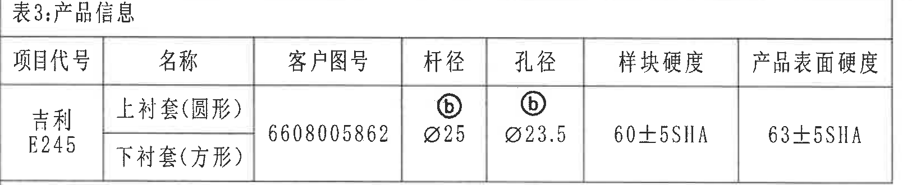

原图位置/视图名称：第1页左下区域，表3：产品信息。

原表还原：

| 项目代号 | 名称 | 客户图号 | 杆径 | 孔径 | 样块硬度 | 产品表面硬度 |
|---|---|---|---|---|---|---|
| 吉利 E245 | 上衬套(圆形) | 6608005862 | ⓑ Ø25 | ⓑ Ø23.5 | 60±5SHA | 63±5SHA |
| 吉利 E245 | 下衬套(方形) | 6608005862 | ⓑ Ø25 | ⓑ Ø23.5 | 60±5SHA | 63±5SHA |

提取表格：

| 提取项 | 原图数值或文本 | 含义说明 |
|---|---|---|
| 项目代号 | 吉利 E245 | 产品项目代号。 |
| 名称 | 上衬套(圆形)；下衬套(方形) | 产品由上下衬套信息组成。 |
| 客户图号 | 6608005862 | 客户图号。 |
| 杆径 | ⓑ Ø25 | 带变更标记b的匹配杆径，直径25。 |
| 孔径 | ⓑ Ø23.5 | 带变更标记b的孔径，直径23.5。 |
| 样块硬度 | 60±5SHA | 样块硬度要求。 |
| 产品表面硬度 | 63±5SHA | 产品表面硬度要求。 |

边界归属说明：裁切区域包含表3完整表头、上下衬套两行和底部边框；不包含下方外框坐标栏内容。

## object_4 修订履历表

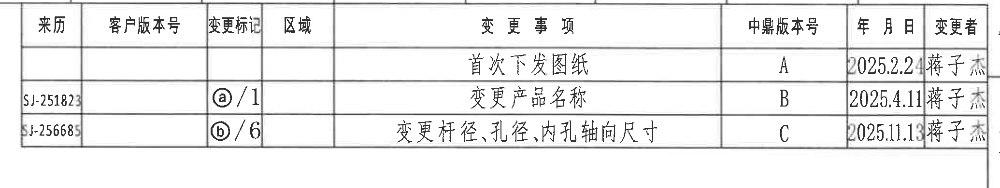

原图位置/视图名称：第1页右上区域，修订履历表。

原表还原：

| 来历 | 客户版本号 | 变更标记 | 区域 | 变更事项 | 中鼎版本号 | 年月日 | 变更者 |
|---|---|---|---|---|---|---|---|
|  |  |  |  | 首次下发图纸 | A | 2025.2.24 | 蒋子杰 |
| SJ-251823 |  | ⓐ/1 |  | 变更产品名称 | B | 2025.4.11 | 蒋子杰 |
| SJ-256685 |  | ⓑ/6 |  | 变更杆径、孔径、内孔轴向尺寸 | C | 2025.11.13 | 蒋子杰 |

提取表格：

| 提取项 | 原图数值或文本 | 含义说明 |
|---|---|---|
| 版本A | 首次下发图纸；2025.2.24；蒋子杰 | 首次发布记录。 |
| 版本B | 变更产品名称；ⓐ/1；SJ-251823；2025.4.11；蒋子杰 | 变更标记a对应1处产品名称变更。 |
| 版本C | 变更杆径、孔径、内孔轴向尺寸；ⓑ/6；SJ-256685；2025.11.13；蒋子杰 | 变更标记b对应6处杆径、孔径、内孔轴向尺寸变更。 |

边界归属说明：裁切区域包含修订履历表完整行列。右侧外框坐标字母A/B靠近边界，非修订表字段，不纳入表格数据。

## object_5 主视图：前稳定杆衬套正向加工视图

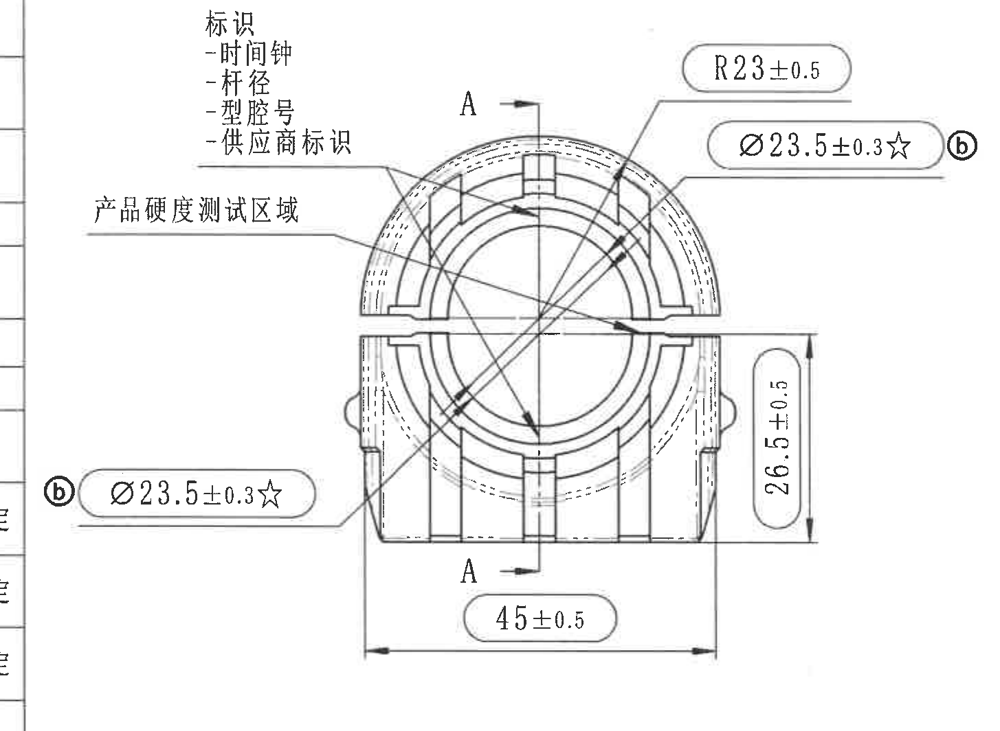

原图位置/视图名称：第1页右中偏左，主视图/正向加工视图，含A-A剖切位置和产品标识说明。

提取表格：

| 提取项 | 原图数值或文本 | 含义说明 |
|---|---|---|
| 半径尺寸 | R23±0.5 | 上方外圆弧半径尺寸，公差±0.5；属于主视图顶部弧面。 |
| 孔径关键尺寸1 | ⓑ Ø23.5±0.3☆ | 右上孔径/内孔相关直径，公差±0.3；☆表示关键特性，ⓑ为修订标记。 |
| 孔径关键尺寸2 | ⓑ Ø23.5±0.3☆ | 左下同值标注，指向主视图内孔/相关直径；同为关键特性和修订标记b。 |
| 总宽/底部宽度 | 45±0.5 | 主视图底部整体宽度，公差±0.5。 |
| 总高度 | 26.5±0.5 | 主视图右侧竖向总高度，公差±0.5。 |
| 剖切标识 | A、A；箭头指向剖切线 | 指示A-A剖面视图的剖切位置和方向；不属于尺寸值。 |
| 标识项目 | 时间钟、杆径、型腔号、供应商标识 | 左上引出线说明产品永久性标识内容。 |
| 产品硬度测试区域 | 产品硬度测试区域 | 左侧引出线指定硬度测试区域。 |
| 圆弧/弧向信息 | R23±0.5及外圆弧轮廓 | 原图未给出独立弧长或弧向尺寸，弧面通过半径R23±0.5定义。 |
| T编号 | 未见独立T编号 | 本视图中未识别到单独T编号标注。 |

边界归属说明：裁切区域扩大到完整包含左下和右上两个ⓑ Ø23.5±0.3☆标注、R23±0.5、45±0.5、26.5±0.5及A-A剖切箭头。左侧靠边处可能出现表格边缘残线，不属于主视图尺寸；右侧A-A剖面尺寸未纳入本对象。

## object_6 A-A剖面视图

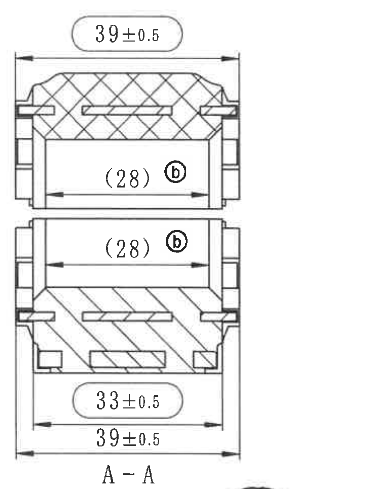

原图位置/视图名称：第1页右中，A-A剖面视图。

提取表格：

| 提取项 | 原图数值或文本 | 含义说明 |
|---|---|---|
| 剖面名称 | A-A | 由主视图A-A剖切线生成的剖面视图。 |
| 外宽尺寸1 | 39±0.5 | 剖面顶部外宽，公差±0.5。 |
| 参考内宽1 | ⓑ (28) | 剖面上部内孔轴向参考尺寸；括号表示参考尺寸，ⓑ为修订标记。 |
| 参考内宽2 | ⓑ (28) | 剖面中部内孔轴向参考尺寸；括号表示参考尺寸，ⓑ为修订标记。 |
| 局部宽度 | 33±0.5 | 下部槽/结构宽度，公差±0.5。 |
| 外宽尺寸2 | 39±0.5 | 剖面底部外宽，公差±0.5；与顶部外宽同值。 |
| 剖面填充 | 斜线/交叉剖面线 | 区分不同材料或剖切实体区域。 |
| 直径符号 | 未见Ø尺寸 | 本剖面内未标注直径符号尺寸。 |
| 角度/弧度 | 未见角度、弧长或弧向尺寸 | 剖面视图未给出角度或弧向尺寸。 |
| T编号 | 未见独立T编号 | 本剖面中未识别到T编号。 |

边界归属说明：裁切区域完整包含A-A标签、剖面图、顶部/底部39±0.5、33±0.5及两个(28)参考尺寸。底部为保留A-A标签，可能带入下方轴测图极小顶部片段；该片段不属于A-A剖面，不参与本对象提取。

## object_7 轴测图与坐标方向视图

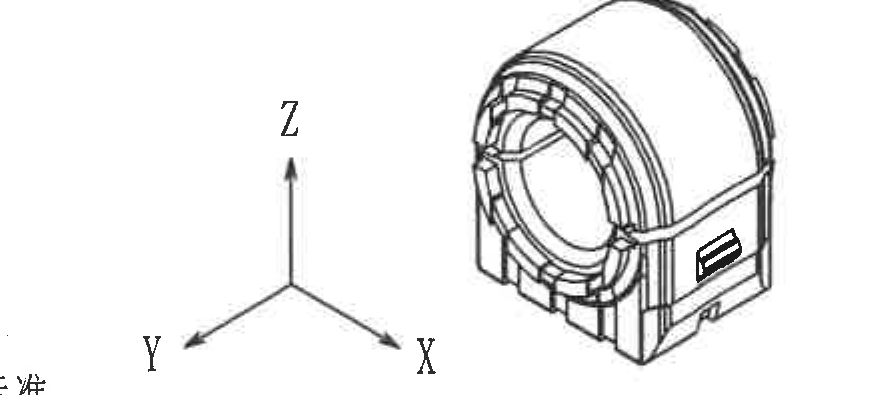

原图位置/视图名称：第1页右下偏上，轴测图及X/Y/Z坐标方向视图。

提取表格：

| 提取项 | 原图数值或文本 | 含义说明 |
|---|---|---|
| 坐标轴 | X、Y、Z | 表示产品三维方向：X向、Y向、Z向。 |
| 轴测图 | 前稳定杆衬套三维外形 | 展示零件整体外观、前端环形结构、底座和侧面矩形标识槽。 |
| 尺寸 | 未标注数值尺寸 | 该轴测/坐标视图未给出尺寸、公差、直径、角度或弧度。 |
| 归属 | 与技术要求相邻 | 坐标和轴测属于视图对象；下方技术要求文字不属于本视图。 |

边界归属说明：裁切区域完整包含轴测图主体和X/Y/Z坐标箭头。左下边缘可能残留技术要求文字片段；该文字归object_8技术要求，不在本对象提取。

## object_8 技术要求 / NOTES

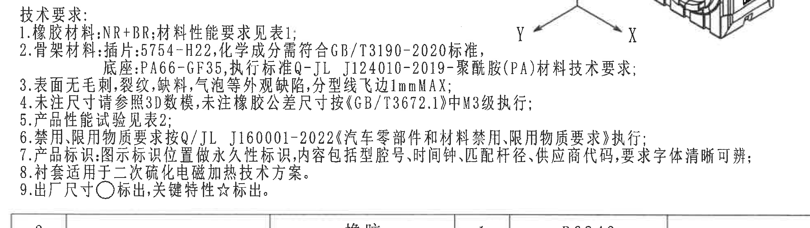

原图位置/视图名称：第1页右中下区域，技术要求。

原文还原：

| 序号 | 原图文本 |
|---|---|
| 1 | 橡胶材料：NR+BR；材料性能要求见表1； |
| 2 | 骨架材料：插片：5754-H22，化学成分需符合GB/T3190-2020标准，底座：PA66-GF35，执行标准Q-JL J124010-2019-聚酰胺(PA)材料技术要求； |
| 3 | 表面无毛刺，裂纹，缺料，气泡等外观缺陷，分型线飞边1mmMAX； |
| 4 | 未注尺寸请参照3D数模，未注橡胶公差尺寸按《GB/T3672.1》中M3级执行； |
| 5 | 产品性能试验见表2； |
| 6 | 禁用、限用物质要求按Q/JL J160001-2022《汽车零部件和材料禁用、限用物质要求》执行； |
| 7 | 产品标识：图示标识位置做永久性标识，内容包括型腔号、时间钟、匹配杆径、供应商代码，要求字体清晰可辨； |
| 8 | 衬套适用于二次硫化电磁加热技术方案。 |
| 9 | 出厂尺寸○标出，关键特性☆标出。 |

提取表格：

| 提取项 | 原图数值或文本 | 含义说明 |
|---|---|---|
| 橡胶材料 | NR+BR | 橡胶材料体系；性能见表1。 |
| 插片材料 | 5754-H22；GB/T3190-2020 | 金属插片材料和化学成分标准。 |
| 底座材料 | PA66-GF35；Q-JL J124010-2019 | 塑料底座材料和执行标准。 |
| 外观要求 | 无毛刺、裂纹、缺料、气泡等；分型线飞边1mmMAX | 外观缺陷和飞边上限。 |
| 未注尺寸 | 参照3D数模 | 未标注尺寸以3D模型为准。 |
| 未注橡胶公差 | GB/T3672.1中M3级 | 未注橡胶尺寸公差等级。 |
| 性能试验 | 见表2 | 产品性能要求归表2。 |
| 禁限用物质 | Q/JL J160001-2022 | 禁限用物质执行标准。 |
| 产品标识内容 | 型腔号、时间钟、匹配杆径、供应商代码 | 永久性标识内容要求。 |
| 适用工艺 | 二次硫化电磁加热技术方案 | 衬套适用工艺方案。 |
| 出厂尺寸符号 | ○ | 出厂尺寸用圆圈符号标出。 |
| 关键特性符号 | ☆ | 关键特性用星号标出。 |

边界归属说明：裁切区域完整包含技术要求1到9条。右上角可能带入轴测图/坐标轴底部片段，归object_7，不作为NOTES文本提取。

## object_9 明细表 / BOM

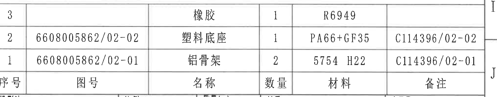

原图位置/视图名称：第1页右下中部，明细表/BOM。

原表还原：

| 序号 | 图号 | 名称 | 数量 | 材料 | 备注 |
|---|---|---|---|---|---|
| 3 |  | 橡胶 | 1 | R6949 |  |
| 2 | 6608005862/02-02 | 塑料底座 | 1 | PA66+GF35 | C114396/02-02 |
| 1 | 6608005862/02-01 | 铝骨架 | 2 | 5754 H22 | C114396/02-01 |

提取表格：

| 提取项 | 原图数值或文本 | 含义说明 |
|---|---|---|
| 橡胶 | 序号3；数量1；材料R6949 | 橡胶件材料和数量。 |
| 塑料底座 | 序号2；图号6608005862/02-02；数量1；材料PA66+GF35；备注C114396/02-02 | 塑料底座物料信息。 |
| 铝骨架 | 序号1；图号6608005862/02-01；数量2；材料5754 H22；备注C114396/02-01 | 铝骨架物料信息。 |

边界归属说明：裁切区域包含明细表三行物料和表头。下方标题栏字段不归入本对象。

## object_10 标题栏

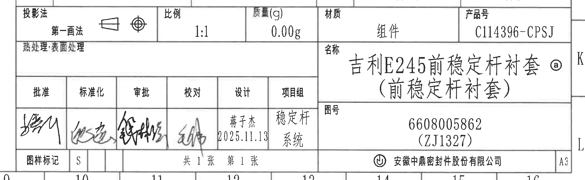

原图位置/视图名称：第1页右下角，标题栏。

原表/字段还原：

| 字段 | 原图数值或文本 |
|---|---|
| 投影法 | 第一画法；原图含第一角投影符号 |
| 比例 | 1:1 |
| 质量(g) | 0.00g |
| 材质 | 组件 |
| 产品号 | C114396-CPSJ |
| 热处理/表面处理 | 原图栏位为空 |
| 名称 | 吉利E245前稳定杆衬套（前稳定杆衬套）ⓐ |
| 图号 | 6608005862（ZJ1327） |
| 批准 | 签名 |
| 标准化 | 签名 |
| 审批 | 签名 |
| 校对 | 签名 |
| 设计 | 蒋子杰 2025.11.13 |
| 项目组 | 稳定杆系统 |
| 图样标记 | S |
| 页数 | 共1张 第1张 |
| 公司 | 安徽中鼎密封件股份有限公司 |
| 图幅 | A3 |

提取表格：

| 提取项 | 原图数值或文本 | 含义说明 |
|---|---|---|
| 产品名称 | 吉利E245前稳定杆衬套（前稳定杆衬套）ⓐ | 图纸标题名称；ⓐ对应修订履历中产品名称变更。 |
| 图号 | 6608005862（ZJ1327） | 产品图号及括号内编号。 |
| 产品号 | C114396-CPSJ | 标题栏产品号。 |
| 比例 | 1:1 | 绘图比例。 |
| 质量 | 0.00g | 标题栏质量栏读数。 |
| 材质 | 组件 | 标题栏材质栏。 |
| 设计 | 蒋子杰 2025.11.13 | 设计责任人与日期。 |
| 项目组 | 稳定杆系统 | 项目组名称。 |
| 图样标记 | S | 图样标记字段。 |
| 页数 | 共1张 第1张 | 图纸页数信息。 |
| 图幅 | A3 | 图纸幅面。 |

边界归属说明：裁切区域覆盖标题栏主体、签核栏、名称栏、图号栏、公司栏和图幅栏。上方明细表不属于本标题栏对象；左侧边缘若有相邻栏线，仅用于保持标题栏完整边框。

## 裁切检查记录

| 对象 | 检查结果 |
|---|---|
| object_1 表1 | 完整包含表1标题、表头、全部行列和文字；未发现边缘文字被裁掉。 |
| object_2 表2 | 完整包含表2标题、表头、全部试验项目、方法和要求；为保留热害试验底部文字，底部接近表3标题，表3不参与本对象提取。 |
| object_3 表3 | 完整包含表3标题、表头、上下衬套行、硬度和直径字段；无尺寸/文字截断。 |
| object_4 修订履历表 | 完整包含REV相关表头字段和三条修订记录；右侧外框坐标字母不属于表格字段。 |
| object_5 主视图 | 完整包含R23±0.5、两处ⓑ Ø23.5±0.3☆、45±0.5、26.5±0.5、A-A剖切箭头和标识说明；左侧边缘残线不属于主视图。 |
| object_6 A-A剖面 | 完整包含39±0.5、(28)、33±0.5、底部39±0.5和A-A标签；底部有极小轴测图顶部片段，不参与剖面尺寸提取。 |
| object_7 轴测/坐标视图 | 完整包含轴测图主体和X/Y/Z坐标方向；左下少量技术要求文字边缘不参与本对象提取。 |
| object_8 技术要求 | 完整包含技术要求1到9条；右上轴测/坐标残片不参与NOTES文本提取。 |
| object_9 明细表 | 完整包含三行BOM、表头和备注字段；无物料字段截断。 |
| object_10 标题栏 | 完整包含投影法、比例、质量、材质、产品号、名称、图号、签核、公司和A3图幅；无标题栏文字截断。 |
