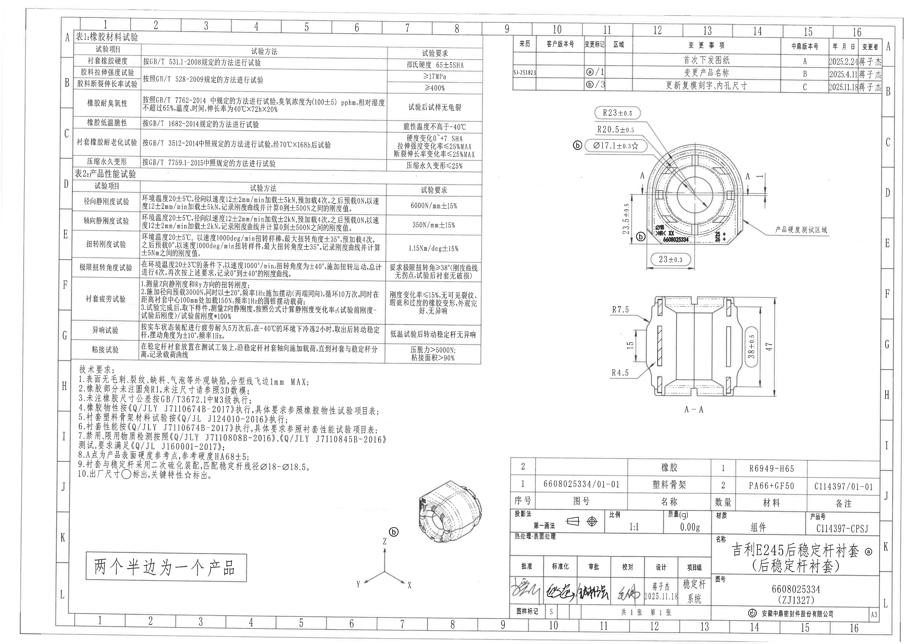
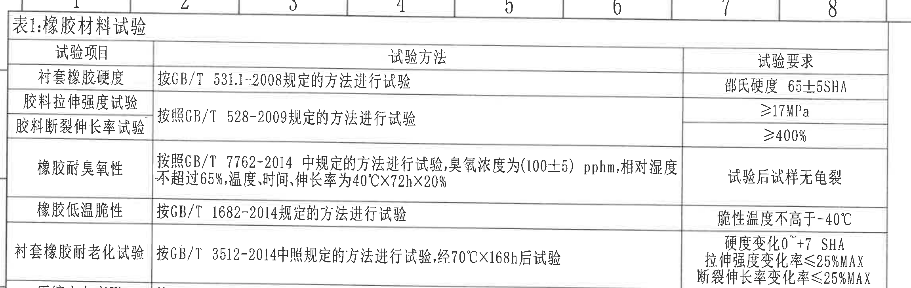
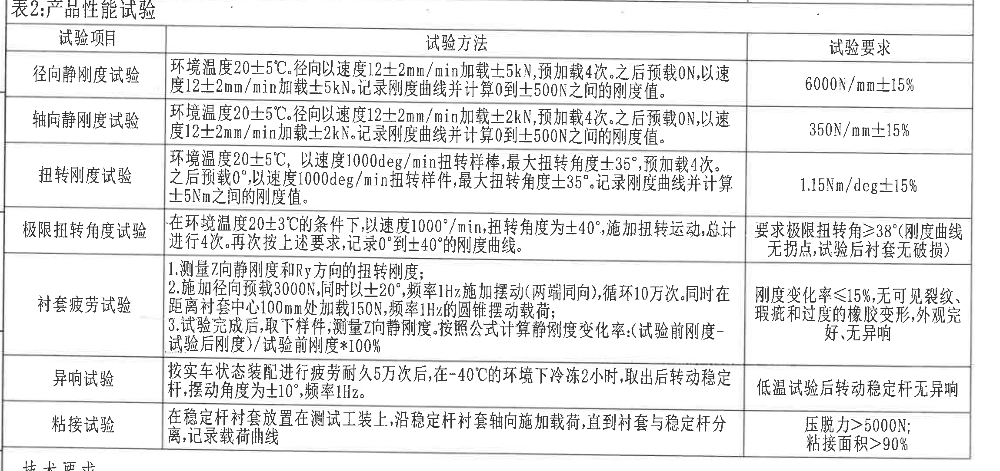
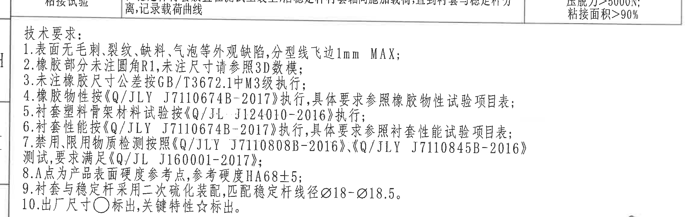
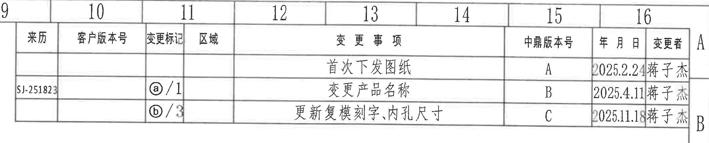
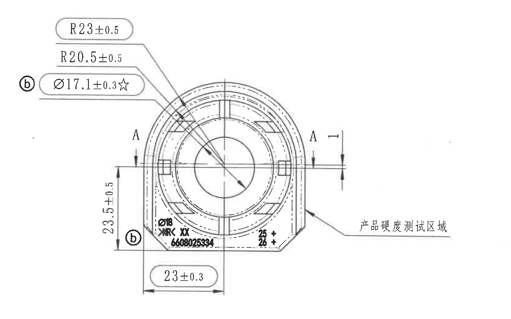
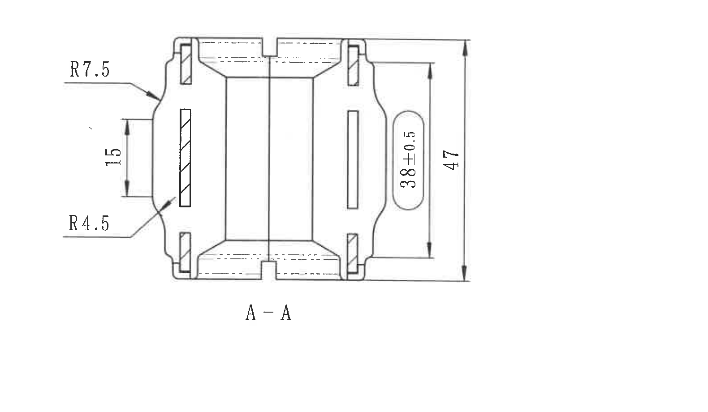
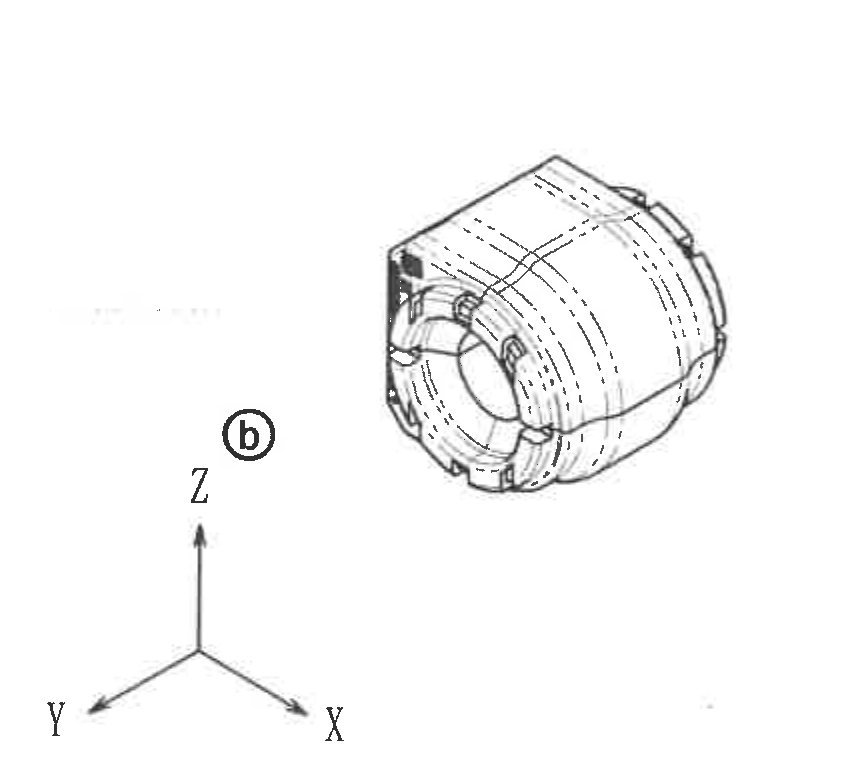
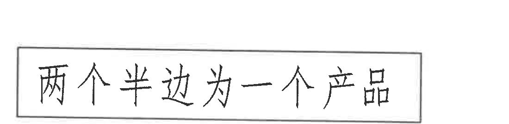
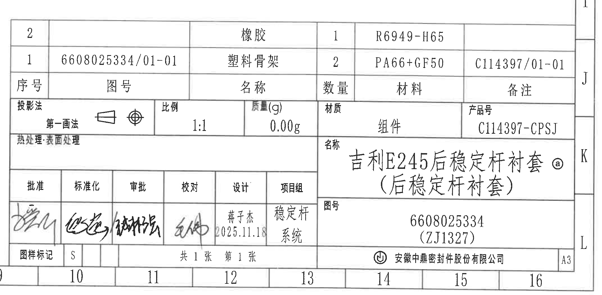

# 20C114397 图纸内容识别

整页 PNG：

页面信息：page 1，整页图像尺寸 4959 x 3505 px。

## object_1 表1：橡胶材料试验

原图位置/视图名称：左上区域，表1：橡胶材料试验，bbox [380, 135, 2680, 865]。

### 原表还原

| 试验项目 | 试验方法 | 试验要求 |
|---|---|---|
| 衬套橡胶硬度 | 按GB/T 531.1-2008规定的方法进行试验 | 邵氏硬度 65±5SHA |
| 胶料拉伸强度试验 | 按照GB/T 528-2009规定的方法进行试验 | ≥17MPa |
| 胶料断裂伸长率试验 | 按照GB/T 528-2009规定的方法进行试验 | ≥400% |
| 橡胶耐臭氧性 | 按照GB/T 7762-2014中规定的方法进行试验，臭氧浓度为(100±5) pphm，相对湿度不超过65%，温度、时间、伸长率为40℃X72hX20% | 试验后试样无龟裂 |
| 橡胶低温脆性 | 按GB/T 1682-2014规定的方法进行试验 | 脆性温度不高于-40℃ |
| 衬套橡胶耐老化试验 | 按GB/T 3512-2014中规定的方法进行试验，经70℃X168h后试验 | 硬度变化0~+7 SHA；拉伸强度变化率≤25%MAX；断裂伸长率变化率≤25%MAX |
| 压缩永久变形 | 按GB/T 7759.1-2015中规定的方法进行试验 | 压缩永久变形≤25% |

### 提取表格

| 提取项 | 原图数值或文本 | 含义说明 |
|---|---|---|
| 表名 | 表1:橡胶材料试验 | 材料级试验项目汇总表。 |
| 橡胶硬度 | 邵氏硬度 65±5SHA | 衬套橡胶硬度验收范围。 |
| 拉伸强度 | ≥17MPa | 胶料拉伸强度下限。 |
| 断裂伸长率 | ≥400% | 胶料伸长能力下限。 |
| 臭氧浓度参考条件 | (100±5) pphm | 臭氧耐受试验环境条件，括号内为控制范围。 |
| 湿度、温度、时间、伸长率 | 相对湿度不超过65%；40℃X72hX20% | 臭氧耐受试验的环境和试样伸长率条件。 |
| 低温脆性 | 脆性温度不高于-40℃ | 低温脆性温度要求。 |
| 老化后条件 | 70℃X168h | 老化试验的温度和持续时间。 |
| 老化后硬度变化 | 0~+7 SHA | 老化后硬度允许变化范围。 |
| 老化后拉伸强度变化率 | ≤25%MAX | 老化后拉伸强度变化上限。 |
| 老化后断裂伸长率变化率 | ≤25%MAX | 老化后断裂伸长率变化上限。 |
| 压缩永久变形 | ≤25% | 压缩永久变形上限。 |

边界归属说明：该裁切只提取表1内容；下方表2标题未纳入本对象。表1内没有加工视图尺寸线，数值均为试验条件或验收要求。

## object_2 表2：产品性能试验

原图位置/视图名称：左中区域，表2：产品性能试验，bbox [380, 925, 2680, 2010]。

### 原表还原

| 试验项目 | 试验方法 | 试验要求 |
|---|---|---|
| 径向静刚度试验 | 环境温度20±5℃。径向以速度12±2mm/min加载±5kN，预加载4次。之后预载0N，以速度12±2mm/min加载±5kN。记录刚度曲线并计算0到±500N之间的刚度值。 | 6000N/mm±15% |
| 轴向静刚度试验 | 环境温度20±5℃。径向以速度12±2mm/min加载±2kN，预加载4次。之后预载0N，以速度12±2mm/min加载±2kN。记录刚度曲线并计算0到±500N之间的刚度值。 | 350N/mm±15% |
| 扭转刚度试验 | 环境温度20±5℃，以速度1000deg/min扭转样棒，最大扭转角度±35°，预加载4次。之后预载0°，以速度1000deg/min扭转样件，最大扭转角度±35°。记录刚度曲线并计算±5Nm之间的刚度值。 | 1.15Nm/deg±15% |
| 极限扭转角度试验 | 在环境温度20±3℃的条件下，以速度1000°/min，扭转角度为±40°，施加扭转运动，总计进行4次。再次按上述要求，记录0°到±40°的刚度曲线。 | 要求极限扭转角≥38°（刚度曲线无拐点，试验后衬套无破损） |
| 衬套疲劳试验 | 1.测量Z向静刚度和Ry方向的扭转刚度；2.施加径向预载3000N，同时以±20°，频率1Hz施加摆动（两端同向），循环10万次。同时在距离衬套中心100mm处加载150N，频率1Hz的圆锥摆动载荷；3.试验完成后，取下样件，测量Z向静刚度。按照公式计算静刚度变化率：（试验前刚度-试验后刚度）/试验前刚度*100% | 刚度变化率≤15%，无可见裂纹、瑕疵和过度的橡胶变形，外观完好，无异响 |
| 异响试验 | 按实车状态装配进行疲劳耐久5万次后，在-40℃的环境下冷冻2小时，取出后转动稳定杆，摆动角度为±10°，频率1Hz。 | 低温试验后转动稳定杆无异响 |
| 粘接试验 | 在稳定杆衬套放置在测试工装上，沿稳定杆衬套轴向施加载荷，直到衬套与稳定杆分离，记录载荷曲线 | 压脱力>5000N；粘接面积>90% |

### 提取表格

| 提取项 | 原图数值或文本 | 含义说明 |
|---|---|---|
| 表名 | 表2:产品性能试验 | 产品级性能试验项目汇总表。 |
| 径向静刚度要求 | 6000N/mm±15% | 径向刚度目标及公差。 |
| 轴向静刚度要求 | 350N/mm±15% | 轴向刚度目标及公差。 |
| 扭转刚度要求 | 1.15Nm/deg±15% | 扭转刚度目标及公差。 |
| 极限扭转角 | ≥38° | 极限扭转角度下限。括号内内容说明判定条件：刚度曲线无拐点，试验后衬套无破损。 |
| 疲劳摆动 | ±20°，1Hz，循环10万次 | 衬套疲劳试验摆动角、频率和循环次数。 |
| 疲劳加载距离和载荷 | 距离衬套中心100mm处加载150N，频率1Hz | 疲劳试验圆锥摆动载荷条件。 |
| 静刚度变化率公式 | （试验前刚度-试验后刚度）/试验前刚度*100% | 疲劳后刚度变化率计算方式。 |
| 静刚度变化率要求 | ≤15% | 疲劳后刚度变化上限。 |
| 异响低温条件 | -40℃冷冻2小时 | 异响试验低温处理条件。 |
| 异响摆动 | ±10°，1Hz | 转动稳定杆时的摆动角度和频率。 |
| 粘接压脱力 | >5000N | 粘接试验的分离载荷下限。 |
| 粘接面积 | >90% | 粘接面积下限。 |

边界归属说明：该裁切完整包含表2所有行列；表2下方技术要求不归入本对象。表2内为性能试验条件和要求，不含加工视图尺寸线。

## object_3 NOTES：技术要求

原图位置/视图名称：左下区域，技术要求/NOTES，bbox [350, 1900, 2650, 2620]。

### 提取表格

| 提取项 | 原图数值或文本 | 含义说明 |
|---|---|---|
| 标题 | 技术要求: | 图纸通用技术要求。 |
| 1 | 表面无毛刺、裂纹、缺料、气泡等外观缺陷，分型线飞边1mm MAX； | 外观缺陷和分型线飞边最大值要求。 |
| 2 | 橡胶部分未注圆角R1，未注尺寸请参照3D数模； | 未标注橡胶圆角按R1处理，未注尺寸参考3D数模。 |
| 3 | 未注橡胶尺寸公差按GB/T3672.1中M3级执行； | 未注橡胶尺寸公差等级。 |
| 4 | 橡胶物性按《Q/JLY J7110674B-2017》执行，具体要求参照橡胶物性试验项目表； | 橡胶物性标准和参照表。 |
| 5 | 衬套塑料骨架材料试验按《Q/JL J124010-2016》执行； | 塑料骨架材料试验标准。 |
| 6 | 衬套性能按《Q/JLY J7110674B-2017》执行，具体要求参照衬套性能试验项目表； | 衬套性能标准和参照表。 |
| 7 | 禁用、限用物质检测按照《Q/JLY J7110808B-2016》、《Q/JLY J7110845B-2016》测试，要求满足《Q/JL J160001-2017》； | 禁限用物质检测标准。 |
| 8 | A点为产品表面硬度参考点，参考硬度HA68±5； | A点为硬度参考点，HA68±5为参考硬度。 |
| 9 | 衬套与稳定杆采用二次硫化装配，匹配稳定杆线径Ø18-Ø18.5。 | 装配工艺和匹配稳定杆线径范围。 |
| 10 | 出厂尺寸○标出，关键特性☆标出。 | 圆圈标示出厂尺寸，星号标示关键特性。 |

边界归属说明：裁切上沿保留了表2底部少量残影用于防止第1行文字被裁，但本对象只提取“技术要求”1至10条。该区域不提取表2内容。

## object_4 修订履历表

原图位置/视图名称：右上区域，修订履历/变更事项表，bbox [2740, 125, 4850, 555]。

### 原表还原

| 来历 | 客户版本号 | 变更标记 | 区域 | 变更事项 | 中鼎版本号 | 年 月 日 | 变更者 |
|---|---|---|---|---|---|---|---|
|  |  |  |  | 首次下发图纸 | A | 2025.2.24 | 蒋子杰 |
| SJ-251823 |  | ⓐ/1 |  | 变更产品名称 | B | 2025.4.11 | 蒋子杰 |
|  |  | ⓑ/3 |  | 更新复模刻字、内孔尺寸 | C | 2025.11.18 | 蒋子杰 |

### 提取表格

| 提取项 | 原图数值或文本 | 含义说明 |
|---|---|---|
| 中鼎版本号 A | 首次下发图纸；2025.2.24；蒋子杰 | 初始发布记录。 |
| 中鼎版本号 B | 变更产品名称；变更标记ⓐ/1；2025.4.11；蒋子杰 | 产品名称变更记录，与图中ⓐ标记关联。 |
| 中鼎版本号 C | 更新复模刻字、内孔尺寸；变更标记ⓑ/3；2025.11.18；蒋子杰 | 复模刻字和内孔尺寸变更记录，与图中ⓑ标记关联。 |
| 来历 | SJ-251823 | 修订来源号，位于版本B记录行。 |

边界归属说明：该裁切为右上角修订表。下方主视图尺寸框仅在表格下边缘附近，不提取到本对象；主视图尺寸归入object_5。

## object_5 主视图：圆形加工视图

原图位置/视图名称：右中上区域，圆形主视图/加工视图，bbox [3050, 520, 4700, 1550]。

### 提取表格

| 提取项 | 原图数值或文本 | 含义说明 |
|---|---|---|
| 视图名称 | 圆形主视图 | 表示衬套端面方向的主要加工视图。 |
| 半径尺寸 | R23±0.5 | 外侧圆弧半径尺寸，带±0.5公差。 |
| 半径尺寸 | R20.5±0.5 | 内侧/相邻圆弧半径尺寸，带±0.5公差。 |
| 内孔直径关键尺寸 | Ø17.1±0.3☆ | 内孔直径尺寸，带±0.3公差；星号表示关键特性。 |
| 左侧高度尺寸 | 23.5±0.5 | 左侧竖向尺寸，带±0.5公差。 |
| 底部宽度尺寸 | 23±0.3 | 底部横向尺寸，带±0.3公差。 |
| 右侧局部尺寸 | 1 | 右侧A-A剖切线附近的局部间距/厚度尺寸。 |
| 剖切标识 | A / A | 指示A-A剖面位置，剖面结果见object_6。 |
| 变更标记 | ⓑ | 图中左侧和底部均有ⓑ气泡，关联修订履历“ⓑ/3”。 |
| 产品刻字 | Ø18 / NRK XX / 6608025334 / 25+ / 26+ | 主视图底部区域的刻字或模腔/识别标记。 |
| 硬度测试区 | 产品硬度测试区域 | 引出线指向右下端面区域；硬度参考规则见技术要求第8条。 |

边界归属说明：该裁切只提取圆形端面主视图及其引出线、尺寸框和文字。下方A-A剖面没有纳入；其尺寸R7.5、R4.5、15、38±0.5、47归入object_6。上方修订表内容不归入本对象。

## object_6 剖面视图：A-A

原图位置/视图名称：右中下区域，A-A剖面视图，bbox [3170, 1530, 4750, 2450]。

### 提取表格

| 提取项 | 原图数值或文本 | 含义说明 |
|---|---|---|
| 视图名称 | A-A | 由object_5中的A-A剖切线得到的剖面视图。 |
| 左上圆角/弧度 | R7.5 | 剖面左侧上部外形圆角半径。 |
| 左下圆角/弧度 | R4.5 | 剖面左侧下部外形圆角半径。 |
| 左侧竖向尺寸 | 15 | 左侧局部高度/槽段尺寸。 |
| 内部高度尺寸 | 38±0.5 | 剖面内侧竖向尺寸，带±0.5公差。 |
| 总高度 | 47 | 剖面总高度。 |

边界归属说明：该裁切为A-A剖面，尺寸线完整。主视图中的R23、R20.5、Ø17.1、23.5、23和右侧1不归入本剖面对象。

## object_7 局部三维示意

原图位置/视图名称：底部中偏左，局部三维示意/3D参考视图，bbox [1890, 2460, 2750, 3220]。

### 提取表格

| 提取项 | 原图数值或文本 | 含义说明 |
|---|---|---|
| 视图名称 | 局部三维示意 | 用于显示零件外形和开槽/端部结构的三维参考图。 |
| 变更标记 | ⓑ | 与修订履历“ⓑ/3 更新复模刻字、内孔尺寸”关联。 |
| 坐标轴 | X、Y、Z | 三维方向标识。 |
| 尺寸 | 未标注具体尺寸 | 该局部视图中未出现尺寸线或公差文字。 |

边界归属说明：该裁切已排除右侧标题栏，仅保留三维示意、ⓑ标记和XYZ坐标轴。无尺寸线被裁切。

## object_8 装配数量说明框

原图位置/视图名称：左下靠底部，装配数量说明框，bbox [430, 2900, 1530, 3170]。

### 提取表格

| 提取项 | 原图数值或文本 | 含义说明 |
|---|---|---|
| 说明文字 | 两个半边为一个产品 | 表示该产品由两个半边组成一个完整产品。 |

边界归属说明：该裁切只包含独立说明框，不提取周边空白或其他视图内容。

## object_9 标题栏/明细表

原图位置/视图名称：右下区域，标题栏、明细表和签署栏，bbox [2735, 2420, 4875, 3470]。

### 原表还原：明细表

| 序号 | 图号 | 名称 | 数量 | 材料 | 备注 |
|---|---|---|---|---|---|
| 2 |  | 橡胶 | 1 | R6949-H65 |  |
| 1 | 6608025334/01-01 | 塑料骨架 | 2 | PA66+GF50 | C114397/01-01 |

### 原表还原：标题栏字段

| 字段 | 原图文本 |
|---|---|
| 投影法 | 第一画法 |
| 比例 | 1:1 |
| 质量(g) | 0.00g |
| 材质 | 组件 |
| 产品号 | C114397-CPSJ |
| 热处理·表面处理 | 空白 |
| 名称 | 吉利E245后稳定杆衬套ⓐ（后稳定杆衬套） |
| 图号 | 6608025334（ZJ1327） |
| 批准 | 签名 |
| 标准化 | 签名 |
| 审批 | 签名 |
| 校对 | 签名 |
| 设计 | 蒋子杰 2025.11.18 |
| 项目组 | 稳定杆系统 |
| 图样标记 | S |
| 张数 | 共1张 第1张 |
| 公司 | 安徽中鼎密封件股份有限公司 |
| 图幅 | A3 |

### 提取表格

| 提取项 | 原图数值或文本 | 含义说明 |
|---|---|---|
| 明细表行2 | 橡胶；数量1；材料R6949-H65 | 橡胶件明细。 |
| 明细表行1 | 图号6608025334/01-01；塑料骨架；数量2；材料PA66+GF50；备注C114397/01-01 | 塑料骨架明细。 |
| 名称 | 吉利E245后稳定杆衬套ⓐ（后稳定杆衬套） | 零件名称；ⓐ与修订履历“变更产品名称”关联。 |
| 图号 | 6608025334（ZJ1327） | 主图号和括号内代号。 |
| 产品号 | C114397-CPSJ | 产品编号。 |
| 材质 | 组件 | 标题栏材质/类型字段。 |
| 比例 | 1:1 | 图纸比例。 |
| 质量 | 0.00g | 标题栏质量字段。 |
| 设计日期 | 2025.11.18 | 标题栏设计日期。 |

边界归属说明：该裁切为右下标题栏与明细表，完整包含底部公司名和A3图幅。左侧三维示意不归入本对象。

## 裁切检查记录

| 对象 | 检查结果 |
|---|---|
| page_1 | 整页PNG完整，4959 x 3505 px。 |
| object_1 | 表1表头、行列、数值和要求完整；未混入表2标题。 |
| object_2 | 表2表头、全部7行、右侧试验要求完整；底部“粘接面积>90%”完整。 |
| object_3 | 技术要求1至10条完整；上沿少量表2残影未提取为本对象内容。 |
| object_4 | 修订表列名和三行记录完整；下方主视图尺寸未提取到本对象。 |
| object_5 | 主视图所有尺寸线、箭头、引出线、R/Ø/公差/星号/ⓑ标记完整；未带入A-A剖面。 |
| object_6 | A-A剖面完整，R7.5、R4.5、15、38±0.5、47和A-A文字完整。 |
| object_7 | 局部三维示意、ⓑ和XYZ轴完整；已重裁排除标题栏片段。 |
| object_8 | “两个半边为一个产品”说明框完整。 |
| object_9 | 标题栏、明细表、签署栏、公司名和A3图幅完整；未提取左侧三维示意。 |
