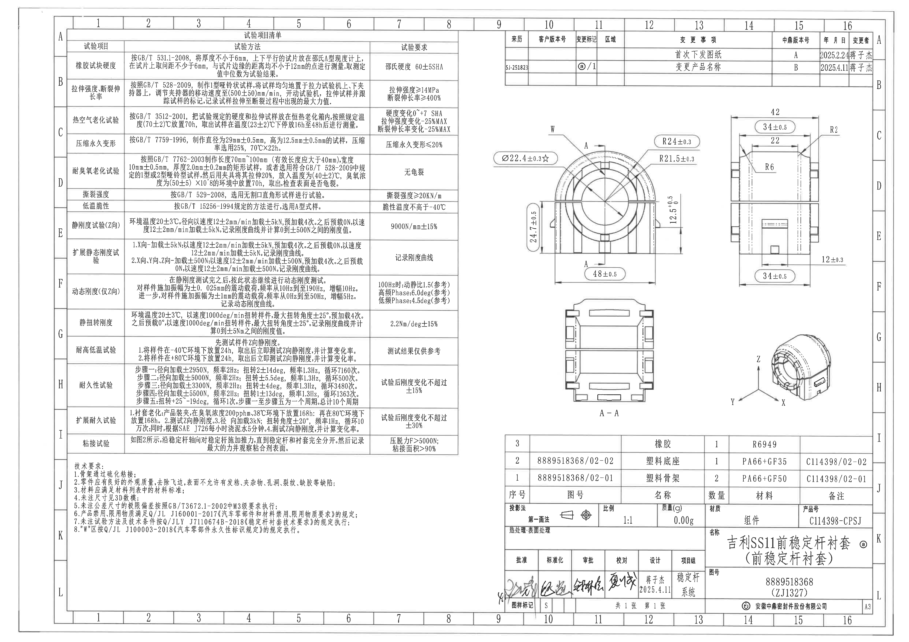
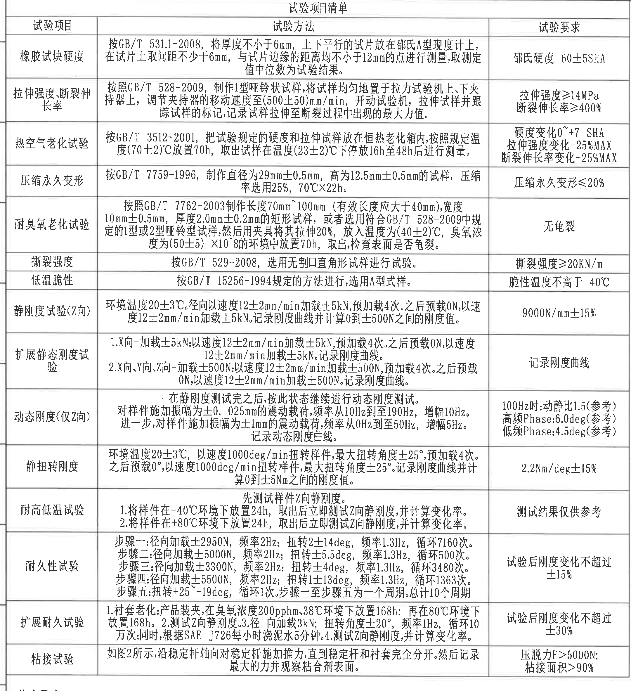
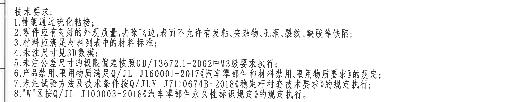
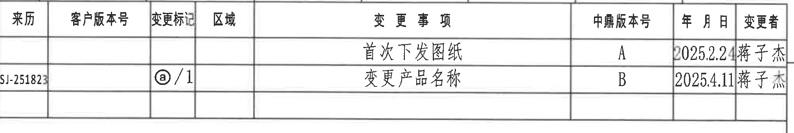
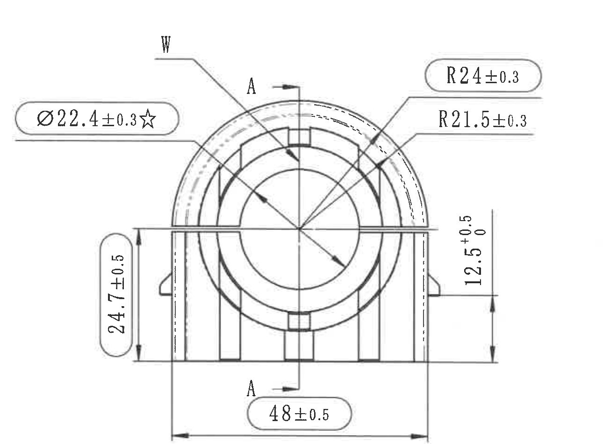
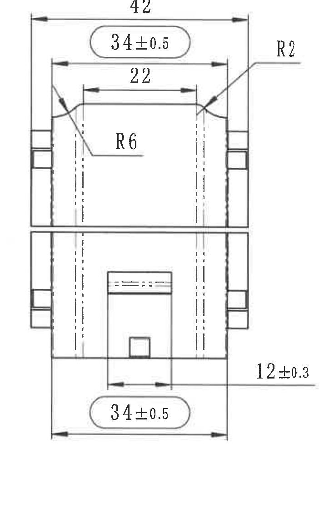
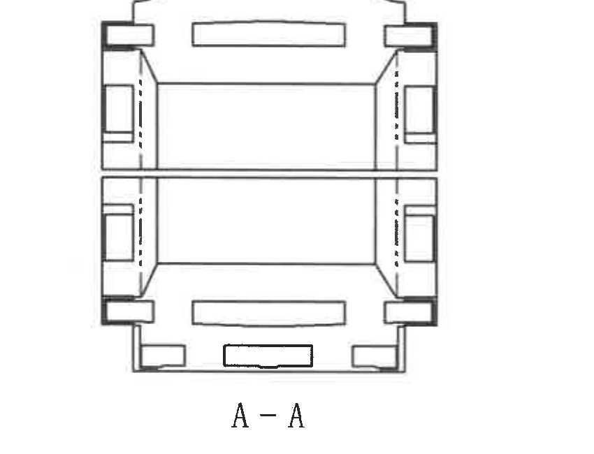
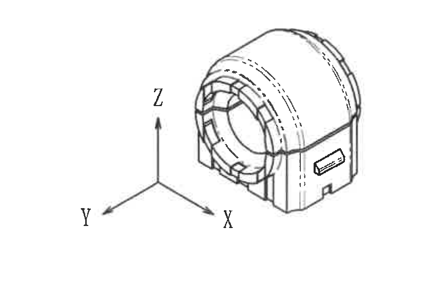
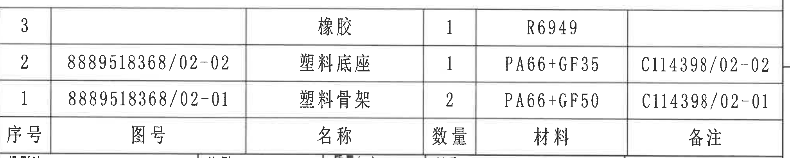
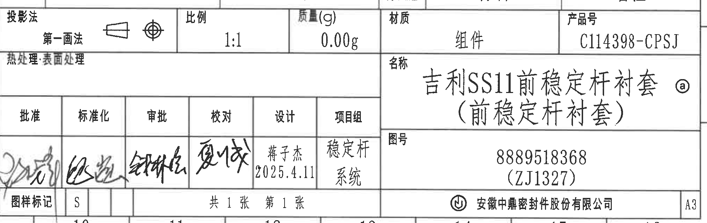

# 20C114398 PDF 内容识别

源文件：`input/20C114398.pdf`  
整页渲染图：`outputs/20C114398_assets/images/page_1.png`  
整页像素尺寸：4959 x 3505。本文中的 bbox 均为整页 PNG 坐标，格式为 `[x, y, width, height]`。

## object_1：试验项目清单

原图位置/视图名称：第 1 页左上至左中区域，bbox `[345, 165, 2160, 2365]`，对象类型 `table`。

### 原表还原

| 试验项目 | 试验方法 | 试验要求 |
|---|---|---|
| 橡胶试块硬度 | 按 GB/T 531.1-2008，将厚度不小于 6mm，上下平行的试片放在邵氏 A 型硬度计上，在试片上取间距不小于 6mm，与试片边缘的距离均不小于 12mm 的点进行测量，取测定值中位数为试验结果。 | 邵氏硬度 60±5SHA |
| 拉伸强度、断裂伸长率 | 按照 GB/T 528-2009，制作 1 型哑铃状试样，将试样均匀地置于拉力试验机上、下夹持器上，调节夹持器的移动速度至 (500±50)mm/min，开动试验机，拉伸试样并跟踪试样的标记，记录试样拉伸至断裂过程中出现的最大力值。 | 拉伸强度≥14MPa 断裂伸长率≥400% |
| 热空气老化试验 | 按 GB/T 3512-2001，把试验规定的硬度和拉伸试样放在恒热老化箱内，按照规定温度 (70±2)℃ 放置 70h，取出试样在温度 (23±2)℃ 下停放 16h 至 48h 后进行测量。 | 硬度变化 0~+7 SHA 拉伸强度变化 -25%MAX 断裂伸长率变化 -25%MAX |
| 压缩永久变形 | 按 GB/T 7759-1996，制作直径为 29mm±0.5mm，高为 12.5mm±0.5mm 的试样，压缩率选用 25%，70℃×22h。 | 压缩永久变形≤20% |
| 耐臭氧老化试验 | 按照 GB/T 7762-2003 制作长度 70mm~100mm（有效长度应大于 40mm），宽度 10mm±0.5mm，厚度 2.0mm±0.2mm 的矩形试样，或者选用符合 GB/T 528-2009 中规定的 1 型或 2 型哑铃型试样，然后用夹具将其拉伸 20%，放入温度为 (40±2)℃，臭氧浓度为 (50±5)×10^-8 的环境中放置 70h，取出检查表面是否龟裂。 | 无龟裂 |
| 撕裂强度 | 按 GB/T 529-2008，选用无割口直角形试样进行试验。 | 撕裂强度≥20KN/m |
| 低温脆性 | 按 GB/T 15256-1994 规定的方法进行，选用 A 型试样。 | 脆性温度不高于 -40℃ |
| 静刚度试验（Z 向） | 环境温度 20±3℃。径向以速度 12±2mm/min 加载 ±5kN，预加载 4 次。之后预载 0N，以速度 12±2mm/min 加载 ±5kN。记录刚度曲线并计算 0 到 ±500N 之间的刚度值。 | 9000N/mm±15% |
| 扩展静态刚度试验 | 1. X 向 - 加载 ±5kN：以速度 12±2mm/min 加载 ±5kN，预加载 4 次。之后预载 0N，以速度 12±2mm/min 加载 ±5kN。记录刚度曲线。 2. X 向、Y 向、Z 向 - 加载 ±500N：以速度 12±2mm/min 加载 ±500N，预加载 4 次。之后预载 0N，以速度 12±2mm/min 加载 ±500N。记录刚度曲线。 | 记录刚度曲线 |
| 动态刚度（仅 Z 向） | 在静刚度测试完之后，按此状态继续进行动态刚度测试。对样件施加振幅为 ±0.025mm 的震动载荷，频率从 10Hz 到至 190Hz，增幅 10Hz。进一步，对样件施加振幅为 ±1mm 的震动载荷，频率从 0Hz 到至 50Hz，增幅 5Hz。记录动态刚度曲线。 | 100Hz 时：动静比 1.5（参考） 高频 Phase：6.0deg（参考） 低频 Phase：4.5deg（参考） |
| 静扭转刚度 | 环境温度 20±3℃，以速度 1000deg/min 扭转样件，最大扭转角度 ±25°，预加载 4 次。之后预载 0°，以速度 1000deg/min 扭转样件，最大扭转角度 ±25°。记录刚度曲线并计算 0 到 ±5Nm 之间的刚度值。 | 2.2Nm/deg±15% |
| 耐高低温试验 | 先测试样件 Z 向静刚度。 1. 将样件在 -40℃ 环境下放置 24h，取出后立即测试 Z 向静刚度，并计算变化率。 2. 将样件在 +80℃ 环境下放置 24h，取出后立即测试 Z 向静刚度，并计算变化率。 | 测试结果仅供参考 |
| 耐久性试验 | 步骤一：径向加载 ±2950N，频率 2Hz；扭转 2±14deg，频率 1.3Hz，循环 7160 次。 步骤二：径向加载 ±5000N，频率 2Hz；扭转 ±5.5deg，频率 1.3Hz，循环 500 次。 步骤三：径向加载 ±3300N，频率 2Hz；扭转 ±4deg，频率 1.3Hz，循环 3480 次。 步骤四：径向加载 ±5500N，频率 2Hz；扭转 1±13deg，频率 1.3Hz，循环 1363 次。 步骤五：扭转 +25°~-19deg，循环 1 次。步骤一至步骤五为一个周期。总计 10 个周期。 | 试验后刚度变化不超过 ±15% |
| 扩展耐久试验 | 1. 衬套老化：产品装夹，在臭氧浓度 200pphm、38℃ 环境下放置 168h；再在 80℃ 环境下放置 168h。 2. 测试 Z 向静刚度。 3. 径向加载 3kN；扭转角度 ±20°，频率 1Hz，循环 10 万次；同时，根据 SAE J726 每小时浇泥水 5 分钟。 4. 测试 Z 向静刚度，并计算变化率。 | 试验后刚度变化不超过 ±30% |
| 粘接试验 | 如图 2 所示，沿稳定杆轴向对稳定杆施加推力，直到稳定杆和衬套完全分开。然后记录最大的力并观察粘合剂表面。 | 压脱力 F>5000N； 粘接面积>90% |

### 提取表格

| 提取项 | 原图数值或文本 | 含义说明 |
|---|---|---|
| 表名 | 试验项目清单 | 左侧主体试验要求表，规定材料、性能、耐久、粘接等测试方法与验收指标。 |
| 表头 | 试验项目；试验方法；试验要求 | 三列表结构，左列为测试名称，中列为执行标准和测试步骤，右列为验收要求。 |
| 参考项 | 100Hz 时：动静比 1.5（参考）；高频 Phase：6.0deg（参考）；低频 Phase：4.5deg（参考）；测试结果仅供参考 | 括号内“参考”表示该项作为参考结果，不应因参考属性被忽略。 |
| 括号内尺寸/条件 | (500±50)mm/min、(70±2)℃、(23±2)℃、(有效长度应大于 40mm)、(40±2)℃、(50±5)×10^-8 | 均为试验条件或试样条件，不属于零件加工视图尺寸，但属于原表要求。 |
| 验收关键项 | 邵氏硬度 60±5SHA；拉伸强度≥14MPa；断裂伸长率≥400%；9000N/mm±15%；2.2Nm/deg±15%；压脱力 F>5000N；粘接面积>90% | 表格中的质量判定指标。 |

边界归属说明：该裁切只提取左侧试验项目清单表格。底部完整包含“粘接试验”行；下方技术要求未纳入本对象提取，另列为 object_2。

## object_2：技术要求 NOTES

原图位置/视图名称：第 1 页左下技术要求区，bbox `[345, 2495, 2160, 430]`，对象类型 `notes`。

### 提取表格

| 提取项 | 原图数值或文本 | 含义说明 |
|---|---|---|
| 标题 | 技术要求： | 本对象为整张图纸通用技术要求。 |
| 1 | 骨架通过硫化粘接； | 规定骨架与橡胶/衬套相关结构采用硫化粘接。 |
| 2 | 零件应有良好的外观质量，去除飞边，表面不允许有发粘、夹杂物、孔洞、裂纹、缺胶等缺陷； | 规定外观缺陷控制。 |
| 3 | 材料应满足材料列表中的材料标准； | 材料以明细表/材料列表为准。 |
| 4 | 未注尺寸见 3D 数模； | 未在二维图上标出的尺寸应查 3D 数模。 |
| 5 | 未注公差尺寸的极限偏差按照 GB/T3672.1-2002 中 M3 级要求执行； | 未注公差按橡胶制品 M3 级执行。 |
| 6 | 产品禁用、限用物质满足 Q/JL J160001-2017《汽车零部件和材料禁用、限用物质要求》的规定； | 限用物质控制标准。 |
| 7 | 未注试验方法及技术条件按 Q/JLY J7110674B-2018《稳定杆衬套技术要求》的规定执行； | 未注明试验条件的默认技术规范。 |
| 8 | “W”区按 Q/JL J100003-2018《汽车零部件永久性标识规定》的规定执行。 | 与主视图中 W 标记对应，说明 W 区为永久性标识区域。 |

边界归属说明：该裁切从试验项目清单下方开始，只包含 NOTES/技术要求文字；上方试验表格和右侧加工视图不归入本对象。

## object_3：变更履历表

原图位置/视图名称：第 1 页右上变更履历区，bbox `[2760, 165, 2020, 340]`，对象类型 `table`。

### 原表还原

| 来源 | 客户版本号 | 变更标记 | 区域 | 变更事项 | 中鼎版本号 | 年月日 | 变更者 |
|---|---|---|---|---|---|---|---|
|  |  |  |  | 首次下发图纸 | A | 2025.2.24 | 蒋子杰 |
| SJ-251823 |  | ⓐ/1 |  | 变更产品名称 | B | 2025.4.11 | 蒋子杰 |

### 提取表格

| 提取项 | 原图数值或文本 | 含义说明 |
|---|---|---|
| 表头 | 来源；客户版本号；变更标记；区域；变更事项；中鼎版本号；年月日；变更者 | 变更履历的原始列。 |
| 版本 A | 首次下发图纸；中鼎版本号 A；2025.2.24；蒋子杰 | 首次发布记录。 |
| 版本 B | 来源 SJ-251823；变更标记 ⓐ/1；变更产品名称；中鼎版本号 B；2025.4.11；蒋子杰 | 产品名称变更记录，与标题栏名称旁的 ⓐ 标记对应。 |

边界归属说明：该裁切只包含右上变更履历表本体；右侧图框坐标字母已排除，不作为表格内容。

## object_4：主视图/前视图

原图位置/视图名称：第 1 页右侧视图区左上，bbox `[2660, 610, 1290, 950]`，对象类型 `view`。

### 提取表格

| 提取项 | 原图数值或文本 | 含义说明 |
|---|---|---|
| 直径关键尺寸 | Ø22.4±0.3☆ | 中心圆/孔相关直径尺寸，带星号，按关键尺寸处理。 |
| 外圆弧半径 | R24±0.3 | 上部外弧半径尺寸，带 ±0.3 公差。 |
| 内圆弧半径 | R21.5±0.3 | 上部内弧半径尺寸，带 ±0.3 公差。 |
| 左侧高度 | 24.7±0.5 | 左侧从底基准线至水平分界/平台的竖向尺寸。 |
| 右侧台阶高度 | 12.5 +0.5 / 0 | 右侧从底基准线至水平分界/台阶的竖向尺寸，单向公差为上偏差 +0.5、下偏差 0。 |
| 总宽 | 48±0.5 | 底部整体宽度尺寸，箭头跨越左右外边界。 |
| 标识区 | W | 引线指向上部左侧区域；含义见 object_2 技术要求第 8 条，W 区按永久性标识规定执行。 |
| 剖切标识 | A-A | 中心竖向剖切线，两个 A 标识和箭头定义下方 object_6 的 A-A 剖面。 |
| T 编号 | 未见 | 当前视图中未标出 T 编号。 |
| 弧向尺寸 | 未见 | 当前视图只标注半径 R24、R21.5，未见沿弧长标注的弧向尺寸。 |

边界归属说明：本对象只提取主视图及其周边尺寸。底部 A-A 剖面已在裁切中排除；靠近底部的 `48±0.5` 归属主视图，因为其尺寸线箭头跨越主视图底部左右外边界。

## object_5：右视图/侧视图

原图位置/视图名称：第 1 页右侧视图区右上，bbox `[3920, 600, 735, 1110]`，对象类型 `view`。

### 提取表格

| 提取项 | 原图数值或文本 | 含义说明 |
|---|---|---|
| 顶部总宽 | 42 | 顶部外侧宽度尺寸，未在视图内另标公差。 |
| 上部宽度 | 34±0.5 | 顶部内侧/框注宽度尺寸，带 ±0.5 公差。 |
| 内部上口宽度 | 22 | 上部内口水平尺寸。 |
| 右上小圆角 | R2 | 右上角过渡圆角半径。 |
| 内部圆角 | R6 | 内部斜面/过渡处圆角半径。 |
| 下部开口宽度 | 12±0.3 | 下部槽/开口宽度，带 ±0.3 公差。 |
| 底部总宽 | 34±0.5 | 底部宽度尺寸，带 ±0.5 公差。 |
| T 编号 | 未见 | 当前视图中未标出 T 编号。 |
| 基准字母 | 未见 | 当前视图中未标出基准字母。 |
| 弧向尺寸 | 未见 | 当前视图有 R2、R6 半径标注，未见弧长/弧向尺寸。 |

边界归属说明：本对象只提取右视图尺寸。右侧图框坐标栏已排除；`12±0.3` 的引线和文字虽然向右伸出，但尺寸箭头指向右视图下部开口，因此归属右视图。

## object_6：A-A 剖面视图

原图位置/视图名称：第 1 页右侧视图区下方偏左，bbox `[2940, 1660, 850, 650]`，对象类型 `section`。

### 提取表格

| 提取项 | 原图数值或文本 | 含义说明 |
|---|---|---|
| 剖面名称 | A-A | 与 object_4 主视图中的 A-A 剖切线对应。 |
| 可见结构 | 上下分隔线、左右侧壁、矩形孔/槽、底部小矩形缺口 | 剖面展示沿 A-A 方向切开后的内部结构关系。 |
| 尺寸标注 | 未见 | 剖面视图内未标注尺寸、公差、半径或角度。 |
| T 编号 | 未见 | 当前剖面视图中未标出 T 编号。 |

边界归属说明：本对象只提取 A-A 剖面图及“A-A”标识。上方主视图、右侧等轴测图、下方明细表均未归入本对象。

## object_7：等轴测视图

原图位置/视图名称：第 1 页右侧视图区下方偏右，bbox `[3830, 1770, 830, 560]`，对象类型 `view`。

### 提取表格

| 提取项 | 原图数值或文本 | 含义说明 |
|---|---|---|
| 坐标轴 | X、Y、Z | 等轴测方向示意，标明三维观察方向。 |
| 形体信息 | 圆筒形衬套主体、前端环状结构、侧面矩形凸台/标识区域、底部开口 | 用于说明零件三维外形，不给出加工尺寸。 |
| 尺寸标注 | 未见 | 当前等轴测图中无尺寸、半径、角度、公差或 T 编号标注。 |

边界归属说明：本对象只提取等轴测视图和 X/Y/Z 坐标轴。下方明细表和右侧图框坐标栏已排除。

## object_8：明细表/材料表

原图位置/视图名称：第 1 页右下、标题栏上方，bbox `[2760, 2355, 2020, 405]`，对象类型 `table`。

### 原表还原

原图中表头位于表格底部；下表按原图自上而下记录行内容。

| 序号 | 图号 | 名称 | 数量 | 材料 | 备注 |
|---|---|---|---|---|---|
| 3 |  | 橡胶 | 1 | R6949 |  |
| 2 | 8889518368/02-02 | 塑料底座 | 1 | PA66+GF35 | C114398/02-02 |
| 1 | 8889518368/02-01 | 塑料骨架 | 2 | PA66+GF50 | C114398/02-01 |

### 提取表格

| 提取项 | 原图数值或文本 | 含义说明 |
|---|---|---|
| 表头 | 序号；图号；名称；数量；材料；备注 | 明细表/材料表字段。 |
| 序号 3 | 名称 橡胶；数量 1；材料 R6949 | 橡胶件材料记录。 |
| 序号 2 | 图号 8889518368/02-02；名称 塑料底座；数量 1；材料 PA66+GF35；备注 C114398/02-02 | 塑料底座零件记录。 |
| 序号 1 | 图号 8889518368/02-01；名称 塑料骨架；数量 2；材料 PA66+GF50；备注 C114398/02-01 | 塑料骨架零件记录。 |

边界归属说明：本对象只提取右下明细表。下方标题栏另列为 object_9；右侧图框坐标栏已排除。

## object_9：标题栏

原图位置/视图名称：第 1 页右下标题栏，bbox `[2760, 2725, 2020, 640]`，对象类型 `title_block`。

### 提取表格

| 提取项 | 原图数值或文本 | 含义说明 |
|---|---|---|
| 投影法 | 第一画法 | 投影方法字段，旁有第一画法符号。 |
| 比例 | 1:1 | 图纸比例。 |
| 质量(g) | 0.00g | 质量字段。 |
| 材质 | 组件 | 标题栏材质/对象类型。 |
| 产品号 | C114398-CPSJ | 产品号字段。 |
| 热处理·表面处理 | 空白 | 原图该栏未填具体处理文字。 |
| 名称 | 吉利SS11前稳定杆衬套 ⓐ（前稳定杆衬套） | 图纸名称；ⓐ 与变更履历中的变更标记对应，括号内为产品名称说明。 |
| 图号 | 8889518368（ZJ1327） | 图号及括号内附加编号。 |
| 批准 | 手写签名 | 批准签署栏。 |
| 标准化 | 手写签名 | 标准化签署栏。 |
| 审批 | 手写签名 | 审批签署栏。 |
| 校对 | 手写签名 | 校对签署栏。 |
| 设计 | 蒋子杰；2025.4.11 | 设计人员和日期。 |
| 项目组 | 稳定杆系统 | 项目组字段。 |
| 图样标记 | S | 图样标记字段。 |
| 张数 | 共 1 张；第 1 张 | 图纸张数。 |
| 公司 | 安徽中鼎密封件股份有限公司 | 公司名称。 |
| 图幅 | A3 | 图幅。 |

边界归属说明：本对象提取标题栏完整行列。上方明细表另列为 object_8；外侧图框坐标数字不作为标题栏内容。

## 裁切检查记录

| 对象 | 图片路径 | 检查结果 | 边界/归属结论 |
|---|---|---|---|
| page_1 | outputs/20C114398_assets/images/page_1.png | 整页 PNG 渲染完成，像素 4959 x 3505。 | 作为所有裁切 bbox 的坐标基准。 |
| object_1 | outputs/20C114398_assets/images/object_1.png | 完整包含试验项目清单三列表、所有表格线和底部“粘接试验”行。 | 未把下方技术要求作为本对象提取。 |
| object_2 | outputs/20C114398_assets/images/object_2.png | 完整包含“技术要求”标题和 1-8 条文字。 | 上方试验清单末行未作为本对象提取。 |
| object_3 | outputs/20C114398_assets/images/object_3.png | 完整包含变更履历表头和两条记录。 | 右侧图框坐标字母已排除。 |
| object_4 | outputs/20C114398_assets/images/object_4.png | 完整包含主视图尺寸线、箭头、Ø22.4±0.3☆、R24±0.3、R21.5±0.3、24.7±0.5、12.5 +0.5/0、48±0.5、W 和 A-A 标识。 | 下方 A-A 剖面未混入；底部 48±0.5 归属主视图。 |
| object_5 | outputs/20C114398_assets/images/object_5.png | 完整包含右视图尺寸线、箭头、42、34±0.5、22、R2、R6、12±0.3、34±0.5。 | 右侧图框坐标栏已排除；12±0.3 归属右视图下部槽。 |
| object_6 | outputs/20C114398_assets/images/object_6.png | 完整包含 A-A 剖面和“A-A”文字。 | 未混入主视图、等轴测图或明细表。 |
| object_7 | outputs/20C114398_assets/images/object_7.png | 完整包含等轴测图和 X/Y/Z 坐标轴。 | 下方明细表和右侧图框坐标栏已排除。 |
| object_8 | outputs/20C114398_assets/images/object_8.png | 完整包含明细表外框、表头和三条物料记录。 | 下方标题栏另列；右侧图框坐标栏已排除。 |
| object_9 | outputs/20C114398_assets/images/object_9.png | 完整包含标题栏行列、签署栏、图号、名称、产品号、公司和 A3 图幅。 | 上方明细表和外侧坐标数字不作为标题栏内容。 |
