# 20C114399.pdf 内容识别

整页渲染图：`outputs/20C114399_assets/images/page_1.png`。以下按原图区域顺序列出裁切对象；每个对象只提取本对象范围内的信息。

## object_1 表1：橡胶材料试验

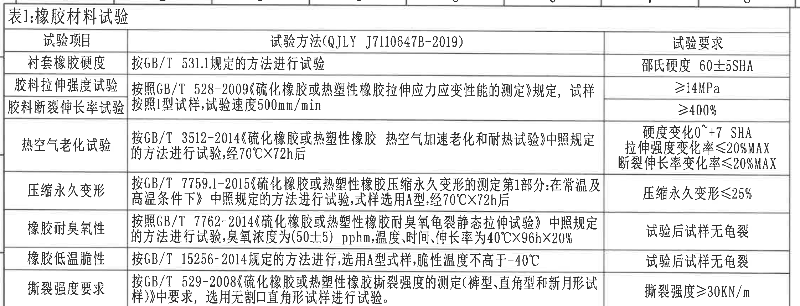

原图位置/视图名称：第1页左上，表1：橡胶材料试验，bbox `[352, 150, 2597, 1010]`。

| 试验项目 | 试验方法(QJLY J7110647B-2019) | 试验要求 |
|---|---|---|
| 衬套橡胶硬度 | 按GB/T 531.1规定的方法进行试验 | 邵氏硬度 60±5SHA |
| 胶料拉伸强度试验 | 按照GB/T 528-2009《硫化橡胶或热塑性橡胶拉伸应力应变性能的测定》规定，试样按照1型试样，试验速度500mm/min | ≥14MPa |
| 胶料断裂伸长率试验 | 按照1型试样，试验速度500mm/min | ≥400% |
| 热空气老化试验 | 按GB/T 3512-2014《硫化橡胶或热塑性橡胶 热空气加速老化和耐热试验》中照规定的方法进行试验，经70℃×72h后 | 硬度变化0~+7 SHA；拉伸强度变化率≤20%MAX；断裂伸长率变化率≤20%MAX |
| 压缩永久变形 | 按GB/T 7759.1-2015《硫化橡胶或热塑性橡胶压缩永久变形的测定第1部分:在常温及高温条件下》中照规定的方法进行试验，试样选用A型，经70℃×72h后 | 压缩永久变形≤25% |
| 橡胶耐臭氧性 | 按GB/T 7762-2014《硫化橡胶或热塑性橡胶耐臭氧龟裂静态拉伸试验》中照规定的方法进行试验，臭氧浓度为(50±5) pphm，温度、时间、伸长率为40℃×96h×20% | 试验后试样无龟裂 |
| 橡胶低温脆性 | 按GB/T 15256-2014规定的方法进行，选用A型试样，脆性温度不高于-40℃ | 试验后试样无龟裂 |
| 撕裂强度要求 | 按GB/T 529-2008《硫化橡胶或热塑性橡胶撕裂强度的测定(裤型、直角型和新月形试样)》中要求，选用无割口直角形试样进行试验 | 撕裂强度≥30KN/m |

| 提取项 | 原图数值或文本 | 含义说明 |
|---|---|---|
| 材料硬度 | 60±5SHA | 橡胶材料邵氏硬度要求。 |
| 拉伸强度 | ≥14MPa | 胶料拉伸强度下限。 |
| 断裂伸长率 | ≥400% | 胶料断裂伸长率下限。 |
| 老化后硬度变化 | 0~+7 SHA | 经70℃×72h后硬度允许变化范围。 |
| 老化后强度/伸长变化 | ≤20%MAX | 拉伸强度和断裂伸长率变化率上限。 |
| 压缩永久变形 | ≤25% | 压缩永久变形上限。 |
| 臭氧条件 | (50±5) pphm、40℃×96h×20% | 臭氧浓度、温度时间和伸长率条件。 |
| 低温脆性 | 不高于-40℃ | 脆性温度要求。 |
| 撕裂强度 | ≥30KN/m | 撕裂强度下限。 |

边界归属说明：该裁切包含表1标题、三列表头和表1全部行；下方表2标题不归入本对象。

## object_2 表2：产品性能试验

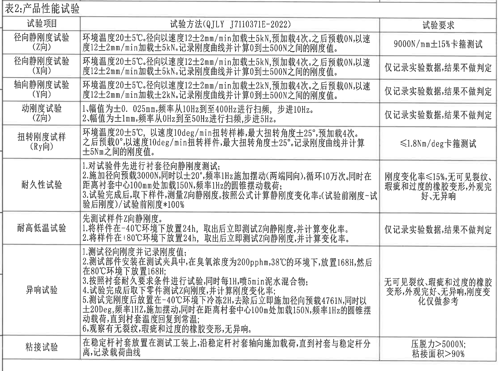

原图位置/视图名称：第1页左中，表2：产品性能试验，bbox `[352, 1012, 2597, 2670]`。

| 试验项目 | 试验方法(QJLY J7110371E-2022) | 试验要求 |
|---|---|---|
| 径向静刚度试验(Z向) | 环境温度20±5℃。径向以速度12±2mm/min加载±5kN，预加载4次。之后预载0N，以速度12±2mm/min加载±5kN。记录刚度曲线并计算0到±500N之间的刚度值。 | 9000N/mm±15%卡箍测试 |
| 径向静刚度试验(X向) | 环境温度20±5℃。径向以速度12±2mm/min加载±5kN，预加载4次。之后预载0N，以速度12±2mm/min加载±5kN。记录刚度曲线并计算0到±500N之间的刚度值。 | 仅记录实验数据，结果不做判定 |
| 轴向静刚度试验(Y向) | 环境温度20±5℃。径向以速度12±2mm/min加载±2kN，预加载4次。之后预载0N，以速度12±2mm/min加载±2kN。记录刚度曲线并计算0到±500N之间的刚度值。 | 仅记录实验数据，结果不做判定 |
| 动刚度试验(Z向) | 1.幅值为±0.025mm，频率从10Hz到至400Hz进行扫频，步进10Hz。2.幅值为±1mm，频率从0Hz到至50Hz进行扫频，步进5Hz。 | 仅记录实验数据，结果不做判定 |
| 扭转刚度试样(Ry向) | 环境温度20±5℃，以速度10deg/min扭转样棒，最大扭转角度±25°，预加载4次。之后预载0°，以速度10deg/min扭转样件，最大扭转角度±25°。记录刚度曲线并计算±5Nm之间的刚度值。 | ≤1.8Nm/deg卡箍测试 |
| 耐久性试验 | 1.对试验件先进行衬套径向静刚度测试；2.施加径向预载3000N，同时以±20°、频率1Hz施加摆动(两端同向)，循环10万次。同时在距离衬套中心100mm处加载150N，频率1Hz的圆锥摆动载荷；3.试验完成后，取下样件，测量Z向静刚度。按照公式计算静刚度变化率:(试验前刚度-试验后刚度)/试验前刚度*100%。 | 刚度变化率≤15%，无可见裂纹、瑕疵和过度的橡胶变形，外观完好，无异响 |
| 耐高低温试验 | 先测试样件Z向静刚度。1.将样件在-40℃环境下放置24h，取出后立即测试Z向静刚度，并计算变化率。2.将样件在+80℃环境下放置24h，取出后立即测试Z向静刚度，并计算变化率。 | 仅记录实验数据，结果不做判定 |
| 异响试验 | 1.测试径向刚度并记录刚度值；2.测试部件安装在测试夹具中，在臭氧浓度为200pphm，38℃的环境下，放置168H，然后在80℃环境下放置168H；3.按照衬套耐久要求条件进行试验，同时每1H，喷5min泥水混合物；4.试验完成后取下零件测试Z向刚度，并计算刚度变化率；5.测试完刚度后放置在-40℃环境下冷冻2H，去除后立即施加径向预载4761N，同时以±20Deg，频率1Hz，施加摆动，同时在距离衬套中心100mm处加载150N，频率1Hz的圆锥摆动载荷，直到衬套温度回复到常温；6.观察有无裂纹、瑕疵和过度的橡胶变形，无异响。 | 无可见裂纹、瑕疵和过度的橡胶变形，外观完好，无异响，刚度变化仅做参考 |
| 粘接试验 | 在稳定杆衬套放置在测试工装上，沿稳定杆衬套轴向施加载荷，直到衬套与稳定杆分离，记录载荷曲线 | 压脱力>5000N；粘接面积>90% |

| 提取项 | 原图数值或文本 | 含义说明 |
|---|---|---|
| Z向径向静刚度 | 9000N/mm±15% | 卡箍测试判定要求。 |
| X/Y向静刚度 | 仅记录实验数据，结果不做判定 | X向、Y向刚度数据为记录项。 |
| 动刚度幅值/频率 | ±0.025mm,10Hz~400Hz；±1mm,0Hz~50Hz | 两段扫频条件。 |
| 扭转刚度 | ≤1.8Nm/deg | Ry向卡箍测试要求。 |
| 耐久刚度变化率 | ≤15% | 试验后刚度变化率上限。 |
| 异响臭氧条件 | 200pphm、38℃、168H | 异响试验预处理环境。 |
| 粘接要求 | 压脱力>5000N；粘接面积>90% | 粘接试验判定要求。 |

边界归属说明：该裁切完整覆盖表2标题、表头和全部行；上方表1和下方表3不归入本对象。

## object_3 表3：产品信息

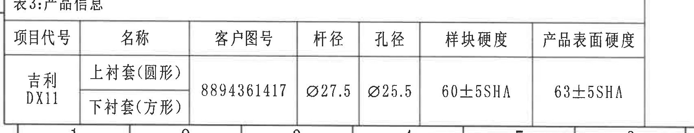

原图位置/视图名称：第1页左下，表3：产品信息，bbox `[352, 3030, 2057, 3360]`。

| 项目代号 | 名称 | 客户图号 | 杆径 | 孔径 | 样块硬度 | 产品表面硬度 |
|---|---|---|---|---|---|---|
| 吉利DX11 | 上衬套(圆形) 下衬套(方形) | 8894361417 | Ø27.5 | Ø25.5 | 60±5SHA | 63±5SHA |

| 提取项 | 原图数值或文本 | 含义说明 |
|---|---|---|
| 项目代号 | 吉利DX11 | 产品所属项目。 |
| 客户图号 | 8894361417 | 客户图纸编号。 |
| 杆径 | Ø27.5 | 匹配杆直径，表格给出名义值。 |
| 孔径 | Ø25.5 | 衬套孔径，表格给出名义值。 |
| 样块硬度 | 60±5SHA | 样块邵氏硬度范围。 |
| 产品表面硬度 | 63±5SHA | 产品表面邵氏硬度范围。 |

边界归属说明：裁切保留表3标题、表头和全部单元格；左边缘可见页面坐标字母残边，不属于表3内容。

## object_4 变更履历表

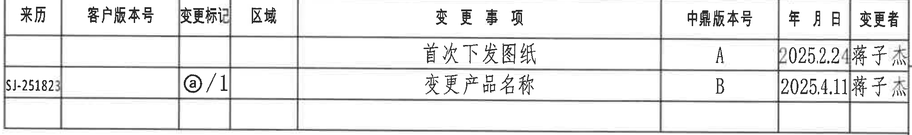

原图位置/视图名称：第1页右上，变更履历表，bbox `[2745, 185, 4770, 485]`。

| 来历 | 客户版本号 | 变更标记 | 区域 | 变更事项 | 中鼎版本号 | 年月日 | 变更者 |
|---|---|---|---|---|---|---|---|
|  |  |  |  | 首次下发图纸 | A | 2025.2.24 | 蒋子杰 |
| SJ-251823 |  | ⓐ/1 |  | 变更产品名称 | B | 2025.4.11 | 蒋子杰 |

| 提取项 | 原图数值或文本 | 含义说明 |
|---|---|---|
| 修订A | 首次下发图纸；2025.2.24；蒋子杰 | 首次发行记录。 |
| 修订B | 变更产品名称；2025.4.11；蒋子杰 | 产品名称变更记录。 |
| 变更标记 | ⓐ/1 | 与标题栏/名称处的ⓐ标记关联。 |
| 来历 | SJ-251823 | 第二条修订来源编号。 |

边界归属说明：裁切保留变更履历表本体和两条记录；右侧外图框坐标字母不作为表格内容。

## object_5 主视图/俯视加工视图

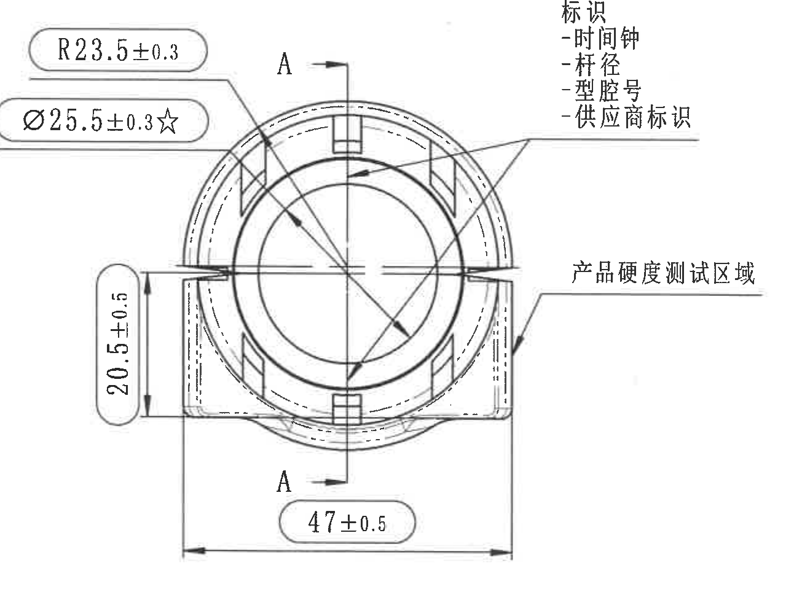

原图位置/视图名称：第1页中右，主视图/俯视加工视图，bbox `[2700, 670, 4005, 1665]`。

| 提取项 | 原图数值或文本 | 含义说明 |
|---|---|---|
| 圆弧半径 | R23.5±0.3 | 外圆/圆弧半径尺寸，带±0.3公差。 |
| 孔径关键尺寸 | Ø25.5±0.3☆ | 内孔直径尺寸，星号表示关键特性，带±0.3公差。 |
| 竖向高度 | 20.5±0.5 | 左侧局部总高/台阶高度尺寸，带±0.5公差。 |
| 总宽 | 47±0.5 | 底部横向总宽尺寸，完整尺寸线归属主视图。 |
| 剖切标识 | A、A | 指示A-A剖视图的剖切位置和方向。 |
| 标识内容 | 时间钟、杆径、型腔号、供应商标识 | 主视图右上文字说明产品标识内容。 |
| 产品硬度测试区域 | 产品硬度测试区域 | 指向右侧外表面区域，用于硬度测试位置说明。 |

边界归属说明：R23.5±0.3、Ø25.5±0.3☆、20.5±0.5、47±0.5的文字、箭头和尺寸线均完整在主视图裁切内。右侧A-A剖视图尺寸不归入主视图。

## object_6 A-A 剖视图

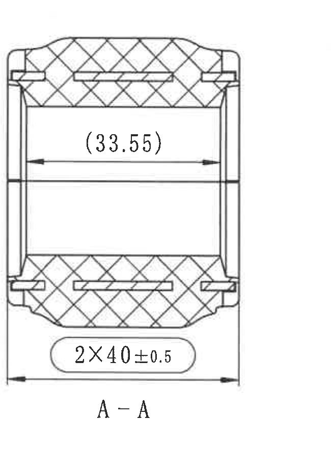

原图位置/视图名称：第1页右中，A-A剖视图，bbox `[4045, 765, 4695, 1650]`。

| 提取项 | 原图数值或文本 | 含义说明 |
|---|---|---|
| 参考尺寸 | (33.55) | 括号内尺寸为参考尺寸，表示剖视图内部横向距离，仅供参考。 |
| 两处尺寸 | 2X40±0.5 | 2X表示两处相同尺寸，40为名义值，公差±0.5。 |
| 剖面名 | A-A | 与主视图A-A剖切标识对应。 |
| 剖面线 | 交叉剖面线 | 表示剖切后的材料截面。 |

边界归属说明：裁切包含剖视图轮廓、剖面线、(33.55)、2X40±0.5完整尺寸线和A-A标题；主视图标注不归入本对象。

## object_7 局部轴测图/三维视图

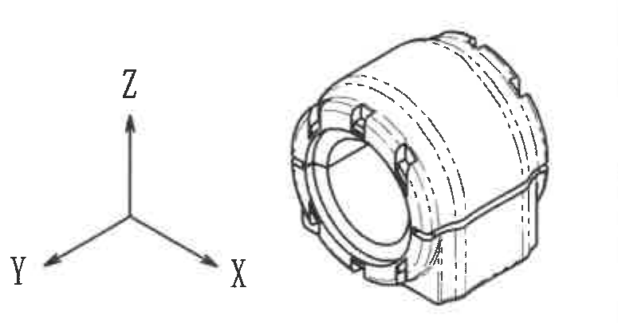

原图位置/视图名称：第1页右下，局部轴测图/三维视图，bbox `[3975, 1768, 4750, 2173]`。

| 提取项 | 原图数值或文本 | 含义说明 |
|---|---|---|
| 三维外形 | 轴测零件轮廓 | 展示衬套整体外形、端面孔、周向凸台/开槽和外圆弧形态。 |
| 坐标轴 | X、Y、Z | 说明三维方向；无独立尺寸数值。 |
| 尺寸标注 | 未见独立尺寸 | 本局部图只提供形状方向参考。 |

边界归属说明：裁切包含完整轴测图和X/Y/Z坐标轴；下方技术要求文字不归入本对象。

## object_8 技术要求 1-5

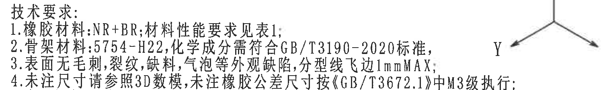

原图位置/视图名称：第1页中下，技术要求上半段，bbox `[2760, 1985, 4260, 2210]`。

| 提取项 | 原图数值或文本 | 含义说明 |
|---|---|---|
| 1 | 橡胶材料:NR+BR;材料性能要求见表1; | 指定橡胶材料体系和性能依据。 |
| 2 | 骨架材料:5754-H22,化学成分需符合GB/T3190-2020标准; | 指定骨架材料牌号和化学成分标准。 |
| 3 | 表面无毛刺,裂纹,缺料,气泡等外观缺陷,分型线飞边1mmMAX; | 外观缺陷限制，飞边最大1mm。 |
| 4 | 未注尺寸请参照3D数模,未注橡胶公差尺寸按《GB/T3672.1》中M3级执行; | 未注尺寸和未注橡胶公差的执行依据。 |
| 5 | 产品性能试验见表2; | 性能试验引用表2。 |

边界归属说明：裁切覆盖技术要求标题和第1-5条；右侧靠近局部轴测图，边缘若出现坐标轴残片不作为NOTES内容。第6-9条归属object_11。

## object_11 技术要求 6-9

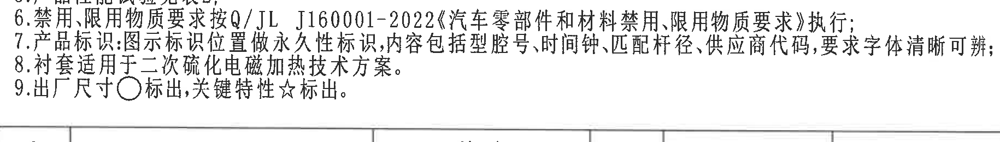

原图位置/视图名称：第1页中下，技术要求下半段，bbox `[2760, 2240, 4590, 2500]`。

| 提取项 | 原图数值或文本 | 含义说明 |
|---|---|---|
| 6 | 禁用、限用物质要求按Q/JL J160001-2022《汽车零部件和材料禁用、限用物质要求》执行; | 禁限用物质合规要求。 |
| 7 | 产品标识:图示标识位置做永久性标识,内容包括型腔号、时间钟、匹配杆径、供应商代码,要求字体清晰可辨; | 标识内容和永久性要求。 |
| 8 | 衬套适用于二次硫化电磁加热技术方案。 | 工艺适用性说明。 |
| 9 | 出厂尺寸○标出,关键特性☆标出。 | ○表示出厂尺寸，☆表示关键特性。 |

边界归属说明：裁切从第6条起至第9条结束；上半段第1-5条不归入本对象，下方明细栏不归入NOTES。

## object_9 明细栏/BOM表

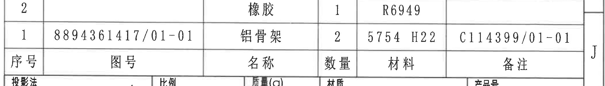

原图位置/视图名称：第1页右下标题栏上方，明细栏/BOM表，bbox `[2738, 2490, 4833, 2790]`。

| 序号 | 图号 | 名称 | 数量 | 材料 | 备注 |
|---|---|---|---|---|---|
| 2 |  | 橡胶 | 1 | R6949 |  |
| 1 | 8894361417/01-01 | 铝骨架 | 2 | 5754 H22 | C114399/01-01 |

| 提取项 | 原图数值或文本 | 含义说明 |
|---|---|---|
| 序号2 | 橡胶；数量1；材料R6949 | 橡胶件物料。 |
| 序号1 | 8894361417/01-01；铝骨架；数量2；5754 H22；C114399/01-01 | 铝骨架物料和备注图号。 |

边界归属说明：裁切包含两行物料和表头；下方投影法、比例、质量等标题栏字段归属object_10。

## object_10 标题栏

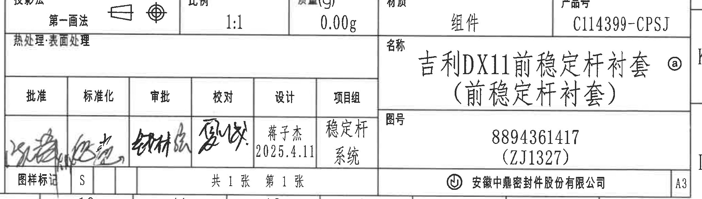

原图位置/视图名称：第1页右下，标题栏，bbox `[2738, 2780, 4793, 3365]`。

| 字段 | 原图数值或文本 | 含义说明 |
|---|---|---|
| 投影法 | 第一画法 | 图样投影方法。 |
| 比例 | 1:1 | 图样比例。 |
| 质量(g) | 0.00g | 质量栏填写值。 |
| 材质 | 组件 | 总成材质类别。 |
| 产品号 | C114399-CPSJ | 产品号。 |
| 热处理:表面处理 | 空 | 原栏未填写具体处理。 |
| 名称 | 吉利DX11前稳定杆衬套(前稳定杆衬套) ⓐ | 零件/组件名称，带变更标记ⓐ。 |
| 图号 | 8894361417 (ZJ1327) | 图号及括号内编号。 |
| 批准 | 签名 | 签署栏。 |
| 标准化 | 签名 | 签署栏。 |
| 审批 | 签名 | 签署栏。 |
| 校对 | 签名 | 签署栏。 |
| 设计 | 蒋子杰 2025.4.11 | 设计者与日期。 |
| 项目组 | 稳定杆系统 | 项目组名称。 |
| 图样标记 | S | 图样标记。 |
| 页数 | 共1张 第1张 | 图纸页数。 |
| 公司 | 安徽中鼎密封件股份有限公司 | 出图单位。 |
| 图幅 | A3 | 图纸幅面。 |

边界归属说明：裁切包含标题栏所有主要字段和签署区；上方明细栏物料行归属object_9。

## 裁切检查记录

| 对象 | 检查结果 | 边界归属说明 |
|---|---|---|
| page_1 | 整页PNG渲染完成，尺寸4959×3505。 | 作为所有裁切对象来源。 |
| object_1 | 完整包含表1标题、表头和全部表格文字。 | 下边界避开表2内容。 |
| object_2 | 完整包含表2标题、表头和全部表格文字。 | 上下表格未归入本对象。 |
| object_3 | 完整包含表3标题、表头和全部单元格。 | 左侧坐标字母残边不作为表格内容。 |
| object_4 | 完整包含变更履历列和两条记录。 | 右侧图框坐标字母不作为表格内容。 |
| object_5 | 完整包含主视图尺寸线、箭头、A-A剖切标识和文字。 | A-A剖视图尺寸未混入主视图提取。 |
| object_6 | 完整包含A-A剖视图、剖面线、(33.55)、2X40±0.5尺寸线和标题。 | 主视图尺寸未混入剖视图提取。 |
| object_7 | 完整包含局部轴测图和X/Y/Z坐标轴。 | 技术要求文字不作为本对象内容。 |
| object_8 | 完整包含技术要求1-5文本。 | 右边缘靠近局部图，非NOTES残片不提取。 |
| object_11 | 完整包含技术要求6-9文本。 | 下方明细栏不作为NOTES内容。 |
| object_9 | 完整包含明细栏两行物料和表头。 | 下方标题栏字段不归入BOM表。 |
| object_10 | 完整包含标题栏、签署区、名称、图号、公司和图幅。 | 上方明细栏物料不归入标题栏。 |
