# 20C114400 PDF内容识别与裁切提取

整页PNG：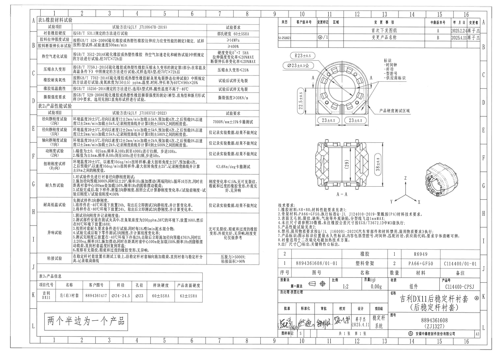

## 页面信息

| 项目 | 内容 |
|---|---|
| PDF | input/20C114400.pdf |
| 页数 | 1 |
| 整页PNG | outputs/20C114400_assets/images/page_1.png |
| 整页尺寸 | 4959 × 3505 px |
| 页面bbox | [0, 0, 4959, 3505] |

## object_1 - 表1：橡胶材料试验

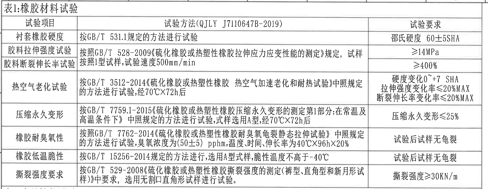

| 项目 | 内容 |
|---|---|
| 原图位置/视图名称 | 表1：橡胶材料试验 |
| object_kind | table |
| page_number | 1 |
| bbox | [360, 160, 2600, 1030] |

### 原表还原

| 试验项目 | 试验方法(QJLY J7110647B-2019) | 试验要求 |
|---|---|---|
| 衬套橡胶硬度 | 按GB/T 531.1规定的方法进行试验 | 邵氏硬度 60±5SHA |
| 胶料拉伸强度试验 | 按照GB/T 528-2009《硫化橡胶或热塑性橡胶拉伸应力应变性能的测定》规定，试样按照1型试样，试验速度500mm/min | ≥14MPa |
| 胶料断裂伸长率试验 | 同上，GB/T 528-2009，1型试样，试验速度500mm/min | ≥400% |
| 热空气老化试验 | 按GB/T 3512-2014《硫化橡胶或热塑性橡胶 热空气加速老化和耐热试验》中照规定的方法进行试验，经70℃×72h后 | 硬度变化0~+7 SHA；拉伸强度变化率≤20%MAX；断裂伸长率变化率≤20%MAX |
| 压缩永久变形 | 按GB/T 7759.1-2015《硫化橡胶或热塑性橡胶压缩永久变形的测定第1部分:在常温及高温条件下》中照规定的方法进行试验，试样选用A型，经70℃×72h后 | 压缩永久变形≤25% |
| 橡胶耐臭氧性 | 按照GB/T 7762-2014《硫化橡胶或热塑性橡胶耐臭氧龟裂静态拉伸试验》中照规定的方法进行试验，臭氧浓度为(50±5)pphm，温度、时间、伸长率为40℃×96h×20% | 试验后试样无龟裂 |
| 橡胶低温脆性 | 按GB/T 15256-2014规定的方法进行，选用A型试样，脆性温度不高于-40℃ | 试验后试样无龟裂 |
| 撕裂强度要求 | 按GB/T 529-2008《硫化橡胶或热塑性橡胶撕裂强度的测定(裤型、直角型和新月形试样)》中要求，选用无割口直角形试样进行试验 | 撕裂强度≥30KN/m |

### 提取表格

| 提取项 | 原图数值或文本 | 含义说明 |
|---|---|---|
| 表名 | 表1:橡胶材料试验 | 材料性能试验表，作为技术要求1引用的材料性能要求。 |
| 衬套橡胶硬度 | 邵氏硬度 60±5SHA | 橡胶衬套硬度要求；试验方法按GB/T 531.1。 |
| 胶料拉伸强度试验 | ≥14MPa | 胶料拉伸强度下限；GB/T 528-2009，1型试样，500mm/min。 |
| 胶料断裂伸长率试验 | ≥400% | 断裂伸长率下限；同GB/T 528-2009。 |
| 热空气老化试验 | 70℃×72h；硬度变化0~+7 SHA；拉伸强度变化率≤20%MAX；断裂伸长率变化率≤20%MAX | 老化后硬度、拉伸强度、断裂伸长率变化要求。 |
| 压缩永久变形 | 70℃×72h；压缩永久变形≤25% | A型试样压缩永久变形限值。 |
| 橡胶耐臭氧性 | (50±5)pphm；40℃×96h×20%；试验后试样无龟裂 | 臭氧环境下静态拉伸抗龟裂要求。 |
| 橡胶低温脆性 | 脆性温度不高于-40℃；试验后试样无龟裂 | 低温脆性要求。 |
| 撕裂强度要求 | 撕裂强度≥30KN/m | 无割口直角形试样撕裂强度下限。 |

### 边界归属说明

边界含完整表1标题、表头、全部数据行；底部邻接表2标题但提取不跨入表2。

## object_2 - 表2：产品性能试验

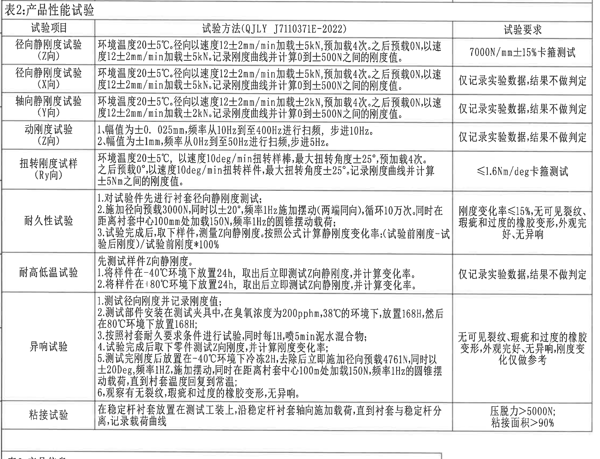

| 项目 | 内容 |
|---|---|
| 原图位置/视图名称 | 表2：产品性能试验 |
| object_kind | table |
| page_number | 1 |
| bbox | [360, 1015, 2600, 2730] |

### 原表还原

| 试验项目 | 试验方法(QJLY J7110371E-2022) | 试验要求 |
|---|---|---|
| 径向静刚度试验(Z向) | 环境温度20±5℃。径向以速度12±2mm/min加载±5kN，预加载4次。之后预载0N，以速度12±2mm/min加载±5kN。记录刚度曲线并计算0到±500N之间的刚度值。 | 7000N/mm±15%卡箍测试 |
| 径向静刚度试验(X向) | 环境温度20±5℃。径向以速度12±2mm/min加载±5kN，预加载4次。之后预载0N，以速度12±2mm/min加载±5kN。记录刚度曲线并计算0到±500N之间的刚度值。 | 仅记录实验数据,结果不做判定 |
| 轴向静刚度试验(Y向) | 环境温度20±5℃。径向以速度12±2mm/min加载±2kN，预加载4次。之后预载0N，以速度12±2mm/min加载±2kN。记录刚度曲线并计算0到±500N之间的刚度值。 | 仅记录实验数据,结果不做判定 |
| 动刚度试验(Z向) | 1、幅值为±0.025mm,频率从10Hz到至400Hz进行扫频，步进10Hz。2、幅值为±1mm,频率从0Hz到至50Hz进行扫频,步进5Hz。 | 仅记录实验数据,结果不做判定 |
| 扭转刚度试样(Ry向) | 环境温度20±5℃，以速度10deg/min扭转样棒,最大扭转角度±25°;预加载4次。之后预载0°,以速度10deg/min扭转样件,最大扭转角度±25°。记录刚度曲线并计算±5Nm之间的刚度值。 | ≤1.6Nm/deg卡箍测试 |
| 耐久性试验 | 1.对试验件先进行衬套径向静刚度测试；2.施加径向预载3000N,同时以±20°,频率1Hz施加摆动(两端同向),循环10万次。同时在距离衬套中心100mm处加载150N,频率1Hz的圆锥摆动载荷；3.试验完成后,取下样件,测量Z向静刚度。按照公式计算静刚度变化率:(试验前刚度-试验后刚度)/试验前刚度*100% | 刚度变化率≤15%,无可见裂纹、瑕疵和过度的橡胶变形,外观完好,无异响 |
| 耐高低温试验 | 先测试样件Z向静刚度。1.将样件在-40℃环境下放置24h,取出后立即测试Z向静刚度,并计算变化率。2.将样件在+80℃环境下放置24h,取出后立即测试Z向静刚度,并计算变化率。 | 仅记录实验数据,结果不做判定 |
| 异响试验 | 1.测试径向刚度并记录刚度值；2.测试部件安装在测试夹具中,在臭氧浓度为200pphm,38℃的环境下,放置168H,然后在80℃环境下放置168H；3.按照衬套耐久要求条件进行试验,同时每1H,喷5min泥水混合物；4.试验完成后取下零件测试Z向刚度,并计算刚度变化率；5.测试完刚度后放置在-40℃环境下冷冻2H,去除后立即施加径向预载4761N,同时以±20Deg,频率1HZ,施加摆动,同时在距离衬套中心100mm处加载150N,频率1Hz的圆锥摆动载荷,直到衬套温度回复到常温；6.观察有无裂纹,瑕疵和过度的橡胶变形,无异响。 | 无可见裂纹、瑕疵和过度的橡胶变形,外观完好,无异响,刚度变化仅做参考 |
| 粘接试验 | 在稳定杆衬套放置在测试工装上,沿稳定杆衬套轴向施加载荷,直到衬套与稳定杆分离,记录载荷曲线 | 压脱力>5000N; 粘接面积>90% |

### 提取表格

| 提取项 | 原图数值或文本 | 含义说明 |
|---|---|---|
| 表名 | 表2:产品性能试验 | 产品级性能试验表，技术要求5引用。 |
| 径向静刚度试验(Z向) | 20±5℃；12±2mm/min；±5kN；预加载4次；0到±500N；7000N/mm±15%卡箍测试 | Z向径向静刚度判定项目。 |
| 径向静刚度试验(X向) | 20±5℃；12±2mm/min；±5kN；0到±500N；仅记录实验数据,结果不做判定 | X向径向静刚度记录项目。 |
| 轴向静刚度试验(Y向) | 20±5℃；12±2mm/min；±2kN；0到±500N；仅记录实验数据,结果不做判定 | Y向轴向静刚度记录项目。 |
| 动刚度试验(Z向) | ±0.025mm，10Hz至400Hz，步进10Hz；±1mm，0Hz至50Hz，步进5Hz | Z向动刚度扫频条件；结果仅记录。 |
| 扭转刚度试样(Ry向) | 20±5℃；10deg/min；最大扭转角度±25°；±5Nm；≤1.6Nm/deg卡箍测试 | Ry向扭转刚度限值。 |
| 耐久性试验 | 径向预载3000N；±20°；1Hz；循环10万次；100mm处加载150N；1Hz；刚度变化率≤15% | 耐久后Z向静刚度变化和外观/异响要求。 |
| 耐高低温试验 | -40℃×24h；+80℃×24h；测试Z向静刚度并计算变化率 | 高低温后刚度变化记录项目，不判定。 |
| 异响试验 | 200pphm；38℃×168H；80℃×168H；每1H喷5min泥水；-40℃冷冻2H；径向预载4761N；±20Deg；1HZ；100mm处150N；1Hz | 异响/外观及刚度变化参考试验条件。 |
| 粘接试验 | 压脱力>5000N；粘接面积>90% | 衬套与稳定杆分离载荷和粘接面积要求。 |

### 边界归属说明

边界含完整表2标题、表头和从Z向静刚度至粘接试验的全部行；底部不提取下方表3。

## object_3 - 表3：产品信息

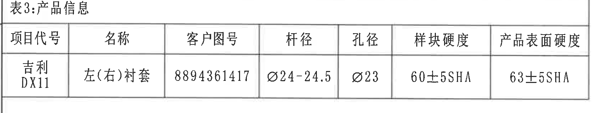

| 项目 | 内容 |
|---|---|
| 原图位置/视图名称 | 表3：产品信息 |
| object_kind | table |
| page_number | 1 |
| bbox | [360, 2720, 2045, 3040] |

### 原表还原

| 项目代号 | 名称 | 客户图号 | 杆径 | 孔径 | 样块硬度 | 产品表面硬度 |
|---|---|---|---|---|---|---|
| 吉利DX11 | 左(右)衬套 | 8894361417 | Ø24-24.5 | Ø23 | 60±5SHA | 63±5SHA |

### 提取表格

| 提取项 | 原图数值或文本 | 含义说明 |
|---|---|---|
| 项目代号 | 吉利DX11 | 产品项目代号。 |
| 名称 | 左(右)衬套 | 产品名称字段。 |
| 客户图号 | 8894361417 | 客户图号。 |
| 杆径 | Ø24-24.5 | 配合杆径范围，直径符号属于表格字段。 |
| 孔径 | Ø23 | 孔径字段，和主视图Ø23±0.3☆相关但此处无公差。 |
| 样块硬度 | 60±5SHA | 样块硬度。 |
| 产品表面硬度 | 63±5SHA | 产品表面硬度。 |

### 边界归属说明

边界含完整表3标题、列头和唯一数据行；不包含下方手写说明。

## object_4 - 左下手写说明

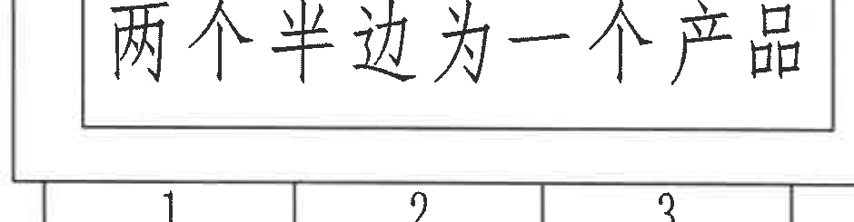

| 项目 | 内容 |
|---|---|
| 原图位置/视图名称 | 左下手写说明 |
| object_kind | notes |
| page_number | 1 |
| bbox | [350, 3140, 1290, 3385] |

### 提取表格

| 提取项 | 原图数值或文本 | 含义说明 |
|---|---|---|
| 手写说明 | 两个半边为一个产品 | 说明两个半边件组合为一个产品。 |

### 边界归属说明

矩形框内手写说明完整；下方坐标格数字属于图框坐标，不作为说明内容。

## object_5 - 修订履历表

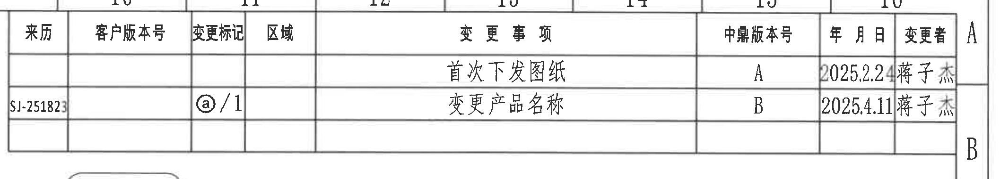

| 项目 | 内容 |
|---|---|
| 原图位置/视图名称 | 修订履历表 |
| object_kind | table |
| page_number | 1 |
| bbox | [2740, 150, 4855, 530] |

### 原表还原

| 来源 | 客户版本号 | 变更标记 | 区域 | 变更事项 | 中鼎版本号 | 年月日 | 变更者 |
|---|---|---|---|---|---|---|---|
|  |  |  |  | 首次下发图纸 | A | 2025.2.24 | 蒋子杰 |
| SJ-251823 |  | ⓐ/1 |  | 变更产品名称 | B | 2025.4.11 | 蒋子杰 |

### 提取表格

| 提取项 | 原图数值或文本 | 含义说明 |
|---|---|---|
| 表头 | 来源、客户版本号、变更标记、区域、变更事项、中鼎版本号、年月日、变更者 | 修订履历列名。 |
| 记录1 | 首次下发图纸；中鼎版本号A；2025.2.24；蒋子杰 | 首次发布记录。 |
| 记录2 | 来源SJ-251823；变更标记ⓐ/1；变更产品名称；中鼎版本号B；2025.4.11；蒋子杰 | 产品名称变更记录，和标题栏名称旁ⓐ对应。 |

### 边界归属说明

边界含修订履历表从来源到变更者的全部列；右侧A/B图框坐标不作为表格字段。

## object_6 - 主视图/正面加工视图

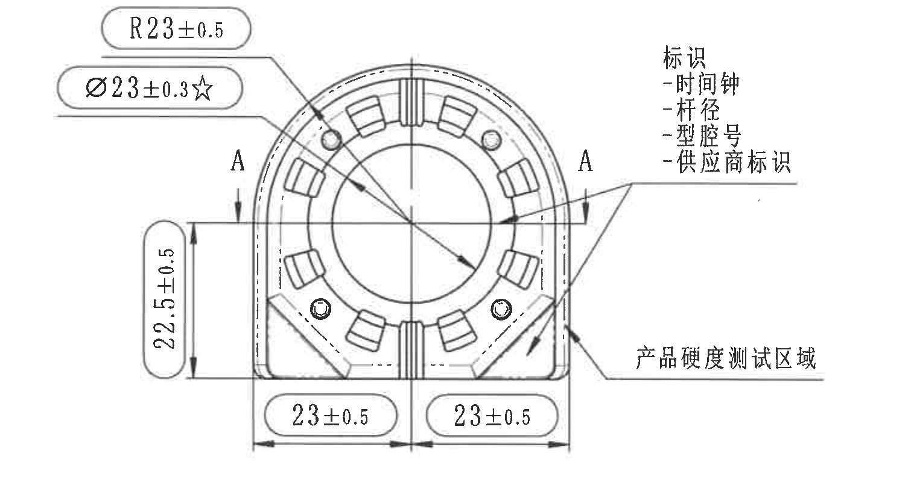

| 项目 | 内容 |
|---|---|
| 原图位置/视图名称 | 主视图/正面加工视图 |
| object_kind | view |
| page_number | 1 |
| bbox | [2710, 505, 4220, 1340] |

### 提取表格

| 提取项 | 原图数值或文本 | 含义说明 |
|---|---|---|
| R23±0.5 | R23±0.5 | 顶部外圆弧半径，公差±0.5；属于主视图。 |
| 关键直径 | Ø23±0.3☆ | 中心孔/孔径直径，公差±0.3；☆为关键特性符号。 |
| 左侧高度 | 22.5±0.5 | 主视图左侧竖向尺寸，公差±0.5。 |
| 底部左半宽 | 23±0.5 | 底部左半边宽度，公差±0.5。 |
| 底部右半宽 | 23±0.5 | 底部右半边宽度，公差±0.5。 |
| 剖切标识 | A-A | 指向下方A-A剖面，不表示主视图尺寸。 |
| 标识内容 | 时间钟、杆径、型腔号、供应商标识 | 图示标识位置的内容说明。 |
| 硬度测试区域 | 产品硬度测试区域 | 引出线指向主视图右下区域，表示硬度测试位置。 |

### 边界归属说明

边界含主视图所有尺寸线、箭头、泡框和引出文字；不包含下方A-A剖面尺寸。

## object_7 - A-A剖面视图

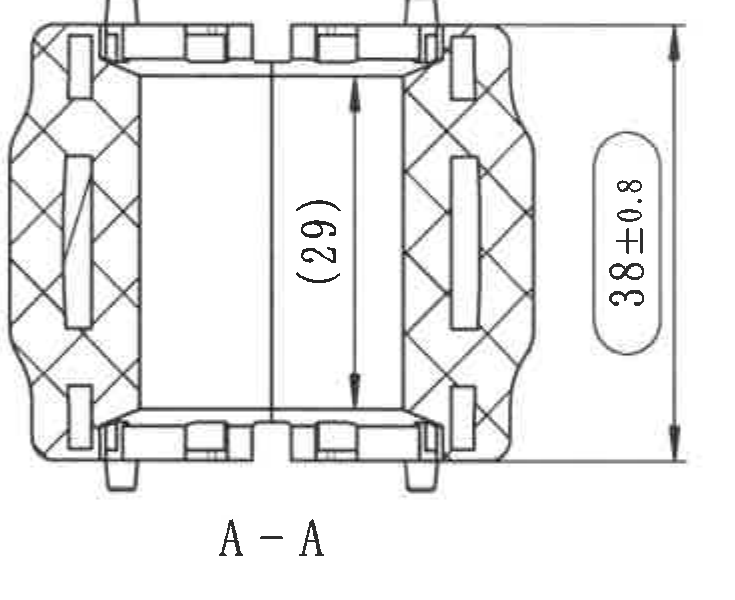

| 项目 | 内容 |
|---|---|
| 原图位置/视图名称 | A-A剖面视图 |
| object_kind | section |
| page_number | 1 |
| bbox | [3120, 1390, 3855, 1990] |

### 提取表格

| 提取项 | 原图数值或文本 | 含义说明 |
|---|---|---|
| 参考高度 | (29) | 括号内参考尺寸，位于A-A剖面中央内腔高度；参考用，不作为直接控制尺寸。 |
| 总高度 | 38±0.8 | A-A剖面外形总高度，公差±0.8。 |
| 剖面名称 | A-A | 对应主视图A-A剖切线。 |

### 边界归属说明

边界含A-A剖面、(29)参考尺寸和38±0.8总高；已排除右侧轴测图坐标轴。

## object_8 - 轴测图/三维示意视图

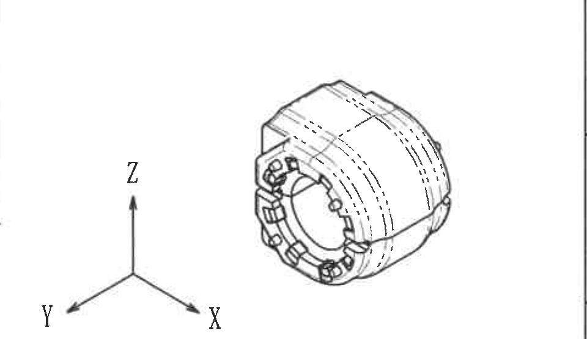

| 项目 | 内容 |
|---|---|
| 原图位置/视图名称 | 轴测图/三维示意视图 |
| object_kind | view |
| page_number | 1 |
| bbox | [3805, 1485, 4765, 2040] |

### 提取表格

| 提取项 | 原图数值或文本 | 含义说明 |
|---|---|---|
| 坐标方向 | X、Y、Z | 轴测图坐标方向。 |
| 三维外观 | 轴测外形、前端孔口、侧面弧面、隐线轮廓 | 用于表达零件三维形态。 |
| 尺寸 | 无独立尺寸数值 | 轴测图未标出尺寸、公差或关键符号。 |

### 边界归属说明

边界含完整轴测图和X/Y/Z坐标轴；已排除左侧A-A剖面38±0.8尺寸线。

## object_9 - 技术要求/NOTES

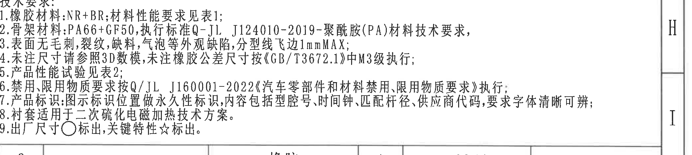

| 项目 | 内容 |
|---|---|
| 原图位置/视图名称 | 技术要求/NOTES |
| object_kind | notes |
| page_number | 1 |
| bbox | [2760, 2035, 4855, 2505] |

### 提取表格

| 提取项 | 原图数值或文本 | 含义说明 |
|---|---|---|
| 1 | 橡胶材料:NR+BR;材料性能要求见表1 | 材料及表1引用。 |
| 2 | 骨架材料:PA66+GF50,执行标准Q-JL J124010-2019-聚酰胺(PA)材料技术要求 | 骨架材料和标准。 |
| 3 | 表面无毛刺,裂纹,缺料,气泡等外观缺陷,分型线飞边1mmMAX | 外观和飞边最大值。 |
| 4 | 未注尺寸请参照3D数模,未注橡胶公差尺寸按《GB/T3672.1》中M3级执行 | 未注尺寸和橡胶公差等级。 |
| 5 | 产品性能试验见表2 | 产品性能试验引用。 |
| 6 | 禁用、限用物质要求按Q/JL J160001-2022执行 | 禁限用物质标准。 |
| 7 | 产品标识内容包括型腔号、时间钟、匹配杆径、供应商代码 | 标识位置和内容要求，和主视图标识说明对应。 |
| 8 | 衬套适用于二次硫化电磁加热技术方案 | 工艺方案。 |
| 9 | 出厂尺寸○标出,关键特性☆标出 | 解释○和☆符号含义，主视图Ø23±0.3☆为关键特性。 |

### 边界归属说明

边界含技术要求1-9；底部BOM表格不归入该对象。

## object_10 - 明细/BOM表

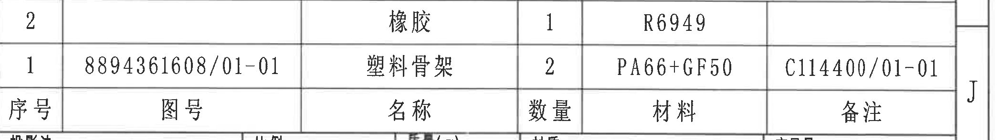

| 项目 | 内容 |
|---|---|
| 原图位置/视图名称 | 明细/BOM表 |
| object_kind | table |
| page_number | 1 |
| bbox | [2760, 2475, 4855, 2770] |

### 原表还原

| 序号 | 图号 | 名称 | 数量 | 材料 | 备注 |
|---|---|---|---|---|---|
| 2 |  | 橡胶 | 1 | R6949 |  |
| 1 | 8894361608/01-01 | 塑料骨架 | 2 | PA66+GF50 | C114400/01-01 |

### 提取表格

| 提取项 | 原图数值或文本 | 含义说明 |
|---|---|---|
| 序号2 | 名称:橡胶；数量:1；材料:R6949；图号/备注空 | BOM橡胶件。 |
| 序号1 | 图号:8894361608/01-01；名称:塑料骨架；数量:2；材料:PA66+GF50；备注:C114400/01-01 | BOM塑料骨架。 |

### 边界归属说明

边界含BOM表的表头和两条明细；下方标题栏投影法/比例等不归入该对象。

## object_11 - 标题栏

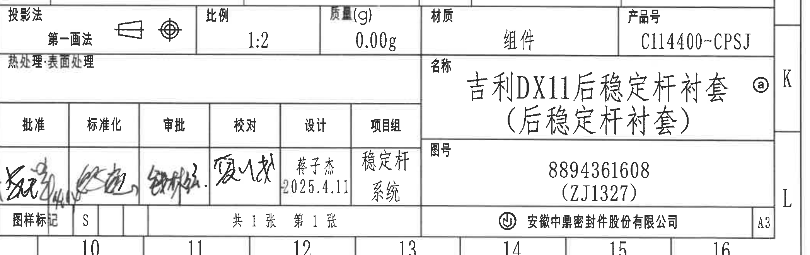

| 项目 | 内容 |
|---|---|
| 原图位置/视图名称 | 标题栏 |
| object_kind | title_block |
| page_number | 1 |
| bbox | [2760, 2740, 4855, 3400] |

### 提取表格

| 提取项 | 原图数值或文本 | 含义说明 |
|---|---|---|
| 投影法 | 第一画法 | 图样投影法。 |
| 比例 | 1:2 | 图样比例。 |
| 质量(g) | 0.00g | 质量栏。 |
| 材质 | 组件 | 装配/组件属性。 |
| 产品号 | C114400-CPSJ | 产品编号。 |
| 名称 | 吉利DX11后稳定杆衬套(后稳定杆衬套) ⓐ | 标题栏名称，ⓐ对应修订履历变更标记。 |
| 图号 | 8894361608 (ZJ1327) | 图号及括号内代号。 |
| 设计 | 蒋子杰 2025.4.11 | 设计人及日期。 |
| 项目组 | 稳定杆系统 | 项目组。 |
| 图样标记 | S | 图样标记。 |
| 张数 | 共1张 第1张 | 图纸页数。 |
| 公司/图幅 | 安徽中鼎密封件股份有限公司；A3 | 公司和图幅。 |
| 批准/标准化/审批/校对 | 手写签名，未可靠辨识 | 签名存在但笔迹无法可靠转写。 |

### 边界归属说明

边界含标题栏主体和签署栏；上方BOM明细归object_10，仅少量上边线作为边界参照。

## 裁切检查记录

| 裁切对象 | 检查结论 |
|---|---|
| object_1 | 完整。表1标题、三列表头、所有行和右侧要求列完整；未丢边缘文字。 |
| object_2 | 完整。表2下边已重裁，粘接试验行完整；未截断底部文字。 |
| object_3 | 完整。产品信息表所有列和唯一数据行完整。 |
| object_4 | 完整。手写说明框和文字完整；未把表3内容并入。 |
| object_5 | 完整。修订履历右侧日期、变更者列已重裁包含；来源列小字可见。 |
| object_6 | 完整。主视图左侧Ø23±0.3☆泡框、R23±0.5泡框、底部尺寸线和右侧说明完整。 |
| object_7 | 完整。A-A剖面(29)参考尺寸、38±0.8外形尺寸线和剖面名完整；未混入轴测图。 |
| object_8 | 完整。轴测图和X/Y/Z坐标完整；已重裁排除A-A剖面尺寸线。 |
| object_9 | 完整。技术要求1-9完整；左侧起始字符可见，底部未并入BOM。 |
| object_10 | 完整。BOM两行和表头完整；下方标题栏内容不归入。 |
| object_11 | 完整。标题栏字段、名称、图号、签署栏和公司/图幅完整；BOM归属另列。 |
