# 20C114401 内容识别结果

整页渲染图：`20C114401_assets/images/page_1.png`  
页面尺寸：4959 x 3505 px

## object_1 - 表1:橡胶材料试验

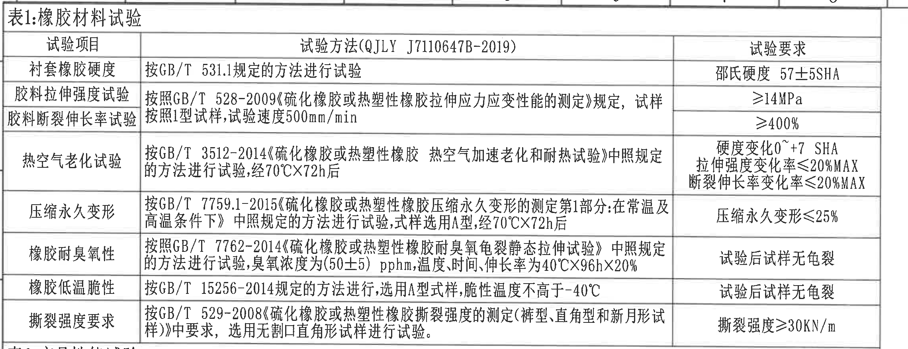

**原图位置/视图名称**：第 1 页左上，bbox `[360,150,2640,1030]`，表1:橡胶材料试验。

### 原表还原

| 试验项目 | 试验方法(QJLY J7110647B-2019) | 试验要求 |
|---|---|---|
| 衬套橡胶硬度 | 按GB/T 531.1规定的方法进行试验 | 邵氏硬度 57±5SHA |
| 胶料拉伸强度试验 | 按照GB/T 528-2009《硫化橡胶或热塑性橡胶拉伸应力应变性能的测定》规定，试样按照1型试样,试验速度500mm/min | ≥14MPa |
| 胶料断裂伸长率试验 | 同上合并单元格 | ≥400% |
| 热空气老化试验 | 按GB/T 3512-2014《硫化橡胶或热塑性橡胶 热空气加速老化和耐热试验》中照规定的方法进行试验,经70℃X72h后 | 硬度变化0~+7 SHA；拉伸强度变化率≤20%MAX；断裂伸长率变化率≤20%MAX |
| 压缩永久变形 | 按GB/T 7759.1-2015《硫化橡胶或热塑性橡胶压缩永久变形的测定第1部分:在常温及高温条件下》中照规定的方法进行试验,试样选用A型,经70℃X72h后 | 压缩永久变形≤25% |
| 橡胶耐臭氧性 | 按照GB/T 7762-2014《硫化橡胶或热塑性橡胶耐臭氧龟裂静态拉伸试验》中照规定的方法进行试验,臭氧浓度为(50±5) pphm,温度、时间、伸长率为40℃X96hX20% | 试验后试样无龟裂 |
| 橡胶低温脆性 | 按GB/T 15256-2014规定的方法进行,选用A型式样,脆性温度不高于-40℃ | 试验后试样无龟裂 |
| 撕裂强度要求 | 按GB/T 529-2008《硫化橡胶或热塑性橡胶撕裂强度的测定(裤型、直角型和新月形试样)》中要求，选用无割口直角形试样进行试验。 | 撕裂强度≥30KN/m |

### 提取表

| 提取项 | 原图数值或文本 | 含义说明 | 边界归属说明 |
|---|---|---|---|
| 表题 | 表1:橡胶材料试验 | 橡胶材料试验项目总表 | 属于左上表1区域 |
| 硬度要求 | 邵氏硬度 57±5SHA | 衬套橡胶硬度要求 | 表1第1行 |
| 拉伸强度 | ≥14MPa | 胶料拉伸强度最低要求 | 表1第2行 |
| 断裂伸长率 | ≥400% | 胶料断裂伸长率最低要求 | 表1第3行 |
| 老化后硬度变化 | 0~+7 SHA | 热空气老化后的硬度变化范围 | 表1第4行 |
| 老化后拉伸强度变化率 | ≤20%MAX | 热空气老化后的拉伸强度变化率上限 | 表1第4行 |
| 老化后断裂伸长率变化率 | ≤20%MAX | 热空气老化后的断裂伸长率变化率上限 | 表1第4行 |
| 压缩永久变形 | ≤25% | 压缩永久变形上限 | 表1第5行 |
| 臭氧试验条件 | (50±5) pphm, 40℃X96hX20% | 臭氧浓度、温度时间和伸长率条件 | 表1第6行 |
| 低温脆性条件 | 不高于-40℃ | 低温脆性试验温度要求 | 表1第7行 |
| 撕裂强度 | ≥30KN/m | 撕裂强度最低要求 | 表1第8行 |
| 边界归属 | 表1底部与表2相邻 | 底部仅有相邻表格边界，不提取表2内容 | 当前对象只提取表1 |

## object_2 - 表2:产品性能试验

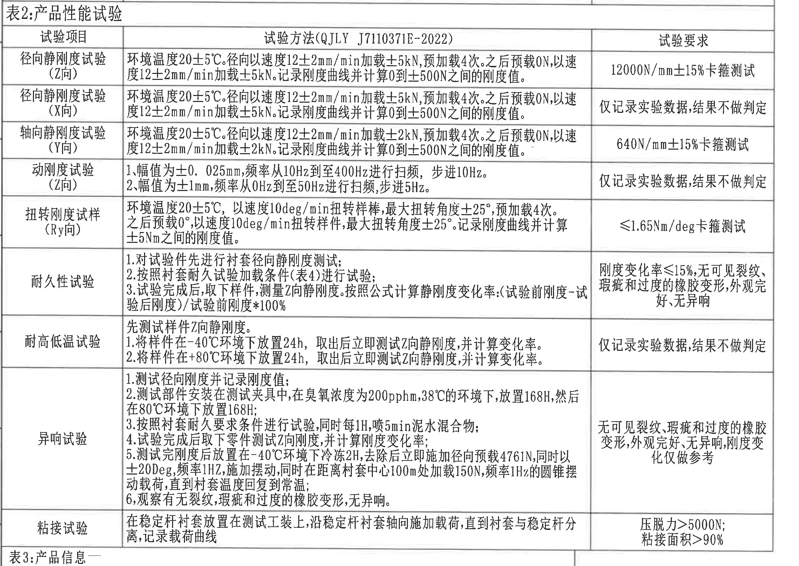

**原图位置/视图名称**：第 1 页左中，bbox `[360,1010,2640,2625]`，表2:产品性能试验。

### 原表还原

| 试验项目 | 试验方法(QJLY J7110371E-2022) | 试验要求 |
|---|---|---|
| 径向静刚度试验(Z向) | 环境温度20±5℃。径向以速度12±2mm/min加载±5kN,预加载4次。之后预载0N,以速度12±2mm/min加载±5kN。记录刚度曲线并计算0到±500N之间的刚度值。 | 12000N/mm±15%卡箍测试 |
| 径向静刚度试验(X向) | 环境温度20±5℃。径向以速度12±2mm/min加载±5kN,预加载4次。之后预载0N,以速度12±2mm/min加载±5kN。记录刚度曲线并计算0到±500N之间的刚度值。 | 仅记录实验数据,结果不做判定 |
| 轴向静刚度试验(Y向) | 环境温度20±5℃。径向以速度12±2mm/min加载±2kN,预加载4次。之后预载0N,以速度12±2mm/min加载±2kN。记录刚度曲线并计算0到±500N之间的刚度值。 | 640N/mm±15%卡箍测试 |
| 动刚度试验(Z向) | 1.幅值为±0.025mm,频率从10Hz到至400Hz进行扫频，步进10Hz。 2.幅值为±1mm,频率从0Hz到至50Hz进行扫频,步进5Hz。 | 仅记录实验数据,结果不做判定 |
| 扭转刚度试样(Ry向) | 环境温度20±5℃，以速度10deg/min扭转样棒,最大扭转角度±25°,预加载4次。之后预载0°,以速度10deg/min扭转样件,最大扭转角度±25°。记录刚度曲线并计算±5Nm之间的刚度值。 | ≤1.65Nm/deg卡箍测试 |
| 耐久性试验 | 1.对试验件先进行衬套径向静刚度测试； 2.按照衬套耐久试验加载条件(表4)进行试验； 3.试验完成后,取下样件,测量Z向静刚度。按照公式计算静刚度变化率:(试验前刚度-试验后刚度)/试验前刚度*100% | 刚度变化率≤15%,无可见裂纹、瑕疵和过度的橡胶变形,外观完好,无异响 |
| 耐高低温试验 | 先测试样件Z向静刚度。 1.将样件在-40℃环境下放置24h,取出后立即测试Z向静刚度,并计算变化率。 2.将样件在+80℃环境下放置24h,取出后立即测试Z向静刚度,并计算变化率。 | 仅记录实验数据,结果不做判定 |
| 异响试验 | 1.测试径向刚度并记录刚度值； 2.测试部件安装在测试夹具中,在臭氧浓度为200pphm,38℃的环境下,放置168H,然后在80℃环境下放置168H； 3.按照衬套耐久要求条件进行试验,同时每1H,喷5min泥水混合物； 4.试验完成后取下零件测试Z向刚度,并计算刚度变化率； 5.测试完刚度后放置在-40℃环境下冷冻2H,去除后立即施加径向预载4761N,同时以±20Deg,频率1Hz,施加摆动,同时在距离衬套中心100m处加载150N,频率1Hz的圆锥摆动载荷,直到衬套温度回复到常温； 6.观察有无裂纹,瑕疵和过度的橡胶变形,无异响。 | 无可见裂纹、瑕疵和过度的橡胶变形,外观完好,无异响,刚度变化仅做参考 |
| 粘接试验 | 在稳定杆衬套放置在测试工装上,沿稳定杆衬套轴向施加载荷,直到衬套与稳定杆分离,记录载荷曲线 | 压脱力>5000N; 粘接面积>90% |

### 提取表

| 提取项 | 原图数值或文本 | 含义说明 | 边界归属说明 |
|---|---|---|---|
| 表题 | 表2:产品性能试验 | 产品性能试验总表 | 属于左中表2区域 |
| Z向径向静刚度 | 12000N/mm±15%卡箍测试 | Z向径向静刚度判定要求 | 表2第1行 |
| X向径向静刚度 | 仅记录实验数据,结果不做判定 | X向径向刚度仅记录 | 表2第2行 |
| Y向轴向静刚度 | 640N/mm±15%卡箍测试 | Y向轴向静刚度判定要求 | 表2第3行 |
| 动刚度幅值1 | ±0.025mm; 10Hz到至400Hz; 步进10Hz | 动刚度扫频条件之一 | 表2第4行 |
| 动刚度幅值2 | ±1mm; 0Hz到至50Hz; 步进5Hz | 动刚度扫频条件之二 | 表2第4行 |
| 扭转刚度角度 | ±25° | 最大扭转角度 | 表2第5行 |
| 扭转刚度要求 | ≤1.65Nm/deg | 扭转刚度上限 | 表2第5行 |
| 耐久刚度变化率 | ≤15% | 耐久试验后刚度变化率上限 | 表2第6行 |
| 高低温条件 | -40℃ 24h; +80℃ 24h | 高低温试验条件 | 表2第7行 |
| 异响试验臭氧条件 | 200pphm, 38℃, 168H | 异响试验前处理条件 | 表2第8行 |
| 异响试验预载 | 4761N; ±20Deg; 1Hz; 150N; 1Hz | 异响试验加载条件 | 表2第8行 |
| 粘接试验要求 | 压脱力>5000N; 粘接面积>90% | 粘接强度和面积要求 | 表2第9行 |
| 边界归属 | 底部露出表3标题上缘 | 为完整保留粘接试验行底线而带入相邻表3表题边缘；表3内容不归入表2 | 当前对象只提取表2 |

## object_3 - 表3:产品信息

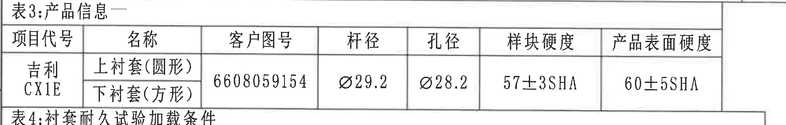

**原图位置/视图名称**：第 1 页左下中部，bbox `[360,2575,2145,2860]`，表3:产品信息。

### 原表还原

| 项目代号 | 名称 | 客户图号 | 杆径 | 孔径 | 样块硬度 | 产品表面硬度 |
|---|---|---|---|---|---|---|
| 吉利 CX1E | 上衬套(圆形) | 6608059154 | Ø29.2 | Ø28.2 | 57±3SHA | 60±5SHA |
| 吉利 CX1E | 下衬套(方形) | 6608059154 | Ø29.2 | Ø28.2 | 57±3SHA | 60±5SHA |

### 提取表

| 提取项 | 原图数值或文本 | 含义说明 | 边界归属说明 |
|---|---|---|---|
| 表题 | 表3:产品信息 | 产品基础信息 | 属于左下表3区域 |
| 项目代号 | 吉利 CX1E | 项目平台/项目代码 | 表3左侧合并单元格 |
| 名称 | 上衬套(圆形); 下衬套(方形) | 两种衬套形态 | 表3名称列 |
| 客户图号 | 6608059154 | 客户图号 | 表3客户图号合并单元格 |
| 杆径 | Ø29.2 | 稳定杆杆径，直径符号标注 | 表3杆径列 |
| 孔径 | Ø28.2 | 衬套孔径，直径符号标注 | 表3孔径列 |
| 样块硬度 | 57±3SHA | 样块硬度公差 | 表3样块硬度列 |
| 产品表面硬度 | 60±5SHA | 产品表面硬度公差 | 表3产品表面硬度列 |
| 边界归属 | 底部邻接表4标题 | 底部可见表4标题上缘，未提取为表3内容 | 当前对象只提取表3 |

## object_4 - 表4:衬套耐久试验加载条件

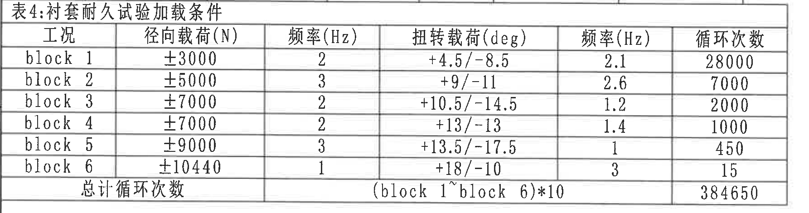

**原图位置/视图名称**：第 1 页左下，bbox `[360,2820,2145,3290]`，表4:衬套耐久试验加载条件。

### 原表还原

| 工况 | 径向载荷(N) | 频率(Hz) | 扭转载荷(deg) | 频率(Hz) | 循环次数 |
|---|---:|---:|---|---:|---:|
| block 1 | ±3000 | 2 | +4.5/-8.5 | 2.1 | 28000 |
| block 2 | ±5000 | 3 | +9/-11 | 2.6 | 7000 |
| block 3 | ±7000 | 2 | +10.5/-14.5 | 1.2 | 2000 |
| block 4 | ±7000 | 2 | +13/-13 | 1.4 | 1000 |
| block 5 | ±9000 | 3 | +13.5/-17.5 | 1 | 450 |
| block 6 | ±10440 | 1 | +18/-10 | 3 | 15 |
| 总计循环次数 |  |  | (block 1~block 6)*10 |  | 384650 |

### 提取表

| 提取项 | 原图数值或文本 | 含义说明 | 边界归属说明 |
|---|---|---|---|
| 表题 | 表4:衬套耐久试验加载条件 | 耐久试验载荷谱 | 属于左下表4区域 |
| 径向载荷范围 | ±3000, ±5000, ±7000, ±9000, ±10440 N | 各 block 径向载荷 | 表4径向载荷列 |
| 扭转载荷范围 | +4.5/-8.5 到 +18/-10 deg | 各 block 扭转角度载荷 | 表4扭转载荷列 |
| 频率 | 1, 1.2, 1.4, 2, 2.1, 2.6, 3 Hz | 径向/扭转载荷频率 | 表4两列频率 |
| 循环次数 | 28000, 7000, 2000, 1000, 450, 15 | 各工况循环次数 | 表4循环次数列 |
| 总计循环次数 | 384650 | 总循环次数 | 表4最后一行 |
| 边界归属 | 四周仅表4边框 | 无其他视图或表格内容进入 | 当前对象只提取表4 |

## object_5 - 修订履历表

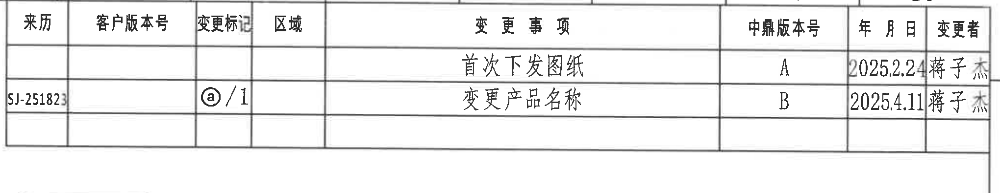

**原图位置/视图名称**：第 1 页右上，bbox `[2745,170,4785,565]`，修订履历表。

### 原表还原

| 来历 | 客户版本号 | 变更标记 | 区域 | 变更事项 | 中鼎版本号 | 年月日 | 变更者 |
|---|---|---|---|---|---|---|---|
|  |  |  |  | 首次下发图纸 | A | 2025.2.24 | 蒋子杰 |
| SJ-251823 |  | ⓐ/1 |  | 变更产品名称 | B | 2025.4.11 | 蒋子杰 |

### 提取表

| 提取项 | 原图数值或文本 | 含义说明 | 边界归属说明 |
|---|---|---|---|
| 修订 A | 首次下发图纸; 中鼎版本号 A; 2025.2.24; 变更者 蒋子杰 | 首次下发记录 | 修订履历表第1条 |
| 修订 B | 来历 SJ-251823; 变更标记 ⓐ/1; 变更产品名称; 中鼎版本号 B; 2025.4.11; 变更者 蒋子杰 | 产品名称变更记录 | 修订履历表第2条 |
| 边界归属 | 右侧邻近图框 A/B 字母 | 图框坐标不属于修订履历 | 当前对象只提取修订表 |

## object_6 - 主视图

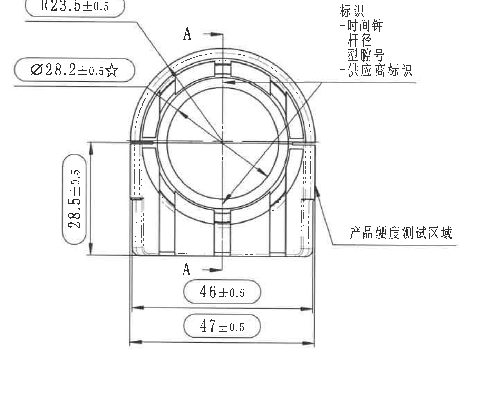

**原图位置/视图名称**：第 1 页右中，bbox `[2700,590,4105,1790]`，零件主视图。

### 提取表

| 提取项 | 原图数值或文本 | 含义说明 | 边界归属说明 |
|---|---|---|---|
| 半径尺寸 | R23.5±0.5 | 主视图上部弧形外轮廓半径，带 ±0.5 公差 | 引线指向主视图上部弧线，属于主视图 |
| 孔径/关键尺寸 | Ø28.2±0.5☆ | 主视图圆孔直径，带直径符号和星号；星号按技术要求为关键特性标出 | 引线指向中心孔，属于主视图 |
| 竖向尺寸 | 28.5±0.5 | 主视图左侧竖向尺寸，带 ±0.5 公差 | 尺寸线和箭头均在主视图左侧 |
| 横向尺寸 | 46±0.5 | 主视图下方横向尺寸，带 ±0.5 公差 | 上层水平尺寸线归属主视图 |
| 横向总宽 | 47±0.5 | 主视图下方总宽尺寸，带 ±0.5 公差 | 下层水平尺寸线归属主视图 |
| 剖切标识 | A, A | 指示 A-A 剖切位置和方向 | A-A 剖面尺寸不归入主视图 |
| 产品硬度测试区域 | 产品硬度测试区域 | 右侧引出线标出硬度测试区域 | 该引出文字和线归属主视图 |
| 标识内容 | 标识: -时间钟 -杆径 -型腔号 -供应商标识 | 主视图右上标识要求 | 该文本和引线归属主视图 |
| T编号 | 未见T编号 | 当前主视图未出现 T 编号 | 不从相邻视图推断 |
| 边界归属 | 右侧 A-A 剖面、下方等轴测均未纳入 | 只提取主视图本体、尺寸线、引线和文字 | 剖面尺寸 `(27)` 与 `2X39.5±0.5` 不归入主视图 |

## object_7 - A-A 剖面视图

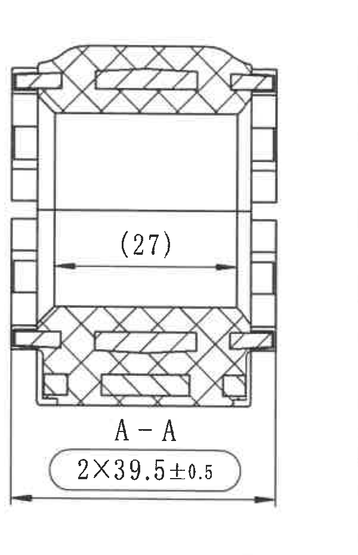

**原图位置/视图名称**：第 1 页右中偏上，bbox `[4150,660,4750,1590]`，A-A 剖面。

### 提取表

| 提取项 | 原图数值或文本 | 含义说明 | 边界归属说明 |
|---|---|---|---|
| 剖面名称 | A-A | 与主视图 A 剖切线对应的剖面视图 | 本对象为剖面视图 |
| 参考尺寸 | (27) | 括号内尺寸，表示参考尺寸；位于剖面内部水平尺寸线上 | 属于 A-A 剖面，不归入主视图 |
| 数量前缀尺寸 | 2X39.5±0.5 | 2X 表示两处；剖面底部横向尺寸，带 ±0.5 公差 | 尺寸线和文字完全位于 A-A 剖面对象内 |
| 剖面填充 | 剖面线/网格填充 | 表示被剖切材料区域 | 属于 A-A 剖面 |
| T编号 | 未见T编号 | 当前剖面视图未出现 T 编号 | 不从相邻视图推断 |
| 边界归属 | 下方等轴测未纳入 | 只提取 A-A 剖面及其两条尺寸 | 主视图尺寸不归入 A-A |

## object_8 - 等轴测视图与坐标示意

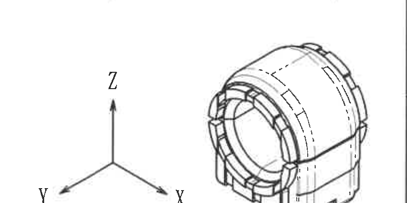

**原图位置/视图名称**：第 1 页右中偏下，bbox `[3940,1515,4760,1925]`，等轴测视图与 X/Y/Z 坐标示意。

### 提取表

| 提取项 | 原图数值或文本 | 含义说明 | 边界归属说明 |
|---|---|---|---|
| 等轴测视图 | 零件三维外形示意 | 展示衬套三维外形、开槽和外部轮廓 | 属于右下等轴测区域 |
| 坐标轴 | X, Y, Z | 表示图中方向坐标 | 属于等轴测视图旁坐标示意 |
| 尺寸标注 | 未见尺寸数值 | 该对象无单独尺寸线或公差 | 不从 A-A 或 NOTES 中归入尺寸 |
| T编号 | 未见T编号 | 当前等轴测视图未出现 T 编号 | 不从其他区域推断 |
| 边界归属 | 下缘邻近技术要求文字 | 图像底部邻近 NOTES，技术要求文字不归入本对象 | 当前对象只提取等轴测和坐标轴 |

## object_9 - 技术要求 NOTES

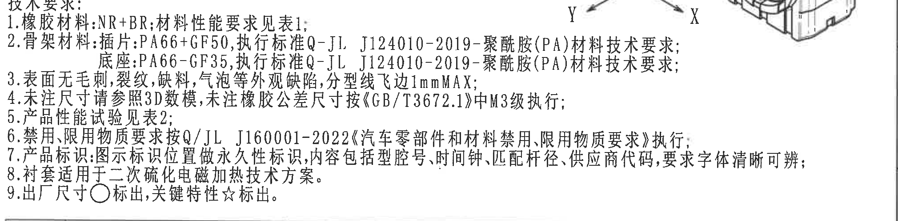

**原图位置/视图名称**：第 1 页右中下，bbox `[2740,1880,4760,2380]`，技术要求。

### 提取表

| 提取项 | 原图数值或文本 | 含义说明 | 边界归属说明 |
|---|---|---|---|
| 标题 | 技术要求: | 技术要求说明区标题 | 属于 NOTES 区域 |
| 1 | 橡胶材料:NR+BR;材料性能要求见表1; | 橡胶材料和对应材料性能表 | NOTES 第1条 |
| 2 | 骨架材料:插片:PA66+GF50,执行标准Q-JL J124010-2019-聚酰胺(PA)材料技术要求; 底座:PA66-GF35,执行标准Q-JL J124010-2019-聚酰胺(PA)材料技术要求; | 骨架材料和标准 | NOTES 第2条 |
| 3 | 表面无毛刺,裂纹,缺料,气泡等外观缺陷,分型线飞边1mmMAX; | 外观缺陷限制和飞边最大值 | NOTES 第3条 |
| 4 | 未注尺寸请参照3D数模,未注橡胶公差尺寸按《GB/T3672.1》中M3级执行; | 未注尺寸和橡胶公差执行依据 | NOTES 第4条 |
| 5 | 产品性能试验见表2; | 产品性能试验引用表2 | NOTES 第5条 |
| 6 | 禁用、限用物质要求按Q/JL J160001-2022《汽车零部件和材料禁用限用物质要求》执行; | 禁限用物质标准 | NOTES 第6条 |
| 7 | 产品标识:图示标识位置做永久性标识,内容包括型腔号、时间钟、匹配杆径、供应商代码,要求字体清晰可辨; | 产品标识位置和内容要求 | NOTES 第7条 |
| 8 | 衬套适用于二次硫化电磁加热技术方案。 | 工艺适用性要求 | NOTES 第8条 |
| 9 | 出厂尺寸○标出,关键特性☆标出。 | 圆圈表示出厂尺寸，星号表示关键特性 | NOTES 第9条 |
| 边界归属 | 右上邻近等轴测/坐标示意 | 右上可见邻近示意图残留，不作为 NOTES 文本提取 | 当前对象只提取技术要求文字 |

## object_10 - 明细表

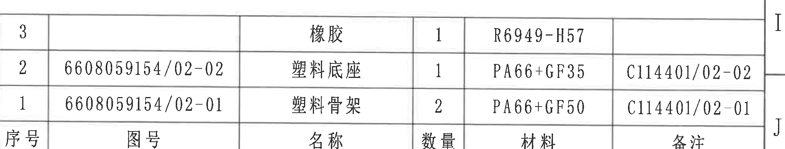

**原图位置/视图名称**：第 1 页右下标题栏上方，bbox `[2760,2340,4810,2730]`，明细表。

### 原表还原

| 序号 | 图号 | 名称 | 数量 | 材料 | 备注 |
|---|---|---|---:|---|---|
| 3 |  | 橡胶 | 1 | R6949-H57 |  |
| 2 | 6608059154/02-02 | 塑料底座 | 1 | PA66+GF35 | C114401/02-02 |
| 1 | 6608059154/02-01 | 塑料骨架 | 2 | PA66+GF50 | C114401/02-01 |

### 提取表

| 提取项 | 原图数值或文本 | 含义说明 | 边界归属说明 |
|---|---|---|---|
| 表头 | 序号, 图号, 名称, 数量, 材料, 备注 | 零件明细表列名 | 属于明细表 |
| 序号3 | 橡胶; 数量1; 材料R6949-H57 | 橡胶件明细 | 明细表第3行 |
| 序号2 | 6608059154/02-02; 塑料底座; 数量1; PA66+GF35; C114401/02-02 | 塑料底座明细 | 明细表第2行 |
| 序号1 | 6608059154/02-01; 塑料骨架; 数量2; PA66+GF50; C114401/02-01 | 塑料骨架明细 | 明细表第1行 |
| 边界归属 | 右侧邻近图框坐标 | 图框 I/J 不属于明细表内容 | 当前对象只提取明细表 |

## object_11 - 尺寸范围公差表

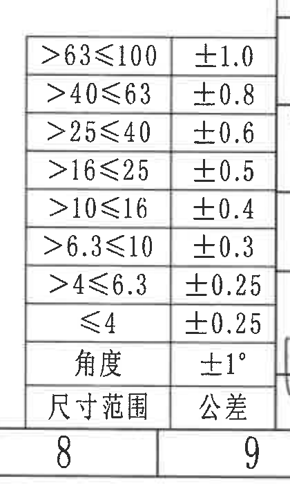

**原图位置/视图名称**：第 1 页下方中部，bbox `[2350,2725,2770,3425]`，尺寸范围公差表。

### 原表还原

| 尺寸范围 | 公差 |
|---|---|
| >63≤100 | ±1.0 |
| >40≤63 | ±0.8 |
| >25≤40 | ±0.6 |
| >16≤25 | ±0.5 |
| >10≤16 | ±0.4 |
| >6.3≤10 | ±0.3 |
| >4≤6.3 | ±0.25 |
| ≤4 | ±0.25 |
| 角度 | ±1° |

### 提取表

| 提取项 | 原图数值或文本 | 含义说明 | 边界归属说明 |
|---|---|---|---|
| 表头 | 尺寸范围; 公差 | 未注尺寸范围对应普通公差 | 表头在原图底部行显示 |
| 线性尺寸公差 | >63≤100: ±1.0; >40≤63: ±0.8; >25≤40: ±0.6; >16≤25: ±0.5; >10≤16: ±0.4; >6.3≤10: ±0.3; >4≤6.3: ±0.25; ≤4: ±0.25 | 未注线性尺寸公差 | 当前公差表对象 |
| 角度公差 | 角度 ±1° | 未注角度公差 | 当前公差表对象 |
| 边界归属 | 底部有图框格号8/9 | 图框格号不属于公差表内容 | 当前对象只提取公差表 |

## object_12 - 标题栏

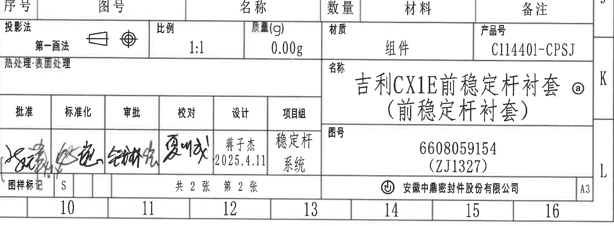

**原图位置/视图名称**：第 1 页右下，bbox `[2760,2685,4825,3445]`，标题栏和签署栏。

### 提取表

| 提取项 | 原图数值或文本 | 含义说明 | 边界归属说明 |
|---|---|---|---|
| 投影法 | 第一画法 | 投影法字段，带投影符号 | 标题栏左上 |
| 比例 | 1:1 | 图纸比例 | 标题栏比例字段 |
| 质量(g) | 0.00g | 质量字段 | 标题栏质量字段 |
| 材质 | 组件 | 总成材质/类别字段 | 标题栏材质字段 |
| 产品号 | C114401-CPSJ | 产品编号 | 标题栏产品号字段 |
| 名称 | 吉利CX1E前稳定杆衬套(前稳定杆衬套) ⓐ | 图纸名称，带变更标记 ⓐ | 标题栏名称字段 |
| 图号 | 6608059154 (ZJ1327) | 图纸编号 | 标题栏图号字段 |
| 热处理/表面处理 | 热处理·表面处理 | 原图仅见字段名，未见填写值 | 标题栏对应字段 |
| 签署栏 | 批准、标准化、审批、校对、设计、项目组 | 签署流程栏 | 标题栏签署区 |
| 设计 | 蒋子杰 2025.4.11 | 设计人员和日期 | 标题栏设计栏 |
| 项目组 | 稳定杆系统 | 项目组名称 | 标题栏项目组栏 |
| 图样标记 | S | 图样标记 | 标题栏底部 |
| 页数 | 共2张 第2张 | 图纸页数信息 | 标题栏底部 |
| 公司 | 安徽中鼎密封件股份有限公司 | 出图单位 | 标题栏右下 |
| 图幅 | A3 | 图幅 | 标题栏最右下 |
| 边界归属 | 顶部邻接明细表表头，右侧/底部邻接图框坐标 | 明细表内容由 object_10 提取；图框坐标不属于标题栏字段 | 当前对象只提取标题栏和签署栏 |

## 裁切检查记录

| 对象 | 图片路径 | 检查结果 | 重裁/归属说明 |
|---|---|---|---|
| 整页 | outputs/20C114401_assets/images/page_1.png | 完整渲染整页，尺寸 4959 x 3505 px | 由 PDF 300dpi 渲染 |
| object_1 | outputs/20C114401_assets/images/object_1.png | 表1文字和边框完整 | 初版底部缺少撕裂强度行下部，已重裁；底部邻接表2但不提取 |
| object_2 | outputs/20C114401_assets/images/object_2.png | 表2所有行文字完整，含粘接试验 | 初版底部截断粘接试验，已重裁；底部露出表3标题边缘，不归入表2 |
| object_3 | outputs/20C114401_assets/images/object_3.png | 表3表头和数据完整 | 初版上方混入表2末行，已重裁；底部邻接表4标题边缘，不归入表3 |
| object_4 | outputs/20C114401_assets/images/object_4.png | 表4边框、表头、所有 block 和总计行完整 | 已排除表3内容 |
| object_5 | outputs/20C114401_assets/images/object_5.png | 修订履历表表头和两条记录完整 | 右侧邻近图框 A/B 字母不提取 |
| object_6 | outputs/20C114401_assets/images/object_6.png | 主视图所有尺寸线、箭头、文字完整 | 初版右侧“产品硬度测试区域”文字被截，已扩边重裁 |
| object_7 | outputs/20C114401_assets/images/object_7.png | A-A 剖面、(27)、2X39.5±0.5 完整 | 初版混入图框和等轴测，已重裁 |
| object_8 | outputs/20C114401_assets/images/object_8.png | 等轴测和 X/Y/Z 坐标示意主体完整 | 下缘邻近 NOTES，技术要求文字不归入本对象 |
| object_9 | outputs/20C114401_assets/images/object_9.png | 技术要求 1-9 条文字完整 | 右上邻近等轴测残留不作为 NOTES 内容提取 |
| object_10 | outputs/20C114401_assets/images/object_10.png | 明细表表头和三条物料记录完整 | 右侧邻近图框坐标不提取 |
| object_11 | outputs/20C114401_assets/images/object_11.png | 公差表所有尺寸范围、角度、公差文字完整 | 初版底部“尺寸范围/公差”行被截，已重裁；图框格号不提取 |
| object_12 | outputs/20C114401_assets/images/object_12.png | 标题栏主要字段、签署栏、公司、A3 完整 | 为保留投影法和签署区，顶部共享明细表边界；明细表由 object_10 提取 |
