# 20C114402 图纸内容识别

整页 PNG：`outputs/20C114402_assets/images/page_1.png`  
PDF：`input/20C114402.pdf`  
整页像素：6612 x 4673

## object_2 表1：橡胶材料试验

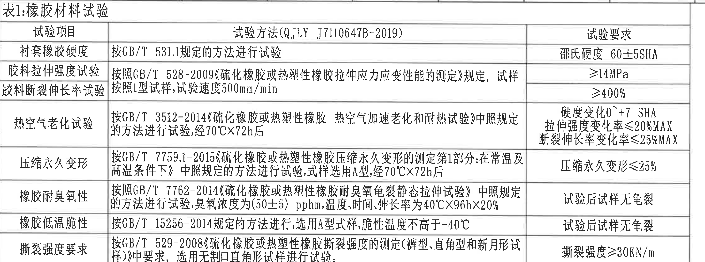

原图位置/视图名称：左上区域，表1：橡胶材料试验；bbox `[500, 220, 3005, 1120]`。

原表还原：

| 试验项目 | 试验方法(QJLY J7110647B-2019) | 试验要求 |
|---|---|---|
| 衬套橡胶硬度 | 按GB/T 531.1规定的方法进行试验 | 邵氏硬度 60±5SHA |
| 胶料拉伸强度试验 | 按照GB/T 528-2009《硫化橡胶或热塑性橡胶拉伸应力应变性能的测定》规定，试样按照1型试样，试验速度500mm/min | ≥14MPa |
| 胶料断裂伸长率试验 | 按照GB/T 528-2009《硫化橡胶或热塑性橡胶拉伸应力应变性能的测定》规定，试样按照1型试样，试验速度500mm/min | ≥400% |
| 热空气老化试验 | 按GB/T 3512-2014《硫化橡胶或热塑性橡胶 热空气加速老化和耐热试验》中规定的方法进行试验，经70℃X72h后 | 硬度变化0~+7 SHA；拉伸强度变化率≤20%MAX；断裂伸长率变化率≤25%MAX |
| 压缩永久变形 | 按GB/T 7759.1-2015《硫化橡胶或热塑性橡胶压缩永久变形的测定第1部分:在常温及高温条件下》中规定的方法进行试验，试样选用A型，经70℃X72h后 | 压缩永久变形≤25% |
| 橡胶耐臭氧性 | 按照GB/T 7762-2014《硫化橡胶或热塑性橡胶耐臭氧龟裂静态拉伸试验》中规定的方法进行试验，臭氧浓度为(50±5) pphm，温度、时间、伸长率为40℃X96hX20% | 试验后试样无龟裂 |
| 橡胶低温脆性 | 按GB/T 15256-2014规定的方法进行，选用A型试样，脆性温度不高于-40℃ | 试验后试样无龟裂 |
| 撕裂强度要求 | 按GB/T 529-2008《硫化橡胶或热塑性橡胶撕裂强度的测定(裤型、直角型和新月形试样)》中要求，选用无割口直角形试样进行试验。 | 撕裂强度≥30KN/m |

提取表：

| 提取项 | 原图数值或文本 | 含义说明 |
|---|---|---|
| 材料硬度 | 60±5SHA | 衬套橡胶邵氏硬度要求。 |
| 拉伸强度 | ≥14MPa | 胶料拉伸强度下限。 |
| 断裂伸长率 | ≥400% | 胶料断裂伸长率下限。 |
| 老化后硬度变化 | 0~+7 SHA | 热空气老化后硬度允许变化范围。 |
| 老化后拉伸强度变化率 | ≤20%MAX | 热空气老化后拉伸强度最大变化率。 |
| 老化后断裂伸长率变化率 | ≤25%MAX | 热空气老化后断裂伸长率最大变化率。 |
| 压缩永久变形 | ≤25% | 压缩永久变形上限。 |
| 臭氧/低温后状态 | 试验后试样无龟裂 | 外观失效判据。 |
| 撕裂强度 | ≥30KN/m | 橡胶撕裂强度下限。 |

边界归属说明：裁切包含表1标题、三列表头及全部试验行；底边未纳入“表2:产品性能试验”标题，表1字段只归属 object_2。

## object_3 表2：产品性能试验

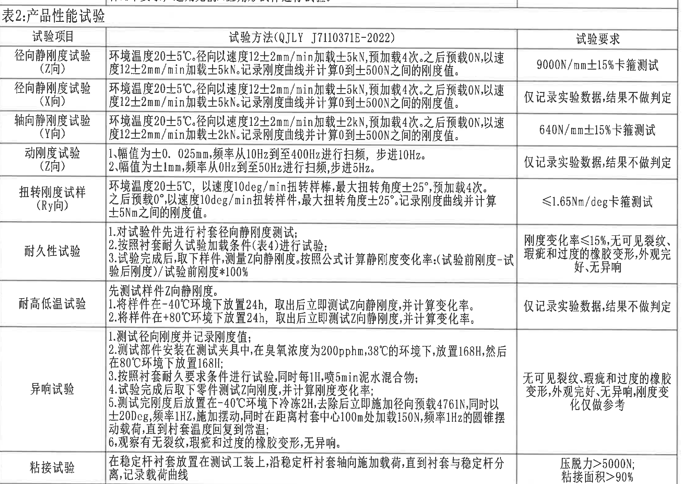

原图位置/视图名称：左侧中部，表2：产品性能试验；bbox `[500, 1335, 3005, 2100]`。

原表还原：

| 试验项目 | 试验方法(QJLY J7110371E-2022) | 试验要求 |
|---|---|---|
| 径向静刚度试验(Z向) | 环境温度20±5℃。径向以速度12±2mm/min加载±5kN，预加载4次。之后预载0N，以速度12±2mm/min加载±5kN。记录刚度曲线并计算0到±500N之间的刚度值。 | 9000N/mm±15%卡箍测试 |
| 径向静刚度试验(X向) | 环境温度20±5℃。径向以速度12±2mm/min加载±5kN，预加载4次。之后预载0N，以速度12±2mm/min加载±5kN。记录刚度曲线并计算0到±500N之间的刚度值。 | 仅记录实验数据，结果不做判定 |
| 轴向静刚度试验(Y向) | 环境温度20±5℃。径向以速度12±2mm/min加载±2kN，预加载4次。之后预载0N，以速度12±2mm/min加载±2kN。记录刚度曲线并计算0到±500N之间的刚度值。 | 640N/mm±15%卡箍测试 |
| 动刚度试验(Z向) | 1.幅值为±0.025mm，频率从10Hz到至400Hz进行扫频，步进10Hz。 2.幅值为±1mm，频率从0Hz到至50Hz进行扫频，步进5Hz。 | 仅记录实验数据，结果不做判定 |
| 扭转刚度试样(Ry向) | 环境温度20±5℃，以速度10deg/min扭转样棒，最大扭转角度±25°，预加载4次。之后预载0°，以速度10deg/min扭转样件，最大扭转角度±25°。记录刚度曲线并计算±5Nm之间的刚度值。 | ≤1.65Nm/deg卡箍测试 |
| 耐久性试验 | 1.对试验件先进行衬套径向静刚度测试； 2.按照衬套耐久试验加载条件(表4)进行试验； 3.试验完成后取下样件，测量Z向静刚度。按照公式计算静刚度变化率:(试验前刚度-试验后刚度)/试验前刚度*100% | 刚度变化率≤15%，无可见裂纹、瑕疵和过度的橡胶变形，外观完好，无异响 |
| 耐高低温试验 | 先测试样件Z向静刚度。 1.将样件在-40℃环境下放置24h，取出后立即测试Z向静刚度，并计算变化率。 2.将样件在+80℃环境下放置24h，取出后立即测试Z向静刚度，并计算变化率。 | 仅记录实验数据，结果不做判定 |
| 异响试验 | 1.测试径向刚度并记录刚度值； 2.测试部件安装在测试夹具中，在臭氧浓度为200pphm，38℃的环境下，放置168H，然后在80℃环境下放置168H； 3.按照衬套耐久要求条件进行试验，同时每1H，喷5min泥水混合物； 4.试验完成后取下零件测试Z向刚度，并计算刚度变化率； 5.测试完刚度后放置在-40℃环境下冷冻2H，去除后立即施加径向预载4761N，同时以±20Deg，频率1Hz，施加摆动，同时在距离衬套中心100mm处加载150N，频率1Hz的圆锥摆动载荷，直到衬套温度回复到常温； 6.观察有无裂纹、瑕疵和过度的橡胶变形，无异响。 | 无可见裂纹、瑕疵和过度的橡胶变形，外观完好，无异响，刚度变化仅做参考 |
| 粘接试验 | 在稳定杆衬套放置在测试工装上，沿稳定杆衬套轴向施加载荷，直到衬套与稳定杆分离，记录载荷曲线 | 压脱力>5000N；粘接面积>90% |

提取表：

| 提取项 | 原图数值或文本 | 含义说明 |
|---|---|---|
| Z向径向静刚度 | 9000N/mm±15% | Z向卡箍测试刚度要求。 |
| X向径向静刚度 | 仅记录实验数据，结果不做判定 | X向静刚度只作为记录项。 |
| Y向轴向静刚度 | 640N/mm±15% | Y向卡箍测试刚度要求。 |
| 动刚度幅值/频率 | ±0.025mm，10Hz到400Hz；±1mm，0Hz到50Hz | 动刚度扫频条件。 |
| 扭转角度/刚度 | ±25°；≤1.65Nm/deg | Ry向扭转测试角度和判定上限。 |
| 耐久后刚度变化率 | ≤15% | 耐久试验后静刚度变化率判定上限。 |
| 耐高低温条件 | -40℃ 24h；+80℃ 24h | 高低温后测试Z向静刚度并计算变化率。 |
| 异响试验预载/摆动 | 4761N；±20Deg；1Hz；100mm处150N；1Hz | 异响试验的低温后加载与摆动条件。 |
| 粘接性能 | 压脱力>5000N；粘接面积>90% | 稳定杆衬套粘接判定要求。 |

边界归属说明：表2上缘有表1底部外框线残留，但表2内容从“表2:产品性能试验”标题开始；提取不包含表1字段。底边到粘接试验行结束，未纳入表3内容。

## object_4 表3：产品信息

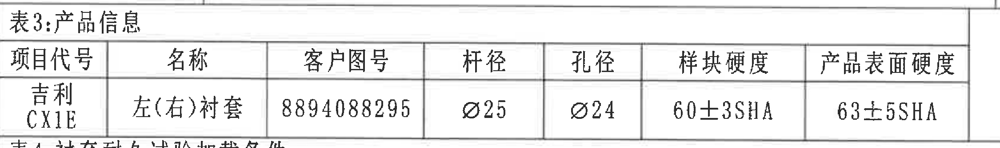

原图位置/视图名称：左下区域，表3：产品信息；bbox `[500, 3425, 2250, 335]`。

原表还原：

| 项目代号 | 名称 | 客户图号 | 杆径 | 孔径 | 样块硬度 | 产品表面硬度 |
|---|---|---|---|---|---|---|
| 吉利 CX1E | 左(右)衬套 | 8894088295 | Ø25 | Ø24 | 60±3SHA | 63±5SHA |

提取表：

| 提取项 | 原图数值或文本 | 含义说明 |
|---|---|---|
| 项目代号 | 吉利 CX1E | 产品平台/项目代号。 |
| 名称 | 左(右)衬套 | 左右件共用或对称件名称。 |
| 客户图号 | 8894088295 | 客户侧图号。 |
| 杆径 | Ø25 | 匹配稳定杆杆径。 |
| 孔径 | Ø24 | 衬套孔径，带直径符号。 |
| 样块硬度 | 60±3SHA | 样块硬度要求。 |
| 产品表面硬度 | 63±5SHA | 产品表面硬度要求。 |

边界归属说明：表3内容完整；底部可见相邻表4标题边缘，未作为表3字段提取。

## object_5 表4：衬套耐久试验加载条件

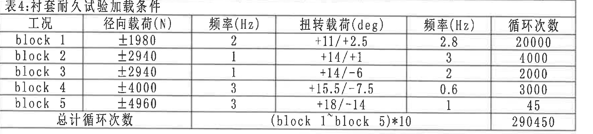

原图位置/视图名称：左下角，表4：衬套耐久试验加载条件；bbox `[500, 3745, 2380, 540]`。

原表还原：

| 工况 | 径向载荷(N) | 频率(Hz) | 扭转载荷(deg) | 频率(Hz) | 循环次数 |
|---|---:|---:|---:|---:|---:|
| block 1 | ±1980 | 2 | +11/+2.5 | 2.8 | 20000 |
| block 2 | ±2940 | 1 | +14/+1 | 3 | 4000 |
| block 3 | ±2940 | 1 | +14/-6 | 2 | 2000 |
| block 4 | ±4000 | 3 | +15.5/-7.5 | 0.6 | 3000 |
| block 5 | ±4960 | 3 | +18/-14 | 1 | 45 |
| 总计循环次数 |  |  | (block 1~block 5)*10 |  | 290450 |

提取表：

| 提取项 | 原图数值或文本 | 含义说明 |
|---|---|---|
| 径向载荷范围 | ±1980、±2940、±4000、±4960 N | 耐久试验分工况径向载荷。 |
| 扭转载荷范围 | +11/+2.5、+14/+1、+14/-6、+15.5/-7.5、+18/-14 deg | 每个工况的扭转角度载荷。 |
| 循环次数 | 20000、4000、2000、3000、45；总计290450 | 各 block 循环次数及总计。 |
| 总计公式 | (block 1~block 5)*10 | 原表给出的循环次数累计方式。 |

边界归属说明：裁切包含表4标题、六列标题、block 1至block 5及总计行；未带入左侧其他表格数据。

## object_1 修订履历表

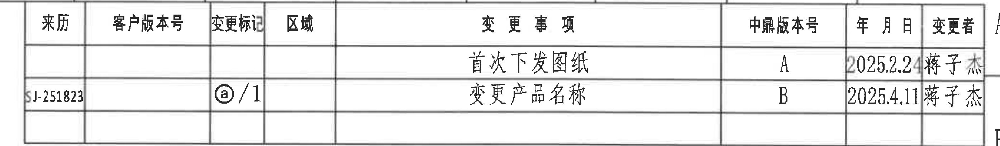

原图位置/视图名称：右上区域，修订履历/变更事项表；bbox `[3620, 230, 2790, 410]`。

原表还原：

| 来历 | 客户版本号 | 变更标记 | 区域 | 变更事项 | 中鼎版本号 | 年月日 | 变更者 |
|---|---|---|---|---|---|---|---|
|  |  |  |  | 首次下发图纸 | A | 2025.2.24 | 蒋子杰 |
| SJ-251823 |  | ⓐ/1 |  | 变更产品名称 | B | 2025.4.11 | 蒋子杰 |

提取表：

| 提取项 | 原图数值或文本 | 含义说明 |
|---|---|---|
| 首发版本 | A，2025.2.24，首次下发图纸，蒋子杰 | 图纸首次下发记录。 |
| 当前变更 | B，2025.4.11，变更产品名称，变更标记ⓐ/1，来历SJ-251823，蒋子杰 | 产品名称变更记录。 |

边界归属说明：裁切完整包含修订表表头与两条记录；右侧可见图框字母栏边线，不属于修订表字段。

## object_6 主视图

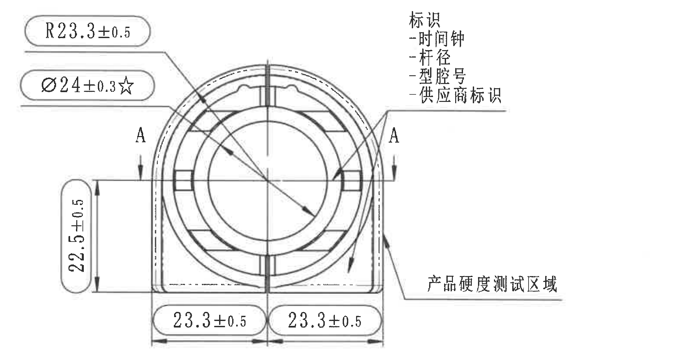

原图位置/视图名称：右上中部，衬套主视图/端面加工视图；bbox `[3830, 660, 2110, 1115]`。

提取表：

| 提取项 | 原图数值或文本 | 含义说明 |
|---|---|---|
| 外圆弧半径 | R23.3±0.5 | 引线指向主视图外侧圆弧轮廓，表示半径尺寸，公差±0.5。 |
| 孔径关键尺寸 | Ø24±0.3☆ | 带直径符号和星号，指向内孔/圆形特征；☆表示关键特性。 |
| 左侧竖向局部尺寸 | 22.5±0.5 | 主视图左侧从下方基准边到中部水平尺寸线的竖向尺寸，公差±0.5。 |
| 下部左半宽 | 23.3±0.5 | 主视图下方从左侧边界到中心竖向基准线的水平尺寸，公差±0.5。 |
| 下部右半宽 | 23.3±0.5 | 主视图下方从中心竖向基准线到右侧边界的水平尺寸，公差±0.5。 |
| 剖切标识 | A、A，箭头向下 | 指示 A-A 剖面位置和观察方向，对应 object_7。 |
| 标识说明 | 标识：-时间钟；-杆径；-型腔号；-供应商标识 | 右上引线说明该处标识内容。 |
| 产品硬度测试区域 | 产品硬度测试区域 | 右侧引线指向主视图侧面区域，说明硬度测试位置。 |

边界归属说明：主视图裁切只包含端面视图及其尺寸、剖切符号、标识引线和硬度测试区域引线；未带入下方 A-A 剖面图。R23.3±0.5、Ø24±0.3☆、22.5±0.5、两个23.3±0.5均归属主视图。

## object_7 A-A 剖面视图

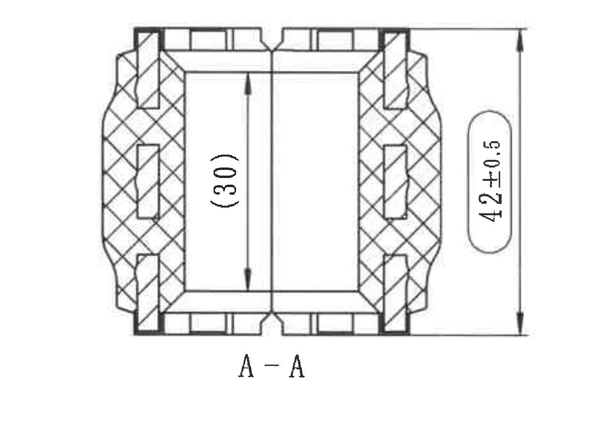

原图位置/视图名称：右侧中部，A-A 剖面视图；bbox `[4080, 1770, 1250, 920]`。

提取表：

| 提取项 | 原图数值或文本 | 含义说明 |
|---|---|---|
| 剖面名称 | A-A | 与主视图中的 A-A 剖切线对应。 |
| 参考尺寸 | (30) | 括号内参考尺寸，位于剖面内部中心开口处；仅作参考/派生信息，不单独作为带公差控制尺寸。 |
| 总体尺寸 | 42±0.5 | 右侧外部尺寸线跨越剖面整体高度/长度，公差±0.5。 |
| 剖面填充 | 斜剖面线 | 表示剖切到的材料区域。 |

边界归属说明：A-A 剖面裁切只包含剖面本体、(30)、42±0.5和“A-A”标题；不包含上方主视图，也不包含下方技术要求文字。

## object_8 轴测视图

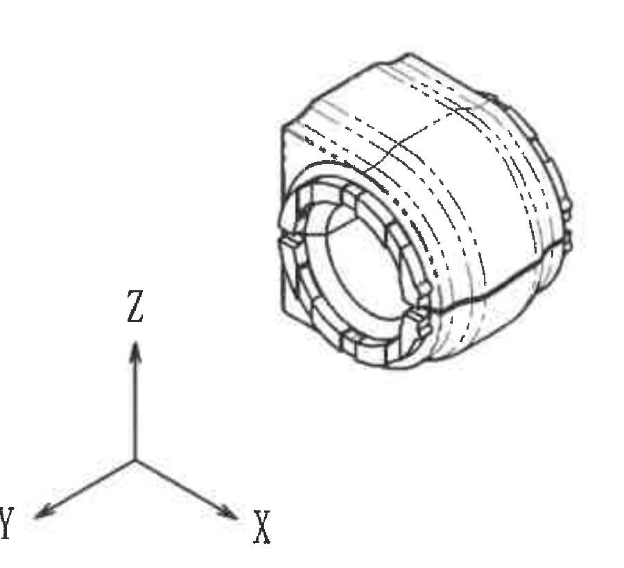

原图位置/视图名称：右侧中部偏右，轴测/三维外观视图；bbox `[5360, 1900, 900, 820]`。

提取表：

| 提取项 | 原图数值或文本 | 含义说明 |
|---|---|---|
| 三维外观 | 轴测图 | 展示衬套整体外观、端面分瓣结构和外圆柱轮廓。 |
| 坐标方向 | X、Y、Z | 右下坐标系说明三维视图方向。 |
| 尺寸标注 | 未见尺寸数值 | 该裁切对象为外观/方向示意，不含独立尺寸、公差、参考尺寸或角度标注。 |

边界归属说明：裁切只保留轴测图及 XYZ 坐标系；未包含技术要求文字，未将主视图或剖面尺寸归入该对象。

## object_9 技术要求 / NOTES

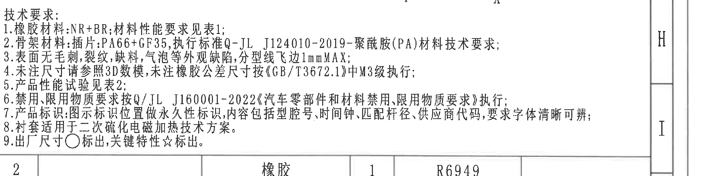

原图位置/视图名称：右侧下中部，技术要求/NOTES；bbox `[3710, 2670, 2902, 720]`。

原文还原：

1. 橡胶材料:NR+BR;材料性能要求见表1;  
2. 骨架材料:插片:PA66+GF35,执行标准Q-JL J124010-2019-聚酰胺(PA)材料技术要求;  
3. 表面无毛刺,裂纹,缺料,气泡等外观缺陷,分型线飞边1mmMAX;  
4. 未注尺寸请参照3D数模,未注橡胶公差尺寸按《GB/T3672.1》中M3级执行;  
5. 产品性能试验见表2;  
6. 禁用、限用物质要求按Q/JL J160001-2022《汽车零部件和材料禁用、限用物质要求》执行;  
7. 产品标识:图示标识位置做永久性标识,内容包括型腔号,时间钟,匹配杆径,供应商代码,要求字体清晰可辨;  
8. 衬套适用于二次硫化电磁加热技术方案。  
9. 出厂尺寸○标出,关键特性☆标出。

提取表：

| 提取项 | 原图数值或文本 | 含义说明 |
|---|---|---|
| 橡胶材料 | NR+BR | 橡胶主体材料，性能见表1。 |
| 骨架/插片材料 | PA66+GF35 | 骨架插片材料及其材料技术要求标准。 |
| 飞边限制 | 1mmMAX | 分型线飞边最大允许值。 |
| 未注公差 | GB/T3672.1 中 M3级 | 未注橡胶公差尺寸执行等级。 |
| 性能试验引用 | 见表2 | 产品性能试验归属表2。 |
| 产品标识内容 | 型腔号、时间钟、匹配杆径、供应商代码 | 永久标识的内容要求。 |
| 出厂/关键标识 | ○、☆ | ○标出出厂尺寸，☆标出关键特性。 |

边界归属说明：裁切完整包含技术要求1至9条；右侧图框字母栏和下方明细表边线为相邻图框元素，不纳入 NOTES 提取。

## object_10 通用公差表

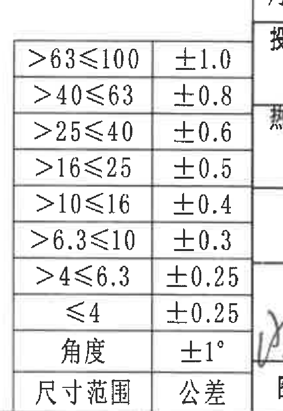

原图位置/视图名称：下方中部偏左，未注尺寸公差表；bbox `[3170, 3630, 575, 835]`。

原表还原：

| 尺寸范围 | 公差 |
|---|---|
| >63≤100 | ±1.0 |
| >40≤63 | ±0.8 |
| >25≤40 | ±0.6 |
| >16≤25 | ±0.5 |
| >10≤16 | ±0.4 |
| >6.3≤10 | ±0.3 |
| >4≤6.3 | ±0.25 |
| ≤4 | ±0.25 |
| 角度 | ±1° |

提取表：

| 提取项 | 原图数值或文本 | 含义说明 |
|---|---|---|
| 线性尺寸公差 | ±1.0至±0.25 | 按尺寸范围给出的未注线性公差。 |
| 角度公差 | ±1° | 未注角度公差。 |
| 尺寸范围列 | >63≤100、>40≤63、>25≤40、>16≤25、>10≤16、>6.3≤10、>4≤6.3、≤4 | 原表尺寸分档。 |

边界归属说明：裁切包含公差表两列及所有分档；右侧少量签审栏线条属于标题栏相邻边界，不作为公差表字段。

## object_11 明细表 / BOM

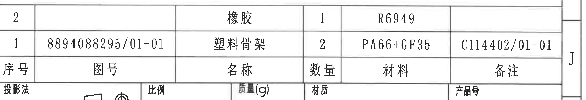

原图位置/视图名称：右下标题栏上方，明细表/BOM；bbox `[3700, 3280, 2780, 480]`。

原表还原：

| 序号 | 图号 | 名称 | 数量 | 材料 | 备注 |
|---|---|---|---:|---|---|
| 2 |  | 橡胶 | 1 | R6949 |  |
| 1 | 8894088295/01-01 | 塑料骨架 | 2 | PA66+GF35 | C114402/01-01 |

提取表：

| 提取项 | 原图数值或文本 | 含义说明 |
|---|---|---|
| 橡胶件 | 序号2，数量1，材料R6949 | 衬套橡胶材料明细。 |
| 塑料骨架 | 序号1，图号8894088295/01-01，数量2，材料PA66+GF35，备注C114402/01-01 | 内部塑料骨架/插片明细。 |

边界归属说明：裁切完整包含两条明细记录和表头；下方投影法、比例、质量等栏位属于标题栏 object_12，不归入 object_11。

## object_12 标题栏

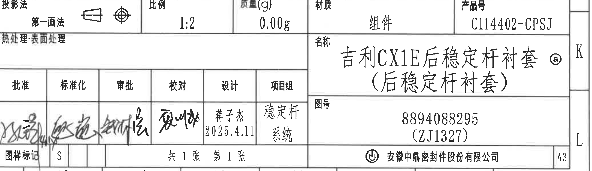

原图位置/视图名称：右下角标题栏；bbox `[3710, 3690, 2760, 800]`。

原表/字段还原：

| 字段 | 原图文本 |
|---|---|
| 投影法 | 第一画法 |
| 比例 | 1:2 |
| 质量(g) | 0.00g |
| 材质 | 组件 |
| 产品号 | C114402-CPSJ |
| 热处理/表面处理 | 热处理:表面处理 |
| 批准 | 手写签名 |
| 标准化 | 手写签名 |
| 审批 | 手写签名 |
| 校对 | 手写签名 |
| 设计 | 蒋子杰 2025.4.11 |
| 项目组 | 稳定杆系统 |
| 图样标记 | S |
| 页数 | 共1张 第1张 |
| 名称 | 吉利CX1E后稳定杆衬套 ⓐ（后稳定杆衬套） |
| 图号 | 8894088295（ZJ1327） |
| 公司 | 安徽中鼎密封件股份有限公司 |
| 图幅 | A3 |

提取表：

| 提取项 | 原图数值或文本 | 含义说明 |
|---|---|---|
| 图名 | 吉利CX1E后稳定杆衬套 ⓐ（后稳定杆衬套） | 产品名称；ⓐ对应修订标记。 |
| 图号 | 8894088295（ZJ1327） | 图纸编号及括号内编号。 |
| 产品号 | C114402-CPSJ | 产品号字段。 |
| 比例/质量 | 1:2；0.00g | 标题栏比例和质量字段。 |
| 材质 | 组件 | 表示图纸对象为组件。 |
| 设计 | 蒋子杰 2025.4.11 | 设计责任人及日期。 |

边界归属说明：裁切包含标题栏主体、签审栏、名称、图号、公司和图幅；上方明细表 object_11 已单独裁切，未将 BOM 记录归入标题栏。

## 裁切检查记录

| 对象 | 图片路径 | 检查结果 |
|---|---|---|
| page_1 | outputs/20C114402_assets/images/page_1.png | 整页 PNG 已生成，图框、表格、视图和标题栏完整。 |
| object_1 | outputs/20C114402_assets/images/object_1.png | 修订履历表完整包含表头和两条记录；无字段文字截断。 |
| object_2 | outputs/20C114402_assets/images/object_2.png | 表1标题、表头和全部试验行完整；未混入表2标题。 |
| object_3 | outputs/20C114402_assets/images/object_3.png | 表2标题、表头和全部试验行完整；上缘相邻表线不参与提取。 |
| object_4 | outputs/20C114402_assets/images/object_4.png | 表3完整；底部相邻表4标题边缘不参与提取。 |
| object_5 | outputs/20C114402_assets/images/object_5.png | 表4完整包含所有 block 和总计行；文字、数字无截断。 |
| object_6 | outputs/20C114402_assets/images/object_6.png | 主视图完整包含 R、Ø、☆、A-A、尺寸线、箭头和文字；未混入剖面图。 |
| object_7 | outputs/20C114402_assets/images/object_7.png | A-A剖面完整包含(30)、42±0.5、尺寸线和剖面标题；未混入 NOTES。 |
| object_8 | outputs/20C114402_assets/images/object_8.png | 轴测图和 XYZ 坐标完整；无其他视图尺寸混入。 |
| object_9 | outputs/20C114402_assets/images/object_9.png | 技术要求1-9条完整；右侧图框字母栏不参与提取。 |
| object_10 | outputs/20C114402_assets/images/object_10.png | 通用公差表全部分档和角度行完整；相邻签审栏线条不参与提取。 |
| object_11 | outputs/20C114402_assets/images/object_11.png | 明细表完整包含表头和两条记录；底部标题栏字段不参与提取。 |
| object_12 | outputs/20C114402_assets/images/object_12.png | 标题栏关键字段完整；上方 BOM 已作为 object_11 单独归属。 |
