# 20C114403 内容识别结果

整页渲染图：`outputs/20C114403_assets/images/page_1.png`  
页面尺寸：4959 x 3505 px；PDF 共 1 页。

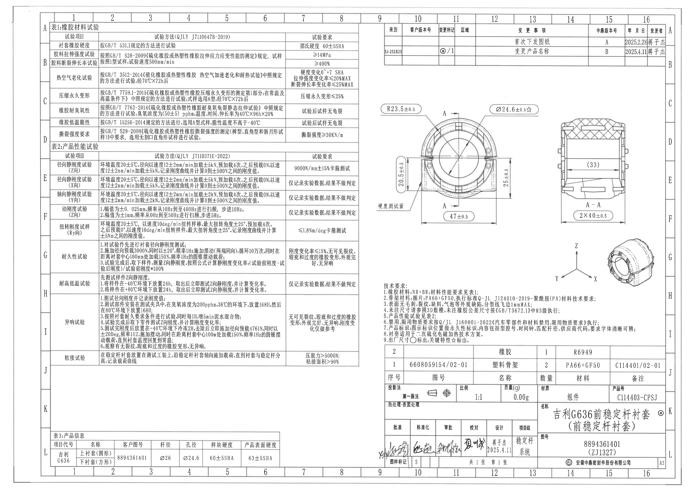

## object_1 - 表1：橡胶材料试验

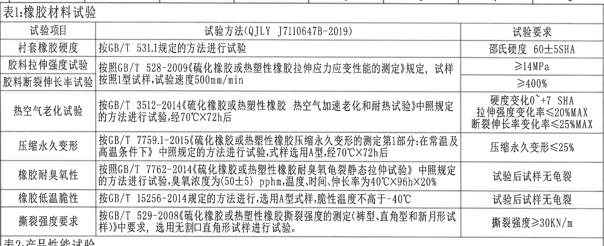

原图位置/视图名称：第 1 页左上区域，表1：橡胶材料试验。bbox `[355, 150, 2565, 1050]`。

原表还原：

| 试验项目 | 试验方法(QJLY J7110647B-2019) | 试验要求 |
|---|---|---|
| 衬套橡胶硬度 | 按GB/T 531.1规定的方法进行试验 | 邵氏硬度 60±5SHA |
| 胶料拉伸强度试验 | 按照GB/T 528-2009《硫化橡胶或热塑性橡胶拉伸应力应变性能的测定》规定，试样按照1型试样，试验速度500mm/min | ≥14MPa |
| 胶料断裂伸长率试验 | 按照GB/T 528-2009《硫化橡胶或热塑性橡胶拉伸应力应变性能的测定》规定，试样按照1型试样，试验速度500mm/min | ≥400% |
| 热空气老化试验 | 按GB/T 3512-2014《硫化橡胶或热塑性橡胶 热空气加速老化和耐热试验》中照规定的方法进行试验，经70°C×72h后 | 硬度变化0~+7 SHA；拉伸强度变化率≤20%MAX；断裂伸长率变化率≤25%MAX |
| 压缩永久变形 | 按GB/T 7759.1-2015《硫化橡胶或热塑性橡胶压缩永久变形的测定第1部分:在常温及高温条件下》中照规定的方法进行试验，试样选用A型，经70°C×72h后 | 压缩永久变形≤25% |
| 橡胶耐臭氧性 | 按照GB/T 7762-2014《硫化橡胶或热塑性橡胶耐臭氧龟裂静态拉伸试验》中照规定的方法进行试验，臭氧浓度为(50±5)pphm，温度、时间、伸长率为40°C×96h×20% | 试验后试样无龟裂 |
| 橡胶低温脆性 | 按GB/T 15256-2014规定的方法进行，选用A型试样，脆性温度不高于-40°C | 试验后试样无龟裂 |
| 撕裂强度要求 | 按GB/T 529-2008《硫化橡胶或热塑性橡胶撕裂强度的测定(裤型、直角型和新月形试样)》中要求，选用无割口直角形试样进行试验。 | 撕裂强度≥30KN/m |

提取表格：

| 提取项 | 原图数值或文本 | 含义说明 |
|---|---|---|
| 材料硬度要求 | 邵氏硬度 60±5SHA | 衬套橡胶硬度验收范围。 |
| 拉伸强度 | ≥14MPa | 胶料拉伸强度下限。 |
| 断裂伸长率 | ≥400% | 胶料断裂伸长率下限。 |
| 老化后硬度变化 | 0~+7 SHA | 70°C×72h 热空气老化后的硬度变化范围。 |
| 老化后拉伸强度变化率 | ≤20%MAX | 热空气老化后的拉伸强度变化率上限。 |
| 老化后断裂伸长率变化率 | ≤25%MAX | 热空气老化后的断裂伸长率变化率上限。 |
| 压缩永久变形 | ≤25% | 经70°C×72h后的压缩永久变形上限。 |
| 臭氧条件 | (50±5)pphm，40°C×96h×20% | 臭氧龟裂静态拉伸试验条件。 |
| 低温脆性 | 不高于-40°C | 低温脆性试验温度条件。 |
| 撕裂强度 | ≥30KN/m | 撕裂强度验收下限。 |

边界归属说明：该裁切只归属左上“表1：橡胶材料试验”。重裁后保留表1标题、表头、全部行列和下边框；右上修订表、主视图尺寸不归属本对象。

## object_2 - 表2：产品性能试验

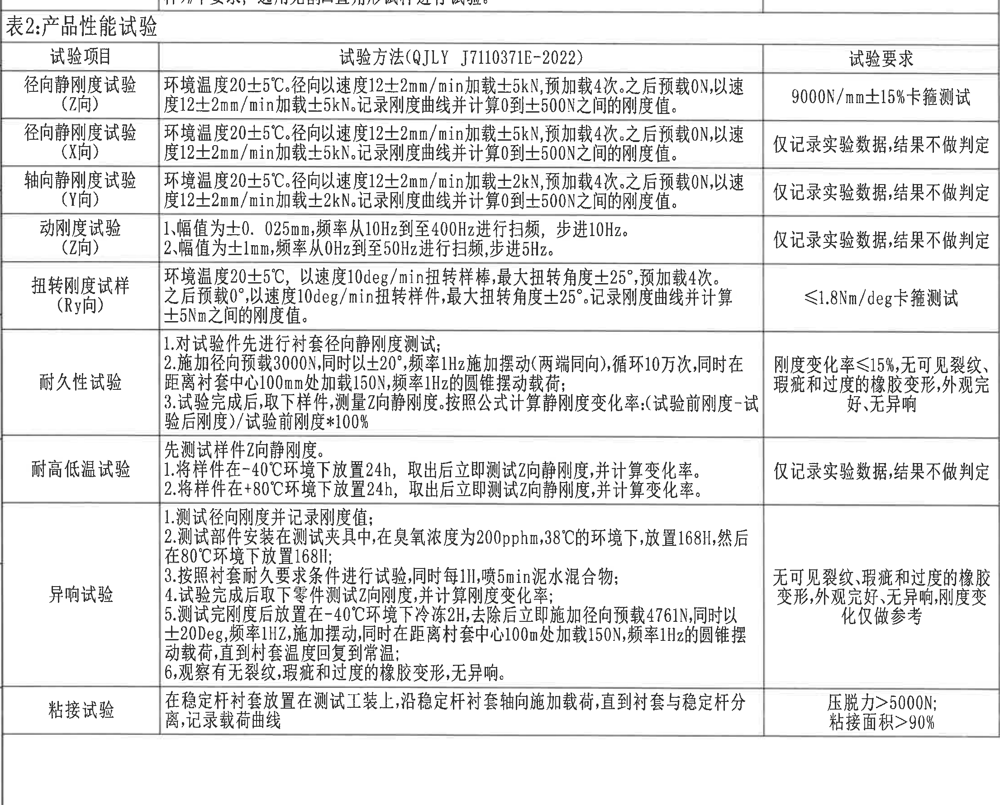

原图位置/视图名称：第 1 页左中区域，表2：产品性能试验。bbox `[355, 990, 2565, 2770]`。

原表还原：

| 试验项目 | 试验方法(QJLY J7110371E-2022) | 试验要求 |
|---|---|---|
| 径向静刚度试验(Z向) | 环境温度20±5°C。径向以速度12±2mm/min加载±5kN，预加载4次。之后预载0N，以速度12±2mm/min加载±5kN。记录刚度曲线并计算0到±500N之间的刚度值。 | 9000N/mm±15%卡箍测试 |
| 径向静刚度试验(X向) | 环境温度20±5°C。径向以速度12±2mm/min加载±5kN，预加载4次。之后预载0N，以速度12±2mm/min加载±5kN。记录刚度曲线并计算0到±500N之间的刚度值。 | 仅记录实验数据，结果不做判定 |
| 轴向静刚度试验(Y向) | 环境温度20±5°C。轴向以速度12±2mm/min加载±2kN，预加载4次。之后预载0N，以速度12±2mm/min加载±2kN。记录刚度曲线并计算0到±500N之间的刚度值。 | 仅记录实验数据，结果不做判定 |
| 动刚度试验(Z向) | 1、幅值为±0.025mm，频率从10Hz到至400Hz进行扫频，步进10Hz。2、幅值为±1mm，频率从0Hz到至50Hz进行扫频，步进5Hz。 | 仅记录实验数据，结果不做判定 |
| 扭转刚度试样(Ry向) | 环境温度20±5°C，以速度10deg/min扭转样棒，最大扭转角度±25°，预加载4次。之后预载0°，以速度10deg/min扭转样件，最大扭转角度±25°。记录刚度曲线并计算±5Nm之间的刚度值。 | ≤1.8Nm/deg卡箍测试 |
| 耐久性试验 | 1.对试验件先进行衬套径向静刚度测试；2.施加径向预载3000N，同时以±20°，频率1Hz施加摆动(两端同向)，循环10万次，同时在距离衬套中心100mm处加载150N，频率1Hz的圆锥摆动载荷；3.试验完成后，取下样件，测量Z向静刚度。按照公式计算静刚度变化率:(试验前刚度-试验后刚度)/试验前刚度*100%。 | 刚度变化率≤15%，无可见裂纹、瑕疵和过度的橡胶变形，外观完好，无异响 |
| 耐高低温试验 | 先测试样件Z向静刚度。1.将样件在-40°C环境下放置24h，取出后立即测试Z向静刚度，并计算变化率。2.将样件在+80°C环境下放置24h，取出后立即测试Z向静刚度，并计算变化率。 | 仅记录实验数据，结果不做判定 |
| 异响试验 | 1.测试径向刚度并记录刚度值；2.测试部件安装在测试夹具中，在臭氧浓度为200pphm，38°C的环境下，放置168H，然后在80°C环境下放置168H；3.按照衬套耐久要求条件进行试验，同时每1H喷5min泥水混合物；4.试验完成后取下零件测试Z向刚度，并计算刚度变化率；5.测试完刚度后放置在-40°C环境下冷冻2H，去除后立即施加径向预载4761N，同时以±20Deg，频率1Hz，施加摆动，同时在距离衬套中心100mm处加载150N，频率1Hz的圆锥摆动载荷，直到衬套温度回复到常温；6.观察有无裂纹、瑕疵和过度的橡胶变形，无异响。 | 无可见裂纹、瑕疵和过度的橡胶变形，外观完好，无异响，刚度变化仅做参考 |
| 粘接试验 | 在稳定杆衬套放置在测试工装上，沿稳定杆衬套轴向施加载荷，直到衬套与稳定杆分离，记录载荷曲线 | 压脱力>5000N；粘接面积>90% |

提取表格：

| 提取项 | 原图数值或文本 | 含义说明 |
|---|---|---|
| Z向径向静刚度 | 9000N/mm±15% | Z向卡箍测试判定要求。 |
| X向径向静刚度 | 仅记录实验数据，结果不做判定 | X向只记录，不作为判定项。 |
| Y向轴向静刚度 | ±2kN，0到±500N之间刚度值 | Y向测试载荷条件和计算区间。 |
| 加载速度 | 12±2mm/min | 静刚度试验加载速度。 |
| 预加载次数 | 4次 | 静刚度和扭转刚度试验预加载次数。 |
| 动刚度幅值1 | ±0.025mm，10Hz到400Hz，步进10Hz | Z向动刚度高频扫频条件。 |
| 动刚度幅值2 | ±1mm，0Hz到50Hz，步进5Hz | Z向动刚度低频扫频条件。 |
| 扭转角度 | ±25° | Ry向扭转刚度最大扭转角。 |
| 扭转速度 | 10deg/min | Ry向扭转刚度加载速度。 |
| 扭转刚度要求 | ≤1.8Nm/deg | Ry向卡箍测试判定要求。 |
| 耐久预载 | 3000N，±20°，1Hz，循环10万次 | 耐久性摆动载荷条件。 |
| 耐久附加载荷 | 100mm处加载150N，1Hz | 圆锥摆动载荷条件。 |
| 刚度变化率 | ≤15% | 耐久后静刚度变化率上限。 |
| 高低温 | -40°C×24h，+80°C×24h | 高低温放置条件。 |
| 异响臭氧/温度 | 200pphm，38°C×168H，80°C×168H | 异响试验前处理条件。 |
| 异响冷冻与预载 | -40°C×2H，4761N，±20Deg，1Hz | 异响试验动态加载条件。 |
| 粘接压脱力 | >5000N | 粘接试验载荷下限。 |
| 粘接面积 | >90% | 粘接面积下限。 |

边界归属说明：该裁切只归属左中“表2：产品性能试验”。右侧主视图和 Notes 不在本对象解释范围；底部保留“粘接试验”完整行和表格下边线。

## object_3 - 表3：产品信息

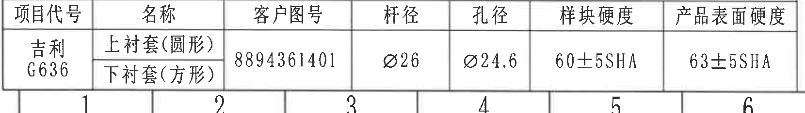

原图位置/视图名称：第 1 页左下区域，表3：产品信息。bbox `[355, 3150, 2015, 3385]`。

原表还原：

| 项目代号 | 名称 | 客户图号 | 杆径 | 孔径 | 样块硬度 | 产品表面硬度 |
|---|---|---|---|---|---|---|
| 吉利G636 | 上衬套(圆形)；下衬套(方形) | 8894361401 | Ø26 | Ø24.6 | 60±5SHA | 63±5SHA |

提取表格：

| 提取项 | 原图数值或文本 | 含义说明 |
|---|---|---|
| 项目代号 | 吉利G636 | 产品项目代码。 |
| 名称 | 上衬套(圆形)；下衬套(方形) | 产品包含的上下衬套形态。 |
| 客户图号 | 8894361401 | 客户侧图号。 |
| 杆径 | Ø26 | 匹配杆径，直径符号保留。 |
| 孔径 | Ø24.6 | 产品孔径，直径符号保留。 |
| 样块硬度 | 60±5SHA | 样块硬度要求。 |
| 产品表面硬度 | 63±5SHA | 产品表面硬度要求。 |

边界归属说明：该裁切只归属左下“表3：产品信息”。底部图框坐标未纳入提取内容。

## object_4 - 修订履历表

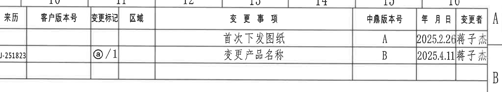

原图位置/视图名称：第 1 页右上区域，修订履历/变更事项表。bbox `[2765, 140, 4815, 520]`。

原表还原：

| 来历 | 客户版本号 | 变更标记 | 区域 | 变更事项 | 中鼎版本号 | 年月日 | 变更者 |
|---|---|---|---|---|---|---|---|
|  |  |  |  | 首次下发图纸 | A | 2025.2.26 | 蒋子杰 |
| SJ-251823 |  | ⓐ/1 |  | 变更产品名称 | B | 2025.4.11 | 蒋子杰 |

提取表格：

| 提取项 | 原图数值或文本 | 含义说明 |
|---|---|---|
| 初始版本 | A，2025.2.26，首次下发图纸，蒋子杰 | 第一次下发图纸记录。 |
| 变更版本 | B，2025.4.11，SJ-251823，ⓐ/1，变更产品名称，蒋子杰 | 第二次变更记录，变更标记为ⓐ/1。 |

边界归属说明：该裁切只归属右上修订履历表；未将下方主视图尺寸或图框坐标归入修订表。

## object_5 - 主视图

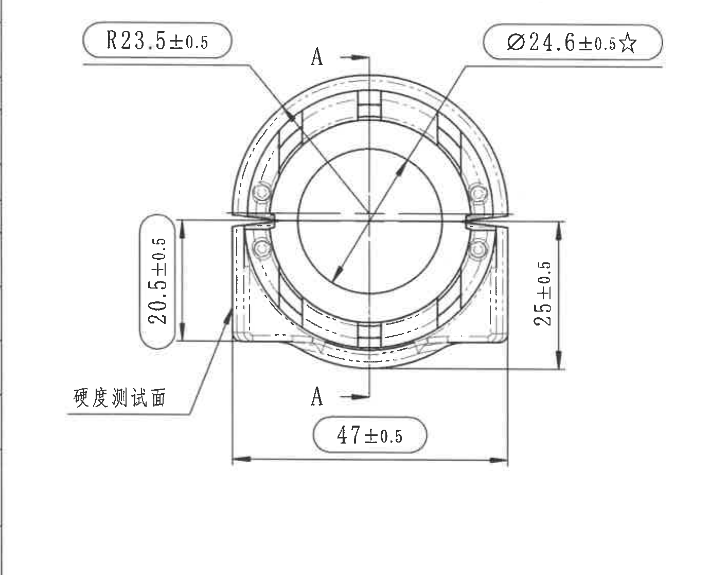

原图位置/视图名称：第 1 页右中偏左，产品主视图。bbox `[2560, 700, 3940, 1820]`。

提取表格：

| 提取项 | 原图数值或文本 | 含义说明 |
|---|---|---|
| 弧向/半径尺寸 | R23.5±0.5 | 上部圆弧半径尺寸，R 表示半径，公差 ±0.5。 |
| 内孔直径/关键特性 | Ø24.6±0.5☆ | 中央孔径尺寸，Ø 表示直径，☆按技术要求9为关键特性标出，公差 ±0.5。 |
| 左侧高度尺寸 | 20.5±0.5 | 左侧支承/侧壁的竖向尺寸，完整尺寸线和箭头位于主视图左侧。 |
| 右侧高度尺寸 | 25±0.5 | 右侧竖向高度尺寸，完整尺寸线和箭头位于主视图右侧。 |
| 底部总宽尺寸 | 47±0.5 | 主视图底部横向总宽尺寸，尺寸线覆盖底部外侧边界。 |
| 剖切标识 | A-A | 主视图中心竖向剖切线，对应 object_6 的 A-A 剖面视图。 |
| 检测位置 | 硬度测试面 | 引线指向左下侧外表面，表示硬度测试面位置。 |
| T编号 | 未见T编号 | 主视图内未识别到 T 编号。 |

边界归属说明：该裁切只归属主视图。右侧 A-A 剖面未纳入；下方等轴参考图和技术要求未纳入。靠近右边界的 25±0.5 属于主视图，因为其尺寸线和箭头均指向主视图右侧外形。

## object_6 - A-A 剖面视图

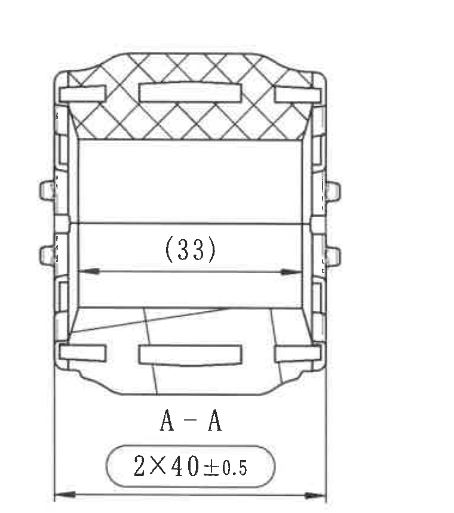

原图位置/视图名称：第 1 页右中区域，A-A 剖面视图。bbox `[3920, 760, 4680, 1620]`。

提取表格：

| 提取项 | 原图数值或文本 | 含义说明 |
|---|---|---|
| 剖面名称 | A-A | 与主视图中心剖切线 A-A 对应。 |
| 参考尺寸 | (33) | 括号内尺寸，表示参考尺寸；位于剖面内部横向宽度位置，不作为主视图尺寸提取。 |
| 数量前缀尺寸 | 2×40±0.5 | “2×”表示两处相同尺寸要求，40 为尺寸值，公差 ±0.5；尺寸线位于剖面底部。 |
| 剖面填充 | 交叉剖面线 | 表示剖切到的材料区域。 |
| T编号 | 未见T编号 | 剖面视图内未识别到 T 编号。 |

边界归属说明：(33) 和 2×40±0.5 均归属于 A-A 剖面视图，不归入主视图。重裁后去除了右侧图框字母和下方等轴图，仅保留剖面本体及尺寸线文字。

## object_7 - 等轴参考视图

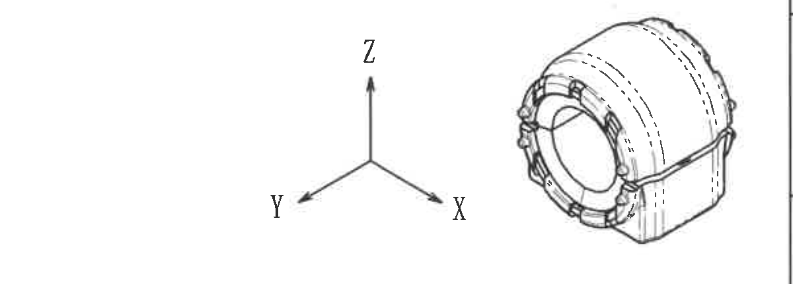

原图位置/视图名称：第 1 页右中偏下，等轴/3D参考视图。bbox `[3560, 1680, 4760, 2110]`。

提取表格：

| 提取项 | 原图数值或文本 | 含义说明 |
|---|---|---|
| 坐标轴 | X、Y、Z | 表示三维方向参考。 |
| 视图内容 | 产品等轴线框图 | 用于显示整体三维外形和结构方向。 |
| 尺寸/公差 | 未标注 | 该视图未见独立尺寸、公差、角度、弧度或 T 编号。 |

边界归属说明：该裁切只归属等轴参考视图。上方 A-A 剖面尺寸和下方技术要求文字均不归入本对象。

## object_8 - NOTES/技术要求

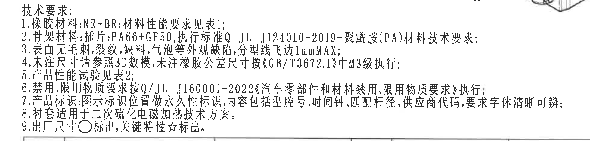

原图位置/视图名称：第 1 页右下中部，技术要求/NOTES。bbox `[2670, 2010, 4630, 2480]`。

原文还原：

1. 橡胶材料:NR+BR;材料性能要求见表1;
2. 骨架材料:插件:PA66+GF50,执行标准Q-JL J124010-2019-聚酰胺(PA)材料技术要求;
3. 表面无毛刺,裂纹,缺料,气泡等外观缺陷,分型线飞边1mmMAX;
4. 未注尺寸请参照3D数模,未注橡胶公差尺寸按《GB/T3672.1》中M3级执行;
5. 产品性能试验见表2;
6. 禁用、限用物质要求按Q/JL J160001-2022《汽车零部件和材料禁用、限用物质要求》执行;
7. 产品标识:图示标识位置做永久性标识,内容包括型腔号,时间钟,匹配杆径,供应商代码,要求字体清晰可辨;
8. 衬套适用于二次硫化电磁加热技术方案。
9. 出厂尺寸○标出,关键特性☆标出。

提取表格：

| 提取项 | 原图数值或文本 | 含义说明 |
|---|---|---|
| 橡胶材料 | NR+BR | 橡胶材料组合，性能要求见表1。 |
| 骨架材料 | 插件:PA66+GF50 | 骨架/插件材料。 |
| 材料标准 | Q-JL J124010-2019 | 聚酰胺(PA)材料技术要求标准。 |
| 外观缺陷 | 无毛刺、裂纹、缺料、气泡等 | 外观质量要求。 |
| 分型线飞边 | 1mmMAX | 分型线飞边最大允许值。 |
| 未注尺寸依据 | 3D数模 | 未注尺寸参考来源。 |
| 未注橡胶公差 | GB/T3672.1 中 M3级 | 未注橡胶公差等级。 |
| 性能试验引用 | 表2 | 产品性能试验位置。 |
| 禁限用物质标准 | Q/JL J160001-2022 | 禁用、限用物质要求。 |
| 标识内容 | 型腔号、时间钟、匹配杆径、供应商代码 | 永久性标识内容要求。 |
| 工艺方案 | 二次硫化电磁加热技术方案 | 衬套适用工艺方案。 |
| 出厂尺寸符号 | ○ | 出厂尺寸标出方式。 |
| 关键特性符号 | ☆ | 关键特性标出方式。 |

边界归属说明：该裁切只归属技术要求文本。右上角有极少量相邻等轴图边缘残留，为避免截断第2、7条长句而保留，不作为 Notes 内容提取；下方明细表不归属本对象。

## object_9 - 明细表/BOM

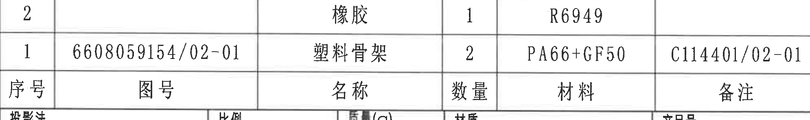

原图位置/视图名称：第 1 页右下，标题栏上方明细表/BOM。bbox `[2750, 2480, 4740, 2775]`。

原表还原：

| 序号 | 图号 | 名称 | 数量 | 材料 | 备注 |
|---|---|---|---|---|---|
| 2 |  | 橡胶 | 1 | R6949 |  |
| 1 | 6608059154/02-01 | 塑料骨架 | 2 | PA66+GF50 | C114401/02-01 |

提取表格：

| 提取项 | 原图数值或文本 | 含义说明 |
|---|---|---|
| 序号2名称 | 橡胶 | 零件/材料明细第2项。 |
| 序号2数量 | 1 | 橡胶数量。 |
| 序号2材料 | R6949 | 橡胶材料牌号。 |
| 序号1图号 | 6608059154/02-01 | 塑料骨架图号。 |
| 序号1名称 | 塑料骨架 | 零件/材料明细第1项。 |
| 序号1数量 | 2 | 塑料骨架数量。 |
| 序号1材料 | PA66+GF50 | 塑料骨架材料。 |
| 序号1备注 | C114401/02-01 | 塑料骨架备注/关联号。 |

边界归属说明：该裁切归属标题栏上方明细表。底部贴近“投影法/比例/质量”等标题栏字段，但这些字段不作为 BOM 内容提取。

## object_10 - 标题栏

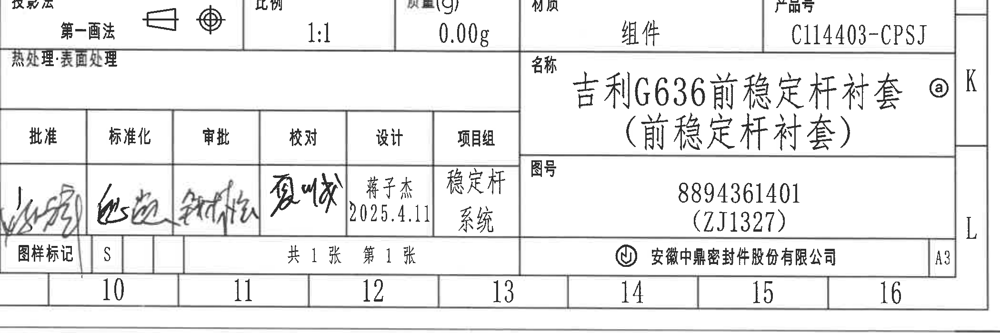

原图位置/视图名称：第 1 页右下角标题栏。bbox `[2750, 2770, 4850, 3470]`。

原表/字段还原：

| 字段 | 原图文本 |
|---|---|
| 投影法 | 第一画法 |
| 比例 | 1:1 |
| 质量(g) | 0.00g |
| 材质 | 组件 |
| 产品号 | C114403-CPSJ |
| 热处理/表面处理 | 热处理:表面处理 |
| 名称 | 吉利G636前稳定杆衬套（前稳定杆衬套）ⓐ |
| 图号 | 8894361401（ZJ1327） |
| 批准 | 签名，字迹不清 |
| 标准化 | 签名，字迹不清 |
| 审批 | 签名，字迹不清 |
| 校对 | 签名，字迹不清 |
| 设计 | 蒋子杰 2025.4.11 |
| 项目组 | 稳定杆系统 |
| 图样标记 | S |
| 张数 | 共1张 第1张 |
| 公司 | 安徽中鼎密封件股份有限公司 |
| 图幅 | A3 |

提取表格：

| 提取项 | 原图数值或文本 | 含义说明 |
|---|---|---|
| 产品号 | C114403-CPSJ | 产品编号。 |
| 产品名称 | 吉利G636前稳定杆衬套（前稳定杆衬套） | 标题栏名称字段。 |
| 变更标记 | ⓐ | 与修订履历中的变更标记对应。 |
| 图号 | 8894361401（ZJ1327） | 图纸编号/括号内编号。 |
| 比例 | 1:1 | 图纸比例。 |
| 质量 | 0.00g | 标题栏质量字段。 |
| 材质 | 组件 | 标题栏材质字段。 |
| 设计 | 蒋子杰 2025.4.11 | 设计签署与日期。 |
| 图样标记 | S | 图样标记字段。 |
| 图幅 | A3 | 图纸幅面。 |

边界归属说明：该裁切归属右下标题栏。保留了标题栏外框、签字栏、公司栏和 A3 字段；底部图框坐标仅为边缘背景，不作为标题栏字段提取。

## 裁切检查记录

| 对象 | 图片路径 | 检查结果 |
|---|---|---|
| page_1 | outputs/20C114403_assets/images/page_1.png | 整页 300dpi PNG 已生成，4959 x 3505 px。 |
| object_1 | outputs/20C114403_assets/images/object_1.png | 表1标题、表头、全部行列和下边框完整；未混入主视图尺寸。 |
| object_2 | outputs/20C114403_assets/images/object_2.png | 表2标题、表头、全部试验行和“粘接试验”行完整；右侧图形未纳入解释范围。 |
| object_3 | outputs/20C114403_assets/images/object_3.png | 表3行列完整，Ø26、Ø24.6、60±5SHA、63±5SHA 均清晰。 |
| object_4 | outputs/20C114403_assets/images/object_4.png | 修订履历列名和两行记录完整；未带入下方主视图。 |
| object_5 | outputs/20C114403_assets/images/object_5.png | 已重裁；R23.5±0.5、Ø24.6±0.5☆、20.5±0.5、25±0.5、47±0.5、A-A 和“硬度测试面”完整；未带入 A-A 剖面。 |
| object_6 | outputs/20C114403_assets/images/object_6.png | 已重裁；A-A、(33)、2×40±0.5 与完整尺寸线均包含；未带入等轴图。 |
| object_7 | outputs/20C114403_assets/images/object_7.png | 已重裁；X/Y/Z 坐标轴和等轴图完整；未带入技术要求正文。 |
| object_8 | outputs/20C114403_assets/images/object_8.png | 技术要求 1-9 条完整；右上角少量相邻等轴图边缘残留不提取。 |
| object_9 | outputs/20C114403_assets/images/object_9.png | 明细表两条记录、表头和字段完整；底部标题栏字段不作为 BOM 提取。 |
| object_10 | outputs/20C114403_assets/images/object_10.png | 标题栏主要字段、签字栏、公司栏、图幅完整；边缘图框坐标不提取。 |
