# 20C114404 内容识别与裁切提取

## 整页渲染

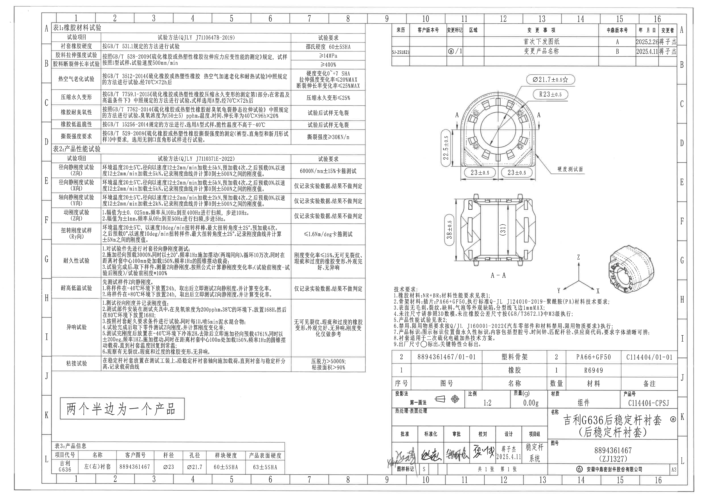

- 原图位置：第1页，整页，bbox [0, 0, 4959, 3505]。
- 页面说明：PDF 已先渲染为整页 PNG，再按加工视图、剖面视图、局部视图、表格、NOTES、标题栏分别裁切。

## object_1 表1：橡胶材料试验

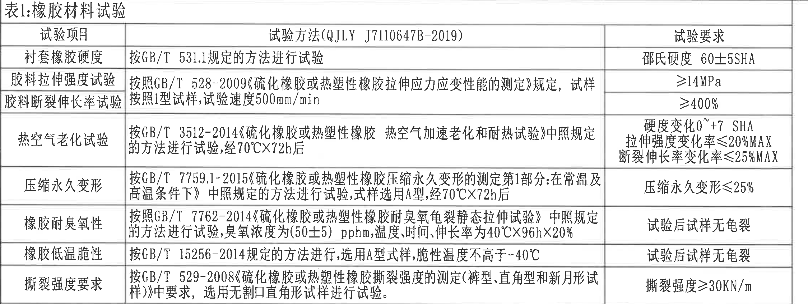

原图位置/视图名称：第1页左上，表1：橡胶材料试验，bbox [360, 165, 2610, 1015]。

| 试验项目 | 试验方法(QJLY J7110647B-2019) | 试验要求 |
|---|---|---|
| 衬套橡胶硬度 | 按GB/T 531.1规定的方法进行试验 | 邵氏硬度 60±5SHA |
| 胶料拉伸强度试验 | 按照GB/T 528-2009《硫化橡胶或热塑性橡胶拉伸应力应变性能的测定》规定，试样按照1型试样，试验速度500mm/min | ≥14MPa |
| 胶料断裂伸长率试验 | 按照GB/T 528-2009《硫化橡胶或热塑性橡胶拉伸应力应变性能的测定》规定，试样按照1型试样，试验速度500mm/min | ≥400% |
| 热空气老化试验 | 按GB/T 3512-2014《硫化橡胶或热塑性橡胶 热空气加速老化和耐热试验》中照规定的方法进行试验，经70℃X72h后 | 硬度变化0~+7 SHA；拉伸强度变化率≤20%MAX；断裂伸长率变化率≤25%MAX |
| 压缩永久变形 | 按GB/T 7759.1-2015《硫化橡胶或热塑性橡胶压缩永久变形的测定第1部分:在常温及高温条件下》中照规定的方法进行试验，试样选用A型，经70℃X72h后 | 压缩永久变形≤25% |
| 橡胶耐臭氧性 | 按照GB/T 7762-2014《硫化橡胶或热塑性橡胶耐臭氧龟裂静态拉伸试验》中照规定的方法进行试验，臭氧浓度为(50±5)pphm，温度、时间、伸长率为40℃X96hX20% | 试验后试样无龟裂 |
| 橡胶低温脆性 | 按GB/T 15256-2014规定的方法进行，选用A型式样，脆性温度不高于-40℃ | 试验后试样无龟裂 |
| 撕裂强度要求 | 按GB/T 529-2008《硫化橡胶或热塑性橡胶撕裂强度的测定(裤型、直角型和新月形试样)》中要求，选用无割口直角形试样进行试验 | 撕裂强度>30KN/m |

| 提取项 | 原图数值或文本 | 含义说明 |
|---|---|---|
| 邵氏硬度 | 60±5SHA | 衬套橡胶硬度试验要求。 |
| 拉伸强度 | ≥14MPa | 胶料拉伸强度最低要求。 |
| 断裂伸长率 | ≥400% | 胶料断裂伸长率最低要求。 |
| 热空气老化条件 | 70℃X72h | 老化试验温度和时间条件。 |
| 热空气老化要求 | 硬度变化0~+7 SHA；拉伸强度变化率≤20%MAX；断裂伸长率变化率≤25%MAX | 老化后的材料性能变化限值。 |
| 压缩永久变形 | ≤25% | 压缩永久变形上限。 |
| 臭氧试验条件 | (50±5)pphm；40℃X96hX20% | 臭氧浓度、温度、时间和伸长率条件。 |
| 低温脆性 | 不高于-40℃ | 低温脆性温度上限。 |
| 撕裂强度 | >30KN/m | 无割口直角形试样撕裂强度要求。 |

边界归属说明：裁切仅包含表1完整表头、三列和全部7个试验条目；下方表2标题线未纳入本对象。

## object_2 表2：产品性能试验

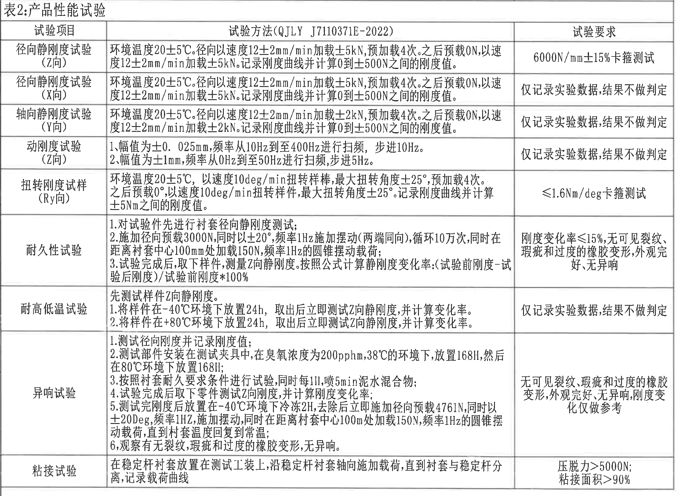

原图位置/视图名称：第1页左侧中部，表2：产品性能试验，bbox [360, 1015, 2610, 2640]。

| 试验项目 | 试验方法(QJLY J7110371E-2022) | 试验要求 |
|---|---|---|
| 径向静刚度试验(Z向) | 环境温度20±5℃。径向以速度12±2mm/min加载±5kN，预加载4次。之后预载0N，以速度12±2mm/min加载±5kN。记录刚度曲线并计算0到±500N之间的刚度值。 | 6000N/mm±15%卡箍测试 |
| 径向静刚度试验(X向) | 环境温度20±5℃。径向以速度12±2mm/min加载±5kN，预加载4次。之后预载0N，以速度12±2mm/min加载±5kN。记录刚度曲线并计算0到±500N之间的刚度值。 | 仅记录实验数据，结果不做判定 |
| 轴向静刚度试验(Y向) | 环境温度20±5℃。径向以速度12±2mm/min加载±2kN，预加载4次。之后预载0N，以速度12±2mm/min加载±2kN。记录刚度曲线并计算0到±500N之间的刚度值。 | 仅记录实验数据，结果不做判定 |
| 动刚度试验(Z向) | 1.幅值为±0.025mm，频率从10Hz到至400Hz进行扫频，步进10Hz。2.幅值为±1mm，频率从0Hz到至50Hz进行扫频，步进5Hz。 | 仅记录实验数据，结果不做判定 |
| 扭转刚度试样(Ry向) | 环境温度20±5℃，以速度10deg/min扭转样棒，最大扭转角度±25°，预加载4次。之后预载0°，以速度10deg/min扭转样件，最大扭转角度±25°。记录刚度曲线并计算±5Nm之间的刚度值。 | ≤1.6Nm/deg卡箍测试 |
| 耐久性试验 | 1.对试验件先进行衬套径向静刚度测试；2.施加径向预载3000N，同时以±20°、频率1Hz施加摆动(两端同向)，循环10万次，同时在距离衬套中心100mm处加载150N，频率1Hz的圆锥摆动载荷；3.试验完成后，取下样件，测量Z向静刚度。按照公式计算静刚度变化率：(试验前刚度-试验后刚度)/试验前刚度*100% | 刚度变化率≤15%，无可见裂纹、瑕疵和过度的橡胶变形，外观完好，无异响 |
| 耐高低温试验 | 先测试样件Z向静刚度。1.将样件在-40℃环境下放置24h，取出后立即测试Z向静刚度，并计算变化率。2.将样件在+80℃环境下放置24h，取出后立即测试Z向静刚度，并计算变化率。 | 仅记录实验数据，结果不做判定 |
| 异响试验 | 1.测试径向刚度并记录刚度值；2.测试部件安装在测试夹具中，在臭氧浓度为200pphm，38℃的环境下，放置168H，然后在80℃环境下放置168H；3.按照衬套耐久要求条件进行试验，同时每1H，喷5min泥水混合物；4.试验完成后取下零件测试Z向刚度，并计算刚度变化率；5.测试完刚度后放置在-40℃环境下冷冻2H，去除后立即施加径向预载4761N，同时以±20Deg，频率1Hz，施加摆动，同时在距离衬套中心100mm处加载150N，频率1Hz的圆锥摆动载荷，直到衬套温度回复到常温；6.观察有无裂纹、瑕疵和过度的橡胶变形，无异响。 | 无可见裂纹、瑕疵和过度的橡胶变形，外观完好，无异响，刚度变化仅做参考 |
| 粘接试验 | 在稳定杆衬套放置在测试工装上，沿稳定杆衬套轴向施加载荷，直到衬套与稳定杆分离，记录载荷曲线 | 压脱力>5000N；粘接面积>90% |

| 提取项 | 原图数值或文本 | 含义说明 |
|---|---|---|
| Z向径向静刚度 | 6000N/mm±15% | 卡箍测试判定要求。 |
| 静刚度环境温度 | 20±5℃ | Z/X/Y向静刚度、扭转刚度试验环境温度。 |
| 静刚度加载速度 | 12±2mm/min | 径向/轴向静刚度加载速度。 |
| 径向加载 | ±5kN | Z/X向径向静刚度加载值。 |
| 轴向加载 | ±2kN | Y向轴向静刚度加载值。 |
| 计算区间 | 0到±500N | 静刚度曲线计算区间。 |
| 动刚度幅值/频率 | ±0.025mm、10Hz到400Hz、步进10Hz；±1mm、0Hz到50Hz、步进5Hz | Z向动刚度扫频条件。 |
| 扭转刚度 | ≤1.6Nm/deg | Ry向扭转刚度卡箍测试要求。 |
| 扭转角度 | ±25° | 扭转刚度最大扭转角。 |
| 耐久载荷 | 3000N、±20°、1Hz、10万次、100mm处150N | 耐久试验摆动与圆锥摆动载荷条件。 |
| 刚度变化率 | ≤15% | 耐久性试验判定限值。 |
| 高低温条件 | -40℃ 24h；+80℃ 24h | 高低温后测试Z向静刚度变化率。 |
| 异响试验臭氧/温度/时间 | 200pphm、38℃、168H；80℃、168H | 异响试验老化条件。 |
| 异响冷冻和加载 | -40℃冷冻2H；4761N；±20Deg；1Hz；100mm处150N | 异响试验低温后加载条件。 |
| 粘接要求 | 压脱力>5000N；粘接面积>90% | 衬套与稳定杆分离载荷和粘接面积要求。 |

边界归属说明：裁切包含表2完整标题、三列表头和全部9项性能试验；右侧试验要求列完整。该对象为性能表，不属于零件加工视图，表内数值按试验条件/要求解读。

## object_3 表3：产品信息

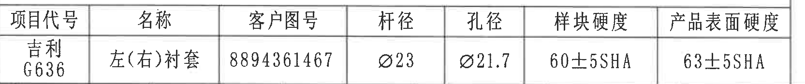

原图位置/视图名称：第1页左下，表3：产品信息，bbox [365, 3160, 2030, 3335]。

| 项目代号 | 名称 | 客户图号 | 杆径 | 孔径 | 样块硬度 | 产品表面硬度 |
|---|---|---|---|---|---|---|
| 吉利G636 | 左(右)衬套 | 8894361467 | Ø23 | Ø21.7 | 60±5SHA | 63±5SHA |

| 提取项 | 原图数值或文本 | 含义说明 |
|---|---|---|
| 杆径 | Ø23 | 匹配稳定杆杆径。 |
| 孔径 | Ø21.7 | 衬套孔径信息。 |
| 样块硬度 | 60±5SHA | 材料样块邵氏硬度。 |
| 产品表面硬度 | 63±5SHA | 成品表面硬度。 |

边界归属说明：裁切仅包含产品信息表的表头和一行数据，底部图框坐标数字不归入表格内容。

## object_4 手写说明

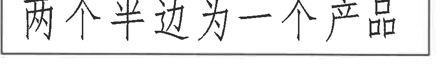

原图位置/视图名称：第1页左下，表2与表3之间的手写说明，bbox [420, 2840, 1330, 3010]。

| 提取项 | 原图数值或文本 | 含义说明 |
|---|---|---|
| 手写说明 | 两个半边为一个产品 | 说明产品由两个半边组成一个完整产品。 |

边界归属说明：裁切只包含矩形框内手写说明，周围空白和相邻表格未纳入。

## object_5 修订履历表

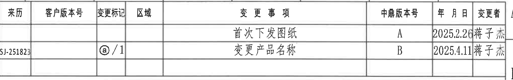

原图位置/视图名称：第1页右上，修订履历表，bbox [2755, 160, 4785, 480]。

| 来历 | 客户版本号 | 变更标记 | 区域 | 变更事项 | 中鼎版本号 | 年月日 | 变更者 |
|---|---|---|---|---|---|---|---|
| SJ-251823 |  | @/1 |  | 首次下发图纸 | A | 2025.2.26 | 蒋子杰 |
|  |  |  |  | 变更产品名称 | B | 2025.4.11 | 蒋子杰 |

| 提取项 | 原图数值或文本 | 含义说明 |
|---|---|---|
| 来历 | SJ-251823 | 修订来源/来历编号。 |
| 变更标记 | @/1 | 图纸变更标记。 |
| 变更事项1 | 首次下发图纸 | 中鼎版本号A，日期2025.2.26，变更者蒋子杰。 |
| 变更事项2 | 变更产品名称 | 中鼎版本号B，日期2025.4.11，变更者蒋子杰。 |

边界归属说明：裁切包含修订履历表全部列和两条记录；右侧图框行号已排除。

## object_6 主加工视图：正视/端面视图

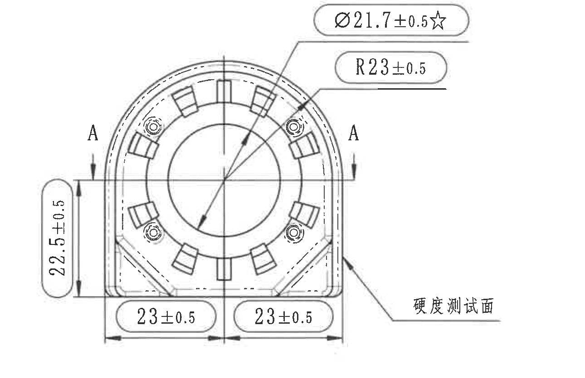

原图位置/视图名称：第1页右中上，主加工视图，bbox [3005, 515, 4295, 1350]。

| 提取项 | 原图数值或文本 | 含义说明 |
|---|---|---|
| 孔径/内圆直径 | Ø21.7±0.5☆ | 直径符号Ø表示圆孔直径；±0.5为公差；☆表示关键特性。技术要求第9条说明关键特性用☆标出。 |
| 外圆弧半径 | R23±0.5 | R表示半径，指向主视图外圆弧/弧向轮廓；±0.5为半径公差。 |
| 左侧竖向尺寸 | 22.5±0.5 | 主视图左侧竖向高度/边距尺寸，完整尺寸线和箭头均在主视图内。 |
| 底部左半宽 | 23±0.5 | 主视图底部左半边横向尺寸；与手写说明“两个半边为一个产品”对应为半边尺寸之一。 |
| 底部右半宽 | 23±0.5 | 主视图底部右半边横向尺寸；与左半边分别标注。 |
| 剖切位置 | A、A | 两处A和箭头定义A-A剖切位置，对应下方A-A剖面。 |
| 表面标注 | 硬度测试面 | 箭头指向右侧外表面，为硬度测试面位置说明。 |

边界归属说明：裁切包含主视图轮廓、中心线、完整尺寸线、箭头和文字；底部A-A剖面未纳入。靠近下边界的两个23±0.5通过完整底部尺寸线和箭头归属于主视图，不归入A-A剖面。

## object_7 A-A剖面视图

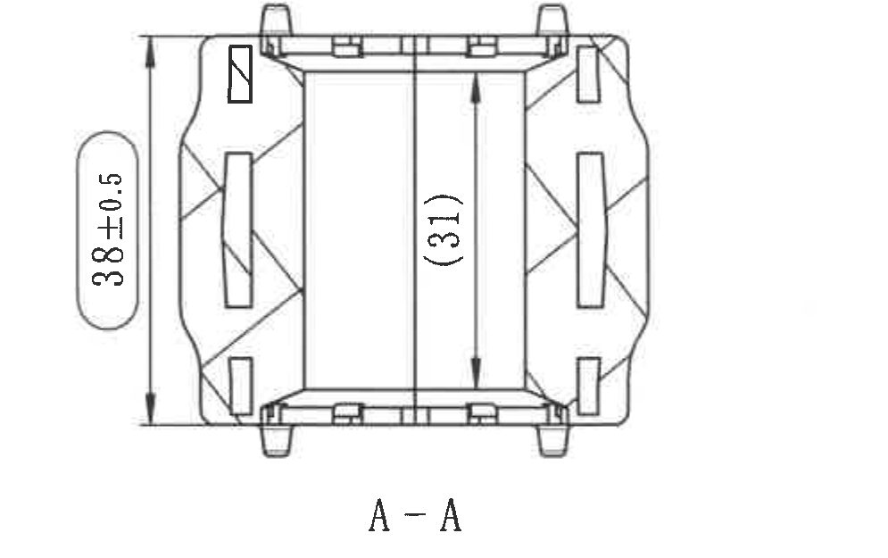

原图位置/视图名称：第1页右中，A-A剖面视图，bbox [3035, 1360, 4030, 1985]。

| 提取项 | 原图数值或文本 | 含义说明 |
|---|---|---|
| 总高度 | 38±0.5 | A-A剖面左侧外形总高度尺寸，±0.5为公差。 |
| 内部参考尺寸 | (31) | 括号内尺寸为参考尺寸，表示剖面中部内腔/内部高度参考值；必须保留但按参考尺寸理解，不作为直接检验控制尺寸。 |
| 剖面名称 | A-A | 与主视图两侧A剖切标识对应。 |

边界归属说明：裁切只包含A-A剖面本体、左侧总高尺寸和内部参考尺寸；下方技术要求未纳入。38±0.5和(31)的尺寸线、箭头、文字均完整。

## object_8 等轴局部视图/3D示意

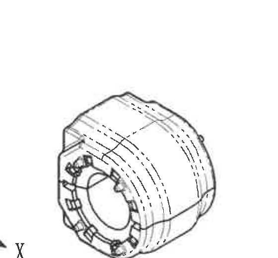

原图位置/视图名称：第1页右侧中下，等轴局部视图，bbox [4160, 1540, 4720, 2060]。

| 提取项 | 原图数值或文本 | 含义说明 |
|---|---|---|
| 三维外形 | 等轴局部视图 | 显示衬套三维外形、端面齿/槽和侧向弧面。 |
| 尺寸标注 | 未见独立尺寸数值、T编号或公差 | 本视图用于形状说明，不提供额外尺寸。 |

边界归属说明：裁切收紧为等轴零件本体，未纳入下方技术要求文字；相邻坐标轴仅为方向示意，不归入本对象尺寸提取。

## object_9 技术要求/NOTES

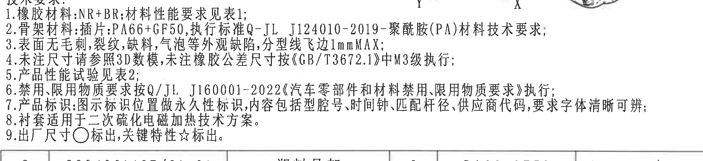

原图位置/视图名称：第1页右中下，技术要求/NOTES，bbox [2750, 2040, 4720, 2495]。

| 序号 | 原图文本 |
|---|---|
| 1 | 橡胶材料:NR+BR;材料性能要求见表1; |
| 2 | 骨架材料:插件:PA66+GF50,执行标准Q-JL J124010-2019-聚酰胺(PA)材料技术要求; |
| 3 | 表面无毛刺,裂纹,缺料,气泡等外观缺陷,分型线飞边1mmMAX; |
| 4 | 未注尺寸请参照3D数模,未注橡胶公差尺寸按《GB/T3672.1》中M3级执行; |
| 5 | 产品性能试验见表2; |
| 6 | 禁用、限用物质要求按Q/JL J160001-2022《汽车零部件和材料禁用、限用物质要求》执行; |
| 7 | 产品标识:图示标识位置做永久性标识,内容包括型腔号、时间钟、匹配杆径、供应商代码,要求字体清晰可辨; |
| 8 | 衬套适用于二次硫化电磁加热技术方案。 |
| 9 | 出厂尺寸○标出,关键特性☆标出。 |

| 提取项 | 原图数值或文本 | 含义说明 |
|---|---|---|
| 橡胶材料 | NR+BR | 橡胶材料配方类型。 |
| 骨架材料 | PA66+GF50 | 插件/骨架材料。 |
| 骨架材料标准 | Q-JL J124010-2019 | 聚酰胺(PA)材料技术要求标准。 |
| 分型线飞边 | 1mmMAX | 外观缺陷限值，飞边最大1mm。 |
| 未注橡胶公差 | GB/T3672.1 M3级 | 未注橡胶公差尺寸执行等级。 |
| 禁限用物质标准 | Q/JL J160001-2022 | 汽车零部件和材料禁用、限用物质要求。 |
| 产品标识内容 | 型腔号、时间钟、匹配杆径、供应商代码 | 永久性标识内容要求。 |
| 符号定义 | ○为出厂尺寸；☆为关键特性 | 用于解释主视图Ø21.7±0.5☆等标注。 |

边界归属说明：裁切完整包含技术要求标题及1-9条；顶部右侧有相邻等轴示意的残线，属于相邻detail对象，不作为NOTES文字。

## object_10 明细表/BOM

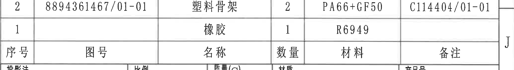

原图位置/视图名称：第1页右下，明细表/BOM，bbox [2750, 2485, 4820, 2770]。

| 序号 | 图号 | 名称 | 数量 | 材料 | 备注 |
|---|---|---|---|---|---|
| 2 | 8894361467/01-01 | 塑料骨架 | 2 | PA66+GF50 | C114404/01-01 |
| 1 |  | 橡胶 | 1 | R6949 |  |

| 提取项 | 原图数值或文本 | 含义说明 |
|---|---|---|
| 塑料骨架 | 图号8894361467/01-01；数量2；材料PA66+GF50；备注C114404/01-01 | 两件塑料骨架组件信息。 |
| 橡胶 | 数量1；材料R6949 | 橡胶材料明细。 |

边界归属说明：裁切包含明细表两行和表头；上方技术要求与下方标题栏不纳入。

## object_11 标题栏

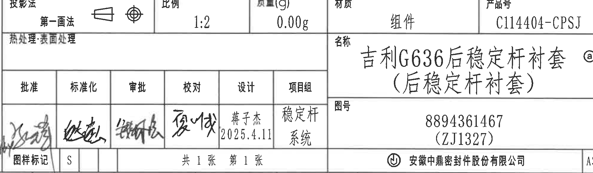

原图位置/视图名称：第1页右下角标题栏，bbox [2745, 2760, 4740, 3345]。

| 字段 | 原图数值或文本 |
|---|---|
| 投影法 | 第一画法 |
| 比例 | 1:2 |
| 质量(g) | 0.00g |
| 材质 | 组件 |
| 产品号 | C114404-CPSJ |
| 热处理/表面处理 | 空白 |
| 名称 | 吉利G636后稳定杆衬套(后稳定杆衬套) @ |
| 图号 | 8894361467 (ZJ1327) |
| 批准 | 签名 |
| 标准化 | 签名 |
| 审批 | 签名 |
| 校对 | 签名 |
| 设计 | 蒋子杰 2025.4.11 |
| 项目组 | 稳定杆系统 |
| 图样标记 | S |
| 页数 | 共1张 第1张 |
| 公司 | 安徽中鼎密封件股份有限公司 |
| 幅面 | A3 |

| 提取项 | 原图数值或文本 | 含义说明 |
|---|---|---|
| 图号 | 8894361467 (ZJ1327) | 图纸编号及括号内编号。 |
| 产品号 | C114404-CPSJ | 产品号。 |
| 名称 | 吉利G636后稳定杆衬套(后稳定杆衬套) @ | 产品名称；@与修订/标记栏对应。 |
| 比例 | 1:2 | 图样比例。 |
| 质量 | 0.00g | 标题栏质量字段。 |
| 设计 | 蒋子杰 2025.4.11 | 设计者及日期。 |
| 项目组 | 稳定杆系统 | 项目组信息。 |

边界归属说明：裁切覆盖标题栏内框字段，排除右侧图框行号和底部图框坐标；左侧签名栏有扫描边缘手写签名切入，属于标题栏签审栏内容。

## 裁切检查记录

| 对象 | 检查结果 | 边界处理 |
|---|---|---|
| object_1 表1 | 完整包含表头、表格线、全部文字；无尺寸线。 | 下边界未纳入表2。 |
| object_2 表2 | 完整包含表头、表格线、全部文字；无尺寸线。 | 上下边界分别避开表1和手写说明。 |
| object_3 表3 | 完整包含表头和数据行。 | 排除底部图框坐标数字。 |
| object_4 手写说明 | 完整包含矩形框和手写文字。 | 不包含相邻表格。 |
| object_5 修订履历表 | 完整包含列头和两条修订记录。 | 收紧右边界，排除图框行号。 |
| object_6 主加工视图 | 完整包含Ø21.7±0.5☆、R23±0.5、22.5±0.5、两个23±0.5、A-A标识、硬度测试面箭头及全部尺寸线/箭头。 | 底部收在主视图尺寸线下方，未带入A-A剖面。 |
| object_7 A-A剖面 | 完整包含38±0.5、(31)、A-A文字及尺寸线/箭头。 | 下边界未纳入技术要求。 |
| object_8 等轴局部视图 | 完整包含等轴零件本体；无独立尺寸文字。 | 收紧裁切，未提取相邻坐标轴和技术要求文字。 |
| object_9 技术要求 | 完整包含“技术要求”标题和1-9条文本。 | 顶部右侧相邻等轴示意残线不归入NOTES内容。 |
| object_10 明细表 | 完整包含明细表表头和两行记录。 | 不纳入上方技术要求和下方标题栏。 |
| object_11 标题栏 | 完整包含标题栏字段、签审栏、公司名、A3和页数。 | 排除右侧图框行号和底部图框坐标。 |
