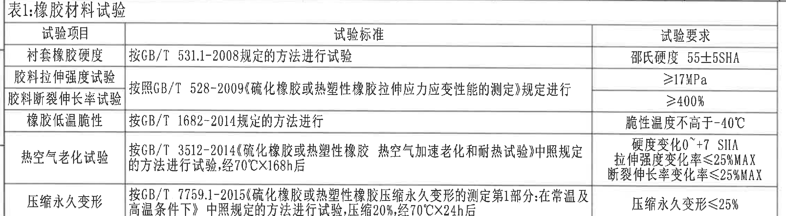
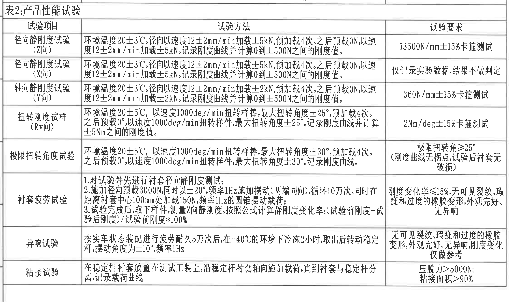
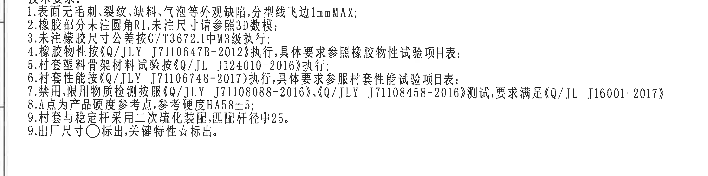
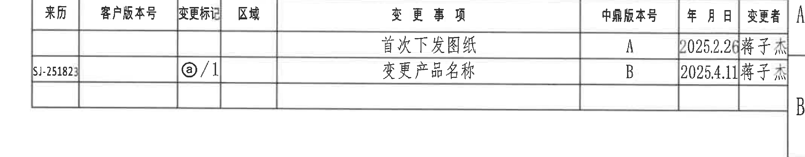
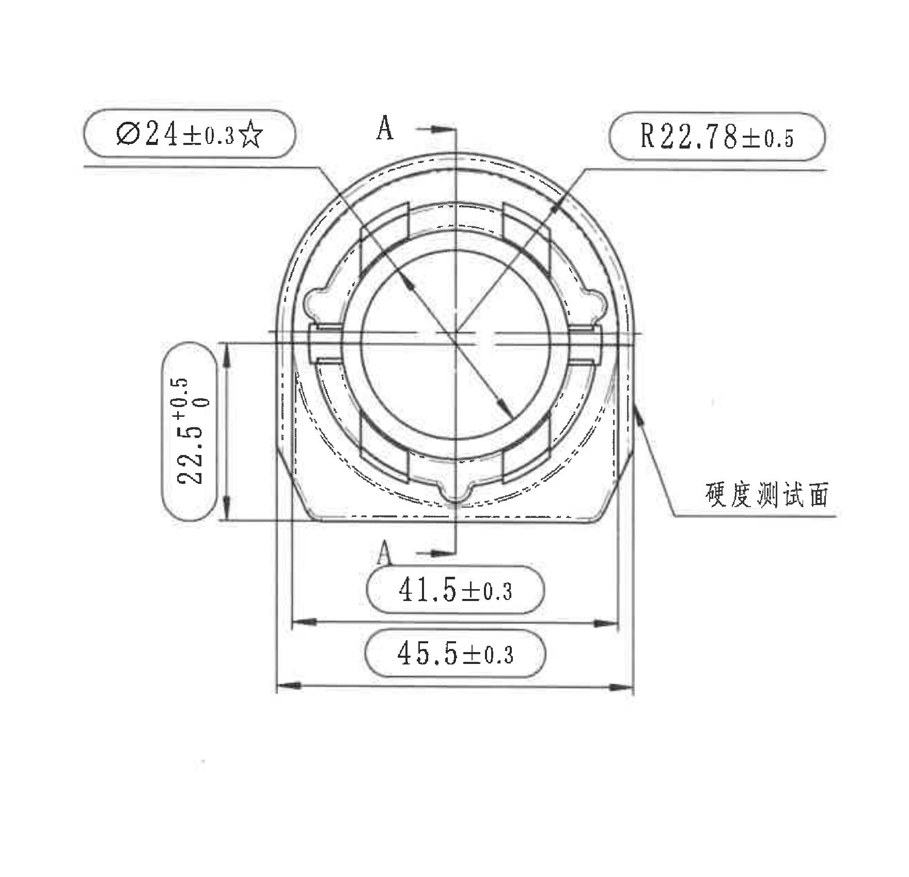
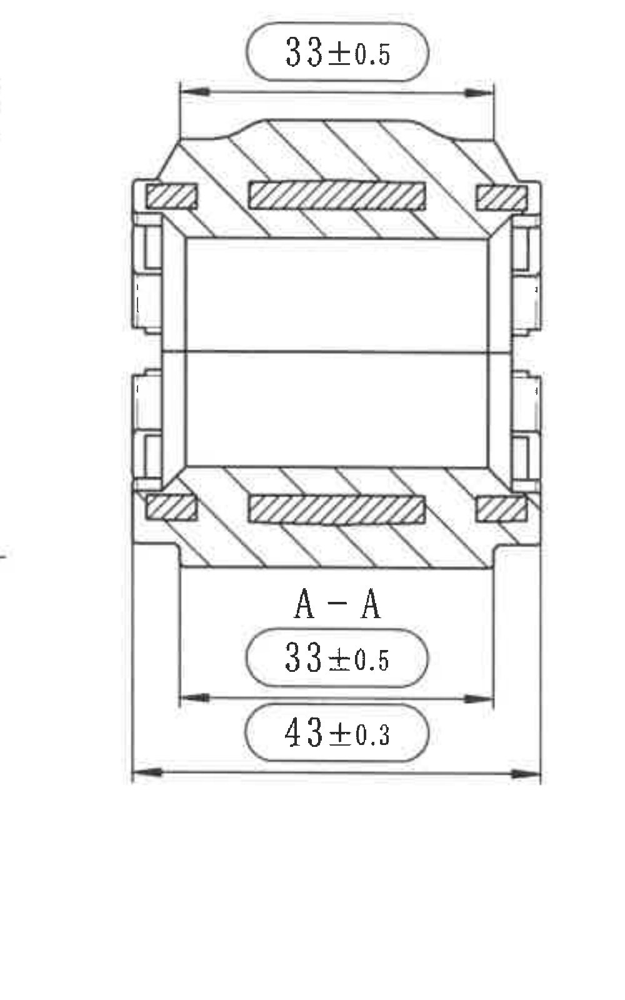
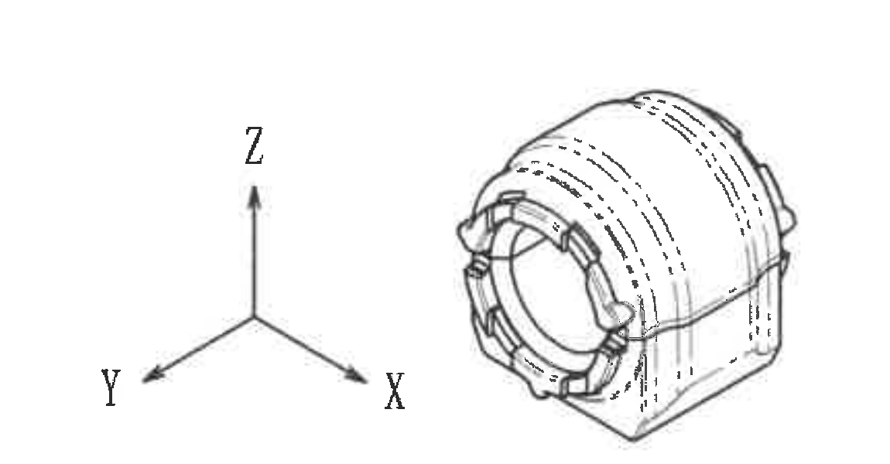
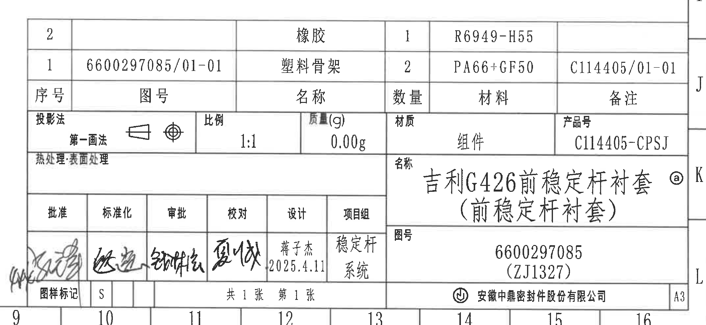

# 20C114405 内容识别与裁切提取

整页渲染图: `outputs/20C114405_assets/images/page_1.png`  
页面尺寸: 6612 x 4673 px, bbox `[0, 0, 6612, 4673]`。  
说明: PDF 为扫描图,无可提取文本层。本文件按整页 PNG 的像素坐标裁切和核读。未发现独立局部放大视图; 图面中独立对象为表格、NOTES、主视图、A-A剖面、轴测参考视图和标题栏。

## object_1 - 表1:橡胶材料试验

原图位置/视图名称: 页面左上区域,表1:橡胶材料试验,bbox `[470, 225, 3000, 830]`。

原表格还原:

| 试验项目 | 试验标准 | 试验要求 |
|---|---|---|
| 衬套橡胶硬度 | 按GB/T 531.1-2008规定的方法进行试验 | 邵氏硬度 55±5SHA |
| 胶料拉伸强度试验 | 按照GB/T 528-2009《硫化橡胶或热塑性橡胶拉伸应力应变性能的测定》规定进行 | ≥17MPa |
| 胶料断裂伸长率试验 | 按照GB/T 528-2009《硫化橡胶或热塑性橡胶拉伸应力应变性能的测定》规定进行 | ≥400% |
| 橡胶低温脆性 | 按GB/T 1682-2014规定的方法进行 | 脆性温度不高于-40℃ |
| 热空气老化试验 | 按GB/T 3512-2014《硫化橡胶或热塑性橡胶 热空气加速老化和耐热试验》中照规定的方法进行试验,经70℃X168h后 | 硬度变化0~+7 SHA 拉伸强度变化率≤25%MAX 断裂伸长率变化率≤25%MAX |
| 压缩永久变形 | 按GB/T 7759.1-2015《硫化橡胶或热塑性橡胶压缩永久变形的测定第1部分:在常温及高温条件下》中照规定的方法进行试验,压缩20%,经70℃X24h后 | 压缩永久变形≤25% |

提取表格:

| 提取项 | 原图数值或文本 | 含义说明 |
|---|---|---|
| 表名 | 表1:橡胶材料试验 | 橡胶材料物性试验项目表。 |
| 硬度要求 | 邵氏硬度 55±5SHA | 衬套橡胶硬度验收范围。 |
| 拉伸强度 | ≥17MPa | 胶料拉伸强度下限。 |
| 断裂伸长率 | ≥400% | 胶料断裂伸长率下限。 |
| 低温脆性 | 脆性温度不高于-40℃ | 低温性能要求。 |
| 热空气老化 | 70℃X168h后; 硬度变化0~+7 SHA; 拉伸强度变化率≤25%MAX; 断裂伸长率变化率≤25%MAX | 老化后硬度、拉伸强度和断裂伸长率变化限制。 |
| 压缩永久变形 | 压缩20%,经70℃X24h后; 压缩永久变形≤25% | 压缩永久变形试验条件和要求。 |

边界归属说明: 裁切只包含表1本体; 下边界截止在“压缩永久变形”行,下方“表2:产品性能试验”不归入本对象。

## object_2 - 表2:产品性能试验

原图位置/视图名称: 页面左中区域,表2:产品性能试验,bbox `[470, 1055, 3000, 1770]`。

原表格还原:

| 试验项目 | 试验方法 | 试验要求 |
|---|---|---|
| 径向静刚度试验（Z向） | 环境温度20±3℃。径向以速度12±2mm/min加载±5kN,预加载4次。之后预载0N,以速度12±2mm/min加载±5kN。记录刚度曲线并计算0到±500N之间的刚度值。 | 13500N/mm±15%卡箍测试 |
| 径向静刚度试验（X向） | 环境温度20±3℃。径向以速度12±2mm/min加载±5kN,预加载4次。之后预载0N,以速度12±2mm/min加载±5kN。记录刚度曲线并计算0到±500N之间的刚度值。 | 仅记录实验数据,结果不做判定 |
| 轴向静刚度试验（Y向） | 环境温度20±3℃。径向以速度12±2mm/min加载±2kN,预加载4次。之后预载0N,以速度12±2mm/min加载±2kN。记录刚度曲线并计算0到±500N之间的刚度值。 | 360N/mm±15%卡箍测试 |
| 扭转刚度试样（Ry向） | 环境温度20±5℃,以速度1000deg/min扭转样棒,最大扭转角度±25°,预加载4次。之后预载0°,以速度1000deg/min扭转样件,最大扭转角度±25°。记录刚度曲线并计算±5Nm之间的刚度值。 | 2Nm/deg±15%卡箍测试 |
| 极限扭转角度试验 | 环境温度20±5℃,以速度1000deg/min扭转样棒,最大扭转角度±30°,预加载4次。之后预载0°,以速度1000deg/min扭转样件,最大扭转角度±30°。记录刚度曲线。 | 极限扭转角≥25° （刚度曲线无拐点,试验后衬套无破损） |
| 衬套疲劳试验 | 1.对试验件先进行衬套径向静刚度测试; 2.施加径向预载3000N,同时以±20°,频率1Hz施加摆动（两端同向）,循环10万次。同时在距离衬套中心100mm处加载150N,频率1Hz的圆锥摆动载荷; 3.试验完成后,取下样件,测量Z向静刚度。按照公式计算静刚度变化率:（试验前刚度-试验后刚度）/试验前刚度*100% | 刚度变化率≤15%,无可见裂纹、瑕疵和过度的橡胶变形,外观完好、无异响 |
| 异响试验 | 按实车状态装配进行疲劳耐久5万次后,在-40℃的环境下冷冻2小时,取出后转动稳定杆,摆动角度为±10°,频率1Hz | 无可见裂纹、瑕疵和过度的橡胶变形,外观完好,无异响,刚度变化仅做参考 |
| 粘接试验 | 在稳定杆衬套放置在测试工装上,沿稳定杆衬套轴向施加载荷,直到衬套与稳定杆分离,记录载荷曲线 | 压脱力>5000N; 粘接面积>90% |

提取表格:

| 提取项 | 原图数值或文本 | 含义说明 |
|---|---|---|
| 径向静刚度Z向 | 13500N/mm±15%卡箍测试 | Z向径向静刚度判定要求。括号内“Z向”为方向说明。 |
| 径向静刚度X向 | 仅记录实验数据,结果不做判定 | X向仅采集数据。括号内“X向”为方向说明。 |
| 轴向静刚度Y向 | 360N/mm±15%卡箍测试 | Y向轴向静刚度判定要求。括号内“Y向”为方向说明。 |
| 扭转刚度Ry向 | 2Nm/deg±15%卡箍测试 | Ry方向扭转刚度判定要求。括号内“Ry向”为方向说明。 |
| 极限扭转角度 | 极限扭转角≥25° | 极限扭转角下限; 括号文本说明判定条件。 |
| 衬套疲劳 | ±20°,1Hz,10万次; 150N; 刚度变化率≤15% | 疲劳工况和判定要求。 |
| 异响 | -40℃冷冻2小时; ±10°,1Hz; 刚度变化仅做参考 | 异响试验环境和摆动条件。 |
| 粘接 | 压脱力>5000N; 粘接面积>90% | 轴向压脱力和粘接面积要求。 |

边界归属说明: 裁切从“表2:产品性能试验”标题开始,到底部“粘接试验”表框结束; 下方NOTES技术要求不归入本对象。

## object_3 - 技术要求 / NOTES

原图位置/视图名称: 页面左下区域,技术要求,bbox `[470, 2890, 3050, 760]`。

提取表格:

| 提取项 | 原图数值或文本 | 含义说明 |
|---|---|---|
| 1 | 表面无毛刺、裂纹、缺料、气泡等外观缺陷,分型线飞边1mmMAX; | 外观和分型线飞边限制。 |
| 2 | 橡胶部分未注圆角R1,未注尺寸请参照3D数模; | 未注圆角和未注尺寸依据。 |
| 3 | 未注橡胶尺寸公差按G/T3672.1中M3级执行; | 未注橡胶尺寸公差等级。 |
| 4 | 橡胶物性按《Q/JLY J7110647B-2012》执行,具体要求参照橡胶物性试验项目表; | 对应表1。 |
| 5 | 衬套塑料骨架材料试验按《Q/JL J124010-2016》执行; | 塑料骨架材料试验标准。 |
| 6 | 衬套性能按《Q/JLY J71106748-2017》执行,具体要求参照衬套性能试验项目表; | 对应表2。 |
| 7 | 禁用、限用物质检测按服《Q/JLY J71108088-2016》、《Q/JLY J71108458-2016》测试,要求满足《Q/JL J16001-2017》; | 禁限用物质检测要求。 |
| 8 | A点为产品硬度参考点,参考硬度HA58±5; | A点为硬度参考点,硬度参考值HA58±5。 |
| 9 | 衬套与稳定杆采用二次硫化装配,匹配杆径φ25。 | 装配工艺和匹配杆径。 |
| 9 | 出厂尺寸○标出,关键特性☆标出。 | 出厂尺寸和关键特性的标识规则; 原图编号重复为9。 |

边界归属说明: 裁切仅包含技术要求文字。上方表2和右侧视图/标题栏均未纳入。

## object_4 - 变更履历表

原图位置/视图名称: 页面右上区域,变更履历表,bbox `[3560, 245, 2850, 560]`。

原表格还原:

| 来历 | 客户版本号 | 变更标记 | 区域 | 变更事项 | 中鼎版本号 | 年月日 | 变更者 |
|---|---|---|---|---|---|---|---|
|  |  |  |  | 首次下发图纸 | A | 2025.2.26 | 蒋子杰 |
| SJ-251823 |  | ⓐ/1 |  | 变更产品名称 | B | 2025.4.11 | 蒋子杰 |

提取表格:

| 提取项 | 原图数值或文本 | 含义说明 |
|---|---|---|
| 修订A | 首次下发图纸; 中鼎版本号A; 2025.2.26; 蒋子杰 | 初次发图记录。 |
| 修订B | 来历SJ-251823; 变更标记ⓐ/1; 变更产品名称; 中鼎版本号B; 2025.4.11; 蒋子杰 | 产品名称变更记录。 |

边界归属说明: 右侧“变更者”列贴近图框边栏,裁切优先保证列内文字完整; 残留图框边栏不作为变更履历内容提取。

## object_5 - 主视图 / 正面加工视图

原图位置/视图名称: 页面中右区域,主视图,bbox `[3590, 940, 1760, 1700]`。

提取表格:

| 提取项 | 原图数值或文本 | 含义说明 |
|---|---|---|
| 直径尺寸 | Ø24±0.3☆ | 带直径符号和关键特性星号,引线指向中心圆孔/内圆相关直径。☆表示关键特性。 |
| 圆弧半径 | R22.78±0.5 | 上部外轮廓圆弧半径尺寸,公差±0.5。 |
| 竖向尺寸 | 22.5 +0.5/0 | 左侧竖向高度/台阶高度尺寸,上偏差+0.5,下偏差0。 |
| 底部内侧宽度 | 41.5±0.3 | 底部较内侧水平宽度,公差±0.3。 |
| 底部外侧总宽 | 45.5±0.3 | 底部外侧水平总宽,公差±0.3。 |
| 剖切基准 | A / A箭头 | 主视图中的剖切线和箭头,对应右侧A-A剖面。 |
| 功能面标注 | 硬度测试面 | 右侧引出标注指示硬度测量面。 |
| 参考尺寸/弧向尺寸 | 未见括号参考尺寸; 未见独立弧长/弧向尺寸 | 圆弧信息以R22.78±0.5表达。 |

边界归属说明: 主视图裁切完整包含尺寸线、箭头、引线和文字。右侧A-A剖面尺寸33±0.5、43±0.3不归入主视图。

## object_6 - A-A剖面视图

原图位置/视图名称: 页面右中区域,A-A剖面视图,bbox `[5200, 1050, 1000, 1600]`。

提取表格:

| 提取项 | 原图数值或文本 | 含义说明 |
|---|---|---|
| 剖面顶部宽度 | 33±0.5 | 剖面上方水平尺寸,公差±0.5。 |
| 剖面名称 | A-A | 来自主视图A-A剖切线。 |
| 剖面下方内侧宽度 | 33±0.5 | 剖面下方较内侧水平尺寸,公差±0.5。 |
| 剖面外侧总宽 | 43±0.3 | 剖面下方外侧总宽,公差±0.3。 |
| 剖面线 | 剖面阴影线 | 表示被剖切材料区域。 |
| 参考尺寸/弧向尺寸 | 未见括号参考尺寸; 未见独立弧长/弧向尺寸 | 本剖面未标注括号参考尺寸或弧向尺寸。 |

边界归属说明: 裁切只包含A-A剖面本体和三处尺寸标注。主视图的Ø24、R22.78、22.5、41.5、45.5不归入本剖面。

## object_7 - 轴测参考视图 / X-Y-Z方向示意

原图位置/视图名称: 页面右下视图区,轴测参考视图,bbox `[5000, 2620, 1150, 600]`。

提取表格:

| 提取项 | 原图数值或文本 | 含义说明 |
|---|---|---|
| X方向 | X | 坐标三轴右下方向。 |
| Y方向 | Y | 坐标三轴左下方向。 |
| Z方向 | Z | 坐标三轴竖直向上方向。 |
| 外形信息 | 前端环形结构、周向凸耳/槽位、底部支承外形 | 轴测图用于表达零件三维外观。 |
| 尺寸信息 | 未标注尺寸、公差或剖切编号 | 本视图无单独尺寸提取项。 |

边界归属说明: 裁切包含完整X/Y/Z方向坐标和轴测外形; 下方BOM/标题栏不归入本对象。

## object_8 - 标题栏 / BOM / 图签

原图位置/视图名称: 页面右下角,标题栏与BOM,bbox `[3560, 3220, 2860, 1320]`。

BOM原表格还原:

| 序号 | 图号 | 名称 | 数量 | 材料 | 备注 |
|---|---|---|---|---|---|
| 2 |  | 橡胶 | 1 | R6949-H55 |  |
| 1 | 6600297085/01-01 | 塑料骨架 | 2 | PA66+GF50 | C114405/01-01 |

标题栏字段还原:

| 字段 | 原图文本 |
|---|---|
| 投影法 | 第一画法 |
| 比例 | 1:1 |
| 质量(g) | 0.00g |
| 材质 | 组件 |
| 产品号 | C114405-CPSJ |
| 名称 | 吉利G426前稳定杆衬套 ⓐ（前稳定杆衬套） |
| 图号 | 6600297085（ZJ1327） |
| 设计 | 蒋子杰 2025.4.11 |
| 项目组 | 稳定杆 系统 |
| 图样标记 | S |
| 张数 | 共1张 第1张 |
| 公司 | 安徽中鼎密封件股份有限公司 |
| 图幅 | A3 |

提取表格:

| 提取项 | 原图数值或文本 | 含义说明 |
|---|---|---|
| 零件/组件名称 | 吉利G426前稳定杆衬套 ⓐ（前稳定杆衬套） | 图纸名称; 括号内为名称补充文本。 |
| 图号 | 6600297085（ZJ1327） | 主图号; 括号内为附加代号。 |
| 产品号 | C114405-CPSJ | 产品编号。 |
| 材质 | 组件 | 标题栏材质字段。 |
| BOM-橡胶 | 名称橡胶; 数量1; 材料R6949-H55 | 组件中橡胶材料条目。 |
| BOM-塑料骨架 | 图号6600297085/01-01; 名称塑料骨架; 数量2; 材料PA66+GF50; 备注C114405/01-01 | 组件中塑料骨架条目。 |
| 投影/比例/质量 | 第一画法; 1:1; 0.00g | 图纸表达方式和比例、质量字段。 |
| 签署信息 | 设计 蒋子杰 2025.4.11; 项目组 稳定杆系统 | 标题栏签署和项目组信息。 |

边界归属说明: 裁切包含BOM、标题栏、签署栏、公司栏和图幅栏; 上方轴测图不归入标题栏对象。

## 裁切检查记录

| 对象 | 图片路径 | 检查结果 | 边界归属结论 |
|---|---|---|---|
| page_1 | outputs/20C114405_assets/images/page_1.png | 整页PNG渲染完整,尺寸6612x4673。 | 作为全部裁切来源。 |
| object_1 | outputs/20C114405_assets/images/object_1.png | 表1标题、表头、6行内容和右侧要求列完整。 | 未带入表2内容。 |
| object_2 | outputs/20C114405_assets/images/object_2.png | 表2标题、表头、8行内容完整,底部表框完整。 | 未带入下方技术要求。 |
| object_3 | outputs/20C114405_assets/images/object_3.png | 技术要求1-9条完整,重复编号9保留。 | 未带入表2或标题栏。 |
| object_4 | outputs/20C114405_assets/images/object_4.png | 变更履历表头、两条记录和“变更者”列完整。 | 右侧少量图框边栏不提取为表格内容。 |
| object_5 | outputs/20C114405_assets/images/object_5.png | 主视图全部尺寸线、箭头、引线和文字完整。 | A-A剖面尺寸未混入主视图提取。 |
| object_6 | outputs/20C114405_assets/images/object_6.png | A-A剖面三条尺寸线和A-A文字完整。 | 主视图尺寸未归入剖面。 |
| object_7 | outputs/20C114405_assets/images/object_7.png | 轴测本体和X/Y/Z方向标注完整。 | 下方BOM/标题栏未混入。 |
| object_8 | outputs/20C114405_assets/images/object_8.png | BOM、标题栏、签署栏、公司栏、图幅栏完整。 | 上方轴测图未归入标题栏。 |
