# 20C114406 内容识别结果

整页渲染图：

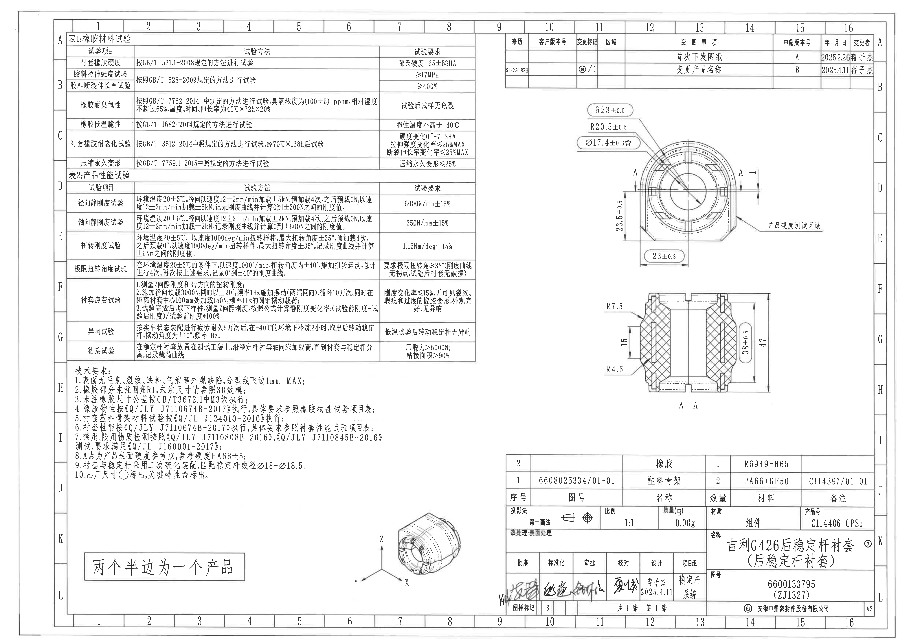

页面尺寸：4959 x 3505 px。以下对象按原图左侧自上而下、右侧自上而下及底部对象排列。裁切图均来自整页 PNG，不直接从 PDF 局部截图。

## object_1 - 表1:橡胶材料试验

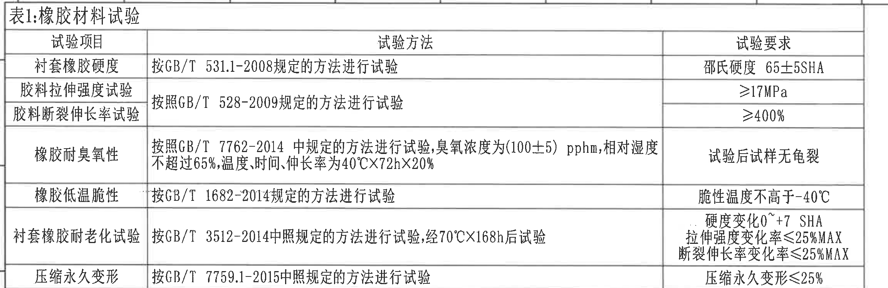

原图位置/视图名称：页面左上，表1:橡胶材料试验。object_kind：table。bbox：[350, 170, 2655, 920]。

### 原表还原

| 试验项目 | 试验方法 | 试验要求 |
|---|---|---|
| 衬套橡胶硬度 | 按GB/T 531.1-2008规定的方法进行试验 | 邵氏硬度 65±5SHA |
| 胶料拉伸强度试验 | 按照GB/T 528-2009规定的方法进行试验 | ≥17MPa |
| 胶料断裂伸长率试验 | 按照GB/T 528-2009规定的方法进行试验 | ≥400% |
| 橡胶耐臭氧性 | 按照GB/T 7762-2014 中规定的方法进行试验,臭氧浓度为(100±5) pphm,相对湿度不超过65%,温度,时间,伸长率为40℃X72hX20% | 试验后试样无龟裂 |
| 橡胶低温脆性 | 按GB/T 1682-2014规定的方法进行试验 | 脆性温度不高于-40℃ |
| 衬套橡胶耐老化试验 | 按GB/T 3512-2014中照规定的方法进行试验,经70℃X168h后试验 | 硬度变化0~+7 SHA；拉伸强度变化率≤25%MAX；断裂伸长率变化率≤25%MAX |
| 压缩永久变形 | 按GB/T 7759.1-2015中照规定的方法进行试验 | 压缩永久变形≤25% |

### 提取与说明

| 提取项 | 原图数值或文本 | 含义说明 |
|---|---|---|
| 表名 | 表1:橡胶材料试验 | 橡胶材料本体的硬度、拉伸、臭氧、低温、老化、压缩永久变形试验要求。 |
| 关键数值 | 65±5SHA、≥17MPa、≥400%、(100±5) pphm、不超过65%、40℃X72hX20%、-40℃、0~+7 SHA、≤25%MAX、≤25% | 均为材料性能验收值或试验条件；括号内(100±5)为臭氧浓度试验条件公差，不是加工视图参考尺寸。 |
| 标准编号 | GB/T 531.1-2008、GB/T 528-2009、GB/T 7762-2014、GB/T 1682-2014、GB/T 3512-2014、GB/T 7759.1-2015 | 对应各材料试验方法来源。 |

边界归属说明：本裁切仅包含表1标题、表头、7条试验行和表格底边；表2标题未纳入本对象。表中所有文字归属表1，不归入加工视图或技术要求。

## object_2 - 表2:产品性能试验

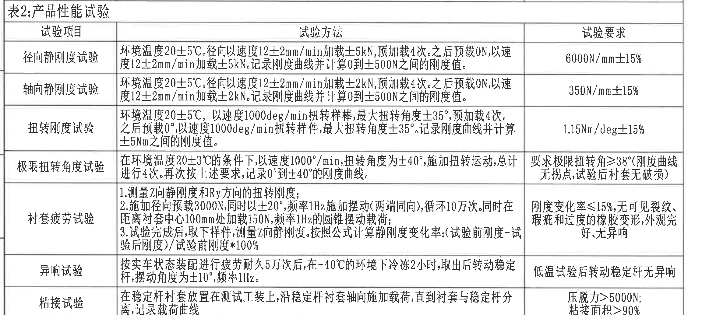

原图位置/视图名称：页面左中，表2:产品性能试验。object_kind：table。bbox：[350, 920, 2655, 1955]。

### 原表还原

| 试验项目 | 试验方法 | 试验要求 |
|---|---|---|
| 径向静刚度试验 | 环境温度20±5℃。径向以速度12±2mm/min加载±5kN,预加载4次。之后预载0N,以速度12±2mm/min加载±5kN。记录刚度曲线并计算0到±500N之间的刚度值。 | 6000N/mm±15% |
| 轴向静刚度试验 | 环境温度20±5℃。径向以速度12±2mm/min加载±2kN,预加载4次。之后预载0N,以速度12±2mm/min加载±2kN。记录刚度曲线并计算0到±500N之间的刚度值。 | 350N/mm±15% |
| 扭转刚度试验 | 环境温度20±5℃,以速度1000deg/min扭转样棒,最大扭转角度±35°,预加载4次。之后预载0°,以速度1000deg/min扭转样件,最大扭转角度±35°。记录刚度曲线并计算±5Nm之间的刚度值。 | 1.15Nm/deg±15% |
| 极限扭转角度试验 | 在环境温度20±3℃的条件下,以速度1000°/min,扭转角度为±40°,施加扭转运动,总计进行4次。再次按上述要求,记录0°到±40°的刚度曲线。 | 要求极限扭转角≥38°(刚度曲线无拐点,试验后衬套无破损) |
| 衬套疲劳试验 | 1.测量Z向静刚度和Ry方向的扭转刚度。 2.施加径向预载3000N,同时以±20°,频率1Hz施加摆动(两端同向),循环10万次。同时在距离衬套中心100mm处加载150N,频率1Hz的圆锥摆动载荷; 3.试验完成后,取下样件,测量Z向静刚度。按照公式计算静刚度变化率:(试验前刚度-试验后刚度)/试验前刚度*100% | 刚度变化率≤15%,无可见裂纹、瑕疵和过度的橡胶变形,外观完好,无异响 |
| 异响试验 | 按实车状态装配进行疲劳耐久5万次后,在-40℃的环境下冷冻2小时,取出后转动稳定杆,摆动角度为±10°,频率1Hz。 | 低温试验后转动稳定杆无异响 |
| 粘接试验 | 在稳定杆衬套放置在测试工装上,沿稳定杆衬套轴向施加载荷,直到衬套与稳定杆分离,记录载荷曲线 | 压脱力>5000N; 粘接面积>90% |

### 提取与说明

| 提取项 | 原图数值或文本 | 含义说明 |
|---|---|---|
| 表名 | 表2:产品性能试验 | 成品衬套的刚度、扭转、疲劳、异响、粘接性能试验项目。 |
| 刚度要求 | 6000N/mm±15%、350N/mm±15%、1.15Nm/deg±15% | 分别对应径向静刚度、轴向静刚度和扭转刚度验收值。 |
| 角度/转速 | ±35°、±40°、≥38°、1000deg/min、1000°/min、±20°、±10° | 表内为试验角度和加载速度，不是加工视图角度尺寸。 |
| 载荷/频率/次数 | ±5kN、±2kN、3000N、150N、1Hz、10万次、5万次 | 表内为性能试验加载条件。 |
| 括号内容 | (刚度曲线无拐点,试验后衬套无破损)、(两端同向)、(试验前刚度-试验后刚度)/试验前刚度*100% | 表内括号均为试验条件或公式说明，不是加工视图参考尺寸。 |

边界归属说明：本裁切包含表2的标题、表头和7条试验行；下方技术要求不归入本对象。表中角度、载荷、频率属于试验要求，不归入主视图或剖视图尺寸。

## object_3 - 技术要求

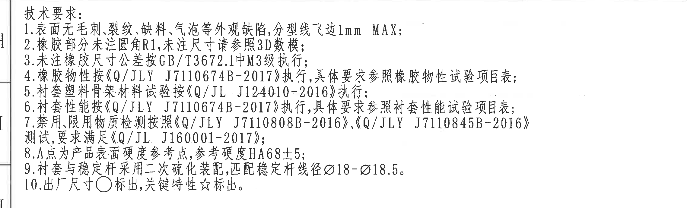

原图位置/视图名称：页面左下，技术要求/NOTES。object_kind：notes。bbox：[330, 1980, 2650, 2670]。

### 提取表格

| 提取项 | 原图数值或文本 | 含义说明 |
|---|---|---|
| 标题 | 技术要求: | 以下10条为整张图纸通用技术要求。 |
| 1 | 表面无毛刺、裂纹、缺料、气泡等外观缺陷,分型线飞边1mm MAX; | 外观质量和分型线飞边最大允许值。 |
| 2 | 橡胶部分未注圆角R1,未注尺寸请参照3D数模; | 未标注橡胶圆角按R1，未注尺寸需参考3D数模。 |
| 3 | 未注橡胶尺寸公差按GB/T3672.1中M3级执行; | 加工视图中未单独标注公差的橡胶尺寸按该标准M3级处理。 |
| 4 | 橡胶物性按《Q/JLY J7110674B-2017》执行,具体要求参照橡胶物性试验项目表; | 关联表1橡胶材料试验。 |
| 5 | 衬套塑料骨架材料试验按《Q/JL J124010-2016》执行; | 关联塑料骨架材料试验规范。 |
| 6 | 衬套性能按《Q/JLY J7110674B-2017》执行,具体要求参照衬套性能试验项目表; | 关联表2产品性能试验。 |
| 7 | 禁用,限用物质检测按照《Q/JLY J7110808B-2016》,《Q/JLY J7110845B-2016》测试,要求满足《Q/JL J160001-2017》; | 物质禁限用检测要求。 |
| 8 | A点为产品表面硬度参考点,参考硬度HA68±5; | 硬度参考点及参考硬度；主视图中另有“产品硬度测试区域”引线。 |
| 9 | 衬套与稳定杆采用二次硫化装配,匹配稳定杆线径Ø18-Ø18.5。 | 装配工艺与匹配稳定杆线径范围。 |
| 10 | 出厂尺寸○标出,关键特性☆标出。 | 解释加工视图中圆角框/圈出尺寸和星号尺寸的含义。 |

边界归属说明：本裁切仅包含左下技术要求文字块。其通用公差和符号说明适用于加工视图，但本对象内没有独立几何尺寸线。

## object_4 - 手写说明

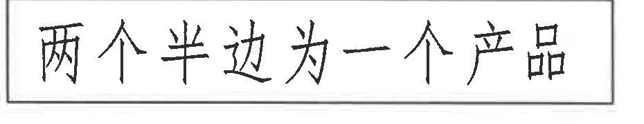

原图位置/视图名称：页面左下角手写框。object_kind：notes。bbox：[450, 3020, 1380, 3200]。

### 提取表格

| 提取项 | 原图数值或文本 | 含义说明 |
|---|---|---|
| 手写说明 | 两个半边为一个产品 | 说明产品由两个半边组成一个完整产品。 |

边界归属说明：该手写框独立于技术要求、轴测图和标题栏；裁切仅包含手写框和边框。

## object_5 - 修订履历表

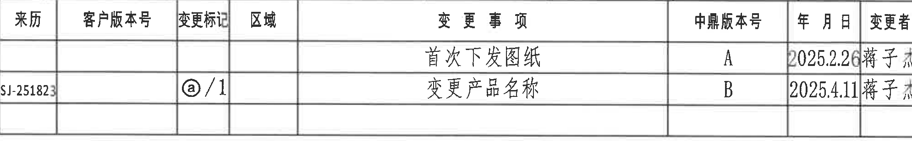

原图位置/视图名称：页面右上，修订/变更履历表。object_kind：table。bbox：[2760, 185, 4750, 495]。

### 原表还原

| 来历 | 客户版本号 | 变更标记 | 区域 | 变更事项 | 中鼎版本号 | 年月日 | 变更者 |
|---|---|---|---|---|---|---|---|
|  |  |  |  | 首次下发图纸 | A | 2025.2.26 | 蒋子杰 |
| SJ-251823 |  | ⓐ/1 |  | 变更产品名称 | B | 2025.4.11 | 蒋子杰 |

### 提取与说明

| 提取项 | 原图数值或文本 | 含义说明 |
|---|---|---|
| 版本A | 首次下发图纸；中鼎版本号A；2025.2.26；蒋子杰 | 初次发行记录。 |
| 版本B | 来历SJ-251823；变更标记ⓐ/1；变更产品名称；中鼎版本号B；2025.4.11；蒋子杰 | 产品名称变更记录；ⓐ与标题栏产品名称旁的圈注标记对应。 |

边界归属说明：本裁切包含修订表完整列宽和两条记录。最右列“变更者”贴近图框，已按表格外框重裁；右侧图框坐标字母未纳入内容提取。

## object_6 - 主加工视图

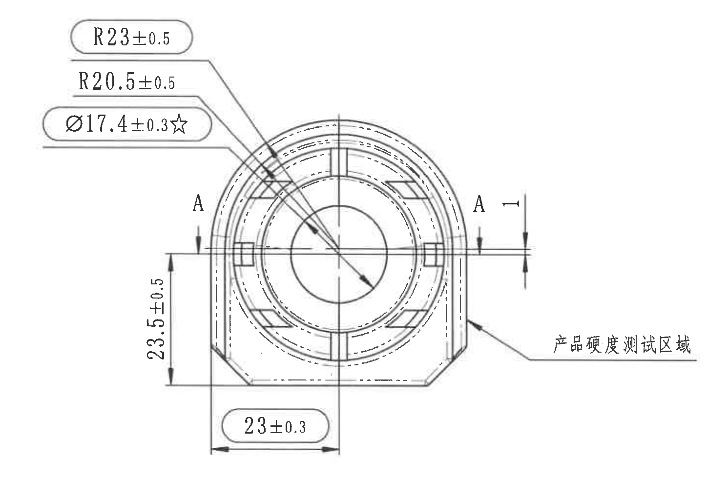

原图位置/视图名称：页面右中上，主加工视图/正视图。object_kind：view。bbox：[3060, 525, 4510, 1505]。

### 提取表格

| 提取项 | 原图数值或文本 | 含义说明 |
|---|---|---|
| 半径尺寸 | R23±0.5 | 上方外圆弧半径尺寸；原图以圆角框标出，按技术要求第10条作为出厂尺寸标注。 |
| 半径尺寸 | R20.5±0.5 | 内侧/相邻圆弧半径尺寸；带独立公差±0.5。 |
| 直径尺寸 | Ø17.4±0.3☆ | 直径尺寸，带公差±0.3；☆表示关键特性。 |
| 竖向尺寸 | 23.5±0.5 | 左侧竖向尺寸，带公差±0.5；尺寸线和箭头均在主视图内。 |
| 横向尺寸 | 23±0.3 | 底部横向尺寸，带公差±0.3；原图以圆角框标出，按技术要求第10条作为出厂尺寸标注。 |
| 剖切标识 | A / A | 主视图中左右A为A-A剖切位置标识，对应object_7剖视图，不是基准字母尺寸。 |
| 功能区域 | 产品硬度测试区域 | 右侧引线指向产品外侧测试区域；与技术要求第8条A点硬度参考说明相关。 |
| 参考尺寸 | 未见括号内参考尺寸 | 本主视图没有括号包围的参考尺寸。 |
| T编号 | 未见T编号 | 本视图未出现T编号。 |
| 通用公差 | 未注橡胶尺寸公差按GB/T3672.1中M3级执行 | 由技术要求第3条给出，适用于未单独标注公差的橡胶尺寸。 |

边界归属说明：本裁切完整包含主视图的尺寸文字、引线、箭头和A-A剖切标识；下方A-A剖视图未混入。靠近右边界的“产品硬度测试区域”引线和文字属于主视图，未归入标题栏或剖视图。

## object_7 - A-A剖视图

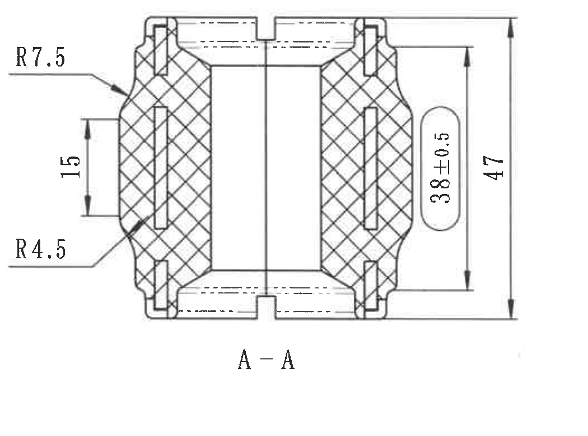

原图位置/视图名称：页面右中下，A-A剖面视图。object_kind：section。bbox：[3280, 1570, 4330, 2350]。

### 提取表格

| 提取项 | 原图数值或文本 | 含义说明 |
|---|---|---|
| 剖面名称 | A-A | 对应主视图中的A-A剖切位置。 |
| 半径尺寸 | R7.5 | 左上圆角/弧面半径；原图未随尺寸给出独立公差。 |
| 竖向尺寸 | 15 | 左侧局部竖向高度尺寸；原图未随尺寸给出独立公差。 |
| 半径尺寸 | R4.5 | 左下圆角/弧面半径；原图未随尺寸给出独立公差。 |
| 竖向尺寸 | 38±0.5 | 右侧内侧竖向尺寸，带公差±0.5；原图以圆角框标出，按技术要求第10条作为出厂尺寸标注。 |
| 总高度 | 47 | 最右侧总高度尺寸；原图未随尺寸给出独立公差。 |
| 剖面表达 | 交叉剖面线 | 剖面线表示被剖切实体区域。 |
| 参考尺寸 | 未见括号内参考尺寸 | 本剖视图没有括号包围的参考尺寸。 |
| T编号 | 未见T编号 | 本剖视图未出现T编号。 |
| 通用公差 | 未注橡胶尺寸公差按GB/T3672.1中M3级执行 | 对未单独标注公差的橡胶尺寸，按技术要求第3条处理。 |

边界归属说明：本裁切完整包含R7.5、15、R4.5、38±0.5、47及A-A文字。上方主视图和右下标题栏均未纳入；这些尺寸只归属剖视图，不归入主视图。

## object_8 - 轴测图

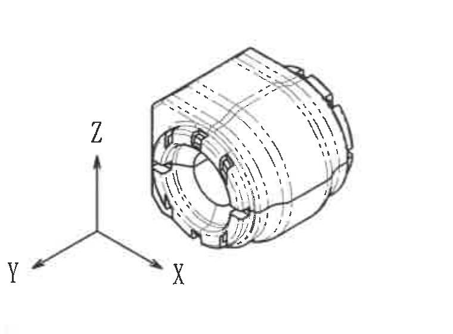

原图位置/视图名称：页面下部中间，轴测/三维示意图。object_kind：view。bbox：[1920, 2720, 2680, 3280]。

### 提取表格

| 提取项 | 原图数值或文本 | 含义说明 |
|---|---|---|
| 视图内容 | 零件轴测图 | 展示产品三维形态、端部结构和环向特征。 |
| 坐标标识 | X、Y、Z | 轴测图方向坐标，用于说明三维方向。 |
| 尺寸标注 | 未见尺寸数值 | 本对象未标注尺寸、公差、半径、直径、角度或T编号。 |
| 参考尺寸 | 未见括号内参考尺寸 | 本轴测图没有括号包围的参考尺寸。 |

边界归属说明：该裁切仅包含轴测图和X/Y/Z坐标箭头；左侧手写说明、右侧标题栏和主/剖视图尺寸均未纳入本对象。

## object_9 - 明细表与参数栏

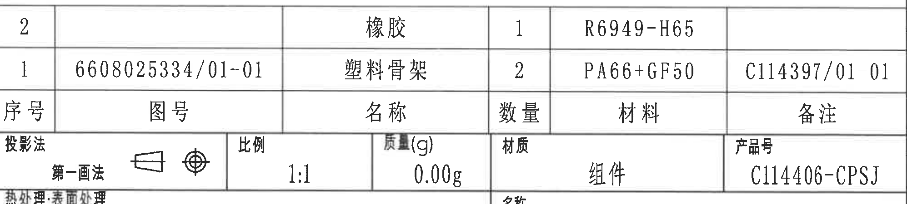

原图位置/视图名称：页面右下上部，明细表、投影法/比例/质量/材质/产品号参数栏。object_kind：table。bbox：[2775, 2470, 4770, 2920]。

### 原表还原 - 明细表

| 序号 | 图号 | 名称 | 数量 | 材料 | 备注 |
|---|---|---|---|---|---|
| 2 |  | 橡胶 | 1 | R6949-H65 |  |
| 1 | 6608025334/01-01 | 塑料骨架 | 2 | PA66+GF50 | C114397/01-01 |

### 原表还原 - 参数栏

| 项目 | 原图文本 |
|---|---|
| 投影法 | 第一画法 |
| 投影符号 | 第一画法符号 |
| 比例 | 1:1 |
| 质量(g) | 0.00g |
| 材质 | 组件 |
| 产品号 | C114406-CPSJ |

### 提取与说明

| 提取项 | 原图数值或文本 | 含义说明 |
|---|---|---|
| 明细序号2 | 橡胶；数量1；材料R6949-H65 | 成品中的橡胶件材料。 |
| 明细序号1 | 图号6608025334/01-01；塑料骨架；数量2；材料PA66+GF50；备注C114397/01-01 | 成品中的塑料骨架件。 |
| 比例 | 1:1 | 图样比例。 |
| 质量 | 0.00g | 标题栏参数中的质量字段。 |
| 材质 | 组件 | 总成材质/类型字段。 |
| 产品号 | C114406-CPSJ | 产品号字段，不同于标题栏图号6600133795。 |

边界归属说明：本裁切为了保留完整参数栏底线，与标题栏上边界有少量横线重叠；提取内容只归属明细表和参数栏。下方“热处理:表面处理”、名称、图号、签字栏归入object_10，不在本对象重复提取。

## object_10 - 标题栏

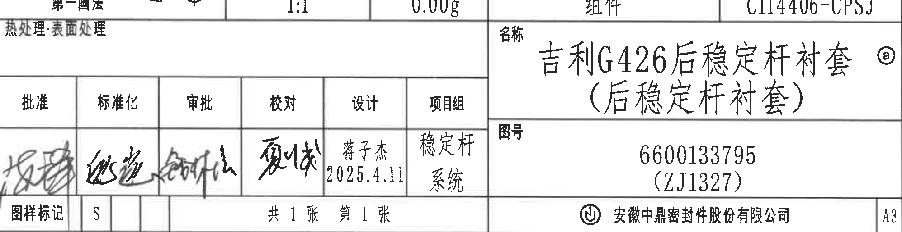

原图位置/视图名称：页面右下标题栏。object_kind：title_block。bbox：[2775, 2845, 4770, 3360]。

### 原表还原

| 字段 | 原图文本 |
|---|---|
| 热处理 | 表面处理 |
| 名称 | 吉利G426后稳定杆衬套（后稳定杆衬套）ⓐ |
| 图号 | 6600133795（ZJ1327） |
| 批准 | 手写签名 |
| 标准化 | 手写签名 |
| 审批 | 手写签名 |
| 校对 | 手写签名 |
| 设计 | 蒋子杰 2025.4.11 |
| 项目组 | 稳定杆系统 |
| 图样标记 | S |
| 张数 | 共1张 第1张 |
| 公司 | 安徽中鼎密封件股份有限公司 |
| 图幅 | A3 |

### 提取与说明

| 提取项 | 原图数值或文本 | 含义说明 |
|---|---|---|
| 产品名称 | 吉利G426后稳定杆衬套（后稳定杆衬套）ⓐ | 圈注ⓐ对应修订履历中的变更标记ⓐ/1，表示产品名称变更位置。 |
| 图号 | 6600133795（ZJ1327） | 标题栏图号及括号内代号；括号内容为图号代号，不是加工参考尺寸。 |
| 设计 | 蒋子杰 2025.4.11 | 设计责任人与日期。 |
| 项目组 | 稳定杆系统 | 所属项目组。 |
| 图样标记/张数 | S；共1张 第1张 | 图样状态标记和页数。 |
| 公司/图幅 | 安徽中鼎密封件股份有限公司；A3 | 出图公司和图纸幅面。 |

边界归属说明：本裁切包含标题栏主字段、签字栏、图样标记、公司和A3图幅。顶部可见参数栏底部边线是相邻单元格边界，参数栏内容已归入object_9；右侧A3完整保留，外侧图框坐标字母未纳入提取。

## 裁切检查记录

| 对象 | 图片路径 | 检查结果 | 归属确认 |
|---|---|---|---|
| page_1 | outputs/20C114406_assets/images/page_1.png | 整页PNG已渲染，尺寸4959 x 3505 px。 | 全页参考图，不作为局部提取对象。 |
| object_1 | outputs/20C114406_assets/images/object_1.png | 完整包含表1标题、表头、全部行列和底边；未裁掉文字。 | 未混入表2内容。 |
| object_2 | outputs/20C114406_assets/images/object_2.png | 完整包含表2标题、表头、全部行列和底边；底部“粘接试验”文字完整。 | 下方技术要求未归入表2。 |
| object_3 | outputs/20C114406_assets/images/object_3.png | 完整包含“技术要求”标题和1-10条文字。 | 未混入右侧标题栏或轴测图。 |
| object_4 | outputs/20C114406_assets/images/object_4.png | 完整包含手写框、边框和“两个半边为一个产品”文字。 | 独立说明，不归入技术要求表。 |
| object_5 | outputs/20C114406_assets/images/object_5.png | 完整包含修订表列、两条记录、日期和变更者；最右列贴近边界但文字完整。 | 右侧图框坐标未作为表格内容提取。 |
| object_6 | outputs/20C114406_assets/images/object_6.png | 完整包含R23±0.5、R20.5±0.5、Ø17.4±0.3☆、23.5±0.5、23±0.3、A-A标识和产品硬度测试区域引线。 | 下方A-A剖视图未混入；主视图尺寸只归属object_6。 |
| object_7 | outputs/20C114406_assets/images/object_7.png | 完整包含R7.5、15、R4.5、38±0.5、47和A-A标题。 | 未混入主视图或标题栏；剖面尺寸只归属object_7。 |
| object_8 | outputs/20C114406_assets/images/object_8.png | 完整包含轴测图和X/Y/Z坐标箭头。 | 该视图无尺寸标注，不归入主视图或剖视图尺寸。 |
| object_9 | outputs/20C114406_assets/images/object_9.png | 完整包含明细表两行和投影法/比例/质量/材质/产品号参数栏。 | 与object_10有相邻边线重叠；标题栏字段不在object_9重复提取。 |
| object_10 | outputs/20C114406_assets/images/object_10.png | 完整包含标题栏名称、图号、签字栏、图样标记、公司和A3；右端A3未裁掉。 | 参数栏已归入object_9；标题栏字段只归属object_10。 |
