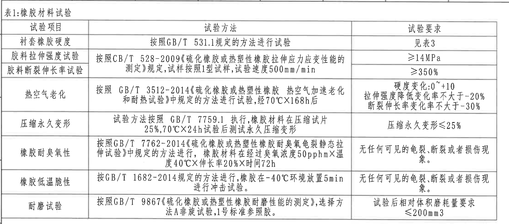
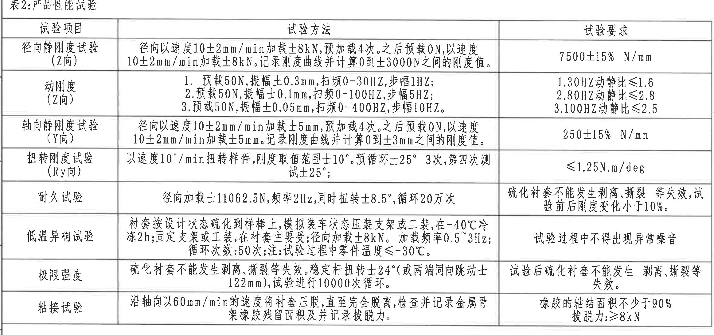
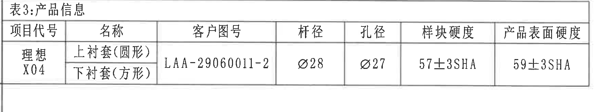
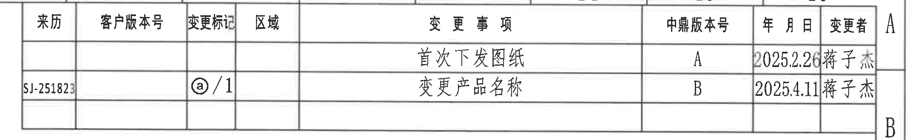
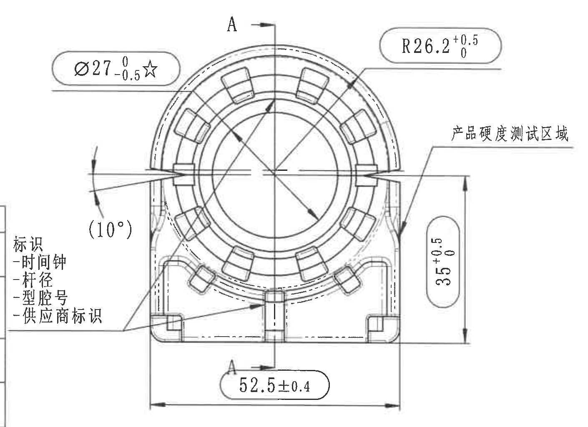
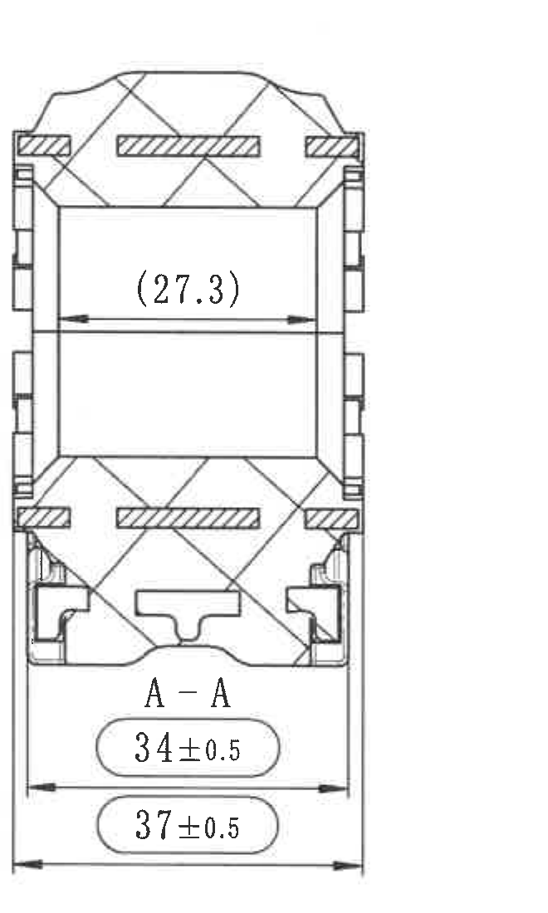
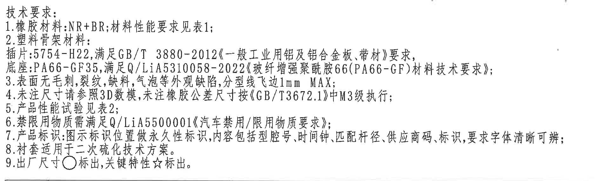
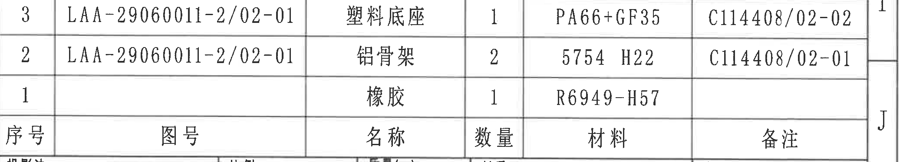
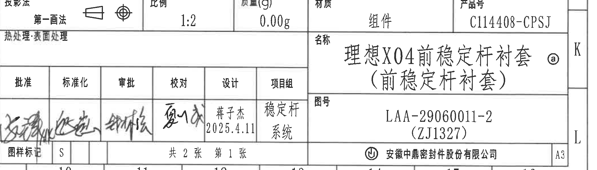
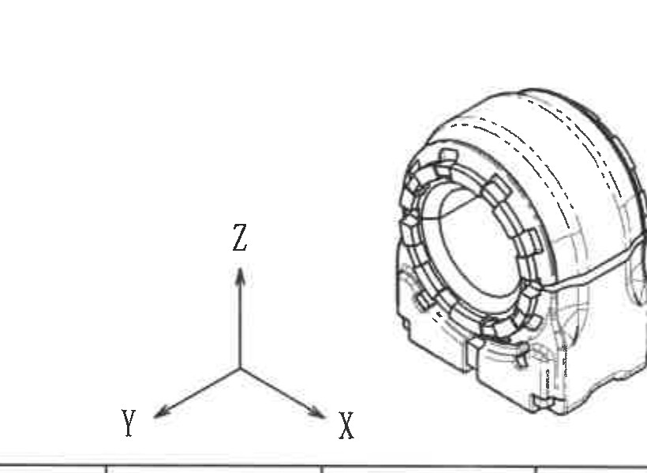

# 20C114408 内容识别

源文件：`input/20C114408.pdf`  
整页渲染图：`20C114408_assets/images/page_1.png`  
页数：1 页；整页 PNG 尺寸：4959 x 3505 px。  
坐标说明：下述 bbox 均为整页 PNG 像素坐标 `[x0, y0, x1, y1]`，原点在左上角。

## object_1：表1 橡胶材料试验

原图位置/视图名称：第 1 页左上区域，表1：橡胶材料试验，bbox `[355, 160, 2575, 1140]`。

### 原表还原

| 试验项目 | 试验方法 | 试验要求 |
|---|---|---|
| 衬套橡胶硬度 | 按照 GB/T 531.1 规定的方法进行试验 | 见表3 |
| 胶料拉伸强度试验 | 按照 GB/T 528-2009《硫化橡胶或热塑性橡胶拉伸应力应变性能的测定》规定，试样按照 1 型试样，试验速度 500mm/min | ≥14MPa |
| 胶料断裂伸长率试验 | 按照 GB/T 528-2009《硫化橡胶或热塑性橡胶拉伸应力应变性能的测定》规定，试样按照 1 型试样，试验速度 500mm/min | ≥350% |
| 热空气老化 | 按照 GB/T 3512-2014《硫化橡胶或热塑性橡胶 热空气加速老化和耐热试验》中规定的方法进行试验，经 70°C×168h 后 | 硬度变化：0~+10；拉伸强度降低变化率不大于 -20%；断裂伸长率变化率不大于 -30% |
| 压缩永久变形 | 试验方法按照 GB/T 7759.1 执行，橡胶材料在压缩试片 25%，70°C×24h 试验后测试永久压缩变形 | 压缩永久变形 ≤25% |
| 橡胶耐臭氧性 | 按照 GB/T 7762-2014《硫化橡胶或热塑性橡胶耐臭氧龟裂静态拉伸试验》中规定的方法进行，橡胶材料在经过臭氧浓度 50pphm×温度 40°C×伸长率 20%×时间 72h | 无任何可见的龟裂、断裂或者损伤现象。 |
| 橡胶低温脆性 | 按 GB/T 1682-2014 规定的方法进行，橡胶在 -40°C 环境放置 5min 进行冲击试验。 | 无任何可见的龟裂、断裂或者损伤现象。 |
| 耐磨试验 | 按照 GB/T 9867《硫化橡胶或热塑性橡胶耐磨性能的测定》，选择方法 A 非旋试验，1 号标准参照胶。 | 试验后相对体积磨耗量要求 ≤200mm3 |

### 提取表

| 提取项 | 原图数值或文本 | 含义说明 |
|---|---|---|
| 表名 | 表1：橡胶材料试验 | 规定橡胶材料的基础性能试验和判定要求。 |
| 硬度 | 见表3 | 衬套橡胶硬度值不在本表给出，需引用表3的样块硬度和产品表面硬度。 |
| 拉伸强度 | ≥14MPa | 胶料拉伸强度下限。 |
| 断裂伸长率 | ≥350% | 胶料断裂伸长率下限。 |
| 热空气老化 | 70°C×168h；硬度变化 0~+10；拉伸强度降低变化率不大于 -20%；断裂伸长率变化率不大于 -30% | 热老化后的材料性能保持要求。 |
| 压缩永久变形 | 压缩试片 25%，70°C×24h；压缩永久变形 ≤25% | 压缩后永久变形限制。 |
| 臭氧耐受 | 50pphm×40°C×20%×72h；无龟裂、断裂或损伤 | 静态拉伸臭氧老化后的外观判定。 |
| 低温脆性 | -40°C 放置 5min；无龟裂、断裂或损伤 | 低温冲击后外观判定。 |
| 耐磨 | 相对体积磨耗量 ≤200mm3 | 耐磨试验后的体积磨耗限制。 |

边界归属说明：该裁切仅包含表1标题、三列表头、全部数据行及表格外框；未包含下方表2内容。表格中的“见表3”归属于表1的试验要求字段，仅作为对 object_3 的引用。

## object_2：表2 产品性能试验

原图位置/视图名称：第 1 页左中区域，表2：产品性能试验，bbox `[355, 1160, 2680, 2255]`。

### 原表还原

| 试验项目 | 试验方法 | 试验要求 |
|---|---|---|
| 径向静刚度试验（Z向） | 径向以速度 10±2mm/min 加载 ±8kN，预加载 4 次。之后预载 0N，以速度 10±2mm/min 加载 ±8kN。记录刚度曲线并计算 0 到 ±3000N 之间的刚度值。 | 7500±15% N/mm |
| 动刚度（Z向） | 1. 预载 50N，振幅 ±0.3mm，扫频 0-30HZ，步幅 1HZ；2. 预载 50N，振幅 ±0.1mm，扫频 0-100HZ，步幅 5HZ；3. 预载 50N，振幅 ±0.05mm，扫频 0-400HZ，步幅 10HZ。 | 1. 30HZ 动静比 ≤1.6；2. 80HZ 动静比 ≤2.8；3. 100HZ 动静比 ≤2.5 |
| 轴向静刚度试验（Y向） | 径向以速度 10±2mm/min 加载 ±5mm，预加载 4 次。之后预载 0N，以速度 10±2mm/min 加载 ±5mm。记录刚度曲线并计算 0 到 ±3mm 之间的刚度值。 | 250±15% N/mm |
| 扭转刚度试验（Ry向） | 以速度 10°/min 扭转样件，刚度取值范围 ±10°。预循环 ±25° 3 次，第四次测试 ±25°； | ≤1.25N.m/deg |
| 耐久试验 | 径向加载 ±11062.5N，频率 2Hz，同时扭转 ±8.5°，循环 20 万次 | 硫化衬套不能发生剥离、撕裂等失效，试验前后刚度变化小于 10%。 |
| 低温异响试验 | 衬套按设计状态硫化到样棒上，模拟装车状态压装支架或工装，在 -40°C 冷冻 2h；固定支架或工装，在衬套主要受力径向加载 ±8kN。加载频率 0.5~3Hz；循环次数：50 次；注：试验过程中零件温度 ≤-30°C。 | 试验过程中不得出现异常噪音 |
| 极限强度 | 硫化衬套不能发生剥离、撕裂等失效。稳定杆扭转 ±24°（或两端同向跳动 ±122mm），试验进行 10000 次循环。 | 试验后硫化衬套不能发生剥离、撕裂等失效。 |
| 粘接试验 | 沿轴向以 60mm/min 的速度将衬套压脱，直至完全脱离，检查并记录金属骨架橡胶残留面积及并记录拔脱力。 | 橡胶的粘结面积不少于 90%；拔脱力：≥8kN |

### 提取表

| 提取项 | 原图数值或文本 | 含义说明 |
|---|---|---|
| 表名 | 表2：产品性能试验 | 规定成品衬套在 Z、Y、Ry 等方向的静态、动态、耐久、低温、极限和粘接要求。 |
| 径向静刚度 | 7500±15% N/mm | Z 向静刚度目标及允许偏差。 |
| 动刚度 | 30HZ ≤1.6；80HZ ≤2.8；100HZ ≤2.5 | 动静比限制，按不同扫频条件分别判定。 |
| 轴向静刚度 | 250±15% N/mm | Y 向静刚度目标及允许偏差。 |
| 扭转刚度 | ≤1.25N.m/deg | Ry 向扭转刚度上限。 |
| 耐久加载 | ±11062.5N、2Hz、±8.5°、20万次 | 同时径向加载和扭转循环的耐久条件。 |
| 低温异响 | -40°C 冷冻 2h；加载 ±8kN；0.5~3Hz；50 次；零件温度 ≤-30°C | 低温工况下不得出现异常噪音。 |
| 极限强度 | ±24° 或 ±122mm；10000 次循环 | 极限工况后不得剥离、撕裂。 |
| 粘接 | 60mm/min；粘结面积不少于 90%；拔脱力 ≥8kN | 轴向压脱后的粘接保持要求。 |

边界归属说明：该裁切只包含表2标题、三列表头和全部 8 个试验项目；底部已收紧至表2外框，未提取下方表3内容。

## object_3：表3 产品信息

原图位置/视图名称：第 1 页左下中区域，表3：产品信息，bbox `[355, 2265, 2140, 2595]`。

### 原表还原

| 项目代号 | 名称 | 客户图号 | 杆径 | 孔径 | 样块硬度 | 产品表面硬度 |
|---|---|---|---|---|---|---|
| 理想 X04 | 上衬套（圆形） | LAA-29060011-2 | Ø28 | Ø27 | 57±3SHA | 59±3SHA |
| 理想 X04 | 下衬套（方形） | LAA-29060011-2 | Ø28 | Ø27 | 57±3SHA | 59±3SHA |

### 提取表

| 提取项 | 原图数值或文本 | 含义说明 |
|---|---|---|
| 项目代号 | 理想 X04 | 项目/平台代号。 |
| 名称 | 上衬套（圆形）；下衬套（方形） | 产品由上下两种衬套组成。 |
| 客户图号 | LAA-29060011-2 | 客户图样编号。 |
| 杆径 | Ø28 | 匹配稳定杆直径。 |
| 孔径 | Ø27 | 衬套孔径；与主视图 Ø27 关键尺寸对应。 |
| 样块硬度 | 57±3SHA | 样块硬度要求。 |
| 产品表面硬度 | 59±3SHA | 成品表面硬度要求。 |

边界归属说明：该裁切包含表3完整表头、合并单元格内容和外框。Markdown 表中将原图合并单元格拆成两行重复显示，以保留“上衬套/下衬套”的对应关系。

## object_4：修订履历表

原图位置/视图名称：第 1 页右上区域，修订履历表，bbox `[2700, 165, 4840, 495]`。

### 原表还原

| 来历 | 客户版本号 | 变更标记 | 区域 | 变更事项 | 中鼎版本号 | 年月日 | 变更者 |
|---|---|---|---|---|---|---|---|
|  |  |  |  | 首次下发图纸 | A | 2025.2.26 | 蒋子杰 |
| SJ-251823 |  | ⓐ/1 |  | 变更产品名称 | B | 2025.4.11 | 蒋子杰 |

### 提取表

| 提取项 | 原图数值或文本 | 含义说明 |
|---|---|---|
| 表头 | 来历、客户版本号、变更标记、区域、变更事项、中鼎版本号、年月日、变更者 | 修订履历字段。 |
| 版本 A | 首次下发图纸；中鼎版本号 A；2025.2.26；蒋子杰 | 首次发行记录。 |
| 版本 B | 来历 SJ-251823；变更标记 ⓐ/1；变更产品名称；中鼎版本号 B；2025.4.11；蒋子杰 | 变更产品名称的修订记录。 |

边界归属说明：右侧可见的图框分区字母 A/B 属于图纸边框，不作为修订履历字段提取；表内空白单元格保持为空。

## object_5：主视图

原图位置/视图名称：第 1 页右中区域，主视图/正视加工视图，bbox `[2660, 735, 4070, 1760]`。

### 提取表

| 提取项 | 原图数值或文本 | 含义说明 |
|---|---|---|
| 视图名称 | 主视图/正视图 | 展示衬套正面外形、孔位、标识区域和硬度测试区域。 |
| 剖切标记 | A-A | 竖直中心剖切线，箭头标 A；对应 object_6 的 A-A 剖面视图。 |
| 关键直径尺寸 | Ø27 0/-0.5 ☆ | 孔径尺寸，公称 Ø27，上偏差 0、下偏差 -0.5；星号表示关键特性，归属于主视图。 |
| 圆弧半径 | R26.2 +0.5/0 | 上部外圆弧半径，公称 R26.2，上偏差 +0.5、下偏差 0；这是半径/弧形轮廓尺寸，不是弧长。 |
| 参考角度 | (10°) | 左侧斜向开口/侧边角度的参考尺寸，括号表示参考，不作为加工检验主控尺寸，但必须随图识别。 |
| 竖向高度 | 35 +0.5/0 | 主视图右侧竖向尺寸，公称 35，上偏差 +0.5、下偏差 0。 |
| 横向总宽 | 52.5±0.4 | 主视图底部横向总宽，双向公差 ±0.4。 |
| 硬度测试标识 | 产品硬度测试区域 | 引出线指向右侧区域，说明产品硬度测试位置。 |
| 标识内容 | 标识：时间钟、杆径、型腔号、供应商标识 | 引出线指向左下区域，说明永久标识内容。 |

边界归属说明：Ø27、R26.2、(10°)、35、52.5±0.4、A-A 剖切标记、产品硬度测试区域和标识引出说明均完整归属于主视图。右侧剖面视图未纳入该对象；左侧边缘仅保留主视图“标识”引出说明所需边界，不提取相邻表格残片。

## object_6：A-A 剖面视图

原图位置/视图名称：第 1 页右中偏右区域，A-A 剖面视图，bbox `[4080, 760, 4740, 1860]`。

### 提取表

| 提取项 | 原图数值或文本 | 含义说明 |
|---|---|---|
| 视图名称 | A-A | 与主视图中心剖切标记 A-A 对应的剖面视图。 |
| 参考尺寸 | (27.3) | 剖面内腔水平参考尺寸，括号表示参考尺寸；该尺寸归属于剖面视图，不归入主视图。 |
| 宽度尺寸 | 34±0.5 | 剖面下部内部/局部宽度尺寸，双向公差 ±0.5。 |
| 总宽尺寸 | 37±0.5 | 剖面底部总宽尺寸，双向公差 ±0.5。 |
| 剖面填充 | 斜线剖面线 | 表示被剖切到的材料区域。 |

边界归属说明：(27.3)、34±0.5、37±0.5 均完整带有尺寸线、箭头和文字，均归属于 A-A 剖面。该裁切不提取主视图中的 Ø27、R26.2、35 或 52.5±0.4。

## object_7：技术要求 NOTES

原图位置/视图名称：第 1 页右下中区域，技术要求/NOTES，bbox `[2735, 1810, 4615, 2380]`。

### 提取表

| 提取项 | 原图数值或文本 | 含义说明 |
|---|---|---|
| 1 | 橡胶材料：NR+BR；材料性能要求见表1； | 橡胶材料体系和表1引用。 |
| 2 | 塑料骨架材料：插片：5754-H22，满足 GB/T 3880-2012《一般工业用铝及铝合金板、带材》要求，底座：PA66-GF35，满足 Q/LiA5310058-2022《玻纤增强聚酰胺66(PA66-GF)材料技术要求》； | 骨架/底座材料及材料标准。 |
| 3 | 表面无毛刺，裂纹，缺料，气泡等外观缺陷，分型线飞边 1mm MAX； | 外观缺陷和飞边最大值要求。 |
| 4 | 未注尺寸请参照 3D 数模，未注橡胶公差尺寸按《GB/T3672.1》中 M3 级执行； | 未注尺寸和橡胶公差等级依据。 |
| 5 | 产品性能试验见表2； | 成品性能要求引用表2。 |
| 6 | 禁限用物质需满足 Q/LiA5500001《汽车禁用/限用物质要求》； | 禁限用物质管控标准。 |
| 7 | 产品标识：图示标识位置做永久性标识，内容包括型腔号、时间钟、匹配杆径、供应商码、标识，要求字体清晰可辨； | 标识位置和标识内容要求，与主视图标识引出说明对应。 |
| 8 | 衬套适用于二次硫化技术方案。 | 工艺适用性说明。 |
| 9 | 出厂尺寸 ○ 标出，关键特性 ☆ 标出。 | 解释图中出厂尺寸符号和星号关键特性符号。 |

边界归属说明：该裁切仅包含技术要求 1-9 条；下方明细栏不作为 NOTES 内容提取。

## object_8：明细栏/BOM 表

原图位置/视图名称：第 1 页右下区域，明细栏/BOM，bbox `[2760, 2390, 4840, 2765]`。

### 原表还原

| 序号 | 图号 | 名称 | 数量 | 材料 | 备注 |
|---|---|---|---|---|---|
| 3 | LAA-29060011-2/02-01 | 塑料底座 | 1 | PA66+GF35 | C114408/02-02 |
| 2 | LAA-29060011-2/02-01 | 铝骨架 | 2 | 5754 H22 | C114408/02-01 |
| 1 |  | 橡胶 | 1 | R6949-H57 |  |

### 提取表

| 提取项 | 原图数值或文本 | 含义说明 |
|---|---|---|
| 表头 | 序号、图号、名称、数量、材料、备注 | 明细栏字段。 |
| 序号 3 | LAA-29060011-2/02-01；塑料底座；数量 1；PA66+GF35；C114408/02-02 | 塑料底座零件及材料。 |
| 序号 2 | LAA-29060011-2/02-01；铝骨架；数量 2；5754 H22；C114408/02-01 | 铝骨架零件及材料。 |
| 序号 1 | 橡胶；数量 1；R6949-H57 | 橡胶件材料；图号和备注单元格为空。 |

边界归属说明：该裁切包含明细栏 3、2、1 三行及表头；底部已收紧到明细栏边框，未提取下方标题栏的“投影法”等字段。

## object_9：标题栏

原图位置/视图名称：第 1 页右下角标题栏，bbox `[2760, 2770, 4860, 3370]`。

### 原表还原

| 字段 | 原图文本 |
|---|---|
| 投影法 | 第一画法 |
| 比例 | 1:2 |
| 质量(g) | 0.00g |
| 材质 | 组件 |
| 产品号 | C114408-CPSJ |
| 热处理·表面处理 | 空白 |
| 名称 | 理想X04前稳定杆衬套 ⓐ（前稳定杆衬套） |
| 图号 | LAA-29060011-2（ZJ1327） |
| 批准 | 手写签名，扫描图中无法可靠辨识 |
| 标准化 | 手写签名，扫描图中无法可靠辨识 |
| 审批 | 手写签名，扫描图中无法可靠辨识 |
| 校对 | 手写签名，扫描图中无法可靠辨识 |
| 设计 | 蒋子杰 2025.4.11 |
| 项目组 | 稳定杆系统 |
| 图样标记 | S |
| 张数页次 | 共 2 张 第 1 张 |
| 公司 | 安徽中鼎密封件股份有限公司 |
| 图幅 | A3 |

### 提取表

| 提取项 | 原图数值或文本 | 含义说明 |
|---|---|---|
| 产品号 | C114408-CPSJ | 标题栏产品号。 |
| 名称 | 理想X04前稳定杆衬套 ⓐ（前稳定杆衬套） | 图纸产品名称；ⓐ与修订履历中的变更标记对应。 |
| 图号 | LAA-29060011-2（ZJ1327） | 图样编号及括号内编号。 |
| 比例 | 1:2 | 图纸比例。 |
| 质量 | 0.00g | 标题栏质量字段。 |
| 材质 | 组件 | 图样对象为组件。 |
| 设计 | 蒋子杰 2025.4.11 | 设计责任人及日期。 |
| 项目组 | 稳定杆系统 | 项目组归属。 |
| 图样状态 | 共 2 张 第 1 张；A3 | 图纸页次和图幅。 |

边界归属说明：该裁切包含标题栏主体和签核栏。上方明细栏未作为标题栏字段提取；左侧局部手写签名因扫描不清，仅按“手写签名，无法可靠辨识”记录，不主观补写。

## object_10：轴测示意图

原图位置/视图名称：第 1 页底部中右区域，轴测示意/三维参考视图，bbox `[1900, 2755, 2720, 3355]`。

### 提取表

| 提取项 | 原图数值或文本 | 含义说明 |
|---|---|---|
| 视图类型 | 轴测示意图 | 展示零件三维外观，作为整体形状参考。 |
| 坐标轴 | Z、X、Y | Z 轴向上，X 轴向右下，Y 轴向左下。 |
| 尺寸标注 | 无 | 该轴测图未给出独立尺寸、公差、角度或弧度。 |
| 结构信息 | 前端孔、外侧弧形橡胶体、下部底座外形 | 用于辅助理解主视图和剖面视图的空间结构。 |

边界归属说明：该裁切包含完整轴测图主体和 X/Y/Z 坐标轴；右侧标题栏边线不作为轴测图内容提取。

## 裁切检查记录

| 对象 | 图片路径 | 检查结果 | 边界归属/重裁记录 |
|---|---|---|---|
| page_1 | 20C114408_assets/images/page_1.png | 整页 PNG 完整，尺寸 4959 x 3505 px | 由 PDF 第 1 页按 300 DPI 渲染。 |
| object_1 | 20C114408_assets/images/object_1.png | 表1标题、外框、表头、全部行列完整 | 未夹带表2内容。 |
| object_2 | 20C114408_assets/images/object_2.png | 表2标题、外框、表头、全部试验行完整 | 已重裁底部，去除下方表3标题边缘。 |
| object_3 | 20C114408_assets/images/object_3.png | 表3标题、表头、合并单元格和外框完整 | 未夹带下方空白区域。 |
| object_4 | 20C114408_assets/images/object_4.png | 修订履历表头和两条记录完整 | 已向左扩裁，保留“来历 SJ-251823”；右侧图框 A/B 不作为表字段。 |
| object_5 | 20C114408_assets/images/object_5.png | 主视图尺寸线、箭头、文字和引出线完整 | 已重裁以保留左侧标识说明并排除右侧 A-A 剖面；边缘相邻表格线不提取。 |
| object_6 | 20C114408_assets/images/object_6.png | A-A 剖面尺寸线、箭头、文字完整 | 剖面尺寸独立归属，不并入主视图。 |
| object_7 | 20C114408_assets/images/object_7.png | 技术要求 1-9 条完整 | 下方明细栏不纳入 NOTES。 |
| object_8 | 20C114408_assets/images/object_8.png | 明细栏 3 行、表头和边框完整 | 已收紧底部，去除标题栏字段。 |
| object_9 | 20C114408_assets/images/object_9.png | 标题栏主体、名称、图号、产品号、签核栏完整 | 手写签名不清处按不可辨识记录；不补造。 |
| object_10 | 20C114408_assets/images/object_10.png | 轴测图和 X/Y/Z 坐标轴完整 | 已向左扩裁以完整保留 Y 轴标记；右侧标题栏线不提取。 |
